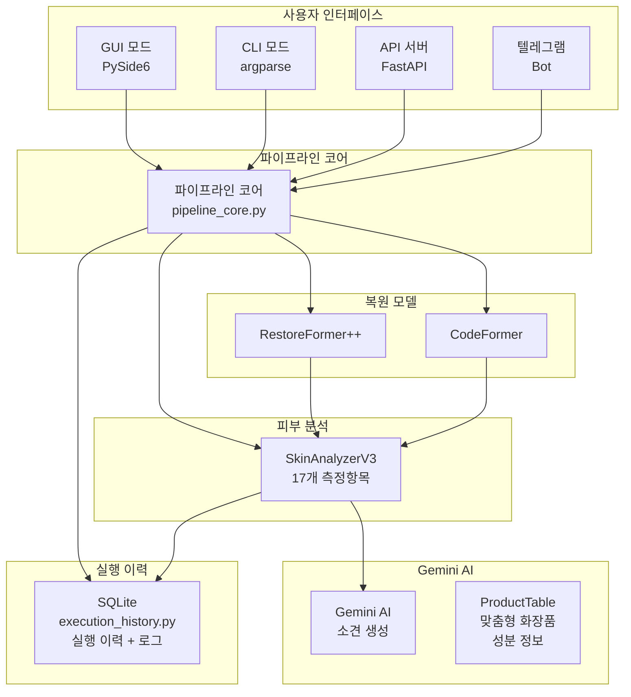
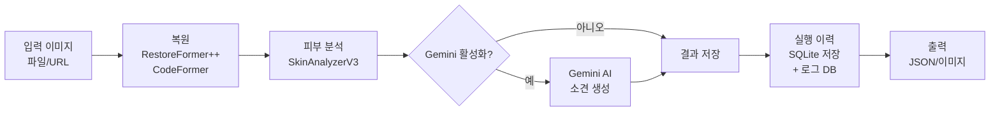

# SkinLens v1.0

AI 기반 피부 분석 및 복원 파이프라인 프로젝트입니다. RestoreFormer++, CodeFormer를 활용한 이미지 복원과 SkinAnalyzerV3를 통한 피부 상태 분석을 제공합니다.

[REFACTOR 2026-05-16] Stable Diffusion 기능 제거 (사용하지 않음)
[REFACTOR 2026-05-24] 프로젝트명 변경: CÔTELEAF Skin Analysis v3 → SkinLens v1.0

## 📋 목차

- [프로젝트 개요](#프로젝트-개요)
- [프로젝트 전체 개요](#프로젝트-전체-개요)
- [아키텍처](#아키텍처)
- [디렉토리 구조](#디렉토리-구조)
- [빠른 시작](#빠른-시작)
- [사용법](#사용법)
- [API 서버](#api-서버)
- [DB 관리](#db-관리)
- [테스트](#테스트)
- [문서](#문서)
- [환경변수](#환경변수)
- [코드 리뷰 반영](#코드-리뷰-반영)

## 프로젝트 개요

### 주요 기능

- **이미지 복원**: RestoreFormer++, CodeFormer를 활용한 고품질 이미지 복원
- **피부 분석**: 18개 측정항목 기반 피부 상태 분석 (색소, 홍조, 모공, 주름 등)
- **Gemini AI 소견**: Google Gemini를 활용한 AI 기반 피부 소견 생성
- **맞춤형 화장품 추천**: 설문 응답과 측정 점수를 기반으로 당사 맞춤형 화장품 자동 추천 (ProductTable 기반)
- **CLI 모드**: 서버 환경에서 GUI 없이 동작하는 명령줄 인터페이스
- **GUI 모드**: PySide6 기반 그래픽 사용자 인터페이스
- **API 서버**: FastAPI 기반 REST API 서버
- **실행 이력**: SQLite 기반 실행 이력 추적 및 리소스 모니터링
- **로그 DB**: 애플리케이션 로그 DB 저장 및 다운로드 API (롤링 방식 자동 정리)
- **텔레그램 알림**: 분석 결과 및 시스템 상태 텔레그램 알림
- **보안 기능**: JWT 인증 (시크릿 키 검증), 역할 기반 접근 제어, 감사 로그, 속도 제한 (분석 엔드포인트 3/분)
- **DB 관리**: Health Check, 자동 백업, 마이그레이션, 아카이빙, 연결 풀링, 트랜잭션 관리

### 점수 표시 정책

- **출력 JSON**: 모든 점수는 정수로 표시됩니다 (소수점 없음)
  - `internal_analysis.original.overall_score`: 정수 (예: 65)
  - `internal_analysis.original.*_score`: 정수 (예: 56, 72, 68)
  - `internal_analysis.original.perceived_age`: 정수 (예: 38)
  - `llm_analysis.original.overall_score`: 정수 (예: 65)
  - `llm_analysis.original.perceived_age`: 정수 (예: 38)
  - `llm_analysis.*.match_score`: 정수 (예: 1)
- **내부 계산**: float로 유지 (정밀도 보장)
- **GUI 표시**: 18항목 비교창 및 모든 점수 표시는 정수로 표시 (인지 나이 포함)
- **변환 위치**:
  - CLI/서버: `src/cli/skin_analysis_cli.py`의 `_convert_scores_to_int()` 함수
  - LLM 보고서: `src/llm/llm_utils.py`의 `report_to_dict()` 함수
  - GUI: `src/gui/compare_dialog.py` 및 `src/gui/analyzer_compare_gui.py`의 표시 로직

### 기술 스택

- **Deep Learning**: PyTorch, Transformers
- **이미지 처리**: OpenCV, PIL, scikit-image
- **GUI**: PySide6
- **Web API**: FastAPI, Uvicorn
- **AI**: Google Generative AI (Gemini)
- **데이터베이스**: SQLite, Supabase (PostgreSQL)
- **보안**: python-jose (JWT), passlib, slowapi
- **DB 관리**: tenacity (재시도), click (CLI)

## 프로젝트 전체 개요

프로젝트의 전체적인 개요, 비전, 기술 스택 상세, 아키텍처, 로드맵 등을 포괄적으로 설명하는 문서는 [docs/PROJECT_OVERVIEW.md](docs/PROJECT_OVERVIEW.md)를 참조하세요.

이 문서는 다음 내용을 포함합니다:
- 프로젝트 비전 및 목표
- 상세 기술 스택
- 17개 측정항목 상세 설명
- 전체 디렉토리 구조
- 주요 기능 상세 설명
- 코드 리뷰 반영 이력
- 단기/중기/장기 로드맵

## 아키텍처

### 시스템 구성도



### 데이터 흐름



## 디렉토리 구조

```
SkinLens v1.0/
├── src/                        # 소스 코드
│   ├── cli/                    # CLI 모듈
│   ├── config/                 # 설정 모듈
│   ├── gui/                    # GUI 모듈
│   ├── server/                 # FastAPI 서버
│   ├── telegram/               # 텔레그램 모듈
│   ├── skin/                   # 피부 분석 코어
│   ├── pipeline/               # 파이프라인
│   ├── scoring/                # 점수 계산
│   ├── llm/                    # LLM 모듈
│   ├── db/                     # 데이터베이스
│   ├── restoration/            # 복원 모듈
│   ├── prescription/            # 처방전 모듈
│   └── utils/                  # 공통 유틸리티
├── config/                     # 설정 파일
│   └── config.json             # 메인 설정
├── external/                   # 외부 모델 (git 제외)
│   ├── CodeFormer/              # CodeFormer 모델
│   └── RestoreFormerPlusPlus/  # RestoreFormer++ 모델
├── docs/                       # 문서
│   ├── api/                    # API 문서
│   │   ├── API_GUIDE.md
│   │   └── API_DOCUMENTATION.md
│   ├── user/                   # 사용자 가이드
│   │   ├── USER_GUIDE.md
│   │   ├── PRODUCT_PURCHASE_GUIDE.md
│   │   ├── SERUM_PRESCRIPTION_CUSTOMER_GUIDE.md
│   │   └── MOBILE_APP_GUIDE.md
│   ├── ops/                    # 운영 가이드
│   │   ├── DEPLOYMENT_GUIDE.md
│   │   ├── MONITORING_GUIDE.md
│   │   ├── INCIDENT_RESPONSE_GUIDE.md
│   │   ├── SERVER_TEST_GUIDE.md
│   │   └── LINUX_DOCKER_DEPLOYMENT.md
│   ├── design/                 # 설계 문서
│   │   ├── SCORE_CORRECTION_DESIGN.md
│   │   ├── SKIN_TYPE_AUTO_DETECTION_DESIGN.md
│   │   └── ... (다른 DESIGN 문서들)
│   ├── guides/                 # 기술 가이드
│   │   ├── DEVELOPMENT_GUIDE.md
│   │   ├── ARCHITECTURE_GUIDE.md
│   │   ├── SKIN_SCORING_GUIDE.md
│   │   ├── IMPROVEMENT_PLAN.md
│   │   └── ... (다른 GUIDE 문서들)
│   ├── html/                   # HTML 변환 문서
│   └── db/                     # DB 문서
├── scripts/                    # 유틸리티 스크립트
│   ├── batch_report.py
│   ├── bp_optimizer.py
│   ├── score_bias_monitor.py
│   ├── check_llm_models.py
│   ├── monitors.py
│   ├── deploy/                 # 배포 스크립트
│   └── run_server_tests.bat
├── tests/                      # 테스트
│   ├── test_*.py
│   └── README.md
├── archive/                    # 아카이브 (git 제외)
│   └── model-serving-refactor/ # 리팩토링/레거시 코드
├── results/                    # 결과 파일 (git 제외)
│   ├── 이미지명/               # 분석 결과별 폴더
│   ├── api_jobs/               # 서버 API 작업
│   ├── exports/                # 엑셀/CSV 내보내기
│   ├── images/                 # 입력 이미지 저장소
│   ├── logs/                   # 로그 파일
│   └── weights/                # 모델 가중치
├── logs/                       # 런타임 로그 (git 제외)
├── main.py                     # 메인 진입점
├── pyproject.toml              # 프로젝트 설정
├── requirements.txt            # 전체 의존성
├── requirements-core.txt       # 코어 의존성 (서버/CLI)
├── requirements-dev.txt        # 개발 의존성
├── requirements-gui.txt        # GUI 의존성
├── pytest.ini                  # pytest 설정
└── README.md                   # 이 파일
```

## 빠른 시작

### 사전 요구사항

- Python 3.8+ (**현재 개발 환경: Python 3.12**)
- CUDA 11.8+ (GPU 사용 시)
- 16GB+ RAM (GPU 사용 권장)

### 설치

```bash
# 코어 의존성 설치 (서버/CLI)
pip install -r requirements-core.txt

# GUI 의존성 설치 (GUI 모드 사용 시)
pip install -r requirements-gui.txt
```

### 환경변수 설정

```bash
# 실행 이력 데이터베이스 경로
set EXECUTION_HISTORY_DB=data/db/execution_history.db

# API 서버 설정
set SKIN_API_JOBS_DIR=./results/api_jobs
set SKIN_API_MAX_WORKERS=2
```

## 사용법

### GUI 모드

```bash
python main.py
```

### CLI 모드

```bash
# 기본 사용 (Gemini 소견 활성)
python main.py --cli -i input.jpg -o output_dir

# Gemini 소견 비활성화
python main.py --cli -i input.jpg -o output_dir --no-gemini-report

# 비동기 모드
python main.py --cli -i input.jpg -o output_dir --async
```

### CLI 파라미터

- `-i, --input`: 입력 이미지 경로 (필수)
- `-o, --output`: 출력 디렉토리 경로 (필수)
- `--no-restore`: 복원 생략
- `--llm-report`: LLM 소견 생성 (기본: True, 비활성화하려면 `--no-llm-report` 사용)
- `--llm-api-key`: LLM API 키 (지정하지 않으면 config.secrets.json에서 자동 로드)
- `--customer-id`: 고객 ID
- `--gender`: 성별
- `--age`: 연령
- `--race`: 인종
- `--region`: 지역
- `--debug`: 디버그 모드

**참고:**
- LLM 소견 생성은 기본적으로 활성화되어 있습니다
- LLM API 키는 지정하지 않으면 `config/config.secrets.json`에서 자동 로드됩니다

## API 서버

### 실행

```bash
python main.py  # 또는
uvicorn src.server.server:app --host 0.0.0.0 --port 8000
```

### API 엔드포인트

- `GET /health`: 헬스 체크
- `POST /v1/analysis/jobs`: 분석 Job 생성
- `GET /v1/analysis/jobs/{job_id}`: Job 상태 조회
- `GET /v1/analysis/jobs/{job_id}/result`: Job 결과 조회
- `GET /v1/analysis/jobs/{job_id}/artifacts/{name}`: 아티팩트 다운로드
- `WS /v1/ws/analyze/{job_id}`: WebSocket 진행률 트래킹

### WebSocket 진행률 트래킹

WebSocket을 사용하여 실시간 진행률을 수신할 수 있습니다.

**클라이언트 연결 예시 (JavaScript):**
```javascript
const jobId = "your-job-id";
const ws = new WebSocket(`ws://localhost:8000/v1/ws/analyze/${jobId}`);

ws.onmessage = (event) => {
    const data = JSON.parse(event.data);
    if (data.type === 'progress') {
        console.log(`${data.percent}% - ${data.message}`);
    } else if (data.type === 'complete') {
        console.log('완료:', data.result);
    } else if (data.type === 'error') {
        console.error('오류:', data.error);
    }
};
```

**메시지 형식:**
- 진행률: `{"type": "progress", "stage": "restore", "percent": 30, "message": "복원 중..."}`
- 완료: `{"type": "complete", "result": {...}}`
- 에러: `{"type": "error", "error": "에러 메시지"}`

**클라이언트 예제:** [docs/websocket_client_example.html](docs/websocket_client_example.html)

### API 문서

- Swagger UI: `http://localhost:8000/docs`
- ReDoc: `http://localhost:8000/redoc`

자세한 내용은 [docs/API_GUIDE.md](docs/API_GUIDE.md)를 참조하세요.

## 테스트

### 테스트 실행

```bash
# 모든 테스트
pytest tests/ -v

# CLI 테스트
pytest tests/test_cli.py -v

# 서버 테스트
pytest tests/test_server.py -v
```

### 테스트 커버리지

- `test_cli.py`: CLI 파이프라인 및 파라미터 테스트
- `test_server.py`: FastAPI API 엔드포인트 테스트

자세한 내용은 [tests/README.md](tests/README.md)를 참조하세요.

## 문서

### API 문서 (docs/api/)
- [API_GUIDE.md](docs/api/API_GUIDE.md): FastAPI 서버 사용 가이드
- [API_DOCUMENTATION.md](docs/api/API_DOCUMENTATION.md): API 엔드포인트 참조

### 사용자 가이드 (docs/user/)
- [USER_GUIDE.md](docs/user/USER_GUIDE.md): 사용자 매뉴얼
- [PRODUCT_PURCHASE_GUIDE.md](docs/user/PRODUCT_PURCHASE_GUIDE.md): 제품 구매 가이드
- [SERUM_PRESCRIPTION_CUSTOMER_GUIDE.md](docs/user/SERUM_PRESCRIPTION_CUSTOMER_GUIDE.md): 세럼 처방 가이드
- [MOBILE_APP_GUIDE.md](docs/user/MOBILE_APP_GUIDE.md): 모바일 앱 가이드

### 운영 가이드 (docs/ops/)
- [DEPLOYMENT_GUIDE.md](docs/ops/DEPLOYMENT_GUIDE.md): 배포 가이드
- [MONITORING_GUIDE.md](docs/ops/MONITORING_GUIDE.md): 모니터링 가이드
- [INCIDENT_RESPONSE_GUIDE.md](docs/ops/INCIDENT_RESPONSE_GUIDE.md): 장애 대응 가이드
- [SERVER_TEST_GUIDE.md](docs/ops/SERVER_TEST_GUIDE.md): 서버 테스트 가이드
- [LINUX_DOCKER_DEPLOYMENT.md](docs/ops/LINUX_DOCKER_DEPLOYMENT.md): 리눅스 Docker 배포 가이드

### 설계 문서 (docs/design/)
- [SCORE_CORRECTION_DESIGN.md](docs/design/SCORE_CORRECTION_DESIGN.md): 점수 보정 설계
- [SKIN_TYPE_AUTO_DETECTION_DESIGN.md](docs/design/SKIN_TYPE_AUTO_DETECTION_DESIGN.md): 피부 타입 자동 감지 설계
- ... (다른 DESIGN 문서들)

### 기술 가이드 (docs/guides/)
- [PROJECT_OVERVIEW.md](docs/PROJECT_OVERVIEW.md): 프로젝트 전체 개요 (비전, 아키텍처, 로드맵)
- [DEVELOPMENT_GUIDE.md](docs/guides/DEVELOPMENT_GUIDE.md): 개발 가이드
- [ARCHITECTURE_GUIDE.md](docs/guides/ARCHITECTURE_GUIDE.md): 아키텍처 가이드
- [SKIN_SCORING_GUIDE.md](docs/guides/SKIN_SCORING_GUIDE.md): 스코어링 가이드
- [IMPROVEMENT_PLAN.md](docs/guides/IMPROVEMENT_PLAN.md): 개선 계획
- [JSON_IO_FLOW.md](docs/guides/JSON_IO_FLOW.md): 데이터 처리 흐름
- [RESTORATION_ENGINE_GUIDE.md](docs/guides/RESTORATION_ENGINE_GUIDE.md): 복원 엔진 추가 가이드
- [CODE_REVIEW_HISTORY.md](docs/project/CODE_REVIEW_HISTORY.md): 코드 리뷰 이력
- [PRESCRIPTION_GUIDE.md](docs/guides/PRESCRIPTION_GUIDE.md): 처방 가이드
- [IMAGE_ENHANCER_GUIDE.md](docs/user/IMAGE_ENHANCER_GUIDE.md): 이미지 인핸서 가이드
- [LLM_PROMPT_TEMPLATE.md](docs/guides/LLM_PROMPT_TEMPLATE.md): LLM 프롬프트 템플릿
- ... (다른 GUIDE 문서들)

### 테스트 가이드
- [tests/README.md](tests/README.md): 테스트 실행 가이드

## DB 관리

### CLI 명령어

```bash
# DB 백업
python src/db/db_cli.py backup

# DB 상태 확인
python src/db/db_cli.py status

# DB 마이그레이션
python src/db/db_cli.py migrate

# 데이터 아카이빙
python src/db/db_cli.py archive --days=90

# 읽기 전용 복제본 생성
python src/db/db_cli.py replica --output=readonly.db
```

### DB Health Check API

```bash
# DB 상태 확인
curl http://localhost:8000/v1/health/db

# DB 메트릭 (관리자 전용)
curl http://localhost:8000/v1/admin/db/metrics \
  -H "Authorization: Bearer <admin_token>"

# 감사 로그 요약 (관리자 전용)
curl http://localhost:8000/v1/admin/audit/summary?days=30 \
  -H "Authorization: Bearer <admin_token>"
```

## 환경변수

### 실행 이력

- `EXECUTION_HISTORY_DB`: 실행 이력 데이터베이스 경로 (기본: data/db/execution_history.db)

### API 서버

- `SKIN_API_JOBS_DIR`: Job 저장 루트 디렉토리 (기본: ./results/api_jobs)
- `SKIN_API_MAX_WORKERS`: 백그라운드 워커 스레드 수 (기본: 2)
- `SKIN_API_URL_TIMEOUT`: URL 다운로드 타임아웃 (초, 기본: 10)
- `SKIN_API_URL_MAX_BYTES`: URL 다운로드 최대 크기 (바이트, 기본: 10MB)

### 텔레그램

- `TELEGRAM_BOT_TOKEN`: 텔레그램 봇 토큰
- `TELEGRAM_CHAT_ID`: 텔레그램 채트 ID

### Gemini AI

- `GEMINI_API_KEY`: Google Gemini API 키

### 보안

- `JWT_SECRET_KEY`: JWT 토큰 시크릿 키 (프로덕션에서 반드시 변경)
- `ALLOWED_ORIGINS`: CORS 허용 오리진 (콤마로 구분)

### DB 백업

- `SKIN_API_BACKUP_INTERVAL_H`: 자동 백업 간격 (시간, 기본: 24)
- `SKIN_API_BACKUP_DIR`: 백업 디렉토리 (기본: backup)

## 코드 리뷰 반영 (SkinLens_v1_코드리뷰.md 기반)

### 보안 강화 (P0, P1)

- **JWT 시크릿 키 검증**: 서버 시작 시 기본값 사용 시 거부
- **분석 엔드포인트 Rate Limit**: 3회/분 제한 적용
- **DB 테이블 중복 생성 제거**: 암호화 클래스에서 테이블 초기화 제거
- **업로드 경로 Traversal 방어**: `_safe_filename()` 적용 + `validate_path_within_directory()` 추가
- **업로드 세션 IDOR 방어**: 세션에 `owner_customer_id` 저장 후 매 호출 검증
- **Job 조회/다운로드 인가 추가**: 인증 Depends + job meta의 `customer_id`와 JWT `sub` 일치 검증
- **callback_url SSRF 방어**: `is_ssrf_blocked_host()` 함수로 차단
- **인가 함수 인자순서 오류 수정**: `validate_customer_id_match` 인자 순서 수정
- **rate-limit 키 생성 버그 수정**: `algorithms=[get_algorithm()]` 사용

### 코드 구조 개선

- **DB 초기화 함수 분리**: 260줄 단일 함수를 4개 서브 함수로 분리
- **트랜잭션 추가**: DB 초기화 시 트랜잭션으로 원자성 보장
- **version.py Dict import 추가**: 타입 어노테이션을 위한 import 추가

### 의존성 관리

- **requirements.txt 포워드 참조**: opencv 중복 제거

### 예외 처리 개선 (P2)

- **except Exception 광범위 포착 축소**: 75개소를 구체적 예외로 변경
  - DB 관련: `sqlite3.Error`, `ValueError`
  - 파일/OS 관련: `OSError`, `IOError`, `shutil.Error`
  - HTTP 관련: `httpx.HTTPError`, `requests.RequestException`
  - WebSocket 관련: `RuntimeError`, `ConnectionError`
  - SMTP 관련: `smtplib.SMTPException`
  - JWT 관련: `jwt.DecodeError`, `jwt.InvalidTokenError`
  - Zip 관련: `zipfile.BadZipFile`
  - JSON 관련: `json.JSONDecodeError`
  - 이미지 관련: `PIL.UnidentifiedImageError`
  - 수정된 파일: admin.py(33), stats.py(9), websocket.py(7), integration.py(11), backup.py(6), monitoring.py(2), server.py(4), jobs.py(3), logs.py(2), enhancements.py(1), auth.py(1), job_queue.py(2), deps.py(1), middleware(2)

### 로깅 개선 (P2)

- **non-CLI print() → logging**: GUI 모듈의 디버그/에러 print()를 logging으로 변경
  - dialog_helpers.py: stderr 에러 메시지를 logging.error()로 변경 (4개소), 디버그 print()를 logging.debug()로 변경 (1개소)
  - image_enhancer.py: import 에러 메시지를 logging.error()로 변경 (2개소)
  - dialog_utils.py: 디버그 print()를 제거하고 logging.debug()만 사용 (1개소)
  - product_repository.py: 데모 코드 print()를 logging.info()로 변경 (5개소)
  - 사용자 출력용 print() (JSON, 리포트, 진행률 등)은 유지

### 리팩토링 (AI_Skin_v3_refactor_review.md)

#### Phase 1 - 즉시 수정 (완료)

- **P0-1**: skin_measurement_chart_dialog.py `src.gemini` → `src.llm` 경로 수정 (런타임 크래시 방지)
- **P1-1**: utils.py analyzer_compare_gui lazy import 처리 (이미 구현됨)
- **P2-2**: server.py `datetime.utcnow()` → `datetime.now(timezone.utc)` (Python 3.12 deprecated)

#### Phase 2 - 안정성 (완료)

- **P1-2**: skin_scoring.py 전역 가변 상태 threading.Lock 추가 (race condition 방지)
- **P1-3**: skin_scoring.py `_MEASUREMENT_ACTUAL_RANGES` lazy 초기화 (import 시 파일 I/O 방지)
- **P2-1**: pipeline_core.py print() → log 교체 (이미 구현됨)

#### 복원 엔진 전처리/후처리 확장 (2026-05-16)

- **pipeline_core.py**: 복원 엔진 입력/출력 단에 전처리/후처리 함수 추가
  - _preprocess_image(): 스마트폰 이미지 리사이징 기능 포함 (config.json에서 리사이즈 크기 로드)
  - _postprocess_image(): 이미지 후처리 더미 (현재는 입력 그대로 반환)
  - _stage_pipeline_input_rgb(): 리사이징 로직 제거, 단순 RGB 변환만 담당
  - run_restoreformer(), run_codeformer()에 전처리/후처리 호출 추가
- **구조 개선**: 리사이징 로직이 전처리 단으로 이동하여 파이프라인 구조 개선
- **확장성**: 향후 노이즈 제거, 색상 보정, 대비 조정, 아티팩트 제거 등 로직 추가 예정

#### 코드 품질 개선 (AI_Skin_v3_deep_review.md 기반) (2026-05-16)

- **P0-1**: src.gemini → src.llm import 경로 수정 (이미 해결됨)
- **P1-5**: datetime.utcnow() → datetime.now(timezone.utc) 수정 (이미 해결됨)
- **P1-1**: utils.py GUI 직접 의존 → lazy import 수정 (이미 해결됨)

### 남은 작업 (별도 대규모 리팩토링)

#### 보안 강화 (P0, P1) - 완료

- **P0-1**: Job 조회/결과/아티팩트 GET 3종에 인증+소유권 검증 추가 완료
- **P0-2**: _apply_advanced_score_correction 버그 수정 완료
- **P0-3**: 업로드 file_name 정제·경로검증 완료
- **P0-4**: 업로드 세션 소유권 검증 완료
- **P1-5**: validate_customer_id_match 인자 순서 교정 완료
- **P1-6**: callback_url SSRF 검증 + HMAC 서명 완료
- **P1-7**: 인증을 DB 사용자/bcrypt 기반으로 전환 완료
- **P1-8**: DB 의존성을 싱글톤으로 전환 완료
- **P1-9**: get_rate_limit_key의 algorithms 수정 완료

#### 아키텍처 정리 (P2) - 완료

- **deps.py 설정 중복 해결**: 모듈 레벨 상수(`SECRET_KEY`, `ALLOWED_EXT` 등)와 getter(`get_secret_key()` 등)가 동시에 존재. config 핫리로드를 진짜로 지원하려면 라우터들이 상수 import를 멈추고 getter만 쓰도록 정리 완료
  - upload.py: MAX_UPLOAD_BYTES → get_max_upload_bytes() getter 사용
  - jobs.py: MAX_UPLOAD_BYTES, ALLOWED_EXT, SERVER_URL → getter 사용
- **분석기 이중 아키텍처 수렴**: `redness.py`(standalone 함수)와 `strategies/redness_analyzer.py`(BaseAnalyzer 래퍼)가 공존. 단일 진실을 위해 한쪽으로 수렴 완료
  - redness.py 알고리즘을 redness_analyzer.py로 통합
  - 하위 호환성을 위한 analyze_redness() 별칭 함수 유지
  - redness.py 삭제
- **백그라운드 태스크 참조 보관**: `server.py`에서 `asyncio.create_task()`로 생성된 태스크를 변수로 잡아두지 않아 GC 대상이 될 수 있음. 모듈/`app.state`에 `set`으로 보관 완료
- **DB 커넥션 누수 수정**: `_system_health_monitor`가 5분마다 `ExecutionHistoryDB(...)`를 새로 생성하고 닫지 않음. 싱글톤 사용으로 수정 완료

#### 기타 개선 (P2) - 완료

- **GUI 종료 처리 단순화**: image_enhancer.py에서 이중/삼중 종료 예약 제거, 단일 quit 호출로 단순화
- **telegram/notifier.py 파일 분할**: 1,239 LOC를 3개 파일로 분리 (notifier.py, statistics_collector.py, fault_reporter.py)
- **패키징 문제**: .gitignore에 이미 필요한 파일 포함됨 (backup/, results/*.db, __pycache__/, archive/ 등)
- **예외 처리 개선**: 75개소 except Exception 축소 완료
- **로깅 개선**: 13개소 non-CLI print() → logging 완료
- **기타 P2 항목**: 가중치 캐시 핫리로드, filter_sensitive_data 비문자열 마스킹, SSRF DNS rebinding 방어, _monitor_score_difference warning 로깅 등 완료

#### Phase 2 안정성 개선 (2026-05-16)

- **Phase 2.2**: strip-norm 루프 3중 복제 제거 (_strip_normalize_L 공통 함수 추가)
- **Phase 2.3**: pig_mask 생성 로직 2중 복제 제거 (_make_pigment_mask 헬퍼 메서드 추가)
- **Phase 2.4**: safety_net.py print() → log (8개)
- **Phase 2.5**: _clamp() 중복 정의 통합 (skin_scoring.py / v3_compose.py)
- **Phase 2.6**: 상수 클래스 추출 (score_constants.py 신규, RednessConst)
- **코드 품질**: 중복 제거, 유지보수성 향상
- **로깅**: 서버 환경 로깅 표준화

#### Phase 3 로깅 개선 (2026-05-16)

- **Phase 3.4**: llm_skin_report.py print() → log (60개 DEBUG 메시지)
- **Phase 3.1-3.3**: 대규모 리팩토링 항목은 별도 작업으로 진행 예정
  - execution_history.py → 패키지 분리
  - server.py → routers 분리
  - _SkinAnalyzerV2 Mixin 분리

#### 매직넘버 외부 주입 (2026-05-16)

- **V3_WEIGHTS**: v3.0 종합점수 가중치를 config.json으로 이동 (10개 항목)
- **이미지 처리 파라미터**: CLAHE, blob_detection, freckle_detection 파라미터를 config.json으로 이동
- **Breakpoints**: 점수 매핑 브레이크포인트 14개를 config.json으로 이동
  - melasma_score, freckle_score, freckle_score_count, redness_score
  - post_inflammatory_erythema_score, acne_score, post_acne_pigment_score
  - pore_size_score, pore_sagging_score, eye_wrinkle_score, nasolabial_wrinkle_score
  - roughness_score, jawline_blur_score
- **코드 수정**: skin_scoring.py에 helper 함수 추가
  - _get_image_processing_params(), _get_clahe_params(), _get_blob_detection_params(), _get_freckle_detection_params()
  - _get_default_breakpoints(), _get_metric_bp(), _get_metric_bp_count()
- **유지보수성**: 하드코딩된 매직넘버를 외부 설정으로 분리하여 점수 조정 용이화

#### 맞춤형 화장품 추천 (2026-05-21)

- **ProductTable DB 테이블**: 맞춤형 화장품 성분 정보 저장 (products 테이블)
- **ProductRepository**: 제품 조회 및 매칭 로직 구현
  - 고민사항 기반 매칭 (+0.5 점)
  - 피부 타입 기반 매칭 (+0.3 점)
  - 측정 점수 기반 매칭 (+0.2 점)
  - match_score 계산 및 정렬
- **LLM 프롬프트 템플릿**: 성분 정보 포함 섹션 추가
- **llm_skin_report.py**: product_recommendations 필드 추가
- **image_enhancer.py**: 제품 매칭 로직 및 JSON 출력 추가
- **조건부 동작**: ProductTable 데이터가 없을 때는 에러 없이 진행, 데이터 추가 시 자동 동작
- **결과 JSON**: llm_analysis.product_recommendations 포함

자세한 내용은 [PROJECT_OVERVIEW.md](PROJECT_OVERVIEW.md#32-데이터-처리-흐름) 및 [JSON_IO_FLOW.md](docs/JSON_IO_FLOW.md)를 참조하세요.

자세한 내용은 [DATABASE_ARCHITECTURE.md](docs/DATABASE_ARCHITECTURE.md#16-sd-기능-제거-2026-05-16), [DATABASE_ARCHITECTURE.md](docs/DATABASE_ARCHITECTURE.md#17-복원-엔진-전처리후처리-확장-2026-05-16), [DATABASE_ARCHITECTURE.md](docs/DATABASE_ARCHITECTURE.md#18-모공-완화-기능-제거-2026-05-16), [DATABASE_ARCHITECTURE.md](docs/DATABASE_ARCHITECTURE.md#19-코드-품질-개선-ai_skin_v3_deep_reviewmd-기반-2026-05-16), [DATABASE_ARCHITECTURE.md](docs/DATABASE_ARCHITECTURE.md#20-phase-2-안정성-개선-완료-2026-05-16), [DATABASE_ARCHITECTURE.md](docs/DATABASE_ARCHITECTURE.md#21-phase-3-로깅-개선-완료-2026-05-16), 및 [DATABASE_ARCHITECTURE.md](docs/DATABASE_ARCHITECTURE.md#22-매직넘버-외부-주입-완료-2026-05-16)를 참조하세요.

## 배포

### 배포 패키지 생성

민감 정보(비밀 키, 환경 변수 등)를 제외한 배포용 ZIP 패키지를 생성합니다.

#### Linux/macOS

```bash
chmod +x scripts/deploy/deploy.sh
./scripts/deploy/deploy.sh
```

#### Windows (PowerShell)

```powershell
.\scripts\deploy\deploy.ps1
```

### 제외되는 파일/디렉토리

- **민감 정보**: `config/config.secrets.json`, `*.secrets.json`, `.env`, `.env.*`
- **모델 가중치**: `external/RestoreFormerPlusPlus/weights/`, `external/CodeFormer/weights/`, `results/weights/`, `*.ckpt`, `*.pth`
- **외부 모델**: `external/`
- **런타임 생성**: `results/`, `backup/`, `*.db`, `__pycache__/`, `*.pyc`
- **Python 패키지**: `*.egg-info/`, `dist/`, `build/`, `.venv/`

### 배포 후 설정

배포된 패키지를 받은 후 다음 설정이 필요합니다:

1. **비밀 설정 파일 생성**: `config/config.secrets.json` 복사 및 실제 값 입력
2. **환경 변수 설정**: `.env` 파일 생성 또는 시스템 환경 변수 설정
3. **모델 가중치 다운로드**: `results/weights/` 디렉토리에 필요한 가중치 파일 배치

## 라이선스

이 프로젝트는 상업적 목적으로 사용됩니다.
