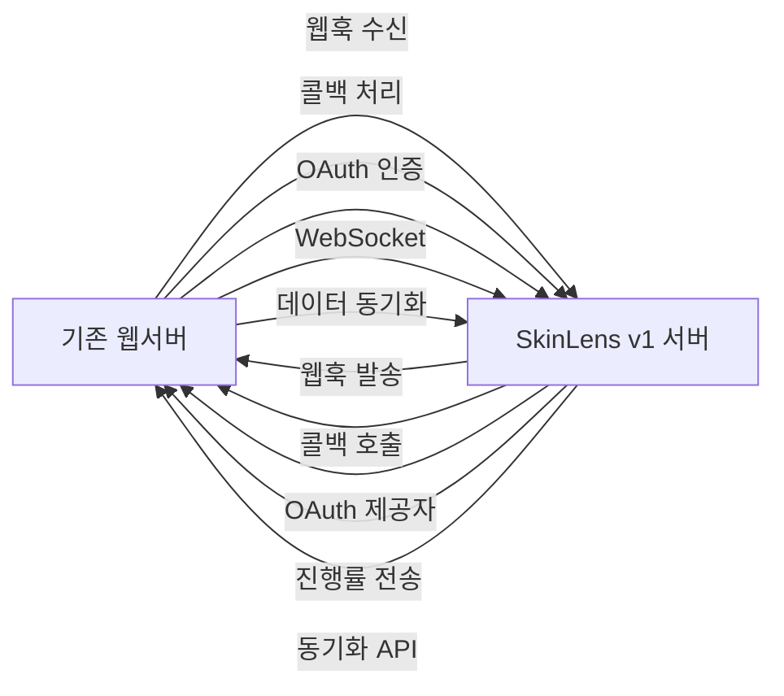
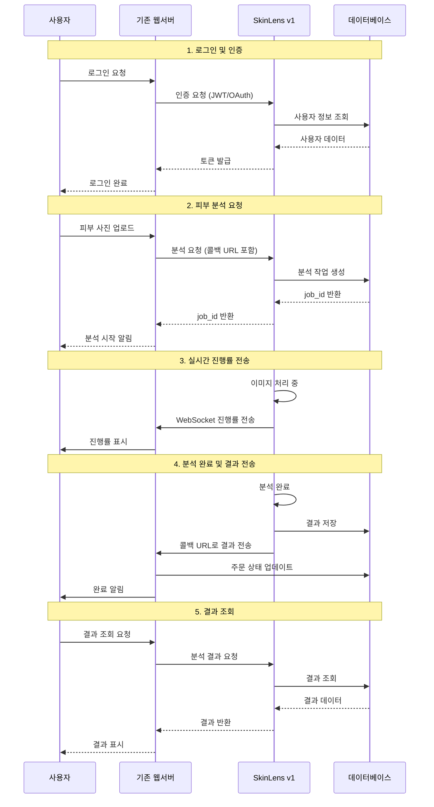
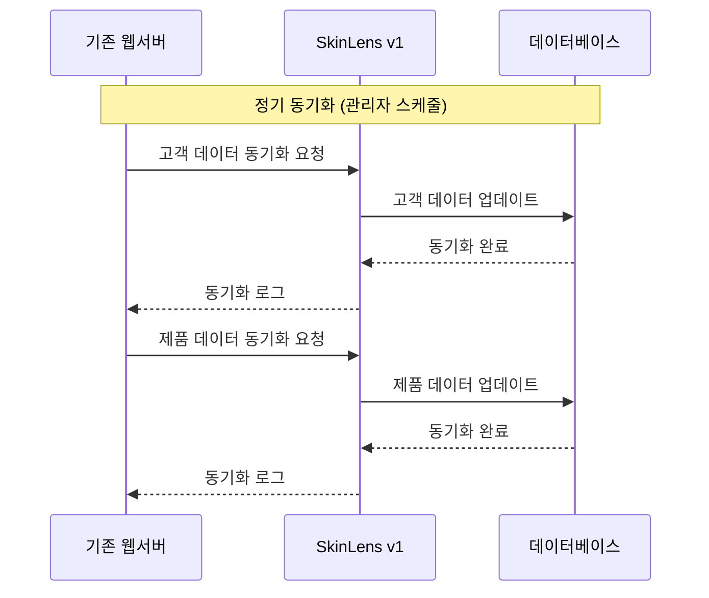
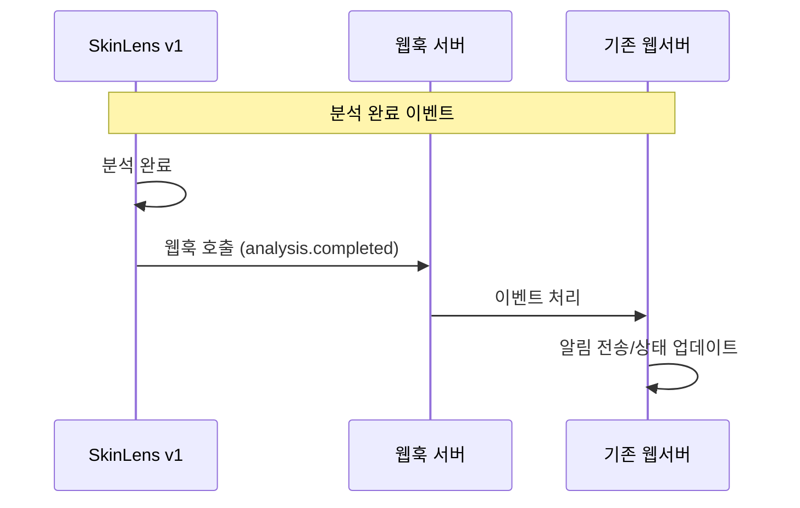
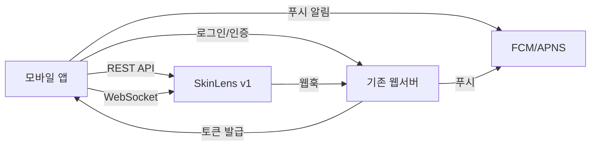
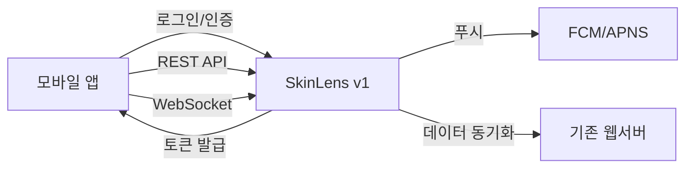
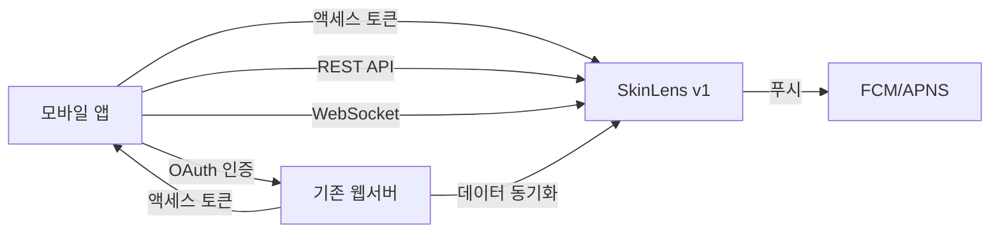
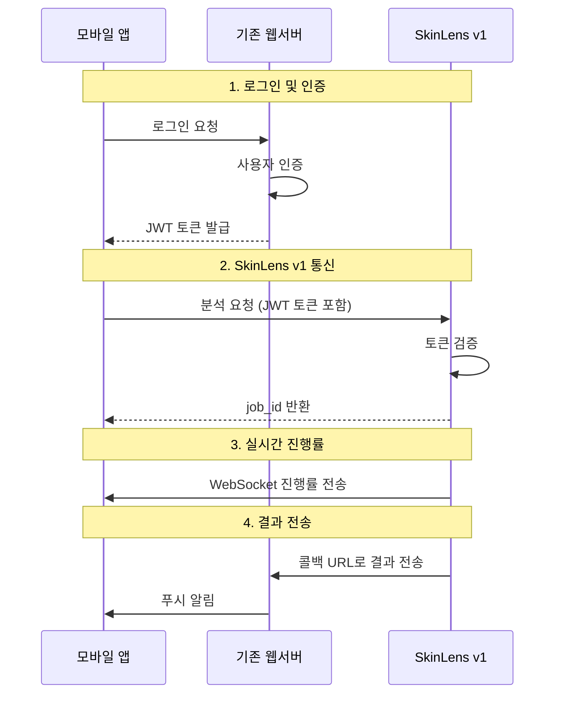
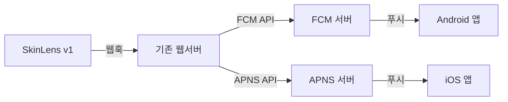
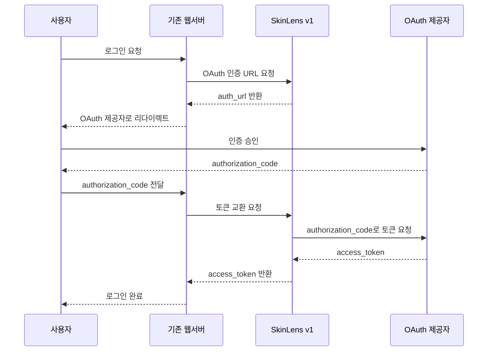

# 외부 시스템 연동 가이드

이 문서는 기존 웹서버와 SkinLens v1 서버를 연동하는 방법을 설명합니다.

## 목차

1. [개요](#개요)
2. [아키텍처](#아키텍처)
3. [사용자 서비스 흐름](#사용자-서비스-흐름)
4. [서비스 흐름 보완 사항](#서비스-흐름-보완-사항)
5. [모바일 앱 연동](#모바일-앱-연동)
6. [인증 방식](#인증-방식)
7. [웹훅 연동](#웹훅-연동)
8. [콜백 URL 사용](#콜백-url-사용)
9. [데이터 동기화](#데이터-동기화)
10. [OAuth/SSO 연동](#oauthsso-연동)
11. [WebSocket 실시간 연동](#websocket-실시간-연동)
12. [CORS 설정](#cors-설정)
13. [예제 코드](#예제-코드)
14. [트러블슈팅](#트러블슈팅)

---

## 개요

SkinLens v1 서버는 기존 웹서버와 쉽게 연동할 수 있는 다양한 API를 제공합니다.

### 지원하는 연동 방식

- **웹훅**: 이벤트 기반 알림
- **콜백 URL**: 비동기 작업 완료 알림
- **데이터 동기화**: 고객/제품 데이터 동기화
- **OAuth/SSO**: 통합 인증
- **WebSocket**: 실시간 진행률 전송
- **REST API**: 표준 HTTP 기반 통신

---

## 아키텍처

### 시스템 다이어그램



### 아키텍처 개요

```
┌─────────────────┐         ┌─────────────────┐
│  기존 웹서버      │         │  SkinLens v1    │
│                 │         │  서버            │
├─────────────────┤         ├─────────────────┤
│ - 웹훅 수신      │◄───────►│ - 웹훅 발송       │
│ - 콜백 처리      │◄───────►│ - 콜백 호출       │
│ - OAuth 인증     │◄───────►│ - OAuth 제공자  │
│ - WebSocket     │◄───────►│ - 진행률 전송     │
│ - 데이터 동기화   │◄───────►│ - 동기화 API    │
└─────────────────┘         └─────────────────┘
```

---

## 사용자 서비스 흐름

### 전체 서비스 흐름 다이어그램



### 단계별 상세 설명

#### 1. 로그인 및 인증

**프로세스:**
1. 사용자가 기존 웹서버에서 로그인 요청
2. 웹서버가 SkinLens v1에 인증 요청 (JWT 또는 OAuth)
3. SkinLens v1이 데이터베이스에서 사용자 정보 조회
4. 인증 성공 시 토큰 발급
5. 웹서버가 사용자에게 로그인 완료 알림

**API 호출:**
```bash
# JWT 로그인
POST /v1/auth/login
{
  "customer_id": "user-001",
  "password": "password"
}

# OAuth 인증 URL 생성
POST /v1/oauth/authorize
{
  "provider_name": "google",
  "customer_id": "user-001"
}
```

**데이터 흐름:**
```
사용자 → 웹서버 → SkinLens v1 → DB
토큰 ← ← ← ←
```

#### 2. 피부 분석 요청

**프로세스:**
1. 사용자가 웹서버에 피부 사진 업로드
2. 웹서버가 SkinLens v1에 분석 요청 (콜백 URL 포함)
3. SkinLens v1이 데이터베이스에 분석 작업 생성
4. job_id 반환 및 웹서버에 전달
5. 웹서버가 사용자에게 분석 시작 알림

**API 호출:**
```bash
POST /v1/analysis/jobs
Authorization: Bearer <jwt-token>
Content-Type: multipart/form-data

callback_url=https://webserver.com/callback
external_reference_id=ORDER-12345
image=@photo.jpg
```

**데이터 흐름:**
```
사용자 → 웹서버 → SkinLens v1 → DB
job_id ← ← ← ←
```

#### 3. 실시간 진행률 전송

**프로세스:**
1. SkinLens v1이 이미지 처리 시작
2. 처리 진행 상황을 WebSocket으로 실시간 전송
3. 웹서버가 진행률을 사용자에게 표시
4. 처리 단계별 메시지 전송 (복원, 분석, 보고서 생성 등)

**WebSocket 연결:**
```javascript
const ws = new WebSocket('ws://skinlens-server/v1/ws/analyze/{job_id}');

ws.onmessage = (event) => {
  const data = JSON.parse(event.data);
  if (data.type === 'progress') {
    updateProgressBar(data.percent, data.message);
  }
};
```

**데이터 흐름:**
```
SkinLens v1 → WebSocket → 웹서버 → 사용자
```

#### 4. 분석 완료 및 결과 전송

**프로세스:**
1. SkinLens v1이 분석 완료
2. 결과를 데이터베이스에 저장
3. 콜백 URL로 결과 전송
4. 웹서버가 주문 상태 업데이트
5. 웹서버가 사용자에게 완료 알림

**콜백 페이로드:**
```json
{
  "job_id": "job-uuid",
  "status": "succeeded",
  "external_reference_id": "ORDER-12345",
  "result": {
    "overall_score_original": 60,
    "overall_score_restored": 75,
    "skin_types": ["지성", "트러블성"]
  },
  "finished_at": "2026-05-30T10:00:00Z"
}
```

**데이터 흐름:**
```
SkinLens v1 → 콜백 URL → 웹서버 → DB
```

#### 5. 결과 조회

**프로세스:**
1. 사용자가 웹서버에서 결과 조회 요청
2. 웹서버가 SkinLens v1에 분석 결과 요청
3. SkinLens v1이 데이터베이스에서 결과 조회
4. 결과 데이터를 웹서버에 반환
5. 웹서버가 사용자에게 결과 표시

**API 호출:**
```bash
GET /v1/analysis/jobs/{job_id}
Authorization: Bearer <jwt-token>
```

**데이터 흐름:**
```
사용자 → 웹서버 → SkinLens v1 → DB
결과 ← ← ← ←
```

### 데이터 동기화 흐름

**백그라운드 동기화:**


### 웹훅 이벤트 흐름

**이벤트 기반 알림:**


---

## 서비스 흐름 보완 사항

### 1. 에러 처리 및 재시도 메커니즘

#### 에러 처리 전략

**일시적 오류 (Transient Errors):**
- 네트워크 타임아웃
- 서버 과부하 (503 Service Unavailable)
- 임시 서버 오류 (502 Bad Gateway)

**영구적 오류 (Permanent Errors):**
- 인증 실패 (401 Unauthorized)
- 권한 부족 (403 Forbidden)
- 잘못된 요청 (400 Bad Request)
- 리소스 없음 (404 Not Found)

#### 재시도 정책

**지수 백오프 (Exponential Backoff):**
```python
import time
import random

def retry_with_backoff(func, max_retries=3, base_delay=1):
    for attempt in range(max_retries):
        try:
            return func()
        except Exception as e:
            if attempt == max_retries - 1:
                raise
            delay = base_delay * (2 ** attempt) + random.uniform(0, 1)
            time.sleep(delay)
```

**재시도 조건:**
- 네트워크 오류
- 5xx 서버 오류
- 타임아웃

**재시도 제외:**
- 4xx 클라이언트 오류
- 인증 실패
- 권한 부족

#### 서킷 브레이커 패턴

```python
from circuitbreaker import circuit

@circuit(failure_threshold=5, recovery_timeout=60)
def call_skinlens_api():
    # API 호출
    pass
```

---

### 2. 속도 제한 (Rate Limiting)

#### 속도 제한 전략

**역할별 속도 제한:**
- customer: 30 requests/minute
- admin: 100 requests/minute
- analyst: 60 requests/minute

#### 속도 제한 구현

**클라이언트 측:**
```python
import time
from collections import deque

class RateLimiter:
    def __init__(self, max_requests, time_window):
        self.max_requests = max_requests
        self.time_window = time_window
        self.requests = deque()
    
    def allow_request(self):
        now = time.time()
        # 윈도우 외 요청 제거
        while self.requests and self.requests[0] < now - self.time_window:
            self.requests.popleft()
        
        if len(self.requests) < self.max_requests:
            self.requests.append(now)
            return True
        return False
```

**서버 측:**
- SlowAPI 미들웨어 사용
- Redis 기반 분산 속도 제한

#### 속도 제한 응답

```json
{
  "detail": "Rate limit exceeded. Please try again later.",
  "retry_after": 30
}
```

---

### 3. 로깅 및 모니터링

#### 로깅 전략

**로그 레벨:**
- DEBUG: 디버깅 정보
- INFO: 일반 정보
- WARNING: 경고
- ERROR: 오류
- CRITICAL: 치명적 오류

**로그 포맷:**
```json
{
  "timestamp": "2026-05-31T10:00:00Z",
  "level": "INFO",
  "service": "skinlens-integration",
  "customer_id": "CUST001",
  "job_id": "job-uuid",
  "message": "Analysis completed successfully",
  "duration_ms": 5000
}
```

#### 모니터링 지표

**핵심 지표:**
- API 응답 시간
- 요청 수 (RPS)
- 에러율
- 분석 작업 대기 시간
- 웹훅 전송 성공률

#### 알림 설정

**알림 조건:**
- 에러율 > 5%
- 응답 시간 > 5초
- 웹훅 전송 실패 > 10%
- 분석 작업 실패 > 10%

---

### 4. 보안 강화

#### HTTPS 강제

```python
# FastAPI HTTPS 리다이렉트
from fastapi import FastAPI, Request
from fastapi.responses import RedirectResponse

@app.middleware("http")
async def https_redirect(request: Request, call_next):
    if request.url.scheme != "https":
        return RedirectResponse(url=request.url.replace(scheme="https"))
    return await call_next(request)
```

#### 인증서 고정 (Certificate Pinning)

**iOS (Swift):**
```swift
func configureCertificatePinning() {
    let manager = ServerTrustManager(evaluators: [
        "skinlens-server.com": PinnedCertificatesTrustEvaluator(
            certificates: [
                Certificates.certificate(named: "skinlens-cert")
            ]
        )
    ])
    let session = Session(delegate: SessionDelegate(), serverTrustManager: manager)
}
```

**Android (Kotlin):**
```kotlin
fun configureCertificatePinning() {
    val pinning = CertificatePinner.Builder()
        .add("skinlens-server.com", "sha256/AAAAAAAAAAAAAAAAAAAAAAAAAAAAAAAAAAAAAAAAAAA=")
        .build()
    
    val client = OkHttpClient.Builder()
        .certificatePinner(pinning)
        .build()
}
```

#### 요청 서명

```python
import hmac
import hashlib
import time

def sign_request(api_key: str, secret_key: str, payload: dict) -> dict:
    timestamp = str(int(time.time()))
    payload['timestamp'] = timestamp
    
    message = f"{timestamp}{json.dumps(payload, sort_keys=True)}"
    signature = hmac.new(
        secret_key.encode(),
        message.encode(),
        hashlib.sha256
    ).hexdigest()
    
    payload['signature'] = signature
    payload['api_key'] = api_key
    return payload
```

---

### 5. 데이터 백업 및 복구

#### 백업 전략

**백업 주기:**
- 매일 자동 백업
- 주간 전체 백업
- 월간 장기 보관

**백업 대상:**
- 데이터베이스
- 분석 결과 파일
- 웹훅 로그
- 동기화 로그

#### 백업 구현

```python
import shutil
from datetime import datetime
from pathlib import Path

def backup_database(db_path: Path, backup_dir: Path):
    timestamp = datetime.now().strftime("%Y%m%d_%H%M%S")
    backup_path = backup_dir / f"backup_{timestamp}.db"
    shutil.copy2(db_path, backup_path)
    return backup_path
```

#### 복구 절차

1. 백업 파일 선택
2. 서버 중지
3. 데이터베이스 복구
4. 서버 시작
5. 데이터 검증

---

### 6. 부하 분산 (Load Balancing)

#### 로드 밸런싱 전략

**알고리즘:**
- Round Robin
- Least Connections
- IP Hash
- Weighted Round Robin

#### 구현 예시 (Nginx)

```nginx
upstream skinlens_backend {
    least_conn;
    server skinlens-1:8000 weight=3;
    server skinlens-2:8000 weight=2;
    server skinlens-3:8000 weight=1;
}

server {
    listen 80;
    server_name skinlens-server.com;
    
    location / {
        proxy_pass http://skinlens_backend;
        proxy_set_header Host $host;
        proxy_set_header X-Real-IP $remote_addr;
    }
}
```

---

### 7. 캐싱 전략

#### 캐싱 레벨

**클라이언트 캐싱:**
- HTTP Cache-Control 헤더
- ETag

**서버 캐싱:**
- Redis
- Memcached

#### 캐싱 구현

```python
import redis
import json
from functools import wraps

redis_client = redis.Redis(host='localhost', port=6379, db=0)

def cache_result(ttl=300):
    def decorator(func):
        @wraps(func)
        def wrapper(*args, **kwargs):
            cache_key = f"{func.__name__}:{str(args)}:{str(kwargs)}"
            cached = redis_client.get(cache_key)
            
            if cached:
                return json.loads(cached)
            
            result = func(*args, **kwargs)
            redis_client.setex(cache_key, ttl, json.dumps(result))
            return result
        return wrapper
    return decorator
```

---

### 8. API 버전 관리

#### 버전 관리 전략

**URL 기반 버전 관리:**
- `/v1/analysis/jobs`
- `/v2/analysis/jobs`

**헤더 기반 버전 관리:**
```
API-Version: v1
```

#### 버전 호환성

**하위 호환성 유지:**
- 필드 추가 (선택적)
- 새로운 엔드포인트 추가
- 기존 엔드포인트 유지

**비호환 변경:**
- 새로운 버전 생성
- 기존 버전 유지 (최소 6개월)
- 마이그레이션 가이드 제공

---

### 9. 테스트 및 검증

#### 테스트 전략

**단위 테스트:**
- 개별 함수 테스트
- 모의 객체 사용

**통합 테스트:**
- API 엔드포인트 테스트
- 데이터베이스 통합 테스트

**부하 테스트:**
- Locust
- JMeter

#### 테스트 예시

```python
import pytest
from fastapi.testclient import TestClient

def test_analysis_endpoint(client: TestClient):
    response = client.post(
        "/v1/analysis/jobs",
        files={"image": ("test.jpg", open("test.jpg", "rb"), "image/jpeg")},
        data={"customer_id": "test-customer"}
    )
    assert response.status_code == 202
    assert "job_id" in response.json()
```

---

### 10. 배포 및 운영

#### 배포 전략

**Blue-Green 배포:**
- 두 환경 유지
- 즉시 롤백 가능

**Canary 배포:**
- 점진적 트래픽 전환
- 문제 발견 시 즉시 중단

#### CI/CD 파이프라인

```yaml
# .github/workflows/deploy.yml
name: Deploy
on:
  push:
    branches: [main]

jobs:
  deploy:
    runs-on: ubuntu-latest
    steps:
      - uses: actions/checkout@v2
      - name: Build
        run: docker build -t skinlens:v1 .
      - name: Deploy
        run: docker-compose up -d
```

#### 운영 체크리스트

- [ ] 데이터베이스 백업 확인
- [ ] 로그 수집 확인
- [ ] 모니터링 설정 확인
- [ ] 알림 설정 확인
- [ ] 속도 제한 확인
- [ ] 보안 설정 확인
- [ ] SSL 인증서 확인
- [ ] 로드 밸런서 확인

---

## 모바일 앱 연동

### 모바일 앱 연동 아키텍처 비교

#### 현재 아키텍처 (웹서버 중심)



**장점:**
- 기존 웹서버의 사용자 관리 시스템 재사용
- 중앙화된 인증 관리
- 기존 인프라 활용

**단점:**
- 기존 웹서버 의존성 높음
- 토큰 검증 로직 복잡 (웹서버 토큰을 SkinLens v1에서 검증)
- 콜백 URL이 웹서버를 거쳐야 함
- 푸시 알림도 웹서버를 거쳐야 함

---

#### 대안 아키텍처 1: SkinLens v1 중심



**장점:**
- SkinLens v1 의존성으로 간소화
- 토큰 관리 단순화
- 직접 푸시 전송 가능
- 웹서버 의존성 최소화

**단점:**
- SkinLens v1에 인증 로직 추가 필요
- 사용자 데이터 중복 가능
- 기존 웹서버와 사용자 동기화 필요

**적합한 경우:**
- SkinLens v1이 독립 서비스로 운영될 때
- 모바일 앱이 주요 클라이언트일 때
- 웹서버 의존성을 줄이고 싶을 때

---

#### 대안 아키텍처 2: 하이브리드 (OAuth 기반)



**장점:**
- 표준 OAuth 2.0 프로토콜 사용
- 토큰 검증 표준화
- SkinLens v1 독립 푸시 가능
- 보안 강화

**단점:**
- OAuth 구현 복잡성
- 토큰 갱신 로직 필요
- 추가 인프라 요구

**적합한 경우:**
- 보안이 중요한 경우
- 다양한 클라이언트 지원 필요
- 표준 프로토콜 선호 시

---

### 아키텍처 선택 가이드

| 상황 | 추천 아키텍처 | 이유 |
|------|--------------|------|
| 기존 웹서버가 강력한 사용자 관리 시스템 보유 | 현재 (웹서버 중심) | 기존 시스템 재사용 |
| 모바일 앱이 주요 클라이언트 | 대안 1 (SkinLens v1 중심) | 의존성 최소화 |
| 보안이 최우선 | 대안 2 (하이브리드) | OAuth 표준 프로토콜 |
| 빠른 개발 필요 | 현재 (웹서버 중심) | 기존 인프라 활용 |
| 웹서버와 SkinLens v1 독립 운영 | 대안 1 (SkinLens v1 중심) | 결합도 낮춤 |
| 다양한 클라이언트 지원 | 대안 2 (하이브리드) | 확장성 우수 |

### 결론

현재 설명된 아키텍처는 **기존 웹서버의 사용자 관리 시스템을 재사용**하는 관점에서 합리적입니다. 하지만 프로젝트의 요구사항에 따라:

- **모바일 앱 중심 서비스**라면 대안 1 (SkinLens v1 중심)이 더 적합
- **보안과 확장성**이 중요하다면 대안 2 (하이브리드)를 고려

프로젝트의 우선순위와 제약사항에 따라 적절한 아키텍처를 선택하시기 바랍니다.

---

### 모바일 앱 인증 흐름 (현재 아키텍처 기준)



### 모바일 앱 연동 고려사항

#### 1. 인증 방식

모바일 앱에서는 JWT 토큰을 안전하게 저장하고 관리해야 합니다.

**iOS (Swift):**
```swift
// 토큰 저장 (Keychain)
func saveToken(_ token: String) {
    let data = token.data(using: .utf8)!
    let query: [String: Any] = [
        kSecClass as String: kSecClassGenericPassword,
        kSecAttrAccount as String: "skinlens_token",
        kSecValueData as String: data
    ]
    SecItemAdd(query as CFDictionary, nil)
}

// 토큰 조회
func getToken() -> String? {
    let query: [String: Any] = [
        kSecClass as String: kSecClassGenericPassword,
        kSecAttrAccount as String: "skinlens_token",
        kSecReturnData as String: true
    ]
    var dataTypeRef: AnyObject?
    SecItemCopyMatching(query as CFDictionary, &dataTypeRef)
    if let data = dataTypeRef as? Data {
        return String(data: data, encoding: .utf8)
    }
    return nil
}
```

**Android (Kotlin):**
```kotlin
// 토큰 저장 (EncryptedSharedPreferences)
fun saveToken(context: Context, token: String) {
    val masterKey = MasterKey.Builder(context)
        .setKeyScheme(MasterKey.KeyScheme.AES256_GCM)
        .build()
    
    val sharedPreferences = EncryptedSharedPreferences.create(
        context,
        "secret_shared_prefs",
        masterKey,
        EncryptedSharedPreferences.PrefKeyEncryptionScheme.AES256_SIV,
        EncryptedSharedPreferences.PrefValueEncryptionScheme.AES256_GCM
    )
    
    sharedPreferences.edit().putString("skinlens_token", token).apply()
}

// 토큰 조회
fun getToken(context: Context): String? {
    val masterKey = MasterKey.Builder(context)
        .setKeyScheme(MasterKey.KeyScheme.AES256_GCM)
        .build()
    
    val sharedPreferences = EncryptedSharedPreferences.create(
        context,
        "secret_shared_prefs",
        masterKey,
        EncryptedSharedPreferences.PrefKeyEncryptionScheme.AES256_SIV,
        EncryptedSharedPreferences.PrefValueEncryptionScheme.AES256_GCM
    )
    
    return sharedPreferences.getString("skinlens_token", null)
}
```

#### 2. 이미지 업로드

모바일 앱에서 이미지를 업로드할 때는 파일 크기 최적화가 중요합니다.

**iOS (Swift):**
```swift
func uploadImage(image: UIImage, token: String, completion: @escaping (Result<String, Error>) -> Void) {
    guard let url = URL(string: "https://skinlens-server/v1/analysis/jobs") else { return }
    
    // 이미지 압축
    guard let imageData = image.jpegData(compressionQuality: 0.7) else { return }
    
    var request = URLRequest(url: url)
    request.httpMethod = "POST"
    request.setValue("Bearer \(token)", forHTTPHeaderField: "Authorization")
    
    let boundary = UUID().uuidString
    request.setValue("multipart/form-data; boundary=\(boundary)", forHTTPHeaderField: "Content-Type")
    
    var body = Data()
    body.append("--\(boundary)\r\n".data(using: .utf8)!)
    body.append("Content-Disposition: form-data; name=\"image\"; filename=\"photo.jpg\"\r\n".data(using: .utf8)!)
    body.append("Content-Type: image/jpeg\r\n\r\n".data(using: .utf8)!)
    body.append(imageData)
    body.append("\r\n--\(boundary)--\r\n".data(using: .utf8)!)
    
    request.httpBody = body
    
    URLSession.shared.dataTask(with: request) { data, response, error in
        if let error = error {
            completion(.failure(error))
            return
        }
        
        guard let data = data,
              let json = try? JSONSerialization.jsonObject(with: data) as? [String: Any],
              let jobId = json["job_id"] as? String else {
            completion(.failure(NSError(domain: "UploadError", code: -1, userInfo: nil)))
            return
        }
        
        completion(.success(jobId))
    }.resume()
}
```

**Android (Kotlin):**
```kotlin
fun uploadImage(context: Context, imageUri: Uri, token: String, callback: (String?) -> Unit) {
    val url = URL("https://skinlens-server/v1/analysis/jobs")
    
    // 이미지 압축
    val bitmap = MediaStore.Images.Media.getBitmap(context.contentResolver, imageUri)
    val outputStream = ByteArrayOutputStream()
    bitmap.compress(Bitmap.CompressFormat.JPEG, 70, outputStream)
    val imageData = outputStream.toByteArray()
    
    val boundary = UUID.randomUUID().toString()
    val connection = url.openConnection() as HttpURLConnection
    connection.requestMethod = "POST"
    connection.setRequestProperty("Authorization", "Bearer $token")
    connection.setRequestProperty("Content-Type", "multipart/form-data; boundary=$boundary")
    connection.doOutput = true
    
    val outputStream = connection.outputStream
    val writer = BufferedWriter(OutputStreamWriter(outputStream, "UTF-8"))
    
    writer.write("--$boundary\r\n")
    writer.write("Content-Disposition: form-data; name=\"image\"; filename=\"photo.jpg\"\r\n")
    writer.write("Content-Type: image/jpeg\r\n\r\n")
    writer.flush()
    
    outputStream.write(imageData)
    outputStream.flush()
    
    writer.write("\r\n--$boundary--\r\n")
    writer.flush()
    
    val response = connection.inputStream.bufferedReader().use { it.readText() }
    val json = JSONObject(response)
    val jobId = json.optString("job_id")
    
    callback(jobId)
}
```

#### 3. WebSocket 연동

모바일 앱에서 실시간 진행률을 수신하기 위해 WebSocket을 사용합니다.

**iOS (Swift):**
```swift
import Starscream

class SkinLensWebSocket: WebSocketDelegate {
    var socket: WebSocket?
    
    func connect(jobId: String) {
        guard let url = URL(string: "ws://skinlens-server/v1/ws/analyze/\(jobId)") else { return }
        var request = URLRequest(url: url)
        socket = WebSocket(request: request)
        socket?.delegate = self
        socket?.connect()
    }
    
    func didReceive(event: WebSocketEvent, client: WebSocket) {
        switch event {
        case .connected:
            print("WebSocket connected")
        case .disconnected:
            print("WebSocket disconnected")
        case .text(let text):
            if let data = text.data(using: .utf8),
               let json = try? JSONSerialization.jsonObject(with: data) as? [String: Any],
               let type = json["type"] as? String {
                switch type {
                case "progress":
                    let percent = json["percent"] as? Int ?? 0
                    let message = json["message"] as? String ?? ""
                    updateProgress(percent: percent, message: message)
                case "complete":
                    let result = json["result"] as? [String: Any] ?? [:]
                    showResult(result)
                case "error":
                    let error = json["error"] as? String ?? "Unknown error"
                    showError(error)
                default:
                    break
                }
            }
        default:
            break
        }
    }
    
    func updateProgress(percent: Int, message: String) {
        DispatchQueue.main.async {
            // UI 업데이트
        }
    }
    
    func showResult(_ result: [String: Any]) {
        DispatchQueue.main.async {
            // 결과 표시
        }
    }
    
    func showError(_ error: String) {
        DispatchQueue.main.async {
            // 에러 표시
        }
    }
}
```

**Android (Kotlin):**
```kotlin
import okhttp3.OkHttpClient
import okhttp3.Request
import okhttp3.WebSocket
import okhttp3.WebSocketListener
import org.json.JSONObject

class SkinLensWebSocket(private val jobId: String) {
    private val client = OkHttpClient()
    private var webSocket: WebSocket? = null
    
    fun connect() {
        val request = Request.Builder()
            .url("ws://skinlens-server/v1/ws/analyze/$jobId")
            .build()
        
        val listener = object : WebSocketListener() {
            override fun onOpen(webSocket: WebSocket, response: okhttp3.Response) {
                super.onOpen(webSocket, response)
                Log.d("WebSocket", "Connected")
            }
            
            override fun onMessage(webSocket: WebSocket, text: String) {
                super.onMessage(webSocket, text)
                val json = JSONObject(text)
                val type = json.optString("type")
                
                when (type) {
                    "progress" -> {
                        val percent = json.optInt("percent")
                        val message = json.optString("message")
                        updateProgress(percent, message)
                    }
                    "complete" -> {
                        val result = json.optJSONObject("result")
                        showResult(result)
                    }
                    "error" -> {
                        val error = json.optString("error")
                        showError(error)
                    }
                }
            }
            
            override fun onClosing(webSocket: WebSocket, code: Int, reason: String) {
                super.onClosing(webSocket, code, reason)
                Log.d("WebSocket", "Closing: $reason")
            }
            
            override fun onFailure(webSocket: WebSocket, t: Throwable, response: okhttp3.Response?) {
                super.onFailure(webSocket, t, response)
                Log.e("WebSocket", "Error", t)
            }
        }
        
        webSocket = client.newWebSocket(request, listener)
    }
    
    fun disconnect() {
        webSocket?.close()
    }
    
    private fun updateProgress(percent: Int, message: String) {
        // UI 업데이트 (메인 스레드에서)
    }
    
    private fun showResult(result: JSONObject?) {
        // 결과 표시 (메인 스레드에서)
    }
    
    private fun showError(error: String) {
        // 에러 표시 (메인 스레드에서)
    }
}
```

#### 4. 푸시 알림

분석 완료 시 푸시 알림을 받을 수 있습니다.

### 푸시 알림 서비스 개요

**FCM (Firebase Cloud Messaging):**
- Google이 제공하는 크로스 플랫폼 푸시 알림 서비스
- Android, iOS, 웹 모두 지원
- 무료로 사용 가능
- 메시지 타겟팅 및 분석 기능 제공

**APNS (Apple Push Notification Service):**
- Apple이 제공하는 iOS 전용 푸시 알림 서비스
- iOS, macOS, watchOS 등 Apple 플랫폼 지원
- Apple Developer 계정 필요
- 보안 강화 (TLS 인증서)

### 푸시 알림 아키텍처



### 푸시 알림 구현 방식

#### 방식 1: 웹훅 → 백엔드 서버 → 푸시 서비스

SkinLens v1이 분석 완료 시 웹훅을 호출하고, 백엔드 서버가 FCM/APNS를 통해 푸시 알림을 전송합니다.

**장점:**
- 푸시 알림 로직을 백엔드 서버에서 중앙 관리
- 푸시 토큰을 백엔드 서버에서 안전하게 저장
- 푸시 알림 일괄 전송 가능

**단점:**
- 백엔드 서버에 추가 구현 필요
- 웹훅 의존성

#### 방식 2: 모바일 앱에서 직접 폴링

모바일 앱이 주기적으로 SkinLens v1 API를 호출하여 결과를 확인합니다.

**장점:**
- 백엔드 서버 의존성 없음
- 구현 간단

**단점:**
- 배터리 소모
- 실시간성 부족
- 서버 부하 증가

#### 방식 3: WebSocket + 로컬 알림

WebSocket으로 실시간 결과를 수신하고, 앱이 백그라운드일 때 로컬 알림을 표시합니다.

**장점:**
- 실시간성 우수
- 배터리 효율적
- 추가 서버 불필요

**단점:**
- 앱이 완전히 종료되면 알림 수신 불가
- 백그라운드 제약 (iOS)

### FCM 설정 (Android)

#### 1. Firebase 프로젝트 생성

1. [Firebase Console](https://console.firebase.google.com/)에서 프로젝트 생성
2. Android 앱 추가
3. `google-services.json` 다운로드
4. 프로젝트의 `app/` 디렉토리에 배치

#### 2. 의존성 추가

**build.gradle (Project level):**
```gradle
buildscript {
    dependencies {
        classpath 'com.google.gms:google-services:4.3.15'
    }
}
```

**build.gradle (App level):**
```gradle
apply plugin: 'com.google.gms.google-services'

dependencies {
    implementation 'com.google.firebase:firebase-messaging:23.1.2'
}
```

#### 3. FCM 토큰 획득

```kotlin
class FirebaseMessagingService : FirebaseMessagingService() {
    override fun onNewToken(token: String) {
        super.onNewToken(token)
        // 토큰을 백엔드 서버에 전송
        sendTokenToServer(token)
    }
    
    private fun sendTokenToServer(token: String) {
        // 백엔드 서버 API 호출
    }
}
```

#### 4. 푸시 알림 수신

```kotlin
class FirebaseMessagingService : FirebaseMessagingService() {
    override fun onMessageReceived(remoteMessage: RemoteMessage) {
        super.onMessageReceived(remoteMessage)
        
        val title = remoteMessage.notification?.title
        val body = remoteMessage.notification?.body
        val data = remoteMessage.data
        
        // 알림 표시
        showNotification(title, body, data)
    }
    
    private fun showNotification(title: String?, body: String?, data: Map<String, String>) {
        val notificationManager = getSystemService(Context.NOTIFICATION_SERVICE) as NotificationManager
        
        val channelId = "skinlens_channel"
        if (Build.VERSION.SDK_INT >= Build.VERSION_CODES.O) {
            val channel = NotificationChannel(
                channelId,
                "SkinLens Notifications",
                NotificationManager.IMPORTANCE_DEFAULT
            )
            notificationManager.createNotificationChannel(channel)
        }
        
        val builder = NotificationCompat.Builder(this, channelId)
            .setSmallIcon(R.drawable.ic_notification)
            .setContentTitle(title ?: "SkinLens")
            .setContentText(body ?: "새로운 알림")
            .setPriority(NotificationCompat.PRIORITY_DEFAULT)
            .setAutoCancel(true)
        
        notificationManager.notify(0, builder.build())
    }
}
```

### APNS 설정 (iOS)

#### 1. Apple Developer 계정 설정

1. [Apple Developer](https://developer.apple.com/)에서 앱 ID 생성
2. Push Notifications capability 활성화
3. 인증서 생성 (.p12) 또는 토큰 생성 (.p8)

#### 2. APNS 토큰 획득

```swift
import UserNotifications

class AppDelegate: UIResponder, UIApplicationDelegate, UNUserNotificationCenterDelegate {
    func application(_ application: UIApplication, didFinishLaunchingWithOptions launchOptions: [UIApplication.LaunchOptionsKey: Any]?) -> Bool {
        // 푸시 알림 권한 요청
        UNUserNotificationCenter.current().requestAuthorization(options: [.alert, .sound, .badge]) { granted, error in
            if granted {
                DispatchQueue.main.async {
                    application.registerForRemoteNotifications()
                }
            }
        }
        
        UNUserNotificationCenter.current().delegate = self
        return true
    }
    
    func application(_ application: UIApplication, didRegisterForRemoteNotificationsWithDeviceToken deviceToken: Data) {
        let token = deviceToken.map { String(format: "%02.2hhx", $0) }.joined()
        // 토큰을 백엔드 서버에 전송
        sendTokenToServer(token)
    }
    
    func application(_ application: UIApplication, didFailToRegisterForRemoteNotificationsWithError error: Error) {
        print("Failed to register for remote notifications: \(error)")
    }
    
    private func sendTokenToServer(_ token: String) {
        // 백엔드 서버 API 호출
    }
}
```

#### 3. 푸시 알림 수신

```swift
class AppDelegate: UIResponder, UIApplicationDelegate, UNUserNotificationCenterDelegate {
    func userNotificationCenter(_ center: UNUserNotificationCenter, willPresent notification: UNNotification, withCompletionHandler completionHandler: @escaping (UNNotificationPresentationOptions) -> Void) {
        // 앱이 포그라운드일 때도 알림 표시
        completionHandler([.banner, .sound])
    }
    
    func userNotificationCenter(_ center: UNUserNotificationCenter, didReceive response: UNNotificationResponse, withCompletionHandler completionHandler: @escaping () -> Void) {
        // 알림 탭 시 처리
        let userInfo = response.notification.request.content.userInfo
        handleNotification(userInfo)
        completionHandler()
    }
    
    private func handleNotification(_ userInfo: [AnyHashable: Any]) {
        // 알림 데이터 처리
    }
}
```

### 백엔드 서버에서 푸시 전송

#### FCM 전송 (Python)

```python
import firebase_admin
from firebase_admin import credentials, messaging

# Firebase 초기화
cred = credentials.Certificate("firebase-adminsdk.json")
firebase_admin.initialize_app(cred)

def send_fcm_notification(token: str, title: str, body: str, data: dict):
    message = messaging.Message(
        notification=messaging.Notification(
            title=title,
            body=body
        ),
        data=data,
        token=token
    )
    response = messaging.send(message)
    print("Successfully sent message:", response)
```

#### APNS 전송 (Python)

```python
import httpx
import jwt
import time

def generate_apns_token(key_id: str, team_id: str, private_key_path: str) -> str:
    with open(private_key_path, 'r') as f:
        private_key = f.read()
    
    headers = {
        'alg': 'ES256',
        'kid': key_id
    }
    
    payload = {
        'iss': team_id,
        'iat': int(time.time())
    }
    
    token = jwt.encode(payload, private_key, algorithm='ES256', headers=headers)
    return token

def send_apns_notification(token: str, title: str, body: str, data: dict):
    apns_token = generate_apns_token(
        key_id='YOUR_KEY_ID',
        team_id='YOUR_TEAM_ID',
        private_key_path='path/to/private_key.p8'
    )
    
    headers = {
        'apns-topic': 'com.yourcompany.skinlens',
        'apns-push-type': 'alert',
        'authorization': f'bearer {apns_token}',
        'content-type': 'application/json'
    }
    
    payload = {
        'aps': {
            'alert': {
                'title': title,
                'body': body
            },
            'sound': 'default'
        },
        'data': data
    }
    
    url = f"https://api.push.apple.com/3/device/{token}"
    
    with httpx.Client() as client:
        response = client.post(url, json=payload, headers=headers)
        print("APNS response:", response.status_code)
```

#### 5. 오프라인 지원

네트워크 연결이 불안정한 환경을 고려하여 오프라인 지원을 구현합니다.

**전략:**
- 분석 요청을 로컬에 저장
- 네트워크 복구 시 자동 재시도
- 결과 캐싱

**iOS (Swift):**
```swift
import CoreData

class OfflineRequestManager {
    func saveRequest(image: UIImage, callbackUrl: String?) {
        // Core Data에 요청 저장
    }
    
    func retryPendingRequests() {
        // 보류 중인 요청 재시도
    }
}
```

**Android (Kotlin):**
```kotlin
class OfflineRequestManager(private val context: Context) {
    fun saveRequest(imageUri: Uri, callbackUrl: String?) {
        // Room DB에 요청 저장
    }
    
    fun retryPendingRequests() {
        // 보류 중인 요청 재시도
    }
}
```

### 모바일 앱 연동 모범 사례

#### 1. 에러 처리

네트워크 오류, 서버 오류, 사용자 오류를 적절히 처리합니다.

#### 2. 사용자 경험

- 로딩 상태 표시
- 진행률 바 표시
- 에러 메시지 명확히 전달
- 재시도 버튼 제공

#### 3. 보안

- HTTPS 사용
- 토큰 안전 저장
- 인증서 고정 (Certificate Pinning)
- 민감 데이터 암호화

#### 4. 성능

- 이미지 압축
- 요청 캐싱
- 배터리 최적화
- 데이터 사용량 최소화

---

## 인증 방식

### JWT 토큰 기반 인증

모든 API 요청은 JWT 토큰을 통해 인증됩니다.

#### 토큰 획득

```bash
POST /v1/auth/login
Content-Type: application/json

{
  "customer_id": "your-customer-id",
  "password": "your-password"
}
```

#### 토큰 사용

```bash
GET /v1/webhooks
Authorization: Bearer <your-jwt-token>
```

#### API 키 인증 (관리자용)

관리자는 API 키를 사용하여 인증할 수 있습니다.

```bash
POST /v1/admin/api-keys?name=my-key&owner_id=admin-001
Authorization: Bearer <admin-jwt-token>
```

---

## 웹훅 연동

### 웹훅 등록

```bash
POST /v1/webhooks
Authorization: Bearer <jwt-token>
Content-Type: application/json

{
  "url": "https://your-server.com/webhook",
  "events": ["analysis.completed", "analysis.failed"],
  "secret_key": "your-secret-key"
}
```

### 웹훅 페이로드

#### 분석 완료 이벤트

```json
{
  "event": "analysis.completed",
  "data": {
    "job_id": "job-uuid",
    "customer_id": "CUST001",
    "status": "succeeded",
    "result": {
      "overall_score_original": 60,
      "overall_score_restored": 75,
      "skin_types": ["지성", "트러블성"]
    },
    "finished_at": "2026-05-30T10:00:00Z"
  }
}
```

#### 분석 실패 이벤트

```json
{
  "event": "analysis.failed",
  "data": {
    "job_id": "job-uuid",
    "customer_id": "CUST001",
    "status": "failed",
    "error": "이미지 처리 실패",
    "finished_at": "2026-05-30T10:00:00Z"
  }
}
```

### 웹훅 서명 검증

웹훅 요청의 신뢰성을 위해 HMAC-SHA256 서명을 검증할 수 있습니다.

```python
import hmac
import hashlib

def verify_webhook_signature(payload: str, signature: str, secret_key: str) -> bool:
    expected_signature = hmac.new(
        secret_key.encode(),
        payload.encode(),
        hashlib.sha256
    ).hexdigest()
    return hmac.compare_digest(expected_signature, signature)
```

---

## 콜백 URL 사용

### 분석 요청 시 콜백 URL 지정

```bash
POST /v1/analysis/jobs
Authorization: Bearer <jwt-token>
Content-Type: multipart/form-data

callback_url=https://your-server.com/callback
external_reference_id=ORDER-12345
image=@photo.jpg
```

### 콜백 페이로드

```json
{
  "job_id": "job-uuid",
  "status": "succeeded",
  "external_reference_id": "ORDER-12345",
  "result": {
    "overall_score_original": 60,
    "overall_score_restored": 75,
    "skin_types": ["지성", "트러블성"]
  },
  "finished_at": "2026-05-30T10:00:00Z"
}
```

### 콜백 서버 구현 예시 (Python/Flask)

```python
from flask import Flask, request, jsonify

app = Flask(__name__)

@app.route('/callback', methods=['POST'])
def handle_callback():
    data = request.json
    job_id = data.get('job_id')
    external_ref = data.get('external_reference_id')
    status = data.get('status')
    
    # 주문 상태 업데이트
    if status == 'succeeded':
        update_order_status(external_ref, 'completed')
    else:
        update_order_status(external_ref, 'failed')
    
    return jsonify({'status': 'ok'})
```

---

## 데이터 동기화

### 고객 데이터 동기화

```bash
POST /v1/integration/customers/sync
Authorization: Bearer <admin-jwt-token>
Content-Type: application/json

{
  "source_system": "your-crm",
  "target_system": "skinlens",
  "direction": "in"
}
```

### 제품 데이터 동기화

```bash
POST /v1/integration/products/sync
Authorization: Bearer <admin-jwt-token>
Content-Type: application/json

{
  "source_system": "your-pim",
  "target_system": "skinlens",
  "direction": "in"
}
```

### 동기화 로그 조회

```bash
GET /v1/integration/sync-logs?sync_type=customers&status=completed
Authorization: Bearer <admin-jwt-token>
```

---

## OAuth/SSO 연동

### OAuth 제공자 등록

```bash
POST /v1/oauth/providers
Authorization: Bearer <admin-jwt-token>
Content-Type: application/json

{
  "provider_name": "google",
  "client_id": "your-client-id",
  "client_secret": "your-client-secret",
  "redirect_uri": "https://your-domain.com/oauth/callback",
  "scopes": ["openid", "profile", "email"]
}
```

### OAuth 인증 흐름



#### 1. 인증 URL 생성

```bash
POST /v1/oauth/authorize
Authorization: Bearer <jwt-token>
Content-Type: application/json

{
  "provider_name": "google",
  "customer_id": "CUST001"
}
```

#### 2. 사용자 인증

생성된 `auth_url`로 사용자를 리다이렉트합니다.

#### 3. 토큰 교환

```bash
POST /v1/oauth/token
Authorization: Bearer <jwt-token>
Content-Type: application/json

{
  "provider_name": "google",
  "customer_id": "CUST001",
  "code": "authorization-code-from-provider"
}
```

---

## WebSocket 실시간 연동

### WebSocket 연결

```javascript
const ws = new WebSocket('ws://skinlens-server/v1/ws/analyze/{job_id}');

ws.onmessage = (event) => {
  const data = JSON.parse(event.data);
  
  switch (data.type) {
    case 'progress':
      updateProgressBar(data.percent, data.message);
      break;
    case 'complete':
      showResult(data.result);
      break;
    case 'error':
      showError(data.error);
      break;
  }
};
```

### 메시지 형식

#### 진행률

```json
{
  "type": "progress",
  "stage": "restore",
  "percent": 30,
  "message": "복원 중..."
}
```

#### 완료

```json
{
  "type": "complete",
  "result": {
    "overall_score_original": 60,
    "overall_score_restored": 75
  }
}
```

#### 에러

```json
{
  "type": "error",
  "error": "이미지 처리 실패"
}
```

---

## CORS 설정

### 환경 변수 설정

```bash
export ALLOWED_ORIGINS=https://your-server.com,https://another-domain.com
```

### config.json 설정

```json
{
  "server": {
    "allowed_origins": [
      "https://your-server.com",
      "https://another-domain.com"
    ]
  }
}
```

### CORS 허용 설정

- **allow_origins**: 지정된 도메인에서의 요청 허용
- **allow_credentials**: 쿠키/인증 정보 포함 허용
- **allow_methods**: POST, GET, DELETE, PUT, OPTIONS
- **allow_headers**: Content-Type, Authorization, X-Webhook-Signature

---

## 예제 코드

### 완전한 연동 예시 (Python)

```python
import requests
import json

# 1. 로그인 및 토큰 획득
def login(customer_id: str, password: str) -> str:
    response = requests.post(
        'http://skinlens-server/v1/auth/login',
        json={'customer_id': customer_id, 'password': password}
    )
    return response.json()['access_token']

# 2. 웹훅 등록
def register_webhook(token: str, url: str) -> str:
    response = requests.post(
        'http://skinlens-server/v1/webhooks',
        headers={'Authorization': f'Bearer {token}'},
        json={
            'url': url,
            'events': ['analysis.completed', 'analysis.failed'],
            'secret_key': 'your-secret-key'
        }
    )
    return response.json()['webhook_id']

# 3. 분석 요청 (콜백 URL 포함)
def submit_analysis(token: str, image_path: str, callback_url: str, external_ref: str) -> str:
    with open(image_path, 'rb') as f:
        response = requests.post(
            'http://skinlens-server/v1/analysis/jobs',
            headers={'Authorization': f'Bearer {token}'},
            data={
                'callback_url': callback_url,
                'external_reference_id': external_ref
            },
            files={'image': f}
        )
    return response.json()['job_id']

# 4. 결과 조회
def get_result(token: str, job_id: str) -> dict:
    response = requests.get(
        f'http://skinlens-server/v1/analysis/jobs/{job_id}',
        headers={'Authorization': f'Bearer {token}'}
    )
    return response.json()

# 사용 예시
if __name__ == '__main__':
    token = login('your-customer-id', 'your-password')
    webhook_id = register_webhook(token, 'https://your-server.com/webhook')
    job_id = submit_analysis(
        token,
        'photo.jpg',
        'https://your-server.com/callback',
        'ORDER-12345'
    )
    result = get_result(token, job_id)
    print(json.dumps(result, indent=2))
```

---

## 트러블슈팅

### 웹훅이 호출되지 않음

**원인:**
- 웹훅 URL이 잘못됨
- 웹훅이 비활성 상태
- 이벤트가 일치하지 않음

**해결:**
1. 웹훅 목록 조회로 URL 확인
2. 웹훅 활성 상태 확인
3. 이벤트 타입 확인

### 콜백 URL이 호출되지 않음

**원인:**
- 콜백 URL이 잘못됨
- 분석이 실패함
- 네트워크 문제

**해결:**
1. 콜백 URL 유효성 확인
2. 분석 상태 확인
3. 서버 로그 확인

### CORS 오류

**원인:**
- 도메인이 허용 목록에 없음
- 인증 헤더가 전송되지 않음

**해결:**
1. `ALLOWED_ORIGINS` 환경 변수 확인
2. `allow_credentials` 설정 확인
3. 브라우저 개발자 도구로 CORS 오류 확인

### WebSocket 연결 실패

**원인:**
- 최대 연결 수 초과
- 연결 타임아웃
- 잘못된 job_id

**해결:**
1. 연결 수 확인
2. 타임아웃 설정 확인
3. job_id 유효성 확인

---

## 지원

연동 관련 문제가 발생할 경우:

1. API 문서 확인: `docs/api/API_REFERENCE.md`
2. 로그 확인: 서버 로그에서 에러 메시지 확인
3. 테스트 실행: `tests/test_integration_api.py`

---

*작성일: 2026-05-31*  
*버전: v1.0*
