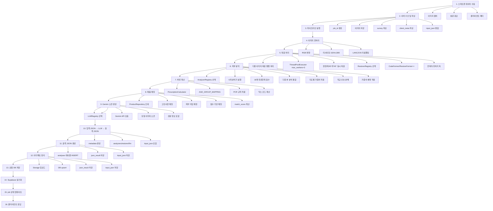

# 데이터 처리 흐름

스마트폰에서 서버로 전송된 입력 데이터가 내부적으로 처리되어 출력 JSON을 생성하고 DB에 저장되는 전체 프로세스에 대한 상세 문서입니다.

## 개요

이 문서는 스마트폰(Flutter 앱)에서 서버로 데이터가 전송되어 처리되는 전체 흐름을 설명합니다.

1. **입력 데이터 수신:** 스마트폰에서 이미지, 설문(survey), 클라이언트 메타(client_meta) 수신
2. **데이터 검증 및 파싱:** 입력 JSON 파싱 및 병합
3. **이미지 처리:** 원본 이미지 리사이징, 복원 처리
4. **분석 실행:** 피부 상태 분석 및 점수 계산
5. **처방 계산:** 피부 측정 점수 기반 처방전 생성
6. **제품 매칭:** 맞춤형 화장품 추천
7. **AI 소견 생성:** Gemini 소견 생성 (설문 정보 포함)
8. **입력 JSON → LLM → 출력 JSON:** 설문 정보가 LLM 프롬프트에 포함되어 개인화된 소견 생성
9. **출력 JSON 생성:** 분석 결과 JSON 생성
10. **DB 저장:** 로컬 SQLite DB와 Supabase DB에 저장
11. **응답 반환:** 클라이언트에 결과 반환

## 폴더 구조

### 로컬 분석 모드 (GUI/CLI)

```
results/
├── 이미지명/
│   ├── 00_input_이미지명.json      # 분석 결과 JSON
│   ├── 00_input_이미지명.png      # 스테이징된 입력 이미지
│   └── 01_restored_이미지명.png   # 복원된 이미지
├── skin_analysis.db               # 통합 DB (서버 + 로컬)
├── execution_history.db          # 실행 기록 DB
├── api_jobs/                      # 서버 API 작업 폴더
│   └── {job_id}/
│       ├── job.json
│       ├── artifacts/
│       └── ...
├── exports/                       # 엑셀/CSV 내보내기
│   └── skin_comparison_*.xlsx
├── images/                        # 입력 이미지 저장소
│   ├── 정상.jpg
│   ├── 색소침착_트러블_홍조.jpg
│   └── ...
├── logs/                          # 로그 파일
│   ├── app/
│   │   └── results.log
│   ├── server/
│   ├── llm/
│   └── error/
└── weights/                       # 모델 가중치 파일
    ├── restoration/
    ├── detection/
    └── analysis/
```

**특징:**
- 이미지별로 폴더 분리로 파일 관리 용이
- 하나의 `skin_analysis.db`로 서버와 로컬 데이터 통합
- 서버 API 작업은 별도 `api_jobs/` 폴더로 관리
- 로그, 이미지, 엑셀 파일 등을 `results/` 하위로 통합
- 모델 가중치 파일도 `results/weights/`로 관리

## 전체 데이터 흐름



## 전체 데이터 흐름 (텍스트 상세)

| 단계 | 설명 |
|------|------|
| **1. 스마트폰 데이터 수집** | - 이미지 캡처 (정면/좌측 45°/우측 45°) 3장<br>- 설문 응답 입력 (survey)<br>- 클라이언트 메타 수집 (client_meta)<br><br>↓ POST /v3/analysis/jobs<br>multipart/form-data<br>- `images[]` (JPEG, 1~3장)<br>- `angles[]` (front/left45/right45, images[]와 1:1 대응)<br>- `survey` (JSON string)<br>- `client_meta` (JSON string)<br>- `customer_id` (선택) |
| **2. 서버 수신 및 파싱** | - job_id 생성 (UUID)<br>- 이미지 저장 전각도: `results/api_jobs/{job_id}/`<br>- `angles[]` 검증 (front/left45/right45)<br>- front 이미지 → 파이프라인 주 입력 결정<br>- `lateral_images` 목록 job meta에 저장<br>- survey 파싱 (JSON → dict)<br>- client_meta 파싱 (JSON → dict)<br>- input_json 병합 = {survey, client_meta}<br>- job.json 저장<br><br>↓ 백그라운드 작업 큐 |
| **3. 파이프라인 실행** | - job 상태: queued → running<br>- run_analysis_pipeline_async() 호출 |
| **4. 이미지 전처리** | - _stage_pipeline_input_rgb()<br>- RGB 변환<br>- 리사이징 (config.json input_resize)<br>- 1024×1365 → LANCZOS 리샘플링<br>- 00_input_{stem}.png 저장 |
| **5. 복원 처리** | - 다중 이미지 복원 병렬 처리 (ThreadPoolExecutor, max_workers=3)<br>- 정면/좌45°/우45° 동시 복원<br>- RestorerRegistry에서 복원 백엔드 선택 (codeformer_v1, restoreformer_v1)<br>- 전처리 훅 호출 (preprocess)<br>- CodeFormer/RestoreFormer++ 복원<br>- fidelity/upscale/bg_upsampler: config.json에서 로드<br>- 후처리 훅 호출 (postprocess)<br>- 복원 이미지 저장 |
| **6. 피부 분석** | - AnalyzerRegistry에서 분석기 선택 (6개 분석기)<br>- SkinAnalyzerV3.analyze_all_multi_v3()<br>- 다중 뷰 분석 (정면 + 좌45° + 우45°)<br>- 얼굴 검출 (MediaPipe / Haar Cascade)<br>- 18개 측정항목 분석:<br>  • 기미, 주근깨, 색소 자국<br>  • 홍조, 염증후 홍반, 여드름<br>  • 주름 (눈가/인중/미세/깊은)<br>  • 모공 (크기/늘어짐), 거칠기<br>  • 피부톤, 칙칙함, 불균형<br>  • 턱선 흐림, 볼 처짐, 건조도<br>- 각도별 특화 항목 가중치 적용:<br>  • 측면 특화 (front: 20%, left: 40%, right: 40%): 모공 처짐, 눈가 주름, 턱선 흐림, 볼 처짐<br>  • 정면 특화 (front: 70%, left: 15%, right: 15%): 기미, 홍조, 피부 톤, 칙칙함, 톤 불균일, 인중 주름<br>  • 최대값 기반: 여드름, 여드름 후 색소<br>  • 기본값 (33% each): 기타 항목<br>- 각도별 개별 결과 포함 (`angle_results`)<br>- 직교 신호 분해 (10개 내부 신호)<br>- 가중치 체계 적용 (레이어A/레이어B/레거시)<br>- 점수 계산 (0-100) |
| **7. 처방 계산** | - PrescriptionCalculator로 처방전 생성<br>- **설문 정보 추출:** survey에서 skin_type, concerns 추출<br>- **피부 타입별 믹스:** _calculate_skin_type_mix() 호출<br>  • oily → M03 (유분 조절)<br>  • dry → M09 (수분 케어)<br>  • combination → M03 + M09 (유분 조절 + 수분 케어)<br>  • sensitive → M09 (수분 케어)<br>- **고민사항별 믹스:** _calculate_concern_mix() 호출<br>  • 색소 (melasma, freckle) → M05<br>  • 홍조 (redness, red_marks) → M06<br>  • 트러블 (acne, pimple) → M10<br>  • 모공 (pore, pore_sebum, pore_care) → M07<br>  • 주름 (wrinkle, eye_wrinkle, nasolabial) → M02<br>  • 텍스처 (texture, roughness) → M08<br>  • 톤 (tone, dullness, uneven_tone) → M01<br>  • 탄력 (elasticity, sagging, jawline) → M04<br>  • 노화 (aging) → M02 + M04<br>- **피부 평가 기반 처방:** calculate_skin_assessment_recipe() 호출<br>- **PCR 기반 처방:** calculate_pcr_recipe() 호출 (현재 비어있음)<br>- **믹스 합산:** assessment + pcr + skin + care (중복 시 최대값 사용)<br>- **베이스 비율 계산:** 100 - 총믹스합<br>- 처방 항목 생성: {base, skin, care, pcr, assessment} |
| **8. 제품 매칭** | - ProductRepository에서 맞춤형 화장품 조회<br>- 설문(survey)의 피부 고민사항 매칭 (+0.5점)<br>- 피부 타입 매칭 (+0.3점)<br>- 측정 점수 기반 매칭 (+0.2점, 점수 < 60인 항목)<br>- match_score 계산 및 정렬<br>- 상위 3개 제품 선정<br>- 성분 정보 문자열 생성<br>- product_recommendations 구조 생성 |
| **9. Gemini 소견 생성** | - LLMRegistry에서 LLM 선택 (gemini_v1)<br>- llm_report=true인 경우<br>- 분석 결과를 Gemini API에 전송<br>- 맞춤형 화장품 성분 정보 포함 (제품 매칭 성공 시)<br>- **설문 정보(survey) 포함** ← 신규<br>- 듀얼 이미지 소견 (원본/복원 비교)<br>- 한국어 소견서 생성<br>- 개선 제안 제시<br>- 맞춤형 화장품 추천 포함 |
| **10. 입력 JSON → LLM → 출력 JSON** | - input_json["survey"]에서 설문 정보 추출<br>- LLM 프롬프트에 survey_info 포함<br>- Gemini API 호출 (설문 정보 포함)<br>- 개인화된 소견 생성 (성별, 연령, 피부 타입, 고민사항, 알레르지 반영)<br>- 출력 JSON의 llm_report에 개인화된 소견 저장<br>- LLM API 통계(llm_stats) 저장 |
| **11. 출력 JSON 생성** | {<br>  "input_image": "/path/to/original.png",<br>  "restored_image": "/path/to/restored.png",<br>  "metadata": {<br>    "analyzers": {"pigmentation": "pigmentation_v1", ...},<br>    "restorer": {"name": "codeformer_v1", "config": {...}},<br>    "llm": {"name": "gemini_v1", "model": "models/gemini-2.5-pro"}<br>  },<br>  "input_json": {survey, client_meta},<br>  "internal_analysis": {<br>    "original": {<br>      "melasma_score": 56,<br>      "redness_score": 72,<br>      ... (18개 항목)<br>      "overall_score": 65<br>    },<br>    "restored": { ... }<br>  },<br>  "prescription": {<br>    "base": {"percentage": 85},<br>    "skin": {"M03": 1, "M09": 1},<br>    "care": {"M10": 2, "M06": 2, "M07": 2},<br>    "pcr": {},<br>    "assessment": {...}<br>  },<br>  "llm_report": {<br>    "overall_score": 75,<br>    "perceived_age": 38,<br>    "metric_opinions": {...},<br>    "overall_opinion": "고객님의 피부는 전반적으로 양호한 상태입니다...",<br>    "recommendation": "여드름 관리를 위해...",<br>    "matched_products": [...],<br>    "strict_evaluation_mode": true,<br>    "llm_stats": {...}<br>  }<br>} |
| **12. 아티팩트 정리** | - results.json → artifacts/results.json<br>- original.png → artifacts/original.png<br>- restored.png → artifacts/restored.png<br>- URL 경로 생성 (/v3/analysis/jobs/{job_id}/artifacts/...) |
| **13. 로컬 DB 저장** | - SkinAnalysisDB.save_analysis()<br>- analyses 테이블 INSERT:<br>  • customer_id<br>  • original_image_path<br>  • restored_image_path<br>  • json_result (출력 JSON)<br>  • input_json (입력 JSON) ← survey + client_meta<br>  • original_filename<br>  • overall_score_original<br>  • overall_score_restored |
| **14. Supabase 동기화** | - SupabaseSync.sync()<br>- 이미지 업로드 (Storage):<br>  • original.png → skin-images/{customer_id}/{date}_{id}/<br>  • restored.png → skin-images/{customer_id}/{date}_{id}/<br>- DB upsert (skin_analyses 테이블):<br>  • local_id<br>  • customer_id<br>  • original_filename<br>  • storage_original<br>  • storage_restored<br>  • overall_score_original<br>  • overall_score_restored<br>  • json_result (출력 JSON)<br>  • input_json (입력 JSON) ← survey + client_meta |
| **15. job 상태 업데이트** | - job 상태: running → succeeded/failed<br>- finished_at 타임스탬프<br>- artifacts URL 저장<br>- job.json 업데이트 |
| **16. 클라이언트 응답** | - GET /v3/analysis/jobs/{job_id}/result<br>- {<br>  "job_id": "...",<br>  "status": "succeeded",<br>  "timestamp": "...",<br>  "analysis": { ...출력 JSON... },<br>  "artifacts": {<br>    "results.json": "/v3/analysis/jobs/.../artifacts/...",<br>    "restored_image": "/v3/analysis/jobs/.../artifacts/...",<br>    "input_image": "/v3/analysis/jobs/.../artifacts/..."<br>  }<br>} |

## 상세 단계 설명

### 1. 스마트폰 데이터 수집

**이미지 캡처:**
- 3장의 얼굴 사진 촬영 (정면, 좌측 45°, 우측 45°)
- JPEG 포맷, 권장 해상도: 짧은 변 ≥ 1080px
- 클라이언트 측 품질 검증 (밝기/블러) 통과 후 전송
- 전송 방식: `images[]` 멀티파트 파트로 3장, `angles[]` 파트로 각도 라벨 매칭

**설문 응답 (survey):**
- 동의 여부 (`consent_agreed`)
- 인구통계학적 정보 (성별, 연령, 인종, 거주국가)
- 피부 타입 (`skin_types`)
- 피부 관심사 (`skin_interests`)
- 피부 고민사항 (`skin_concerns`)
- 알레르기 정보 (`allergies`)
- 현재 사용 제품 (`current_products`)
- 개선 목표 (`improvement_goals`)
- 선호 제형/가격대

**클라이언트 메타 (client_meta):**
- 앱 버전 (`app_version`)
- 빌드 번호 (`build_number`)
- 플랫폼 (`platform`: ios/android)
- OS 버전 (`os_version`)
- 디바이스 모델 (`device_model`)
- 캡처 시간 (`captured_at`)

### 2. 서버 수신 및 파싱

**API 엔드포인트:** `POST /v3/analysis/jobs`

**파라미터 처리:**
```python
# server.py: create_job()
# 다중 이미지 수신 (권장)
images: List[UploadFile] = File(default=[])   # 1~3장
angles: List[str]        = Form(default=[])   # images[]와 1:1 대응

# 단일 이미지 (레거시)
image: Optional[UploadFile] = File(None)
image_url: Optional[str]    = Form(None)

# angles[] 자동 할당: 미제공 시 front→left45→right45 순 자동 배정
# front 이미지가 파이프라인 주 입력; 없으면 첫 번째 이미지 사용

# survey / client_meta 파싱
input_json = {}
if survey:
    input_json["survey"] = json.loads(survey)
if client_meta:
    input_json["client_meta"] = json.loads(client_meta)

# job meta에 저장
meta["lateral_images"] = [{"angle": "front", "path": "..."}, ...]
meta["input_json"]     = input_json if input_json else None
```

**이미지 저장:**
- `results/api_jobs/{job_id}/` 디렉토리 생성
- 전 각도 이미지 저장 (원본 파일명 유지)
- `lateral_images` 목록(angle + path)을 job.json에 저장
- front 이미지 경로를 `input_image_path`로 설정

### 3. 이미지 전처리

**함수:** `pipeline_core.py:_stage_pipeline_input_rgb()`

**처리 과정:**
1. 입력 이미지를 RGB로 변환
2. `config.json`에서 리사이즈 크기 로드 (`input_resize`)
3. 지정된 크기로 리사이징 (기본 1024×1365)
4. LANCZOS 리샘플링 적용
5. `00_input_{stem}.png`로 저장

**설정 로드:**
```python
from skin_scoring import _load_scoring_config
config = _load_scoring_config()
resize_wh = tuple(config.get("restoration", {}).get("input_resize", [1024, 1365]))
```

### 4. 복원 처리

**백엔드:** CodeFormer

**파라미터 로드:** `config.json`
- `codeformer_fidelity`: 원본 충실도 (0.0-1.0, 기본 1.0)
- `codeformer_upscale`: 업스케일 배수 (1, 2, 기본 1)
- `codeformer_bg_upsampler`: 배경 업스케일링 ("none", "realesrgan", 기본 "none")
- `codeformer_additional`: RF++ 후 CodeFormer 추가 복원 (기본 true)

**적용 범위:**
- GUI (`skin_analysis_gui.py`)
- CLI (`image_enhancer.py`)
- Batch Report (`batch_report.py`)
- Server (`server.py`)

### 5. 피부 분석

**분석기:** `SkinAnalyzerV3` (skin_scoring.py)

**얼굴 검출:**
- MediaPipe Face Mesh (우선)
- Haar Cascade 폴백 (3개 검출기)
  - haarcascade_frontalface_default.xml
  - haarcascade_frontalface_alt2.xml
  - haarcascade_profileface.xml

**18개 측정항목:**
1. 기미 점수 (`melasma_score`)
2. 주근깨 점수 (`freckle_score`)
3. 색소 자국 점수 (`pigment_mark_score`)
4. 홍조 점수 (`redness_score`)
5. 염증후 홍반 점수 (`post_inflammatory_erythema_score`)
6. 여드름 점수 (`acne_score`)
7. 여드름 후 색소 점수 (`post_acne_pigment_score`)
8. 눈가 주름 점수 (`eye_wrinkle_score`)
9. 인중 주름 점수 (`nasolabial_wrinkle_score`)
10. 미세/깊은 주름 점수 (`fine_deep_wrinkle_score`)
11. 모공 크기 점수 (`pore_size_score`)
12. 모공 늘어짐 점수 (`pore_sagging_score`)
13. 거칠기 점수 (`roughness_score`)
14. 피부톤 점수 (`skin_tone_score`)
15. 칙칙함 점수 (`dullness_score`)
16. 불균형 톤 점수 (`uneven_tone_score`)
17. 턱선 흐림 점수 (`jawline_blur_score`)
18. 피부 타입 점수 (`skin_type_score`)

**점수 계산:**
- 브레이크포인트 기반 점수화 (0-100)
- safety_net 적용 (acne_weight 기반 점수 조정)
- score offset 적용 (+10)
- 표시 점수 범위: 10-90

### 6. 제품 매칭

**조건:** ProductTable에 제품 데이터가 있는 경우

**처리 과정:**
1. 설문(survey)에서 피부 고민사항 추출 (예: 여드름, 홍조)
2. 설문(survey)에서 피부 타입 추출 (예: combination, sensitive)
3. ProductRepository에서 제품 조회
4. 고민사항 매칭 (+0.5점)
5. 피부 타입 매칭 (+0.3점)
6. 측정 점수 기반 매칭 (+0.2점, 점수 < 60인 항목)
7. match_score 계산 및 정렬
8. 상위 3개 제품 선정
9. 성분 정보 문자열 생성
10. product_recommendations 구조 생성

**출력 구조:**
```json
{
  "product_recommendations": {
    "matched_products": [
      {
        "product_id": "P001",
        "product_name": "CÔTELEAF 트러블 케어 세럼",
        "category": "트러블 케어",
        "key_ingredients": ["나이아신아마이드", "살리실산", "티트리 오일"],
        "efficacy": "여드름 억제, 모공 관리, 피부 진정",
        "match_score": 1,
        "match_reason": "고민사항 매칭: 여드름, 피부 타입 매칭: combination"
      }
    ],
    "recommendation_summary": "측정된 피부 상태와 설문 응답을 기반으로 1종의 맞춤형 화장품을 추천합니다."
  }
}
```

### 7. 처방 계산

**처방전 로직:** `PrescriptionCalculator.create_prescription()`

**처리 과정:**
1. **설문 정보 추출:** survey에서 skin_type, concerns 추출
2. **피부 타입별 믹스:** `_calculate_skin_type_mix()` 호출
   - oily → M03 (유분 조절, 2%)
   - dry → M09 (수분 케어, 2%)
   - combination → M03 + M09 (유분 조절 + 수분 케어, 1% + 1%)
   - sensitive → M09 (수분 케어, 2%)
3. **고민사항별 믹스:** `_calculate_concern_mix()` 호출
   - 색소 (melasma, freckle, pigmentation) → M05 (색소침착 케어, 2%)
   - 홍조 (redness, red_marks) → M06 (홍조 케어, 2%)
   - 트러블 (acne, pimple) → M10 (트러블 케어, 2%)
   - 모공 (pore, pore_sebum, pore_care) → M07 (모공 케어, 2%)
   - 주름 (wrinkle, eye_wrinkle, nasolabial) → M02 (주름 케어, 2%)
   - 텍스처 (texture, roughness) → M08 (피부결 케어, 2%)
   - 톤 (tone, dullness, uneven_tone) → M01 (톤&밝기 케어, 2%)
   - 탄력 (elasticity, sagging, jawline) → M04 (탄력&처짐 케어, 2%)
   - 노화 (aging) → M02 + M04 (주름 + 탄력, 1% + 1%)
4. **피부 평가 기반 처방:** `calculate_skin_assessment_recipe()` 호출
   - 측정항목 점수 → 믹스 코드 매핑 (config.json)
   - 가장 낮은 점수 기준으로 처방 비율 결정
   - 점수 기준: good_threshold(76) 이상 0%, critical_threshold(40) 미만 max_percentage(3%)
5. **PCR 기반 처방:** `calculate_pcr_recipe()` 호출 (현재 비어있음)
6. **믹스 합산:** assessment + pcr + skin + care
   - 동일 믹스 코드가 있으면 최대값 사용 (중복 합산 방지)
7. **베이스 비율 계산:** 100 - 총믹스합
8. **처방 항목 생성:** {base, skin, care, pcr, assessment}

**처방전 구조:**
```json
{
  "base": {"percentage": 85},
  "skin": {
    "M03": 1,
    "M09": 1
  },
  "care": {
    "M10": 2,
    "M06": 2,
    "M07": 2
  },
  "pcr": {},
  "assessment": {
    "M01": 1,
    "M02": 2,
    "M05": 1
  }
}
```

**설문 정보 활용:**
- `skin_types[0]`: 피부 타입별 믹스 결정
- `skin_concerns`: 고민사항별 믹스 결정 (복수 선택 가능)

### 8. 제품 매칭

**조건:** ProductTable에 제품 데이터가 있는 경우

**처리 과정:**
1. 설문(survey)에서 피부 고민사항 추출 (예: 여드름, 홍조)
2. 설문(survey)에서 피부 타입 추출 (예: combination, sensitive)
3. ProductRepository에서 제품 조회
4. 고민사항 매칭 (+0.5점)
5. 피부 타입 매칭 (+0.3점)
6. 측정 점수 기반 매칭 (+0.2점, 점수 < 60인 항목)
7. match_score 계산 및 정렬
8. 상위 3개 제품 선정
9. 성분 정보 문자열 생성
10. product_recommendations 구조 생성

### 9. Gemini 소견 생성

**조건:** `llm_report=true`

**처리 과정:**
1. **설문 정보 추출:** `input_json["survey"]`에서 고객 설문 정보 추출
2. **프롬프트 구성:** 다음 정보를 포함하여 LLM 프롬프트 생성
   - CV 분석 점수 (18개 항목)
   - 종합 점수, 인지 나이
   - 처방전 정보 (M01~M10 비율)
   - 제품 정보 (DB 매칭 결과)
   - **설문 정보 (survey)** ← 신규 추가
3. **Gemini API 호출:** 구성된 프롬프트와 이미지를 Gemini API에 전송
4. **소견서 생성:** LLM이 개인화된 한국어 소견서 생성
5. **개선 제안 제시:** 고객의 고민사항, 피부 타입, 선호사항 반영
6. **맞춤형 화장품 추천:** 설문 정보 기반 제품 추천 설명

**설문 정보 포함 내용:**
```json
{
  "consent_agreed": true,
  "gender": "female",
  "age_group": "30s",
  "ethnicity": "korean",
  "country": "korea",
  "skin_types": ["combination", "sensitive"],
  "skin_concerns": ["acne", "red_marks", "pore_sebum"],
  "allergies": {
    "sunlight": { "has": true, "detail": "여름철 일광 두드러기" }
  },
  "current_products": ["cleanser", "toner", "serum", "sunscreen"],
  "improvement_goals": ["pore_reduction", "tone_brightening"],
  "preferred_formula": ["light", "fragrance_free"],
  "price_range": "30k_50k"
}
```

**LLM 프롬프트 구조:**
```markdown
## 시스템 분석기 측정 점수
- 종합 점수: 75점
- 인지 나이: 38세

## 점수 평가 기준
{score_criteria_section}

## 처방전 정보
{prescription_info}

## 맞춤형 제품 정보
{product_info}

## 고객 설문 정보
{survey_info}  ← 신규 추가

## 소견 작성 가이드라인
- 고객의 설문 정보(성별, 연령, 피부 타입, 고민사항, 알레르기 등)를 반영하여 개인화된 소견 작성
- 알레르기 정보를 고려하여 성분 추천 시 주의
- 개선 목표와 선호 제형/가격대를 반영한 제품 추천
```

**출력 구조:**
```json
{
  "strict_evaluation_mode": true,
  "metric_scores": {
    "melasma_score": 70,
    "freckle_score": 65,
    ...
  },
  "metric_opinions": {
    "melasma_score": {
      "opinion": "30대 여성 고객님의 피부에 기미가 관찰됩니다...",
      "reason": "점수 산출 근거"
    },
    ...
  },
  "overall_score": 75,
  "perceived_age": 38,
  "overall_opinion": "고객님의 피부는 전반적으로 양호한 상태입니다. 특히 여드름 고민사항을 고려할 때...",
  "recommendation": "여드름 관리를 위해 살리실산 성분이 포함된 제품을 추천합니다. 알레르기(일광 두드러기)를 고려하여 자외선 차단제 사용을 권장합니다.",
  "matched_products": [
    {
      "product_id": "P001",
      "product_name": "꼬드리브 트러블 케어 세럼",
      "category": "트러블 케어",
      "key_ingredients": ["나이아신아마이드", "살리실산"],
      "efficacy": "여드름 억제, 모공 관리",
      "match_score": 1
    }
  ],
  "llm_stats": {
    "input_tokens": 2500,
    "output_tokens": 800,
    "execution_time_sec": 3.2,
    "estimated_cost_usd": 0.005
  }
}
```

### 8. 입력 JSON → LLM → 출력 JSON 흐름

**데이터 흐름 개요:**
```
입력 JSON (input_json)
  → survey 정보 추출
  → LLM 프롬프트 구성 (survey_info 포함)
  → Gemini API 호출
  → 개인화된 소견 생성
  → 출력 JSON (llm_report)
```

**상세 단계:**

**1. 입력 JSON 수신 (서버)**
```python
# src/server/routers/jobs.py
input_json: Dict[str, Any] = {}
if survey:
    input_json["survey"] = json.loads(survey)
if client_meta:
    input_json["client_meta"] = json.loads(client_meta)

meta["input_json"] = input_json if input_json else None
```

**2. 파이프라인 전달**
```python
# src/server/routers/jobs.py
result = await run_analysis_pipeline_async(
    input_image=Path(meta["input_image_path"]),
    output_dir=Path(meta["output_dir"]),
    input_json=meta.get("input_json"),  # ← 전달
    ...
)
```

**3. 설문 정보 추출**
```python
# src/cli/skin_analysis_cli.py
survey_info = None
if input_json:
    survey = input_json.get("survey", {})
    survey_info = json.dumps(survey, ensure_ascii=False)
```

**4. LLM 프롬프트 구성**
```python
# src/llm/llm_prompt_builder.py
format_dict = {
    "overall_score": f"{int(overall_score)}",  # 정수 변환
    "perceived_age": f"{int(perceived_age)}",  # 정수 변환
    "product_info": product_info or "제공된 맞춤형 화장품 정보가 없습니다.",
    "survey_info": survey_info or "제공된 설문 정보가 없습니다.",  # ← 추가
    "strict_evaluation_mode": "true" if strict_mode_enabled else "false",
}
```

**5. LLM API 호출**
```python
# src/llm/llm_reporter.py
llm_result = reporter.generate_report_from_dual_images(
    orig_image_path=str(input_image),
    orig_measurements_report=orig_analysis.get("measurements_report", {}),
    orig_overall_score=float(orig_analysis.get("overall_score", 0)),
    orig_perceived_age=float(orig_analysis.get("perceived_age", 0)),
    ideal_image_path=str(restored_image),
    ideal_measurements_report=rest_analysis.get("measurements_report", {}),
    ideal_overall_score=float(rest_analysis.get("overall_score", 0)),
    ideal_perceived_age=float(rest_analysis.get("perceived_age", 0)),
    provide_scores=args.llm_scores,
    survey_info=survey_info,  # ← 전달
)
```

**6. 출력 JSON 생성**
```python
# src/cli/skin_analysis_cli.py
analysis_result["llm_report"] = llm_result
analysis_result["llm_stats"] = orig_report.llm_stats
```

**입력 JSON → LLM → 출력 JSON 매핑:**

| 입력 JSON (survey) | LLM 프롬프트 | 출력 JSON (llm_report) |
|-------------------|--------------|------------------------|
| `gender` | `{survey_info}`에 포함 | `overall_opinion`에 성별 반영 |
| `age_group` | `{survey_info}`에 포함 | `overall_opinion`에 연령대 반영 |
| `skin_types` | `{survey_info}`에 포함 | `recommendation`에 피부 타입 반영 |
| `skin_concerns` | `{survey_info}`에 포함 | `metric_opinions`에 고민사항 반영 |
| `allergies` | `{survey_info}`에 포함 | `recommendation`에 알레르기 주의 반영 |
| `improvement_goals` | `{survey_info}`에 포함 | `recommendation`에 개선 목표 반영 |
| `preferred_formula` | `{survey_info}`에 포함 | `matched_products` 필터링 |
| `price_range` | `{survey_info}`에 포함 | `matched_products` 필터링 |

**출력 JSON의 llm_report 구조:**
```json
{
  "llm_report": {
    "overall_score": 75,
    "perceived_age": 38,
    "metric_opinions": {
      "melasma_score": {
        "opinion": "30대 여성 고객님의 피부에 기미가 관찰됩니다...",
        "reason": "점수 산출 근거"
      },
      ...
    },
    "overall_opinion": "고객님의 피부는 전반적으로 양호한 상태입니다. 특히 여드름 고민사항을 고려할 때...",
    "recommendation": "여드름 관리를 위해 살리실산 성분이 포함된 제품을 추천합니다. 알레르기(일광 두드러기)를 고려하여 자외선 차단제 사용을 권장합니다.",
    "matched_products": [
      {
        "product_id": "P001",
        "product_name": "꼬드리브 트러블 케어 세럼",
        "category": "트러블 케어",
        "key_ingredients": ["나이아신아마이드", "살리실산"],
        "efficacy": "여드름 억제, 모공 관리",
        "match_score": 1
      }
    ],
    "strict_evaluation_mode": true,
    "llm_stats": {
      "input_tokens": 2500,
      "output_tokens": 800,
      "execution_time_sec": 3.2,
      "estimated_cost_usd": 0.005
    }
  }
}
```

### 9. 출력 JSON 구조

```json
{
  "input_image": "/path/to/original.png",
  "restored_image": "/path/to/restored.png",
  "lateral_images": [
    {"angle": "front",   "path": "/path/to/front.jpg"},
    {"angle": "left45",  "path": "/path/to/left45.jpg"},
    {"angle": "right45", "path": "/path/to/right45.jpg"}
  ],
  "metadata": {
    "analyzers": {...},
    "restorer": {...},
    "llm": {...}
  },
  "execution_time": {
    "total_sec": 45.2,      // 전체 처리 시간 (초)
    "llm_sec": 3.2          // LLM 처리 시간 (초)
  },
  "internal_analysis": {
    "original": {
      "melasma_score": 56,
      "freckle_score": 72,
      "pigment_mark_score": 68,
      "redness_score": 72,
      "post_inflammatory_erythema_score": 70,
      "acne_score": 65,
      "post_acne_pigment_score": 68,
      "eye_wrinkle_score": 60,
      "nasolabial_wrinkle_score": 62,
      "fine_deep_wrinkle_score": 65,
      "pore_size_score": 70,
      "pore_sagging_score": 58,
      "roughness_score": 68,
      "skin_tone_score": 75,
      "dullness_score": 65,
      "uneven_tone_score": 70,
      "jawline_blur_score": 60,
      "skin_type_score": 70,
      "overall_score": 65,
      "measurements": {},              // 자체 분석기 측정값
      "measurements_raw": {},          // 원시 측정값 (조정 전)
      "measurements_adjusted": {},     // 조정된 측정값 (안전장치 등 적용)
      "overall_score_adjusted": 65     // 조정된 종합 점수
    },
    "restored": {
      // 복원 이미지 분석 결과
      // 구조는 original과 동일
    }
  },
  "llm_analysis": {
    "original": {
      "raw_response": "...",
      "overall_opinion": "...",
      "overall_score": 65,
      "perceived_age": 38,
      "metric_scores_raw": {              // 순수 LLM 점수 (조정 전)
        "melasma_score": 75,
        "freckle_score": 30,
        ...
      },
      "metric_scores_adjusted": {          // 보정 적용된 LLM 점수 (조정 후)
        "melasma_score": 75,
        "freckle_score": 30,
        ...
      },
      "metric_opinions": [
        {
          "key": "melasma_score",
          "display_name": "기미",
          "category": "pigmentation",
          "score": 75,
          "opinion": "...",
          "reason": "...",
          "grade": "70~80점"
        },
        ...
      ]
    },
    "restored": {
      "raw_response": "...",
      "overall_opinion": "...",
      "overall_score": 75,
      "perceived_age": 29,
      "metric_scores_raw": {              // 순수 LLM 점수 (조정 전)
        "melasma_score": 75,
        "freckle_score": 70,
        ...
      },
      "metric_scores_adjusted": {          // 보정 적용된 LLM 점수 (조정 후)
        "melasma_score": 75,
        "freckle_score": 70,
        ...
      },
      "metric_opinions": [
        {
          "key": "melasma_score",
          "display_name": "기미",
          "category": "pigmentation",
          "score": 75,
          "opinion": "",
          "reason": "...",
          "grade": "70~80점"
        },
        ...
      ]
    },
    "product_recommendations": {
      "matched_products": [
        {
          "product_id": "P001",
          "product_name": "CÔTELEAF 트러블 케어 세럼",
          "category": "트러블 케어",
          "key_ingredients": ["나이아신아마이드", "살리실산"],
          "efficacy": "여드름 억제, 모공 관리",
          "match_score": 1,
          "match_reason": "고민사항 매칭: 여드름"
        }
      ],
      "recommendation_summary": "측정된 피부 상태와 설문 응답을 기반으로 1종의 맞춤형 화장품을 추천합니다."
    }
  }
}
```

**점수 데이터 포맷 통일:**
- **자체 분석기 점수** (`internal_analysis`):
  - `measurements_raw`: 원시 측정값 (조정 전)
  - `measurements_adjusted`: 조정된 측정값 (안전장치 등 적용)
  - `measurements`: 현재 사용 중인 측정값
- **LLM 점수** (`llm_analysis`):
  - `metric_scores_raw`: 순수 LLM 점수 (조정 전, raw_response에서 추출)
  - `metric_scores_adjusted`: 보정 적용된 LLM 점수 (조정 후, 자체 분석기 점수와 결합)
  - `metric_opinions[].score`: 최종 점수 (metric_scores_adjusted와 동일)

**점수 표시 정책:**
- **출력 JSON**: 모든 점수는 정수로 표시됩니다 (소수점 없음)
  - `internal_analysis.original.overall_score`: 정수 (예: 65)
  - `internal_analysis.original.*_score`: 정수 (예: 56, 72, 68)
  - `internal_analysis.original.perceived_age`: 정수 (예: 38)
  - `llm_analysis.original.overall_score`: 정수 (예: 65)
  - `llm_analysis.original.perceived_age`: 정수 (예: 38)
  - `llm_analysis.*.match_score`: 정수 (예: 1)
- **내부 계산**: float로 유지 (정밀도 보장)
- **변환 위치**: `src/cli/skin_analysis_cli.py`의 `_convert_scores_to_int()` 함수와 `src/llm/llm_utils.py`의 `report_to_dict()` 함수에서 정수로 변환

### 10. DB 저장

**로컬 SQLite DB (skin_analysis_db.py):**
```python
db.save_analysis(
    original_path=meta.get("input_image_path"),
    restored_path=result.get("restored_image"),
    json_result=result,              # 출력 JSON
    customer_id=meta.get("customer_id"),
    input_json=meta.get("input_json"), # 입력 JSON ← survey + client_meta
)
```

**Supabase DB (supabase_sync.py):**
```python
syncer.sync(
    local_id=local_id,
    original_path=original_path,
    restored_path=restored_path,
    json_result=json_result,         # 출력 JSON
    customer_id=customer_id,
    input_json=input_json,           # 입력 JSON ← survey + client_meta
    async_mode=False,
)
```

### 11. DB 스키마

### 로컬 SQLite DB

**테이블:** `analyses`

```sql
CREATE TABLE IF NOT EXISTS analyses (
    id INTEGER PRIMARY KEY AUTOINCREMENT,
    customer_id TEXT,
    original_image_path TEXT NOT NULL,
    restored_image_path TEXT NOT NULL,
    json_result TEXT NOT NULL,
    input_json TEXT,                    -- ← 추가: 입력 JSON (survey + client_meta)
    created_at TIMESTAMP DEFAULT CURRENT_TIMESTAMP,
    original_filename TEXT,
    overall_score_original REAL,
    overall_score_restored REAL
);
```

**테이블:** `products` (맞춤형 화장품 성분 정보)

```sql
CREATE TABLE IF NOT EXISTS products (
    id INTEGER PRIMARY KEY AUTOINCREMENT,
    product_id TEXT UNIQUE NOT NULL,
    product_name TEXT NOT NULL,
    category TEXT NOT NULL,
    key_ingredients TEXT NOT NULL,
    efficacy TEXT NOT NULL,
    target_skin_types TEXT,
    target_concerns TEXT,
    created_at TIMESTAMP DEFAULT CURRENT_TIMESTAMP,
    updated_at TIMESTAMP DEFAULT CURRENT_TIMESTAMP
);
```

**마이그레이션:** 기존 테이블에 자동으로 컬럼 추가됩니다. products 테이블은 자동 생성됩니다.

### Supabase DB

**테이블:** `skin_analyses`

```sql
CREATE TABLE IF NOT EXISTS skin_analyses (
    id                      BIGSERIAL PRIMARY KEY,
    local_id                INTEGER,                   -- 로컬 SQLite analyses.id
    customer_id             TEXT,
    original_filename       TEXT,
    storage_original        TEXT,                      -- Storage 내 경로
    storage_restored        TEXT,                      -- Storage 내 경로
    overall_score_original  FLOAT,
    overall_score_restored  FLOAT,
    json_result             JSONB NOT NULL,
    input_json              JSONB,                     -- ← 추가: 입력 JSON (survey + client_meta)
    created_at              TIMESTAMPTZ DEFAULT NOW()
);
```

**마이그레이션:** `supabase_setup.sql` 실행 시 자동으로 컬럼 추가됩니다.

```sql
ALTER TABLE skin_analyses ADD COLUMN IF NOT EXISTS input_json JSONB;
```

### 12. API 엔드포인트

### POST /v3/analysis/jobs

**파라미터:**

| 파라미터 | 타입 | 필수 | 설명 |
|---------|------|------|------|
| `images[]` | file (JPEG) | 아니오* | 얼굴 사진 1~3장. `angles[]`와 1:1 대응. **권장** |
| `angles[]` | text | 아니오 | 각 이미지의 각도 라벨. 값: `front` / `left45` / `right45`. 미제공 시 자동 할당 |
| `image` | file | 아니오* | 단일 이미지 업로드 (레거시. `images[]`와 동시 사용 불가) |
| `image_url` | text | 아니오* | 단일 이미지 URL (레거시) |
| `survey` | text (JSON) | 아니오 | 설문 응답 JSON 문자열 |
| `client_meta` | text (JSON) | 아니오 | 클라이언트 메타 JSON 문자열 |
| `customer_id` | text | 아니오 | 고객 식별자 |
| `skip_sd` | bool | 아니오 | SD 생략 여부 (기본 true) |
| `do_restore` | bool | 아니오 | 복원 수행 여부 (기본 true) |
| `gemini_report` | bool | 아니오 | Gemini 소견 생성 (기본 true) |

> `images[]` / `image` / `image_url` 중 하나를 반드시 제공해야 합니다. 동시 사용 불가.

**응답:** `202 Accepted` + `{ "job_id": "..." }`

### GET /v3/analysis/jobs/{job_id}

**응답:** job 상태 정보

### GET /v3/analysis/jobs/{job_id}/result

**응답:** 분석 결과 JSON

## 입력 JSON 구조

**input_json 딕셔너리 구조:**

```json
{
  "survey": {
    "consent_agreed": true,
    "gender": "female",
    "age_group": "30s",
    "ethnicity": "korean",
    "skin_types": ["combination", "sensitive"],
    "skin_concerns": ["acne", "red_marks"],
    "current_products": ["cleanser", "toner", "sunscreen"],
    "improvement_goals": ["pore_reduction", "tone_brightening"],
    "want_recommendation": true,
    "saved_at": "2026-05-15T10:30:00+09:00"
  },
  "client_meta": {
    "app_version": "1.0.3",
    "build_number": "42",
    "platform": "ios",
    "os_version": "17.4",
    "device_model": "iPhone 15 Pro",
    "captured_at": "2026-05-15T10:29:45+09:00"
  }
}
```

## 코드 변경사항

### 1. skin_analysis_db.py

```python
def save_analysis(
    self,
    original_path: str,
    restored_path: str,
    json_result: Dict[str, Any],
    customer_id: Optional[str] = None,
    input_json: Optional[Dict[str, Any]] = None,  # ← 추가
    supabase_async: bool = True,
) -> int:
```

### 2. supabase_sync.py

```python
def sync(
    self,
    local_id:      int,
    original_path: str,
    restored_path: str,
    json_result:   Dict[str, Any],
    customer_id:   Optional[str] = None,
    sync_mode:     bool          = False,
    input_json:    Optional[Dict[str, Any]] = None,  # ← 추가
) -> None:
```

### 3. server.py

```python
@app.post("/v3/analysis/jobs", status_code=202)
async def create_job(
    # ... 기존 파라미터 ...
    survey: Optional[str] = Form(None),        # ← 추가
    client_meta: Optional[str] = Form(None),   # ← 추가
) -> Dict[str, Any]:
    # survey와 client_meta를 파싱해서 input_json으로 병합
    input_json: Dict[str, Any] = {}
    if survey:
        input_json["survey"] = json.loads(survey)
    if client_meta:
        input_json["client_meta"] = json.loads(client_meta)
    
    # job meta에 저장
    meta["input_json"] = input_json if input_json else None
    
    # DB 저장 시 전달
    _db.save_analysis(
        # ...
        input_json=meta.get("input_json"),
    )
```

## 마이그레이션 가이드

### 기존 배포 환경

1. **로컬 DB:** 자동 마이그레이션됩니다. 별도 조치 불필요.
2. **Supabase:** `supabase_setup.sql`을 Supabase SQL Editor에서 실행하세요.

```sql
ALTER TABLE skin_analyses ADD COLUMN IF NOT EXISTS input_json JSONB;
```

### 신규 배치 환경

1. `supabase_setup.sql`을 처음부터 실행하면 테이블이 올바른 스키마로 생성됩니다.
2. 로컬 DB는 초기화 시 자동으로 올바른 스키마로 생성됩니다.

## 사용 예시

### Python (서버 측)

```python
from src.db.skin_analysis_db import SkinAnalysisDB

db = SkinAnalysisDB(db_path="skin_analysis.db")

# 입력 JSON 포함하여 저장
input_data = {
    "survey": {
        "consent_agreed": True,
        "gender": "female",
        "age_group": "30s"
    },
    "client_meta": {
        "app_version": "1.0.3",
        "platform": "ios"
    }
}

db.save_analysis(
    original_path="/path/to/original.png",
    restored_path="/path/to/restored.png",
    json_result={"overall_score": 75},
    customer_id="C001",
    input_json=input_data,  # ← 입력 JSON 저장
)
```

### Flutter (클라이언트 측)

```dart
final survey = {
  "consent_agreed": true,
  "gender": "female",
  "age_group": "30s",
};

final clientMeta = {
  "app_version": "1.0.3",
  "platform": "ios",
  "os_version": "17.4",
};

final request = http.MultipartRequest(
  'POST',
  Uri.parse('http://localhost:8000/v3/analysis/jobs'),
);

// 다중 이미지 전송 (권장)
final imageFiles = [
  {"path": frontImagePath,  "angle": "front"},
  {"path": left45ImagePath, "angle": "left45"},
  {"path": right45ImagePath,"angle": "right45"},
];
for (final img in imageFiles) {
  request.files.add(await http.MultipartFile.fromPath(
    'images[]', img["path"]!,
    contentType: MediaType('image', 'jpeg'),
  ));
  request.fields['angles[]'] = img["angle"]!; // 순서 유지
}

request.fields['survey']      = jsonEncode(survey);
request.fields['client_meta'] = jsonEncode(clientMeta);
request.fields['customer_id'] = customerId ?? '';

final response = await request.send();
// 202 Accepted → job_id 추출 → GET /v3/analysis/jobs/{job_id} 폴링
```

## 데이터 조회 예시

### 로컬 SQLite

```sql
SELECT id, customer_id, original_filename, input_json
FROM analyses
WHERE customer_id = 'C001';
```

### Supabase

```sql
SELECT id, customer_id, original_filename, input_json
FROM skin_analyses
WHERE customer_id = 'C001';
```

## 참고 문서

- [upload-spec.md](../upload-spec.md) - 클라이언트→서버 업로드 스펙
- [supabase_setup.sql](../supabase_setup.sql) - Supabase 초기화 SQL
- [skin_scoring_measurement_spec.md](./skin_scoring_measurement_spec.md) - 측정항목 명세
