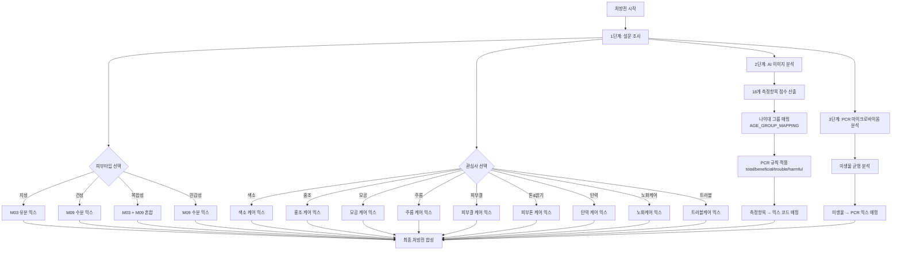

# 처방전(Prescription) 가이드

> **프로젝트:** SkinLens v1.0
> **처방 시스템:** PCR 기반 처방 + 피부 평가 점수 기반 처방  
> **처방 구성:** 베이스 + 활성 믹스 10종 (M01-M10) + PCR 믹스 3종
> **마지막 수정:** 2026-05-28

---

## 개요

SkinLens v1.0 처방전은 다음 세 가지 데이터 소스를 기반으로 개인맞춤형 화장품 처방을 생성합니다:

1. **설문 조사** - 피부 타입, 관심사
2. **AI 이미지 분석** - 피부 평가 점수 (18개 측정항목)
3. **PCR 마이크로바이옴 분석** - 미생물 균형

### 세럼(Serum)이란?

세럼은 고농축 기능성 에센스를 뜻하며, 피부에 빠르게 흡수되는 저분자 활성 성분을 고농도로 함유한 스킨케어 제품입니다. 일반적인 로션이나 크림보다 분자가 작아 피부 깊숙이 침투하여 효과적으로 작용합니다.

---

## 처방전 구성

### 베이스 (Base)

세럼의 기본 용매 (100 - 총믹스합)
- 모든 활성 성분을 녹이고 피부에 전달하는 역할
- 정제수, 글리세린, 부틸렌글리콜 등으로 구성

### 활성 믹스 10종 (M01-M10)

피부 평가 점수 기반 처방

**현재 사용 중인 믹스 10종:**
- **M01**: 톤&밝기 (톤·밝기)
- **M02**: 주름 (주름)
- **M03**: 유분 (피부 타입 기반)
- **M04**: 탄력&처짐 (탄력)
- **M05**: 색소침착 (색소)
- **M06**: 홍조 (홍조)
- **M07**: 모공 (모공)
- **M08**: 피부결 (텍스처)
- **M09**: 수분 (피부 타입 기반)
- **M10**: 트러블 (여드름)

### PCR 믹스 3종

마이크로바이옴 분석 기반 처방
- **프리바이오틱 믹스**: 피부 마이크로바이옴 총량이 평균 이하일 때 처방
- **프로바이오틱 믹스**: 유익균이 평균 이하일 때 처방
- **리밸런스케어 믹스**: 유해균이 평균 이상일 때 처방

---

## 처방전 생성 로직

### 전체 흐름



---

## 피부 평가 점수 기반 처방

### 측정항목 → 믹스 코드 매핑

| 카테고리 | 측정항목 | 믹스 코드 | 설명 |
|----------|----------|----------|------|
| 톤·밝기 | dullness_score | M01 | 톤&밝기 |
| 주름 | eye_wrinkle_score, nasolabial_wrinkle_score, fine_deep_wrinkle_score | M02 | 주름 |
| 탄력&처짐 | jawline_blur_score, cheek_sagging_score | M04 | 탄력&처짐 |
| 색소침착 | melasma_score, freckle_score, post_acne_pigment_score | M05 | 색소침착 |
| 홍조 | redness_score, post_inflammatory_erythema_score | M06 | 홍조 |
| 모공 | pore_size_score, pore_sagging_score | M07 | 모공 |
| 텍스처 | roughness_score | M08 | 피부결 |
| 트러블 | acne_score | M10 | 트러블 |

### 처방 비율 계산

```mermaid
flowchart TD
    subgraph 입력["입력"]
        A[18개 측정항목 점수<br/>0-100]
    end
    
    subgraph 매핑1["매핑 단계 1"]
        B[18개 측정항목<br/>→ 8개 카테고리]
    end
    
    subgraph 집계["집계 단계"]
        C[카테고리별<br/>최소 점수 선택]
    end
    
    subgraph 변환["변환 단계"]
        D[점수 → 처방 비율<br/>0% ~ 3.0%]
    end
    
    subgraph 매핑2["매핑 단계 2"]
        E[카테고리<br/>→ 믹스 코드]
    end
    
    subgraph 출력["출력"]
        F[최종 처방전<br/>{mix_code: percentage}]
    end
    
    A --> B
    B --> C
    C --> D
    D --> E
    E --> F
```

### 점수 → 비율 변환 로직

| 점수 범위 | 처방 비율 | 설명 |
|----------|-----------|------|
| 0 ~ 10 | 3.0% | 개선이 매우 필요함 |
| 10 ~ 20 | 2.5% | 개선이 필요함 |
| 20 ~ 30 | 2.0% | 집중 케어 필요 |
| 30 ~ 40 | 1.5% | 케어 필요 |
| 40 ~ 60 | 1.0% | 일반 케어 |
| 60 ~ 76 | 0.5% | 경미한 케어 |
| 76 ~ 100 | 0% | 케어 불필요 |

---

## PCR 마이크로바이옴 기반 처방

### 함수 시그니처

```javascript
async function calculatePrescription(pcrResultData, pcrResult, bacteriaList)
```

### 파라미터

| 파라미터 | 타입 | 설명 |
|---------|------|------|
| `pcrResultData` | `Object` | PCR 결과 메타데이터 (나이, 성별 포함) |
| `pcrResult` | `Object` | PCR 결과 JSONB (미생물별 함량, 단위: ng/sample) |
| `bacteriaList` | `Array` | 미생물 마스터 데이터 (카테고리 정보 포함) |

### 반환값

```typescript
{
  pcrRecipe: {
    base: {},
    skin: {},
    care: {},
    pcr: {
      [mixCode]: percentage,  // 예: { "M10": 1.5, "PM01": 2.0 }
    },
    assessment: {}
  },
  error: Error | null,
  calculationBasis: {
    total: { cV, aV, rV, prescription },
    beneficial: { cV, aV, rV, prescription },
    trouble: { cV, aV, rV, prescription },
    harmful: { cV, aV, rV, prescription }
  }
}
```

### 미생물 카테고리

| 카테고리 | 설명 | 처방 믹스 |
|----------|------|----------|
| 유익균 (Beneficial) | 피부 건강에 도움 | 프로바이오틱 믹스 |
| 중성균 (Trouble) | 과다 증식 시 문제 | 프리바이오틱 믹스 |
| 유해균 (Harmful) | 피부 문제 유발 | 리밸런스케어 믹스 |

---

## CLI/GUI에서의 처방전 활용

### CLI (Command Line Interface)

CLI에서는 처방전 기반 제품 매칭을 수행합니다:

1. **처방전 계산**: `prescription_calculator.create_prescription()`로 피부 평가 점수 기반 처방전 생성
2. **설문 응답 추출**: `input_json`에서 `skin_concerns`, `skin_types` 추출
3. **제품 매칭**: `ProductRepository.match_products_by_prescription()`로 처방전 + 설문 응답 기반 제품 매칭
4. **매칭 가중치**:
   - 처방 항목 매칭: 0.5
   - 고민사항 매칭: 0.3
   - 피부 타입 매칭: 0.2

**관련 파일**:
- `src/gui/image_enhancer.py` - CLI 진입점, LLM Reporter 호출
- `src/llm/llm_reporter.py` - 처방전 계산 및 제품 매칭
- `src/db/product_repository.py` - 제품 매칭 로직

### GUI (Graphical User Interface)

GUI에서도 CLI와 동일하게 처방전 기반 제품 매칭을 수행합니다:

1. **처방전 계산**: LLM Reporter 내부에서 `prescription_calculator.create_prescription()` 호출
2. **제품 매칭**: `ProductRepository.match_products_by_prescription()`로 처방전 기반 제품 매칭
3. **결과 표시**: 비교창의 LLM 소견 섹션에 맞춤형 제품 추천 표시

**관련 파일**:
- `src/gui/compare_dialog.py` - GUI 비교창, LLM 소견 표시
- `src/llm/llm_reporter.py` - 처방전 계산 및 제품 매칭
- `src/db/product_repository.py` - 제품 매칭 로직

### 제품 매칭 로직

```python
# product_repository.py
def match_products_by_prescription(
    prescription_recipe: Dict[str, float],  # 처방전 (예: {"M01": 2.5, "M06": 3.0})
    max_products: int = 5,
    concerns: Optional[List[str]] = None,  # 설문 응답: 고민사항
    skin_type: Optional[str] = None,  # 설문 응답: 피부 타입
) -> List[Dict[str, Any]]:
    # config.json에서 가중치 로드
    # 고민사항이 있는 경우: 처방 항목 0.5 + 고민사항 0.3 + 피부타입 0.2 = 최대 1.0
    # 고민사항이 없는 경우: 처방 항목 0.7 + 피부타입 0.3 = 최대 1.0
```

**config.json 설정**:
```json
"product_recommendation": {
  "matching_weights": {
    "with_concerns": {
      "prescription": 0.5,
      "concerns": 0.3,
      "skin_type": 0.2
    },
    "without_concerns": {
      "prescription": 0.7,
      "skin_type": 0.3
    }
  }
}
```

---

## 참고 문서

- `config.json` - 처방 매핑 설정 (`measurement_to_mix_code_mapping`, `age_group_mapping`)
- `src/prescription/prescription_calculator.py` - 처방 계산 로직 (PrescriptionCalculator)
- `SKIN_SCORING_GUIDE.md` - 피부 평가 점수 가이드
- `RESTORATION_ENGINE_GUIDE.md` - 복원 엔진 가이드

---

*생성일: 2026-05-24*
