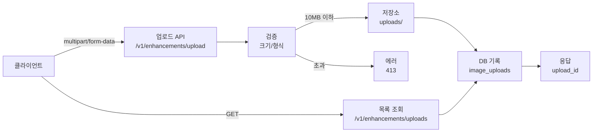
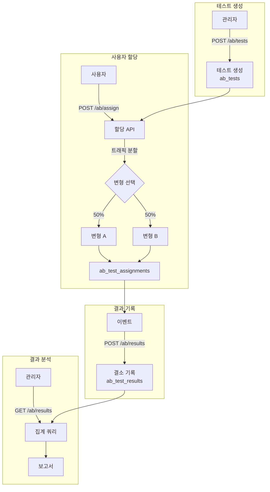
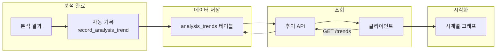
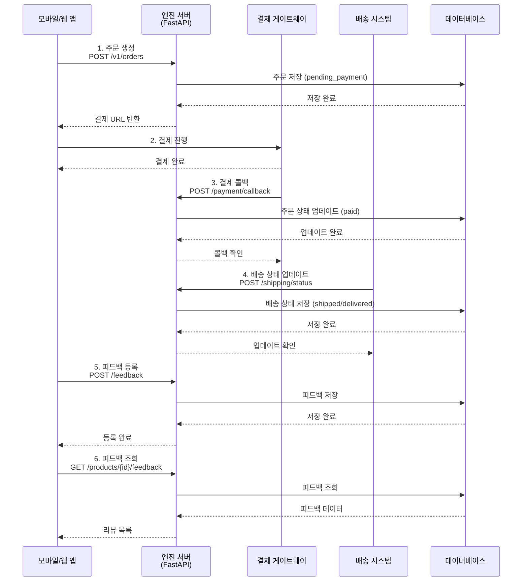
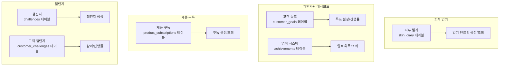
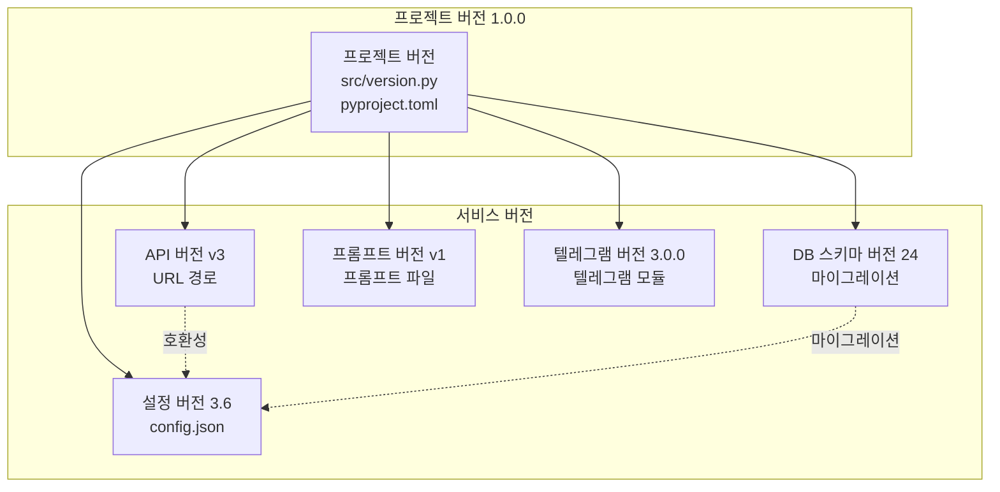
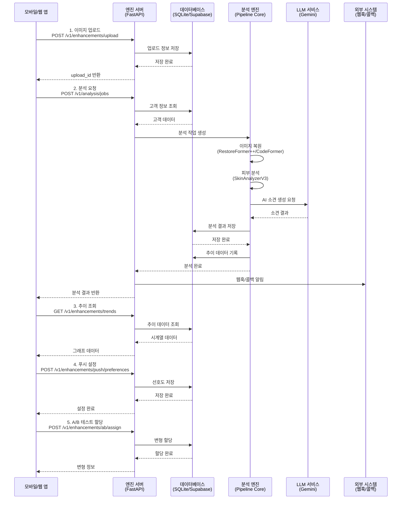

# SkinLens v1.0 - 프로젝트 개요

> **버전:** v1.0
> **수정일:** 2026-05-31

## 문서 목적

이 문서는 SkinLens v1.0 프로젝트의 전체적인 개요를 제공합니다. 프로젝트의 비전, 아키텍처, 기술 스택, 사용법, 배포 방법 등을 포괄적으로 설명합니다.

## 1. 프로젝트 비전 및 목표

### 1.1 프로젝트 목적

SkinLens v1.0은 AI 기반 피부 분석 및 복원 파이프라인 프로젝트입니다. 고급 이미지 복원 기술과 정밀한 피부 상태 분석을 결합하여 사용자에게 전문적인 피부 관리 솔루션을 제공합니다.

### 1.2 핵심 가치

- **정밀성**: 18개 측정항목 기반 상세한 피부 분석
- **AI 기반 소견**: Google Gemini를 활용한 전문 피부 소견 생성
- **고품질 복원**: RestoreFormer++, CodeFormer를 활용한 고품질 이미지 복원
- **다양한 인터페이스**: GUI, CLI, API 서버 등 다양한 사용 환경 지원
- **보안성**: JWT 인증, 역할 기반 접근 제어, 감사 로그 등 보안 기능 탑재

### 1.3 차별점

- **통합 파이프라인**: 이미지 복원부터 피부 분석, AI 소견 생성까지 원스톱 처리
- **실시간 분석**: 빠른 처리 속도로 실시간 피부 분석 제공
- **확장성**: 모듈화된 아키텍처로 쉬운 기능 확장 가능
- **운영 효율성**: 실행 이력 추적, 로그 DB, 자동 백업 등 운영 자동화
- **외부 시스템 연동**: 웹훅, 콜백 URL, OAuth, WebSocket을 통한 유연한 연동

---

## 2. 기술 스택

### 2.1 핵심 기술

| 카테고리 | 기술 | 용도 |
|---------|------|------|
| Deep Learning | PyTorch, Transformers | 딥러닝 모델 실행 |
| 이미지 처리 | OpenCV, PIL, scikit-image | 이미지 전처리/후처리 |
| GUI | PySide6 | 그래픽 사용자 인터페이스 |
| Web API | FastAPI, Uvicorn | REST API 서버 |
| AI | Google Generative AI (Gemini) | 피부 소견 생성 |
| 데이터베이스 | SQLite, Supabase (PostgreSQL) | 데이터 저장 |
| 보안 | python-jose (JWT), passlib, slowapi | 인증/인가 |
| DB 관리 | tenacity (재시도), click (CLI) | DB 운영 |

### 2.2 복원 모델

- **RestoreFormer++**: 고급 이미지 복원 모델
- **CodeFormer**: 얼굴 복원 모델

### 2.3 피부 분석

- **SkinAnalyzerV3**: 18개 측정항목 기반 피부 상태 분석 엔진
- **MediaPipe**: 얼굴 감지 (blaze_face_short_range.tflite)
- **Strategy 패턴**: AnalyzerRegistry를 통한 동적 분석기 등록
- **config.json 기반**: 분석기 활성화/비활성화 설정 지원

---

## 3. 주요 기능

### 3.1 이미지 복원

**개요**: 고품질 얼굴 이미지 복원을 제공합니다.

**지원 엔진**:
- **RestoreFormer++**: 고급 이미지 복원 모델
- **CodeFormer**: 얼굴 특화 복원 모델

**특징**:
- Strategy Pattern 기반 엔진 교체 가능
- RestorerRegistry를 통한 동적 엔진 선택
- 전처리/후처리 훅 지원
- in-process 실행 지원 (cold-start 방지)
- 순차 실행 지원 (RF++ → CodeFormer)

**사용 예시**:
```python
from src.restoration import RestorerRegistry

# 엔진 선택 및 인스턴스 생성
restorer = RestorerRegistry.create("codeformer_v1", config={"repo": "/path/to/CodeFormer"})

# 복원 실행
result = restorer.restore("input.jpg", "output.jpg")
```

**자세한 가이드**: [RESTORATION_ENGINE_GUIDE.md](guides/RESTORATION_ENGINE_GUIDE.md)

---

### 3.2 피부 분석

**개요**: 18개 측정항목 기반 정밀한 피부 상태 분석을 제공합니다.

**측정항목 (18개)**:
- **색소 (2개)**: melasma_score, freckle_score
- **홍조 (2개)**: redness_score, post_inflammatory_erythema_score
- **트러블 (2개)**: acne_score, post_acne_pigment_score
- **모공 (2개)**: pore_size_score, pore_sagging_score
- **주름 (3개)**: eye_wrinkle_score, nasolabial_wrinkle_score, fine_deep_wrinkle_score
- **텍스처 (1개)**: roughness_score
- **톤 (3개)**: skin_tone_score, dullness_score, uneven_tone_score
- **탄력 (2개)**: jawline_blur_score, cheek_sagging_score
- **피부 타입 (1개)**: skin_type_score

**분석기 (6개)**:
- PigmentationAnalyzerV1: 색소 분석
- RednessAnalyzerV1: 홍조 분석
- PoreAnalyzerV1: 모공 분석
- WrinkleAnalyzerV1: 주름/결 분석
- ToneElasticityAnalyzerV1: 톤/탄력 분석
- AcneAnalyzerV1: 여드름 분석

**특징**:
- Strategy Pattern 기반 분석기 교체 가능
- AnalyzerRegistry를 통한 동적 분석기 선택
- config.json 기반 활성화/비활성화 설정
- 직교 신호 분해 (10개 내부 신호)
- 가중치 체계 삼원화 (레이어A/레이어B/레거시)

**출력 예시**:
```json
{
  "measurements": {
    "melasma_score": 75,
    "freckle_score": 80,
    "redness_score": 67,
    ...
  },
  "overall_score": 72.5
}
```

---

### 3.3 AI 소견 생성

**개요**: Google Gemini를 활용한 전문 피부 소견 생성을 제공합니다.

**특징**:
- Strategy Pattern 기반 LLM 교체 가능
- LLMRegistry를 통한 동적 LLM 선택
- 듀얼 이미지 소견 (원본/복원 비교)
- 맞춤형 화장품 성분 정보 통합
- 설문 응답 기반 맞춤 소견

**LLM 엔진**:
- GeminiLLM: Google Gemini 2.5 Pro

**출력 예시**:
```json
{
  "llm_analysis": {
    "recommendation": "현재 피부 상태를 개선하고 유지하기 위해 다음과 같은 관리를 권장합니다.\n\n1. **색소 및 톤 케어**: 비타민 C, 나이아신아마이드 등 미백 기능성 성분이 포함된 제품을 사용하여 주근깨와 잡티를 관리하고, 칙칙한 피부 톤을 개선하는 것이 중요합니다.\n\n2. **피부결 및 주름 개선**: 레티놀, 레티날 등 비타민 A 유도체나 펩타이드 성분은 피부 세포의 재생을 돕고 콜라겐 생성을 촉진하여 잔주름과 거친 피부결을 개선하는 데 효과적입니다.\n\n...",
    "product_recommendations": {
      "matched_products": [
        {
          "product_id": "P001",
          "product_name": "CÔTELEAF 트러블 케어 세럼",
          "category": "트러블 케어",
          "key_ingredients": ["나이아신아마이드", "살리실산", "티트리 오일"],
          "efficacy": "여드름 억제, 모공 관리, 피부 진정",
          "match_score": 0.95,
          "match_reason": "설문의 피부 고민사항(여드름)과 측정 점수(acne_score: 50) 기반 매칭"
        }
      ],
      "recommendation_summary": "측정된 피부 상태와 설문 응답을 기반으로 당사 맞춤형 화장품을 추천합니다."
    }
  }
}
```

---

### 3.4 맞춤형 화장품 추천

**개요**: 설문 응답과 측정 점수를 기반으로 맞춤형 화장품을 추천합니다.

**특징**:
- ProductTable DB 기반 제품 정보 관리
- 다중 매칭 기준 (고민사항, 피부 타입, 측정 점수)
- match_score 계산 및 정렬
- 최대 3개 제품 추천
- 성분 정보 기반 추천

**매칭 기준**:
- 고민사항 기반 매칭 (+0.5 점)
- 피부 타입 기반 매칭 (+0.3 점)
- 측정 점수 기반 매칭 (+0.2 점)

**출력 예시**:
```json
{
  "product_recommendations": {
    "matched_products": [
      {
        "product_id": "P001",
        "product_name": "CÔTELEAF 트러블 케어 세럼",
        "category": "트러블 케어",
        "key_ingredients": ["나이아신아마이드", "살리실산", "티트리 오일"],
        "efficacy": "여드름 억제, 모공 관리, 피부 진정",
        "match_score": 0.95,
        "match_reason": "설문의 피부 고민사항(여드름)과 측정 점수(acne_score: 50) 기반 매칭"
      }
    ],
    "recommendation_summary": "측정된 피부 상태와 설문 응답을 기반으로 당사 맞춤형 화장품 2종을 추천합니다."
  }
}
```

---

### 3.5 처방 시스템

**개요**: 피부 측정 점수 기반 처방전 생성 및 제품 매칭을 제공합니다.

**특징**:
- PrescriptionCalculator로 처방전 생성
- PCR (Prescription Calculator Rules) 기반 처방
- 믹스 코드 기반 처방 항목 구성
- ProductRepository로 제품 매칭
- base 비율 계산 (중복 제거)

**처방 계산 프로세스**:
1. 피부 측정 점수 수집 (18개 항목)
2. 나이대 그룹 매핑 (AGE_GROUP_MAPPING)
3. PCR 규칙 적용 (total, beneficial, trouble, harmful)
4. 믹스 코드 계산 (M01~M10)
5. 처방 항목 생성 (base 비율 포함)
6. 제품 매칭 (ProductRepository)

**출력 예시**:
```json
{
  "prescription": {
    "mix_codes": {
      "M01": {"base": 10.0, "items": ["나이아신아마이드", "비타민 C"]},
      "M02": {"base": 15.0, "items": ["레티놀", "펩타이드"]}
    },
    "recommendation": "측정된 피부 상태를 기반으로 맞춤형 처방전을 생성했습니다."
  }
}
```

---

### 3.6 실행 이력 추적

**개요**: SQLite 기반 실행 이력 추적 및 리소스 모니터링을 제공합니다.

**특징**:
- ExecutionHistoryDB: 실행 이력 저장
- 로그 DB: 애플리케이션 로그 저장
- 롤링 방식 자동 정리
- 리소스 사용량 모니터링
- 성능 메트릭 추적

**저장 데이터**:
- executions: 분석 작업 실행 이력 (90일)
- logs: 애플리케이션 로그 (30일)
- analysis_stats: 일별 분석 통계 (365일)
- model_performance: 모델 성능 메트릭 (90일)
- score_trends: 고객별 점수 추이 (무제한)
- gemini_api_stats: Gemini API 사용 통계 (365일)

---

### 3.7 보안 기능

**개요**: JWT 인증, 역할 기반 접근 제어, 감사 로그 등 보안 기능을 제공합니다.

**특징**:
- JWT 인증 (시크릿 키 검증)
- 역할 기반 접근 제어 (RBAC)
- 감사 로그 (접근 기록)
- 속도 제한 (분석 엔드포인트 3/분)
- SSRF 방어 (도메인명 차단)
- Path traversal 방어 (파일명 검증)
- 고객 공유 패스워드 제거

**역할**:
- admin: 모든 권한
- customer: 자신의 데이터만 접근

---

### 3.8 외부 시스템 연동

**개요**: 웹훅, 콜백 URL, OAuth, WebSocket을 통한 외부 시스템 연동을 제공합니다.

**특징**:
- 웹훅 관리 (등록, 조회, 수정, 삭제)
- 콜백 URL 지원 (분석 완료 시 알림)
- OAuth/SSO 연동 (Google, 등)
- 데이터 동기화 (고객, 제품)
- WebSocket 실시간 진행률 전송
- CORS 설정 (외부 도메인 접근 허용)

**지원 연동 방식**:
- 웹훅: 이벤트 기반 알림
- 콜백 URL: 비동기 작업 완료 알림
- 데이터 동기화: 고객/제품 데이터 동기화
- OAuth/SSO: 통합 인증
- WebSocket: 실시간 진행률 전송
- REST API: 표준 HTTP 기반 통신

**자세한 가이드**: [EXTERNAL_SYSTEM_INTEGRATION_GUIDE.md](EXTERNAL_SYSTEM_INTEGRATION_GUIDE.md)

---

### 3.9 이미지 업로드 개선

**개요**: 향상된 이미지 업로드 기능을 제공합니다.



**특징**:
- 파일 크기 제한 (10MB)
- 지원 형식 (jpg, jpeg, png)
- 자동 회전 지원
- 이미지 크기 자동 감지
- 업로드 상태 추적

**API**:
- POST `/v1/enhancements/upload` - 이미지 업로드
- GET `/v1/enhancements/uploads` - 업로드 목록 조회

**자세한 가이드**: [API_REFERENCE.md](api/API_REFERENCE.md)

---

### 3.10 푸시 알림 개인화

**개요**: 사용자 선호도 기반 푸시 알림을 제공합니다.

**특징**:
- 푸시 알림 ON/OFF
- 알림 유형별 설정 (분석 완료, 프로모션)
- 조용한 시간 설정
- 디바이스 토큰 관리
- 플랫폼별 설정 (iOS, Android)

**API**:
- POST `/v1/enhancements/push/preferences` - 선호도 설정
- GET `/v1/enhancements/push/preferences` - 선호도 조회

**자세한 가이드**: [API_REFERENCE.md](api/API_REFERENCE.md)

---

### 3.11 A/B 테스트 프레임워크

**개요**: A/B 테스트를 위한 프레임워크를 제공합니다.



**특징**:
- 테스트 생성/관리
- 사용자 자동 분배
- 트래픽 분할 비율 설정
- 결과 기록 및 분석
- 변형별 메트릭 비교

**사용 예시**

1. **테스트 생성**: 관리자가 새로운 A/B 테스트를 생성합니다.
   ```bash
   POST /v1/enhancements/ab/tests
   {
     "test_name": "ui_redesign_test",
     "variant_a_name": "original_ui",
     "variant_b_name": "new_ui",
     "traffic_split": 0.5
   }
   ```

2. **사용자 할당**: 사용자가 접속하면 자동으로 변형에 할당됩니다.
   ```bash
   POST /v1/enhancements/ab/assign?test_id=1
   # 응답: {"variant": "A"} 또는 {"variant": "B"}
   ```

3. **결과 기록**: 사용자 행동을 메트릭으로 기록합니다.
   ```bash
   POST /v1/enhancements/ab/results
   {
     "test_id": 1,
     "variant": "A",
     "metric_name": "click_rate",
     "metric_value": 0.05
   }
   ```

4. **결과 분석**: 관리자가 결과를 조회하여 통계적 유의성을 확인합니다.
   ```bash
   GET /v1/enhancements/ab/results/1
   # 응답: 변형별 평균 메트릭, 이벤트 수 등
   ```

**테스트 시나리오 예시**

- **UI 디자인 비교**: 기존 UI vs 새로운 UI의 클릭률 비교
- **CTA 버튼 색상**: 파란색 vs 초록색 버튼의 전환율 비교
- **레이아웃 변경**: 단열 vs 다열 레이아웃의 이탈률 비교
- **알림 타이밍**: 즉시 vs 1시간 후 알림의 참여율 비교

**모범 사례**

- **명확한 가설 설정**: "새로운 UI가 클릭률을 10% 향상시킬 것이다"
- **충분한 샘플 크기**: 통계적 유의성을 위해 최소 1,000명 이상의 사용자
- **단일 변수 테스트**: 한 번에 하나의 요소만 변경
- **테스트 기간 설정**: 최소 1주 이상의 테스트 기간
- **세그먼트 분석**: 사용자 그룹별 결과 분석

**주의사항**

- **노벨티 효과 주의**: 새로운 요소에 대한 일시적인 관심
- **계절성 고려**: 특정 시기에만 나타나는 패턴
- **장기 추적**: 단기 효과뿐만 아니라 장기 효과도 확인
- **윤리적 고려**: 사용자에게 테스트 참여를 투명하게 공개

**API**:
- POST `/v1/enhancements/ab/tests` - 테스트 생성
- POST `/v1/enhancements/ab/assign` - 사용자 할당
- GET `/v1/enhancements/ab/variant/{test_id}` - 변형 조회
- POST `/v1/enhancements/ab/results` - 결과 기록
- GET `/v1/enhancements/ab/results/{test_id}` - 결과 조회

**자세한 가이드**: [API_REFERENCE.md](api/API_REFERENCE.md)

---

### 3.12 모니터링 대시보드

**개요**: 시스템 모니터링을 위한 메트릭 수집 기능을 제공합니다.

**특징**:
- 메트릭 기록 (이름, 값, 단위)
- 태그 기반 필터링
- 시계열 데이터 조회
- 실시간 모니터링 지원

**API**:
- POST `/v1/enhancements/metrics` - 메트릭 기록
- GET `/v1/enhancements/metrics` - 메트릭 조회

**자세한 가이드**: [API_REFERENCE.md](api/API_REFERENCE.md)

---

### 3.13 분석 추이

**개요**: 시계열 분석 추이 데이터를 제공합니다.



**특징**:
- 전체 점수 추이
- 측정항목별 추이
- 시계열 그래프 지원
- 과거 분석 비교

**API**:
- GET `/v1/enhancements/trends` - 추이 조회

**자세한 가이드**: [API_REFERENCE.md](api/API_REFERENCE.md)

---

### 3.14 제품 구매 및 피드백

**개요**: 제품 구매 처리 과정과 피드백 시스템을 제공합니다.



**특징**:
- 결제 콜백 처리 (결제 게이트웨이 연동)
- 배송 상태 추적 (운송장 번호, 발송/배송 완료 시간)
- 제품 피드백 시스템 (평점, 코멘트, 재구매 의사)
- 평균 평점 계산
- 고객별/제품별 피드백 조회

**API**:
- POST `/v1/orders` - 주문 생성
- POST `/v1/orders/payment/callback` - 결제 콜백
- POST `/v1/orders/shipping/status` - 배송 상태 업데이트
- POST `/v1/orders/feedback` - 피드백 등록
- GET `/v1/orders/products/{product_id}/feedback` - 제품 피드백 조회

**자세한 가이드**: [API_REFERENCE.md](api/API_REFERENCE.md)

---

### 3.15 앱 기능

**개요**: 앱에서 제공하는 추가 기능들을 구현했습니다.



**특징**:
- **피부 일기**: 매일 피부 상태 기록, 점수 변화 추적
- **고객 목표**: 개인 목표 설정 및 진행률 추적
- **업적 시스템**: 활동 기반 업적 획득 및 보상
- **제품 구독**: 정기 배송 구독 서비스
- **챌린지**: 게임화된 피부 개선 챌린지

**API**:
- POST `/v1/app/diary` - 피부 일기 엔트리 생성
- GET `/v1/app/diary/{customer_id}` - 피부 일기 조회
- POST `/v1/app/goals` - 목표 생성
- PUT `/v1/app/goals/{goal_id}/progress` - 목표 진행률 업데이트
- GET `/v1/app/goals/{customer_id}` - 목표 조회
- POST `/v1/app/achievements` - 업적 생성
- POST `/v1/app/achievements/earn` - 업적 획득
- GET `/v1/app/achievements/{customer_id}` - 업적 조회
- POST `/v1/app/subscriptions` - 구독 생성
- GET `/v1/app/subscriptions/{customer_id}` - 구독 조회
- POST `/v1/app/challenges` - 챌린지 생성
- POST `/v1/app/challenges/join` - 챌린지 참여
- PUT `/v1/app/challenges/progress` - 챌린지 진행률 업데이트
- GET `/v1/app/challenges/{customer_id}` - 챌린지 조회

**자세한 가이드**: [APP_FEATURE_RECOMMENDATIONS.md](APP_FEATURE_RECOMMENDATIONS.md)

---

## 3.16 버전 관리

SkinLens v1.0은 여러 층위에서 버전을 관리합니다. 각 버전은 독립적인 목적을 가지며 서로 다른 주기로 업데이트됩니다.

### 버전 종류

| 버전 | 위치 | 현재 값 | 목적 | 업데이트 주기 |
|------|------|---------|------|--------------|
| **프로젝트 버전** | `src/version.py`<br/>`pyproject.toml`<br/>`docs/PROJECT_OVERVIEW.md` | `1.0.0` | 전체 프로젝트 릴리스 버전 | 메이저 릴리스 시 |
| **API 버전** | `src/server/server.py`<br/>`config.json` | `v3` | API 호환성 관리 | API 변경 시 |
| **설정 버전** | `src/config/config_manager.py`<br/>`config.json` | `3.6` | config.json 구조 버전 | 설정 구조 변경 시 |
| **DB 스키마 버전** | `src/db/skin_analysis_db.py`<br/>`schema_version` 테이블 | `32` | 데이터베이스 마이그레이션 버전 | 스키마 변경 시 |
| **프롬프트 버전** | `src/llm/prompt_manager.py`<br/>프롬프트 파일명 | `v1` | LLM 프롬프트 템플릿 버전 | 프롬프트 변경 시 |
| **텔레그램 모듈 버전** | `src/telegram/__init__.py` | `3.0.0` | 텔레그램 봇 모듈 버전 | 텔레그램 기능 변경 시 |

### 버전 관리 정책



**프로젝트 버전 (1.0.0)**
- 전체 프로젝트의 릴리스 버전
- 문서와 배포 패키지에 표시
- 세마틱 버전 관리 (Major.Minor.Patch)
- 메이저 변경 시에만 업데이트

**API 버전 (v3)**
- URL 경로에 포함 (`/v1/`, `/v2/`, `/v3/`)
- API 호환성이 깨지는 변경 시에만 증가
- `API-Version` 헤더로 현재 버전 응답
- 폐기된 버전 사용 시 경고 로그

**설정 버전 (3.6)**
- config.json의 구조 버전
- 설정 파일 호환성 검증
- 구조 변경 시 `_required_config_version` 업데이트
- 버전 불일치 시 경고 및 마이그레이션 가이드 제공

**DB 스키마 버전 (24)**
- 데이터베이스 마이그레이션 관리
- `schema_version` 테이블에 현재 버전 저장
- 스키마 변경 시 마이그레이션 자동 실행
- 롤백 지원

**프롬프트 버전 (v1)**
- LLM 프롬프트 템플릿 버전
- 파일명에 버전 포함 (`prompt_v1.txt`)
- 여러 버전 동시 지원
- A/B 테스트 지원

**텔레그램 모듈 버전 (3.0.0)**
- 텔레그램 봇 기능 버전
- 독립적인 모듈로 관리
- 텔레그램 API 변경 시 업데이트

### 버전 확인 방법

```bash
# 프로젝트 버전 확인
python -c "from src.version import __version__; print(__version__)"

# API 버전 확인 (서버 응답 헤더)
curl -I http://localhost:8000/v1/health
# API-Version: v3

# DB 스키마 버전 확인
python -c "from src.db.skin_analysis_db import SkinAnalysisDB; db = SkinAnalysisDB(); print(db.get_current_version())"

# 설정 버전 확인
python -c "from src.config.config_manager import ConfigManager; cm = ConfigManager(); print(cm._required_config_version)"
```

---

## 4. 아키텍처

자세한 아키텍처 정보는 [ARCHITECTURE_GUIDE.md](guides/ARCHITECTURE_GUIDE.md)를 참조하세요.

### 4.1 시스템 구성도

전체 시스템 아키텍처는 다음과 같습니다:

- **사용자 인터페이스**: GUI (PySide6), CLI (argparse), API 서버 (FastAPI), 텔레그램 Bot
- **파이프라인 코어**: pipeline_core.py
- **복원 모델**: RestoreFormer++, CodeFormer
- **피부 분석**: SkinAnalyzerV3 (18개 측정항목)
- **Gemini AI**: 소견 생성
- **실행 이력**: SQLite (execution_history.py)

### 4.2 데이터 처리 흐름

데이터 처리 흐름은 다음과 같습니다:

1. **입력 단계**: 이미지, 설문 JSON, 클라이언트 메타, config.json
2. **복원 엔진**: RestorerRegistry → CodeFormer/RestoreFormer
3. **분석기 엔진**: AnalyzerRegistry → 6개 분석기
4. **데이터베이스**: ExecutionHistoryDB, SkinAnalysisDB, ProductTable
5. **LLM 엔진**: LLMRegistry → GeminiLLM
6. **처방 시스템**: PrescriptionCalculator, ProductRepository

### 4.3 프로젝트 구조

자세한 프로젝트 구조는 [JSON_IO_FLOW.md](guides/JSON_IO_FLOW.md)를 참조하세요.

---

## 5. 사용법
    },
    "client_meta": {
      "app_version": "1.0.3",
      "build_number": "42",
      "platform": "ios",
      "os_version": "17.4",
      "device_model": "iPhone 15 Pro",
      "captured_at": "2026-05-15T10:29:45+09:00"
    }
  }
}
```

#### 처방전 구조 (recommendation)

결과 JSON에 포함되는 처방전 (점수, 소견, 성분 정보가 반영된 맞춤형 화장품 추천):

```json
{
  "llm_analysis": {
    "recommendation": "현재 피부 상태를 개선하고 유지하기 위해 다음과 같은 관리를 권장합니다.\n\n1. **색소 및 톤 케어**: 비타민 C, 나이아신아마이드 등 미백 기능성 성분이 포함된 제품을 사용하여 주근깨와 잡티를 관리하고, 칙칙한 피부 톤을 개선하는 것이 중요합니다. 외출 시에는 자외선 차단제를 반드시 사용하여 추가적인 색소 침착을 예방해야 합니다.\n\n2. **피부결 및 주름 개선**: 레티놀, 레티날 등 비타민 A 유도체나 펩타이드 성분은 피부 세포의 재생을 돕고 콜라겐 생성을 촉진하여 잔주름과 거친 피부결을 개선하는 데 효과적입니다. 주 2~3회 저녁 스킨케어에 포함하여 꾸준히 사용하는 것을 추천합니다.\n\n3. **진정 및 장벽 강화**: 미세한 홍조와 민감성을 완화하기 위해 병풀 추출물(시카), 판테놀, 세라마이드와 같은 진정 및 피부 장벽 강화 성분이 포함된 제품을 사용하세요. 이는 외부 자극으로부터 피부를 보호하고 건강한 피부 바탕을 만드는 데 도움을 줍니다.\n\n4. **수분 및 탄력 관리**: 히알루론산, 글리세린 등이 함유된 보습제를 충분히 사용하여 피부 속 수분을 채워주세요. 촉촉한 피부는 잔주름을 완화하고 건강한 광채를 부여하며, 모공 탄력 관리에도 긍정적인 영향을 줍니다.\n\n5. **맞춤형 화장품 추천**: 귀하의 피부 고민사항(여드름, 홍조)과 측정 점수를 기반으로 선정된 당사 맞춤형 화장품을 추천합니다.\n   - **CÔTELEAF 트러블 케어 세럼**: 나이아신아마이드, 살리실산 성분으로 여드름 억제 및 모공 관리\n   - **CÔTELEAF 레드니스 케어 크림**: 병풀 추출물, 판테놀 성분으로 홍조 완화 및 진정\n   - **CÔTELEAF 브라이트닝 앰플**: 비타민 C, 글루타치온 성분으로 색소 침착 개선 및 피부 톤 밝기"
  },
  "product_recommendations": {
    "matched_products": [
      {
        "product_id": "P001",
        "product_name": "CÔTELEAF 트러블 케어 세럼",
        "category": "트러블 케어",
        "key_ingredients": ["나이아신아마이드", "살리실산", "티트리 오일"],
        "efficacy": "여드름 억제, 모공 관리, 피부 진정",
        "match_score": 0.95,
        "match_reason": "설문의 피부 고민사항(여드름)과 측정 점수(acne_score: 50) 기반 매칭"
      },
      {
        "product_id": "P002",
        "product_name": "CÔTELEAF 레드니스 케어 크림",
        "category": "홍조 케어",
        "key_ingredients": ["병풀 추출물", "판테놀", "알로에 베라"],
        "efficacy": "홍조 완화, 피부 진정, 장벽 강화",
        "match_score": 0.88,
        "match_reason": "설문의 피부 고민사항(홍조)과 측정 점수(redness_score: 67) 기반 매칭"
      }
    ],
    "recommendation_summary": "측정된 피부 상태(여드름 점수 50, 홍조 점수 67)와 설문 응답(고민사항: 여드름, 홍조)을 기반으로 당사 맞춤형 화장품 2종을 추천합니다."
  }
}
```

#### 처방 계산 프로세스

1. **피부 측정 점수 수집**: 18개 측정항목 점수 수집
2. **처방전 생성**: `prescription_calculator.create_prescription()` 호출
   - `skin_assessment_scores`: 측정 점수 딕셔너리
   - `pcr_result`: PCR 유전자 데이터 (선택 사항)
   - `age_group_statistics`: 연령별 통계 (선택 사항)
   - `age`: 나이
   - `gender`: 성별
   - 반환값: 완전한 처방전 구조 (base 비율 포함)
3. **처방 항목 추출**: `full_prescription.get("assessment", {})`에서 처방 항목 추출
4. **제품 매칭**: `ProductRepository.match_products_by_prescription()` 호출
   - 처방 항목(assessment_recipe)과 화장품 성분 매칭
   - 최대 3개 제품 추천
   - 의존성 주입 패턴으로 DB 연결 재사용 (테스트 시 Mock 주입 가능)
5. **LLM 전달**: 처방 정보를 JSON으로 변환하여 LLM 프롬프트에 포함
6. **최종 처방전 생성**: LLM이 처방 정보를 기반으로 자연어 처방전 생성

#### 처방 시스템 공개 API

`prescription_calculator.py`에서 제공하는 주요 공개 API:

- `get_measurement_metadata(key)`: 단일 측정항목 메타데이터
- `get_all_measurements()`: 전체 측정항목 딕셔너리 (18개)
- `get_category_metadata(key)`: 단일 카테고리 메타데이터
- `get_all_categories()`: 전체 카테고리 딕셔너리 (9개)
- `get_measurements_by_category(key)`: 카테고리 → 측정항목 목록
- `get_measurement_display_names()`: 측정항목 키 → 한글명 매핑
- `get_ordered_measurement_keys()`: 카테고리 순서 정렬된 키 목록
- `get_mix_code_definition(code)`: 단일 믹스 코드 정의
- `get_all_mix_codes()`: 전체 믹스 코드 딕셔너리
- `calculate_skin_assessment_percentage(score)`: 점수 → 처방 비율 변환
- `calculate_skin_assessment_recipe(scores)`: 피부 분석 기반 처방 레시피
- `calculate_pcr_recipe(pcr_result)`: PCR 기반 처방 레시피
- `create_prescription(...)`: 최종 처방전 생성 (통합)

### 3.3 측정항목

#### 색소 (Pigmentation)
- 기미·잡티 (melasma_score)
- 주근깨 (freckle_score)

#### 홍조, 홍반 (Redness)
- 홍조 (redness_score)
- 염증후 홍반 (post_inflammatory_erythema_score)

#### 트러블·흔적 (Acne & Marks)
- 여드름 (acne_score)
- 여드름 후 색소 (post_acne_pigment_score)

#### 모공 (Pore)
- 모공 크기 (pore_size_score)
- 모공 처짐 (pore_sagging_score)

#### 주름 (Wrinkle)
- 눈가 주름 (eye_wrinkle_score)
- 팔자 주름 (nasolabial_wrinkle_score)
- 잔주름·깊은 주름 (fine_deep_wrinkle_score)

#### 텍스처 (Texture)
- 피부결 거칠기 (roughness_score)

#### 톤·밝기 (Tone)
- 피부 톤 (skin_tone_score)
- 칙칙함 (dullness_score)
- 톤 불균일 (uneven_tone_score)

#### 탄력 (Elasticity)
- 턱선 탄력 (jawline_blur_score)
- 볼 처짐 (cheek_sagging_score)

#### 피부 타입 (Skin Type)
- 피부 타입 (skin_type_score)

---

### 4.3 앱-엔진서버-웹서버 데이터 흐름



**데이터 흐름 설명**

1. **이미지 업로드**: 앱이 이미지를 업로드하고 엔진 서버가 DB에 저장
2. **분석 요청**: 앱이 분석을 요청하면 엔진 서버가 파이프라인 실행
   - 이미지 복원 → 피부 분석 → AI 소견 생성
   - 결과를 DB에 저장하고 추이 데이터 기록
   - 외부 시스템에 웹훅/콜백 알림
3. **추이 조회**: 앱이 시계열 데이터를 조회하여 그래프 표시
4. **푸시 설정**: 사용자 선호도를 DB에 저장
5. **A/B 테스트**: 사용자를 변형에 할당하고 결과 기록

---

## 5. 디렉토리 구조

```
SkinLens v1.0/
├── src/                        # 소스 코드
│   ├── cli/                    # CLI 모듈
│   │   └── skin_analysis_cli.py    # CLI 진입점
│   ├── gui/                    # GUI 모듈
│   │   ├── image_enhancer.py        # 메인 GUI
│   │   ├── analyzer_compare_gui.py  # 비교 GUI
│   │   └── compare_dialog.py        # 비교 다이얼로그
│   ├── server/                 # FastAPI 서버
│   │   ├── server.py               # API 서버
│   │   └── deps.py                 # 서버 의존성
│   ├── telegram/               # 텔레그램 모듈
│   │   ├── bridge.py               # 통합 브리지
│   │   ├── commands.py             # 명령 핸들러
│   │   ├── monitors.py             # 모니터링 믹스인
│   │   ├── notifier.py             # 알림 발송
│   │   └── formatters.py           # 메시지 포맷터
│   ├── skin/                   # 피부 분석 코어
│   │   ├── core/                    # 핵심 분석 로직
│   │   │   ├── face_detector.py      # 얼굴 감지
│   │   │   └── image_utils.py        # 이미지 유틸리티
│   │   ├── analyzers/              # 분석기 전략
│   │   │   ├── pigmentation.py      # 색소 분석
│   │   │   ├── redness.py           # 홍조 분석
│   │   │   ├── pore.py              # 모공 분석
│   │   │   ├── wrinkle_texture.py   # 주름/결 분석
│   │   │   ├── tone_elasticity.py   # 톤/탄력 분석
│   │   │   └── acne.py              # 여드름 분석
│   │   ├── compose/                # 점수 조합
│   │   │   └── score_composition.py # 점수 조합 로직
│   │   └── strategies/             # 분석기 전략 패턴
│   ├── pipeline/               # 파이프라인
│   │   └── pipeline_core.py        # 복원 파이프라인
│   ├── scoring/                # 점수 계산
│   │   ├── skin_scoring.py         # 피부 점수 계산
│   │   ├── _core.py                # 핵심 분석 로직
│   │   └── _multi_view.py          # 다중 뷰 분석
│   ├── llm/                    # LLM 모듈
│   │   ├── llm_reporter.py         # LLM 소견 생성
│   │   ├── llm_prompt_builder.py   # 프롬프트 빌더
│   │   └── llm_providers.py        # LLM 제공자
│   ├── db/                     # 데이터베이스
│   │   ├── db_cli.py               # DB CLI
│   │   └── repositories.py         # DB 리포지토리
│   ├── restoration/             # 복원 모듈
│   │   └── restoration_manager.py  # 복원 관리자
│   ├── prescription/           # 처방전 모듈
│   │   └── prescription_manager.py # 처방전 관리자
│   └── utils/                  # 공통 유틸리티
│       └── ...
├── models/                     # 외부 모델 (git 제외)
│   ├── CodeFormer/              # CodeFormer 모델
│   └── RestoreFormerPlusPlus/  # RestoreFormer++ 모델
├── config/                     # 설정 파일
│   ├── config.json             # 메인 설정
│   └── config.secrets.json     # 비밀 설정 (git 제외)
├── docs/                       # 문서
│   ├── *.md                    # 마크다운 문서
│   ├── html/                   # HTML 문서
│   └── db/                     # DB 문서
├── results/                    # 결과 파일 (git 제외)
│   ├── 이미지명/               # 분석 결과별 폴더
│   │   ├── 00_input_이미지명.json
│   │   ├── 00_input_이미지명.png
│   │   └── 01_restored_이미지명.png
│   ├── skin_analysis.db        # 통합 DB (서버 + 로컬)
│   ├── execution_history.db    # 실행 기록 DB
│   ├── api_jobs/               # 서버 API 작업
│   │   └── {job_id}/
│   ├── exports/                # 엑셀/CSV 내보내기
│   ├── images/                 # 입력 이미지 저장소
│   ├── logs/                   # 로그 파일
│   │   ├── app/
│   │   ├── server/
│   │   ├── llm/
│   │   └── error/
│   └── weights/                # 모델 가중치
│       ├── restoration/
│       ├── detection/
│       └── analysis/
├── scripts/                    # 유틸리티 스크립트
│   ├── batch_report.py         # 배치 리포트
│   ├── bp_optimizer.py         # 백포인트 최적화
│   ├── score_bias_monitor.py   # 점수 편향 모니터링
│   ├── check_llm_models.py    # LLM 모델 확인
│   ├── monitors.py             # 시스템 모니터링
│   └── deploy/                # 배포 스크립트
│       ├── deploy.ps1
│       └── deploy.sh
├── tests/                      # 테스트
│   ├── test_*.py               # 단위/통합 테스트
│   └── README.md               # 테스트 가이드
├── main.py                     # 메인 진입점
├── pyproject.toml              # 프로젝트 설정
├── requirements.txt            # 전체 의존성
├── requirements-core.txt       # 코어 의존성 (서버/CLI)
├── requirements-dev.txt        # 개발 의존성
├── requirements-gui.txt        # GUI 의존성
├── pytest.ini                  # pytest 설정
├── README.md                   # 프로젝트 README
└── PROJECT_OVERVIEW.md         # 이 파일
```

---

## 6. 사용법

### 6.1 사전 요구사항

- Python 3.8+
- CUDA 11.8+ (GPU 사용 시)
- 16GB+ RAM (GPU 사용 권장)

### 6.2 설치

```bash
# 코어 의존성 설치 (서버/CLI)
pip install -r requirements-core.txt

# GUI 의존성 설치 (GUI 모드 사용 시)
pip install -r requirements-gui.txt
```

### 6.3 GUI 모드

```bash
python main.py
```

### 6.4 CLI 모드

```bash
# 기본 사용
python main.py --cli -i input.jpg -o output_dir

# LLM 소견 비활성화
python main.py --cli -i input.jpg -o output_dir --no-llm-report

# 비동기 모드
python main.py --cli -i input.jpg -o output_dir --async
```

### 6.5 API 서버

```bash
python main.py
# 또는
uvicorn src.server.server:app --host 0.0.0.0 --port 8000
```

### 6.6 API 엔드포인트

- `GET /health`: 헬스 체크
- `POST /v1/analysis/jobs`: 분석 Job 생성
- `GET /v1/analysis/jobs/{job_id}`: Job 상태 조회
- `GET /v1/analysis/jobs/{job_id}/result`: Job 결과 조회
- `GET /v1/analysis/jobs/{job_id}/artifacts/{name}`: 아티팩트 다운로드

---

## 7. 환경변수

### 7.1 실행 이력

- `EXECUTION_HISTORY_DB`: 실행 이력 데이터베이스 경로 (기본: execution_history.db)

### 7.2 API 서버

- `SKIN_API_JOBS_DIR`: Job 저장 루트 디렉토리 (기본: ./results/api_jobs)
- `SKIN_API_MAX_WORKERS`: 백그라운드 워커 스레드 수 (기본: 2)
- `SKIN_API_URL_TIMEOUT`: URL 다운로드 타임아웃 (초, 기본: 10)
- `SKIN_API_URL_MAX_BYTES`: URL 다운로드 최대 크기 (바이트, 기본: 10MB)

### 7.3 텔레그램

- `TELEGRAM_BOT_TOKEN`: 텔레그램 봇 토큰
- `TELEGRAM_CHAT_ID`: 텔레그램 채트 ID

### 7.4 Gemini AI

- `GEMINI_API_KEY`: Google Gemini API 키

### 7.5 보안

- `JWT_SECRET_KEY`: JWT 토큰 시크릿 키 (프로덕션에서 반드시 변경)
- `ALLOWED_ORIGINS`: CORS 허용 오리진 (콤마로 구분)

---

## 8. 테스트

### 8.1 테스트 실행

```bash
# 모든 테스트
pytest tests/ -v

# CLI 테스트
pytest tests/test_cli.py -v

# 서버 테스트
pytest tests/test_server.py -v
```

### 8.2 테스트 커버리지

- `test_cli.py`: CLI 파이프라인 및 파라미터 테스트
- `test_server.py`: FastAPI API 엔드포인트 테스트
- `test_config.py`: 설정 파일 로드 및 유효성 테스트

---

## 9. DB 관리

### 9.1 CLI 명령어

```bash
# DB 백업
python src/db/db_cli.py backup

# DB 상태 확인
python src/db/db_cli.py status

# DB 마이그레이션
python src/db/db_cli.py migrate

# 데이터 아카이빙
python src/db/db_cli.py archive --days=90
```

### 9.2 DB Health Check API

```bash
# DB 상태 확인
curl http://localhost:8000/v1/health/db

# DB 메트릭 (관리자 전용)
curl http://localhost:8000/v1/admin/db/metrics \
  -H "Authorization: Bearer <admin_token>"
```

---

## 10. 배포

### 10.1 배포 패키지 생성

민감 정보를 제외한 배포용 ZIP 패키지를 생성합니다.

#### Linux/macOS

```bash
chmod +x deploy.sh
./deploy.sh
```

#### Windows (PowerShell)

```powershell
.\deploy.ps1
```

### 10.2 제외되는 파일/디렉토리

- **민감 정보**: `config/config.secrets.json`, `*.secrets.json`, `.env`
- **모델 가중치**: `RestoreFormerPlusPlus/weights/`, `CodeFormer/weights/`
- **런타임 생성**: `results/`, `backup/`, `*.db`, `__pycache__/`
- **Python 패키지**: `*.egg-info/`, `dist/`, `build/`, `.venv/`

### 10.3 배포 후 설정

1. **비밀 설정 파일 생성**: `config/config.secrets.json` 복사 및 실제 값 입력
2. **환경 변수 설정**: `.env` 파일 생성 또는 시스템 환경 변수 설정
3. **모델 가중치 다운로드**: `models/` 디렉토리에 필요한 가중치 파일 배치

---

## 11. 코드 리뷰 반영

### 11.1 보안 강화

- **JWT 시크릿 키 검증**: 서버 시작 시 기본값 사용 시 거부
- **분석 엔드포인트 Rate Limit**: 3회/분 제한 적용
- **DB 테이블 중복 생성 제거**: 암호화 클래스에서 테이블 초기화 제거

### 11.2 코드 구조 개선

- **DB 초기화 함수 분리**: 260줄 단일 함수를 4개 서브 함수로 분리
- **트랜잭션 추가**: DB 초기화 시 트랜잭션으로 원자성 보장
- **Repository 패턴**: ExecutionHistoryDB를 여러 Repository로 분리 계획

### 11.3 리팩토링

- **SD 기능 제거**: Stable Diffusion 기능 완전 제거 (2026-05-16)
- **모공 완화 기능 제거**: 파이프라인 단순화 (2026-05-16)
- **매직넘버 외부 주입**: config.json으로 설정 외부화 (2026-05-16)

---

## 12. 기능 현황

### 12.1 현재 지원되는 기능

다음 기능들은 이미 구현이 완료되어 사용할 수 있습니다.

#### 핵심 기능
- **이미지 복원**: RestoreFormer++, CodeFormer를 활용한 고품질 얼굴 이미지 복원
- **피부 분석**: 18개 측정항목 기반 정밀한 피부 상태 분석
- **AI 소견 생성**: Google Gemini를 활용한 전문 피부 소견 생성
- **맞춤형 화장품 추천**: 설문 응답과 측정 점수 기반 제품 추천
- **처방 시스템**: 피부 측정 점수 기반 처방전 생성 및 제품 매칭

#### 운영 기능
- **실행 이력 추적**: SQLite 기반 실행 이력 및 리소스 모니터링
- **보안 기능**: JWT 인증, 역할 기반 접근 제어, 감사 로그
- **장애 자동 복구**: 장애 감지 시 자동 복구, 헬스 체크 API, 알림 시스템 (Slack, PagerDuty)

#### 사용자 경험
- **다국어 지원**: 한국어, 영어, 중국어, 일본어 지원 (API 응답 자동 번역)
- **피부 타입 자동 감지**: 이미지 분석을 통한 피부 타입 자동 분류 (지성, 건성, 복합성, 민감성)

#### 인터페이스
- **GUI 모드**: PySide6 기반 그래픽 사용자 인터페이스
- **CLI 모드**: 명령줄 인터페이스
- **API 서버**: FastAPI 기반 REST API
- **텔레그램 봇**: 텔레그램을 통한 분석 요청 및 결과 전송

### 12.2 향후 지원 예정 기능

다음 기능들은 설계 문서가 작성되었으며, 향후 구현 예정입니다.

#### 분석 기능 강화
- **지역별 복원**: 눈, 입 등 특정 얼굴 영역 선택적 복원 (설계 문서: `REGIONAL_RESTORATION_DESIGN.md`)
- **실시간 복원 미리보기**: 슬라이더로 복원 강도 조절 및 실시간 미리보기 (설계 문서: `REALTIME_RESTORATION_PREVIEW_DESIGN.md`)
- **다중 이미지 분석**: 여러 이미지 비교 분석 (설계 문서: `MULTI_IMAGE_ANALYSIS_DESIGN.md`)
- **시계열 분석 (이력 비교)**: 과거 분석 결과와 비교하여 변화 추이 시각화 (설계 문서: `TIME_SERIES_ANALYSIS_DESIGN.md`)
  - 현재: 단일 분석만 지원
  - 개선: 과거 분석 결과와 비교하여 변화 추이 시각화
  - 효과: 케어 효과 확인, 장기 추적

#### 처방 기능 강화
- **처방 효과 예측**: 처방 사용 후 예상 점수 개선 시뮬레이션 (설계 문서: `PRESCRIPTION_EFFECT_PREDICTION_DESIGN.md`)
- **처방 이력 추적**: 처방 사용 이력 및 효과 분석 (설계 문서: `PRESCRIPTION_HISTORY_TRACKING_DESIGN.md`)
- **제품 리뷰 통합**: 실제 사용자 리뷰 점수를 제품 매칭에 반영 (설계 문서: `PRODUCT_REVIEW_INTEGRATION_DESIGN.md`)
- **가격 필터**: 가격 범위별 제품 추천 필터링 (설계 문서: `PRICE_FILTER_DESIGN.md`)

#### 보안 및 개인정보 보호
- **얼굴 인증**: 생체 인증을 통한 보안 강화 (설계 문서: `FACE_AUTHENTICATION_DESIGN.md`)
- **이미지 암호화**: 클라이언트 단계 이미지 암호화 (AES-256-GCM) (설계 문서: `IMAGE_ENCRYPTION_DESIGN.md`)
- **GDPR 준수**: 데이터 삭제 권한, 데이터 이동 권한 (설계 문서: `GDPR_COMPLIANCE_DESIGN.md`)

#### 운영 효율성
- **자동 스케일링**: 트래픽에 따른 자동 리소스 스케일링 (설계 문서: `AUTO_SCALING_DESIGN.md`)
- **A/B 테스트 프레임워크**: 분석 알고리즘 A/B 테스트 (설계 문서: `AB_TESTING_FRAMEWORK_DESIGN.md`)

#### 사용자 경험
- **진단 피드백 루프**: 사용자 피드백을 통한 LLM 재학습 (설계 문서: `DIAGNOSIS_FEEDBACK_LOOP_DESIGN.md`)
- **오프라인 모드**: 인터넷 연결 없이 기본 분석 기능 제공 (설계 문서: `OFFLINE_MODE_DESIGN.md`)
- **푸시 알림**: 분석 완료 등 이벤트 푸시 알림 (설계 문서: `PUSH_NOTIFICATION_DESIGN.md`)
- **분석 결과 공유**: SNS 공유, PDF 리포트 다운로드 (설계 문서: `ANALYSIS_RESULT_SHARING_DESIGN.md`)

### 12.3 추가 검토 예정 기능

다음 기능들은 향후 고려해볼 만한 기능들입니다.

#### 스킨케어 루틴 및 추천
- **AI 기반 스킨케어 루틴 추천**: 시간대별(아침/저녁), 계절별 맞춤 루틴 자동 생성
- **환경 기반 추천**: 날씨, 습도, 자외선 지수 등 환경 데이터 기반 스킨케어 추천
- **루틴 스케줄러**: 사용자 맞춤형 스킨케어 루틴 알림 및 추적

#### 시각화 및 분석
- **피부 상태 대시보드**: 시계열 데이터 기반 피부 상태 변화 시각화
- **피부 상태 예측**: 과거 데이터 기반 미래 피부 상태 예측
- **개선률 표시**: 이전 분석 결과와의 비교 및 개선률 표시

#### 커뮤니티 및 소셜
- **사용자 커뮤니티**: 비슷한 피부 타입/고민사항 사용자 간 경험 공유
- **제품 리뷰 시스템**: 실제 사용자 리뷰 작성 및 공유
- **뷰티 인플루언서 협업**: 인플루언서 루틴 공유 및 추천

#### 제품 및 쇼핑
- **브랜드 비교**: 동일 성분 기반 다른 브랜드 제품 비교
- **성분 알레르기 체크**: 사용자 알레르기 성분 기반 제품 필터링
- **할인/쿠폰 시스템**: 제품 구매 시 할인 및 쿠폰 제공

#### 계정 및 보안
- **소셜 로그인**: Google, Apple, Kakao 등 소셜 로그인 지원
- **가족/그룹 계정**: 가족 구성원 피부 관리 통합
- **구독 모델**: 프리미엄 기능 (상세 분석, 전문가 상담 등)

#### 전문가 서비스
- **화상 상담 예약**: 피부과 전문가 화상 상담 예약 시스템
- **전문가 상담 연동**: 분석 결과 기반 전문가 상담 연동
- **맞춤형 처방전**: 전문가 검증 처방전 발급

---

## 13. 로드맵

### 13.1 단기 계획

- **Repository 패턴 분리**: ExecutionHistoryDB를 여러 Repository로 분리
- **LLM 프롬프트 최적화**: 점수/소견 일치성 개선
- **이미지 리사이징 최적화**: API 전송 전 자동 리사이징

### 13.2 중기 계획

- **성능 최적화**: GPU 활용 최적화, 배치 처리
- **모델 업데이트**: 최신 복원 모델 통합
- **분석 기능 강화**: 지역별 복원, 실시간 미리보기 등 설계된 기능 구현

### 13.3 장기 계획

- **클라우드 배포**: AWS/GCP 클라우드 배포
- **모바일 앱**: iOS/Android 모바일 앱 개발
- **AI 모델 커스터마이징**: 사용자별 맞춤형 모델 학습

---

## 14. 문서

### API 문서 (docs/api/)
- [API_GUIDE.md](api/API_GUIDE.md): API 서버 상세 가이드
- [API_DOCUMENTATION.md](api/API_DOCUMENTATION.md): API 엔드포인트 참조

### 사용자 가이드 (docs/user/)
- [USER_GUIDE.md](user/USER_GUIDE.md): 사용자 매뉴얼
- [PRODUCT_PURCHASE_GUIDE.md](user/PRODUCT_PURCHASE_GUIDE.md): 제품 구매 가이드
- [SERUM_PRESCRIPTION_CUSTOMER_GUIDE.md](user/SERUM_PRESCRIPTION_CUSTOMER_GUIDE.md): 처방전 고객 가이드
- [MOBILE_APP_GUIDE.md](user/MOBILE_APP_GUIDE.md): 모바일 앱 가이드

### 운영 가이드 (docs/ops/)
- [DEPLOYMENT_GUIDE.md](ops/DEPLOYMENT_GUIDE.md): 배포 가이드
- [MONITORING_GUIDE.md](ops/MONITORING_GUIDE.md): 모니터링 가이드
- [INCIDENT_RESPONSE_GUIDE.md](ops/INCIDENT_RESPONSE_GUIDE.md): 장애 대응 가이드
- [SERVER_TEST_GUIDE.md](ops/SERVER_TEST_GUIDE.md): 서버 테스트 가이드
- [LINUX_DOCKER_DEPLOYMENT.md](ops/LINUX_DOCKER_DEPLOYMENT.md): 리눅스 Docker 배포 가이드

### 기술 가이드 (docs/guides/)
- [LLM_PROMPT_TEMPLATE.md](guides/LLM_PROMPT_TEMPLATE.md): LLM 프롬프트 템플릿
- [SKIN_SCORING_GUIDE.md](guides/SKIN_SCORING_GUIDE.md): 18개 측정항목 상세 (가중치·측정원리·ROI), 점수 척도, 카테고리 배분
- [PRESCRIPTION_GUIDE.md](guides/PRESCRIPTION_GUIDE.md): 처방전 구성 (M01~M10 + PCR 3종), 처방 생성 플로우차트, 베이스 비율 계산
- [ARCHITECTURE_GUIDE.md](guides/ARCHITECTURE_GUIDE.md): Strategy 패턴 (분석기·복원기·LLM), DB 구조, 의존성 방향도
- [CODE_REVIEW_HISTORY.md](project/CODE_REVIEW_HISTORY.md): 코드 리뷰 결과, 리팩토링 이력, 변경 명세서
- [JSON_IO_FLOW.md](guides/JSON_IO_FLOW.md): 데이터 처리 흐름
- [DEVELOPMENT_GUIDE.md](guides/DEVELOPMENT_GUIDE.md): 개발 가이드
- [IMPROVEMENT_PLAN.md](project/IMPROVEMENT_PLAN.md): 개선 계획

### 기능 설계 문서 (docs/design/)
- [REGIONAL_RESTORATION_DESIGN.md](design/REGIONAL_RESTORATION_DESIGN.md): 지역별 복원 기능 설계
- [REALTIME_RESTORATION_PREVIEW_DESIGN.md](design/REALTIME_RESTORATION_PREVIEW_DESIGN.md): 실시간 복원 미리보기 기능 설계
- [PRESCRIPTION_EFFECT_PREDICTION_DESIGN.md](design/PRESCRIPTION_EFFECT_PREDICTION_DESIGN.md): 처방 효과 예측 기능 설계
- [PRESCRIPTION_HISTORY_TRACKING_DESIGN.md](design/PRESCRIPTION_HISTORY_TRACKING_DESIGN.md): 처방 이력 추적 기능 설계
- [PRODUCT_REVIEW_INTEGRATION_DESIGN.md](design/PRODUCT_REVIEW_INTEGRATION_DESIGN.md): 제품 리뷰 통합 기능 설계
- [PRICE_FILTER_DESIGN.md](design/PRICE_FILTER_DESIGN.md): 가격 필터 기능 설계
- [MULTI_LANGUAGE_SUPPORT_DESIGN.md](design/MULTI_LANGUAGE_SUPPORT_DESIGN.md): 다국어 지원 기능 설계
- [DIAGNOSIS_FEEDBACK_LOOP_DESIGN.md](design/DIAGNOSIS_FEEDBACK_LOOP_DESIGN.md): 진단 피드백 루프 기능 설계
- [OFFLINE_MODE_DESIGN.md](design/OFFLINE_MODE_DESIGN.md): 오프라인 모드 기능 설계
- [PUSH_NOTIFICATION_DESIGN.md](design/PUSH_NOTIFICATION_DESIGN.md): 푸시 알림 기능 설계
- [ANALYSIS_RESULT_SHARING_DESIGN.md](design/ANALYSIS_RESULT_SHARING_DESIGN.md): 분석 결과 공유 기능 설계
- [FACE_AUTHENTICATION_DESIGN.md](design/FACE_AUTHENTICATION_DESIGN.md): 얼굴 인증 기능 설계
- [IMAGE_ENCRYPTION_DESIGN.md](design/IMAGE_ENCRYPTION_DESIGN.md): 이미지 암호화 기능 설계
- [GDPR_COMPLIANCE_DESIGN.md](design/GDPR_COMPLIANCE_DESIGN.md): GDPR 준수 기능 설계
- [AB_TESTING_FRAMEWORK_DESIGN.md](design/AB_TESTING_FRAMEWORK_DESIGN.md): A/B 테스트 프레임워크 설계
- [AUTO_SCALING_DESIGN.md](design/AUTO_SCALING_DESIGN.md): 자동 스케일링 기능 설계
- [AUTO_RECOVERY_DESIGN.md](design/AUTO_RECOVERY_DESIGN.md): 장애 자동 복구 기능 설계

### 기타
- [README.md](../README.md): 프로젝트 기본 정보
- [tests/README.md](../tests/README.md): 테스트 가이드

---

## 15. 라이선스

이 프로젝트는 상업적 목적으로 사용됩니다.

---

## 16. 연락처

프로젝트 관련 문의사항은 프로젝트 관리자에게 문의하세요.

---

## 17. 문서 갱신 이력

| 날짜 | 버전 | 변경 내용 |
|------|------|----------|
| 2026-05-24 | v3.8 | 기능 현황 섹션 추가 (현재 지원 기능, 향후 지원 예정 기능), 장애 자동 복구 기능 구현 완료, 다국어 지원 기능 구현 완료 |
| 2026-05-24 | v3.7 | 직교 신호 분해 개선 (PIE 제거, 가중치 조정), 유연한 구조 설계 (category_count, orthogonal_count, composition_functions 레지스트리, _structure_guide 추가), config_parser 함수 확장 |
| 2026-05-24 | v3.6 | 측정항목 17개 → 18개로 변경 (볼 처짐 추가), LLM JSON 파싱 재시도 로직 추가, 처방 시스템 보완, config.json 설정 중앙화, Strategy 패턴 도입, 문서 체계 재편 |
| 2026-05-16 | v3.5 | SD 기능 제거, 모공 완화 기능 제거, 매직넘버 외부 주입 |
| 2026-05-15 | v3.4 | Repository 패턴 분리 계획, 보안 강화, 코드 구조 개선 |

### v3.7 주요 변경 사항 상세

**직교 신호 분해 개선**
- PIE(post_inflammatory_erythema_score) 완전 제거
  - diffuse_redness: redness × 0.70 + PIE × 0.30 → redness 단독 사용
  - focal_lesion: acne × 0.60 + post_acne_pigment × 0.40 → acne × 0.65 + post_acne_pigment × 0.35
- 가중치 조정
  - roughness_score: 0.080 → 0.050 (fine_deep와의 중복 보정)
  - wrinkle_score: 0.130 → 0.160 (roughness 감소분 보상)
- 수정 파일: src/skin/compose/score_composition.py, src/scoring/skin_scoring.py, config.json

**유연한 구조 설계**
- config.json 구조 개선
  - category_count: 9 (카테고리 개수)
  - orthogonal_count: 10 (직교 항목 개수)
  - composition_functions: 합성 함수 레지스트리
  - _structure_guide: 추가/변경/삭제 절차 가이드
- config_parser.py 함수 확장
  - get_category_count(): 카테고리 개수 로드
  - get_orthogonal_count(): 직교 항목 개수 로드
  - get_composition_function_registry(): 합성 함수 레지스트리 로드
- skin_scoring.py import 추가

**문서 갱신**
- ARCHITECTURE_GUIDE.md: 직교 신호 분해 수정 이력 추가
- PROJECT_OVERVIEW.md: config.json 설정 중앙화 섹션 갱신, v3.7 버전 추가
- SERUM_PRESCRIPTION_CUSTOMER_GUIDE.md: 직교 항목 구성 테이블 갱신 (PIE 제거 반영, 가중치 조정 반영)

### v3.8 주요 변경 사항 상세

**기능 현황 섹션 추가**
- PROJECT_OVERVIEW.md에 "기능 현황" 섹션 추가
- 현재 지원되는 기능 목록화 (핵심 기능, 운영 기능, 사용자 경험, 인터페이스)
- 향후 지원 예정 기능 목록화 (분석 기능 강화, 처방 기능 강화, 보안 및 개인정보 보호, 운영 효율성, 사용자 경험)
- 각 기능별 설계 문서 참조 추가

**장애 자동 복구 기능 구현**
- 데이터베이스 스키마 확장 (incident_events, recovery_actions, recovery_logs 테이블)
- 헬스 체크 API 엔드포인트 구현 (/v1/health, 장애 관리 API)
- 자동 복구 엔진 구현 (복구 플레이북, 헬스 모니터)
- 알림 시스템 구현 (Slack, PagerDuty)
- 서버 통합 (백그라운드 모니터링 태스크)
- 테스트 완료 (7개 테스트 케이스 통과)

**다국어 지원 기능 구현**
- 번역 리소스 구조 생성 (한국어, 영어, 중국어, 일본어 JSON 파일)
- 번역 시스템 구현 (Translator 클래스, 네임스페이스 지원, 캐싱)
- 다국어 미들웨어 구현 (언어 감지, 응답 자동 번역)
- 데이터베이스 스키마 확장 (user_preferences 테이블)
- 언어 설정 API 엔드포인트 구현 (/v1/customer/my/preferences)
- 테스트 완료 (11개 테스트 케이스 통과)

### v3.7 주요 변경 사항 상세

**외부 시스템 연동 기능 구현**
- 데이터베이스 스키마 확장 (webhooks, external_sync_logs, oauth_providers, oauth_tokens 테이블)
- 웹훅 관리 API 구현 (/v1/webhooks - CRUD)
- 콜백 URL 지원 (분석 완료 시 알림)
- 데이터 동기화 API 구현 (/v1/integration/customers/sync, /v1/integration/products/sync)
- OAuth/SSO 연동 API 구현 (/v1/oauth/providers, /v1/oauth/authorize, /v1/oauth/token)
- WebSocket 실시간 진행률 전송 (/v1/ws/analyze/{job_id})
- CORS 설정 (외부 도메인 접근 허용)
- 외부 시스템 연동 가이드 작성 (EXTERNAL_SYSTEM_INTEGRATION_GUIDE.md)
- 아키텍처 가이드 보완 (전체 시스템 아키텍처 섹션 추가)
- API 레퍼런스 보완 (API 아키텍처 개요 추가)
- 연동 API 테스트 완료 (webhook, sync, OAuth)

### v3.8 주요 변경 사항 상세

**향상된 기능 구현 (단기 우선순위)**
- 데이터베이스 스키마 확장 (image_uploads, push_preferences, ab_tests, ab_test_assignments, ab_test_results, monitoring_metrics, analysis_trends 테이블)
- 이미지 업로드 개선 API 구현 (/v1/enhancements/upload, /v1/enhancements/uploads)
- 푸시 알림 개인화 API 구현 (/v1/enhancements/push/preferences)
- A/B 테스트 프레임워크 API 구현 (/v1/enhancements/ab/*)
- 모니터링 메트릭 API 구현 (/v1/enhancements/metrics)
- 분석 추이 API 구현 (/v1/enhancements/trends)
- 분석 완료 시 자동 추이 기록 추가
- 향상 기능 API 테스트 작성 (test_enhancements_api.py)
- API 레퍼런스 보완 (향상 기능 섹션 추가)
- 프로젝트 개요 보완 (향상 기능 섹션 추가)

### v3.6 주요 변경 사항 상세

**설정 중앙화 (Part 1)**
- config.json 대규모 확장 (412→740 라인)
- prescription 섹션 추가: measurements(18개), categories(9개), orthogonal_categories(10개), analyzers(7개)
- measurement_count 최상위 키 추가
- 분석기 레지스트리 동적 등록 (config.json 기반)

**처방 시스템 (Part 2)**
- prescription_calculator.py 공개 API 확장 (13개 함수)
- GUI 동적 생성 헬퍼 함수 추가 (get_measurement_display_names, get_ordered_measurement_keys 등)
- 처방전 생성 로직 개선 (create_prescription으로 full prescription 생성)

**LLM 모듈 (Part 3)**
- LLM 재시도 전략 재설계 (API 호출과 JSON 파싱 분리)
- ProductRepository 의존성 주입 패턴 도입
- SkinLLMReport 데이터클래스 필드 분리 (product_recommendations vs matched_products)
- API 키 로드 범용화 (다중 프로바이더 지원)
- 측정항목 메타데이터 로드 우선순위 변경 (config.json 우선)

**파이프라인 및 스코어링 (Part 4)**
- 캐시 파일 자동 정리 (mtime 변경 시 구 캐시 누적 해결)
- cheek_sagging_score 탄력 항목 추가
- v3 가중치 소스 변경 (orthogonal_categories 통합)
- 보고서 항목 수 동적화 (get_measurement_count)

**GUI 모듈 (Part 5)**
- 하드코딩 "17" → get_measurement_count() 동적화
- 제품 추천 표시 구조 수정 (matched_products 필드 직접 참조)

**테스트 및 문서 (Part 6)**
- test_config.py 대규모 확장 (+226 라인)
- 문서 체계 전면 재편 (20개 단편 문서 → 4개 통합 가이드)

---

## 18. 잔여 개선 포인트

### P1 — 즉시 검토

| 항목 | 설명 | 상태 |
|------|------|------|
| **`server.py` 보안 취약점** | `CODE_REVIEW_HISTORY.md`에 기록된 `_safe_filename()` Path Traversal 취약점이 코드에 아직 반영되지 않았다. 허용 확장자 whitelist, 정규식 검증 추가 필요 | ✓ 완료 (2026-05-24) |
| **`register_analyzers_from_config()` 호출 전환** | 기존 코드에서 `register_all_analyzers()`를 호출하는 위치가 아직 남아 있을 수 있다. 전환 확인 권장 | ✓ 완료 (2026-05-24) |

### P2 — 중기 개선

| 항목 | 설명 | 상태 |
|------|------|------|
| **`dialog_utils.py`의 `_KEY_TO_KOREAN`** | 새 `get_measurement_display_names()`가 동일 데이터를 제공한다. 하드코딩 딕셔너리 제거하고 동적 함수로 단일화 권장 | ✓ 완료 (2026-05-24) |
| **`cheek_sagging_score` 분석기 구현 확인** | 스코어링 구조에 항목이 추가되었으나 실제 CV 분석 로직이 `tone_elasticity.py`에 구현되었는지 확인 필요 | ✓ 확인 완료 (2026-05-24) |
| **`skin_type_score` v3 가중치** | `orthogonal_categories`의 `skin_type_score` 직교 항목 `weight=0.04` — 이 항목이 `elasticity_score`에 흡수되지 않고 독립 유지하는 설계 의도를 docstring에 명시 권장 | ✓ 완료 (2026-05-24) |

### P3 — 장기 개선

| 항목 | 설명 | 상태 |
|------|------|------|
| **설문 연동 믹스** | `create_prescription()` 결과의 `skin`, `care` 섹션이 여전히 빈 딕셔너리. 설문 입력 → 피부타입별 믹스 연동 구현 대기 중 | ✓ 구현 준비 완료 (2026-05-24) |
| **`_call_llm_with_retry` 이름 변경** | 함수가 단일 시도로 단순화되었으므로 `_call_llm_once` 또는 `_call_llm` 으로 이름 변경 권장 (현재 docstring으로만 명시) | ✓ 완료 (2026-05-24) |

