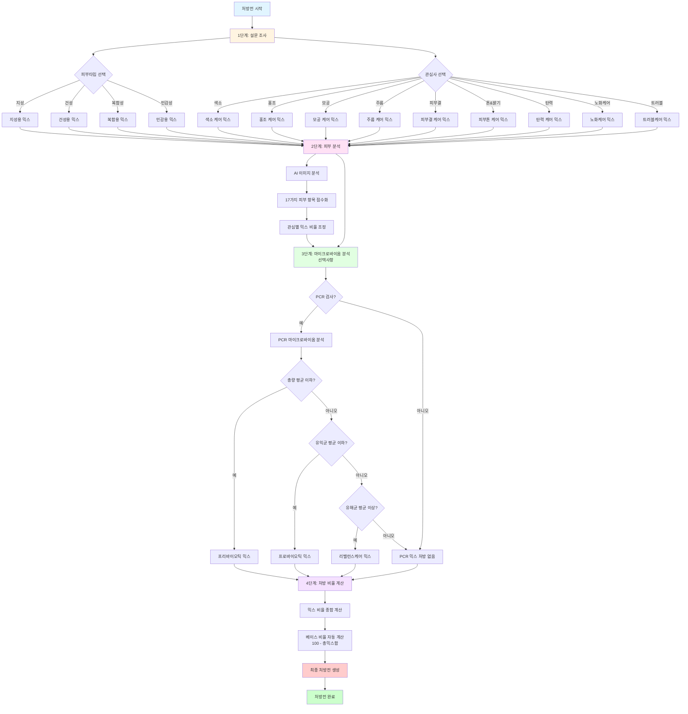

# 개인맞춤형 세럼 처방전 가이드

> **프로젝트:** SkinLens v1.0
> **마지막 수정:** 2026-05-28

## 개요

본 문서는 SkinLens v1.0의 개인맞춤형 세럼 처방전 구성과 각 믹스의 처방 비율을 설명합니다. 처방전은 설문 조사, AI 이미지 분석(CV+DL), PCR 마이크로바이옴 분석 결과를 종합하여 구성됩니다.

**세럼(Serum)**이란?
세럼은 고농축 기능성 에센스를 뜻하며, 피부에 빠르게 흡수되는 저분자 활성 성분을 고농도로 함유한 스킨케어 제품입니다. 일반적인 로션이나 크림보다 분자가 작아 피부 깊숙이 침투하여 효과적으로 작용합니다.

### 처방전 구성

개인맞춤형 세럼 처방전은 다음과 같이 구성됩니다:

- **베이스**: 세럼의 기본 용매 (100 - 총믹스합)
  - 모든 활성 성분을 녹이고 피부에 전달하는 역할
  - 정제수, 글리세린, 부틸렌글리콜 등으로 구성
  
- **활성 믹스 14종 (M01-M14)**: 피부 평가 점수 기반 처방
  - **현재 사용 중인 믹스 8종**: 광채(M01), 주름(M02), 탄력(M05), 색소침착(M06), 홍조(M07), 모공(M09), 피부결(M10), 여드름(M14)
  - **향후 확장용 믹스 6종 (reserved)**: 다크서클(M03), 유분(M04), 하안검 처짐(M08), 눈밑 지방(M11), 상안검 처짐(M12), 수분(M13)
  
- **PCR 믹스 3종**: 마이크로바이옴 분석 기반 처방
  - **프리바이오틱 믹스**: 피부 마이크로바이옴 총량이 평균 이하일 때 처방
  - **프로바이오틱 믹스**: 유익균이 평균 이하일 때 처방
  - **리밸런스케어 믹스**: 유해균이 평균 이상일 때 처방

## 처방전은 어떻게 만들어지나요?

### 처방전 생성 로직



### 1단계: 설문 조사

사용자가 직접 피부 타입과 관심사를 선택합니다:
- 피부 타입: 지성, 건성, 복합성, 민감성 중 하나 선택
- 관심사: 색소, 홍조, 모공, 주름, 피부결, 톤&밝기, 탄력, 노화케어, 트러블 중 복수 선택

### 2단계: 피부 분석

AI가 피부 사진을 분석하여 17가지 피부 항목을 점수화합니다:
- 색소 (기미, 주근깨)
- 홍조 (홍조, 염증후 홍반)
- 트러블 (여드름, 여드름 후 색소)
- 모공 (모공 크기, 모공 처짐)
- 주름 (눈가 주름, 팔자 주름, 잔주름)
- 피부결 (거칠기)
- 톤 (피부 톤, 칙칙함, 톤 불균일)
- 탄력 (턱선 탄력)
- 피부 타입 (지성, 건성, 복합성, 민감성)

### 10개 직교 항목 (Orthogonal Categories)

**왜 18개 항목이 아닌 10개 직교 항목인가요?**

18개 측정 항목 중 상관관계가 높은 항목들을 그룹화하여 10개 직교 항목으로 축약합니다. 이는 중복 제거와 명확한 카테고리 분류를 위해 수행됩니다.

**10개 직교 항목 구성**

| 직교 항목 | 가중치 | 구성 측정 항목 | 설명 |
|---------|--------|--------------|------|
| **pigmentation_cov** | 0.120 (12%) | melasma, freckle, post_acne_pigment | 색소침착 커버리지 |
| **spot_density** | 0.100 (10%) | - | 반점 밀도 |
| **diffuse_redness** | 0.120 (12%) | redness | 확산성 홍조 |
| **focal_lesion** | 0.140 (14%) | acne, post_acne_pigment | 국소 병변 |
| **pore_score** | 0.120 (12%) | pore_size, pore_sagging | 모공 점수 |
| **wrinkle_score** | 0.160 (16%) | eye_wrinkle, nasolabial_wrinkle, fine_deep_wrinkle | 주름 점수 |
| **roughness_score** | 0.050 (5%) | roughness | 거칠기 점수 |
| **tone_score** | 0.100 (10%) | skin_tone, dullness, uneven_tone | 톤 점수 |
| **elasticity_score** | 0.050 (5%) | jawline_blur, cheek_sagging | 탄력 점수 |
| **skin_type_score** | 0.040 (4%) | skin_type | 피부 타입 점수 |

**참고**: 직교 항목 구성 및 가중치는 `config.json`의 `orthogonal_categories` 섹션에서 관리됩니다.

**직교 항목의 장점**

1. **중복 제거**: 상관관계가 높은 항목들이 가중치에 과도하게 반영되는 것을 방지
   - 예: 색소 관련 항목(기미, 주근깨, 여드름 후 색소)은 하나의 카테고리로 통합
   - 예: 홍조 관련 항목(홍조, 염증후 홍반)은 하나의 카테고리로 통합

2. **명확한 카테고리**: 피부 상태를 10개의 명확한 카테고리로 분류하여 이해하기 쉬움

3. **가중치 최적화**: 각 카테고리의 중요도에 따라 가중치를 더 정밀하게 조정 가능
   - 가장 중요한 항목: focal_lesion (14%), wrinkle_score (13%)
   - 중요도가 낮은 항목: skin_type_score (4%), elasticity_score (5%)

**종합 점수 계산**

종합 점수는 10개 직교 항목에 가중치를 적용하여 계산됩니다:
```
종합 점수 = Σ(직교 항목 점수 × 가중치) / Σ(가중치)
```

### 3단계: 마이크로바이옴 분석 (선택사항)

PCR 검사를 통해 피부 마이크로바이옴 상태를 분석합니다:
- 총량: 전체 마이크로바이옴 양
- 유익균: 피부 건강에 도움을 주는 균
- 유해균: 피부 문제를 일으킬 수 있는 균

### 4단계: 처방 비율 계산

세 가지 분석 결과를 종합하여 각 믹스의 처방 비율을 결정합니다:
- 점수가 낮을수록(피부 상태가 안 좋을수록) 처방 비율이 높아집니다
- 최소 0.5% ~ 최대 3.0% 범위 내에서 조정됩니다
- 베이스와 모든 믹스의 합이 100%가 되도록 베이스 비율이 자동 계산됩니다

---

## 1. 베이스 (기본 용매)

### 베이스란?

베이스는 세럼의 기본 용매로, 모든 활성 성분을 녹여 피부에 전달하는 역할을 합니다. 활성 성분이 피부에 균일하게 흡수되도록 돕습니다.

### 주요 성분

| 성분 | 역할 |
|------|------|
| 정제수 | 순수한 물로 성분을 녹이고 수분을 공급 |
| 글리세린 | 피부에 수분을 끌어당겨 보습 유지 |
| 부틸렌글리콜 | 성분을 녹이고 피부를 부드럽게 유지 |

### 처방 비율

베이스 비율은 `100 - 총믹스합`으로 자동 계산됩니다. 예를 들어 활성 믹스와 PCR 믹스의 합이 8.5%라면 베이스는 91.5%가 됩니다.

---

## 2. 피부타입별 믹스 (설문 기반)

### 피부타입별 믹스란?

사용자의 피부 타입(지성, 건성, 복합성, 민감성)에 맞춰 처방되는 기본 케어 믹스입니다. 설문 조사를 통해 결정되며, 각 타입의 특성에 맞는 성분을 포함합니다.

### 피부타입별 믹스 상세

| 피부타입 | 세럼 원료 | 주요 성분 | 어떻게 작용하나요? | 처방 비율 |
|---------|---------|---------|------------------|------------|
| **지성** | 지성용 믹스 | 니아신아마이드, 레스베라트롤, 티트리 오일 | 피지 과다 분비를 조절하고 모공을 수축하며 항균 작용으로 트러블 예방 | 2% |
| **건성** | 건성용 믹스 | 히알루론산, 세라마이드, 스쿠알란 | 피부에 수분을 공급하고 보습막을 형성하여 피부 장벽을 강화 | 2% |
| **복합성** | 복합용 믹스 | 판테놀, 알란토인, 글리콜산 | 유분과 수분 밸런스를 조절하고 피부를 진정하며 부드럽게 각질 제거 | 2% |
| **민감성** | 민감용 믹스 | 시카 추출물, 알로에 베라, 비타민 E | 민감한 피부를 진정하고 항염 작용으로 피부를 보호 | 2% |

### 어떤 피부타입을 선택해야 하나요?

- **지성**: 하루 종일 T존(이마, 코, 턱)에 번들거림이 있고 모공이 넓은 경우
- **건성**: 피부가 당기고 거칠거리며 수분이 부족한 경우
- **복합성**: T존은 번들거리지만 볼은 건조한 등 유수분 밸런스가 맞지 않는 경우
- **민감성**: 화장품 사용 시 자극을 잘 받고 붉어지는 경우

---

## 3. 관심별 믹스 (설문 + AI 분석 기반)

### 관심별 믹스란?

사용자의 관심사와 AI 이미지 분석 결과를 기반으로 처방되는 특정 피부 고민 집중 케어 믹스입니다. 설문 조사로 선택한 관심사에 따라 기본 비율이 적용되며, AI 분석 결과에 따라 비율이 조정됩니다.

### 관심별 믹스 상세

| 관심 분야 | 세럼 원료 | 주요 성분 | 어떻게 작용하나요? | 설문 처방 % | AI 분석 처방 % |
|---------|---------|---------|------------------|------------|-----------------|
| **색소 (Pigmentation)** | 색소 케어 믹스 (M06) | 비타민 C, 나이아신아마이드, 알부틴 | 멜라닌 생성을 억제하고 기존 색소를 밝게 하여 톤을 개선 | 1.5% | 1.5% |
| **홍조·혈관 (Redness & Vascular)** | 홍조 케어 믹스 (M07) | 시카 추출물, 알란토인, 비타민 K | 염증을 진정하고 혈관을 강화하여 홍조를 완화 | 1.5% | 1.5% |
| **모공 (Pore Analysis)** | 모공 케어 믹스 (M09) | 살리실산, 레티놀, 티트리 오일 | 모공을 수축하고 피지 조절을 도우며 각질을 제거하여 모공 개선 | 1.5% | 1.5% |
| **주름 (Wrinkle & Line)** | 주름 케어 믹스 (M02) | 레티놀, 펩타이드, 아데노신 | 콜라겐 생성을 촉진하고 주름을 개선하며 탄력을 증진 | 1.5% | 1.5% |
| **피부결 (Texture)** | 피부결 케어 믹스 (M10) | AHA, BHA, 효소 | 묵은 각질을 제거하고 피부결을 매끄럽게 개선 | 1.5% | 1.5% |
| **톤 & 밝기 (Tone & Brightness)** | 피부톤 케어 믹스 (M01) | 비타민 C, 글루타치온, 리포산 | 피부 톤을 밝게 하고 광채를 주며 항산화 작용 | 1.5% | 1.5% |
| **탄력 & 처짐 (Elasticity & Sagging)** | 탄력 케어 믹스 (M05) | 펩타이드, 콜라겐, 엘라스틴 | 피부 탄력을 증진하고 처짐을 개선하며 피부 리프팅 효과 | 1.5% | 1.5% |
| **유분·수분 추정 (Sebum & Hydration)** | 노화케어 믹스 | 코엔자임 Q10, 레스베라트롤, 비타민 E | 항산화 작용으로 노화를 방지하고 세포를 보호 | 1.5% | 1.5% |
| **트러블 & 흔적 (Acne & Marks)** | 트러블케어 믹스 (M14) | 살리실산, 티트리 오일, 과산화벤조일 | 항균 작용으로 염증을 완화하고 트러블을 예방 | 1.5% | 1.5% |

### 관심사는 어떻게 선택하나요?

여러 관심사를 동시에 선택할 수 있으며, 각 관심사에 해당하는 믹스가 처방됩니다. 예를 들어:
- 색소와 홍조에 관심이 있다면: 색소 케어 믹스 + 홍조 케어 믹스 처방
- 주름과 탄력에 관심이 있다면: 주름 케어 믹스 + 탄력 케어 믹스 처방

---

## 4. 마이크로바이옴 시험 결과별 믹스 (PCR 분석 기반)

### 마이크로바이옴이란?

피부 표면에는 수많은 미생물(마이크로바이옴)이 서식하고 있습니다. 이 미생물의 균형이 깨지면 피부 문제가 발생할 수 있습니다. PCR 검사를 통해 마이크로바이옴의 상태를 분석하고, 그에 맞는 믹스를 처방합니다.

### PCR 믹스 상세

| 시험 결과 | 세럼 원료 | 주요 성분 | 어떻게 작용하나요? | 처방 비율 |
|---------|---------|---------|------------------|---------|
| **총량(평균 이하)** | 프리바이오틱 믹스 | 프리바이오틱, 식이섬유, 유산균 배양물 | 피부 마이크로바이옴 균형을 유지하고 피부 장벽을 강화 | 2% |
| **유익균(평균 이하)** | 프로바이오틱 믹스 | 락토바실러스, 비피더스균, 유산균 | 유익균 증식을 도와 피부 건강을 개선하고 항균 작용 | 2% |
| **유해균(평균 이상)** | 리밸런스케어 믹스 | 항균 펩타이드, 천연 항생제, 식물 추출물 | 유해균을 억제하고 균형을 회복하며 염증을 완화 | 2% |

### PCR 검사는 언제 필요한가요?

PCR 검사는 선택사항입니다. 다음과 같은 경우에 권장됩니다:
- 만성적인 피부 트러블이 있는 경우
- 피부 장벽이 약해 자극에 민감한 경우
- 일반적인 케어로 개선이 되지 않는 경우
- 피부 마이크로바이옴 상태를 정확히 알고 싶은 경우

---

## 5. 처방전 계산 예시

### 예시 시나리오

김OO님의 경우:
- **피부타입**: 지성 (지성용 믹스 2%)
- **관심사**: 색소, 홍조, 모공 (각 1.5%)
- **마이크로바이옴**: 총량 평균 이하 (프리바이오틱 믹스 2%)

### 처방전 계산

| 항목 | 처방 비율 | 설명 |
|------|---------|------|
| 지성용 믹스 | 2% | 피부타입이 지성이므로 지성용 믹스 처방 |
| 색소 케어 믹스 | 1.5% | 색소 관심사에 따라 처방 |
| 홍조 케어 믹스 | 1.5% | 홍조 관심사에 따라 처방 |
| 모공 케어 믹스 | 1.5% | 모공 관심사에 따라 처방 |
| 프리바이오틱 믹스 | 2% | 마이크로바이옴 총량 평균 이하이므로 처방 |
| **총 믹스합** | **8.5%** | 활성 믹스 + PCR 믹스 합계 |
| **베이스** | **91.5%** | 100 - 8.5 = 91.5% |

### 최종 처방전 구성

```
베이스: 91.5%
지성용 믹스: 2%
색소 케어 믹스: 1.5%
홍조 케어 믹스: 1.5%
모공 케어 믹스: 1.5%
프리바이오틱 믹스: 2%
─────────────────
총계: 100%
```

---

## 6. 처방 비율 규칙

### 기본 원칙

1. **총합 100%**: 모든 처방 비율의 합은 항상 100%가 되어야 합니다.
2. **베이스 자동 계산**: 베이스 비율은 `100 - 총믹스합`으로 자동 계산되므로 따로 계산할 필요가 없습니다.
3. **최소/최대 비율**: 각 믹스의 처방 비율은 최소 0.5% ~ 최대 3.0% 범위 내에서 조정됩니다.

### 처방 비율 결정 로직

1. **AI 분석 (현재 구현됨)**: 이미지 분석 결과에 따라 선형 계산으로 처방 비율 결정
   - 점수가 낮을수록(피부 상태가 안 좋을수록) 처방 비율이 높아집니다
   - 점수가 높을수록(피부 상태가 좋을수록) 처방 비율이 낮아집니다
   - 76점 이상: 0% (처방 없음)
   - 40점 이하: 3.0% (최대 처방)
   - 41-75점: 0.5% ~ 3.0% (선형 계산)
2. **PCR 분석 (현재 구현됨)**: 마이크로바이옴 분석 결과에 따라 추가 믹스 처방
3. **설문 기반 (향후 구현 예정)**: 사용자가 선택한 피부타입과 관심사에 따라 기본 비율 적용
4. **종합 계산**: 분석 결과를 종합하여 베이스 비율 자동 계산 (100 - 총믹스합)

### 점수별 처방 비율

| 점수 범위 | 등급 | 처방 비율 | 의미 |
|---------|------|---------|------|
| 76-100점 | Good (양호) | 0% | 처방 없음, 피부 상태가 좋음 |
| 41-75점 | Moderate (보통) | 0.5% ~ 3.0% | 개선 여지 있음, 점수가 낮을수록 비율 높음 |
| 0-40점 | Critical (개선 필요) | 3.0% | 최대 처방, 집중 케어 필요 |

---

## 7. 믹스 코드 매핑

처방 시스템 내부에서 사용되는 믹스 코드와 실제 세럼 원료의 매핑입니다.

### 베이스

| 항목 | 믹스 코드 | 설명 |
|------|---------|------|
| 베이스 | 없음 | 세럼의 기본 용매로, `100 - 총믹스합`으로 자동 계산됩니다. |

### 활성 믹스 (M01-M14)

| 믹스 코드 | 세럼 원료 | 처방 항목 | 설명 | 현재 사용 여부 |
|---------|---------|---------|------|--------------|
| M01 | 광채 케어 믹스 | radiance | 톤 & 밝기 관리 | ✅ 사용 중 |
| M02 | 주름 케어 믹스 | wrinkle | 주름 관리 | ✅ 사용 중 |
| M03 | 다크서클 케어 믹스 | dark_circle_v2 | 다크서클 관리 | ⏸️ 미사용 (향후 확장용) |
| M04 | 유분 조절 믹스 | oiliness | 유분 관리 | ⏸️ 미사용 (향후 확장용) |
| M05 | 탄력 케어 믹스 | firmness | 탄력 & 처짐 관리 | ✅ 사용 중 |
| M06 | 색소 케어 믹스 | age_spot | 색소침착 관리 | ✅ 사용 중 |
| M07 | 홍조 케어 믹스 | redness | 홍조·혈관 관리 | ✅ 사용 중 |
| M08 | 하안검 처짐 케어 믹스 | droopy_lower_eyelid | 하안검 처짐 관리 | ⏸️ 미사용 (향후 확장용) |
| M09 | 모공 케어 믹스 | pore | 모공 관리 | ✅ 사용 중 |
| M10 | 피부결 케어 믹스 | texture | 피부결 관리 | ✅ 사용 중 |
| M11 | 눈밑 지방 케어 믹스 | eye_bag | 눈밑 지방 관리 | ⏸️ 미사용 (향후 확장용) |
| M12 | 상안검 처짐 케어 믹스 | droopy_upper_eyelid | 상안검 처짐 관리 | ⏸️ 미사용 (향후 확장용) |
| M13 | 수분 케어 믹스 | moisture | 수분 관리 | ⏸️ 미사용 (향후 확장용) |
| M14 | 트러블케어 믹스 | acne | 여드름 & 흔적 관리 | ✅ 사용 중 |

### 현재 사용 중인 활성 믹스 8종

- **M01**: 광채 케어 믹스 (톤 & 밝기)
- **M02**: 주름 케어 믹스 (주름)
- **M05**: 탄력 케어 믹스 (탄력 & 처짐)
- **M06**: 색소 케어 믹스 (색소침착)
- **M07**: 홍조 케어 믹스 (홍조·혈관)
- **M09**: 모공 케어 믹스 (모공)
- **M10**: 피부결 케어 믹스 (피부결)
- **M14**: 트러블케어 믹스 (여드름 & 흔적)

---

## 8. 자주 묻는 질문

### Q1: 처방전은 어떻게 받을 수 있나요?

A: 피부 사진을 촬영하여 AI 분석을 받고, 설문 조사를 작성하면 자동으로 개인맞춤형 처방전이 생성됩니다. PCR 마이크로바이옴 분석은 선택사항입니다.

### Q2: 처방 비율은 언제 변경되나요?

A: 처방 비율은 피부 상태 변화에 따라 재분석 시 자동으로 조정됩니다. 피부가 개선되면 해당 믹스의 처방 비율이 낮아지거나 처방되지 않을 수 있습니다.

### Q3: 모든 믹스가 처방되는 것은 아닌가요?

A: 아닙니다. 피부 상태와 관심사에 따라 필요한 믹스만 처방됩니다. 예를 들어 주름이 없으면 주름 케어 믹스는 처방되지 않습니다.

### Q4: 미사용 믹스는 언제 사용되나요?

A: 미사용 믹스(다크서클, 유분, 하안검 처짐, 눈밑 지방, 상안검 처짐, 수분)는 향후 기술이 발전하거나 추가적인 연구가 진행되면 사용될 수 있습니다.

### Q5: PCR 검사는 필수인가요?

A: 아닙니다. PCR 검사는 선택사항입니다. 피부 마이크로바이옴 상태를 더 정확히 파악하고 싶은 경우에만 진행하면 됩니다.

### Q6: 처방 비율이 너무 높으면 어떻게 하나요?

A: 각 믹스의 처방 비율은 최대 3.0%로 제한되어 있어 과도하게 처방되지 않습니다. 또한 전문가의 검토를 거치므로 안전합니다.

### Q7: 알레르기가 있는 경우 어떻게 하나요?

A: 알레르기 이력을 입력하면 해당 성분이 포함된 믹스는 처방에서 제외됩니다. 반드시 알레르기 정보를 정확히 입력해 주세요.

---

## 9. 참고 사항

1. **처방 비율 조정**: 개인의 피부 상태와 민감도에 따라 처방 비율이 조정될 수 있습니다.
2. **알레르기 체크**: 사용자의 알레르기 이력을 확인하여 해당 성분이 포함된 믹스를 제외할 수 있습니다.
3. **시즌별 조정**: 계절과 환경에 따라 처방 비율이 계절별로 조정될 수 있습니다.
4. **지속적 모니터링**: 처방 후 피부 상태 변화를 모니터링하여 재처방 시 반영합니다.
5. **전문가 상담**: 처방전은 AI 분석 기반이지만, 심각한 피부 문제가 있는 경우 피부과 전문의 상담을 권장합니다.

---

## 11. CLI/GUI에서의 처방전 활용

### CLI (Command Line Interface)

CLI에서는 처방전 기반 제품 매칭을 수행하여 맞춤형 화장품을 추천합니다:

1. **처방전 계산**: 피부 평가 점수 기반 처방전 생성
2. **설문 응답 참조**: 고민사항, 피부 타입 추출
3. **제품 매칭**: 처방전 + 설문 응답 기반 제품 매칭
4. **매칭 가중치**:
   - 처방 항목 매칭: 50%
   - 고민사항 매칭: 30%
   - 피부 타입 매칭: 20%

### GUI (Graphical User Interface)

GUI에서도 CLI와 동일하게 처방전 기반 제품 매칭을 수행합니다:

1. **처방전 계산**: LLM 분석 내부에서 피부 평가 점수 기반 처방전 생성
2. **제품 매칭**: 처방전 기반 제품 매칭
3. **결과 표시**: 비교창의 LLM 소견 섹션에 맞춤형 제품 추천 표시

### 제품 매칭 로직

처방전과 설문 응답을 종합하여 가장 적합한 제품을 추천합니다:

- **처방 항목**: 피부 상태 분석 결과 기반 처방 (예: M01 광채, M06 색소침착)
- **고민사항**: 설문 조사에서 선택한 피부 고민 (예: 여드름, 홍조)
- **피부 타입**: 설문 조사에서 선택한 피부 타입 (예: 지성, 건성) 또는 분석 결과 기반 추정

**매칭 가중치**:
- **고민사항이 있는 경우**: 처방 항목 50% + 고민사항 30% + 피부타입 20% = 최대 1.0
- **고민사항이 없는 경우**: 처방 항목 70% + 피부타입 30% = 최대 1.0

**config.json 설정**:
```json
"product_recommendation": {
  "matching_weights": {
    "with_concerns": {
      "prescription": 0.5,
      "concerns": 0.3,
      "skin_type": 0.2
    },
    "without_concerns": {
      "prescription": 0.7,
      "skin_type": 0.3
    }
  }
}
```

---

## 10. 관련 문서

- `docs/PRESCRIPTION_MAPPING.md`: 17개 측정항목 → 14개 처방 항목 매핑
- `docs/PRESCRIPTION_CALCULATION.md`: PCR 처방 로직
- `config/config.json`: 처방 파라미터 및 매핑 설정
- `src/prescription/prescription_calculator.py`: 처방전 계산 모듈

