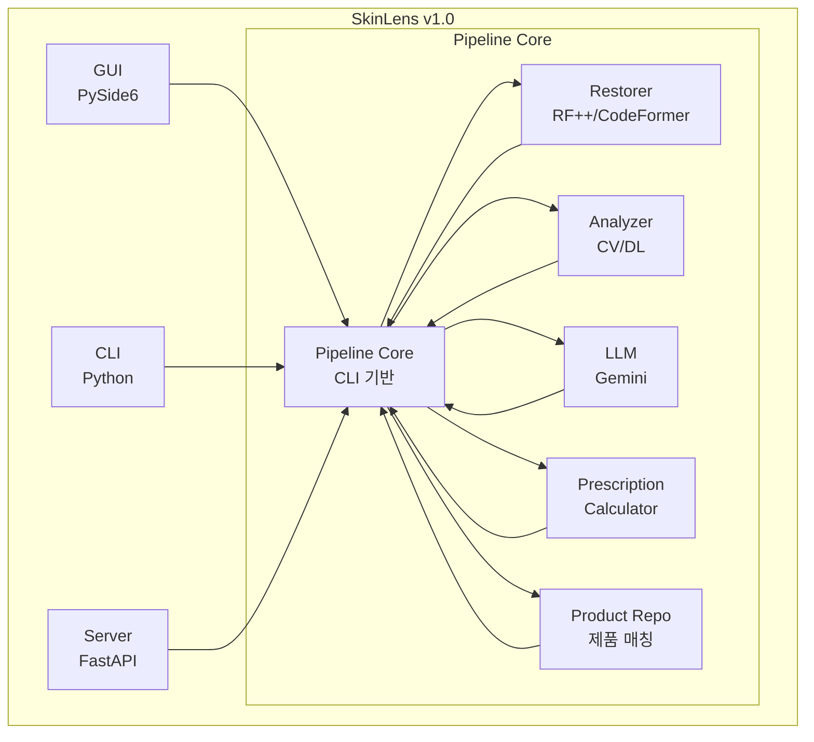
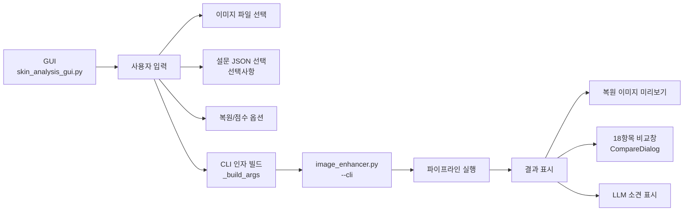
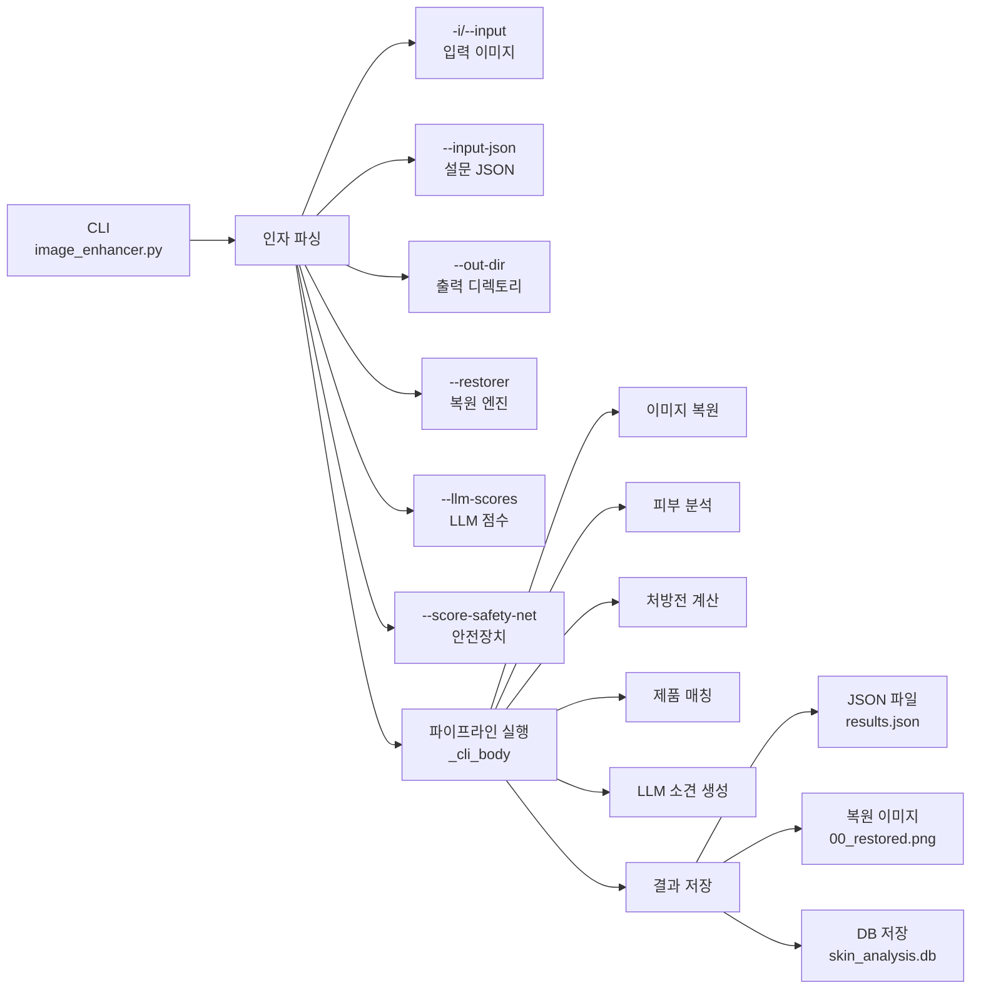
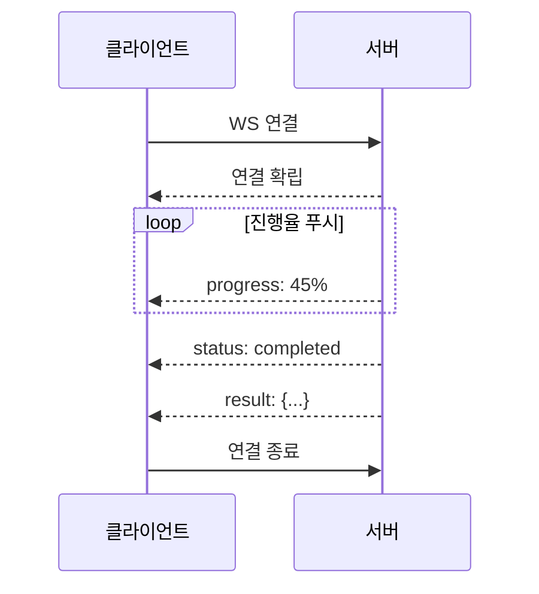
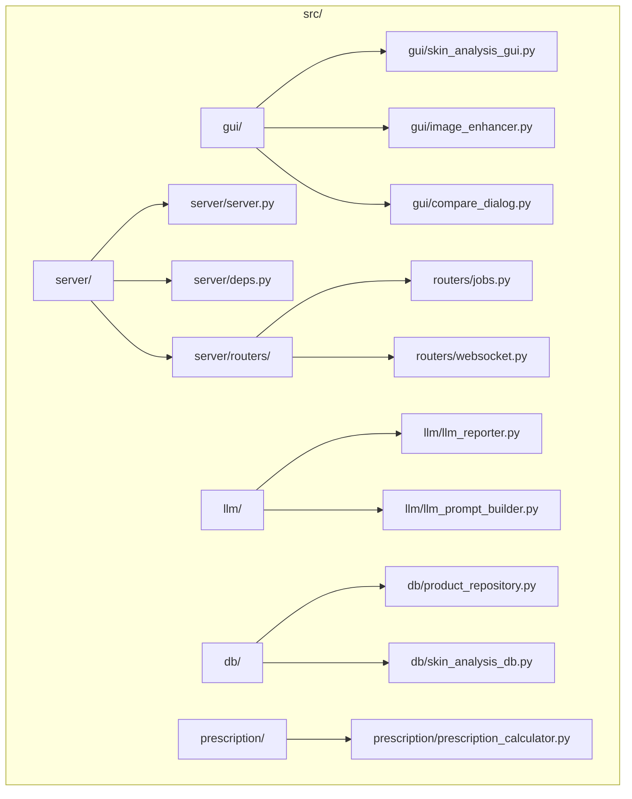
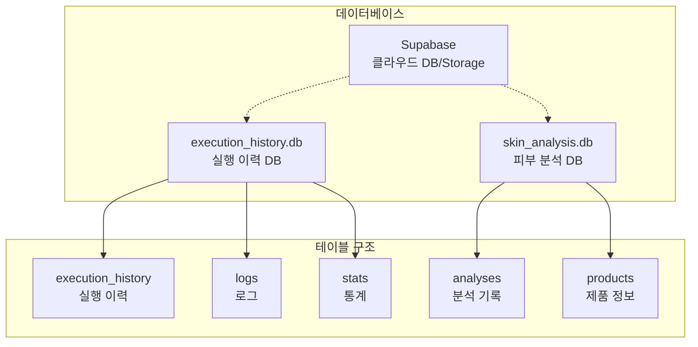

# 시스템 아키텍처 가이드

> **프로젝트:** SkinLens v1.0
> **마지막 수정:** 2026-05-28

## 개요

SkinLens v1.0은 세 가지 실행 모드를 제공합니다:
- **GUI (Graphical User Interface)**: 데스크톱 앱 (PySide6)
- **CLI (Command Line Interface)**: 명령줄 도구
- **Server (FastAPI)**: REST API 서버

본 문서는 세 모드의 작동 방식, 데이터 흐름, 공통/차이점을 통합적으로 설명합니다.

---

## 1. 시스템 구조

### 1.1 아키텍처 개요



### 1.2 공통 파이프라인

세 모드는 동일한 파이프라인을 사용합니다:

1. **이미지 복원** (Restorer)
   - RestoreFormer++ 또는 CodeFormer
   - 전처리/후처리 훅

2. **피부 분석** (Analyzer)
   - 6개 분석기 (pigmentation, redness, pore, wrinkle, tone_elasticity, acne)
   - 18개 측정항목 점수 산출
   - 직교 신호 분해

3. **처방전 계산** (PrescriptionCalculator)
   - 피부 평가 점수 기반 처방
   - AGE_GROUP_MAPPING 적용
   - 믹스 코드 생성 (M01-M14)

4. **제품 매칭** (ProductRepository)
   - 처방전 + 설문 응답 기반 제품 매칭
   - config.json 가중치 적용

5. **LLM 소견 생성** (LlmSkinReporter)
   - Gemini API 호출
   - 처방전 및 제품 정보 포함

---

## 2. GUI 모드

### 2.1 특징

- **UI 프레임워크**: PySide6 (Qt)
- **실행 방식**: 데스크톱 앱
- **사용자**: 일반 사용자 (비기술자)
- **입력**: 이미지 파일, 설문 JSON (선택사항)
- **출력**: 비교창, JSON 파일, 복원 이미지

### 2.2 작동 방식



### 2.3 데이터 흐름

1. 사용자가 이미지 파일 선택
2. 설문 JSON 파일 선택 (선택사항)
3. `--cli` 모드로 `image_enhancer.py` 실행
4. 파이프라인 실행 (복원 → 분석 → 처방 → 제품 매칭 → LLM)
5. 결과를 GUI에 표시

### 2.4 설문 처리

- **설문 JSON**: 파일 선택 UI로 입력
- **설문 없는 경우**: 분석 결과에서 피부타입 추정 (`skin_type_score` 기반)
- **제품 매칭**: 처방전 + 설문 응답 기반

---

## 3. CLI 모드

### 3.1 특징

- **실행 방식**: 명령줄 도구
- **사용자**: 개발자, 자동화 시스템
- **입력**: 이미지 파일, 설문 JSON (선택사항)
- **출력**: JSON 파일, 복원 이미지, 로그

### 3.2 작동 방식



### 3.3 데이터 흐름

1. 명령줄 인자로 입력 받기
2. 설문 JSON 파일에서 설문 응답 추출
3. 파이프라인 실행
4. 결과를 JSON 파일로 저장
5. DB에 분석 기록 저장

### 3.4 설문 처리

- **설문 JSON**: `--input-json` 인자로 입력
- **설문 없는 경우**: 분석 결과에서 피부타입 추정 (`skin_type_score` 기반)
- **제품 매칭**: 처방전 + 설문 응답 기반

### 3.5 비동기 모드

```bash
python image_enhancer.py --cli --async
```

- ThreadPoolExecutor로 병렬 처리
- 환경 변수 `GUI_ASYNC_MODE=1`로 GUI 비동기 모드 활성화

---

## 4. Server 모드

### 4.1 특징

- **웹 프레임워크**: FastAPI
- **실행 방식**: REST API 서버
- **사용자**: 웹/모바일 앱, 외부 시스템
- **입력**: 이미지 업로드, JSON 요청
- **출력**: JSON 응답, WebSocket 진행율

### 4.2 작동 방식

```mermaid
graph TB
    Server[Server<br/>server.py] --> HTTP[HTTP 요청 수신]
    HTTP --> Create[POST /v3/analysis/jobs<br/>작업 생성]
    HTTP --> Status[GET /v3/analysis/jobs/{id}<br/>상태 조회]
    HTTP --> WS[WS /v3/ws/jobs/{id}<br/>진행율 수신]
    
    Create --> Job[Job 큐 관리]
    Job --> Executor[ThreadPoolExecutor<br/>max_workers]
    Job --> Semaphore[Semaphore<br/>max_concurrent]
    
    Executor --> Async[파이프라인 실행<br/>비동기]
    Async --> Pipeline[image_enhancer.py<br/>파이프라인 재사용]
    
    Async --> Result[결과 반환]
    Result --> JSON[JSON 응답]
    Result --> Push[WebSocket 푸시]
    Result --> Download[파일 다운로드]
```

### 4.3 데이터 흐름

1. 클라이언트가 이미지 업로드
2. 서버가 Job 생성 (job_id 발급)
3. 백그라운드 워커로 파이프라인 실행
4. WebSocket으로 진행율 실시간 푸시
5. 완료 시 결과 JSON 반환

### 4.4 동시성 제어

- **max_workers**: ThreadPoolExecutor 워커 수 (기본: 4)
- **max_concurrent**: 최대 동시 Job 수 (기본: 4)
- **환경 변수**: `SKIN_API_MAX_WORKERS`, `SKIN_API_MAX_CONCURRENT`

### 4.5 WebSocket 진행율



---

## 5. 공통/차이점

### 5.1 공통점

| 항목 | 설명 |
|------|------|
| 파이프라인 | 동일한 CLI 기반 파이프라인 사용 |
| 복원 엔진 | RestoreFormer++ / CodeFormer |
| 분석기 | 6개 분석기, 18개 측정항목 |
| 처방전 계산 | PrescriptionCalculator |
| 제품 매칭 | ProductRepository (처방전 + 설문) |
| LLM 소견 | Gemini API |
| config.json | 설정 파일 공유 |

### 5.2 차이점

| 항목 | GUI | CLI | Server |
|------|-----|-----|--------|
| UI | PySide6 데스크톱 앱 | 명령줄 | REST API |
| 입력 방식 | 파일 선택 대화상자 | 명령줄 인자 | HTTP multipart/form-data |
| 설문 입력 | 파일 선택 UI | `--input-json` 인자 | JSON 필드 |
| 피부타입 추정 | 분석 결과 기반 | 분석 결과 기반 | 분석 결과 기반 |
| 진행율 표시 | 로그창 | 로그 출력 | WebSocket |
| 결과 표시 | 비교창 | JSON 파일 | JSON 응답 |
| 동시성 | 단일 작업 | 단일 작업 | 다중 작업 (ThreadPoolExecutor) |
| DB 저장 | 자동 | 자동 | 자동 |

### 5.3 제품 매칭 로직

세 모드 모두 동일한 제품 매칭 로직 사용:

**config.json 설정**:
```json
{
  "product_recommendation": {
    "matching_weights": {
      "with_concerns": {
        "prescription": 0.5,
        "concerns": 0.3,
        "skin_type": 0.2
      },
      "without_concerns": {
        "prescription": 0.7,
        "skin_type": 0.3
      }
    }
  }
}
```

**고민사항이 있는 경우**:
- 처방 항목: 50%
- 고민사항: 30%
- 피부 타입: 20%
- 최대 점수: 1.0

**고민사항이 없는 경우**:
- 처방 항목: 70%
- 피부 타입: 30%
- 최대 점수: 1.0

---

## 6. 사용 시나리오

### 6.1 GUI 사용 시나리오

**사용자**: 일반 사용자 (비기술자)

1. GUI 앱 실행
2. 이미지 파일 선택
3. 설문 JSON 파일 선택 (선택사항)
4. 복원 옵션 설정
5. "실행" 버튼 클릭
6. 진행 상황 로그 확인
7. 완료 후 비교창에서 결과 확인
8. LLM 소견 및 제품 추천 확인

### 6.2 CLI 사용 시나리오

**사용자**: 개발자, 자동화 시스템

1. 명령줄에서 인자 설정
2. `python image_enhancer.py --cli -i image.jpg --input-json survey.json`
3. 파이프라인 실행
4. 로그 출력 확인
5. 완료 후 JSON 파일 확인
6. DB에 분석 기록 저장

### 6.3 Server 사용 시나리오

**사용자**: 웹/모바일 앱, 외부 시스템

1. 이미지 업로드
2. Job 생성 (job_id 수신)
3. WebSocket 연결
4. 진행율 실시간 수신
5. 완료 후 결과 JSON 수신
6. 매칭된 제품 확인

---

## 7. 파일 구조



---

## 8. 환경 설정

### 8.1 config.json

```json
{
  "server": {
    "port": 8000,
    "max_concurrent_jobs": 4
  },
  "llm": {
    "default_model": "models/gemini-2.5-pro",
    "scoring_mode": "reference_guided"
  },
  "product_recommendation": {
    "matching_weights": {
      "with_concerns": {
        "prescription": 0.5,
        "concerns": 0.3,
        "skin_type": 0.2
      },
      "without_concerns": {
        "prescription": 0.7,
        "skin_type": 0.3
      }
    }
  }
}
```

### 8.2 데이터베이스 설정



#### 8.2.1 execution_history.db

**위치**: 프로젝트 루트 (기본: `execution_history.db`)

**테이블**:
- `execution_history`: 실행 이력
- `logs`: 로그
- `stats`: 통계

**설정**:
```json
{
  "database": {
    "sqlite": {
      "path": "execution_history.db"
    }
  }
}
```

**환경 변수**: `EXECUTION_HISTORY_DB`

#### 8.2.2 skin_analysis.db

**위치**: `results/` 디렉토리 (기본: `results/skin_analysis.db`)

**테이블**:
- `analyses`: 분석 기록
  - `id`: 기록 ID
  - `original_path`: 원본 이미지 경로
  - `restored_path`: 복원 이미지 경로
  - `json_result`: 분석 결과 JSON
  - `created_at`: 생성 시각
- `products`: 제품 정보
  - `product_id`: 제품 ID
  - `product_name`: 제품명
  - `category`: 카테고리
  - `key_ingredients`: 주요 성분
  - `target_concerns`: 타겟 고민사항
  - `target_skin_types`: 타겟 피부 타입
  - `target_prescription_items`: 타겟 처방 항목

#### 8.2.3 Supabase (클라우드 DB/Storage)

**설정**:
```json
{
  "database": {
    "supabase": {
      "enabled": true,
      "url": null,
      "key": null,
      "bucket": "skin-images"
    }
  }
}
```

**환경 변수**:
- `SUPABASE_URL`: Supabase 프로젝트 URL
- `SUPABASE_KEY`: Supabase API 키

**동작 방식**:
- `enabled=true`이면 로컬 SQLite 저장 후 Supabase에도 자동 동기화
- 이미지 파일은 Supabase Storage에 업로드
- 분석 결과는 Supabase DB에 저장

### 8.3 환경 변수

| 변수 | 설명 | 기본값 |
|------|------|--------|
| `SKIN_API_MAX_WORKERS` | ThreadPoolExecutor 워커 수 | 4 |
| `SKIN_API_MAX_CONCURRENT` | 최대 동시 Job 수 | 4 |
| `GEMINI_API_KEY` | Gemini API 키 | - |
| `JWT_SECRET_KEY` | JWT 시크릿 키 | - |

---

## 9. 참고 문서

- `docs/API_GUIDE.md` - API 상세 가이드
- `docs/SERVER_TEST_GUIDE.md` - 서버 테스트 가이드
- `docs/PRESCRIPTION_GUIDE.md` - 처방전 가이드
- `docs/SKIN_SCORING_GUIDE.md` - 피부 점수 가이드
- `config/config.json` - 설정 파일
