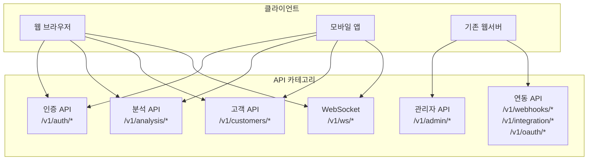

# API 레퍼런스 (API Reference)

> **프로젝트:** SkinLens v1.0  
> **버전:** v1.1  
> **작성일:** 2026-05-30  
> **수정일:** 2026-05-31  
> **상태:** 초안

---

## 개요

SkinLens REST API 엔드포인트 상세 설명입니다.

**참고 문서:**
- 전체 시스템 아키텍처: `docs/guides/ARCHITECTURE_GUIDE.md`
- 외부 시스템 연동 가이드: `docs/EXTERNAL_SYSTEM_INTEGRATION_GUIDE.md`
- 백엔드 개발자용 상세 가이드: `API_GUIDE.md`
- 데이터 모델: `docs/db/DATA_MODEL.md`
- 보안 가이드: `docs/ops/SECURITY_GUIDE.md`

---

## 전체 API 아키텍처

### API 구성



### API 카테고리별 특징

| 카테고리 | 경로 | 주요 클라이언트 | 인증 | 설명 |
|---------|------|---------------|------|------|
| 인증 API | `/v1/auth/*` | 모든 클라이언트 | 불필요 | 로그인, 토큰 갱신 |
| 분석 API | `/v1/analysis/*` | 웹, 모바일 | 필수 | 피부 분석 요청/조회 |
| 고객 API | `/v1/customers/*` | 웹, 모바일 | 필수 | 고객 데이터 관리 |
| 관리자 API | `/v1/admin/*` | 웹서버, 관리자 | 필수 (admin) | 시스템 관리 |
| 연동 API | `/v1/webhooks/*`<br/>`/v1/integration/*`<br/>`/v1/oauth/*` | 웹서버 | 필수 (admin) | 외부 시스템 연동 |
| 향상 기능 API | `/v1/enhancements/*` | 웹, 모바일 | 필수 | 이미지 업로드, 푸시, A/B 테스트, 모니터링 |
| WebSocket | `/v1/ws/*` | 웹, 모바일 | 필수 | 실시간 진행률 |

---

## 기본 정보

**Base URL:**
- 개발: `http://localhost:8000`
- 프로덕션: `https://api.skinlens.com`

**인증:**
- JWT Bearer Token
- Header: `Authorization: Bearer <token>`

**Content-Type:**
- `application/json`
- `multipart/form-data` (이미지 업로드)

**Swagger UI:**
- 개발: `http://localhost:8000/docs`
- OpenAPI: `http://localhost:8000/openapi.json`

---

## 1. 인증 (Authentication)

### 1.1 로그인

**POST** `/v1/auth/login`

로그인 및 JWT 토큰 발급

**Request Body:**
```json
{
  "customer_id": "string",
  "password": "string"
}
```

**Response (200 OK):**
```json
{
  "access_token": "string",
  "token_type": "bearer",
  "customer_id": "string",
  "role": "admin|analyst|customer",
  "expires_in": 3600
}
```

---

### 1.2 내 정보 조회

**GET** `/v1/auth/me`

현재 인증된 사용자 정보 조회

**Response (200 OK):**
```json
{
  "customer_id": "string",
  "role": "admin|analyst|customer"
}
```

---

## 2. 분석 Job (Analysis Jobs)

### 2.1 Job 생성

**POST** `/v1/analysis/jobs`

분석 Job을 생성합니다.

**Request Headers:**
```
Authorization: Bearer <jwt_token>
Content-Type: multipart/form-data
```

**Request Body (Form Data):**
| 필드 | 타입 | 필수 | 설명 |
|------|------|------|------|
| images[] | File | 아니오* | 다중 이미지 (1~3장) |
| angles[] | string | 아니오* | 이미지 각도 (front/left45/right45) |
| image | File | 아니오* | 단일 이미지 (레거시) |
| image_url | string | 아니오* | 이미지 URL (레거시) |
| do_restore | boolean | 아니오 | 복원 수행 여부 (기본: true) |
| include_base64 | boolean | 아니오 | base64 포함 여부 (기본: false) |
| score_safety_net | boolean | 아니오 | 점수 안전장치 (기본: true) |
| llm_report | boolean | 아니오 | LLM 소견 생성 (기본: true) |
| use_multi_view_analysis | boolean | 아니오 | 다중 뷰 분석 (기본: true) |
| customer_id | string | 아니오 | 고객 ID |
| gender | string | 아니오 | 성별 |
| age | integer | 아니오 | 연령 |
| race | string | 아니오 | 인종 |
| region | string | 아니오 | 지역 |
| survey | string | 아니오 | 설문 JSON |
| client_meta | string | 아니오 | 클라이언트 메타 JSON |

*images[], image, image_url 중 하나는 필수

**Response (201 Created):**
```json
{
  "job_id": "550e8400-e29b-41d4-a716-446655440000",
  "status": "queued",
  "created_at": "2026-05-30T10:00:00Z"
}
```

---

### 2.2 Job 상태 조회

**GET** `/v1/analysis/jobs/{job_id}`

Job 상태를 조회합니다.

**Response (200 OK):**
```json
{
  "job_id": "550e8400-e29b-41d4-a716-446655440000",
  "status": "completed",
  "progress": 100,
  "message": "완료",
  "created_at": "2026-05-30T10:00:00Z",
  "started_at": "2026-05-30T10:00:05Z",
  "finished_at": "2026-05-30T10:01:30Z",
  "result": {
    "input_image_url": "/analysis/jobs/{job_id}/artifacts/input.jpg",
    "restored_image_url": "/analysis/jobs/{job_id}/artifacts/restored.png",
    "customer_info": {
      "customer_id": "CUST001",
      "gender": "female",
      "age": 30,
      "race": "asian",
      "region": "KR"
    },
    "analysis_result": {
      "overall_score": 75,
      "measurements": {
        "pigmentation": 65,
        "redness": 70,
        "pores": 80
      }
    }
  }
}
```

---

### 2.3 Job 취소

**DELETE** `/v1/analysis/jobs/{job_id}`

Job을 취소합니다.

**Response (200 OK):**
```json
{
  "job_id": "550e8400-e29b-41d4-a716-446655440000",
  "status": "cancelled"
}
```

---

### 2.4 피부 타입 확인

**POST** `/v1/analysis/jobs/{job_id}/confirm-skin-type`

피부 타입 사용자 확인

**Request Body:**
```json
{
  "skin_types": ["dry", "oily", "combination", "sensitive"]
}
```

**Response (200 OK):**
```json
{
  "job_id": "uuid",
  "skin_types": ["dry", "oily"],
  "skin_type_source": "manual"
}
```

---

### 2.5 이미지 다운로드

**GET** `/v1/analysis/jobs/{job_id}/artifacts/{filename}`

분석 결과 이미지를 다운로드합니다.

**파일명:**
- `original.png`: 원본 이미지
- `restored.png`: 복원 이미지
- `comparison.png`: 비교 이미지
- `results.json`: 분석 결과 JSON

**Response (200 OK):**
- Content-Type: `image/jpeg` 또는 `image/png`
- Binary image data

---

## 3. 고객 (Customer)

### 3.1 내 정보 조회

**GET** `/v1/customer/my/info`

내 고객 정보를 조회합니다.

**Response (200 OK):**
```json
{
  "customer_id": "CUST001",
  "email": "customer@example.com",
  "name": "홍길동",
  "gender": "female",
  "age": 30,
  "race": "asian",
  "region": "KR",
  "created_at": "2026-01-01T00:00:00Z"
}
```

---

### 3.2 분석 이력 조회

**GET** `/v1/customer/my/analyses`

내 분석 이력을 조회합니다.

**Query Parameters:**
| 필드 | 타입 | 필수 | 설명 |
|------|------|------|------|
| limit | integer | 아니오 | 최대 개수 (기본: 20) |
| offset | integer | 아니오 | 오프셋 (기본: 0) |

**Response (200 OK):**
```json
{
  "analyses": [
    {
      "job_id": "550e8400-e29b-41d4-a716-446655440000",
      "created_at": "2026-05-30T10:00:00Z",
      "overall_score": 75,
      "input_image_url": "/analysis/jobs/{job_id}/artifacts/input.jpg"
    }
  ],
  "total": 100,
  "limit": 20,
  "offset": 0
}
```

---

### 3.3 분석 상세 조회

**GET** `/v1/customer/my/analyses/{analysis_id}`

특정 분석의 상세 정보를 조회합니다.

**Response (200 OK):**
```json
{
  "id": 1,
  "customer_id": "CUST001",
  "original_image_path": "/path/to/original.jpg",
  "restored_image_path": "/path/to/restored.jpg",
  "json_result": { ... },
  "input_json": { ... },
  "original_filename": "test.jpg",
  "created_at": "2026-05-30T10:00:00Z",
  "overall_score_original": 60,
  "overall_score_restored": 75
}
```

---

### 3.4 분석 이미지 다운로드

**GET** `/v1/customer/my/analyses/{analysis_id}/image/{image_type}`

분석 이미지를 다운로드합니다.

**Path Parameters:**
| 필드 | 타입 | 필수 | 설명 |
|------|------|------|------|
| analysis_id | integer | 예 | 분석 ID |
| image_type | string | 예 | 이미지 타입 (original 또는 restored) |

**Response (200 OK):** 이미지 파일 (JPEG)

---

### 3.5 분석 결과 비교

**POST** `/v1/customer/my/analyses/compare`

두 분석 결과를 비교합니다.

**Request Body:**
```json
{
  "analysis_id_1": 1,
  "analysis_id_2": 2
}
```

**Response (200 OK):**
```json
{
  "analysis_1": {
    "id": 1,
    "date": "2026-05-01T00:00:00Z",
    "scores": {
      "overall_score": 60,
      "melasma_score": 50,
      "redness_score": 70,
      "wrinkle_score": 55,
      "pore_score": 65
    }
  },
  "analysis_2": {
    "id": 2,
    "date": "2026-05-15T00:00:00Z",
    "scores": {
      "overall_score": 70,
      "melasma_score": 55,
      "redness_score": 65,
      "wrinkle_score": 60,
      "pore_score": 70
    }
  },
  "changes": {
    "overall_score": {
      "before": 60,
      "after": 70,
      "change": 10,
      "improved": true
    },
    ...
  },
  "overall_improvement": 10
}
```

---

### 3.6 제품 추천 조회

**GET** `/v1/customer/my/recommendations`

맞춤형 제품 추천을 조회합니다.

**Query Parameters:**
| 필드 | 타입 | 필수 | 설명 |
|------|------|------|------|
| analysis_id | integer | 아니오 | 특정 분석 ID (지정 시 해당 분석 기반 추천) |
| limit | integer | 아니오 | 최대 개수 (기본: 10) |

**Response (200 OK):**
```json
{
  "recommendations": [
    {
      "recommendation_id": 1,
      "analysis_id": 1,
      "product_id": "P001",
      "product_name": "CÔTELEAF 트러블 케어 세럼",
      "category": "트러블 케어",
      "match_score": 0.85,
      "recommendation_reason": "트러블 및 모공 개선에 효과적",
      "key_ingredients": ["나이아신아마이드", "살리실산"],
      "efficacy": "트러블 억제, 모공 관리"
    }
  ],
  "total": 1
}
```

---

### 3.7 북마크 추가

**POST** `/v1/customer/my/analyses/{analysis_id}/bookmark`

분석 결과를 북마크합니다.

**Request Body:**
```json
{
  "notes": "좋은 결과"
}
```

**Response (200 OK):**
```json
{
  "message": "Bookmark added successfully"
}
```

---

### 3.8 북마크 삭제

**DELETE** `/v1/customer/my/analyses/{analysis_id}/bookmark`

북마크를 삭제합니다.

**Response (200 OK):**
```json
{
  "message": "Bookmark removed successfully"
}
```

---

### 3.9 북마크 목록 조회

**GET** `/v1/customer/my/bookmarks`

북마크된 분석 목록을 조회합니다.

**Query Parameters:**
| 필드 | 타입 | 필수 | 설명 |
|------|------|------|------|
| limit | integer | 아니오 | 최대 개수 (기본: 50) |
| offset | integer | 아니오 | 오프셋 (기본: 0) |

**Response (200 OK):**
```json
{
  "bookmarks": [
    {
      "bookmark_id": 1,
      "analysis_id": 1,
      "notes": "좋은 결과",
      "bookmarked_at": "2026-05-30T10:00:00Z",
      "original_filename": "test.jpg",
      "analysis_date": "2026-05-30T09:00:00Z",
      "overall_score_original": 60,
      "overall_score_restored": 75
    }
  ],
  "total": 1,
  "limit": 50,
  "offset": 0
}
```

---

### 3.10 알림 설정 조회

**GET** `/v1/customer/my/notifications/settings`

알림 설정을 조회합니다.

**Response (200 OK):**
```json
{
  "customer_id": "CUST001",
  "analysis_complete": true,
  "score_improvement": true,
  "care_reminder": false,
  "marketing": false,
  "reminder_hours": 168,
  "created_at": "2026-05-01T00:00:00Z",
  "updated_at": "2026-05-30T10:00:00Z"
}
```

---

### 3.11 알림 설정 업데이트

**PUT** `/v1/customer/my/notifications/settings`

알림 설정을 업데이트합니다.

**Request Body:**
```json
{
  "analysis_complete": true,
  "score_improvement": true,
  "care_reminder": true,
  "marketing": false,
  "reminder_hours": 72
}
```

**Response (200 OK):**
```json
{
  "message": "Notification settings updated successfully"
}
```

---

## 4. 통계 (Stats)

### 4.1 분석 통계 조회

**GET** `/v1/stats/analysis`

분석 통계를 조회합니다.

**Query Parameters:**
| 필드 | 타입 | 필수 | 설명 |
|------|------|------|------|
| days | integer | 아니오 | 기간 (일, 기본: 7) |
| customer_id | string | 아니오 | 고객 ID (관리자만) |

**Response (200 OK):**
```json
{
  "stats": [
    {
      "date": "2026-05-30",
      "total_analyses": 100,
      "successful": 95,
      "failed": 5,
      "avg_score": 75.5
    }
  ],
  "count": 7
}
```

---

## 5. 헬스체크 (Health)

### 5.1 서버 상태 확인

**GET** `/health`

서버 상태를 확인합니다.

**Response (200 OK):**
```json
{
  "status": "healthy",
  "version": "v3.6",
  "timestamp": "2026-05-30T10:00:00Z"
}
```

---

## 6. 관리자 (Admin)

### 6.1 감사 로그 조회

**GET** `/v1/admin/audit-logs`

감사 로그를 조회합니다 (관리자/분석가 전용).

**Query Parameters:**
| 필드 | 타입 | 필수 | 설명 |
|------|------|------|------|
| actor_customer_id | string | 아니오 | 행동자 고객 ID |
| target_customer_id | string | 아니오 | 대상 고객 ID |
| days | integer | 아니오 | 기간 (일, 기본: 30) |
| limit | integer | 아니오 | 최대 개수 (기본: 100) |

**Response (200 OK):**
```json
{
  "logs": [
    {
      "id": "uuid",
      "actor_customer_id": "ADMIN001",
      "target_customer_id": "CUST001",
      "endpoint": "/v1/analysis/jobs",
      "method": "POST",
      "user_role": "admin",
      "success": true,
      "created_at": "2026-05-30T10:00:00Z"
    }
  ],
  "count": 100
}
```

---

### 6.2 고객 관리

#### 6.2.1 고객 목록 조회

**GET** `/v1/admin/customers`

고객 목록을 조회합니다 (관리자/분석가 전용).

**Query Parameters:**
| 필드 | 타입 | 필수 | 설명 |
|------|------|------|------|
| status | string | 아니오 | 상태 필터 (active, inactive, suspended) |
| limit | integer | 아니오 | 최대 개수 (기본: 100) |
| offset | integer | 아니오 | 오프셋 (기본: 0) |

**Response (200 OK):**
```json
{
  "customers": [
    {
      "customer_id": "CUST001",
      "email": "customer@example.com",
      "name": "홍길동",
      "status": "active",
      "created_at": "2026-01-01T00:00:00Z",
      "updated_at": "2026-05-30T10:00:00Z",
      "last_login_at": "2026-05-30T09:00:00Z",
      "total_analyses": 15
    }
  ],
  "total": 100
}
```

#### 6.2.2 고객 상세 조회

**GET** `/v1/admin/customers/{customer_id}`

특정 고객의 상세 정보를 조회합니다 (관리자/분석가 전용).

**Response (200 OK):**
```json
{
  "customer_id": "CUST001",
  "email": "customer@example.com",
  "name": "홍길동",
  "status": "active",
  "created_at": "2026-01-01T00:00:00Z",
  "updated_at": "2026-05-30T10:00:00Z",
  "last_login_at": "2026-05-30T09:00:00Z",
  "total_analyses": 15
}
```

#### 6.2.3 고객 상태 변경

**PUT** `/v1/admin/customers/{customer_id}/status`

고객 상태를 변경합니다 (관리자 전용).

**Request Body:**
```json
{
  "status": "inactive"
}
```

**Response (200 OK):**
```json
{
  "message": "Customer status updated successfully"
}
```

#### 6.2.4 고객 삭제

**DELETE** `/v1/admin/customers/{customer_id}`

고객을 삭제합니다 (관리자 전용, GDPR).

**Response (200 OK):**
```json
{
  "message": "Customer deleted successfully"
}
```

---

### 6.3 제품 관리

#### 6.3.1 제품 목록 조회

**GET** `/v1/admin/products`

제품 목록을 조회합니다 (관리자/분석가 전용).

**Query Parameters:**
| 필드 | 타입 | 필수 | 설명 |
|------|------|------|------|
| category | string | 아니오 | 카테고리 필터 |
| limit | integer | 아니오 | 최대 개수 (기본: 100) |
| offset | integer | 아니오 | 오프셋 (기본: 0) |

**Response (200 OK):**
```json
{
  "products": [
    {
      "product_id": "P001",
      "product_name": "CÔTELEAF 트러블 케어 세럼",
      "category": "트러블 케어",
      "key_ingredients": ["나이아신아마이드", "살리실산"],
      "efficacy": "트러블 억제, 모공 관리",
      "target_skin_types": ["지성", "트러블성"],
      "target_concerns": ["여드름", "모공"],
      "created_at": "2026-01-01T00:00:00Z",
      "updated_at": "2026-05-30T10:00:00Z"
    }
  ],
  "total": 50
}
```

#### 6.3.2 제품 생성

**POST** `/v1/admin/products`

새 제품을 등록합니다 (관리자 전용).

**Request Body:**
```json
{
  "product_id": "P002",
  "product_name": "CÔTELEAF 모이스처라이저",
  "category": "보습",
  "key_ingredients": ["히알루론산", "세라마이드"],
  "efficacy": "깊은 보습, 피부 장벽 강화",
  "target_skin_types": ["건성", "민감성"],
  "target_concerns": ["건조", "각질"]
}
```

**Response (200 OK):**
```json
{
  "message": "Product created successfully"
}
```

#### 6.3.3 제품 업데이트

**PUT** `/v1/admin/products/{product_id}`

제품 정보를 업데이트합니다 (관리자 전용).

**Request Body:**
```json
{
  "product_name": "Updated Product Name",
  "category": "새 카테고리"
}
```

**Response (200 OK):**
```json
{
  "message": "Product updated successfully"
}
```

#### 6.3.4 제품 삭제

**DELETE** `/v1/admin/products/{product_id}`

제품을 삭제합니다 (관리자 전용).

**Response (200 OK):**
```json
{
  "message": "Product deleted successfully"
}
```

---

### 6.4 분석 결과 관리

#### 6.4.1 전체 분석 목록 조회

**GET** `/v1/admin/analyses`

전체 분석 결과를 조회합니다 (관리자/분석가 전용).

**Query Parameters:**
| 필드 | 타입 | 필수 | 설명 |
|------|------|------|------|
| limit | integer | 아니오 | 최대 개수 (기본: 100) |
| offset | integer | 아니오 | 오프셋 (기본: 0) |

**Response (200 OK):**
```json
{
  "analyses": [
    {
      "id": 1,
      "customer_id": "CUST001",
      "original_filename": "test.jpg",
      "created_at": "2026-05-30T10:00:00Z",
      "overall_score_original": 60,
      "overall_score_restored": 75
    }
  ],
  "total": 1000
}
```

#### 6.4.2 분석 결과 삭제

**DELETE** `/v1/admin/analyses/{analysis_id}`

분석 결과를 삭제합니다 (관리자 전용).

**Response (200 OK):**
```json
{
  "message": "Analysis deleted successfully"
}
```

---

### 6.5 사용자 활동 모니터링

#### 6.5.1 활성 세션 조회

**GET** `/v1/admin/active-sessions`

활성 세션 목록을 조회합니다 (관리자/분석가 전용).

**Query Parameters:**
| 필드 | 타입 | 필수 | 설명 |
|------|------|------|------|
| limit | integer | 아니오 | 최대 개수 (기본: 100) |

**Response (200 OK):**
```json
{
  "sessions": [
    {
      "session_id": "session123",
      "customer_id": "CUST001",
      "ip_address": "192.168.1.1",
      "user_agent": "Mozilla/5.0...",
      "started_at": "2026-05-30T09:00:00Z",
      "last_activity_at": "2026-05-30T10:00:00Z"
    }
  ],
  "total": 50
}
```

#### 6.5.2 세션 강제 종료

**DELETE** `/v1/admin/active-sessions/{session_id}`

세션을 강제 종료합니다 (관리자 전용).

**Response (200 OK):**
```json
{
  "message": "Session terminated successfully"
}
```

#### 6.5.3 이상 활동 조회

**GET** `/v1/admin/anomalies`

이상 활동 목록을 조회합니다 (관리자/분석가 전용).

**Query Parameters:**
| 필드 | 타입 | 필수 | 설명 |
|------|------|------|------|
| status | string | 아니오 | 상태 필터 (detected, resolved) |
| severity | string | 아니오 | 심각도 필터 (low, medium, high) |
| limit | integer | 아니오 | 최대 개수 (기본: 100) |

**Response (200 OK):**
```json
{
  "anomalies": [
    {
      "id": "anomaly123",
      "anomaly_type": "multiple_failed_logins",
      "customer_id": "CUST001",
      "ip_address": "192.168.1.1",
      "description": "5회 연속 로그인 실패",
      "severity": "high",
      "detected_at": "2026-05-30T10:00:00Z",
      "resolved_at": null,
      "status": "detected"
    }
  ],
  "total": 10
}
```

#### 6.5.4 이상 활동 해결

**POST** `/v1/admin/anomalies/{anomaly_id}/resolve`

이상 활동을 해결 처리합니다 (관리자 전용).

**Response (200 OK):**
```json
{
  "message": "Anomaly resolved successfully"
}
```

---

### 6.6 보안 관리

#### 6.6.1 역할 목록 조회

**GET** `/v1/admin/roles`

역할별 사용자 목록을 조회합니다 (관리자 전용).

**Query Parameters:**
| 필드 | 타입 | 필수 | 설명 |
|------|------|------|------|
| role | string | 아니오 | 특정 역할 필터 |
| limit | integer | 아니오 | 최대 개수 (기본: 100) |

**Response (200 OK):**
```json
{
  "users": [
    {
      "customer_id": "ADMIN001",
      "role": "admin",
      "granted_at": "2026-01-01T00:00:00Z",
      "granted_by": "system"
    }
  ],
  "total": 10
}
```

#### 6.6.2 사용자 역할 설정

**PUT** `/v1/admin/customers/{customer_id}/role`

사용자 역할을 설정합니다 (관리자 전용).

**Request Body:**
```json
{
  "role": "analyst"
}
```

**Response (200 OK):**
```json
{
  "message": "User role updated successfully"
}
```

#### 6.6.3 차단된 IP 목록 조회

**GET** `/v1/admin/blocked-ips`

차단된 IP 목록을 조회합니다 (관리자 전용).

**Query Parameters:**
| 필드 | 타입 | 필수 | 설명 |
|------|------|------|------|
| limit | integer | 아니오 | 최대 개수 (기본: 100) |

**Response (200 OK):**
```json
{
  "blocked_ips": [
    {
      "ip_address": "192.168.1.100",
      "blocked_at": "2026-05-30T10:00:00Z",
      "blocked_by": "ADMIN001",
      "reason": "악의적인 접근 시도",
      "expires_at": "2026-06-30T10:00:00Z",
      "is_permanent": false
    }
  ],
  "total": 5
}
```

#### 6.6.4 IP 차단

**POST** `/v1/admin/blocked-ips`

IP를 차단합니다 (관리자 전용).

**Request Body:**
```json
{
  "ip_address": "192.168.1.100",
  "reason": "악의적인 접근 시도",
  "expires_in_hours": 720,
  "is_permanent": false
}
```

**Response (200 OK):**
```json
{
  "message": "IP blocked successfully"
}
```

#### 6.6.5 IP 차단 해제

**DELETE** `/v1/admin/blocked-ips/{ip_address}`

IP 차단을 해제합니다 (관리자 전용).

**Response (200 OK):**
```json
{
  "message": "IP unblocked successfully"
}
```

---

### 6.7 비즈니스 인텔리전스

#### 6.7.1 대시보드 개요

**GET** `/v1/admin/dashboard/overview`

관리자 대시보드 개요를 조회합니다 (관리자/분석가 전용).

**Response (200 OK):**
```json
{
  "overview": {
    "total_analyses": 1000,
    "total_customers": 150,
    "last_analysis": "2026-05-30T10:00:00Z"
  },
  "recent_stats": [
    {
      "date": "2026-05-30",
      "total_analyses": 50,
      "unique_customers": 30,
      "successful_analyses": 48,
      "failed_analyses": 2,
      "avg_score": 72.5,
      "total_revenue": 15000.0
    }
  ]
}
```

#### 6.7.2 사용량 리포트

**GET** `/v1/admin/reports/usage`

사용량 리포트를 조회합니다 (관리자/분석가 전용).

**Query Parameters:**
| 필드 | 타입 | 필수 | 설명 |
|------|------|------|------|
| start_date | string | 아니오 | 시작 날짜 (YYYY-MM-DD) |
| end_date | string | 아니오 | 종료 날짜 (YYYY-MM-DD) |
| limit | integer | 아니오 | 최대 개수 (기본: 30) |

**Response (200 OK):**
```json
{
  "stats": [
    {
      "date": "2026-05-30",
      "total_analyses": 50,
      "unique_customers": 30,
      "successful_analyses": 48,
      "failed_analyses": 2,
      "avg_score": 72.5,
      "total_revenue": 15000.0
    }
  ],
  "total": 30
}
```

#### 6.7.3 수익 리포트

**GET** `/v1/admin/reports/revenue`

수익 리포트를 조회합니다 (관리자/분석가 전용).

**Query Parameters:**
| 필드 | 타입 | 필수 | 설명 |
|------|------|------|------|
| start_date | string | 아니오 | 시작 날짜 (YYYY-MM-DD) |
| end_date | string | 아니오 | 종료 날짜 (YYYY-MM-DD) |
| limit | integer | 아니오 | 최대 개수 (기본: 30) |

**Response (200 OK):**
```json
{
  "revenue": [
    {
      "date": "2026-05-30",
      "total_revenue": 15000.0
    }
  ],
  "total": 30
}
```

---

### 6.8 DB 헬스체크

**GET** `/v1/health/db`

데이터베이스 상태를 확인합니다 (관리자/분석가 전용).

**Response (200 OK):**
```json
{
  "status": "healthy",
  "connection": "ok",
  "latency_ms": 5.2,
  "table_count": 10
}
```

---

### 6.3 로그 레벨 조회

**GET** `/v1/admin/logging/level`

현재 로그 레벨을 조회합니다 (관리자/분석가 전용).

**Response (200 OK):**
```json
{
  "level": "DEBUG",
  "persisted": false
}
```

---

### 6.4 로그 레벨 변경

**PUT** `/v1/admin/logging/level`

로그 레벨을 변경합니다 (관리자/분석가 전용).

**Query Parameters:**
| 필드 | 타입 | 필수 | 설명 |
|------|------|------|------|
| level | string | 예 | 로그 레벨 (DEBUG, INFO, WARNING, ERROR) |
| persist | boolean | 아니오 | config.json 저장 여부 (기본: false) |

**Response (200 OK):**
```json
{
  "level": "INFO",
  "previous_level": "DEBUG",
  "persisted": true
}
```

---

### 6.5 시스템 메트릭 조회

**GET** `/v1/admin/metrics/system`

시스템 메트릭을 조회합니다 (관리자/분석가 전용).

**Response (200 OK):**
```json
{
  "cpu": {
    "percent": 45.2,
    "count": 8
  },
  "memory": {
    "total_gb": 16.0,
    "available_gb": 8.5,
    "used_gb": 7.5,
    "percent": 46.9
  },
  "disk": {
    "total_gb": 500.0,
    "used_gb": 200.0,
    "free_gb": 300.0,
    "percent": 40.0
  },
  "network": {
    "bytes_sent": 1024000,
    "bytes_recv": 2048000,
    "packets_sent": 1000,
    "packets_recv": 2000
  },
  "process": {
    "pid": 12345,
    "memory_percent": 2.5,
    "cpu_percent": 1.2,
    "num_threads": 8
  },
  "timestamp": "2026-05-30T10:00:00Z"
}
```

---

### 6.6 API 키 생성

**POST** `/v1/admin/api-keys`

API 키를 생성합니다 (관리자/분석가 전용).

**Query Parameters:**
| 필드 | 타입 | 필수 | 설명 |
|------|------|------|------|
| name | string | 예 | API 키 이름 |
| owner_id | string | 예 | 소유자 ID |
| description | string | 아니오 | 설명 |
| scopes | string | 아니오 | 권한 범위 (JSON 문자열) |
| expires_in_days | integer | 아니오 | 만료일수 |

**Response (200 OK):**
```json
{
  "id": "uuid",
  "api_key": "64-char-hex-string",
  "name": "Test Key",
  "description": "Test API key",
  "owner_id": "CUST001",
  "scopes": ["read", "write"],
  "expires_at": "2026-06-30T10:00:00Z",
  "created_at": "2026-05-30T10:00:00Z"
}
```

---

### 6.7 API 키 목록 조회

**GET** `/v1/admin/api-keys`

API 키 목록을 조회합니다 (관리자/분석가 전용).

**Query Parameters:**
| 필드 | 타입 | 필수 | 설명 |
|------|------|------|------|
| owner_id | string | 아니오 | 소유자 ID 필터 |
| is_active | boolean | 아니오 | 활성 상태 필터 |
| limit | integer | 아니오 | 최대 개수 (기본: 100) |

**Response (200 OK):**
```json
{
  "api_keys": [
    {
      "id": "uuid",
      "name": "Test Key",
      "owner_id": "CUST001",
      "scopes": ["read", "write"],
      "is_active": true,
      "expires_at": "2026-06-30T10:00:00Z",
      "last_used_at": "2026-05-30T10:00:00Z",
      "created_at": "2026-05-30T10:00:00Z"
    }
  ],
  "count": 10
}
```

---

### 6.8 API 키 폐지

**DELETE** `/v1/admin/api-keys/{key_id}`

API 키를 폐지합니다 (관리자/분석가 전용).

**Query Parameters:**
| 필드 | 타입 | 필수 | 설명 |
|------|------|------|------|
| reason | string | 아니오 | 폐지 사유 |

**Response (200 OK):**
```json
{
  "message": "API key revoked successfully",
  "key_id": "uuid"
}
```

---

### 6.9 캐시 통계 조회

**GET** `/v1/admin/cache/stats`

캐시 통계를 조회합니다 (관리자/분석가 전용).

**Response (200 OK):**
```json
{
  "metrics_cache": {
    "valid": true,
    "age_seconds": 15.5,
    "ttl": 30,
    "cached": true
  },
  "timestamp": "2026-05-30T10:00:00Z"
}
```

---

### 6.10 캐시 초기화

**POST** `/v1/admin/cache/clear`

캐시를 초기화합니다 (관리자/분석가 전용).

**Query Parameters:**
| 필드 | 타입 | 필수 | 설명 |
|------|------|------|------|
| cache_type | string | 아니오 | 초기화할 캐시 (all, metrics, config) |

**Response (200 OK):**
```json
{
  "message": "Cache cleared successfully",
  "cleared_caches": ["metrics", "config"],
  "timestamp": "2026-05-30T10:00:00Z"
}
```

---

### 6.11 WebSocket 연결 통계

**GET** `/v1/admin/websocket/stats`

WebSocket 연결 통계를 조회합니다 (관리자/분석가 전용).

**Response (200 OK):**
```json
{
  "active_connections": 5,
  "max_connections": 100,
  "connection_timeout": 300,
  "connections": [
    {
      "job_id": "uuid",
      "connected_at": 1234567890.0,
      "last_heartbeat": 1234567900.0,
      "client_ip": "192.168.1.1"
    }
  ]
}
```

---

### 6.12 작업 큐 통계

**GET** `/v1/admin/job-queue/stats`

작업 큐 통계를 조회합니다 (관리자/분석가 전용).

**Response (200 OK):**
```json
{
  "queue_size": 10,
  "running_jobs": 4,
  "max_workers": 4,
  "job_history_size": 100,
  "running": true
}
```

---

### 6.13 작업 상태 조회

**GET** `/v1/admin/job-queue/{job_id}`

작업 상태를 조회합니다 (관리자/분석가 전용).

**Response (200 OK):**
```json
{
  "job_id": "uuid",
  "status": "running",
  "priority": 2,
  "retry_count": 0,
  "max_retries": 3,
  "error": null,
  "created_at": "2026-05-30T10:00:00Z"
}
```

---

## 7. WebSocket

### 7.1 진행률 트래킹

**WS** `/v1/ws/analyze/{job_id}`

분석 진행률을 실시간으로 수신합니다.

**메시지 형식:**
```json
{
  "type": "progress",
  "stage": "restore",
  "percent": 30,
  "message": "복원 중..."
}
```

**완료 메시지:**
```json
{
  "type": "complete",
  "result": {
    "overall_score": 75,
    "measurements": {...}
  }
}
```

**에러 메시지:**
```json
{
  "type": "error",
  "error": "에러 메시지"
}
```

---

## 에러 코드

| 코드 | 설명 |
|------|------|
| 200 | OK - 성공 |
| 201 | Created - 리소스 생성 |
| 400 | Bad Request - 잘못된 요청 |
| 401 | Unauthorized - 인증 실패 |
| 403 | Forbidden - 권한 없음 |
| 404 | Not Found - 리소스 없음 |
| 429 | Too Many Requests - 요청 초과 |
| 500 | Internal Server Error - 서버 에러 |

**에러 응답 형식:**
```json
{
  "detail": "에러 메시지"
}
```

---

## 속도 제한 (Rate Limiting)

**역할별 속도 제한:**
| 역할 | 제한 |
|------|------|
| customer | 30/분 |
| admin | 100/분 |
| analyst | 60/분 |
| default (인증 없음) | 30/분 |

**엔드포인트별 제한:**
| 엔드포인트 | 제한 |
|-----------|------|
| POST /v1/auth/login | 5/분 |
| POST /v1/analysis/jobs | 30/분 |
| GET /v1/analysis/jobs/{job_id} | 60/분 |
| GET /v1/customer/my/* | 60/분 |
| GET /v1/stats/* | 30/분 |
| 기타 엔드포인트 | 역할별 제한 적용 |

**속도 제한 초과 시:**
- HTTP 429 Too Many Requests
- Retry-After 헤더 포함

---

## 요청 로깅 (Request Logging)

모든 API 요청은 자동으로 로깅됩니다.

**로그 정보:**
- 요청 ID (UUID)
- HTTP 메서드
- 경로
- 쿼리 파라미터
- 클라이언트 IP
- User-Agent
- 응답 상태 코드
- 처리 시간

**요청 ID:**
- 응답 헤더 `X-Request-ID`로 제공
- 요청 추적 및 디버깅에 사용

**느린 요청 경고:**
- 기준: 5초 이상 (config.json에서 설정 가능)
- 로그 레벨: WARNING

---

## 청크 업로드 (Chunk Upload)

대용량 파일을 청크 단위로 업로드하여 네트워크 중단 시 재개 가능.

### 엔드포인트

#### POST /v1/upload/init
업로드 세션 초기화.

**요청 파라미터:**
- `file_name` (string): 파일 이름
- `file_size` (integer): 파일 크기 (bytes)
- `chunk_size` (integer, optional): 청크 크기 (bytes, 기본 5MB)
- `file_hash` (string, optional): 파일 SHA-256 해시

**응답:**
```json
{
  "session_id": "uuid",
  "chunk_size": 5242880,
  "total_chunks": 10,
  "file_name": "image.jpg",
  "file_size": 52428800
}
```

#### POST /v1/upload/chunk
청크 업로드.

**요청 파라미터:**
- `session_id` (string): 업로드 세션 ID
- `chunk_number` (integer): 청크 번호 (0-based)
- `chunk` (file): 청크 데이터

**응답:**
```json
{
  "status": "uploaded",
  "chunk_number": 0,
  "uploaded_chunks": 1,
  "total_chunks": 10
}
```

#### POST /v1/upload/complete
업로드 완료 및 파일 합치기.

**요청 파라미터:**
- `session_id` (string): 업로드 세션 ID

**응답:**
```json
{
  "status": "completed",
  "file_name": "image.jpg",
  "file_size": 52428800,
  "file_path": "/path/to/image.jpg"
}
```

#### POST /v1/upload/cancel
업로드 취소.

**요청 파라미터:**
- `session_id` (string): 업로드 세션 ID

**응답:**
```json
{
  "status": "cancelled",
  "session_id": "uuid"
}
```

#### GET /v1/upload/progress/{session_id}
업로드 진행률 조회.

**응답:**
```json
{
  "session_id": "uuid",
  "file_name": "image.jpg",
  "file_size": 52428800,
  "uploaded_chunks": 5,
  "total_chunks": 10,
  "progress_percent": 50.0,
  "created_at": "2026-05-30T10:00:00Z"
}
```

---

## API 버전 관리 (API Versioning)

버전별 라우팅 및 폐기 정책 지원.

### 응답 헤더

- `API-Version`: 현재 요청의 API 버전
- `API-Current-Version`: 현재 최신 API 버전 (현재 버전과 다를 때)
- `Deprecation`: 폐기된 버전 사용 시 `true`
- `Sunset`: 폐기 예정 일자
- `Warning`: 버전 경고 메시지

### 버전 정책

- **현재 버전**: v1
- **폐기된 버전**: 없음
- **폐기 예정**: 없음

### 사용 예시

```bash
# 현재 버전 사용
curl https://api.example.com/v1/analysis/jobs

# 폐기된 버전 사용 (경고 헤더 포함)
curl https://api.example.com/v1/analysis/jobs
```

---

## IP 필터링 (IP Filtering)

IP 화이트리스트/블랙리스트 기능.

### 설정 (config.json)

```json
{
  "server": {
    "ip_filter": {
      "whitelist": ["192.168.1.0/24", "10.0.0.1"],
      "blacklist": ["1.2.3.4"],
      "trust_proxy": false
    }
  }
}
```

### 기능

- **화이트리스트**: 지정된 IP만 접근 허용
- **블랙리스트**: 지정된 IP 접근 차단
- **CIDR 지원**: 네트워크 범위 지정 가능
- **프록시 지원**: X-Forwarded-For 헤더로 실제 IP 추출

### 응답

차단된 IP 접근 시 HTTP 403 응답.

---

## 모니터링 및 알림 (Monitoring & Alerts)

### Slack 알림

설정 시 에러 발생 시 Slack으로 알림 전송.

### 이메일 알림

설정 시 에러 발생 시 이메일로 알림 전송.

### 설정 (config.json)

```json
{
  "server": {
    "monitoring": {
      "slack_webhook_url": "https://hooks.slack.com/...",
      "email_smtp_server": "smtp.gmail.com",
      "email_smtp_port": 587,
      "email_username": "user@gmail.com",
      "email_password": "password",
      "email_from": "noreply@example.com",
      "email_to": ["admin@example.com"]
    }
  }
}
```

---

## 백업 및 복구 (Backup & Restore)

### 자동 백업

설정된 간격으로 자동 백업 수행.

### 설정 (config.json)

```json
{
  "server": {
    "backup": {
      "backup_dir": "backups",
      "db_path": "execution_history.db",
      "max_backups": 7,
      "backup_interval_hours": 24
    }
  }
}
```

### 백업 파일

- 형식: ZIP
- 포함: 데이터베이스, 결과 파일, 메타데이터
- 명명: `backup_YYYYMMDD_HHMMSS.zip`

### 기능

- 자동 백업 스케줄링
- 오래된 백업 자동 정리
- 백업 목록 조회
- 백업 복구
- 백업 삭제

---

## 7. 외부 시스템 연동 (Integration)

### 7.1 웹훅 관리

#### 7.1.1 웹훅 등록

**POST** `/v1/webhooks`

웹훅을 등록합니다 (인증 필수).

**Request Body:**
```json
{
  "url": "https://external-server.com/webhook",
  "events": ["analysis.completed", "analysis.failed"],
  "secret_key": "optional_secret_key"
}
```

**Response (200 OK):**
```json
{
  "webhook_id": "webhook-uuid",
  "message": "Webhook created successfully"
}
```

#### 7.1.2 웹훅 목록 조회

**GET** `/v1/webhooks`

등록된 웹훅 목록을 조회합니다 (인증 필수).

**Query Parameters:**
| 필드 | 타입 | 필수 | 설명 |
|------|------|------|------|
| active_only | boolean | 아니오 | 활성 웹훅만 조회 (기본: true) |

**Response (200 OK):**
```json
{
  "webhooks": [
    {
      "id": "webhook-uuid",
      "customer_id": "CUST001",
      "url": "https://external-server.com/webhook",
      "events": ["analysis.completed"],
      "secret_key": "optional_secret_key",
      "is_active": true,
      "created_at": "2026-05-30T10:00:00Z",
      "updated_at": "2026-05-30T10:00:00Z"
    }
  ],
  "total": 1
}
```

#### 7.1.3 웹훅 업데이트

**PUT** `/v1/webhooks/{webhook_id}`

웹훅을 업데이트합니다 (인증 필수).

**Request Body:**
```json
{
  "url": "https://external-server.com/webhook-updated",
  "events": ["analysis.completed", "analysis.failed"],
  "is_active": false
}
```

**Response (200 OK):**
```json
{
  "message": "Webhook updated successfully"
}
```

#### 7.1.4 웹훅 삭제

**DELETE** `/v1/webhooks/{webhook_id}`

웹훅을 삭제합니다 (인증 필수).

**Response (200 OK):**
```json
{
  "message": "Webhook deleted successfully"
}
```

---

### 7.2 콜백 URL 지원

분석 요청 시 콜백 URL을 지정하여 완료 시 결과를 전송받을 수 있습니다.

**POST** `/v1/analysis/jobs`

**Request Body (추가 파라미터):**
| 필드 | 타입 | 필수 | 설명 |
|------|------|------|------|
| callback_url | string | 아니오 | 완료 시 결과를 전송할 URL |
| external_reference_id | string | 아니오 | 외부 시스템의 참조 ID |

**콜백 페이로드 예시:**
```json
{
  "job_id": "job-uuid",
  "status": "succeeded",
  "external_reference_id": "ORDER-12345",
  "result": {
    "overall_score_original": 60,
    "overall_score_restored": 75,
    "skin_types": ["지성", "트러블성"]
  },
  "finished_at": "2026-05-30T10:00:00Z"
}
```

---

### 7.3 외부 시스템 동기화

#### 7.3.1 고객 데이터 동기화

**POST** `/v1/integration/customers/sync`

고객 데이터를 외부 시스템과 동기화합니다 (관리자 전용).

**Request Body:**
```json
{
  "source_system": "external-crm",
  "target_system": "skinlens",
  "direction": "in"
}
```

**Response (200 OK):**
```json
{
  "sync_log_id": "sync-uuid",
  "records_count": 150,
  "status": "completed"
}
```

#### 7.3.2 제품 데이터 동기화

**POST** `/v1/integration/products/sync`

제품 데이터를 외부 시스템과 동기화합니다 (관리자 전용).

**Request Body:**
```json
{
  "source_system": "external-pim",
  "target_system": "skinlens",
  "direction": "in"
}
```

**Response (200 OK):**
```json
{
  "sync_log_id": "sync-uuid",
  "records_count": 50,
  "status": "completed"
}
```

#### 7.3.3 동기화 로그 조회

**GET** `/v1/integration/sync-logs`

동기화 로그를 조회합니다 (관리자 전용).

**Query Parameters:**
| 필드 | 타입 | 필수 | 설명 |
|------|------|------|------|
| sync_type | string | 아니오 | 동기화 타입 필터 (customers, products) |
| status | string | 아니오 | 상태 필터 (pending, completed, failed) |
| limit | integer | 아니오 | 최대 개수 (기본: 100) |

**Response (200 OK):**
```json
{
  "logs": [
    {
      "id": "sync-uuid",
      "sync_type": "customers",
      "direction": "in",
      "status": "completed",
      "source_system": "external-crm",
      "target_system": "skinlens",
      "records_count": 150,
      "error_message": null,
      "started_at": "2026-05-30T10:00:00Z",
      "completed_at": "2026-05-30T10:05:00Z"
    }
  ],
  "total": 10
}
```

---

### 7.4 OAuth/SSO

#### 7.4.1 OAuth 제공자 등록

**POST** `/v1/oauth/providers`

OAuth 제공자를 등록합니다 (관리자 전용).

**Request Body:**
```json
{
  "provider_name": "google",
  "client_id": "your-client-id",
  "client_secret": "your-client-secret",
  "redirect_uri": "https://your-domain.com/oauth/callback",
  "scopes": ["openid", "profile", "email"]
}
```

**Response (200 OK):**
```json
{
  "provider_id": "provider-uuid",
  "message": "OAuth provider created successfully"
}
```

#### 7.4.2 OAuth 제공자 목록 조회

**GET** `/v1/oauth/providers`

등록된 OAuth 제공자 목록을 조회합니다 (관리자 전용).

**Response (200 OK):**
```json
{
  "providers": [],
  "total": 0
}
```

#### 7.4.3 OAuth 인증 URL 생성

**POST** `/v1/oauth/authorize`

OAuth 인증 URL을 생성합니다 (인증 필수).

**Request Body:**
```json
{
  "provider_name": "google",
  "customer_id": "CUST001"
}
```

**Response (200 OK):**
```json
{
  "auth_url": "https://accounts.google.com/o/oauth2/v2/auth?client_id=...",
  "state": "state-uuid"
}
```

#### 7.4.4 OAuth 토큰 교환

**POST** `/v1/oauth/token`

OAuth 인증 코드를 액세스 토큰으로 교환합니다 (인증 필수).

**Request Body:**
```json
{
  "provider_name": "google",
  "customer_id": "CUST001",
  "code": "authorization_code"
}
```

**Response (200 OK):**
```json
{
  "access_token": "access-token-string",
  "token_type": "Bearer",
  "expires_in": 3600
}
```

---

### 7.5 WebSocket 이벤트 스트리밍

**WS** `/v1/ws/analyze/{job_id}`

분석 작업의 진행률을 실시간으로 수신합니다.

**메시지 형식:**

진행률:
```json
{
  "type": "progress",
  "stage": "restore",
  "percent": 30,
  "message": "복원 중..."
}
```

완료:
```json
{
  "type": "complete",
  "result": {
    "overall_score_original": 60,
    "overall_score_restored": 75
  }
}
```

에러:
```json
{
  "type": "error",
  "error": "에러 메시지"
}
```

**클라이언트 연결 예시 (JavaScript):**
```javascript
const ws = new WebSocket(`ws://server/v1/ws/analyze/${jobId}`);
ws.onmessage = (event) => {
  const data = JSON.parse(event.data);
  if (data.type === 'progress') {
    updateProgressBar(data.percent, data.message);
  } else if (data.type === 'complete') {
    showResult(data.result);
  } else if (data.type === 'error') {
    showError(data.error);
  }
};
```

---

### 7.6 CORS 설정

서버는 외부 도메인에서의 API 호출을 허용하기 위해 CORS를 지원합니다.

**기본 설정:**
- `allow_origins`: 환경 변수 `ALLOWED_ORIGINS` 또는 config.json 설정
- `allow_credentials`: true
- `allow_methods`: POST, GET, DELETE, PUT, OPTIONS
- `allow_headers`: Content-Type, Authorization, X-Webhook-Signature

**환경 변수 설정 예시:**
```bash
export ALLOWED_ORIGINS=https://external-server.com,https://another-domain.com
```

---

## 8. 향상 기능 (Enhancements)

### 8.1 이미지 업로드

**POST** `/v1/enhancements/upload`

이미지를 업로드합니다. 파일 크기 제한: 10MB, 지원 형식: jpg, jpeg, png.

**Request:**
- multipart/form-data
- `file`: 이미지 파일
- `rotation_angle`: 회전 각도 (기본값: 0)

**Response (200 OK):**
```json
{
  "upload_id": "uuid-string",
  "filename": "image.jpg",
  "file_size": 1024000,
  "width": 1920,
  "height": 1080,
  "rotation_angle": 0,
  "status": "pending"
}
```

**GET** `/v1/enhancements/uploads`

이미지 업로드 목록을 조회합니다.

**Query Parameters:**
- `upload_status`: 필터링할 상태 (선택적)
- `limit`: 최대 개수 (기본값: 100)

**Response (200 OK):**
```json
{
  "uploads": [
    {
      "id": 1,
      "customer_id": "CUST001",
      "upload_id": "uuid-string",
      "original_filename": "image.jpg",
      "file_path": "/uploads/uuid_image.jpg",
      "file_size": 1024000,
      "width": 1920,
      "height": 1080,
      "rotation_angle": 0,
      "upload_status": "completed",
      "created_at": "2026-05-31T10:00:00Z",
      "processed_at": "2026-05-31T10:01:00Z"
    }
  ]
}
```

---

### 8.2 푸시 알림 선호도

**POST** `/v1/enhancements/push/preferences`

푸시 알림 선호도를 설정합니다.

**Request Body:**
```json
{
  "push_enabled": true,
  "analysis_complete_enabled": true,
  "promotion_enabled": false,
  "quiet_hours_start": "22:00",
  "quiet_hours_end": "08:00",
  "device_token": "fcm-token-string",
  "platform": "ios"
}
```

**Response (200 OK):**
```json
{
  "message": "Push preferences updated successfully"
}
```

**GET** `/v1/enhancements/push/preferences`

푸시 알림 선호도를 조회합니다.

**Response (200 OK):**
```json
{
  "push_enabled": true,
  "analysis_complete_enabled": true,
  "promotion_enabled": false,
  "quiet_hours_start": "22:00",
  "quiet_hours_end": "08:00",
  "device_token": "fcm-token-string",
  "platform": "ios"
}
```

---

### 8.3 A/B 테스트

**POST** `/v1/enhancements/ab/tests`

A/B 테스트를 생성합니다 (관리자 전용).

**Request Body:**
```json
{
  "test_name": "ui_redesign_test",
  "variant_a_name": "original_ui",
  "variant_b_name": "new_ui",
  "description": "UI redesign A/B test",
  "traffic_split": 0.5,
  "start_date": "2026-05-31T00:00:00Z",
  "end_date": "2026-06-30T23:59:59Z"
}
```

**Response (200 OK):**
```json
{
  "message": "A/B test created successfully",
  "test_name": "ui_redesign_test"
}
```

**POST** `/v1/enhancements/ab/assign`

사용자를 A/B 테스트 변형에 할당합니다. 트래픽 분할 비율에 따라 자동으로 변형이 할당됩니다.

**Query Parameters:**
- `test_id`: 테스트 ID

**Response (200 OK):**
```json
{
  "variant": "A"
}
```

**GET** `/v1/enhancements/ab/variant/{test_id}`

사용자의 A/B 테스트 변형을 조회합니다.

**Response (200 OK):**
```json
{
  "variant": "A"
}
```

**POST** `/v1/enhancements/ab/results`

A/B 테스트 결과를 기록합니다.

**Request Body:**
```json
{
  "test_id": 1,
  "variant": "A",
  "metric_name": "click_rate",
  "metric_value": 0.05,
  "event_count": 100
}
```

**Response (200 OK):**
```json
{
  "message": "Test result recorded successfully"
}
```

**GET** `/v1/enhancements/ab/results/{test_id}`

A/B 테스트 결과를 조회합니다 (관리자 전용).

**Response (200 OK):**
```json
{
  "results": [
    {
      "variant": "A",
      "metric_name": "click_rate",
      "avg_value": 0.05,
      "total_events": 1000
    },
    {
      "variant": "B",
      "metric_name": "click_rate",
      "avg_value": 0.07,
      "total_events": 950
    }
  ]
}
```

---

### 8.4 모니터링 메트릭

**POST** `/v1/enhancements/metrics`

모니터링 메트릭을 기록합니다 (관리자 전용).

**Request Body:**
```json
{
  "metric_name": "api_response_time",
  "metric_value": 0.5,
  "metric_unit": "seconds",
  "tags": {
    "endpoint": "/v1/analysis/jobs",
    "method": "POST"
  }
}
```

**Response (200 OK):**
```json
{
  "message": "Metric recorded successfully"
}
```

**GET** `/v1/enhancements/metrics`

모니터링 메트릭을 조회합니다 (관리자 전용).

**Query Parameters:**
- `metric_name`: 필터링할 메트릭 이름 (선택적)
- `limit`: 최대 개수 (기본값: 1000)

**Response (200 OK):**
```json
{
  "metrics": [
    {
      "id": 1,
      "metric_name": "api_response_time",
      "metric_value": 0.5,
      "metric_unit": "seconds",
      "tags": "{\"endpoint\": \"/v1/analysis/jobs\"}",
      "recorded_at": "2026-05-31T10:00:00Z"
    }
  ]
}
```

---

### 8.5 분석 추이

**GET** `/v1/enhancements/trends`

분석 추이를 조회합니다 (시계열 데이터).

**Query Parameters:**
- `limit`: 최대 개수 (기본값: 50)

**Response (200 OK):**
```json
{
  "trends": [
    {
      "id": 1,
      "customer_id": "CUST001",
      "analysis_id": 100,
      "overall_score_original": 60,
      "overall_score_restored": 75,
      "measurement_scores": "{\"melasma_score\": 50, \"redness_score\": 40}",
      "recorded_at": "2026-05-31T10:00:00Z"
    }
  ]
}
```

---

*작성일: 2026-05-30*  
*버전: v1.0*  
*마지막 수정: 2026-05-31*
