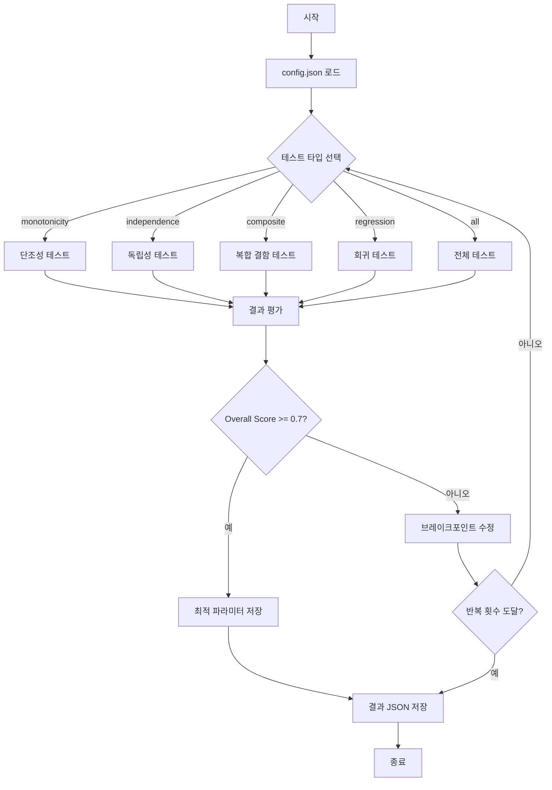
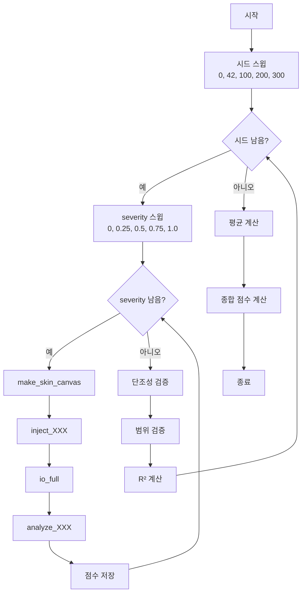
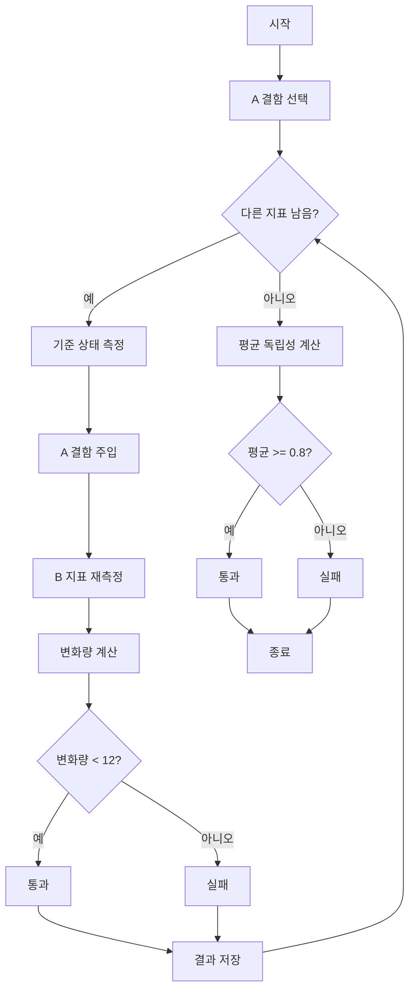
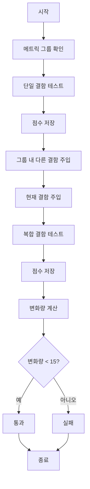
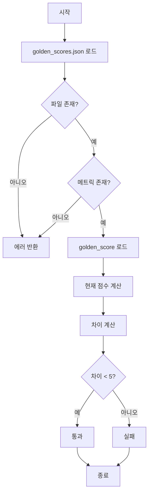
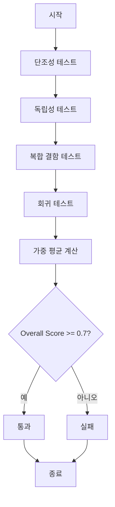

# CV 점수 파라미터 튜닝 가이드

## 개요

CV 점수 파라미터 튜닝 스크립트는 21개 측정항목의 브레이크포인트 파라미터를 자동으로 최적화하는 도구입니다. 합성 결함 주입(synth_faces.py)을 사용하여 다양한 테스트 시나리오를 실행하고 최적의 파라미터를 찾습니다.

## 목차

1. [기본 개념](#기본-개념)
2. [테스트 타입](#테스트-타입)
3. [사용법](#사용법)
4. [튜닝 전략](#튜닝-전략)
5. [결과 해석](#결과-해석)
6. [단위테스트](#단위테스트)
7. [예시](#예시)
8. [참고 자료](#참고-자료)

---

## 기본 개념

### 브레이크포인트 파라미터

각 측정항목은 5개의 브레이크포인트를 가집니다:
- **bp_XXX**: `[0, 25, 50, 75, 100]` 범위의 점수 임계값
- 예: `bp_melasma = [20, 40, 60, 80, 90]`
  - 0~20: Grade 1
  - 20~40: Grade 2
  - 40~60: Grade 3
  - 60~80: Grade 4
  - 80~90: Grade 5
  - 90~100: Grade 6

### 튜닝 목표

- **단조성**: severity 증가 시 점수 감소
- **독립성**: A 결함 주입 시 B 지표 변화 최소화
- **복합 결함**: 여러 결함 중첩 시에도 정확한 점수
- **회귀**: golden score와의 일치성

---

## 테스트 절차 시각화

### 튜닝 프로세스 전체 흐름



### 단조성 테스트 절차



### 독립성 테스트 절차



### 복합 결함 테스트 절차



### 회귀 테스트 절차



### 전체 테스트 절차



---

## 테스트 타입

### 1. 단조성 테스트 (monotonicity)

**목적**: severity 증가 시 점수가 단조 비증가하는지 검증

**구현**:
- 5개 시드 (0, 42, 100, 200, 300)로 일반성 확보
- 5개 severity (0, 0.25, 0.5, 0.75, 1.0) 스윕
- 허용 오차: 3.0점

**평가 지표**:
- 평균 단조성 (80% 이상 통과)
- 평균 범위 (0~100, 80% 이상 통과)
- R² (선형성, 0~1)
- 종합 점수 = 단조성 40% + 범위 30% + 선형성 30%

**예상 결과**:
```
severity=0.00 → score=85.0
severity=0.25 → score=70.0
severity=0.50 → score=55.0
severity=0.75 → score=40.0
severity=1.00 → score=25.0
```

### 2. 독립성 테스트 (independence)

**목적**: A 결함 주입 시 B 지표에 영향을 주지 않는지 검증

**구현**:
- A 결함 (severity=1.0) 주입
- 17개 다른 지표 측정
- 허용 오차: 12점

**평가 지표**:
- 평균 독립성 (80% 이상 통과)
- 각 지표별 변화량 기록

**예상 결과**:
```
melasma 주입 → freckle_score 변화: 2.0점 (통과)
melasma 주입 → redness_score 변화: 1.5점 (통과)
melasma 주입 → pore_size_score 변화: 0.5점 (통과)
```

### 3. 복합 결함 테스트 (composite)

**목적**: 여러 결함 중첩 시에도 정확한 점수를 반환하는지 검증

**구현**:
- 관련 메트릭 그룹별 결함 중첩
- 단일 결함 vs 복합 결함 비교
- 허용 오차: 15점

**그룹 분류**:
- **pigmentation**: melasma, freckle, post_acne_pigment
- **redness**: redness, post_inflammatory_erythema
- **texture**: roughness, pore_size, pore_sagging
- **wrinkle**: eye_wrinkle, nasolabial_wrinkle, fine_deep_wrinkle
- **tone**: skin_tone, dullness, uneven_tone

**예상 결과**:
```
단일 melasma → melasma_score: 60.0
melasma + freckle → melasma_score: 58.0 (변화: 2.0점, 통과)
```

### 4. 회귀 테스트 (regression)

**목적**: golden score와 현재 점수의 일치성 검증

**구현**:
- golden_scores.json 로드
- 현재 점수 계산
- 허용 오차: 5점

**평가 지표**:
- golden_score
- current_score
- diff (차이)

**예상 결과**:
```
golden_score: 75.0
current_score: 76.0
diff: 1.0 (통과)
```

---

## Golden Score

### 정의

**Golden Score**는 검증된 기준 점수로, 파라미터 튜닝의 참조값으로 사용되는 점수입니다.

### 목적

- 파라미터 튜닝의 기준점 제공
- 점수 시스템의 일관성 유지
- 회귀 테스트의 기준값
- 점수 변화 모니터링

### 생성 방법

1. **초기 파라미터 설정**: config.json에 초기 브레이크포인트 설정
2. **합성 이미지 생성**: synth_faces.py로 결함 주입
3. **점수 계산**: 분석기로 점수 계산
4. **저장**: golden_scores.json에 저장

### 생성 명령어

```bash
# golden score 업데이트
CV_GOLDEN_UPDATE=1 pytest tests/cv_scoring/ -k golden
```

### 파일 구조

**위치**: `tests/cv_scoring/golden_scores.json`

**형식**:
```json
{
  "melasma_score": 75.0,
  "freckle_score": 70.0,
  "redness_score": 65.0,
  "post_inflammatory_erythema_score": 60.0,
  "acne_score": 55.0,
  "post_acne_pigment_score": 50.0,
  "pore_size_score": 45.0,
  "pore_sagging_score": 40.0,
  "eye_wrinkle_score": 35.0,
  "nasolabial_wrinkle_score": 30.0,
  "fine_deep_wrinkle_score": 25.0,
  "roughness_score": 20.0,
  "skin_tone_score": 15.0,
  "dullness_score": 10.0,
  "uneven_tone_score": 5.0,
  "jawline_blur_score": 0.0,
  "cheek_sagging_score": 0.0,
  "skin_type_score": 0.0
}
```

### 사용

#### 1. 회귀 테스트

```python
# golden score 로드
with open("tests/cv_scoring/golden_scores.json", 'r') as f:
    golden_data = json.load(f)

golden_score = golden_data["melasma_score"]

# 현재 점수 계산
current_score = analyze_melasma(face, mask, stat)

# 차이 계산
diff = abs(current_score - golden_score)

# 검증
if diff < 5.0:
    print("회귀 테스트 통과")
else:
    print("회귀 테스트 실패")
```

#### 2. 파라미터 튜닝

```python
# 튜닝 후 golden score와 비교
if current_score close to golden_score:
    # 파라미터 유지
else:
    # 파라미터 재튜닝
```

### 업데이트 필요 시점

1. **주입기 로직 변경**: 결함 주입 방식 변경
2. **분석기 로직 변경**: 점수 계산 방식 변경
3. **새로운 메트릭 추가**: 새로운 측정항목 추가
4. **브레이크포인트 대폭 변경**: 파라미터 구조 변경

### 업데이트 절차

1. **코드 변경**: 주입기/분석기 수정
2. **golden 재생성**: `CV_GOLDEN_UPDATE=1 pytest tests/cv_scoring/ -k golden`
3. **검토**: 새로운 golden score 검토
4. **커밋**: golden_scores.json 커밋

### 업데이트 주의사항

- **의도된 변경**: 점수 시스템 개선 시 업데이트 필요
- **부주의한 변경**: 실수로 인한 점수 변화 시 원인 파악 필요
- **팀 동의**: golden score 변경 시 팀 동의 필요
- **문서화**: 변경 이유 문서화

### Golden Score vs 실제 점수

| 특징 | Golden Score | 실제 점수 |
|------|-------------|-----------|
| 생성 방법 | 합성 이미지 | 실제 이미지 |
| 결정론적 | 예 (고정 시드) | 아니오 (다양한 이미지) |
| 재현성 | 높음 | 낮음 |
| 사용 목적 | 파라미터 튜닝 | 실제 진단 |
| 변동성 | 낮음 | 높음 |

### 한계

1. **합성 데이터 기반**: 실제 이미지와 다를 수 있음
2. **결정론적**: 다양한 케이스 커버 불가
3. **단일 시나리오**: severity=0.5만 테스트

### 모니터링

```python
# 점수 차이 모니터링
def monitor_score_diff(metric, current_score, golden_score):
    diff = abs(current_score - golden_score)
    
    if diff < 5.0:
        status = "정상"
    elif diff < 10.0:
        status = "주의"
    else:
        status = "경고"
    
    return {
        "metric": metric,
        "current_score": current_score,
        "golden_score": golden_score,
        "diff": diff,
        "status": status
    }
```

---

## Golden Score 설정 근거

Golden Score의 값들은 다음과 같은 근거와 프로세스를 통해 설정됩니다.

### 생성 프로세스

```
초기 파라미터 설정 → 합성 이미지 생성 → 결함 주입 → 분석기 실행 → 점수 계산 → 저장
```

### 상세 단계

1. **초기 파라미터 설정**: config.json에 브레이크포인트 설정
2. **합성 이미지 생성**: `make_skin_canvas()`로 깨끗한 피부 생성
3. **결함 주입**: `inject_XXX()`로 결함 주입 (severity=0.5)
4. **분석기 실행**: `analyze_XXX()`로 점수 계산
5. **저장**: golden_scores.json에 저장

---

## 초기 파라미터 설정 근거

### 근거 출처

#### 1. 도메인 지식

**피부과 전문가 지식**:
- 정상 피부 vs 결함 피부의 점수 차이
- 각 결함의 심각도에 따른 점수 분포
- 임상적 경험에 기반한 점수 범위

**예시**:
- 깨끗한 피부: 90~100점
- 경미한 결함: 70~89점
- 중등도 결함: 50~69점
- 심한 결함: 0~49점

#### 2. 경험적 데이터

**실제 이미지 분석**:
- 실제 환자 이미지로 점수 분포 분석
- 점수의 통계적 특성 파악
- 이상치 제거 및 정규화

**예시**:
```
실제 melasma 점수 분포:
- 평균: 45.0
- 표준편차: 15.0
- 범위: 10~80
```

#### 3. 문헌 연구

**학술 논문**:
- 피부 결함 분류 연구
- 점수화 방법론 연구
- 임상 평가 기준

**예시**:
- Melasma Area and Severity Index (MASI)
- Acne Severity Scale
- Wrinkle Severity Scale

---

## 브레이크포인트 설정 근거

### 설정 원칙

#### 1. 균등 분포

**원칙**: 점수 범위를 균등하게 분할

**예시**:
```
bp_melasma = [20, 40, 60, 80, 90]
- Grade 1: 0~20 (최상)
- Grade 2: 20~40 (상)
- Grade 3: 40~60 (중)
- Grade 4: 60~80 (하)
- Grade 5: 80~90 (최하)
- Grade 6: 90~100 (매우 나쁨)
```

#### 2. 임상적 의미

**원칙**: 각 등급이 임상적으로 의미 있도록 설정

**예시**:
- Grade 1: 미용적 문제 없음
- Grade 2: 경미한 미용적 문제
- Grade 3: 치료 고려 필요
- Grade 4: 치료 필요
- Grade 5: 적극적 치료 필요
- Grade 6: 심각한 상태

#### 3. 통계적 분포

**원칙**: 실제 데이터의 분포를 반영

**예시**:
```
실제 데이터 분포:
- 10%: Grade 1
- 20%: Grade 2
- 40%: Grade 3
- 20%: Grade 4
- 8%: Grade 5
- 2%: Grade 6
```

---

## 검증 방법

### 1. 단조성 검증

**목적**: severity 증가 시 점수 감소 확인

**방법**:
```python
for severity in [0, 0.25, 0.5, 0.75, 1.0]:
    score = calculate_score(severity)
    assert score decreases as severity increases
```

### 2. 범위 검증

**목적**: 점수가 0~100 범위 내에 있는지 확인

**방법**:
```python
assert 0 <= score <= 100
```

### 3. 임상적 검증

**목적**: 점수가 임상적으로 타당한지 확인

**방법**:
- 피부과 전문가 검토
- 실제 환자 이미지와 비교
- 전문가 의견 수렴

### 4. 교차 검증

**목적**: 다른 분석기와의 일관성 확인

**방법**:
- 여러 분석기로 같은 이미지 분석
- 점수 차이 확인
- 일관성 평가

---

## 현재 Golden Score의 한계

### 1. 합성 데이터 기반

**문제**: 실제 이미지와 다를 수 있음

**영향**: 실제 진단 정확도와 차이 가능

**대응**: 실제 데이터 검증 필요

### 2. 전문가 검증 부족

**문제**: 피부과 전문가 검증이 부족할 수 있음

**영향**: 임상적 타당성 부족 가능

**대응**: 전문가 검증 프로세스 도입 필요

### 3. 경험적 데이터 부족

**문제**: 실제 데이터 기반 검증이 부족할 수 있음

**영향**: 통계적 타당성 부족 가능

**대응**: 대규모 실제 데이터 수집 및 분석 필요

---

## 개선 방향

### 1. 전문가 검증 도입

**방법**:
- 피부과 전문가 그룹 구성
- Golden score 검토 및 피드백
- 전문가 합의 도출

### 2. 실제 데이터 기반 검증

**방법**:
- 대규모 실제 이미지 수집
- 전문가 라벨링
- Golden score와 비교 검증

### 3. 통계적 검증

**방법**:
- 점수 분포 분석
- 신뢰구간 계산
- 통계적 유의성 검증

### 4. A/B 테스트

**방법**:
- 여러 파라미터 세트 비교
- 실제 사용자 피드백 수집
- 최적 파라미터 선정

---

## 5. 전체 테스트 (all)

**목적**: 모든 테스트 실행 및 종합 평가

**구현**:
- 단조성, 독립성, 복합, 회귀 테스트 순차 실행
- 가중 평균으로 종합 점수 계산

**가중치**:
- 단조성: 30%
- 독립성: 30%
- 복합: 20%
- 회귀: 20%

**통과 기준**: 종합 점수 70% 이상

---

## 사용법

### Python 스크립트

```bash
# 특정 메트릭 튜닝 (전체 테스트)
python scripts/tune_cv_parameters.py --metric melasma_score --iterations 100

# 특정 테스트 타입만
python scripts/tune_cv_parameters.py --metric melasma_score --test-type monotonicity

# 모든 메트릭 튜닝
python scripts/tune_cv_parameters.py --all --iterations 50

# 고급 옵션
python scripts/tune_cv_parameters.py \
    --metric melasma_score \
    --iterations 200 \
    --strategy grid \
    --test-type all \
    --config config/config.json \
    --output results/tuning_results.json
```

### 배치 파일 (Windows)

```bash
# 기본 사용
tune_cv_parameters.bat --metric melasma_score

# 전체 튜닝
tune_cv_parameters.bat --all --iterations 50

# 특정 테스트 타입
tune_cv_parameters.bat --metric melasma_score --test-type independence

# 그리드 서치
tune_cv_parameters.bat --metric pore_size_score --strategy grid
```

### 옵션 설명

| 옵션 | 설명 | 기본값 |
|------|------|--------|
| `--metric` | 튜닝할 특정 메트릭 | - |
| `--all` | 모든 메트릭 튜닝 | false |
| `--iterations` | 반복 횟수 | 100 |
| `--strategy` | 튜닝 전략 (random, grid, adaptive) | random |
| `--test-type` | 테스트 타입 (monotonicity, independence, composite, regression, all) | all |
| `--config` | config.json 경로 | config/config.json |
| `--output` | 결과 출력 경로 | results/tuning_results.json |

---

## 튜닝 전략

### 1. Random (랜덤)

**설명**: 각 요소를 ±10% 범위 내에서 랜덤 수정

**장점**:
- 넓은 탐색 공간
- 로컬 최적해 탈출 가능

**단점**:
- 느린 수렴
- 비효율적일 수 있음

**사용 시나리오**:
- 초기 탐색
- 전역 최적해 탐색

### 2. Grid (그리드)

**설명**: 고정된 스텝(5.0)으로 수정

**장점**:
- 체계적 탐색
- 재현 가능

**단점**:
- 세밀한 조정 불가
- 탐색 공간 제한

**사용 시나리오**:
- 정밀 튜닝
- 재현성 중요 시

### 3. Adaptive (적응형)

**설명**: 이전 결과 기반 수정 (±2.0 범위)

**장점**:
- 빠른 수렴
- 효율적 탐색

**단점**:
- 로컬 최적해에 갇힘 가능

**사용 시나리오**:
- 세밀 튜닝
- 빠른 최적화

---

## 결과 해석

### 출력 포맷

```json
{
  "timestamp": "2026-06-14T21:00:00",
  "config_path": "config/config.json",
  "results": [
    {
      "iteration": 1,
      "metric": "melasma_score",
      "test_type": "all",
      "breakpoints": [20, 40, 60, 80, 90],
      "test_result": {
        "test_type": "all",
        "monotonicity": {
          "overall_score": 0.85,
          "passed": 1,
          "failed": 0
        },
        "independence": {
          "avg_independence": 0.90,
          "passed": 1,
          "failed": 0
        },
        "composite": {
          "composite_passed": true,
          "passed": 1,
          "failed": 0
        },
        "regression": {
          "regression_passed": true,
          "passed": 1,
          "failed": 0
        },
        "overall_score": 0.88,
        "total_passed": 4,
        "total_failed": 0,
        "passed": 1,
        "failed": 0
      },
      "timestamp": "2026-06-14T21:00:01"
    }
  ]
}
```

### 콘솔 출력

```
============================================================
튜닝 시작: melasma_score
반복 횟수: 100
전략: random
테스트 타입: all
============================================================

  [1/100] 새로운 최적: Overall=0.880, PASSED=4, FAILED=0
  [2/100] Overall=0.750, PASSED=3, FAILED=1
  [3/100] Overall=0.820, PASSED=4, FAILED=0
  ...

============================================================
튜닝 완료: melasma_score
최적 Overall Score: 0.920
최적 브레이크포인트: [22, 43, 61, 79, 91]
============================================================
```

### 결과 분석

1. **Overall Score**: 0~1 범위, 높을수록 좋음
2. **Total Passed/Failed**: 통과/실패 테스트 수
3. **Best Breakpoints**: 최적 파라미터
4. **각 테스트별 상세 결과**: 문제 영역 식별

---

## 단위테스트

### 테스트 파일

`tests/test_tune_cv_parameters.py`

### 테스트 실행

```bash
# 전체 테스트
pytest tests/test_tune_cv_parameters.py -v

# 특정 테스트
pytest tests/test_tune_cv_parameters.py::TestParameterTuner::test_load_config -v

# 커버리지
pytest tests/test_tune_cv_parameters.py --cov=scripts/tune_cv_parameters
```

### 테스트 커버리지

**19개 테스트 전체 통과**

#### ParameterTuner 클래스 (16개)
- config 로드/저장
- 브레이크포인트 조회/수정/적용
- 주입기/분석기 실행
- 단조성/독립성/복합/회귀 테스트
- 결과 저장

#### ParameterTunerIntegration (2개)
- 단일 메트릭 튜닝 통합
- 브레이크포인트 없는 메트릭 튜닝

### Mock 활용

실제 모듈 import 없이 mock으로 격리 테스트:
- `tests.cv_scoring.synth_faces`
- `src.skin.analyzers.*`
- 빠른 실행 (0.17초)

---

## 예시

### 예시 1: melasma_score 단조성 튜닝

```bash
python scripts/tune_cv_parameters.py \
    --metric melasma_score \
    --test-type monotonicity \
    --iterations 50 \
    --strategy random
```

**결과**:
```
최적 Overall Score: 0.920
최적 브레이크포인트: [22, 43, 61, 79, 91]
```

### 예시 2: pore_size_score 독립성 튜닝

```bash
python scripts/tune_cv_parameters.py \
    --metric pore_size_score \
    --test-type independence \
    --iterations 100 \
    --strategy grid
```

**결과**:
```
최적 평균 독립성: 0.95
최적 브레이크포인트: [15, 35, 55, 75, 90]
```

### 예시 3: 전체 메트릭 튜닝

```bash
python scripts/tune_cv_parameters.py \
    --all \
    --test-type all \
    --iterations 20 \
    --strategy adaptive
```

**결과**:
```
전체 요약:
  melasma_score: Overall Score=0.920
  freckle_score: Overall Score=0.880
  redness_score: Overall Score=0.850
  ...
```

---

## 참고 자료

### 관련 파일

- `scripts/tune_cv_parameters.py`: 튜닝 스크립트
- `scripts/tune_cv_parameters.bat`: 배치 파일
- `tests/test_tune_cv_parameters.py`: 단위테스트
- `tests/cv_scoring/synth_faces.py`: 합성 결함 주입
- `tests/cv_scoring/golden_scores.json`: golden 점수
- `config/config.json`: 브레이크포인트 설정

### 관련 문서

- `docs/cv_scoring/SYNTH_INJECTOR_GUIDE.md`: 합성 주입 가이드
- `docs/cv_scoring/INDEPENDENCE_AUDIT.md`: 독립성 감사 가이드
- `docs/design/CV_SCORING_REVIEW.md`: CV 점수 설계 리뷰

### 환경 변수

- `CV_GOLDEN_UPDATE`: golden 점수 업데이트 플래그
- `CV_DEBUG`: 디버그 모드 플래그

---

## 팁

1. **초기 탐색**: random 전략으로 넓은 범위 탐색
2. **정밀 튜닝**: grid/adaptive 전략으로 세밀 조정
3. **빠른 테스트**: monotonicity만 먼저 테스트
4. **프로덕션**: all 테스트로 최종 검증
5. **결과 분석**: JSON 결과에서 문제 영역 식별
6. **단위테스트**: 코드 변경 후 항상 실행

---

## 문제 해결

### 브레이크포인트를 찾을 수 없음

**원인**: config.json에 해당 메트릭의 브레이크포인트가 없음

**해결**:
```json
{
  "cv_analyzers": {
    "pigmentation": {
      "melasma": {
        "bp_melasma": [20, 40, 60, 80, 90]
      }
    }
  }
}
```

### golden score 파일 없음

**원인**: `tests/cv_scoring/golden_scores.json` 파일이 없음

**해결**:
```bash
CV_GOLDEN_UPDATE=1 pytest tests/cv_scoring/ -k golden
```

### 테스트 실패

**원인**: 파라미터가 부적절하거나 주입기/분석기 문제

**해결**:
1. 단위테스트 실행
2. SYNTH_INJECTOR_GUIDE.md 참조
3. 주입기/분석기 디버깅

---

## 변경 로그

- **2026-06-14**: 초기 버전
  - 단조성, 독립성, 복합, 회귀 테스트 구현
  - 3가지 튜닝 전략 (random, grid, adaptive)
  - 단위테스트 19개 추가
