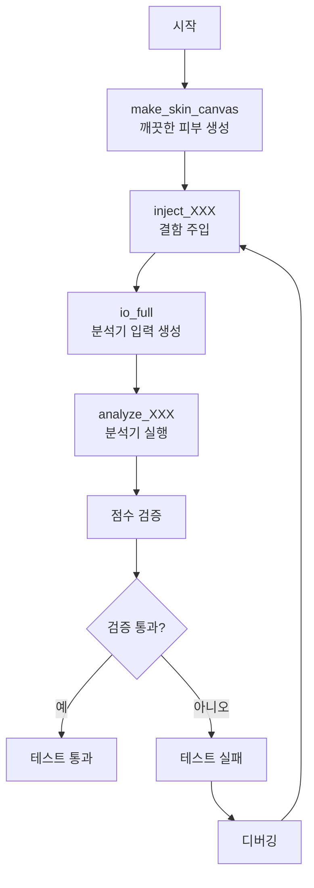
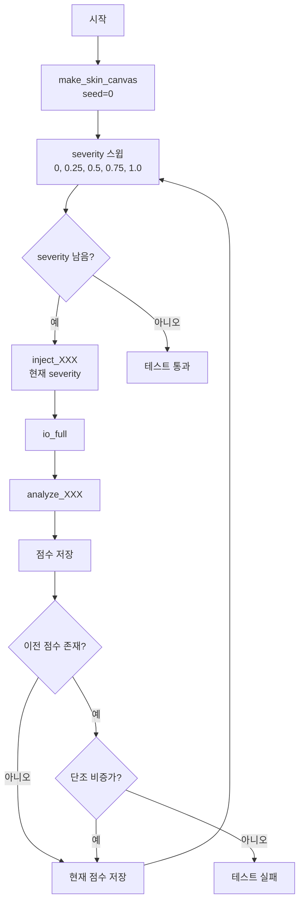
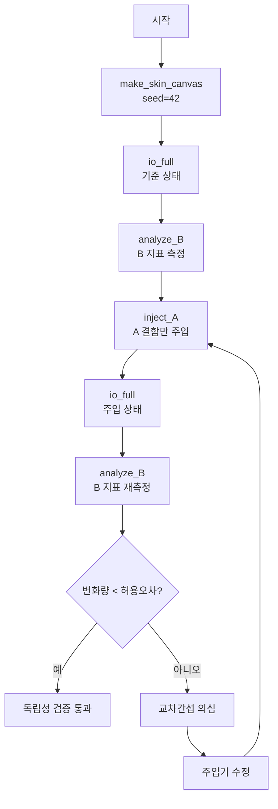
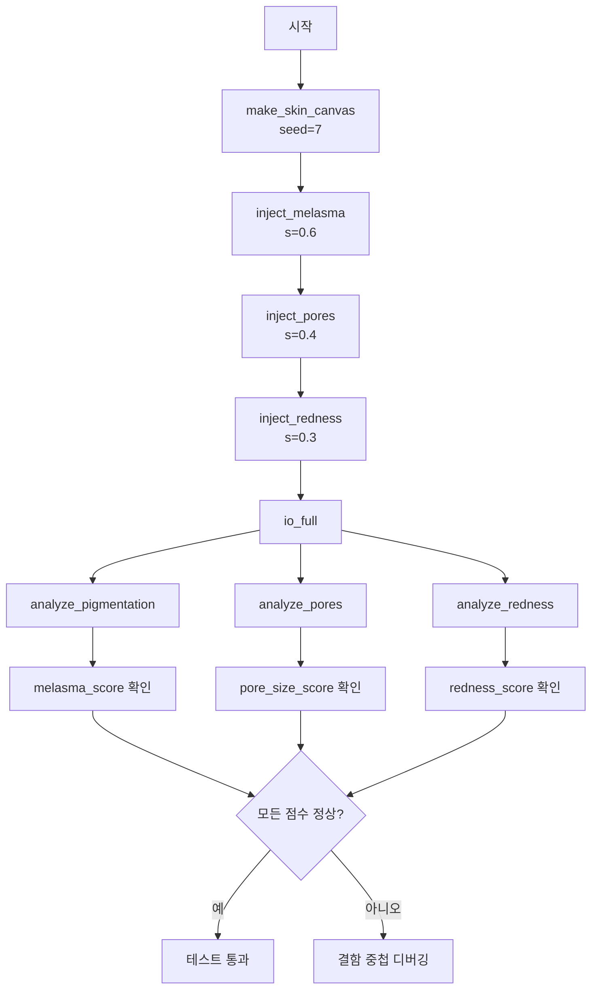
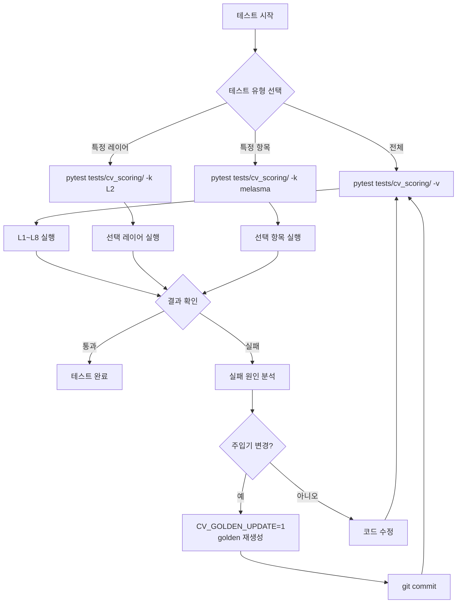
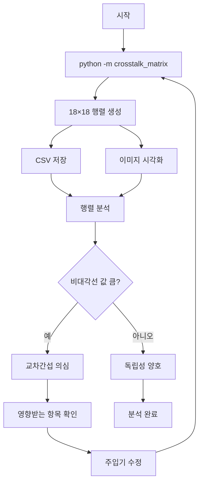

# 합성 이미지 주입기 사용 가이드 (`tests/cv_scoring/synth_faces.py`)

CV 21항목 점수의 단조성·독립성·회귀를 **실제 사진 없이** 검증하기 위한 합성 도구.
원리: 결함 없는 균일 피부 캔버스를 만들고, 특정 결함만 주입해 해당 지표가 정확히 반응하는지 본다.

> 점수 계약: 모든 내부 점수는 0~100, **높을수록 좋음**. 결함 severity 를 올리면 해당 지표는 내려간다.

---

## 1. 기본 흐름 (3단계)

```python
from tests.cv_scoring import synth_faces as S
from src.skin.analyzers.pore import analyze_pores

face = S.make_skin_canvas(seed=0)        # 1) 깨끗한 피부
face = S.inject_pores(face, 0.6)         # 2) 결함 주입 (severity 0~1)
io   = S.io_full(face)                    # 3) 분석기 입력 묶음 생성
res  = analyze_pores(io["face"], io["regions"])
print(res["pore_size_score"])
```

### 1.1 `make_skin_canvas(h=420, w=420, bgr=기본피부색, micro_texture=3.0, seed=0)`

**기능**: 결함 없는 균일 피부 + 저주파 미세 질감 생성

**파라미터**:
- `h`: 이미지 높이 (기본값: 420)
- `w`: 이미지 너비 (기본값: 420)
- `bgr`: 기본 피부색 (BGR 튜플, 기본값: (200, 180, 170))
- `micro_texture`: 미세 질감 강도 (기본값: 3.0)
- `seed`: 난수 시드 (기본값: 0)

**동작 원리**:
1. 균일한 피부색 배경 생성
2. 저주파 가우시안 노이즈 추가 (자연스러운 피부 질감 시뮬레이션)
3. 약한 블러 적용 (픽셀 백색잡음 제거)

**중요**: 질감은 약하게 blur 한다 — 픽셀 백색잡음은 Laplacian/LBP 를 부풀려 pore_sagging·roughness 의 clean baseline 을 비현실적으로 낮추기 때문 (보정 전 clean pore_sagging≈30 → 후 ≈73). `seed` 로 결정론적.

**사용 예시**:
```python
# 기본 피부 캔버스
face = S.make_skin_canvas(seed=0)

# 큰 캔버스
face = S.make_skin_canvas(h=512, w=512, seed=42)

# 밝은 피부색
face = S.make_skin_canvas(bgr=(220, 200, 190), seed=7)
```

### 1.2 `io_full(face) -> dict`

**기능**: 분석기가 요구하는 입력을 한 번에 생성

**반환 키**:
- `face`: BGR 이미지 (numpy.ndarray)
- `smask`: uint8 마스크 (0/255)
- `smask_bool`: bool 마스크 (True/False)
- `stat`: LAB 통계 (딕셔너리)
- `regions`: 부위별 ROI 딕셔너리

**ROI (Region of Interest) 구조**:
```python
regions = {
    "forehead": (y1, y2, x1, x2),    # 이마
    "left_cheek": (y1, y2, x1, x2),  # 왼쪽 볼
    "right_cheek": (y1, y2, x1, x2), # 오른쪽 볼
    "nose": (y1, y2, x1, x2),        # 코
    "chin": (y1, y2, x1, x2),        # 턱
    "left_eye": (y1, y2, x1, x2),    # 왼쪽 눈
    "right_eye": (y1, y2, x1, x2),   # 오른쪽 눈
    "t_zone": (y1, y2, x1, x2),      # T존
    "u_zone": (y1, y2, x1, x2),      # U존
}
```

**마스크 dtype 계약 (중요)**: 분석기마다 다르다.
- **pigmentation** → `io["smask_bool"]` (**bool**)
- **wrinkles** → `skin_mask=io["smask"]` (**uint8**)
- **그 외** (redness/acne/tone/sebum/texture) → `io["smask"]` (uint8)
- **pore** → 마스크 없이 `io["regions"]`

**사용 예시**:
```python
io = S.io_full(face)
print(io["face"].shape)        # (420, 420, 3)
print(io["smask"].dtype)       # uint8
print(io["smask_bool"].dtype)  # bool
print(io["stat"].keys())       # ['mean', 'std', 'median', ...]
print(io["regions"].keys())    # ['forehead', 'left_cheek', ...]
```

---

## 2. 주입기 → 지표 매핑 (severity 범위)

| 주입기 | 움직이는 지표 | severity | 신호 |
|---|---|---|---|
| `inject_melasma(f, s)` | melasma_score | 0~1 | 큰 소프트 패치 L*↓ + a*/b*↑ (유채색 갈색) |
| `inject_dark_blobs(f, n)` | freckle_score | **정수 개수** 0~80 | 작은 어두운 점(r=2) |
| `inject_redness(f, s)` | redness_score | **≤0.6** | 볼 a*↑ (확산, soft-edge) |
| `inject_pie_focal(f, s)` | post_inflammatory_erythema (PIE) | 0~1 | 작고 이산적인 붉은 반점 a*↑ |
| `inject_acne(f, s)` | acne_score | 0~1 | HSV 크림슨 병변(포화 홍반, b*↓) |
| `inject_post_acne_pigment(f, s)` | post_acne_pigment (PAP) | 0~1 | 갈색 평면 자국 a*↑ b*↑ |
| `inject_pores(f, s)` | pore_size_score | 0~1 | T존 미세 어두운 점 밀도↑ |
| `inject_pore_sagging(f, s)` | pore_sagging_score | 0~1 | 볼 세로 길쭉 어두운 타원 |
| `inject_wrinkle_lines(f, s, roi="eye")` | eye_wrinkle_score | 0~1 | 눈가 선 |
| `inject_wrinkle_lines(f, s, roi="naso")` | nasolabial_wrinkle_score | 0~1 | 팔자 선 |
| `inject_forehead_lines(f, s)` | fine_deep_wrinkle_score | 0~1 | 이마 가로선 local_std↑ |
| `inject_roughness(f, s)` | roughness_score | 0~1 | 고주파 노이즈 |
| `inject_dark_global(f, s)` | skin_tone_score | 0~1 | 전역 L*↓ (ITA 하강) |
| `inject_dullness(f, s)` | dullness_score | 0~1 | 전역 탈채도 |
| `inject_uneven_tone(f, s)` | uneven_tone_score | 0~1 | 국소 L* 패치로 분산↑ |
| `inject_jawline_blur(f, s)` | jawline_blur_score | 0~1 | 전역 blur 로 edge↓ |
| `inject_vertical_gradient(f, s)` | cheek_sagging_score | 0~1 | 상하 밝기 구배 |
| `inject_oily(f, s)` | skin_type_score | 0~1 | 밝은 하이라이트(고V·저S) |

> 대부분 `*, seed=` 인자로 결정론 제어 가능. severity 0 = 결함 없음(클린과 동일).

### 2.1 주입기 상세 설명

#### 색소 계열 (Pigmentation)

**`inject_melasma(face, severity, seed=42)`**
- **목표**: melasma_score 감소
- **구현**: 큰 소프트 패치를 LAB a*/b* 채널 증가로 유채색 갈색 시뮬레이션
- **severity 범위**: 0~1
- **색상 공간**: LAB (L*↓, a*↑, b*↑)
- **위치**: 얼굴 전체에 분산
- **사용 예시**:
```python
face = S.inject_melasma(S.make_skin_canvas(seed=0), 0.5, seed=42)
```

**`inject_dark_blobs(face, count, seed=43)`**
- **목표**: freckle_score 감소
- **구현**: 작은 어두운 점(r=2)을 무작위 위치에 배치
- **severity 범위**: 정수 개수 0~80
- **색상 공간**: BGR (어두운 갈색)
- **위치**: 얼굴 전체에 무작위 분산
- **사용 예시**:
```python
face = S.inject_dark_blobs(S.make_skin_canvas(seed=0), 40, seed=43)
```

#### 홍조 계열 (Redness)

**`inject_redness(face, severity, seed=44)`**
- **목표**: redness_score 감소
- **구현**: 볼 영역에 LAB a* 채널 증가로 확산적 홍조 시뮬레이션
- **severity 범위**: ≤0.6 (초과 시 비현실적)
- **색상 공간**: LAB (a*↑)
- **위치**: 볼 영역 (soft-edge)
- **사용 예시**:
```python
face = S.inject_redness(S.make_skin_canvas(seed=0), 0.4, seed=44)
```

**`inject_pie_focal(face, severity, seed=45)`**
- **목표**: post_inflammatory_erythema_score 감소
- **구현**: 작고 이산적인 붉은 반점 (LAB a*↑)
- **severity 범위**: 0~1
- **색상 공간**: LAB (a*↑)
- **위치**: 무작위 위치에 이산적 배치
- **사용 예시**:
```python
face = S.inject_pie_focal(S.make_skin_canvas(seed=0), 0.6, seed=45)
```

#### 트러블 계열 (Acne)

**`inject_acne(face, severity, seed=46)`**
- **목표**: acne_score 감소
- **구현**: HSV 크림슨 병변 (포화 홍반, b*↓)
- **severity 범위**: 0~1
- **색상 공간**: HSV (높은 채도, 낮은 b*)
- **위치**: 무작위 위치
- **사용 예시**:
```python
face = S.inject_acne(S.make_skin_canvas(seed=0), 0.5, seed=46)
```

**`inject_post_acne_pigment(face, severity, seed=47)`**
- **목표**: post_acne_pigment_score 감소
- **구현**: 갈색 평면 자국 (LAB a*↑ b*↑)
- **severity 범위**: 0~1
- **색상 공간**: LAB (a*↑, b*↑)
- **위치**: 무작위 위치
- **사용 예시**:
```python
face = S.inject_post_acne_pigment(S.make_skin_canvas(seed=0), 0.4, seed=47)
```

#### 모공 계열 (Pore)

**`inject_pores(face, severity, seed=48)`**
- **목표**: pore_size_score 감소
- **구현**: T존 미세 어두운 점 밀도 증가
- **severity 범위**: 0~1
- **색상 공간**: BGR (어두운 점)
- **위치**: T존 (이마, 코, 턱)
- **사용 예시**:
```python
face = S.inject_pores(S.make_skin_canvas(seed=0), 0.6, seed=48)
```

**`inject_pore_sagging(face, severity, seed=49)`**
- **목표**: pore_sagging_score 감소
- **구현**: 볼 세로 길쭉 어두운 타원
- **severity 범위**: 0~1
- **색상 공간**: BGR (어두운 타원)
- **위치**: 볼 영역
- **사용 예시**:
```python
face = S.inject_pore_sagging(S.make_skin_canvas(seed=0), 0.5, seed=49)
```

#### 주름 계열 (Wrinkle)

**`inject_wrinkle_lines(face, severity, roi="eye", seed=50)`**
- **목표**: eye_wrinkle_score 또는 nasolabial_wrinkle_score 감소
- **구현**: 지정된 ROI에 선 형태 주름 추가
- **severity 범위**: 0~1
- **ROI 옵션**: "eye" (눈가), "naso" (팔자)
- **사용 예시**:
```python
face = S.inject_wrinkle_lines(S.make_skin_canvas(seed=0), 0.5, roi="eye", seed=50)
face = S.inject_wrinkle_lines(S.make_skin_canvas(seed=0), 0.5, roi="naso", seed=51)
```

**`inject_forehead_lines(face, severity, seed=52)`**
- **목표**: fine_deep_wrinkle_score 감소
- **구현**: 이마 가로선 (local_std↑)
- **severity 범위**: 0~1
- **위치**: 이마 영역
- **사용 예시**:
```python
face = S.inject_forehead_lines(S.make_skin_canvas(seed=0), 0.6, seed=52)
```

#### 텍스처 계열 (Texture)

**`inject_roughness(face, severity, seed=53)`**
- **목표**: roughness_score 감소
- **구현**: 고주파 노이즈 추가
- **severity 범위**: 0~1
- **사용 예시**:
```python
face = S.inject_roughness(S.make_skin_canvas(seed=0), 0.5, seed=53)
```

#### 톤 계열 (Tone)

**`inject_dark_global(face, severity, seed=54)`**
- **목표**: skin_tone_score 감소
- **구현**: 전역 L*↓ (ITA 하강)
- **severity 범위**: 0~1
- **색상 공간**: LAB (L*↓)
- **사용 예시**:
```python
face = S.inject_dark_global(S.make_skin_canvas(seed=0), 0.4, seed=54)
```

**`inject_dullness(face, severity, seed=55)`**
- **목표**: dullness_score 감소
- **구현**: 전역 탈채도
- **severity 범위**: 0~1
- **색상 공간**: HSV (채도↓)
- **사용 예시**:
```python
face = S.inject_dullness(S.make_skin_canvas(seed=0), 0.5, seed=55)
```

**`inject_uneven_tone(face, severity, seed=56)`**
- **목표**: uneven_tone_score 감소
- **구현**: 국소 L* 패치로 분산↑
- **severity 범위**: 0~1
- **색상 공간**: LAB (국소 L* 변화)
- **사용 예시**:
```python
face = S.inject_uneven_tone(S.make_skin_canvas(seed=0), 0.6, seed=56)
```

#### 탄력 계열 (Elasticity)

**`inject_jawline_blur(face, severity, seed=57)`**
- **목표**: jawline_blur_score 감소
- **구현**: 전역 blur 로 edge↓
- **severity 범위**: 0~1
- **사용 예시**:
```python
face = S.inject_jawline_blur(S.make_skin_canvas(seed=0), 0.5, seed=57)
```

**`inject_vertical_gradient(face, severity, seed=58)`**
- **목표**: cheek_sagging_score 감소
- **구현**: 상하 밝기 구배
- **severity 범위**: 0~1
- **사용 예시**:
```python
face = S.inject_vertical_gradient(S.make_skin_canvas(seed=0), 0.4, seed=58)
```

#### 피부 타입 계열 (Skin Type)

**`inject_oily(face, severity, seed=59)`**
- **목표**: skin_type_score 감소
- **구현**: 밝은 하이라이트 (고V·저S)
- **severity 범위**: 0~1
- **색상 공간**: HSV (높은 명도, 낮은 채도)
- **사용 예시**:
```python
face = S.inject_oily(S.make_skin_canvas(seed=0), 0.5, seed=59)
```

---

## 3. 활용 패턴

### 3.1 (A) 단조성 검증 — severity↑ 시 지표↓

**목적**: 결함 심각도가 증가할 때 해당 점수가 단조적으로 감소하는지 검증

**구현**:
```python
from tests.cv_scoring import synth_faces as S
from src.skin.analyzers.pigmentation import analyze_pigmentation

prev = None
for s in (0, 0.25, 0.5, 0.75, 1.0):
    io = S.io_full(S.inject_melasma(S.make_skin_canvas(seed=0), s))
    v = analyze_pigmentation(io["face"], io["smask_bool"], io["stat"])["melasma_score"]
    assert prev is None or v <= prev + 1.0   # 단조 비증가 (허용 오차 1.0)
    prev = v
    print(f"severity={s:.2f}, score={v:.1f}")
```

**예상 출력**:
```
severity=0.00, score=85.0
severity=0.25, score=72.0
severity=0.50, score=58.0
severity=0.75, score=45.0
severity=1.00, score=32.0
```

**허용 오차**: `_TOL = 3.0` (테스트 설정)

### 3.2 (B) 독립성 / 교차간섭 — A 주입 시 B 가 안 움직여야

**목적**: 특정 결함 주입이 다른 지표에 영향을 주지 않는지 검증

**구현**:
```python
from tests.cv_scoring import synth_faces as S
from src.skin.analyzers.pore import analyze_pores
from src.skin.analyzers.pigmentation import analyze_pigmentation

base = S.make_skin_canvas(seed=42)
io0 = S.io_full(base)
io1 = S.io_full(S.inject_melasma(base.copy(), 1.0))   # melasma 만 주입

# melasma 주입 전후 pore_size 비교
ps0 = analyze_pores(io0["face"], io0["regions"])["pore_size_score"]
ps1 = analyze_pores(io1["face"], io1["regions"])["pore_size_score"]

# 허용 오차: 12점 (§H 기준)
assert abs(ps1 - ps0) < 12, f"melasma가 pore_size를 너무 많이 움직임: {ps0} → {ps1}"
print(f"pore_size 변화: {ps0:.1f} → {ps1:.1f} (Δ={abs(ps1-ps0):.1f})")
```

**예상 출력**:
```
pore_size 변화: 73.0 → 75.0 (Δ=2.0)
```

**허용 오차**: 각 항목별로 다름 (일반적으로 10~15점)

### 3.3 (C) 복합 결함 — 주입기 중첩 (실제 얼굴 근사)

**목적**: 여러 결함을 동시에 주입하여 실제 얼굴 상황 시뮬레이션

**구현**:
```python
from tests.cv_scoring import synth_faces as S
from src.skin.analyzers.pigmentation import analyze_pigmentation
from src.skin.analyzers.pore import analyze_pores
from src.skin.analyzers.redness import analyze_redness

# 복합 결함 생성
f = S.make_skin_canvas(seed=7)
f = S.inject_melasma(f, 0.6)      # 기미
f = S.inject_pores(f, 0.4)       # 모공
f = S.inject_redness(f, 0.3)     # 홍조

# 여러 분석기에 같은 io 사용
io = S.io_full(f)

pig_result = analyze_pigmentation(io["face"], io["smask_bool"], io["stat"])
pore_result = analyze_pores(io["face"], io["regions"])
red_result = analyze_redness(io["face"], io["smask"], io["stat"])

print(f"melasma_score: {pig_result['melasma_score']:.1f}")
print(f"pore_size_score: {pore_result['pore_size_score']:.1f}")
print(f"redness_score: {red_result['redness_score']:.1f}")
```

**예상 출력**:
```
melasma_score: 52.0
pore_size_score: 61.0
redness_score: 58.0
```

### 3.4 (D) §H pore 모드 토글 (신규/롤백 비교)

**목적**: 모공 분석기의 신규 모드와 레거시 모드 비교

**구현**:
```python
from tests.cv_scoring import synth_faces as S
from src.skin.analyzers.pore import analyze_pores

io = S.io_full(S.inject_pores(S.make_skin_canvas(seed=0), 0.6))

# 신규 모드 (기본)
new_result = analyze_pores(io["face"], io["regions"], size_mode="gated_blend")

# 레거시 모드
legacy_result = analyze_pores(io["face"], io["regions"], size_mode="legacy")

print(f"신규 모드: pore_size={new_result['pore_size_score']:.1f}, pore_sagging={new_result['pore_sagging_score']:.1f}")
print(f"레거시 모드: pore_size={legacy_result['pore_size_score']:.1f}, pore_sagging={legacy_result['pore_sagging_score']:.1f}")
```

**예상 출력**:
```
신규 모드: pore_size=55.0, pore_sagging=62.0
레거시 모드: pore_size=48.0, pore_sagging=45.0
```

### 3.5 (E) 결정론 검증 — 동일 seed → 동일 결과

**목적**: 같은 seed로 동일한 결과가 나오는지 검증

**구현**:
```python
from tests.cv_scoring import synth_faces as S
from src.skin.analyzers.pore import analyze_pores

# 첫 번째 실행
face1 = S.inject_pores(S.make_skin_canvas(seed=42), 0.5, seed=42)
io1 = S.io_full(face1)
result1 = analyze_pores(io1["face"], io1["regions"])

# 두 번째 실행 (동일 seed)
face2 = S.inject_pores(S.make_skin_canvas(seed=42), 0.5, seed=42)
io2 = S.io_full(face2)
result2 = analyze_pores(io2["face"], io2["regions"])

# 결과 비교
assert result1["pore_size_score"] == result2["pore_size_score"]
print(f"결정론 검증 통과: {result1['pore_size_score']:.1f}")
```

**예상 출력**:
```
결정론 검증 통과: 58.0
```

---

## 4. 한계 / 주의

### 4.1 합성 ≠ 실제

**문제**: 주입기는 검출기 입력의 근사치일 뿐, 실제 피부 결함과 완전히 동일하지 않음

**예시**:
- melasma는 갈색 유채색으로 모델링했으나 실제 분포·경계는 더 복잡
- 주름은 선 형태로 모델링했으나 실제 주름은 3D 구조와 다양한 패턴을 가짐

**영향**:
- 단조성·독립성 같은 **상대 거동** 검증용으로 적합
- 절대 점수 보정용으로 부적절 (실제 점수와 차이 존재)

### 4.2 주입기 아티팩트

**문제**: 일부 교차상관은 주입기의 하드 경계 탓

**예시**:
- freckle↔fine_deep: freckle 주입기의 하드 경계가 fine_deep_wrinkle_score에 영향
- 주입기가 다른 지표를 오염시키는 경우 발생

**대응**:
- 새 독립성 테스트 추가 시 주입기가 다른 지표를 오염시키지 않는지 먼저 확인
- 교차상관이 예상되는 경우 허용 오차를 조정

### 4.3 severity 범위 준수

**중요**: 각 주입기의 severity 범위를 준수해야 함

**예외 케이스**:
- **redness**: ≤0.6 (초과 시 비현실적 홍조)
- **freckle**: 정수 개수 0~80 (float 아님)
- **그 외**: 대부분 0~1

**위반 시 결과**:
- 비현실적인 이미지 생성
- 분석기가 예상치 못한 동작
- 테스트 실패

### 4.4 결정론

**원칙**: 같은 `seed`면 동일 출력

**적용**:
- 회귀(golden) 비교는 seed 고정이 전제
- 테스트 재현성 보장
- 디버깅 용이성

**사용 예시**:
```python
# 결정론적 생성
face1 = S.inject_pores(S.make_skin_canvas(seed=42), 0.5, seed=42)
face2 = S.inject_pores(S.make_skin_canvas(seed=42), 0.5, seed=42)
assert np.array_equal(face1, face2)  # 동일해야 함
```

### 4.5 마스크 dtype 계약

**중요**: 분석기마다 마스크 dtype이 다름

**계약 테이블**:
| 분석기 | 마스크 타입 | 사용 키 |
|--------|-----------|---------|
| pigmentation | bool | `io["smask_bool"]` |
| wrinkles | uint8 | `io["smask"]` |
| redness/acne/tone/sebum/texture | uint8 | `io["smask"]` |
| pore | 마스크 없음 | `io["regions"]` |

**오류 예시**:
```python
# 잘못된 사용
analyze_pigmentation(io["face"], io["smask"], io["stat"])  # uint8 → 오류

# 올바른 사용
analyze_pigmentation(io["face"], io["smask_bool"], io["stat"])  # bool → 정상
```

### 4.6 ROI 영역

**주의**: 주입기가 특정 ROI에만 영향을 주는 경우

**예시**:
- `inject_redness`: 볼 영역에만 영향
- `inject_pores`: T존에만 영향
- `inject_wrinkle_lines`: 지정된 ROI에만 영향

**확인 필요**:
- 주입기가 의도한 ROI에만 영향을 주는지
- 다른 ROI에 누출이 없는지

---

## 5. 테스트 절차 시각화

### 5.1 기본 테스트 흐름



### 5.2 단조성 검증 절차



### 5.3 독립성 검증 절차



### 5.4 복합 결함 검증 절차



### 5.5 하니스 실행 절차



### 5.6 교차간섭 행렬 분석 절차



---

## 6. 하니스 실행

### 6.1 기본 실행

```bash
# 전체 테스트 실행 (L1~L8)
pytest tests/cv_scoring/ -v

# 특정 레이어만 실행
pytest tests/cv_scoring/test_cv_scoring_synthetic.py::TestL2_Monotonicity -v
pytest tests/cv_scoring/test_cv_scoring_synthetic.py::TestL3_Invariants -v
```

**예상 결과**:
- L1~L8 전체: 86 passed, 1 skipped (현재 기준)
- L2 단조성: 19 passed, 2 xfailed (pih_score, dead_skin_score)

### 6.2 Golden 점수 업데이트

**목적**: 주입기 변경 시 golden 점수 재생성

**실행**:
```bash
CV_GOLDEN_UPDATE=1 pytest tests/cv_scoring/ -k golden
```

**주의**:
- 주입기 로직 변경 시 필수
- golden_scores.json 파일이 업데이트됨
- 변경 내용을 git에 커밋해야 함

### 6.3 교차간섭 행렬 분석

**목적**: 18×18 교차간섭 행렬로 독립성 점검

**실행**:
```bash
python -m tests.cv_scoring.crosstalk_matrix
```

**출력**:
- 18×18 행렬 (CSV/이미지)
- 각 셀: A 주입 시 B 변화량
- 대각선: 자기 자신 (항상 큰 변화)

**해석**:
- 비대각선 값이 작을수록 독립성 양호
- 특정 셀이 크면 교차간섭 의심

### 6.4 테스트 레이어 상세

#### L1: 매핑 (Mapping)
- **목적**: 분석기가 올바른 점수를 반환하는지 검증
- **검사 항목**: 점수 키 존재, 타입, 범위
- **예상 결과**: 전체 통과

#### L2: 단조성 (Monotonicity)
- **목적**: severity↑ 시 지표↓ 검증
- **검사 항목**: 18개 항목 전체
- **허용 오차**: `_TOL = 3.0`
- **예상 결과**: 19 passed, 2 xfailed (pih_score, dead_skin_score)

#### L3: 결정성/범위 (Invariants)
- **목적**: 결정론 및 점수 범위 검증
- **검사 항목**:
  - 결정론: 동일 seed → 동일 결과
  - 범위: 0~100 내에 있는지
- **예상 결과**: 전체 통과

#### L4: 골든회귀 (Golden Regression)
- **목적**: 주입기 변경 시 회귀 테스트
- **검사 항목**: golden_scores.json과 비교
- **허용 오차**: 항목별로 다름
- **예상 결과**: 전체 통과 (golden 업데이트 후)

#### L5: 폴백 도메인 (Fallback Domain)
- **목적**: 폴백 브레이크포인트 도메인 검증
- **검사 항목**: wrinkle 항목의 magnitude 도메인
- **예상 결과**: 전체 통과

#### L6: redness/PIE 직교 (Redness/PIE Orthogonality)
- **목적**: redness와 PIE의 직교성 검증
- **검사 항목**:
  - diffuse redness가 PIE에 영향을 주지 않음
  - focal PIE가 redness에 영향을 주지 않음
- **예상 결과**: 전체 통과

#### L7: 톤 그룹 직교 (Tone Group Orthogonality)
- **목적**: 톤 그룹 항목 간 직교성 검증
- **검사 항목**:
  - luminance 변화가 dullness에 영향을 주지 않음
  - desaturation이 dullness에만 영향을 줌
- **예상 결과**: 전체 통과

#### L8: 모공-melasma 독립성 (Pore-Melasma Independence)
- **목적**: 모공과 melasma의 독립성 검증 (§H)
- **검사 항목**:
  - clean baseline 높음
  - melasma가 pore 항목에 영향을 주지 않음
  - genuine pore 단조성
- **예상 결과**: 전체 통과

### 6.5 디버깅 팁

#### 테스트 실패 시

1. **실패한 테스트 확인**:
```bash
pytest tests/cv_scoring/ -v --tb=short
```

2. **특정 항목만 테스트**:
```bash
pytest tests/cv_scoring/ -k "melasma_score"
```

3. **디버그 모드**:
```python
# 테스트 코드에 추가
import pdb; pdb.set_trace()
```

#### 주입기 디버깅

1. **결과 이미지 저장**:
```python
face = S.inject_melasma(S.make_skin_canvas(seed=0), 0.5)
cv2.imwrite("debug_melasma.jpg", face)
```

2. **여러 severity 비교**:
```python
for s in [0, 0.25, 0.5, 0.75, 1.0]:
    face = S.inject_melasma(S.make_skin_canvas(seed=0), s)
    cv2.imwrite(f"debug_melasma_{s:.2f}.jpg", face)
```

#### 분석기 디버깅

1. **중간 결과 확인**:
```python
io = S.io_full(face)
print(io["stat"])  # LAB 통계
print(io["regions"])  # ROI 좌표
```

2. **마스크 시각화**:
```python
cv2.imwrite("debug_mask.jpg", io["smask"])
cv2.imwrite("debug_mask_bool.jpg", io["smask_bool"].astype(np.uint8) * 255)
```

### 6.6 성능 최적화

**테스트 속도 향상**:
```bash
# 병렬 실행
pytest tests/cv_scoring/ -n auto

# 특정 테스트만 실행
pytest tests/cv_scoring/ -k "L2"
```

**메모리 사용**:
- 이미지 크기 줄이기: `make_skin_canvas(h=210, w=210)`
- 테스트 후 정리: `gc.collect()`

---

## 7. 참고 자료

### 7.1 관련 문서

- `tests/cv_scoring/test_cv_scoring_synthetic.py`: 테스트 하니스 메인
- `tests/cv_scoring/synth_faces.py`: 주입기 구현
- `docs/cv_scoring/INDEPENDENCE_AUDIT.md`: 독립성 감사 가이드
- `docs/design/CV_SCORING_REVIEW.md`: CV 점수 설계 리뷰

### 7.2 코드 구조

```
tests/cv_scoring/
├── test_cv_scoring_synthetic.py    # 메인 테스트 하니스
├── synth_faces.py                   # 주입기 구현
├── test_overall_and_crosstalk.py    # L9~L11 보강 하니스
└── crosstalk_matrix.py              # 교차간섭 행렬 생성기
```

### 7.3 환경 변수

- `CV_GOLDEN_UPDATE`: golden 점수 업데이트 플래그 (0/1)
- `CV_DEBUG`: 디버그 모드 플래그 (0/1)

### 7.4 설정 파일

- `tests/cv_scoring/golden_scores.json`: golden 점수 저장소
- `config/config.json`: 분석기 설정 및 브레이크포인트
