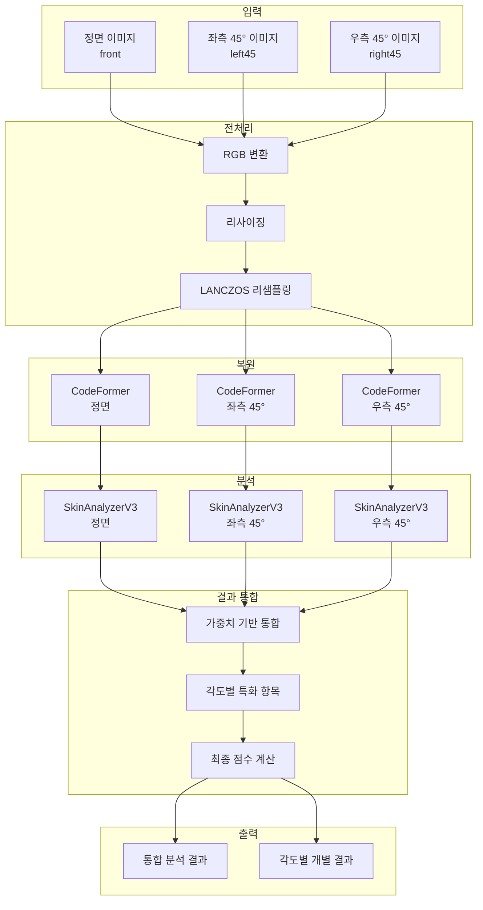
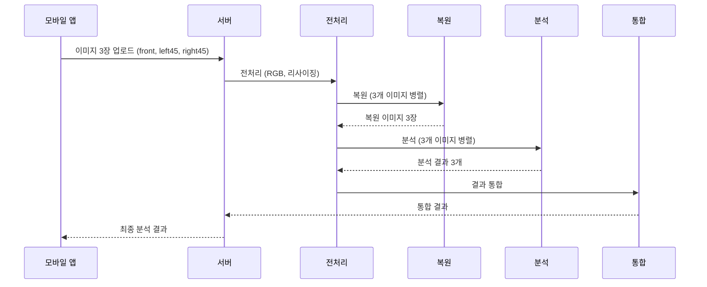

# 다중 이미지 분석 통합 설계 문서 (Multi-Image Analysis Integration Design)

> **프로젝트:** SkinLens v1.0
> **기능:** 다중 이미지 분석 통합
> **목표:** 분석 정확도 향상
> **생성일:** 2026-05-24

---

## 1. 개요

### 1.1 현재 상황

- **현재:** 정면(front) 이미지만 주로 분석
- **문제점:**
  - 좌측 45°, 우측 45° 이미지가 업로드되지만 활용되지 않음
  - 주름, 탄력, 모공 처짐 등 3D 특성 분석이 부족
  - 측면에서만 보이는 문제(눈가 주름, 볼 처짐 등) 정확도 낮음

### 1.2 개선 목표

- **목표:** 좌측 45°, 우측 45° 이미지도 분석하여 3D 입체 분석
- **기대 효과:**
  - 주름(눈가, 인중) 정확도 향상
  - 탄력(턱선 흐림, 볼 처짐) 정확도 향상
  - 모공 처짐 정확도 향상
  - 전체 종합 점수 신뢰도 향상

### 1.3 범위

- **포함:**
  - 좌측 45°, 우측 45° 이미지 분석 로직 추가
  - 다중 이미지 분석 결과 통합 알고리즘
  - API 변경 (입력/출력)
  - UI/UX 변경 (모바일 앱)

- **제외:**
  - 새로운 측정항목 추가 (기존 18개 항목 유지)
  - 복원 엔진 변경
  - LLM 소견 생성 로직 변경

---

## 2. 기술적 설계

### 2.1 아키텍처



### 2.2 분석 전략

#### 2.2.1 각도별 특화 항목

| 측정항목 | 정면 | 좌측 45° | 우측 45° | 통합 방식 |
|----------|------|----------|----------|----------|
| 기미·주근깨 | ✓ | △ | △ | 정면 70%, 측면 30% |
| 홍조 | ✓ | △ | △ | 정면 70%, 측면 30% |
| 여드름 | ✓ | ✓ | ✓ | 최대값 |
| 모공 크기 | ✓ | ✓ | ✓ | 평균값 |
| 모공 처짐 | △ | ✓ | ✓ | 측면 80%, 정면 20% |
| 눈가 주름 | △ | ✓ | ✓ | 측면 80%, 정면 20% |
| 인중 주름 | ✓ | △ | △ | 정면 70%, 측면 30% |
| 잔주름·깊은 주름 | ✓ | ✓ | ✓ | 평균값 |
| 피부결 거칠기 | ✓ | ✓ | ✓ | 평균값 |
| 피부 톤 | ✓ | △ | △ | 정면 70%, 측면 30% |
| 칙칙함 | ✓ | △ | △ | 정면 70%, 측면 30% |
| 톤 불균일 | ✓ | △ | △ | 정면 70%, 측면 30% |
| 턱선 흐림 | △ | ✓ | ✓ | 측면 80%, 정면 20% |
| 볼 처짐 | △ | ✓ | ✓ | 측면 80%, 정면 20% |
| 피부 타입 | ✓ | ✓ | ✓ | 최빈값 |

**범례:**
- ✓: 주요 분석
- △: 보조 분석

#### 2.2.2 통합 알고리즘

**가중치 기반 통합:**
```python
def integrate_scores(front_scores, left_scores, right_scores):
    """
    다중 이미지 분석 결과 통합
    
    Args:
        front_scores: 정면 이미지 분석 결과
        left_scores: 좌측 45° 이미지 분석 결과
        right_scores: 우측 45° 이미지 분석 결과
    
    Returns:
        통합된 분석 결과
    """
    integrated = {}
    
    # 각도별 특화 항목 가중치
    angle_weights = {
        'pore_sagging_score': {'front': 0.2, 'left': 0.4, 'right': 0.4},
        'eye_wrinkle_score': {'front': 0.2, 'left': 0.4, 'right': 0.4},
        'jawline_blur_score': {'front': 0.2, 'left': 0.4, 'right': 0.4},
        'cheek_sagging_score': {'front': 0.2, 'left': 0.4, 'right': 0.4},
        'melasma_score': {'front': 0.7, 'left': 0.15, 'right': 0.15},
        'redness_score': {'front': 0.7, 'left': 0.15, 'right': 0.15},
        'skin_tone_score': {'front': 0.7, 'left': 0.15, 'right': 0.15},
        'dullness_score': {'front': 0.7, 'left': 0.15, 'right': 0.15},
        'uneven_tone_score': {'front': 0.7, 'left': 0.15, 'right': 0.15},
        'nasolabial_wrinkle_score': {'front': 0.7, 'left': 0.15, 'right': 0.15},
    }
    
    # 기본값: 평균
    default_weights = {'front': 0.33, 'left': 0.33, 'right': 0.33}
    
    for metric in front_scores.keys():
        weights = angle_weights.get(metric, default_weights)
        integrated[metric] = (
            front_scores[metric] * weights['front'] +
            left_scores[metric] * weights['left'] +
            right_scores[metric] * weights['right']
        )
    
    return integrated
```

**최대값 기반 통합 (여드름 등):**
```python
def integrate_max_scores(front_scores, left_scores, right_scores):
    """
    최대값 기반 통합 (여드름 등)
    """
    integrated = {}
    max_metrics = ['acne_score', 'post_acne_pigment_score']
    
    for metric in front_scores.keys():
        if metric in max_metrics:
            integrated[metric] = max(
                front_scores[metric],
                left_scores[metric],
                right_scores[metric]
            )
        else:
            integrated[metric] = (
                front_scores[metric] +
                left_scores[metric] +
                right_scores[metric]
            ) / 3
    
    return integrated
```

### 2.3 데이터 흐름



---

## 3. 구현 단계

### 3.1 단계 1: 백엔드 분석 로직 수정

**파일:** `src/scoring/skin_scoring.py`

**변경 사항:**
1. `analyze_all()` 함수에 다중 이미지 분석 지원 추가
2. `integrate_multi_angle_scores()` 함수 추가
3. 각도별 가중치 설정 추가

**코드 예시:**
```python
def analyze_all_multi_angle(
    front_path: str,
    left_path: str,
    right_path: str,
    ref_stat: Optional[Dict[str, Any]] = None,
) -> Dict[str, Any]:
    """
    다중 이미지 분석 (정면, 좌측 45°, 우측 45°)
    """
    analyzer = SkinAnalyzerV3()
    
    # 각도별 분석 (병렬 실행)
    with ThreadPoolExecutor(max_workers=3) as executor:
        front_future = executor.submit(analyzer.analyze_all, front_path, ref_stat)
        left_future = executor.submit(analyzer.analyze_all, left_path, ref_stat)
        right_future = executor.submit(analyzer.analyze_all, right_path, ref_stat)
        
        front_result = front_future.result()
        left_result = left_future.result()
        right_result = right_future.result()
    
    # 결과 통합
    integrated_result = integrate_multi_angle_scores(
        front_result['measurements_v18'],
        left_result['measurements_v18'],
        right_result['measurements_v18']
    )
    
    return {
        'measurements_v18': integrated_result,
        'angle_results': {
            'front': front_result['measurements_v18'],
            'left': left_result['measurements_v18'],
            'right': right_result['measurements_v18']
        }
    }
```

### 3.2 단계 2: 파이프라인 수정

**파일:** `src/pipeline/pipeline_core.py`

**변경 사항:**
1. `run_analysis_pipeline_async()` 함수에 다중 이미지 처리 추가
2. 복원 병렬 처리 로직 추가
3. 분석 병렬 처리 로직 추가

### 3.3 단계 3: API 수정

**파일:** `src/server/api.py`

**변경 사항:**
1. `/v3/analysis/jobs` 엔드포인트 수정
2. 이미지 3장 필수 검증 강화
3. 각도별 결과 포함

**Request 변경:**
```
images[]: (file) 정면 이미지 (필수)
images[]: (file) 좌측 45° 이미지 (필수)
images[]: (file) 우측 45° 이미지 (필수)
angles[]: (string) front (필수)
angles[]: (string) left45 (필수)
angles[]: (string) right45 (필수)
```

**Response 변경:**
```json
{
  "analysis": {
    "internal_analysis": {
      "integrated": {
        "melasma_score": 65,
        "eye_wrinkle_score": 58,
        ...
      },
      "angle_results": {
        "front": {...},
        "left": {...},
        "right": {...}
      }
    }
  }
}
```

### 3.4 단계 4: UI/UX 수정

**모바일 앱 변경:**
1. 이미지 캡처 가이드 강화 (3장 필수)
2. 캡처 순서 가이드 (정면 → 좌측 → 우측)
3. 각도별 프리뷰 표시
4. 업로드 진행률 표시

---

## 4. API 변경 사항

### 4.1 Request 변경

**이전:**
```
images[]: (file) 정면 이미지 (선택)
angles[]: (string) front (선택)
```

**이후:**
```
images[]: (file) 정면 이미지 (필수)
images[]: (file) 좌측 45° 이미지 (필수)
images[]: (file) 우측 45° 이미지 (필수)
angles[]: (string) front (필수)
angles[]: (string) left45 (필수)
angles[]: (string) right45 (필수)
```

### 4.2 Response 변경

**이전:**
```json
{
  "analysis": {
    "internal_analysis": {
      "original": {...},
      "restored": {...}
    }
  }
}
```

**이후:**
```json
{
  "analysis": {
    "internal_analysis": {
      "integrated": {
        "melasma_score": 65,
        "eye_wrinkle_score": 58,
        ...
      },
      "angle_results": {
        "front": {
          "melasma_score": 63,
          "eye_wrinkle_score": 55,
          ...
        },
        "left": {
          "melasma_score": 66,
          "eye_wrinkle_score": 60,
          ...
        },
        "right": {
          "melasma_score": 66,
          "eye_wrinkle_score": 59,
          ...
        }
      }
    }
  }
}
```

### 4.3 호환성

- **하위 호환성:** 단일 이미지 업로드도 지원 (정면만)
- **상위 호환성:** 다중 이미지 업로드 시 통합 결과 제공

---

## 5. UI/UX 변경 사항

### 5.1 이미지 캡처 화면

**변경 사항:**
1. 캡처 가이드 강화 (3장 필수 표시)
2. 캡처 순서 가이드 (정면 → 좌측 → 우측)
3. 각도별 가이드라인 오버레이
4. 캡처 후 프리뷰 표시

**스크린샷 예시:**
```
┌─────────────────────────┐
│  피부 분석 이미지 캡처   │
├─────────────────────────┤
│  [1/3] 정면 이미지       │
│  ┌───────────────────┐  │
│  │                   │  │
│  │   [카메라 프리뷰]  │  │
│  │                   │  │
│  └───────────────────┘  │
│  얼굴이 정면을 향하도록 │
│  촬영해 주세요.         │
│                         │
│  [캡처]                 │
└─────────────────────────┘
```

### 5.2 업로드 진행률

**변경 사항:**
1. 각 이미지별 업로드 진행률 표시
2. 전체 진행률 표시
3. 각도별 처리 상태 표시

---

## 6. 테스트 계획

### 6.1 단위 테스트

**테스트 항목:**
1. `integrate_multi_angle_scores()` 함수 테스트
2. 가중치 계산 정확성 테스트
3. 최대값 통합 테스트
4. 평균값 통합 테스트

**테스트 케이스:**
```python
def test_integrate_scores():
    front = {'eye_wrinkle_score': 50, 'melasma_score': 60}
    left = {'eye_wrinkle_score': 70, 'melasma_score': 65}
    right = {'eye_wrinkle_score': 65, 'melasma_score': 63}
    
    result = integrate_multi_angle_scores(front, left, right)
    
    # 눈가 주름: 측면 80%, 정면 20%
    assert abs(result['eye_wrinkle_score'] - (50*0.2 + 70*0.4 + 65*0.4)) < 0.1
    
    # 기미: 정면 70%, 측면 30%
    assert abs(result['melasma_score'] - (60*0.7 + 65*0.15 + 63*0.15)) < 0.1
```

### 6.2 통합 테스트

**테스트 항목:**
1. 다중 이미지 업로드 테스트
2. 병렬 복원 테스트
3. 병렬 분석 테스트
4. 결과 통합 테스트

**테스트 시나리오:**
1. 정상 케이스: 3장 모두 업로드
2. 부분 케이스: 1장만 업로드 (하위 호환성)
3. 오류 케이스: 잘못된 각도

### 6.3 성능 테스트

**테스트 항목:**
1. 병렬 처리 성능 테스트
2. 메모리 사용량 테스트
3. 처리 시간 테스트

**목표:**
- 처리 시간: 단일 이미지 대비 1.5배 이내
- 메모리 사용량: 단일 이미지 대비 2배 이내

### 6.4 사용자 테스트

**테스트 항목:**
1. 캡처 가이드 이해도
2. 캡처 순서 준수율
3. 결과 만족도

---

## 7. 롤백 계획

### 7.1 롤백 조건

- 성능 저하 (처리 시간 2배 이상)
- 메모리 부족 (OOM 에러 빈발)
- 분석 정확도 저하 (A/B 테스트 결과)
- 사용자 불만족도 상승

### 7.2 롤백 절차

1. API 버전 롤백 (`/v3/analysis/jobs` → `/v2/analysis/jobs`)
2. 단일 이미지 모드로 전환
3. 통합 로직 비활성화
4. 모니터링 및 로그 분석

### 7.3 롤백 시간

- 목표: 30분 이내
- 절차:
  - 5분: 롤백 결정
  - 10분: 코드 롤백
  - 10분: 배포
  - 5분: 검증

---

## 8. 일정

### 8.1 개발 일정

| 단계 | 작업 | 기간 | 담당자 |
|------|------|------|--------|
| 1 | 백엔드 분석 로직 수정 | 3일 | 백엔드 개발자 |
| 2 | 파이프라인 수정 | 2일 | 백엔드 개발자 |
| 3 | API 수정 | 1일 | 백엔드 개발자 |
| 4 | UI/UX 수정 | 3일 | 모바일 개발자 |
| 5 | 단위 테스트 | 2일 | QA |
| 6 | 통합 테스트 | 2일 | QA |
| 7 | 성능 테스트 | 1일 | QA |
| 8 | 사용자 테스트 | 3일 | PM/UX |
| **합계** | | **17일** | |

### 8.2 배포 일정

- **개발 완료:** 2026-06-10
- **테스트 완료:** 2026-06-15
- **스테이징 배포:** 2026-06-17
- **프로덕션 배포:** 2026-06-20

---

## 9. 성공 지표

### 9.1 기술적 지표

- **분석 정확도:** 주름, 탄력, 모공 처짐 점수 정확도 10% 이상 향상
- **처리 시간:** 단일 이미지 대비 1.5배 이내
- **메모리 사용량:** 단일 이미지 대비 2배 이내

### 9.2 비즈니스 지표

- **사용자 만족도:** 3장 캡처 만족도 80% 이상
- **분석 완료율:** 3장 업로드 완료율 90% 이상
- **재분석율:** 재분석 요청율 5% 미만

---

## 10. 참고 문서

- [API_GUIDE.md](../api/API_GUIDE.md) - API 문서
- [SKIN_SCORING_GUIDE.md](../guides/SKIN_SCORING_GUIDE.md) - 스코어링 가이드
- [JSON_IO_FLOW.md](../guides/JSON_IO_FLOW.md) - 데이터 처리 흐름

---

*생성일: 2026-05-24*
