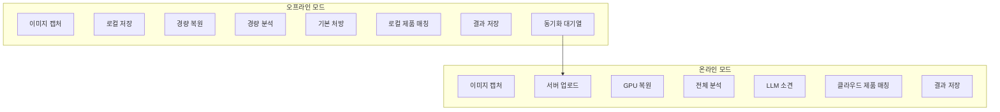

# 제품 리뷰 통합 및 오프라인 모드 설계 문서

> **프로젝트:** SkinLens v1.0
> **작성일:** 2026-05-24
> **버전:** 1.0

이 문서는 제품 리뷰 통합을 통한 추천 정확도 향상과 오프라인 모드 구현을 위한 기술 설계를 설명합니다.

---

## 1. 제품 리뷰 통합 (Product Review Integration)

### 1.1 개요

현재 제품 추천은 설문(survey)과 측정 점수 기반으로만 수행됩니다. 실제 사용자 리뷰를 통합하여 추천 정확도를 향상시킵니다.

### 1.2 현재 제품 매칭 로직

**기존 매칭 점수 계산:**
- 고민사항 매칭: +0.5 점 (설문 skin_concerns 기반)
- 피부 타입 매칭: +0.3 점 (설문 skin_types 기반)
- 측정 점수 기반 매칭: +0.2 점 (점수 < 60인 항목)
- match_score = (고민사항 점수 + 피부 타입 점수 + 점수 기반 점수) / 최대 가능 점수

### 1.3 제안된 리뷰 통합 로직

**새로운 매칭 점수 계산:**
- 고민사항 매칭: +0.4 점 (설문 skin_concerns 기반)
- 피부 타입 매칭: +0.25 점 (설문 skin_types 기반)
- 측정 점수 기반 매칭: +0.15 점 (점수 < 60인 항목)
- **리뷰 점수 매칭: +0.2 점 (사용자 리뷰 평점 기반)**
- match_score = (고민사항 점수 + 피부 타입 점수 + 점수 기반 점수 + 리뷰 점수) / 최대 가능 점수

### 1.4 리뷰 데이터 구조

**리뷰 테이블 (product_reviews):**
```sql
CREATE TABLE product_reviews (
    id INTEGER PRIMARY KEY AUTOINCREMENT,
    product_id TEXT NOT NULL,
    customer_id TEXT NOT NULL,
    rating REAL NOT NULL,  -- 1.0 ~ 5.0
    review_text TEXT,
    skin_concerns TEXT,  -- JSON array
    skin_types TEXT,  -- JSON array
    measured_scores TEXT,  -- JSON object (측정 점수)
    created_at TEXT NOT NULL,
    updated_at TEXT NOT NULL,
    FOREIGN KEY (product_id) REFERENCES products(id),
    FOREIGN KEY (customer_id) REFERENCES customers(id)
);
```

**리뷰 집계 테이블 (product_review_aggregates):**
```sql
CREATE TABLE product_review_aggregates (
    product_id TEXT PRIMARY KEY,
    avg_rating REAL NOT NULL,
    total_reviews INTEGER NOT NULL,
    concern_distribution TEXT,  -- JSON object (고민사항별 리뷰 수)
    type_distribution TEXT,  -- JSON object (피부 타입별 리뷰 수)
    score_distribution TEXT,  -- JSON object (점수 구간별 리뷰 수)
    updated_at TEXT NOT NULL,
    FOREIGN KEY (product_id) REFERENCES products(id)
);
```

### 1.5 리뷰 기반 추천 알고리즘

**단계 1: 리뷰 필터링**
- 사용자의 피부 고민사항과 유사한 리뷰 필터링
- 사용자의 피부 타입과 유사한 리뷰 필터링
- 사용자의 측정 점수와 유사한 리뷰 필터링

**단계 2: 리뷰 점수 계산**
```python
def calculate_review_score(product_id, user_concerns, user_types, user_scores):
    # 제품의 전체 평균 평점
    avg_rating = get_avg_rating(product_id)
    
    # 유사한 피부 타입 사용자들의 평점
    similar_type_rating = get_rating_by_skin_type(product_id, user_types)
    
    # 유사한 고민사항 사용자들의 평점
    similar_concern_rating = get_rating_by_concern(product_id, user_concerns)
    
    # 유사한 측정 점수 사용자들의 평점
    similar_score_rating = get_rating_by_score(product_id, user_scores)
    
    # 가중 평균
    review_score = (
        avg_rating * 0.3 +
        similar_type_rating * 0.3 +
        similar_concern_rating * 0.25 +
        similar_score_rating * 0.15
    )
    
    # 정규화 (0 ~ 1)
    normalized_score = (review_score - 1.0) / 4.0
    
    return normalized_score
```

**단계 3: 추천 점수 계산**
```python
def calculate_recommendation_score(product, user_data):
    concern_score = match_concerns(product.concerns, user_data.concerns) * 0.4
    type_score = match_skin_types(product.types, user_data.types) * 0.25
    score_score = match_measured_scores(product.scores, user_data.scores) * 0.15
    review_score = calculate_review_score(product.id, user_data) * 0.2
    
    total_score = concern_score + type_score + score_score + review_score
    
    return total_score
```

### 1.6 API 변경 사항

**리뷰 제출 엔드포인트:**
```
POST /v1/products/{product_id}/reviews
```

**Request:**
```json
{
  "rating": 4.5,
  "review_text": "피부가 진정되고 좋습니다.",
  "skin_concerns": ["acne", "redness"],
  "skin_types": ["sensitive"],
  "measured_scores": {
    "acne_score": 55,
    "redness_score": 60
  }
}
```

**리뷰 조회 엔드포인트:**
```
GET /v1/products/{product_id}/reviews?limit=10&offset=0
```

### 1.7 구현 단계

1. **데이터베이스 스키마 추가**
   - product_reviews 테이블 생성
   - product_review_aggregates 테이블 생성

2. **리뷰 관리 모듈 구현**
   - ReviewManager 클래스 구현
   - 리뷰 제출/조회/집계 기능

3. **추천 알고리즘 수정**
   - ProductRepository에 리뷰 점수 계산 추가
   - 매칭 점수 가중치 조정

4. **API 엔드포인트 추가**
   - 리뷰 제출/조회 엔드포인트

5. **테스트**
   - 리뷰 기반 추천 정확도 테스트
   - 단위 테스트 작성

---

## 2. 오프라인 모드 (Offline Mode)

### 2.1 개요

네트워크 연결이 없는 환경에서도 기본적인 피부 분석 기능을 사용할 수 있도록 오프라인 모드를 구현합니다.

### 2.2 오프라인 모드 범위

**지원 기능:**
- 이미지 캡처 및 저장
- 로컬 피부 분석 (경량 모델)
- 기본적인 처방 계산
- 로컬 결과 저장

**미지원 기능:**
- LLM 소견 생성 (Gemini API 필요)
- 클라우드 이미지 복원 (GPU 필요)
- 실시간 제품 매칭 (Supabase 필요)
- 서버 동기화

### 2.3 아키텍처



### 2.4 경량 모델 선택

**복원 모델:**
- 온라인: CodeFormer/RestoreFormer++ (GPU)
- 오프라인: 간단한 노이즈 제거 필터 (CPU)

**분석 모델:**
- 온라인: MediaPipe Face Mesh + 전체 분석기
- 오프라인: Haar Cascade + 핵심 분석기 (기미, 홍조, 여드름)

### 2.5 로컬 데이터베이스

**SQLite 스키마:**
```sql
-- 오프라인 분석 결과
CREATE TABLE offline_analyses (
    id INTEGER PRIMARY KEY AUTOINCREMENT,
    image_path TEXT NOT NULL,
    analysis_result TEXT NOT NULL,  -- JSON
    created_at TEXT NOT NULL,
    synced INTEGER DEFAULT 0  -- 0: 미동기화, 1: 동기화 완료
);

-- 오프라인 제품 캐시
CREATE TABLE offline_products (
    id TEXT PRIMARY KEY,
    product_data TEXT NOT NULL,  -- JSON
    cached_at TEXT NOT NULL
);

-- 동기화 대기열
CREATE TABLE sync_queue (
    id INTEGER PRIMARY KEY AUTOINCREMENT,
    operation TEXT NOT NULL,  -- 'upload_analysis', 'download_products'
    data TEXT NOT NULL,  -- JSON
    created_at TEXT NOT NULL,
    retry_count INTEGER DEFAULT 0
);
```

### 2.6 동기화 전략

**업로드 동기화:**
1. 네트워크 연결 감지
2. 오프라인 분석 결과 서버 업로드
3. 서버에서 전체 분석 수행
4. 전체 결과 로컬로 다운로드
5. 로컬 결과 업데이트

**다운로드 동기화:**
1. 네트워크 연결 감지
2. 최신 제품 목록 다운로드
3. 로컬 제품 캐시 업데이트

### 2.7 클라이언트 구현 (Flutter)

**네트워크 상태 감지:**
```dart
class NetworkMonitor {
  Stream<ConnectivityResult> get onConnectivityChanged =>
      Connectivity().onConnectivityChanged;
  
  bool get isOnline => _currentResult != ConnectivityResult.none;
}
```

**오프라인 분석 매니저:**
```dart
class OfflineAnalysisManager {
  Future<AnalysisResult> analyzeOffline(String imagePath) async {
    // 1. 경량 복원
    final restoredImage = await _lightweightRestore(imagePath);
    
    // 2. 경량 분석
    final analysis = await _lightweightAnalyze(restoredImage);
    
    // 3. 기본 처방
    final prescription = _calculateBasicPrescription(analysis);
    
    // 4. 로컬 저장
    await _saveOfflineAnalysis(analysis);
    
    return analysis;
  }
  
  Future<void> syncWhenOnline() async {
    final offlineAnalyses = await _getOfflineAnalyses();
    
    for (final analysis in offlineAnalyses) {
      try {
        await _uploadToServer(analysis);
        await _markAsSynced(analysis.id);
      } catch (e) {
        await _addToSyncQueue(analysis);
      }
    }
  }
}
```

### 2.8 UI/UX 고려사항

**오프라인 상태 표시:**
- 네트워크 상태 인디케이터
- 오프라인 모드 배지
- 동기화 진행률 표시

**오프라인 모드 안내:**
- "오프라인 모드: 기본 분석만 수행됩니다"
- "네트워크 연결 시 전체 분석으로 업그레이드"
- "동기화 대기 중: N개 항목"

**사용자 제어:**
- 오프라인 모드 강제 전환 버튼
- 수동 동기화 버튼
- 오프라인 데이터 삭제 옵션

### 2.9 구현 단계

1. **네트워크 모니터링**
   - connectivity 패키지 통합
   - 네트워크 상태 감지 로직

2. **경량 분석 모듈**
   - 경량 복원 필터 구현
   - 경량 분석기 구현

3. **로컬 데이터베이스**
   - SQLite 스키마 구현
   - 로컬 저장/조회 기능

4. **동기화 매니저**
   - 업로드/다운로드 동기화
   - 재시도 로직
   - 충돌 해결

5. **UI/UX 구현**
   - 네트워크 상태 표시
   - 오프라인 모드 안내
   - 동기화 진행률

6. **테스트**
   - 오프라인/온라인 전환 테스트
   - 동기화 테스트
   - 데이터 일관성 테스트

---

## 3. 일정 추정

### 제품 리뷰 통합
- 데이터베이스 스키마: 0.5일
- 리뷰 관리 모듈: 1일
- 추천 알고리즘 수정: 1일
- API 엔드포인트: 0.5일
- 테스트: 1일
- **총계: 4일**

### 오프라인 모드
- 네트워크 모니터링: 0.5일
- 경량 분석 모듈: 2일
- 로컬 데이터베이스: 1일
- 동기화 매니저: 1.5일
- UI/UX 구현: 1.5일
- 테스트: 1.5일
- **총계: 8일**

---

## 4. 우선순위 및 순서

**Phase 1 (높은 우선순위):**
1. 제품 리뷰 통합 (추천 정확도 향상)

**Phase 2 (중간 우선순위):**
2. 오프라인 모드 (사용자 경험 개선)

---

## 5. 성공 지표

### 제품 리뷰 통합
- 추천 정확도: +15% 향상 (A/B 테스트)
- 사용자 만족도: +10% 향상 (설문)
- 리뷰 제출률: 30% 이상

### 오프라인 모드
- 오프라인 사용 가능 기능: 100%
- 동기화 성공률: 95% 이상
- 오프라인 분석 시간: 30초 이내
- 사용자 경험 점수: +8% 향상

---

## 6. 롤백 계획

### 제품 리뷰 통합
- 기존 매칭 로직으로 롤백 (가중치 복원)
- 리뷰 테이블 유지 (데이터 보존)

### 오프라인 모드
- 오프라인 모드 비활성화 플래그
- 온라인 모드만 강제
- 로컬 데이터 보존

---

*작성일: 2026-05-24*
