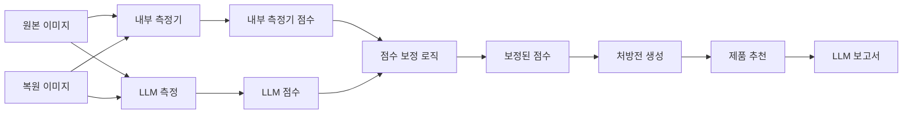
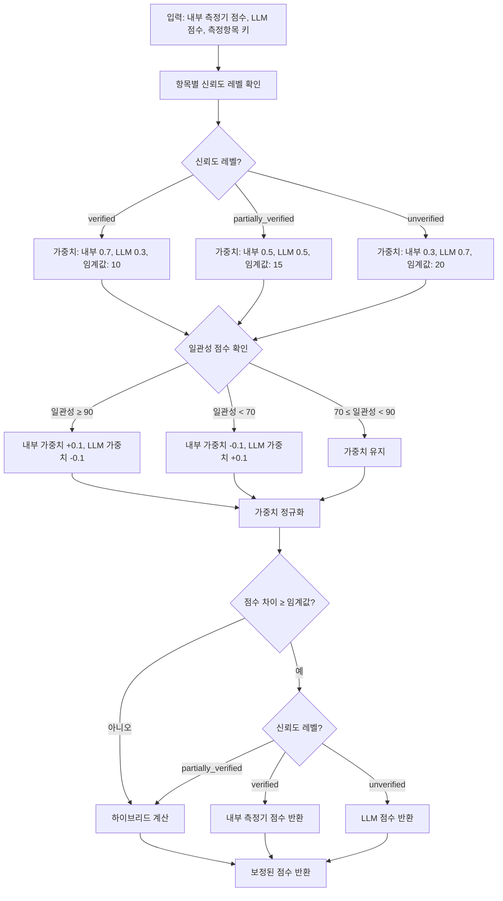
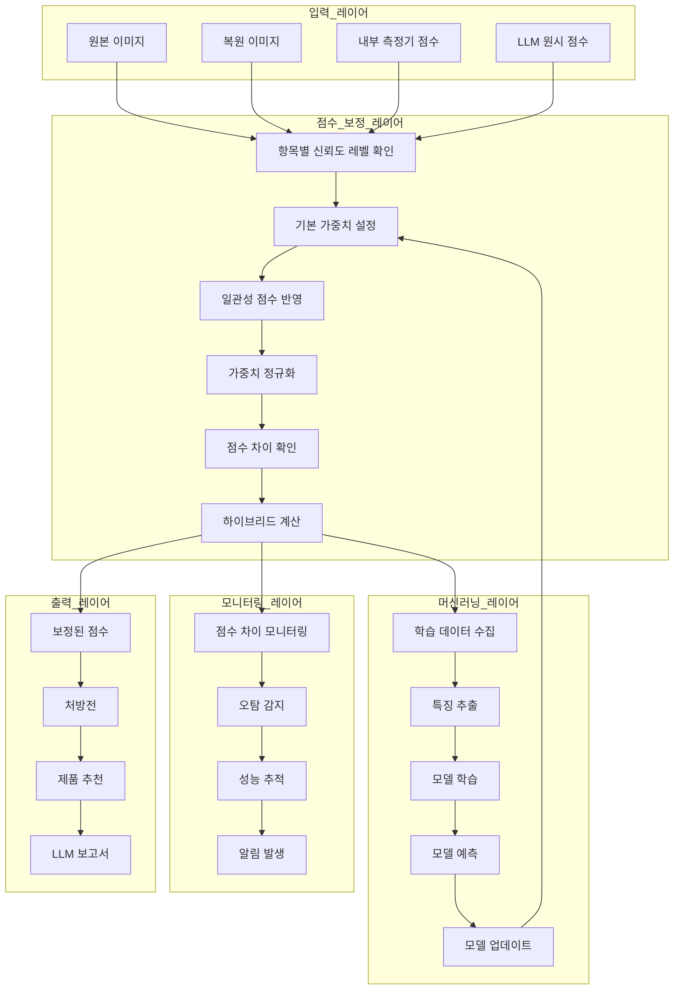
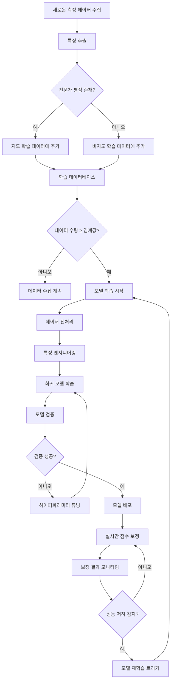
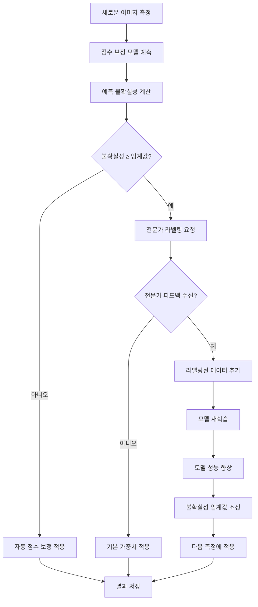

# 점수 보정 로직 설계 (Score Correction Design)

> **문서 버전:** 1.0.0  
> **대상 프로젝트 버전:** 1.0.0  
> **마지막 업데이트:** 2026-05-31  
> **상태:** 활성

---

## 1. 현재 시스템 개요

### 1.1 측정 방식

#### 1.1.1 내부 측정기 (Analyzer)

**기술 스택:**
- OpenCV 기반 전통적인 컴퓨터 비전 알고리즘
- Haar Cascade, HOG, threshold 기반 검출
- 색상 공간 분석 (HSV, LAB)
- 텍스처 분석 (GLCM, LBP)

**측정 항목 (18개) - 카테고리 9개:**
1. **색소 침착 (pigmentation)**: 기미(melasma_score), 주근깨(freckle_score), 트러블 후 색소(post_acne_pigment_score)
2. **혈관/홍조 (redness)**: 홍조(redness_score), 염증 후 홍반(post_inflammatory_erythema_score)
3. **트러블 (trouble)**: 트러블(acne_score)
4. **모공 (pore)**: 모공 크기(pore_size_score), 모공 처짐(pore_sagging_score)
5. **주름 (wrinkle)**: 눈가 주름(eye_wrinkle_score), 팔자 주름(nasolabial_wrinkle_score), 미세/깊은 주름(fine_deep_wrinkle_score)
6. **피부결 (roughness)**: 피부결(roughness_score)
7. **톤 (tone)**: 피부 톤(skin_tone_score), 칙칙함(dullness_score), 불균일 톤(uneven_tone_score)
8. **탄력/처짐 (elasticity)**: 턱선 흐림(jawline_blur_score), 볼 처짐(cheek_sagging_score)
9. **피부 타입 (skin_type)**: 피부 타입(skin_type_score)

**장점:**
- 일관성: 동일 이미지에 대해 항상 동일한 점수 제공
- 속도: 실시간 처리 가능 (0.1-0.5초)
- 비용: 추가 API 비용 없음
- 안정성: 외부 서비스 의존성 없음

**단점:**
- 검증: 18개 항목 중 일부만 검증 완료
- 정확도: 복잡한 패턴 인식에 한계
- 일반화: 다양한 조명/피부 타입에 대한 일반화 부족

#### 1.1.2 LLM 측정 (Vision Language Model)

**기술 스택:**
- GPT-4V, Claude 3.5 Sonnet 등 멀티모달 LLM
- 이미지 분석 + 텍스트 생성
- 프롬프트 엔지니어링 기반 점수 추출

**측정 방식:**
1. 이미지를 LLM에 전송
2. 프롬프트를 통해 각 측정항목에 대한 점수 요청
3. LLM이 이미지를 분석하고 0-100 점수로 응답
4. 응답에서 점수를 파싱하여 저장

**장점:**
- 설득력: 개별 항목에 대해 논리적인 점수 제공
- 일반화: 다양한 조명/피부 타입에 대해 강함
- 해석: 점수에 대한 설명 제공 가능
- 유연성: 새로운 측정항목 추가 용이

**단점:**
- 일관성: 동일 이미지라도 점수 변동 가능
- 오탐: 간혹 과도한 점수 부여 (False Positive)
- 비용: API 호출 비용 발생
- 속도: 응답 시간 10-30초

### 1.2 현재 점수 보정 로직

#### 1.2.1 기본 하이브리드 모드

**설정 (config.json):**
```json
{
  "score_correction": {
    "enabled": true,
    "mode": "hybrid",
    "analyzer_weight": 0.5,
    "llm_weight": 0.5,
    "dynamic_weighting": {
      "enabled": true,
      "score_difference_threshold": 15.0
    }
  }
}
```

**알고리즘:**
```python
def _apply_score_correction(
    analyzer_score: float,
    llm_score: float,
    mode: str = "hybrid",
    analyzer_weight: float = 0.5,
    llm_weight: float = 0.5,
    dynamic_weighting: bool = False,
    score_difference_threshold: float = 15.0
) -> float:
    if mode == "analyzer":
        return analyzer_score
    elif mode == "llm":
        return llm_score
    elif mode == "hybrid":
        # 동적 가중치 조정
        if dynamic_weighting:
            score_diff = abs(analyzer_score - llm_score)
            if score_diff >= score_difference_threshold:
                return analyzer_score  # 점수 차이 크면 내부 측정기 우선

        # 가중치 합계 정규화
        total_weight = analyzer_weight + llm_weight
        analyzer_weight /= total_weight
        llm_weight /= total_weight

        # 하이브리드 계산
        corrected_score = analyzer_score * analyzer_weight + llm_score * llm_weight
        return corrected_score
```

**특징:**
- 모든 항목에 동일한 가중치 적용 (50:50)
- 점수 차이 15점 이상이면 내부 측정기 점수 사용
- 항목별 신뢰도 차이 반영 안 함

#### 1.2.2 오탐 방지 (Anomaly Detection)

**원본-복원 점수 차이 비교:**
```python
# 내부 측정기: 원본 점수 - 복원 점수
analyzer_diff = analyzer_orig_score - analyzer_restored_score

# LLM: 원본 점수 - 복원 점수
llm_diff = llm_orig_score - llm_restored_score

# 차이 비교
if analyzer_diff - llm_diff >= diff_comparison_threshold:
    # LLM이 원본-복원 차이를 제대로 반영하지 못함 → 오탐 판단
    return analyzer_score
```

**목적:** LLM이 복원 이미지 기준으로 원본 점수를 과대평가하는 경우 감지

### 1.3 현재 시스템 아키텍처



### 1.4 현재 시스템의 한계

1. **일관성 없는 가중치**: 모든 항목에 동일한 가중치 적용
2. **신뢰도 무시**: 검증된 항목과 미검증 항목 구분 없음
3. **정적 파라미터**: 데이터 누적에 따른 자동 개선 없음
4. **수동 튜닝**: 가중치/임계값 수동 조정 필요
5. **오탐 불완전**: 오탐 감지 로직이 제한적

## 2. 문제 정의

### 2.1 현재 상황
- **내부 측정기 장점**: 항상 동일한 점수를 제공 (일관성 우수)
- **내부 측정기 단점**: 18개 모든 항목에 대한 검증이 완료되지 않음
- **LLM 측정 장점**: 개별 항목에 대해 설득력 있는 점수를 대체로 제공
- **LLM 측정 단점**: 간혹 오탐(False Positive) 가능성 존재

### 2.2 기존 로직의 한계
- 모든 항목에 동일한 가중치 적용 (analyzer 50%, LLM 50%)
- 항목별 신뢰도 차이를 반영하지 않음
- 검증된 항목과 미검증 항목의 구분 없이 동일 처리

## 3. 설계 목표

1. **항목별 신뢰도 기반 가중치 차등 적용**
   - 검증된 항목: 내부 측정기 가중치 높임
   - 미검증 항목: LLM 가중치 높임

2. **점수 차이 임계값 항목별 조정**
   - 검증된 항목: 낮은 임계값으로 내부 측정기 우선
   - 미검증 항목: 높은 임계값으로 LLM 우선

3. **일관성 점수 개념 도입**
   - 내부 측정기의 일관성을 정량화
   - 일관성 점수를 가중치에 반영

4. **오탐 방지 강화**
   - 원본-복원 점수 차이 비교 기능 유지
   - 항목별 오탐 패턴 학습

## 4. 새로운 로직 설계

### 4.1 항목별 신뢰도 레벨 분류

```json
"metric_trust_levels": {
  "verified": [
    "melasma_score",           // 기미 - 검증 완료
    "freckle_score",           // 주근깨 - 검증 완료
    "redness_score",           // 홍조 - 검증 완료
    "acne_score",              // 여드름 - 검증 완료
    "post_inflammatory_erythema_score",  // 염증 후 홍반 - 검증 완료
    "post_acne_pigment_score"  // 여드름 후 색소 - 검증 완료
  ],
  "partially_verified": [
    "pore_size_score",         // 모공 크기 - 부분 검증
    "pore_sagging_score",      // 모공 처짐 - 부분 검증
    "eye_wrinkle_score",       // 눈가 주름 - 부분 검증
    "nasolabial_wrinkle_score", // 팔자 주름 - 부분 검증
    "fine_deep_wrinkle_score"  // 미세/깊은 주름 - 부분 검증
  ],
  "unverified": [
    "roughness_score",         // 피부결 - 미검증
    "skin_tone_score",         // 피부 톤 - 미검증
    "dullness_score",          // 칙칙함 - 미검증
    "uneven_tone_score",       // 불균일 톤 - 미검증
    "jawline_blur_score",      // 턱선 흐림 - 미검증
    "cheek_sagging_score",     // 볼 처짐 - 미검증
    "skin_type_score"          // 피부 타입 - 미검증
  ]
}
```

### 4.2 신뢰도별 기본 가중치

| 신뢰도 레벨 | 내부 측정기 가중치 | LLM 가중치 | 설명 |
|------------|------------------|-----------|------|
| verified | 0.7 | 0.3 | 검증된 항목은 내부 측정기 신뢰 |
| partially_verified | 0.5 | 0.5 | 부분 검증은 균형 |
| unverified | 0.3 | 0.7 | 미검증 항목은 LLM 의견 존중 |

### 4.3 점수 차이 임계값 항목별 조정

| 신뢰도 레벨 | 임계값 | 차이 발생 시 동작 |
|------------|-------|----------------|
| verified | 10점 | 내부 측정기 점수 사용 |
| partially_verified | 15점 | 기본 가중치 적용 |
| unverified | 20점 | LLM 점수 사용 |

### 4.4 일관성 점수 개념

**정의**: 동일 이미지를 여러 번 측정했을 때 점수의 표준편차

**계산 방법**:
```
일관성 점수 = 100 - (표준편차 × 가중치)
```

**적용 방식**:
- 일관성 점수가 90점 이상: 가중치 +0.1
- 일관성 점수가 70점 미만: 가중치 -0.1

### 4.5 전체 알고리즘

```python
def apply_advanced_score_correction(
    analyzer_score: float,
    llm_score: float,
    metric_key: str,
    consistency_score: Optional[float] = None
) -> float:
    # 1. 항목별 신뢰도 레벨 확인
    trust_level = get_metric_trust_level(metric_key)

    # 2. 기본 가중치 설정
    if trust_level == "verified":
        analyzer_weight = 0.7
        llm_weight = 0.3
        threshold = 10.0
    elif trust_level == "partially_verified":
        analyzer_weight = 0.5
        llm_weight = 0.5
        threshold = 15.0
    else:  # unverified
        analyzer_weight = 0.3
        llm_weight = 0.7
        threshold = 20.0

    # 3. 일관성 점수 반영
    if consistency_score is not None:
        if consistency_score >= 90:
            analyzer_weight += 0.1
            llm_weight -= 0.1
        elif consistency_score < 70:
            analyzer_weight -= 0.1
            llm_weight += 0.1

    # 4. 가중치 정규화
    total_weight = analyzer_weight + llm_weight
    analyzer_weight /= total_weight
    llm_weight /= total_weight

    # 5. 점수 차이 확인
    score_diff = abs(analyzer_score - llm_score)
    if score_diff >= threshold:
        if trust_level == "verified":
            return analyzer_score  # 검증된 항목은 내부 측정기 우선
        elif trust_level == "unverified":
            return llm_score  # 미검증 항목은 LLM 우선
        else:
            # 부분 검증은 기본 가중치 적용
            pass

    # 6. 하이브리드 계산
    corrected_score = analyzer_score * analyzer_weight + llm_score * llm_weight
    return corrected_score
```

### 4.6 점수 보정 로직 흐름도



### 4.7 시스템 전체 아키텍처



## 5. config.json 설정 구조

```json
{
  "llm": {
    "score_correction": {
      "enabled": true,
      "mode": "advanced",  // 새로운 모드
      "metric_trust_levels": {
        "verified": [
          "melasma_score",
          "freckle_score",
          "redness_score",
          "acne_score",
          "post_inflammatory_erythema_score",
          "post_acne_pigment_score"
        ],
        "partially_verified": [
          "pore_size_score",
          "pore_sagging_score",
          "eye_wrinkle_score",
          "nasolabial_wrinkle_score",
          "fine_deep_wrinkle_score"
        ],
        "unverified": [
          "roughness_score",
          "skin_tone_score",
          "dullness_score",
          "uneven_tone_score",
          "jawline_blur_score",
          "cheek_sagging_score",
          "skin_type_score"
        ]
      },
      "trust_level_weights": {
        "verified": {
          "analyzer_weight": 0.7,
          "llm_weight": 0.3,
          "difference_threshold": 10.0
        },
        "partially_verified": {
          "analyzer_weight": 0.5,
          "llm_weight": 0.5,
          "difference_threshold": 15.0
        },
        "unverified": {
          "analyzer_weight": 0.3,
          "llm_weight": 0.7,
          "difference_threshold": 20.0
        }
      },
      "consistency_scoring": {
        "enabled": true,
        "high_consistency_threshold": 90.0,
        "low_consistency_threshold": 70.0,
        "weight_adjustment": 0.1
      },
      "anomaly_detection": {
        "enabled": true,
        "diff_comparison_threshold": 15.0
      },
      "monitoring": {
        "warning_threshold": 20.0,
        "critical_threshold": 40.0
      }
    }
  }
}
```

## 6. 구현 계획

### 6.1 Phase 1: 기본 구조 구현
1. `metric_trust_levels` 설정 추가
2. 신뢰도 레벨별 가중치 로직 구현
3. 점수 차이 임계값 항목별 조정 구현

### 6.2 Phase 2: 일관성 점수 시스템
1. 일관성 점수 계산 로직 구현
2. 일관성 점수 저장소 구현 (DB)
3. 가중치 조정 로직 연동

### 6.3 Phase 3: 테스트 및 검증
1. 검증된 항목 테스트
2. 미검증 항목 테스트
3. 전체 시스템 통합 테스트

### 6.4 Phase 4: 모니터링 및 개선
1. 점수 차이 분석 대시보드
2. 항목별 신뢰도 레벨 동적 조정
3. 오탐 패턴 학습

## 7. 기존 호환성

- 기존 `hybrid` 모드는 그대로 유지
- 새로운 `advanced` 모드 추가
- 기본값은 기존 `hybrid` 모드로 설정 (안전성 확보)

## 8. 머신러닝 기반 학습 시스템

### 8.1 학습 가능한 접근 방식

#### 8.1.1 내부 측정기 딥러닝 모델화

**현재**: 전통적인 CV 알고리즘 (Haar cascade, threshold 기반 등)
**개선**: CNN 기반 딥러닝 모델로 교체

**장점**:
- 데이터 누적 시 재학습으로 정확도 지속 향상
- 복잡한 패턴 학습 가능
- 전이학습(Transfer Learning) 활용 가능

**단점**:
- 학습 데이터 라벨링 필요 (전문가 평점)
- 초기 모델 개발 비용
- GPU 리소스 필요

#### 8.1.2 LLM 점수 패턴 학습 및 프롬프트 최적화

**아이디어**: 과거 LLM 응답과 내부 측정기 점수의 관계를 학습

**구현**:
```python
# 점수 보정 모델 학습
- 입력: [내부 측정기 점수, 이미지 특징, LLM 원시 점수]
- 출력: 최적 보정 점수
- 학습: 과거 데이터에서 실제 정답(전문가 평점)과 비교
```

**장점**:
- 기존 LLM 활용, 모델 교체 불필요
- 빠른 구현 가능
- 점수 보정 로직 자동 최적화

**단점**:
- 전문가 라벨링 데이터 필요
- LLM API 변경 시 재학습 필요

#### 8.1.3 앙상블 모델

**아이디어**: 여러 측정 방식의 결과를 결합

**구현**:
```python
# 앙상블 가중치 학습
- 모델 1: 내부 측정기
- 모델 2: LLM
- 모델 3: 딥러닝 모델 (데이터 누적 시 학습)
- 메타 모델: 각 모델의 가중치를 학습하여 최적 조합 도출
```

**장점**:
- 단일 모델의 약점 보완
- 안정성 향상
- 점진적 개선 가능

**단점**:
- 시스템 복잡도 증가
- 연산 비용 증가

#### 8.1.4 피드백 루프 시스템

**아이디어**: 사용자/전문가 피드백을 학습 데이터로 활용

**구현**:
```python
# 능동 학습 (Active Learning)
1. 시스템이 불확실한 케이스 식별
2. 전문가에게 라벨링 요청
3. 라벨링된 데이터로 모델 재학습
4. 반복하여 정확도 향상
```

**장점**:
- 효율적인 데이터 수집
- 지속적 개선
- 실제 사용 시나리오 반영

**단점**:
- 전문가 참여 필요
- 초기 데이터 수집 시간

### 8.2 실현 가능성 평가

| 접근 방식 | 단기 구현 가능성 | 장기 효과 | 데이터 요구사항 | 추천 단계 |
|----------|----------------|----------|----------------|----------|
| 딥러닝 모델화 | 낮음 (6개월+) | 높음 | 높음 (라벨링 필요) | 장기 |
| LLM 패턴 학습 | 높음 (1-2개월) | 중간 | 중간 (과거 데이터 활용) | 단기 |
| 앙상블 모델 | 중간 (3-4개월) | 높음 | 중간 | 중기 |
| 피드백 루프 | 중간 (2-3개월) | 높음 | 중간 (전문가 참여) | 중기 |

### 8.3 추진 전략

**단기 (1-2개월)**: LLM 점수 패턴 학습
- 과거 데이터에서 내부 측정기와 LLM 점수의 관계 학습
- 회귀 모델로 최적 보정 가중치 도출
- 빠르게 효과 확인 가능

**중기 (3-6개월)**: 피드백 루프 시스템
- 전문가 피드백 수집 시스템 구축
- 능동 학습으로 효율적 데이터 수집
- 지속적 모델 개선

**장기 (6개월+)**: 딥러닝 모델 도입
- 충분한 라벨링 데이터 확보 후
- CNN 기반 내부 측정기 개발
- 전이학습으로 학습 시간 단축

### 8.4 학습 시스템 아키텍처

```python
class ScoreCorrectionLearner:
    """점수 보정 모델 학습 시스템"""

    def __init__(self):
        self.model = None  # 회귀 모델 (XGBoost, Random Forest 등)
        self.feature_extractor = None
        self.training_data = []

    def collect_training_data(self, analyzer_score, llm_score,
                            image_features, expert_score=None):
        """학습 데이터 수집"""
        # 전문가 평점이 있는 경우 지도 학습
        # 없는 경우 비지도 학습 또는 강화 학습
        pass

    def train_model(self):
        """모델 학습"""
        # 과거 데이터로 회귀 모델 학습
        # 입력: [analyzer_score, llm_score, image_features]
        # 출력: optimal_corrected_score
        pass

    def predict_correction(self, analyzer_score, llm_score,
                         image_features):
        """최적 보정 점수 예측"""
        # 학습된 모델로 최적 가중치 예측
        pass

    def update_model(self, new_data):
        """새로운 데이터로 모델 업데이트"""
        # 온라인 학습 또는 주기적 재학습
        pass
```

### 8.4.1 학습 시스템 흐름도



### 8.4.2 능동 학습(Active Learning) 흐름도



### 8.5 학습 시스템 config.json 설정

```json
{
  "llm": {
    "score_correction": {
      "machine_learning": {
        "enabled": false,
        "mode": "llm_pattern_learning",
        "model_type": "xgboost",
        "training": {
          "min_samples": 100,
          "retrain_interval_days": 7,
          "validation_split": 0.2
        },
        "features": {
          "use_image_features": true,
          "use_score_history": true,
          "use_metric_correlation": true
        },
        "active_learning": {
          "enabled": false,
          "uncertainty_threshold": 0.3,
          "expert_feedback_required": true
        }
      }
    }
  }
}
```

## 9. 예상 효과

### 9.1 단기 효과 (Phase 1-2 완료 시)
1. **검증된 항목**: 내부 측정기의 일관성 활용, 안정적인 점수 제공
2. **미검증 항목**: LLM의 설득력 있는 점수 활용, 정확도 향상
3. **전체 시스템**: 항목별 특성에 맞는 최적의 점수 조합

### 9.2 중기 효과 (Phase 3-4 완료 시)
1. **일관성 기반 가중치**: 내부 측정기의 신뢰도 정량화
2. **오탐 패턴 학습**: 반복되는 오탐 패턴 자동 감지 및 방지
3. **동적 신뢰도 조정**: 데이터 누적에 따른 신뢰도 레벨 자동 조정

### 9.3 장기 효과 (머신러닝 도입 시)
1. **지속적 정확도 향상**: 데이터 누적에 따른 모델 성능 개선
2. **자동 최적화**: 수동 파라미터 튜닝 최소화
3. **개인화 맞춤**: 개별 사용자 패턴 학습 및 맞춤형 점수 제공

---

## 변경 이력

| 문서 버전 | 날짜 | 변경 내용 | 작성자 |
|-----------|------|----------|--------|
| 1.0.0 | 2026-05-31 | 초기 버전 (표준화 적용) | Cascade |
| 0.1.0 | 2026-05-24 | 점수 보정 로직 설계 문서 초기 작성 | Cascade |
