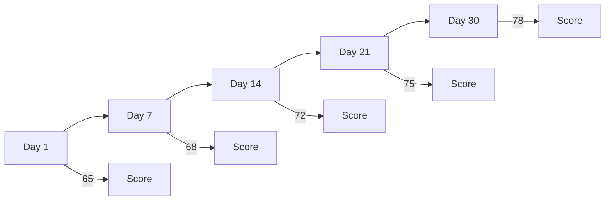

# 시계열 분석 (이력 비교) 설계 문서

> **프로젝트:** SkinLens v1.0
> **작성일:** 2026-05-24
> **버전:** 1.0

이 문서는 과거 분석 결과와 비교하여 변화 추이를 시각화하는 시계열 분석 기능의 기술 설계를 설명합니다.

---

## 1. 개요

### 1.1 현재 상황
- 단일 분석만 지원
- 각 분석은 독립적으로 처리
- 과거 결과와의 비교 불가능
- 케어 효과 확인 어려움

### 1.2 제안된 기능
- 과거 분석 결과 저장 및 조회
- 시계열 데이터 분석
- 변화 추이 시각화
- 케어 효과 확인
- 장기 추적 대시보드

### 1.3 기대 효과
- 케어 효과 정량적 확인
- 장기 피부 상태 추적
- 맞춤형 케어 권장
- 사용자 참여도 향상

---

## 2. 데이터 구조

### 2.1 분석 이력 테이블

**기존 확장 (analyses 테이블):**
```sql
-- 기존 필드 유지
ALTER TABLE analyses ADD COLUMN analysis_sequence INTEGER;
ALTER TABLE analyses ADD COLUMN previous_analysis_id INTEGER;
ALTER TABLE analyses ADD COLUMN next_analysis_id INTEGER;
ALTER TABLE analyses ADD COLUMN trend_data TEXT;  -- JSON (변화 추이 데이터)
ALTER TABLE analyses ADD COLUMN care_effectiveness REAL;  -- 케어 효과 점수 (0 ~ 1)
```

**시계열 인덱스 테이블 (time_series_index):**
```sql
CREATE TABLE time_series_index (
    id INTEGER PRIMARY KEY AUTOINCREMENT,
    customer_id TEXT NOT NULL,
    analysis_id INTEGER NOT NULL,
    sequence_number INTEGER NOT NULL,
    analysis_date TEXT NOT NULL,
    overall_score REAL,
    key_metrics TEXT,  -- JSON (주요 지표)
    FOREIGN KEY (customer_id) REFERENCES customers(id),
    FOREIGN KEY (analysis_id) REFERENCES analyses(id),
    UNIQUE(customer_id, sequence_number)
);
```

### 2.2 변화 추이 데이터 구조

**trend_data JSON 구조:**
```json
{
  "overall_score_change": 5.2,
  "overall_score_trend": "improving",
  "metric_changes": {
    "melasma_score": {
      "previous": 65.0,
      "current": 58.0,
      "change": -7.0,
      "trend": "improving"
    },
    "redness_score": {
      "previous": 72.0,
      "current": 68.0,
      "change": -4.0,
      "trend": "improving"
    },
    "acne_score": {
      "previous": 50.0,
      "current": 55.0,
      "change": 5.0,
      "trend": "worsening"
    }
  },
  "category_changes": {
    "pigmentation": {
      "previous_score": 60.0,
      "current_score": 55.0,
      "change": -5.0,
      "trend": "improving"
    },
    "redness": {
      "previous_score": 70.0,
      "current_score": 68.0,
      "change": -2.0,
      "trend": "stable"
    }
  },
  "period_days": 30,
  "analysis_count": 3
}
```

---

## 3. 시계열 분석 알고리즘

### 3.1 시퀀스 번호 할당

```python
def assign_sequence_number(customer_id, analysis_id):
    """고객별 분석 시퀀스 번호 할당"""
    last_sequence = get_last_sequence_number(customer_id)
    new_sequence = last_sequence + 1
    
    # time_series_index에 등록
    insert_time_series_index(
        customer_id=customer_id,
        analysis_id=analysis_id,
        sequence_number=new_sequence,
        analysis_date=datetime.now().isoformat()
    )
    
    # analyses 테이블 업데이트
    update_analysis_sequence(analysis_id, new_sequence)
    
    return new_sequence
```

### 3.2 변화 추이 계산

```python
def calculate_trend_data(current_analysis, previous_analysis):
    """이전 분석과 비교하여 변화 추이 계산"""
    trend_data = {
        "overall_score_change": 0.0,
        "overall_score_trend": "stable",
        "metric_changes": {},
        "category_changes": {},
        "period_days": 0,
        "analysis_count": 0
    }
    
    if not previous_analysis:
        return trend_data
    
    # 기간 계산
    current_date = parse_date(current_analysis["created_at"])
    previous_date = parse_date(previous_analysis["created_at"])
    trend_data["period_days"] = (current_date - previous_date).days
    
    # 전체 점수 변화
    current_score = current_analysis["overall_score"]
    previous_score = previous_analysis["overall_score"]
    trend_data["overall_score_change"] = current_score - previous_score
    
    if trend_data["overall_score_change"] > 2:
        trend_data["overall_score_trend"] = "improving"
    elif trend_data["overall_score_change"] < -2:
        trend_data["overall_score_trend"] = "worsening"
    else:
        trend_data["overall_score_trend"] = "stable"
    
    # 측정항목별 변화
    for metric in METRIC_KEYS:
        current_value = current_analysis["measurements"].get(metric)
        previous_value = previous_analysis["measurements"].get(metric)
        
        if current_value is not None and previous_value is not None:
            change = current_value - previous_value
            trend = "stable"
            
            if change > 2:
                trend = "worsening"  # 점수가 높을수록 안 좋음
            elif change < -2:
                trend = "improving"
            
            trend_data["metric_changes"][metric] = {
                "previous": previous_value,
                "current": current_value,
                "change": change,
                "trend": trend
            }
    
    # 카테고리별 변화
    for category, metrics in CATEGORY_METRICS.items():
        current_category_score = calculate_category_score(
            current_analysis["measurements"], metrics
        )
        previous_category_score = calculate_category_score(
            previous_analysis["measurements"], metrics
        )
        
        change = current_category_score - previous_category_score
        trend = "stable"
        
        if change > 2:
            trend = "worsening"
        elif change < -2:
            trend = "improving"
        
        trend_data["category_changes"][category] = {
            "previous_score": previous_category_score,
            "current_score": current_category_score,
            "change": change,
            "trend": trend
        }
    
    return trend_data
```

### 3.3 케어 효과 점수 계산

```python
def calculate_care_effectiveness(customer_id, period_days=30):
    """지정 기간 내 케어 효과 점수 계산"""
    analyses = get_analyses_in_period(customer_id, period_days)
    
    if len(analyses) < 2:
        return 0.0
    
    first_analysis = analyses[0]
    last_analysis = analyses[-1]
    
    # 전체 점수 개선도
    overall_improvement = (
        last_analysis["overall_score"] - first_analysis["overall_score"]
    )
    
    # 개선 항목 수
    improved_metrics = 0
    total_metrics = 0
    
    for metric in METRIC_KEYS:
        first_value = first_analysis["measurements"].get(metric)
        last_value = last_analysis["measurements"].get(metric)
        
        if first_value is not None and last_value is not None:
            total_metrics += 1
            if last_value < first_value:  # 점수가 낮아지면 개선
                improved_metrics += 1
    
    # 효과 점수 계산 (0 ~ 1)
    if total_metrics == 0:
        return 0.0
    
    improvement_ratio = improved_metrics / total_metrics
    overall_score_normalized = max(0, min(1, overall_improvement / 20.0))
    
    effectiveness = (improvement_ratio * 0.7) + (overall_score_normalized * 0.3)
    
    return effectiveness
```

### 3.4 추세 분석

```python
def analyze_trend(customer_id, metric, window_size=5):
    """지정된 측정항목의 추세 분석"""
    analyses = get_recent_analyses(customer_id, window_size)
    
    if len(analyses) < 3:
        return {"trend": "insufficient_data", "slope": 0.0}
    
    values = [a["measurements"].get(metric) for a in analyses]
    values = [v for v in values if v is not None]
    
    if len(values) < 3:
        return {"trend": "insufficient_data", "slope": 0.0}
    
    # 선형 회귀로 기울기 계산
    x = list(range(len(values)))
    y = values
    
    n = len(x)
    sum_x = sum(x)
    sum_y = sum(y)
    sum_xy = sum(xi * yi for xi, yi in zip(x, y))
    sum_x2 = sum(xi ** 2 for xi in x)
    
    slope = (n * sum_xy - sum_x * sum_y) / (n * sum_x2 - sum_x ** 2)
    
    # 추세 판정
    if slope > 0.5:
        trend = "worsening"
    elif slope < -0.5:
        trend = "improving"
    else:
        trend = "stable"
    
    return {
        "trend": trend,
        "slope": slope,
        "values": values,
        "r_squared": calculate_r_squared(x, y, slope)
    }
```

---

## 4. 시각화 방법

### 4.1 시계열 차트

**전체 점수 추이:**


**측정항목별 추이:**
- 라인 차트: 주요 측정항목 (기미, 홍조, 여드름 등)
- 바 차트: 카테고리별 점수
- 히트맵: 시간 x 측정항목

### 4.2 비교 뷰

**전후 비교:**
- 사이드 바이 사이드 이미지
- 점수 비교 테이블
- 개선/악화 하이라이트

**다중 시점 비교:**
- 3개 시점 선택 (초기/중간/최근)
- 타임라인 슬라이더
- 애니메이션 전환

### 4.3 대시보드

**요약 카드:**
- 현재 점수
- 이전 점수 대비 변화
- 케어 효과 점수
- 추세 아이콘 (↑/↓/→)

**상세 차트:**
- 전체 점수 추이 라인 차트
- 측정항목별 멀티 라인 차트
- 카테고리별 스택 바 차트

---

## 5. API 변경 사항

### 5.1 분석 이력 조회

**엔드포인트:** `GET /v1/customers/{customer_id}/analyses`

**Query Parameters:**
- `limit`: 반환할 분석 수 (기본 10)
- `offset`: 오프셋 (기본 0)
- `start_date`: 시작 날짜 (ISO 8601)
- `end_date`: 종료 날짜 (ISO 8601)

**Response:**
```json
{
  "customer_id": "user123",
  "total_count": 15,
  "analyses": [
    {
      "analysis_id": 1,
      "sequence_number": 1,
      "created_at": "2026-04-01T10:00:00Z",
      "overall_score": 65.0,
      "trend_data": {
        "overall_score_change": 0.0,
        "overall_score_trend": "stable"
      }
    },
    {
      "analysis_id": 2,
      "sequence_number": 2,
      "created_at": "2026-04-15T10:00:00Z",
      "overall_score": 68.0,
      "trend_data": {
        "overall_score_change": 3.0,
        "overall_score_trend": "improving"
      }
    }
  ]
}
```

### 5.2 변화 추이 조회

**엔드포인트:** `GET /v1/customers/{customer_id}/trend`

**Query Parameters:**
- `metric`: 측정항목 (예: overall_score, melasma_score)
- `period_days`: 기간 (기본 30)
- `window_size`: 윈도우 크기 (기본 5)

**Response:**
```json
{
  "customer_id": "user123",
  "metric": "overall_score",
  "period_days": 30,
  "trend": {
    "direction": "improving",
    "slope": 0.5,
    "r_squared": 0.85
  },
  "data_points": [
    {
      "sequence_number": 1,
      "date": "2026-04-01T10:00:00Z",
      "value": 65.0
    },
    {
      "sequence_number": 2,
      "date": "2026-04-15T10:00:00Z",
      "value": 68.0
    }
  ]
}
```

### 5.3 케어 효과 조회

**엔드포인트:** `GET /v1/customers/{customer_id}/care-effectiveness`

**Query Parameters:**
- `period_days`: 기간 (기본 30)

**Response:**
```json
{
  "customer_id": "user123",
  "period_days": 30,
  "effectiveness_score": 0.75,
  "overall_improvement": 8.0,
  "improved_metrics": 12,
  "total_metrics": 18,
  "category_effectiveness": {
    "pigmentation": 0.8,
    "redness": 0.6,
    "acne": 0.9
  }
}
```

### 5.4 비교 분석

**엔드포인트:** `POST /v1/customers/{customer_id}/compare`

**Request:**
```json
{
  "analysis_ids": [1, 5, 10]
}
```

**Response:**
```json
{
  "customer_id": "user123",
  "comparisons": [
    {
      "from_analysis_id": 1,
      "to_analysis_id": 5,
      "period_days": 14,
      "overall_score_change": 3.0,
      "metric_changes": {
        "melasma_score": {
          "from": 65.0,
          "to": 58.0,
          "change": -7.0,
          "trend": "improving"
        }
      }
    }
  ]
}
```

---

## 6. 클라이언트 구현 (Flutter)

### 6.1 시계열 차트 위젯

```dart
class TimeSeriesChart extends StatelessWidget {
  final List<AnalysisData> data;
  final String metric;
  
  @override
  Widget build(BuildContext context) {
    return LineChart(
      LineChartData(
        gridData: FlGridData(show: true),
        titlesData: FlTitlesData(
          bottomTitles: AxisTitles(
            sideTitles: SideTitles(
              showTitles: true,
              getTitlesWidget: (value, meta) {
                final date = data[value.toInt()].date;
                return Text(DateFormat('MM/dd').format(date));
              },
            ),
          ),
        ),
        borderData: FlBorderData(show: true),
        lineBarsData: [
          LineChartBarData(
            spots: data.asMap().entries.map((entry) {
              return FlSpot(
                entry.key.toDouble(),
                entry.value.metrics[metric] ?? 0.0,
              );
            }).toList(),
            isCurved: true,
            color: Colors.blue,
            barWidth: 3,
          ),
        ],
      ),
    );
  }
}
```

### 6.2 추세 인디케이터

```dart
class TrendIndicator extends StatelessWidget {
  final String trend;
  final double change;
  
  @override
  Widget build(BuildContext context) {
    IconData icon;
    Color color;
    
    switch (trend) {
      case 'improving':
        icon = Icons.trending_up;
        color = Colors.green;
        break;
      case 'worsening':
        icon = Icons.trending_down;
        color = Colors.red;
        break;
      default:
        icon = Icons.trending_flat;
        color = Colors.grey;
    }
    
    return Row(
      children: [
        Icon(icon, color: color),
        SizedBox(width: 4),
        Text(
          '${change > 0 ? '+' : ''}${change.toStringAsFixed(1)}',
          style: TextStyle(color: color),
        ),
      ],
    );
  }
}
```

### 6.3 비교 뷰

```dart
class ComparisonView extends StatelessWidget {
  final AnalysisData before;
  final AnalysisData after;
  
  @override
  Widget build(BuildContext context) {
    return Column(
      children: [
        Row(
          children: [
            Expanded(
              child: _buildAnalysisCard(before, 'Before'),
            ),
            SizedBox(width: 16),
            Expanded(
              child: _buildAnalysisCard(after, 'After'),
            ),
          ],
        ),
        SizedBox(height: 16),
        _buildMetricComparison(before, after),
      ],
    );
  }
  
  Widget _buildMetricComparison(AnalysisData before, AnalysisData after) {
    return ListView.builder(
      shrinkWrap: true,
      itemCount: METRIC_KEYS.length,
      itemBuilder: (context, index) {
        final metric = METRIC_KEYS[index];
        final beforeValue = before.metrics[metric];
        final afterValue = after.metrics[metric];
        final change = afterValue - beforeValue;
        
        return ListTile(
          title: Text(getMetricDisplayName(metric)),
          trailing: TrendIndicator(
            trend: change > 0 ? 'worsening' : 'improving',
            change: change,
          ),
        );
      },
    );
  }
}
```

---

## 7. 구현 단계

### Phase 1: 데이터베이스 스키마
1. analyses 테이블 확장
2. time_series_index 테이블 생성
3. 마이그레이션 스크립트 작성

### Phase 2: 백엔드 로직
1. 시퀀스 번호 할당 로직
2. 변화 추이 계산 로직
3. 케어 효과 점수 계산 로직
4. 추세 분석 로직

### Phase 3: API 엔드포인트
1. 분석 이력 조회 엔드포인트
2. 변화 추이 조회 엔드포인트
3. 케어 효과 조회 엔드포인트
4. 비교 분석 엔드포인트

### Phase 4: 클라이언트 UI
1. 시계열 차트 위젯
2. 추세 인디케이터
3. 비교 뷰
4. 대시보드

### Phase 5: 테스트
1. 단위 테스트
2. 통합 테스트
3. UI 테스트

---

## 8. 일정 추정

- 데이터베이스 스키마: 1일
- 백엔드 로직: 2일
- API 엔드포인트: 1일
- 클라이언트 UI: 3일
- 테스트: 2일
- **총계: 9일**

---

## 9. 성공 지표

- 분석 이력 저장률: 100%
- 시계열 분석 정확도: 95% 이상
- 사용자 만족도: +15% 향상 (설문)
- 케어 효과 확인 가능성: 90% 이상
- 장기 추적 사용률: 40% 이상

---

## 10. 롤백 계횸

- 시계열 인덱스 테이블 삭제
- analyses 테이블 확장 필드 삭제
- API 엔드포인트 비활성화
- 클라이언트 UI에서 시계열 기능 숨김

---

*작성일: 2026-05-24*
