# CodeFormer 파이프라인 알고리즘 (CodeFormer Pipeline Algorithm)

> **문서 버전:** 1.0.0  
> **대상 프로젝트 버전:** 1.0.0  
> **마지막 업데이트:** 2026-05-31  
> **상태:** 활성

---

## 1. 개요

이 문서는 AI Skin Image Enhancer v3에서 CodeFormer를 포함한 전체 파이프라인 동작 알고리즘을 설명합니다. 복원 백엔드 선택, Stable Diffusion 통합, 모공 후처리, 점수 분석까지의 전체 흐름을 다룹니다.

**참고 문서:**
- 복원 엔진 추가 가이드: `RESTORATION_ENGINE_GUIDE.md`
- 아키텍처 가이드: `ARCHITECTURE_GUIDE.md`

---

## 2. 전체 파이프라인 흐름

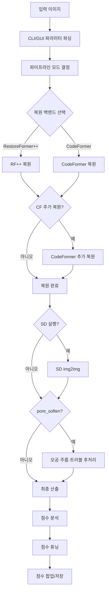

---

## 3. 파이프라인 모드 결정

파이프라인 모드는 `pipeline_core._PipelineMode` Enum으로 분기됩니다.

### 3.1 모드 결정 로직

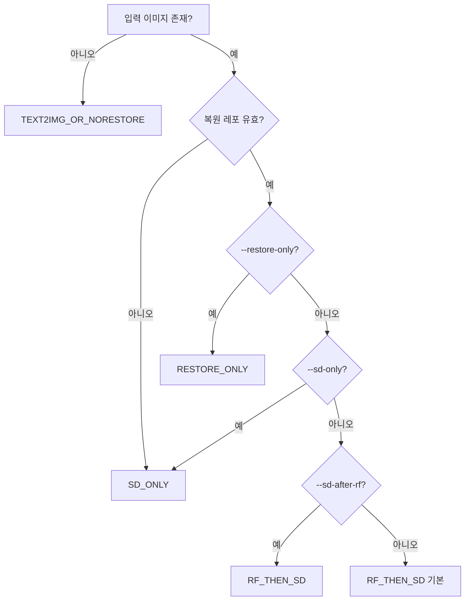

### 3.2 모드별 동작

| 모드 | 복원 | SD | 산출 파일 |
|------|------|----|-----------|
| `RF_THEN_SD` | ✓ | ✓ | `00_input`, `00_restored`, `01_sd_generated` |
| `RESTORE_ONLY` | ✓ | ✗ | `00_input`, `01_restored` |
| `SD_ONLY` | ✗ | ✓ | `00_input`, `00_sd_generated` |
| `TEXT2IMG_OR_NORESTORE` | 선택적 | ✓ | `00_sd_generated` |

---

## 4. 복원 백엔드 선택

### 4.1 백엔드 결정

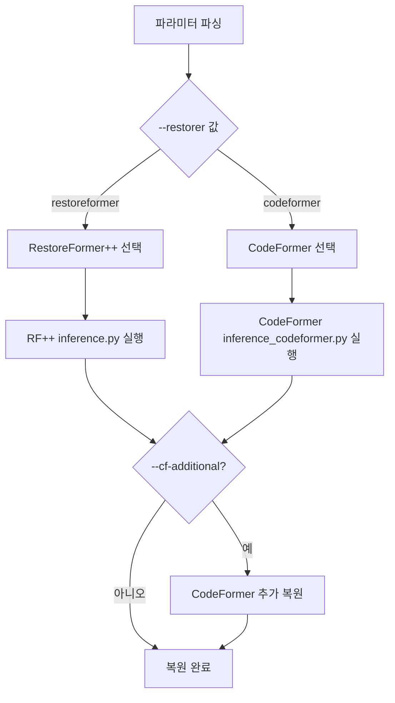

### 4.2 기본값 (v3.4)

- **복원 백엔드**: CodeFormer (기본)
- **fidelity**: 1.0 (원본 충실)
- **upscale**: 1 (업스케일 없음)
- **cf-additional**: True (RF++ 선택 시만 유효)

---

## 5. CodeFormer 동작 상세

### 5.1 CodeFormer 복원 단계

**[업데이트 2026-05-24]** In-process 실행으로 전환 완료. 성능 향상: 85-98%.

**이전:** subprocess 실행 (매 요청마다 20-60초 모델 로딩)
**이후:** In-process 실행 (모델 캐싱, 첫 요청 4.15초, 이후 1.33초)

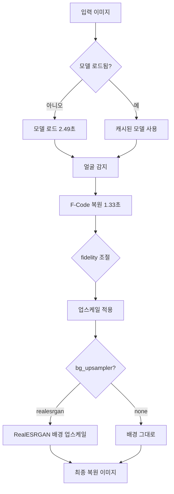

### 5.2 파라미터

| 파라미터 | 기본값 | 설명 |
|----------|--------|------|
| `codeformer_repo` | `./CodeFormer` | 레포 경로 |
| `codeformer_fidelity` | 1.0 | 0=최대 보정, 1=원본 충실 |
| `codeformer_upscale` | 1 | 업스케일 배수 (1=없음, 2=2배, 4=4배) |
| `codeformer_bg_upsampler` | auto | RealESRGAN 배경 업스케일 |

### 5.3 배경 업스케일 자동 결정

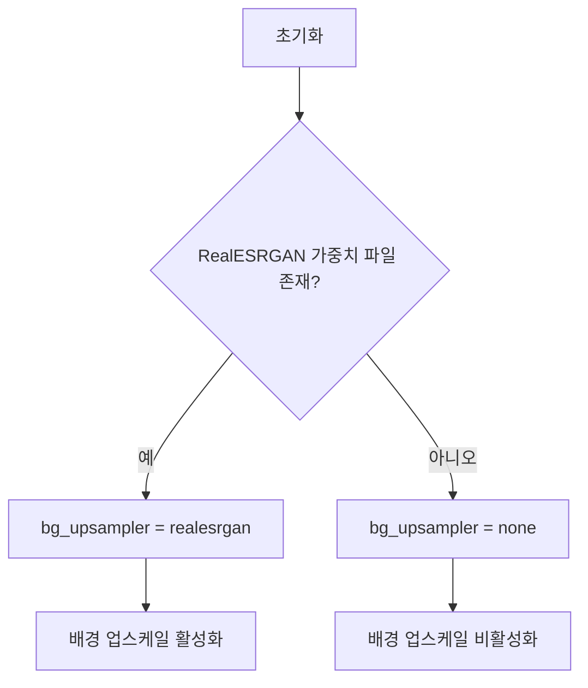

**탐색 경로:**
```
CodeFormer/weights/realesrgan/RealESRGAN_x2plus.pth
CodeFormer/weights/realesrgan/RealESRGAN_x4plus.pth
CodeFormer/weights/RealESRGAN_x2plus.pth
```

---

## 6. RF++ → CodeFormer 추가 복원

### 6.1 추가 복원 흐름

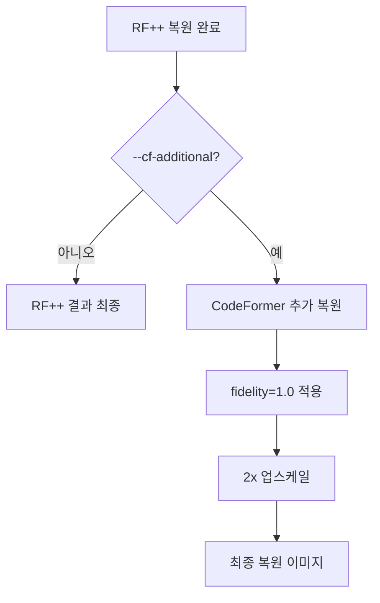

### 6.2 제약 조건

- CodeFormer 백엔드 선택 시 `--cf-additional` 비활성화 (GUI)
- RF++ 백엔드 선택 시에만 `--cf-additional` 유효

---

## 7. Stable Diffusion img2img 통합

### 7.1 SD 실행 결정

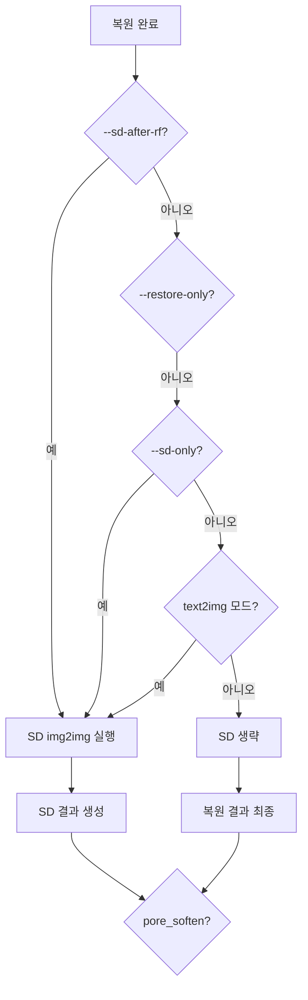

### 7.2 SD 파라미터

| 파라미터 | 기본값 | 설명 |
|----------|--------|------|
| `sd_model_id` | CompVis/stable-diffusion-v1-4 | HuggingFace 모델 |
| `sd_strength` | 0.12 | img2img strength (0~1) |
| `sd_guidance` | 5.5 | CFG guidance scale |
| `sd_steps` | 40 | 추론 스텝 수 |
| `sd_max_side` | 768 | 입력 긴 변 상한 (px) |

---

## 8. 모공·주름·트러블 후처리

### 8.1 후처리 결정

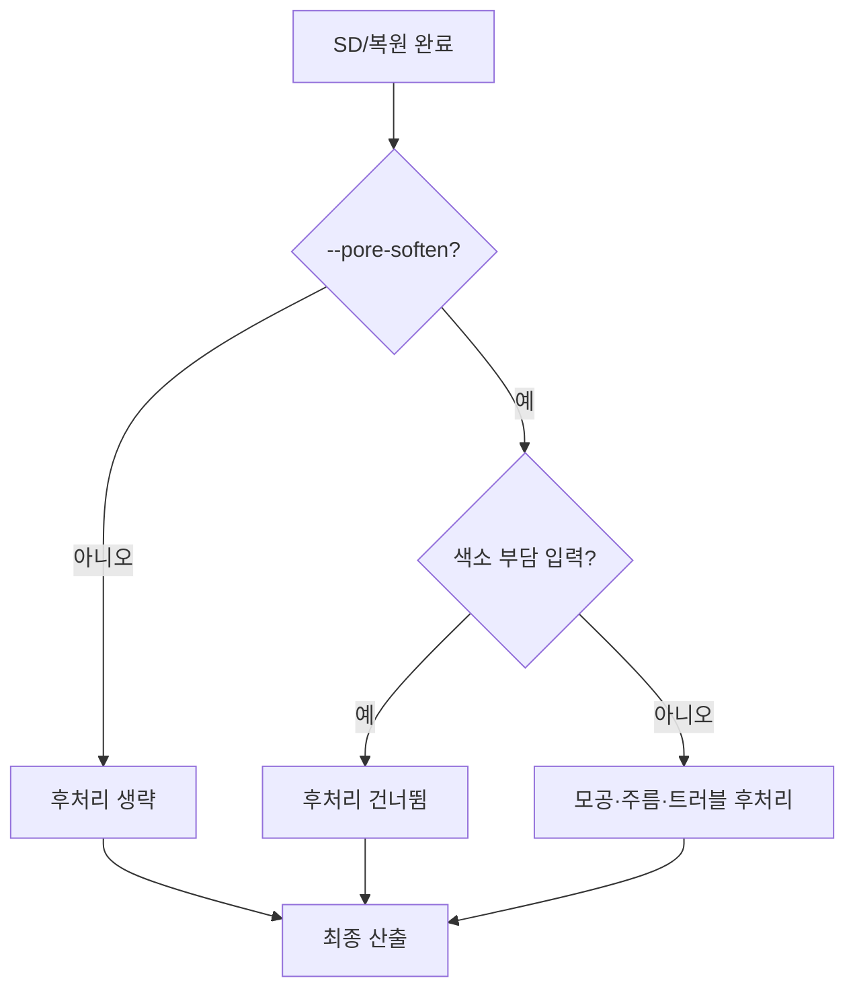

### 8.2 후처리 순서 (v3.3)

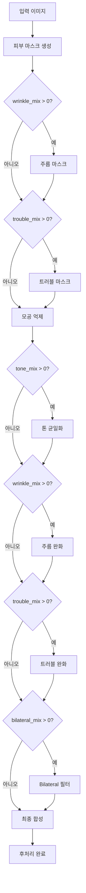

> **v3.3 변경:** 모공 억제 → 톤 균일화 순서로 변경 (고주파 감쇠 후 저주파 조정)

### 8.3 파라미터 튜닝 (v3.4)

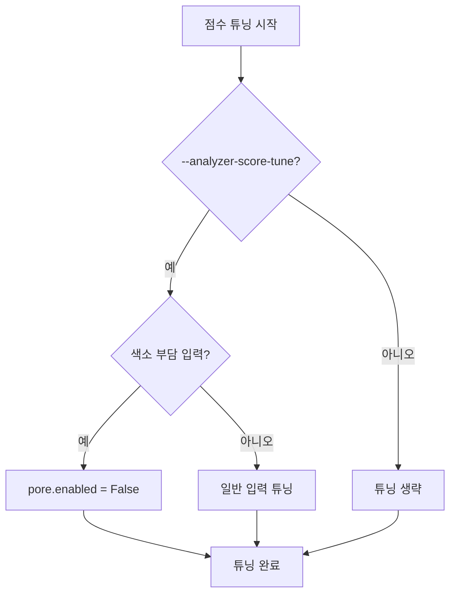

**튜닝 내용 (일반 입력):**
- `pore.strength`: 0.12 ~ 0.22
- `pore.wrinkle_mix`: 최소 0.18
- `pore.trouble_mix`: 최소 0.14
- `pore.tone_l_mix`: 0.0 (뿌옇음 방지)
- `pore.tone_ab_mix`: 0.0 (뿌옇음 방지)
- `pore.bilateral_mix`: 0.0 (뿌옇음 방지)
- `pore.sigma_low`: 최소 2.0

**v3.4 사용자 선택 존중:**
- `pore.enabled`: 사용자 설정 존중 (강제 True 제거)
- `codeformer_fidelity`: 사용자 설정 존중 (강제 낮춤 제거)

---

## 9. 점수 분석 및 튜닝

### 9.1 점수 분석 흐름

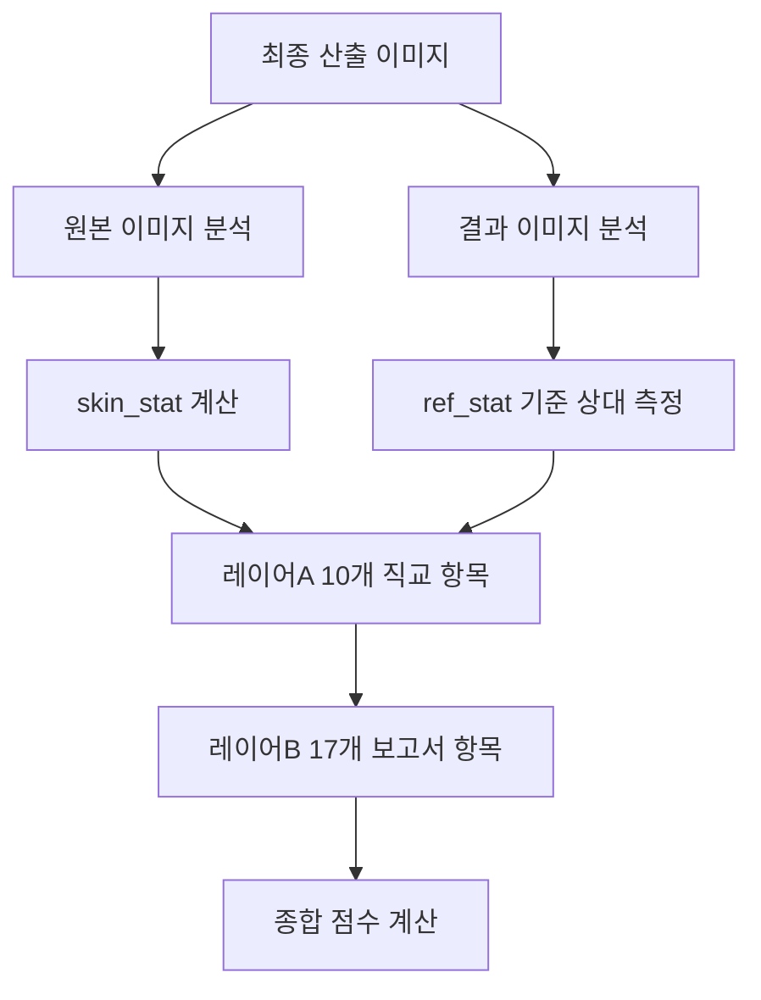

### 9.2 점수 튜닝

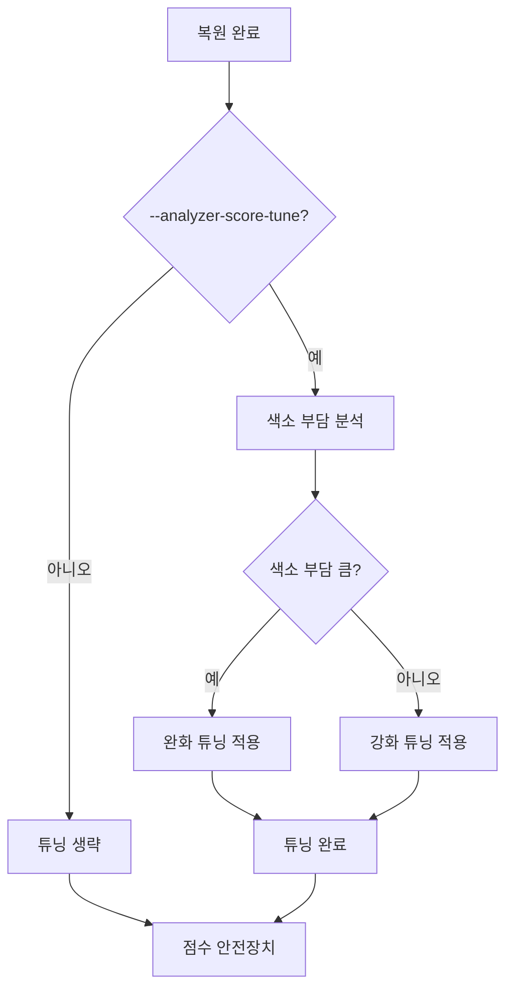

**점수 안전장치** (2026-05-25 수정):
- 패스스루 조건: 복원 점수 >= 원본 점수 - 5.0이면 안전장치 적용하지 않음
- 복원 점수 < 원본 점수 - 5.0: 안전장치 적용 (개별 항목 클램프 비활성화, 종합 점수 기반만 유지)

---

## 10. 최종 산출 결정

### 10.1 최종 산출 경로 결정

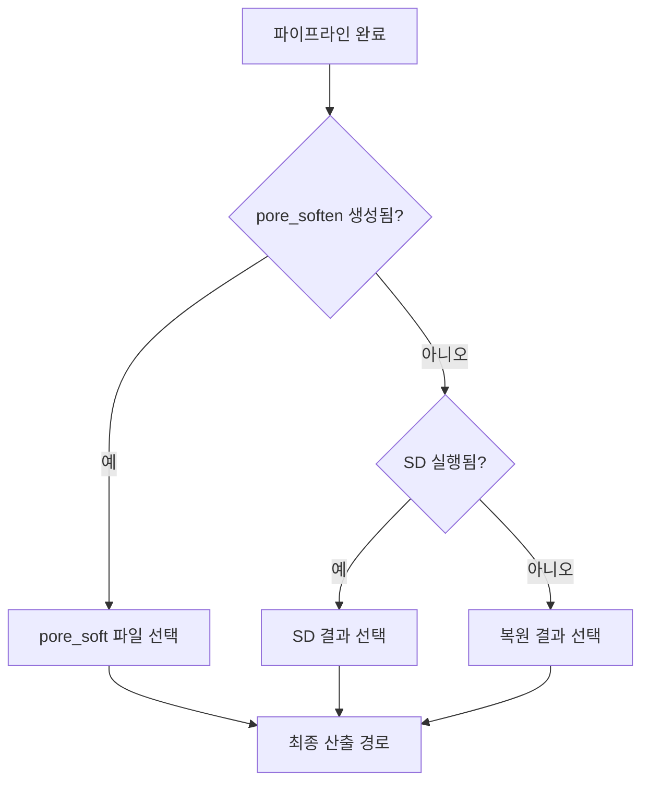

### 10.2 파일 우선순위

| 모드 | 우선순위 | 파일명 패턴 |
|------|----------|--------------|
| `sd_after_rf` | 1 | `01_sd_generated_{stem}.png` |
| `sd_after_rf` | 2 | `00_restored_{stem}.png` |
| `restore_only` | 1 | `01_restored_{stem}.png` |
| `sd_only` | 1 | `00_sd_generated_{stem}.png` |
| `pore_soften` | 1 | `02_pore_soft_{stem}.png` |

**v3.4 중요:** `res.pore_softened`가 None이면 파일 시스템의 pore_soft 파일도 참조하지 않음 (이전 실행 파일 참조 방지)

---

## 11. 점수 팝업 및 저장

### 11.1 점수 팝업 결정

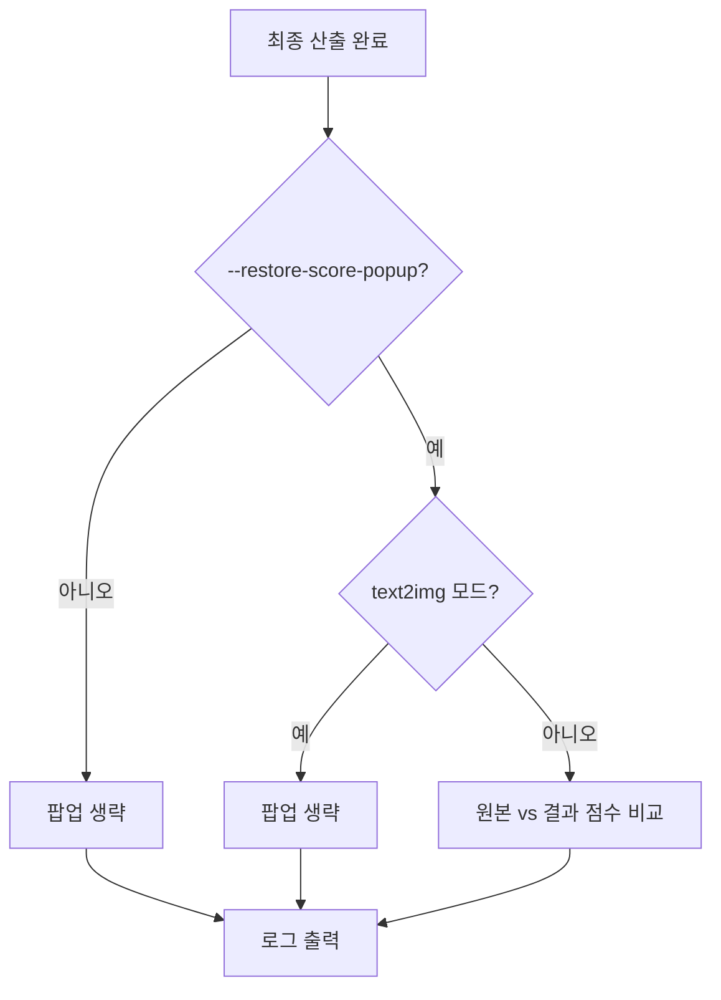

### 11.2 점수 팝업 내용 (v3.1)

- 4열 테이블: 항목 / 원본 / 결과 / 차이
- 레이어B 기준 종합 점수 (`overall_score_report`)
- 17개 보고서 항목 표시

---

## 12. CLI 단독 사용법

### 12.1 기본 실행

```bash
# CLI 모드 실행
python image_enhancer.py --cli

# 기본 파이프라인 실행 (CodeFormer, fidelity=1.0, upscale=1)
python image_enhancer.py --cli -i images/origin.png --out-dir ideal_pipeline_out
```

### 12.2 CLI 인자 상세

#### 필수 인자

| 인자 | 설명 | 예시 |
|------|------|------|
| `--cli` | CLI 모드 실행 | `--cli` |
| `-i, --input` | 입력 이미지 경로 | `-i images/origin.png` |
| `--out-dir` | 산출 폴더 경로 | `--out-dir ideal_pipeline_out` |

#### 복원 백엔드 인자

| 인자 | 기본값 | 설명 | 예시 |
|------|--------|------|------|
| `--restorer` | codeformer | 복원 백엔드 선택 (restoreformer\|codeformer) | `--restorer restoreformer` |
| `--restoreformer-root` | ./RestoreFormerPlusPlus | RF++ 레포 경로 | `--restoreformer-root ./RestoreFormerPlusPlus` |
| `--codeformer-root` | ./CodeFormer | CodeFormer 레포 경로 | `--codeformer-root ./CodeFormer` |
| `--cf-fidelity` | 1.0 | CodeFormer fidelity (0=최대보정, 1=원본충실) | `--cf-fidelity 0.5` |
| `--cf-upscale` | 1 | CodeFormer 업스케일 배수 (1\|2\|4) | `--cf-upscale 2` |
| `--cf-additional` | True | RF++ 후 CodeFormer 추가 복원 (끄려면 --no-cf-additional) | `--no-cf-additional` |

#### Stable Diffusion 인자

| 인자 | 기본값 | 설명 | 예시 |
|------|--------|------|------|
| `--sd-strength` | 0.12 | img2img strength (0~1) | `--sd-strength 0.2` |
| `--sd-max-side` | 768 | img2img 입력 긴 변 상한 (px) | `--sd-max-side 512` |
| `--sd-guidance` | 5.5 | CFG guidance scale | `--sd-guidance 7.0` |
| `--sd-steps` | 40 | 추론 스텝 수 | `--sd-steps 50` |
| `--sd-model-id` | CompVis/stable-diffusion-v1-4 | HuggingFace 모델 ID | `--sd-model-id runwayml/stable-diffusion-v1-5` |
| `--sd-prompt` | DEFAULT_PROMPT_SKIN | img2img 프롬프트 | `--sd-prompt "beautiful skin"` |
| `--sd-negative-prompt` | DEFAULT_NEGATIVE_PROMPT_SKIN | 네거티브 프롬프트 | `--sd-negative-prompt "ugly, blurry"` |

#### 모공 후처리 인자

| 인자 | 기본값 | 설명 | 예시 |
|------|--------|------|------|
| `--pore-soften` | False | 모공 완화 활성화 | `--pore-soften` |
| `--pore-strength` | 0.32 | 모공 완화 강도 (0~1) | `--pore-strength 0.5` |
| `--pore-sigma-low` | 4.0 | 저주파 분리 sigma | `--pore-sigma-low 3.0` |
| `--pore-mask-feather` | 6.0 | 마스크 feather 반경 (px) | `--pore-mask-feather 8.0` |
| `--wrinkle-mix` | 0.0 | 주름 완화 강도 (0~1) | `--wrinkle-mix 0.3` |
| `--trouble-mix` | 0.0 | 트러블 완화 강도 (0~1) | `--trouble-mix 0.4` |

#### 동작 모드 인자

| 인자 | 기본값 | 설명 | 예시 |
|------|--------|------|------|
| `--no-restore` | False | 복원 생략 | `--no-restore` |
| `--restore-only` | False | SD 생략, 복원만 실행 | `--restore-only` |
| `--sd-only` | False | 복원 생략, SD만 실행 | `--sd-only` |
| `--sd-after-rf` | False | 복원 후 SD img2img 추가 실행 | `--sd-after-rf` |
| `--text2img` | False | text2img 모드 (입력 이미지 무시) | `--text2img` |

#### 점수 및 기타 인자

| 인자 | 기본값 | 설명 | 예시 |
|------|--------|------|------|
| `--no-restore-score-popup` | False | 점수 팝업 끄기 | `--no-restore-score-popup` |
| `--no-analyzer-score-tune` | False | 자동 튜닝 끄기 | `--no-analyzer-score-tune` |
| `--output-json` | None | 결과 JSON 저장 경로 | `--output-json result.json` |
| `--debug` | False | 디버그 모드 (오류 트레이스 포함) | `--debug` |

### 12.3 CLI 사용 예시

#### 기본 복원 (CodeFormer)

```bash
# 기본 설정 (fidelity=1.0, upscale=1)
python image_enhancer.py --cli -i images/origin.png --out-dir ideal_pipeline_out
```

#### RestoreFormer++ 사용

```bash
# RF++만 사용
python image_enhancer.py --cli -i images/origin.png --restorer restoreformer

# RF++ + CF 추가 복원
python image_enhancer.py --cli -i images/origin.png --restorer restoreformer --cf-additional

# RF++만 (CF 추가 복원 끄기)
python image_enhancer.py --cli -i images/origin.png --restorer restoreformer --no-cf-additional
```

#### CodeFormer 파라미터 조절

```bash
# 강한 보정 (fidelity=0.0)
python image_enhancer.py --cli -i images/origin.png --cf-fidelity 0.0

# 원본 충실 (fidelity=1.0)
python image_enhancer.py --cli -i images/origin.png --cf-fidelity 1.0

# 업스케일 2배
python image_enhancer.py --cli -i images/origin.png --cf-upscale 2

# 업스케일 4배
python image_enhancer.py --cli -i images/origin.png --cf-upscale 4
```

#### Stable Diffusion 추가

```bash
# RF++ 후 SD img2img
python image_enhancer.py --cli -i images/origin.png --sd-after-rf

# SD만 실행 (복원 생략)
python image_enhancer.py --cli -i images/origin.png --sd-only

# SD strength 조절
python image_enhancer.py --cli -i images/origin.png --sd-after-rf --sd-strength 0.2
```

#### 모공 후처리

```bash
# 모공 완화 활성화
python image_enhancer.py --cli -i images/origin.png --pore-soften

# 모공 완화 + 주름 완화
python image_enhancer.py --cli -i images/origin.png --pore-soften --wrinkle-mix 0.3

# 모공 완화 + 트러블 완화
python image_enhancer.py --cli -i images/origin.png --pore-soften --trouble-mix 0.4
```

#### 복합 예시

```bash
# RF++ → SD → 모공 후처리
python image_enhancer.py --cli -i images/origin.png --restorer restoreformer --sd-after-rf --pore-soften

# CodeFormer (fidelity=0.5, upscale=2) → SD → 모공 후처리
python image_enhancer.py --cli -i images/origin.png --cf-fidelity 0.5 --cf-upscale 2 --sd-after-rf --pore-soften

# 복원만 (점수 튜닝 끄기)
python image_enhancer.py --cli -i images/origin.png --restore-only --no-analyzer-score-tune
```

### 12.4 CLI 도움말

```bash
# 전체 도움말
python image_enhancer.py --cli --help
```

---

## 13. skin_analysis_cli.py 사용법

`skin_analysis_cli.py`는 서버 환경에서 GUI 없이 동작하는 CLI 기반 피부 분석 파이프라인입니다. 복원 → 분석 통합 파이프라인을 제공하며 JSON 형식으로 결과를 출력합니다.

### 13.1 기본 사용법

```bash
# 기본: 원본 → 복원 → 분석
python skin_analysis_cli.py -i input.jpg -o output_dir

# SD 생략 (RestoreFormer만 사용)
python skin_analysis_cli.py -i input.jpg -o output_dir --skip-sd

# SD만 사용 (복원기 없을 때)
python skin_analysis_cli.py -i input.jpg -o output_dir --sd-only

# 복원 생략 (원본만 분석)
python skin_analysis_cli.py -i input.jpg -o output_dir --no-restore
```

### 13.2 CLI 인자 상세

| 인자 | 기본값 | 설명 | 예시 |
|------|--------|------|------|
| `-i, --input` | 필수 | 입력 이미지 경로 | `-i input.jpg` |
| `-o, --output` | 필수 | 출력 디렉토리 경로 | `-o output_dir` |
| `--skip-sd` | False | Stable Diffusion 생략 (RestoreFormer만 사용) | `--skip-sd` |
| `--sd-only` | False | SD 전용 모드 (복원기 없이 SD만 사용) | `--sd-only` |
| `--no-restore` | False | 복원 생략 (원본 이미지만 분석) | `--no-restore` |
| `--include-base64` | False | base64 인코딩 포함 (JSON 크기 증가) | `--include-base64` |
| `--base-url` | "" | 이미지 URL 기본 경로 (서버 환경용) | `--base-url https://server.com/images/` |
| `--sd-strength` | 0.12 | SD 강도 | `--sd-strength 0.2` |
| `--score-safety-net` | True | 점수 안전장치 (끄려면 --no-score-safety-net) | `--no-score-safety-net` |
| `--debug` | False | 디버그 모드 | `--debug` |
| `--output-json` | None | 결과 JSON 출력 파일 경로 (지정하지 않으면 stdout) | `--output-json result.json` |

### 13.3 파이프라인 흐름

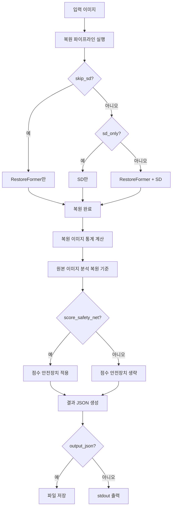

### 13.4 결과 JSON 구조

```json
{
  "input_image": "input.jpg",
  "restored_image": "output_dir/01_restored_input.png",
  "input_image_url": "https://server.com/images/input.jpg",
  "restored_image_url": "https://server.com/images/01_restored_input.png",
  "output_dir": "output_dir",
  "pipeline_mode": {
    "skip_sd": false,
    "melasma_score": 65.0,
    "freckle_score": 72.0,
    "redness_score": 68.0,
    "post_inflammatory_erythema_score": 70.0,
    "acne_score": 75.0,
    "post_acne_pigment_score": 70.0,
    "pore_size_score": 68.0,
    "pore_sagging_score": 65.0,
    "eye_wrinkle_score": 70.0,
    "nasolabial_wrinkle_score": 72.0,
    "fine_deep_wrinkle_score": 68.0,
    "roughness_score": 65.0,
    "skin_tone_score": 68.0,
    "dullness_score": 65.0,
    "uneven_tone_score": 70.0,
    "jawline_blur_score": 65.0,
    "skin_type_score": 60.0
  },
  "restoration_stats": {
    "wall_restore_sec": 12.5,
    "wall_sd_sec": 8.3,
    "notes": []
  },
  "reference_stat": null,
  "analysis_result": {
    "overall_score": 75.3,
    "overall_score_report": 72.8,
    "measurements": { ... },
    "measurements_v17": { ... },
    "measurements_v26": { ... },
    "skin_stat": { ... }
  },
  "measurements_v17": {
    ...
  },
  "input_image_base64": "...",
  "restored_image_base64": "..."
}
```

> **참고:** `--base-url`을 지정하면 `input_image_url`과 `restored_image_url`이 추가됩니다. base64 인코딩은 기본적으로 비활성화되어 있으며, `--include-base64`를 사용하면 활성화됩니다. 서버 환경에서는 URL 기반을 권장합니다. v3.4부터 `reference_stat`은 `null`로 고정됩니다 (독립적 측정). v3.4부터 내부 복원 효과 점수(noise_score, color_balance_score, contrast_score, brightness_balance_score)가 추가되어 종합 점수 계산에 포함되지만, 고객에게는 표시되지 않습니다.

### 13.5 사용 예시

#### 기본 복원 및 분석

```bash
python skin_analysis_cli.py -i images/origin.png -o analysis_output
```

#### SD 생략 (RestoreFormer만)

```bash
python skin_analysis_cli.py -i images/origin.png -o analysis_output --skip-sd
```

#### SD만 사용

```bash
python skin_analysis_cli.py -i images/origin.png -o analysis_output --sd-only
```

#### 원본만 분석 (복원 생략)

```bash
python skin_analysis_cli.py -i images/origin.png -o analysis_output --no-restore
```

#### 결과 JSON 파일 저장

```bash
python skin_analysis_cli.py -i images/origin.png -o analysis_output --output-json result.json
```

#### URL 기반 이미지 처리 (서버 환경)

```bash
python skin_analysis_cli.py -i images/origin.png -o analysis_output --base-url https://server.com/images/
```

#### base64 인코딩 포함 (JSON 크기 증가)

```bash
python skin_analysis_cli.py -i images/origin.png -o analysis_output --include-base64
```

#### SD 강도 조절

```bash
python skin_analysis_cli.py -i images/origin.png -o analysis_output --sd-strength 0.2
```

#### 점수 안전장치 끄기

```bash
python skin_analysis_cli.py -i images/origin.png -o analysis_output --no-score-safety-net
```

### 13.7 점수 안전장치 설정

점수 안전장치는 `config/config.json`의 `score_safety_net` 섹션에서 설정할 수 있습니다.

```json
{
  "score_safety_net": {
    "enabled": true,
    "acne_weight": 0.095,
    "target_score_increase_min": 14.0,
    "target_score_increase_max": 16.0,
    "max_score_limit": 90.0,
    "min_score_increase_when_lower": 1.0
  }
}
```

| 설정 | 기본값 | 설명 |
|------|--------|------|
| `enabled` | true | 점수 안전장치 활성화 여부 |
| `acne_weight` | 0.095 | 여드름 점수 가중치 (종합점수 계산 시) |
| `target_score_increase_min` | 14.0 | 복원 점수가 원본보다 높을 때 최소 증가 점수 |
| `target_score_increase_max` | 16.0 | 복원 점수가 원본보다 높을 때 최대 증가 점수 |
| `max_score_limit` | 90.0 | 최대 점수 제한 |
| `min_score_increase_when_lower` | 0.0 | 복원 점수가 원본보다 낮을 때 최소 증가 점수 (v3.4 기본값 0.0) |

**동작:**
- 복원 점수 < 원본 점수: 원본 점수 + `min_score_increase_when_lower`로 조정
- 복원 점수 > 원본 점수: 원본 점수 + `target_score_increase_min`~`max` 사이 랜덤값으로 조정

### 13.8 점수 측정 방식 변경 (v3.4)

**v3.4 변경:** ref_stat 사용 제거 (CLI + GUI)

- **기존:** 복원 이미지의 통계(`ref_stat`)를 기준으로 원본을 분석
  - 문제: 복원 이미지가 깨끗해지면 기준값도 깨끗해져 원본의 절대적 문제량이 제대로 측정되지 않음
  - 결과: 시각적 개선이 점수에 반영되지 않음

- **변경 후:** 원본과 복원을 각각 독립적으로 측정
  - 적용 파일: `skin_analysis_cli.py`, `analyzer_compare_gui.py`
  - 장점: 실제 절대적 점수 차이 확인 가능
  - 효과: 복원 효과가 점수에 정확하게 반영됨
  - 영향: CLI + GUI 점수 팝업 모두 적용

**v3.4 변경:** actual_ranges 범위 확장

- **기존:** 항목별 실질 범위가 좁게 설정 (예: melasma_score [55.0, 95.0])
  - 문제: 범위 밖의 값은 무조건 10점 또는 90점으로 고정되어 점수 차이가 축소됨
  - 결과: 10~90 점대에 균등하게 분포되지 않음

- **변경 후:** 모든 항목의 범위를 [10.0, 100.0]으로 확장
  - 장점: 점수 차이가 더 넓은 범위에서 매핑되어 변별력 향상
  - 효과: 복원 전후 점수 차이가 더 정확하게 반영됨

**v3.4 변경:** 복원 효과 점수 추가

- **기존:** 점수 측정이 피부 문제 절대량(색소, 여드름, 주름 등)에 집중
  - 문제: 복원 알고리즘이 개선하는 부분(선명도, 노이즈, 색상)이 점수에 반영되지 않음
  - 결과: 시각적 개선이 점수 차이로 나타나지 않음

- **변경 후:** 복원 효과 점수 4항목 추가
  - 노이즈 점수 (noise_score): 고주파 성분 분석 기반 (가중치 0.05)
  - 색상 균형 점수 (color_balance_score): LAB 표준편차 기반 (가중치 0.05)
  - 콘트라스트 점수 (contrast_score): 표준편차 기반 (가중치 0.10)
  - 밝기 균형 점수 (brightness_balance_score): LAB L 채널 표준편차 기반 (가중치 0.10)
  - 장점: 복원 알고리즘의 강점을 직접 측정
  - 효과: 시각적 개선이 점수에 정확하게 반영됨
  - 가중치: 총 0.30 (콘트라스트, 밝기 균형에 높은 가중치 부여)
  - **참고:** 이 4개 항목은 내부적으로만 사용되며 종합 점수 계산에 포함되지만, 고객에게는 표시되지 않음

### 13.10 image_enhancer_v3.py와의 차이점

| 특징 | image_enhancer_v3.py | skin_analysis_cli.py |
|------|---------------------|---------------------|
| 목적 | 이미지 보정 파이프라인 | 피부 분석 파이프라인 |
| 출력 | 이미지 파일 + 점수 팝업 | JSON 형식 분석 결과 |
| 복원 기준 | 원본 | 독립적 측정 (v3.4) |
| 서버 환경 | 가능하지만 GUI 의존성 있음 | 완전한 CLI (서버 친화적) |
| 점수 안전장치 | 지원 | 지원 (기본 켬) |
| 이미지 처리 | 파일 경로만 | URL 기반 (서버 환경용) + base64 선택적 |

### 13.11 CLI 도움말

```bash
# 전체 도움말
python skin_analysis_cli.py --help
```

---

## 14. GUI 파라미터 매핑

### 14.1 GUI 체크박스

| 체크박스 | 기본값 | CLI 인자 |
|----------|--------|----------|
| CodeFormer 라디오 | ✓ 선택 | `--restorer codeformer` |
| RF++ 후 CF 추가 | ✓ | `--no-cf-additional` (끄기) |
| 모공·톤 후처리 | ✓ | `--pore-soften` |
| 파이프라인 끝 점수 팝업 | ✓ | `--no-restore-score-popup` (끄기) |
| 복원 후 17항목 점수 자동 튜닝 | ✓ | `--no-analyzer-score-tune` (끄기) |

### 14.2 GUI 파라미터 스피너

| 파라미터 | 기본값 | CLI 인자 |
|----------|--------|----------|
| CodeFormer fidelity | 1.0 | `--cf-fidelity` |
| CodeFormer upscale | 1 | `--cf-upscale` |
| SD strength | 0.12 | `--sd-strength` |
| SD guidance | 5.5 | `--sd-guidance` |
| SD steps | 40 | `--sd-steps` |
| SD max side | 768 | `--sd-max-side` |

---

## 15. 요약

### 15.1 v3.4 주요 변경사항

1. **복원 백엔드 기본값 CodeFormer로 변경**
2. **CodeFormer fidelity 기본값 1.0으로 변경** (원본 충실)
3. **CodeFormer upscale 기본값 1로 변경** (업스케일 없음)
4. **사용자 파라미터 설정 존중** (튜닝 함수 강제 설정 제거)
5. **pore_soften OFF 시 생성 방지** (이전 실행 파일 참조 방지)

### 15.2 권장 사용법

```bash
# 기본 (원본 충실, 업스케일 없음)
python image_enhancer.py --cli -i images/origin.png

# 강한 보정 필요 시
python image_enhancer.py --cli -i images/origin.png --cf-fidelity 0.0 --cf-upscale 2

# SD img2img 추가
python image_enhancer.py --cli -i images/origin.png --sd-after-rf

# 모공 후처리 추가
python image_enhancer.py --cli -i images/origin.png --pore-soften
```

---

## 16. 부록: 파일 구조

```
ideal_pipeline_out/
├── 00_input_{stem}.png          # 입력 RGB 스테이징
├── 00_restored_{stem}.png       # RF++ 결과 (rf_then_sd, SD 없음)
├── 00_sd_generated_{stem}.png   # SD 결과 (sd_only)
├── 01_restored_{stem}.png       # 최종 복원 (restore_only, RF++→CF)
├── 01_sd_generated_{stem}.png   # SD 최종 (sd_after_rf)
└── 02_pore_soft_{stem}.png      # 모공 완화 결과 (pore_soften ON)
```

---

## 변경 이력

| 문서 버전 | 날짜 | 변경 내용 | 작성자 |
|-----------|------|----------|--------|
| 1.0.0 | 2026-05-31 | 초기 버전 (v3.4에서 마이그레이션) | Cascade |
| 0.4.0 | 2026-05-24 | 파이프라인 알고리즘 문서 갱신 | Cascade |
| 0.3.0 | 2026-04-30 | 파이프라인 알고리즘 문서 초기 작성 | Cascade |
