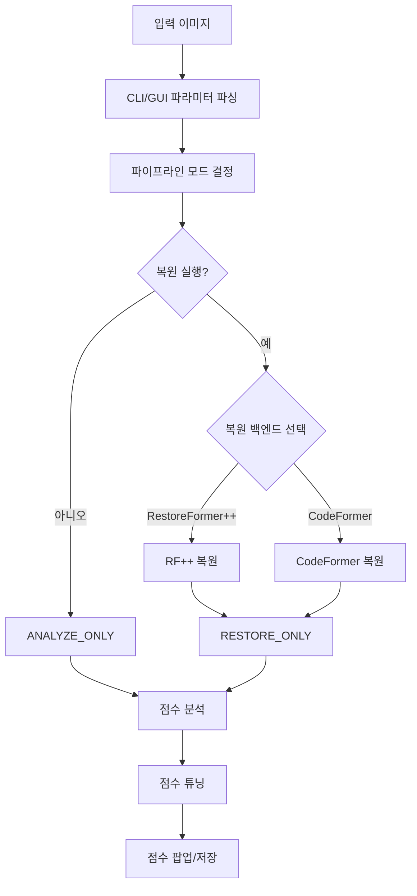
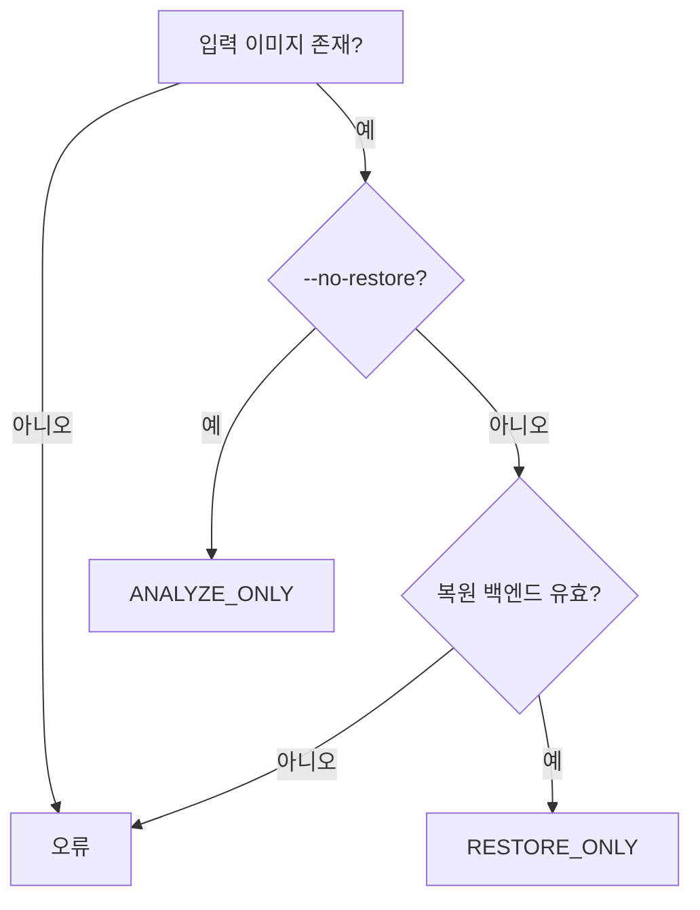
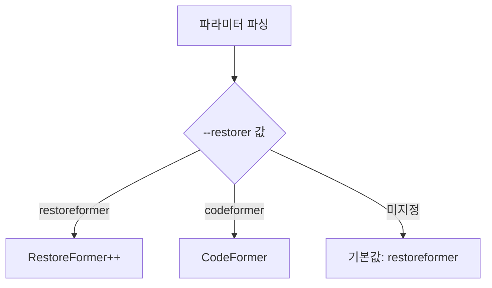
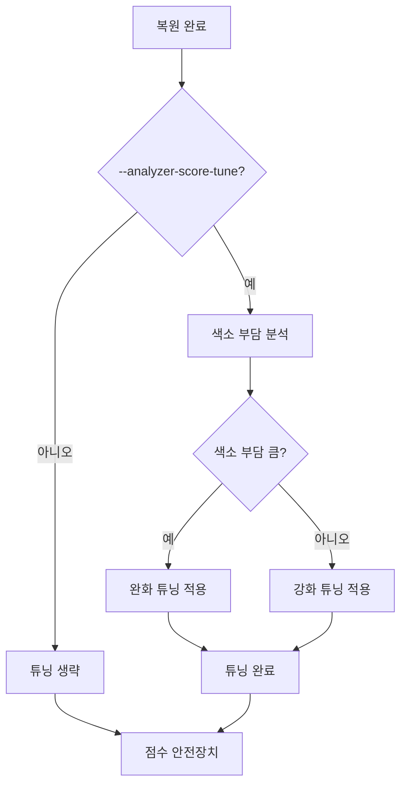
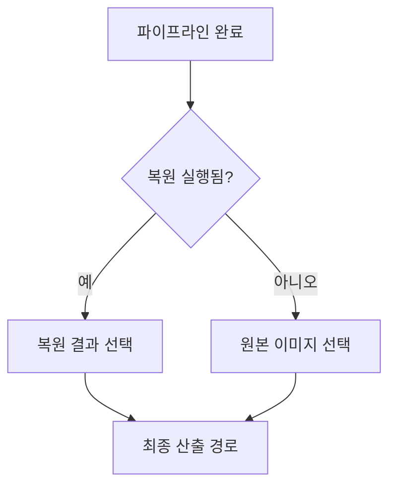

# CodeFormer 파이프라인 알고리즘 가이드

> **문서 버전:** 2.0.0  
> **대상 프로젝트 버전:** 1.0.0  
> **마지막 업데이트:** 2026-06-08  
> **상태:** 활성

---

## 1. 개요

이 문서는 AI Skin Analysis Pipeline v3에서 CodeFormer를 포함한 전체 파이프라인 동작 알고리즘을 설명합니다. 복원 백엔드 선택, 점수 분석까지의 전체 흐름을 다룹니다.

**참고 문서:**
- 복원 엔진 추가 가이드: `RESTORATION_ENGINE_GUIDE.md`
- 아키텍처: `ARCHITECTURE.md`
- 파이프라인 가이드: `SKIN_ANALYSIS_PIPELINE_GUIDE.md`

---

## 2. 전체 파이프라인 흐름



---

## 3. 파이프라인 모드 결정

파이프라인 모드는 `pipeline_core._PipelineMode` Enum으로 분기됩니다.

### 3.1 모드 결정 로직



### 3.2 모드별 동작

| 모드 | 복원 | 산출 파일 |
|------|------|-----------|
| `RESTORE_ONLY` | ✓ | `00_input`, `01_restored` |
| `ANALYZE_ONLY` | ✗ | `00_input` |

---

## 4. 복원 백엔드 선택

### 4.1 백엔드 결정



### 4.2 복원 백엔드 Enum

```python
class Restorer(str, Enum):
    """복원 백엔드. str 상속으로 argparse choices / JSON 직렬화 호환."""
    RESTOREFORMER = "restoreformer"
    CODEFORMER    = "codeformer"
```

### 4.3 RestoreFormer++ (RF++)

**개요**
- RestoreFormerPlusPlus는 얼굴 복원에 특화된 AI 모델
- 딥러닝 기반의 얼굴 구조 복원 및 텍스처 개선
- 기본 복원 백엔드로 사용

**동작 방식**
1. **입력 이미지 분석**: 얼굴 영역 감지 및 특징 추출
2. **구조 복원**: 딥러닝 네트워크로 얼굴 구조(눈, 코, 입 등) 복원
3. **텍스처 개선**: 피부 텍스처 세부 디테일 복원
4. **출력**: 고해상도 복원 이미지

**파라미터**
| 파라미터 | CLI 인자 | 기본값 | 설명 |
|----------|----------|--------|------|
| `restoreformer_repo` | `--restoreformer-root` | `./external/RestoreFormerPlusPlus` | 레포 루트 (CLI 전용) |

**레포 구조**
```
external/RestoreFormerPlusPlus/
    inference.py                    ← 필수
    weights/
        restoreformer_plus_plus.pth  ← 모델 가중치
```

### 4.4 CodeFormer (CF)

**개요**
- CodeFormer는 얼굴 복원 및 업스케일에 널리 사용되는 모델
- 코드 기반의 얼굴 특성 복원
- 배경 업스케일 옵션 지원 (RealESRGAN)

**동작 방식**
1. **얼굴 감지**: 입력 이미지에서 얼굴 영역 자동 감지
2. **코드 복원**: F-Code 기반 얼굴 특성 복원
3. **fidelity 조절**: 복원 강도 조절 (0=최대 보정, 1=원본 충실)
4. **업스케일**: 지정된 배수로 해상도 증가
5. **배경 처리**: RealESRGAN으로 배경 업스케일 (옵션)

**파라미터**
| 파라미터 | CLI 인자 | 기본값 | 설명 |
|----------|----------|--------|------|
| `codeformer_repo` | `--codeformer-root` | `./external/CodeFormer` (자동 탐색) | 레포 루트 |
| `codeformer_fidelity` | `--cf-fidelity` | `1.0` | 0=최대 보정, 1=원본 충실 |
| `codeformer_upscale` | `--cf-upscale` | `2` | 업스케일 배수 (1=없음, 2=2배, 4=4배) |
| `codeformer_bg_upsampler` | — | `"auto"` → 자동 결정 | RealESRGAN 배경 업스케일 여부 |

**`codeformer_bg_upsampler` 자동 결정:**  
`PipelineSettings.__post_init__` 시 아래 경로를 탐색합니다. 파일이 있으면 `"realesrgan"`, 없으면 `"none"`으로 자동 설정되어 가중치 미설치 환경의 크래시를 방지합니다.

```
external/CodeFormer/weights/realesrgan/RealESRGAN_x2plus.pth   ← 탐색 대상
external/CodeFormer/weights/realesrgan/RealESRGAN_x4plus.pth   ← 탐색 대상
external/CodeFormer/weights/RealESRGAN_x2plus.pth              ← 대체 경로
```

**레포 구조**
```
external/CodeFormer/
    inference_codeformer.py          ← 필수
    weights/
        CodeFormer/
            codeformer.pth           ← 자동 다운로드 또는 사전 배치
        realesrgan/
            RealESRGAN_x2plus.pth    ← 배경 업스케일 (옵션)
```

### 4.5 복원 파이프라인 흐름

**단계별 동작**

1. **입력 이미지 스테이징**
   - 원본 이미지를 RGB로 변환
   - 파일명 스테이징 (한글 경로 문제 해결)
   - 출력: `00_input_{stem}.png`

2. **복원 엔진 실행**
   - 선택된 백엔드(RF++ 또는 CF)로 복원 수행
   - 얼굴 구조 및 텍스처 복원
   - 최종 복원 이미지 출력: `01_restored_{stem}.png`

3. **점수 분석**
   - 원본 이미지 분석 (18개 측정 항목)
   - 복원 이미지 분석 (ref_stat 기준)
   - 점수 튜닝 적용

4. **점수 안전장치** (2026-05-25 수정)
   - 패스스루 조건: 복원 점수 >= 원본 점수 - 5.0이면 안전장치 적용하지 않음
   - 복원 점수 < 원본 점수 - 5.0: 안전장치 적용 (개별 항목 클램프 비활성화, 종합 점수 기반만 유지)

**설정 파일 로드**
- `config/config.json`에서 점수 파라미터 로드
- 파일 수정 시 자동 감지 및 재로드 (서버 환경 지원)

---

## 5. 점수 분석 및 튜닝

### 5.1 점수 분석 흐름


### 5.2 점수 튜닝



**점수 안전장치** (2026-05-25 수정):
- 패스스루 조건: 복원 점수 >= 원본 점수 - 5.0이면 안전장치 적용하지 않음
- 복원 점수 < 원본 점수 - 5.0: 안전장치 적용 (개별 항목 클램프 비활성화, 종합 점수 기반만 유지)

---

## 6. 최종 산출 결정

### 6.1 최종 산출 경로 결정



### 6.2 최종 산출 경로 표

| 조건 | 최종 산출 파일 |
|------|---------------|
| `RESTORE_ONLY` | `01_restored_{stem}.png` |
| `ANALYZE_ONLY` | `00_input_{stem}.png` |

---

## 7. CLI 인자

### 7.1 복원 백엔드 인자

| 인자 | 기본값 | 설명 | 예시 |
|------|--------|------|------|
| `--restorer` | `restoreformer` | 복원 백엔드 (`restoreformer` \| `codeformer`) | `--restorer codeformer` |
| `--restoreformer-root` | `./external/RestoreFormerPlusPlus` | RF++ 레포 루트 | `--restoreformer-root /path/to/RF++` |
| `--codeformer-root` | `./external/CodeFormer` | CF 레포 루트 | `--codeformer-root /path/to/CF` |
| `--cf-fidelity` | `1.0` | CodeFormer fidelity (0=최대보정, 1=원본충실) | `--cf-fidelity 0.5` |
| `--cf-upscale` | `2` | CodeFormer 업스케일 배수 (1=없음, 2=2배, 4=4배) | `--cf-upscale 4` |
| `--cf-additional` | `True` (config.json) | RF++ 복원 후 CodeFormer 추가 복원 (끄려면 `--no-cf-additional`) | `--no-cf-additional` |

### 7.2 동작 모드 인자

| 인자 | 기본값 | 설명 | 예시 |
|------|--------|------|------|
| `--no-restore` | False | 복원 생략 | `--no-restore` |

### 7.3 점수 튜닝 인자

| 인자 | 기본값 | 설명 | 예시 |
|------|--------|------|------|
| `--no-analyzer-score-tune` | False | 자동 튜닝 끄기 | `--no-analyzer-score-tune` |
| `--no-restore-score-popup` | False | 점수 팝업 끄기 | `--no-restore-score-popup` |

---

## 8. CLI 사용 예시

### 8.1 기본 사용

```bash
# 기본 (RestoreFormer++)
python skin_analysis_pipeline.py --cli -i images/origin.png

# CodeFormer 사용
python skin_analysis_pipeline.py --cli -i images/origin.png --restorer codeformer

# 복원 생략 (원본 직접 분석)
python skin_analysis_pipeline.py --cli -i images/origin.png --no-restore
```

### 8.2 CodeFormer 파라미터

```bash
# 강한 보정 필요 시
python skin_analysis_pipeline.py --cli -i images/origin.png --cf-fidelity 0.0 --cf-upscale 2

# 업스케일 없음
python skin_analysis_pipeline.py --cli -i images/origin.png --cf-upscale 1
```

### 8.3 복합 예시

```bash
# CodeFormer (fidelity=0.5, upscale=2)
python skin_analysis_pipeline.py --cli -i images/origin.png --cf-fidelity 0.5 --cf-upscale 2

# 복원만 (점수 튜닝 끄기)
python skin_analysis_pipeline.py --cli -i images/origin.png --no-analyzer-score-tune
```

---

## 9. GUI 파라미터 매핑

### 9.1 GUI 체크박스

| 체크박스 | 기본값 | CLI 인자 |
|----------|--------|----------|
| CodeFormer 라디오 | ✓ 선택 | `--restorer codeformer` |
| RF++ 후 CF 추가 | ✓ | `--no-cf-additional` (끄기) |
| 파이프라인 끝 점수 팝업 | ✓ | `--no-restore-score-popup` (끄기) |
| 복원 후 17항목 점수 자동 튜닝 | ✓ | `--no-analyzer-score-tune` (끄기) |

### 9.2 GUI 파라미터 스피너

| 파라미터 | 기본값 | CLI 인자 |
|----------|--------|----------|
| CodeFormer fidelity | 1.0 | `--cf-fidelity` |
| CodeFormer upscale | 2 | `--cf-upscale` |

---

## 10. 권장 사용법

```bash
# 기본 (원본 충실, 업스케일 2배)
python skin_analysis_pipeline.py --cli -i images/origin.png

# 강한 보정 필요 시
python skin_analysis_pipeline.py --cli -i images/origin.png --cf-fidelity 0.0 --cf-upscale 2

# 업스케일 없음
python skin_analysis_pipeline.py --cli -i images/origin.png --cf-upscale 1
```

---

## 11. 부록: 파일 구조

```
reference_pipeline_out/
├── 00_input_{stem}.png          # 입력 RGB 스테이징
├── 01_restored_{stem}.png       # 복원 결과 (RESTORE_ONLY)
└── result.json                  # 점수 분석 결과
```

---

## 12. 참고

**변경 이력:**
- **v2.0.0 (2026-06-08)**: Stable Diffusion 기능 제거, 모공 후처리 기능 제거, 문서 전면 재작성
- **v1.0.0**: 초기 버전
