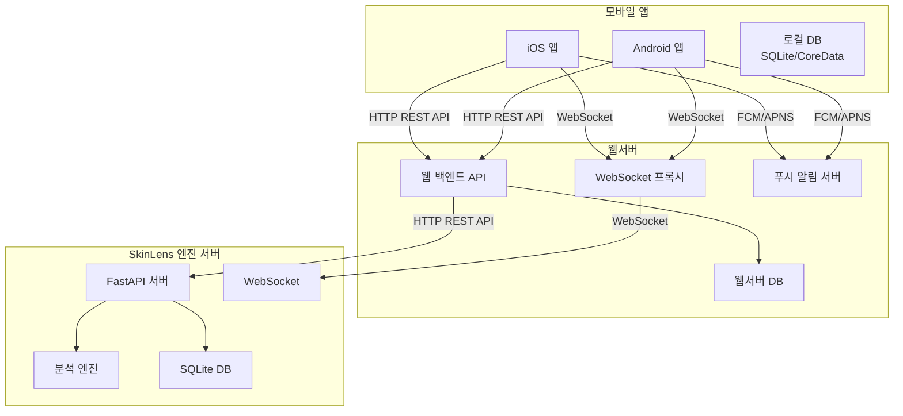

# 모바일 앱 연동 가이드 (Mobile App Integration Guide)

> **문서 버전:** 2.1.0  
> **대상 프로젝트 버전:** 1.0.0  
> **마지막 업데이트:** 2026-06-01  
> **상태:** 활성  
> **대상 독자**: 모바일 앱 개발자 (iOS, Android)

---

## 개요

이 문서는 스마트폰 앱(iOS/Android)과 SkinLens 웹서버를 연동하기 위한 절차, API 참조, 데이터 포맷, 오류 처리 방법을 설명합니다. 로그인부터 시작하여 단계별 연동 절차를 자세히 안내합니다.

**연동 목표:**
- 모바일 앱에서 웹서버로 로그인 및 인증
- 모바일 앱에서 웹서버로 피부 분석 요청 전송
- 웹서버에서 엔진 서버로 분석 요청 위임
- 엔진 서버에서 분석 결과를 웹서버로 전송
- 웹서버에서 모바일 앱으로 결과 전달
- 실시간 진행률 추적 (WebSocket)
- 푸시 알림 수신
- 오프라인 모드 지원

---

## 1. 시스템 아키텍처

### 1.1 연동 아키텍처



### 1.2 통신 흐름

1. **모바일 앱 → 웹서버**: 분석 요청 전송 (이미지 + 고객 정보)
2. **웹서버 → 엔진 서버**: 분석 요청 위임
3. **엔진 서버**: 이미지 분석 수행
4. **엔진 서버 → 웹서버**: 분석 결과 전송
5. **웹서버 → 모바일 앱**: 결과 전달 또는 푸시 알림

### 1.3 통신 프로토콜

| 통신 유형 | 프로토콜 | 포트 | 용도 |
|----------|----------|------|------|
| REST API (모바일-웹서버) | HTTP/HTTPS | 80/443 | 분석 요청/조회 |
| REST API (웹서버-엔진) | HTTP/HTTPS | 8000 | 분석 위임 |
| WebSocket (모바일-웹서버) | WS/WSS | 80/443 | 실시간 진행률 |
| WebSocket (웹서버-엔진) | WS/WSS | 8000 | 진행률 프록시 |
| 푸시 알림 | FCM/APNS | - | 분석 완료 알림 |
| 인증 | JWT Bearer Token | - | API 인증 |

---

## 2. 사전 요구사항

### 2.1 웹서버 정보

**기본 정보:**
- **Base URL**: `http://localhost:80` (개발), `https://api.skinlens.com` (프로덕션)
- **API 버전**: v1
- **인증 방식**: JWT Bearer Token
- **Content-Type**: `application/json`, `multipart/form-data`

**웹서버 상태 확인:**
```bash
# 헬스 체크
curl http://localhost:80/health

# 예상 응답
{
  "status": "healthy",
  "version": "1.0.0",
  "timestamp": "2026-06-01T12:00:00Z"
}
```

### 2.2 엔진 서버 정보

**기본 정보:**
- **Base URL**: `http://localhost:8000` (개발), `https://engine.skinlens.com` (프로덕션)
- **API 버전**: v1
- **인증 방식**: JWT Bearer Token (웹서버에서 관리)
- **Content-Type**: `application/json`, `multipart/form-data`

**참고**: 엔진 서버는 웹서버에서 직접 접근하며, 모바일 앱은 웹서버를 통해서만 간접적으로 접근합니다.

### 2.3 모바일 앱 요구사항

**기술 스택:**
- **iOS**: Swift 5.0+, URLSession, Starscream (WebSocket)
- **Android**: Kotlin 1.5+, Retrofit, OkHttp, OkHttp WebSocket
- **공통**: JWT 토큰 관리, 이미지 압축, 비동기 처리

**필요한 정보:**
- 웹서버 API 키 또는 인증 정보
- FCM/APNS 토큰 (푸시 알림용)
- 앱 내 사용자 ID 매핑

### 2.4 네트워크 요구사항

- **방화벽**: 웹서버 포트 (80/443) 개방
- **DNS**: 웹서버 도메인 해결
- **SSL**: 프로덕션 환경 HTTPS 사용
- **타임아웃**: 요청 타임아웃 30초 이상 설정

---

## 3. 연동 절차

### 3.1 1단계: 인증 설정

이 단계에서는 모바일 앱에서 웹서버에 로그인하여 JWT 토큰을 발급받고, 토큰을 안전하게 저장하는 절차를 설명합니다.

#### 3.1.1 사용자 등록

모바일 앱에서 웹서버에 사용자를 등록합니다. 이는 최초 1회만 수행합니다.

**API 엔드포인트:** `POST /v1/auth/register`

**요청:**
```json
{
  "username": "user001",
  "password": "secure_password",
  "email": "user@example.com"
}
```

**응답:**
```json
{
  "user_id": "USER001",
  "username": "user001",
  "message": "User registered successfully"
}
```

**iOS 구현 예시 (Swift):**
```swift
import Foundation

class AuthManager {
    static let shared = AuthManager()
    private let baseURL = "http://localhost:80"  // 웹서버 URL
    
    func register(username: String, password: String, email: String, completion: @escaping (Result<String, Error>) -> Void) {
        let url = URL(string: "\(baseURL)/v1/auth/register")!
        var request = URLRequest(url: url)
        request.httpMethod = "POST"
        request.setValue("application/json", forHTTPHeaderField: "Content-Type")
        
        let body = ["username": username, "password": password, "email": email]
        request.httpBody = try? JSONSerialization.data(withJSONObject: body)
        
        URLSession.shared.dataTask(with: request) { data, response, error in
            if let error = error {
                completion(.failure(error))
                return
            }
            
            guard let httpResponse = response as? HTTPURLResponse else {
                completion(.failure(NSError(domain: "Auth", code: -1, userInfo: nil)))
                return
            }
            
            if httpResponse.statusCode == 200 {
                completion(.success("Registration successful"))
            } else {
                completion(.failure(NSError(domain: "Auth", code: httpResponse.statusCode, userInfo: nil)))
            }
        }.resume()
    }
}
```

**Android 구현 예시 (Kotlin):**
```kotlin
import retrofit2.Retrofit
import retrofit2.converter.gson.GsonConverterFactory
import retrofit2.http.Body
import retrofit2.http.POST

data class RegisterRequest(val username: String, val password: String, val email: String)
data class RegisterResponse(val user_id: String, val username: String, val message: String)

interface AuthApi {
    @POST("v1/auth/register")
    suspend fun register(@Body request: RegisterRequest): RegisterResponse
}

class AuthManager(private val context: Context) {
    private val baseURL = "http://localhost:80"  // 웹서버 URL
    private val retrofit = Retrofit.Builder()
        .baseUrl(baseURL)
        .addConverterFactory(GsonConverterFactory.create())
        .build()
    
    private val authApi = retrofit.create(AuthApi::class.java)
    
    suspend fun register(username: String, password: String, email: String): Result<String> {
        return try {
            val response = authApi.register(RegisterRequest(username, password, email))
            Result.success(response.message)
        } catch (e: Exception) {
            Result.failure(e)
        }
    }
}
```

#### 3.1.2 로그인 및 JWT 토큰 발급

등록된 사용자로 로그인하여 JWT 토큰을 발급받습니다. 이 토큰은 이후 모든 API 요청에 사용됩니다.

**API 엔드포인트:** `POST /v1/auth/login`

**요청:**
```json
{
  "username": "user001",
  "password": "secure_password"
}
```

**응답:**
```json
{
  "access_token": "eyJhbGciOiJIUzI1NiIsInR5cCI6IkpXVCJ9...",
  "refresh_token": "eyJhbGciOiJIUzI1NiIsInR5cCI6IkpXVCJ9...",
  "token_type": "bearer",
  "expires_in": 3600
}
```

**토큰 설명:**
- **access_token**: API 요청에 사용하는 토큰 (만료: 1시간)
- **refresh_token**: access_token 갱신에 사용하는 토큰 (만료: 30일)
- **token_type**: 토큰 타입 (bearer)
- **expires_in**: access_token 만료 시간 (초)

#### 3.1.3 토큰 저장

발급받은 토큰을 안전하게 저장합니다. iOS는 Keychain, Android는 EncryptedSharedPreferences를 사용합니다.

**iOS 구현 예시 (Swift) - Keychain 저장:**
```swift
import Security

class KeychainManager {
    static let shared = KeychainManager()
    
    private let service = "com.skinlens.auth"
    
    func save(key: String, value: String) {
        let data = value.data(using: .utf8)!
        let query: [String: Any] = [
            kSecClass as String: kSecClassGenericPassword,
            kSecAttrService as String: service,
            kSecAttrAccount as String: key,
            kSecValueData as String: data
        ]
        
        SecItemDelete(query as CFDictionary)
        SecItemAdd(query as CFDictionary, nil)
    }
    
    func get(key: String) -> String? {
        let query: [String: Any] = [
            kSecClass as String: kSecClassGenericPassword,
            kSecAttrService as String: service,
            kSecAttrAccount as String: key,
            kSecReturnData as String: true
        ]
        
        var result: AnyObject?
        let status = SecItemCopyMatching(query as CFDictionary, &result)
        
        if status == errSecSuccess, let data = result as? Data {
            return String(data: data, encoding: .utf8)
        }
        return nil
    }
    
    func delete(key: String) {
        let query: [String: Any] = [
            kSecClass as String: kSecClassGenericPassword,
            kSecAttrService as String: service,
            kSecAttrAccount as String: key
        ]
        SecItemDelete(query as CFDictionary)
    }
}
```

**Android 구현 예시 (Kotlin) - EncryptedSharedPreferences 저장:**
```kotlin
import android.content.Context
import android.security.keystore.KeyGenParameterSpec
import android.security.keystore.KeyProperties
import androidx.security.crypto.EncryptedSharedPreferences
import androidx.security.crypto.MasterKey

class TokenManager(private val context: Context) {
    
    private val masterKey = MasterKey.Builder(context)
        .setKeyScheme(MasterKey.KeyScheme.AES256_GCM)
        .build()
    
    private val sharedPreferences = EncryptedSharedPreferences.create(
        context,
        "skinlens_auth",
        masterKey,
        EncryptedSharedPreferences.PrefKeyEncryptionScheme.AES256_SIV,
        EncryptedSharedPreferences.PrefValueEncryptionScheme.AES256_GCM
    )
    
    fun saveAccessToken(token: String) {
        sharedPreferences.edit().putString("access_token", token).apply()
    }
    
    fun saveRefreshToken(token: String) {
        sharedPreferences.edit().putString("refresh_token", token).apply()
    }
    
    fun getAccessToken(): String? {
        return sharedPreferences.getString("access_token", null)
    }
    
    fun getRefreshToken(): String? {
        return sharedPreferences.getString("refresh_token", null)
    }
    
    fun clearTokens() {
        sharedPreferences.edit().clear().apply()
    }
}
```

#### 3.1.4 토큰 갱신

access_token이 만료되면 refresh_token을 사용하여 갱신합니다.

**API 엔드포인트:** `POST /v1/auth/refresh`

**요청 헤더:**
```
Authorization: Bearer <refresh_token>
```

**응답:**
```json
{
  "access_token": "eyJhbGciOiJIUzI1NiIsInR5cCI6IkpXVCJ9...",
  "token_type": "bearer",
  "expires_in": 3600
}
```

**iOS 구현 예시 (Swift):**
```swift
func refreshAccessToken(completion: @escaping (Result<String, Error>) -> Void) {
    guard let refreshToken = KeychainManager.shared.get(key: "refresh_token") else {
        completion(.failure(NSError(domain: "Auth", code: -1, userInfo: [NSLocalizedDescriptionKey: "No refresh token"])))
        return
    }
    
    let url = URL(string: "\(baseURL)/v1/auth/refresh")!
    var request = URLRequest(url: url)
    request.httpMethod = "POST"
    request.setValue("Bearer \(refreshToken)", forHTTPHeaderField: "Authorization")
    
    URLSession.shared.dataTask(with: request) { data, response, error in
        if let error = error {
            completion(.failure(error))
            return
        }
        
        guard let data = data,
              let json = try? JSONSerialization.jsonObject(with: data) as? [String: Any],
              let accessToken = json["access_token"] as? String else {
            completion(.failure(NSError(domain: "Auth", code: -1, userInfo: nil)))
            return
        }
        
        // 새 토큰 저장
        KeychainManager.shared.save(key: "access_token", value: accessToken)
        
        completion(.success(accessToken))
    }.resume()
}
```

**Android 구현 예시 (Kotlin):**
```kotlin
suspend fun refreshAccessToken(): Result<String> {
    val refreshToken = tokenManager.getRefreshToken() ?: return Result.failure(Exception("No refresh token"))
    
    return try {
        val response = authApi.refreshToken("Bearer $refreshToken")
        tokenManager.saveAccessToken(response.access_token)
        Result.success(response.access_token)
    } catch (e: Exception) {
        Result.failure(e)
    }
}
```

#### 3.1.5 로그아웃

로그아웃 시 저장된 토큰을 삭제합니다.

**iOS 구현 예시 (Swift):**
```swift
func logout() {
    KeychainManager.shared.delete(key: "access_token")
    KeychainManager.shared.delete(key: "refresh_token")
}
```

**Android 구현 예시 (Kotlin):**
```kotlin
fun logout() {
    tokenManager.clearTokens()
}
```

#### 3.1.6 전체 인증 매니저 구현 (iOS)

```swift
import Foundation

class AuthManager {
    static let shared = AuthManager()
    
    private var accessToken: String?
    private var refreshToken: String?
    private let baseURL = "http://localhost:80"  // 웹서버 URL
    
    private init() {
        // 저장된 토큰 로드
        accessToken = KeychainManager.shared.get(key: "access_token")
        refreshToken = KeychainManager.shared.get(key: "refresh_token")
    }
    
    func login(username: String, password: String, completion: @escaping (Result<String, Error>) -> Void) {
        let url = URL(string: "\(baseURL)/v1/auth/login")!
        var request = URLRequest(url: url)
        request.httpMethod = "POST"
        request.setValue("application/json", forHTTPHeaderField: "Content-Type")
        
        let body = ["username": username, "password": password]
        request.httpBody = try? JSONSerialization.data(withJSONObject: body)
        
        URLSession.shared.dataTask(with: request) { data, response, error in
            if let error = error {
                completion(.failure(error))
                return
            }
            
            guard let data = data,
                  let json = try? JSONSerialization.jsonObject(with: data) as? [String: Any],
                  let accessToken = json["access_token"] as? String else {
                completion(.failure(NSError(domain: "Auth", code: -1, userInfo: nil)))
                return
            }
            
            self.accessToken = accessToken
            self.refreshToken = json["refresh_token"] as? String
            
            // 토큰 저장 (Keychain)
            KeychainManager.shared.save(key: "access_token", value: accessToken)
            if let refreshToken = self.refreshToken {
                KeychainManager.shared.save(key: "refresh_token", value: refreshToken)
            }
            
            completion(.success(accessToken))
        }.resume()
    }
    
    func refreshAccessToken(completion: @escaping (Result<String, Error>) -> Void) {
        guard let refreshToken = refreshToken else {
            completion(.failure(NSError(domain: "Auth", code: -1, userInfo: [NSLocalizedDescriptionKey: "No refresh token"])))
            return
        }
        
        let url = URL(string: "\(baseURL)/v1/auth/refresh")!
        var request = URLRequest(url: url)
        request.httpMethod = "POST"
        request.setValue("Bearer \(refreshToken)", forHTTPHeaderField: "Authorization")
        
        URLSession.shared.dataTask(with: request) { data, response, error in
            if let error = error {
                completion(.failure(error))
                return
            }
            
            guard let data = data,
                  let json = try? JSONSerialization.jsonObject(with: data) as? [String: Any],
                  let accessToken = json["access_token"] as? String else {
                completion(.failure(NSError(domain: "Auth", code: -1, userInfo: nil)))
                return
            }
            
            self.accessToken = accessToken
            KeychainManager.shared.save(key: "access_token", value: accessToken)
            
            completion(.success(accessToken))
        }.resume()
    }
    
    func logout() {
        accessToken = nil
        refreshToken = nil
        KeychainManager.shared.delete(key: "access_token")
        KeychainManager.shared.delete(key: "refresh_token")
    }
    
    func getAccessToken() -> String? {
        return accessToken
    }
    
    func isAuthenticated() -> Bool {
        return accessToken != nil
    }
}
```

#### 3.1.7 전체 인증 매니저 구현 (Android)

```kotlin
import android.content.Context
import retrofit2.Retrofit
import retrofit2.converter.gson.GsonConverterFactory
import retrofit2.http.Body
import retrofit2.http.Header
import retrofit2.http.POST

data class LoginRequest(val username: String, val password: String)
data class LoginResponse(val access_token: String, val refresh_token: String)
data class RefreshResponse(val access_token: String)

interface AuthApi {
    @POST("v1/auth/login")
    suspend fun login(@Body request: LoginRequest): LoginResponse
    
    @POST("v1/auth/refresh")
    suspend fun refreshToken(@Header("Authorization") authHeader: String): RefreshResponse
}

class AuthManager(private val context: Context) {
    private val baseURL = "http://localhost:80"  // 웹서버 URL
    private val retrofit = Retrofit.Builder()
        .baseUrl(baseURL)
        .addConverterFactory(GsonConverterFactory.create())
        .build()
    
    private val authApi = retrofit.create(AuthApi::class.java)
    private val tokenManager = TokenManager(context)
    
    suspend fun login(username: String, password: String): Result<String> {
        return try {
            val response = authApi.login(LoginRequest(username, password))
            tokenManager.saveAccessToken(response.access_token)
            tokenManager.saveRefreshToken(response.refresh_token)
            Result.success(response.access_token)
        } catch (e: Exception) {
            Result.failure(e)
        }
    }
    
    suspend fun refreshAccessToken(): Result<String> {
        val refreshToken = tokenManager.getRefreshToken() ?: return Result.failure(Exception("No refresh token"))
        
        return try {
            val response = authApi.refreshToken("Bearer $refreshToken")
            tokenManager.saveAccessToken(response.access_token)
            Result.success(response.access_token)
        } catch (e: Exception) {
            Result.failure(e)
        }
    }
    
    fun logout() {
        tokenManager.clearTokens()
    }
    
    fun getAccessToken(): String? {
        return tokenManager.getAccessToken()
    }
    
    fun isAuthenticated(): Boolean {
        return tokenManager.getAccessToken() != null
    }
}
```

### 3.1.8 1단계 문제 해결

#### 일반적인 문제 및 해결 방법

| 문제 | 원인 | 해결 방법 | 트러블슈팅 가이드 참조 |
|------|------|----------|----------------------|
| 로그인 실패 (401) | 비밀번호 불일치 | 비밀번호 확인 및 재입력 | [2.3.1 로그인 실패](TROUBLESHOOTING_GUIDE.md#231-로그인-실패) |
| 토큰 만료 (401) | 토큰 유효기간 초과 | 토큰 갱신 로직 구현 | [2.3.2 토큰 만료](TROUBLESHOOTING_GUIDE.md#232-토큰-만료) |
| 네트워크 오류 | 인터넷 연결 없음 | 네트워크 상태 확인 후 재시도 | [2.2.1 인터넷 연결 없음](TROUBLESHOOTING_GUIDE.md#221-인터넷-연결-없음) |
| 토큰 저장 실패 | Keychain/SharedPreferences 오류 | 저장 권한 확인 | [2.3 인증 관련 문제](TROUBLESHOOTING_GUIDE.md#23-인증-관련-문제) |

#### 참조 소스 파일

| 파일 | 경로 | 설명 |
|------|------|------|
| 인증 의존성 | `src/server/deps/auth.py` | JWT 토큰 생성 및 검증 로직 |
| 인증 라우터 | `src/server/routers/auth.py` | 로그인, 토큰 갱신 API 구현 |
| 설정 파일 | `config/config.json` | JWT 만료 시간, 비밀키 설정 |

#### 참조 테스트 파일

| 파일 | 경로 | 설명 |
|------|------|------|
| 인증 API 테스트 | `tests/test_auth_api.py` | 로그인, 토큰 갱신 테스트 |
| 인증 의존성 테스트 | `tests/test_server.py` | JWT 토큰 검증 테스트 |

#### 참조 문서

| 문서 | 경로 | 설명 |
|------|------|------|
| API 레퍼런스 | `docs/api/API_REFERENCE.md` | 인증 API 상세 스펙 |
| 보안 가이드 | `docs/ops/SECURITY_GUIDE.md` | 인증 보안 정책 |
| 트러블슈팅 가이드 | `docs/guides/TROUBLESHOOTING_GUIDE.md` | 인증 문제 해결 |

### 3.2 2단계: 이미지 업로드 및 분석 요청

#### 3.2.1 이미지 압축

모바일 앞에서 이미지를 압축하여 업로드 시간을 단축합니다.

**iOS 구현 예시 (Swift):**
```swift
import UIKit

func compressImage(_ image: UIImage, maxSizeKB: Int = 1024) -> Data? {
    var compression: CGFloat = 1.0
    var imageData = image.jpegData(compressionQuality: compression)
    
    while let data = imageData, data.count > maxSizeKB * 1024 && compression > 0.1 {
        compression -= 0.1
        imageData = image.jpegData(compressionQuality: compression)
    }
    
    return imageData
}
```

**Android 구현 예시 (Kotlin):**
```kotlin
import android.graphics.Bitmap
import java.io.ByteArrayOutputStream

fun compressImage(bitmap: Bitmap, maxSizeKB: Int = 1024): ByteArray {
    val outputStream = ByteArrayOutputStream()
    var quality = 100
    
    while (outputStream.size() > maxSizeKB * 1024 && quality > 10) {
        outputStream.reset()
        bitmap.compress(Bitmap.CompressFormat.JPEG, quality, outputStream)
        quality -= 10
    }
    
    return outputStream.toByteArray()
}
```

#### 3.2.2 분석 작업 생성

모바일 앱에서 웹서버로 분석 요청을 보냅니다. 웹서버는 이 요청을 엔진 서버로 위임합니다.

**API 엔드포인트:** `POST /v1/analysis/jobs`

**요청 파라미터:**
```json
{
  "customer_id": "CUST001",
  "customer_name": "홍길동",
  "customer_contact": "010-1234-5678",
  "customer_address": "서울시 강남구",
  "gender": "female",
  "age": 30,
  "do_restore": true,
  "llm_report": false
}
```

**iOS 구현 예시 (Swift):**
```swift
import UIKit

class AnalysisManager {
    private let baseURL = "http://localhost:80"  // 웹서버 URL
    private var accessToken: String?
    
    func createAnalysisJob(image: UIImage, customerData: [String: Any], completion: @escaping (Result<String, Error>) -> Void) {
        let url = URL(string: "\(baseURL)/v1/analysis/jobs")!
        
        let boundary = "Boundary-\(UUID().uuidString)"
        var request = URLRequest(url: url)
        request.httpMethod = "POST"
        request.setValue("multipart/form-data; boundary=\(boundary)", forHTTPHeaderField: "Content-Type")
        request.setValue("Bearer \(accessToken ?? "")", forHTTPHeaderField: "Authorization")
        
        var body = Data()
        
        // 이미지 추가
        if let imageData = image.jpegData(compressionQuality: 0.8) {
            body.append("--\(boundary)\r\n".data(using: .utf8)!)
            body.append("Content-Disposition: form-data; name=\"image\"; filename=\"image.jpg\"\r\n".data(using: .utf8)!)
            body.append("Content-Type: image/jpeg\r\n\r\n".data(using: .utf8)!)
            body.append(imageData)
            body.append("\r\n".data(using: .utf8)!)
        }
        
        // 필드 추가
        for (key, value) in customerData {
            body.append("--\(boundary)\r\n".data(using: .utf8)!)
            body.append("Content-Disposition: form-data; name=\"\(key)\"\r\n\r\n".data(using: .utf8)!)
            body.append("\(value)\r\n".data(using: .utf8)!)
        }
        
        body.append("--\(boundary)--\r\n".data(using: .utf8)!)
        request.httpBody = body
        
        URLSession.shared.dataTask(with: request) { data, response, error in
            if let error = error {
                completion(.failure(error))
                return
            }
            
            guard let data = data,
                  let json = try? JSONSerialization.jsonObject(with: data) as? [String: Any],
                  let jobId = json["job_id"] as? String else {
                completion(.failure(NSError(domain: "API", code: -1, userInfo: nil)))
                return
            }
            
            completion(.success(jobId))
        }.resume()
    }
}
```

**Android 구현 예시 (Kotlin):**
```kotlin
import okhttp3.MultipartBody
import okhttp3.RequestBody
import java.io.File

class AnalysisManager(private val context: Context) {
    private val baseURL = "http://localhost:80"  // 웹서버 URL
    private val okHttpClient = OkHttpClient()
    
    fun createAnalysisJob(imageFile: File, customerData: Map<String, String>, accessToken: String): Result<String> {
        return try {
            val requestBody = MultipartBody.Builder()
                .setType(MultipartBody.FORM)
                .addFormDataPart("image", imageFile.name, RequestBody.create(MultipartBody.FORM, imageFile))
            
            customerData.forEach { (key, value) ->
                requestBody.addFormDataPart(key, value)
            }
            
            val request = Request.Builder()
                .url("$baseURL/v1/analysis/jobs")
                .addHeader("Authorization", "Bearer $accessToken")
                .post(requestBody.build())
                .build()
            
            val response = okHttpClient.newCall(request).execute()
            val json = JSONObject(response.body?.string() ?: "")
            
            Result.success(json.getString("job_id"))
        } catch (e: Exception) {
            Result.failure(e)
        }
    }
}
```

### 3.2.9 2단계 문제 해결

#### 일반적인 문제 및 해결 방법

| 문제 | 원인 | 해결 방법 | 트러블슈팅 가이드 참조 |
|------|------|----------|----------------------|
| 413 Payload Too Large | 파일 크기 초과 | 이미지 압축 (1MB 이하) | [2.4.1 파일 크기 초과](TROUBLESHOOTING_GUIDE.md#241-파일-크기-초과) |
| 415 Unsupported Media Type | 지원하지 않는 형식 | JPG/PNG/WEBP로 변환 | [2.4.2 파일 형식 지원 안 함](TROUBLESHOOTING_GUIDE.md#242-파일-형식-지원-안-함) |
| 422 Unprocessable Entity | 필수 필드 누락 | customer_name, customer_contact, customer_address 확인 | [2.2.2 서버 연결 실패](TROUBLESHOOTING_GUIDE.md#222-서버-연결-실패) |
| 업로드 타임아웃 | 네트워크 느림 | 이미지 압축 및 타임아웃 증가 | [2.2 네트워크 관련 문제](TROUBLESHOOTING_GUIDE.md#22-네트워크-관련-문제) |

#### 참조 소스 파일

| 파일 | 경로 | 설명 |
|------|------|------|
| 분석 라우터 | `src/server/routers/jobs.py` | 분석 작업 생성 API 구현 |
| 작업 큐 | `src/pipeline/job_queue.py` | 비동기 작업 큐 관리 |
| 파이프라인 코어 | `src/pipeline/pipeline_core.py` | 분석 파이프라인 실행 로직 |

#### 참조 테스트 파일

| 파일 | 경로 | 설명 |
|------|------|------|
| 분석 API 테스트 | `tests/test_server.py` | 작업 생성 테스트 |
| 업로드 테스트 | `tests/test_upload.py` | 파일 업로드 테스트 |

#### 참조 문서

| 문서 | 경로 | 설명 |
|------|------|------|
| API 레퍼런스 | `docs/api/API_REFERENCE.md` | 분석 API 상세 스펙 |
| 트러블슈팅 가이드 | `docs/guides/TROUBLESHOOTING_GUIDE.md` | 파일 업로드 문제 해결 |

### 3.3 3단계: 실시간 진행률 추적 (WebSocket)

#### 3.3.1 WebSocket 연결

모바일 앱에서 웹서버의 WebSocket 프록시를 통해 엔진 서버의 진행률을 실시간으로 추적합니다.

**iOS 구현 예시 (Swift) - Starscream:**
```swift
import Starscream

class ProgressManager: WebSocketDelegate {
    var socket: WebSocket?
    private let baseURL = "http://localhost:80"  // 웹서버 URL
    
    func connectWebSocket(jobId: String, accessToken: String) {
        var request = URLRequest(url: URL(string: "ws://localhost:80/v1/ws/analysis/\(jobId)")!)
        request.setValue("Bearer \(accessToken)", forHTTPHeaderField: "Authorization")
        
        socket = WebSocket(request: request)
        socket?.delegate = self
        socket?.connect()
    }
    
    func didReceive(event: WebSocketEvent, client: WebSocket) {
        switch event {
        case .text(let message):
            if let data = message.data(using: .utf8),
               let json = try? JSONSerialization.jsonObject(with: data) as? [String: Any],
               let type = json["type"] as? String {
                
                switch type {
                case "progress":
                    let progress = json["progress"] as? Int ?? 0
                    let step = json["current_step"] as? String ?? ""
                    print("Progress: \(progress)% - \(step)")
                    
                case "completed":
                    let result = json["result"] as? [String: Any]
                    print("Analysis completed: \(result)")
                    
                case "error":
                    let error = json["error"] as? String ?? "Unknown error"
                    print("Error: \(error)")
                    
                default:
                    break
                }
            }
            
        case .disconnected(let reason, let code):
            print("Disconnected: \(reason) with code: \(code)")
            
        default:
            break
        }
    }
}
```

**Android 구현 예시 (Kotlin) - OkHttp WebSocket:**
```kotlin
import okhttp3.OkHttpClient
import okhttp3.Request
import okhttp3.Response
import okhttp3.WebSocket
import okhttp3.WebSocketListener
import org.json.JSONObject

class ProgressManager(private val accessToken: String) {
    private val baseURL = "http://localhost:80"  // 웹서버 URL
    private val client = OkHttpClient()
    private var webSocket: WebSocket? = null
    
    fun connectWebSocket(jobId: String) {
        val request = Request.Builder()
            .url("ws://localhost:80/v1/ws/analysis/$jobId")
            .addHeader("Authorization", "Bearer $accessToken")
            .build()
        
        val listener = object : WebSocketListener() {
            override fun onMessage(webSocket: WebSocket, text: String) {
                val json = JSONObject(text)
                val type = json.getString("type")
                
                when (type) {
                    "progress" -> {
                        val progress = json.getInt("progress")
                        val step = json.getString("current_step")
                        println("Progress: $progress% - $step")
                    }
                    "completed" -> {
                        val result = json.getJSONObject("result")
                        println("Analysis completed: $result")
                    }
                    "error" -> {
                        val error = json.getString("error")
                        println("Error: $error")
                    }
                }
            }
            
            override fun onClosing(webSocket: WebSocket, code: Int, reason: String) {
                println("Closing: $code - $reason")
            }
        }
        
        webSocket = client.newWebSocket(request, listener)
    }
}
```

### 3.3.8 3단계 문제 해결

#### 일반적인 문제 및 해결 방법

| 문제 | 원인 | 해결 방법 | 트러블슈팅 가이드 참조 |
|------|------|----------|----------------------|
| WebSocket 연결 실패 | 인증 토큰 만료 | 토큰 갱신 후 재연결 | [2.5.1 WebSocket 연결 실패](TROUBLESHOOTING_GUIDE.md#251-websocket-연결-실패) |
| 연결 끊김 (백그라운드) | 앱 백그라운드 전환 | Foreground Service 사용 | [2.5.2 백그라운드 연결 끊김](TROUBLESHOOTING_GUIDE.md#252-백그라운드-연결-끊김) |
| 메시지 수신 안 됨 | Job ID 오류 | Job ID 확인 | [2.5 WebSocket 관련 문제](TROUBLESHOOTING_GUIDE.md#25-websocket-관련-문제) |
| 배터리 소모 과다 | 지속적 연결 | 폴링 방식으로 전환 | [3.2 모바일 앱 모니터링 지표](TROUBLESHOOTING_GUIDE.md#32-모바일-앱-모니터링-지표) |

#### 참조 소스 파일

| 파일 | 경로 | 설명 |
|------|------|------|
| WebSocket 관리자 | `src/server/websocket_manager.py` | WebSocket 연결 관리 |
| WebSocket 라우터 | `src/server/routers/websocket.py` | WebSocket 엔드포인트 구현 |

#### 참조 테스트 파일

| 파일 | 경로 | 설명 |
|------|------|------|
| WebSocket 테스트 | `tests/test_websocket_management.py` | WebSocket 연결 테스트 |

#### 참조 문서

| 문서 | 경로 | 설명 |
|------|------|------|
| API 레퍼런스 | `docs/api/API_REFERENCE.md` | WebSocket API 상세 스펙 |
| 트러블슈팅 가이드 | `docs/guides/TROUBLESHOOTING_GUIDE.md` | 네트워크 문제 해결 |

### 3.4 4단계: 결과 데이터 처리 및 저장

#### 3.4.1 결과 데이터 구조

```json
{
  "job_id": "550e8400-e29b-41d4-a716-446655440000",
  "status": "completed",
  "result": {
    "overall_score": 75.5,
    "overall_score_report": 80.0,
    "measurements": {
      "pigmentation": 70,
      "redness": 65,
      "pores": 80
    },
    "restored_image_url": "/runtime/results/.../restored.jpg",
    "original_image_url": "/runtime/results/.../original.jpg"
  },
  "created_at": "2026-06-01T12:00:00Z",
  "completed_at": "2026-06-01T12:00:10Z"
}
```

#### 3.4.2 로컬 DB 저장

**iOS 구현 예시 (Swift) - CoreData:**
```swift
import CoreData

func saveAnalysisResult(result: [String: Any], customerId: String) {
    let context = persistentContainer.viewContext
    
    let analysis = Analysis(context: context)
    analysis.jobId = result["job_id"] as? String
    analysis.customerId = customerId
    analysis.overallScore = (result["result"] as? [String: Any])?["overall_score"] as? Double ?? 0.0
    analysis.createdAt = Date()
    
    do {
        try context.save()
    } catch {
        print("Failed to save: \(error)")
    }
}
```

**Android 구현 예시 (Kotlin) - Room:**
```kotlin
@Entity(tableName = "analyses")
data class Analysis(
    @PrimaryKey val jobId: String,
    val customerId: String,
    val overallScore: Double,
    val measurements: String, // JSON
    val createdAt: Long
)

@Dao
interface AnalysisDao {
    @Insert
    fun insert(analysis: Analysis)
    
    @Query("SELECT * FROM analyses WHERE customerId = :customerId")
    fun getAnalysesByCustomer(customerId: String): List<Analysis>
}

fun saveAnalysisResult(result: JSONObject, customerId: String) {
    val analysis = Analysis(
        jobId = result.getString("job_id"),
        customerId = customerId,
        overallScore = result.getJSONObject("result").getDouble("overall_score"),
        measurements = result.getJSONObject("result").getJSONObject("measurements").toString(),
        createdAt = System.currentTimeMillis()
    )
    
    analysisDao.insert(analysis)
}
```

### 3.4.9 4단계 문제 해결

#### 일반적인 문제 및 해결 방법

| 문제 | 원인 | 해결 방법 | 트러블슈팅 가이드 참조 |
|------|------|----------|----------------------|
| 결과 파싱 오류 | JSON 형식 오류 | 응답 구조 확인 | [2.2.2 서버 연결 실패](TROUBLESHOOTING_GUIDE.md#222-서버-연결-실패) |
| DB 저장 실패 | 스키마 불일치 | 로컬 DB 스키마 확인 | [2.7.1 DB 저장 실패](TROUBLESHOOTING_GUIDE.md#271-db-저장-실패) |
| 이미지 다운로드 실패 | URL 오류 | 이미지 URL 확인 | [2.2 네트워크 관련 문제](TROUBLESHOOTING_GUIDE.md#22-네트워크-관련-문제) |
| 동기화 실패 | 네트워크 오류 | 오프라인 모드 지원 | [2.8 오프라인 모드 관련 문제](TROUBLESHOOTING_GUIDE.md#28-오프라인-모드-관련-문제) |

#### 참조 소스 파일

| 파일 | 경로 | 설명 |
|------|------|------|
| 결과 파서 | `src/db/result_parser.py` | 분석 결과 파싱 로직 |
| SafetyNet | `src/skin/scoring/safety_net.py` | 점수 안전성 검증 |

#### 참조 테스트 파일

| 파일 | 경로 | 설명 |
|------|------|------|
| 결과 파서 테스트 | `tests/test_result_parser.py` | 결과 파싱 테스트 |

#### 참조 문서

| 문서 | 경로 | 설명 |
|------|------|------|
| API 레퍼런스 | `docs/api/API_REFERENCE.md` | 결과 데이터 상세 스펙 |
| 데이터 모델 | `docs/db/DATA_MODEL.md` | DB 스키마 및 데이터 모델 |

### 3.5 5단계: 푸시 알림

#### 3.5.1 FCM/APNS 토큰 등록

**API 엔드포인트:** `POST /v1/customer/my/push-token`

**요청:**
```json
{
  "token": "fcm_token_or_apns_token",
  "platform": "ios" // or "android"
}
```

#### 3.5.2 푸시 알림 수신

**iOS 구현 예시 (Swift):**
```swift
import UserNotifications

func setupPushNotifications() {
    UNUserNotificationCenter.current().requestAuthorization(options: [.alert, .sound, .badge]) { granted, error in
        if granted {
            UIApplication.shared.registerForRemoteNotifications()
        }
    }
}

func application(_ application: UIApplication, didRegisterForRemoteNotificationsWithDeviceToken deviceToken: Data) {
    let token = deviceToken.map { String(format: "%02.2hhx", $0) }.joined()
    // 토큰을 서버에 전송
    registerPushToken(token: token)
}
```

**Android 구현 예시 (Kotlin):**
```kotlin
class MyFirebaseMessagingService : FirebaseMessagingService() {
    override fun onNewToken(token: String) {
        // 토큰을 서버에 전송
        registerPushToken(token)
    }
    
    override fun onMessageReceived(remoteMessage: RemoteMessage) {
        // 푸시 알림 처리
        val notification = remoteMessage.notification
        showNotification(notification?.title, notification?.body)
    }
}
```

### 3.5.9 5단계 문제 해결

#### 일반적인 문제 및 해결 방법

| 문제 | 원인 | 해결 방법 | 트러블슈팅 가이드 참조 |
|------|------|----------|----------------------|
| 푸시 알림 수신 안 됨 | 토큰 등록 실패 | 토큰 재등록 | [2.6.1 푸시 알림 수신 안 됨](TROUBLESHOOTING_GUIDE.md#261-푸시-알림-수신-안-됨) |
| 백그라운드에서 알림 안 됨 | 권한 문제 | 알림 권한 확인 | [2.6 푸시 알림 관련 문제](TROUBLESHOOTING_GUIDE.md#26-푸시-알림-관련-문제) |
| 토큰 만료 | FCM/APNS 토큰 갱신 | onNewToken에서 재등록 | [2.6 푸시 알림 관련 문제](TROUBLESHOOTING_GUIDE.md#26-푸시-알림-관련-문제) |

#### 참조 소스 파일

| 파일 | 경로 | 설명 |
|------|------|------|
| 푸시 알림 | `src/notification/push_notifier.py` | 푸시 알림 전송 로직 |

#### 참조 테스트 파일

| 파일 | 경로 | 설명 |
|------|------|------|
| 푸시 알림 테스트 | `tests/test_enhancements_api.py` | 푸시 알림 테스트 |

#### 참조 문서

| 문서 | 경로 | 설명 |
|------|------|------|
| API 레퍼런스 | `docs/api/API_REFERENCE.md` | 푸시 알림 API 상세 스펙 |

---

### 3.6 6단계: PCR 검사 요청 및 결과 확인

이 단계에서는 모바일 앱에서 PCR 검사를 요청하고, 검사 키트 발송, 결과 확인, 전문가 상담 예약 절차를 설명합니다.

#### 3.6.1 PCR 검사 요청

모바일 앱에서 PCR 검사를 요청합니다. 배송지 정보를 제공하면 PCR 검사 키트가 자동으로 발송됩니다.

**API 엔드포인트:** `POST /v1/app/pcr/request`

**요청:**
```json
{
  "customer_id": "CUST001",
  "test_type": "skin_analysis",
  "shipping_address": {
    "recipient": "홍길동",
    "phone": "010-1234-5678",
    "address": "서울시 강남구",
    "zip_code": "12345"
  }
}
```

**응답:**
```json
{
  "request_id": "PCR-abc12345",
  "customer_id": "CUST001",
  "test_type": "skin_analysis",
  "requested_at": "2026-06-01T10:00:00Z",
  "status": "pending",
  "order_id": "ORD-xyz67890",
  "message": "PCR 검사 요청이 생성되었습니다. PCR 검사 키트 주문이 생성되었습니다."
}
```

**iOS 구현 예시 (Swift):**
```swift
struct PCRRequest: Codable {
    let customer_id: String
    let test_type: String
    let shipping_address: ShippingAddress
}

struct ShippingAddress: Codable {
    let recipient: String
    let phone: String
    let address: String
    let zip_code: String
}

struct PCRResponse: Codable {
    let request_id: String
    let customer_id: String
    let test_type: String
    let requested_at: String
    let status: String
    let order_id: String
    let message: String
}

class PCRManager {
    static let shared = PCRManager()
    private let baseURL = "http://localhost:80"
    
    func requestPCR(customerId: String, testType: String, shippingAddress: ShippingAddress, completion: @escaping (Result<PCRResponse, Error>) -> Void) {
        let url = URL(string: "\(baseURL)/v1/app/pcr/request")!
        var request = URLRequest(url: url)
        request.httpMethod = "POST"
        request.setValue("application/json", forHTTPHeaderField: "Content-Type")
        request.setValue("Bearer \(getToken())", forHTTPHeaderField: "Authorization")
        
        let body = PCRRequest(customer_id: customerId, test_type: testType, shipping_address: shippingAddress)
        request.httpBody = try? JSONEncoder().encode(body)
        
        URLSession.shared.dataTask(with: request) { data, response, error in
            if let error = error {
                completion(.failure(error))
                return
            }
            
            guard let data = data else {
                completion(.failure(NSError(domain: "PCR", code: -1, userInfo: nil)))
                return
            }
            
            do {
                let response = try JSONDecoder().decode(PCRResponse.self, from: data)
                completion(.success(response))
            } catch {
                completion(.failure(error))
            }
        }.resume()
    }
}
```

**Android 구현 예시 (Kotlin):**
```kotlin
data class ShippingAddress(
    val recipient: String,
    val phone: String,
    val address: String,
    val zip_code: String
)

data class PCRRequest(
    val customer_id: String,
    val test_type: String,
    val shipping_address: ShippingAddress
)

data class PCRResponse(
    val request_id: String,
    val customer_id: String,
    val test_type: String,
    val requested_at: String,
    val status: String,
    val order_id: String,
    val message: String
)

interface PCRApi {
    @POST("v1/app/pcr/request")
    suspend fun requestPCR(@Body request: PCRRequest): PCRResponse
}

class PCRManager(private val context: Context) {
    private val baseURL = "http://localhost:80"
    private val retrofit = Retrofit.Builder()
        .baseUrl(baseURL)
        .addConverterFactory(GsonConverterFactory.create())
        .build()
    
    private val pcrApi = retrofit.create(PCRApi::class.java)
    
    suspend fun requestPCR(customerId: String, testType: String, shippingAddress: ShippingAddress): Result<PCRResponse> {
        return try {
            val response = pcrApi.requestPCR(PCRRequest(customerId, testType, shippingAddress))
            Result.success(response)
        } catch (e: Exception) {
            Result.failure(e)
        }
    }
}
```

#### 3.6.2 PCR 검사 결과 조회

PCR 검사 결과를 조회합니다.

**API 엔드포인트:** `GET /v1/app/pcr/results/{customer_id}`

**응답:**
```json
{
  "customer_id": "CUST001",
  "total_results": 1,
  "results": [
    {
      "result_id": "PCR-RES-abc12345",
      "request_id": "PCR-abc12345",
      "customer_id": "CUST001",
      "test_data": "{\"microbiome\": {...}, \"inflammation\": {...}}",
      "interpretation": "피부 미생물 불균형 감지됨",
      "completed_at": "2026-06-05T10:00:00Z"
    }
  ]
}
```

#### 3.6.3 PCR 검사 이력 조회

PCR 검사 이력을 조회합니다.

**API 엔드포인트:** `GET /v1/app/pcr/history/{customer_id}`

**응답:**
```json
{
  "customer_id": "CUST001",
  "total_requests": 1,
  "requests": [
    {
      "request_id": "PCR-abc12345",
      "customer_id": "CUST001",
      "test_type": "skin_analysis",
      "requested_at": "2026-06-01T10:00:00Z",
      "status": "completed",
      "updated_at": "2026-06-05T10:00:00Z"
    }
  ]
}
```

#### 3.6.4 전문가 상담 예약

PCR 검사 결과 기반 전문가 상담을 예약합니다.

**API 엔드포인트:** `POST /v1/app/pcr/consultation`

**요청:**
```json
{
  "customer_id": "CUST001",
  "request_id": "PCR-abc12345",
  "scheduled_at": "2026-06-10T14:00:00Z",
  "notes": "미생물 불균형에 대한 상담 희망"
}
```

**응답:**
```json
{
  "consultation_id": "CONS-abc12345",
  "customer_id": "CUST001",
  "request_id": "PCR-abc12345",
  "scheduled_at": "2026-06-10T14:00:00Z",
  "status": "scheduled",
  "created_at": "2026-06-05T10:00:00Z",
  "message": "상담 예약이 생성되었습니다."
}
```

#### 3.6.5 상담 예약 목록 조회

상담 예약 목록을 조회합니다.

**API 엔드포인트:** `GET /v1/app/pcr/consultations/{customer_id}`

**응답:**
```json
{
  "customer_id": "CUST001",
  "total_consultations": 1,
  "consultations": [
    {
      "consultation_id": "CONS-abc12345",
      "customer_id": "CUST001",
      "request_id": "PCR-abc12345",
      "scheduled_at": "2026-06-10T14:00:00Z",
      "notes": "미생물 불균형에 대한 상담 희망",
      "status": "scheduled",
      "created_at": "2026-06-05T10:00:00Z"
    }
  ]
}
```

#### 3.6.6 6단계 문제 해결

| 문제 | 원인 | 해결 방법 | 트러블슈팅 가이드 참조 |
|------|------|----------|----------------------|
| PCR 검사 요청 실패 | 배송지 정보 누락 | shipping_address 필수 확인 | [2.7 PCR 검사 관련 문제](TROUBLESHOOTING_GUIDE.md#27-pcr-검사-관련-문제) |
| 키트 발송 안 됨 | 주문 생성 실패 | order_id 확인 | [2.7 PCR 검사 관련 문제](TROUBLESHOOTING_GUIDE.md#27-pcr-검사-관련-문제) |
| 결과 조회 실패 | request_id 불일치 | 올바른 request_id 사용 | [2.7 PCR 검사 관련 문제](TROUBLESHOOTING_GUIDE.md#27-pcr-검사-관련-문제) |

#### 참조 소스 파일

| 파일 | 경로 | 설명 |
|------|------|------|
| PCR 검사 API | `src/server/routers/app_features.py` | PCR 검사 요청/결과/상담 API |
| PCR 검사 DB | `src/db/skin_analysis_db.py` | PCR 검사 DB 메서드 |

#### 참조 테스트 파일

| 파일 | 경로 | 설명 |
|------|------|------|
| PCR 검사 테스트 | `tests/test_app_features.py` | PCR 검사 API 테스트 |

#### 참조 문서

| 문서 | 경로 | 설명 |
|------|------|------|
| API 레퍼런스 | `docs/api/API_REFERENCE.md` | PCR 검사 API 상세 스펙 |
| 주문 관리 가이드 | `docs/guides/ORDER_MANAGEMENT_GUIDE.md` | PCR 검사 키트 주문 절차 |

---

### 3.7 7단계: 기성품 구매

이 단계에서는 모바일 앱에서 기성품 목록을 조회하고, 기성품을 주문하는 절차를 설명합니다.

#### 3.7.1 기성품 목록 조회

기성품 목록을 조회합니다.

**API 엔드포인트:** `GET /v1/orders/products/ready-made`

**응답:**
```json
{
  "ready_made_products": [
    {
      "product_id": "READY-001",
      "product_name": "기성품 1",
      "category": "기초 화장품",
      "price": 25000.0,
      "stock_quantity": 50,
      "description": "모든 피부 타입에 적합한 기초 화장품"
    },
    {
      "product_id": "READY-002",
      "product_name": "기성품 2",
      "category": "스킨케어",
      "price": 35000.0,
      "stock_quantity": 30,
      "description": "피부 보습 및 영양 공급 스킨케어"
    }
  ],
  "total_products": 2
}
```

**iOS 구현 예시 (Swift):**
```swift
struct ReadyMadeProduct: Codable {
    let product_id: String
    let product_name: String
    let category: String
    let price: Double
    let stock_quantity: Int
    let description: String
}

struct ReadyMadeProductsResponse: Codable {
    let ready_made_products: [ReadyMadeProduct]
    let total_products: Int
}

class ProductManager {
    static let shared = ProductManager()
    private let baseURL = "http://localhost:80"
    
    func getReadyMadeProducts(completion: @escaping (Result<ReadyMadeProductsResponse, Error>) -> Void) {
        let url = URL(string: "\(baseURL)/v1/orders/products/ready-made")!
        var request = URLRequest(url: url)
        request.httpMethod = "GET"
        request.setValue("Bearer \(getToken())", forHTTPHeaderField: "Authorization")
        
        URLSession.shared.dataTask(with: request) { data, response, error in
            if let error = error {
                completion(.failure(error))
                return
            }
            
            guard let data = data else {
                completion(.failure(NSError(domain: "Product", code: -1, userInfo: nil)))
                return
            }
            
            do {
                let response = try JSONDecoder().decode(ReadyMadeProductsResponse.self, from: data)
                completion(.success(response))
            } catch {
                completion(.failure(error))
            }
        }.resume()
    }
}
```

**Android 구현 예시 (Kotlin):**
```kotlin
data class ReadyMadeProduct(
    val product_id: String,
    val product_name: String,
    val category: String,
    val price: Double,
    val stock_quantity: Int,
    val description: String
)

data class ReadyMadeProductsResponse(
    val ready_made_products: List<ReadyMadeProduct>,
    val total_products: Int
)

interface ProductApi {
    @GET("v1/orders/products/ready-made")
    suspend fun getReadyMadeProducts(): ReadyMadeProductsResponse
}

class ProductManager(private val context: Context) {
    private val baseURL = "http://localhost:80"
    private val retrofit = Retrofit.Builder()
        .baseUrl(baseURL)
        .addConverterFactory(GsonConverterFactory.create())
        .build()
    
    private val productApi = retrofit.create(ProductApi::class.java)
    
    suspend fun getReadyMadeProducts(): Result<ReadyMadeProductsResponse> {
        return try {
            val response = productApi.getReadyMadeProducts()
            Result.success(response)
        } catch (e: Exception) {
            Result.failure(e)
        }
    }
}
```

#### 3.7.2 기성품 주문 생성

기성품 주문을 생성합니다.

**API 엔드포인트:** `POST /v1/orders`

**요청:**
```json
{
  "customer_id": "CUST001",
  "items": [
    {
      "product_id": "READY-001",
      "quantity": 2,
      "price": 25000
    }
  ],
  "shipping_address": {
    "recipient": "홍길동",
    "phone": "010-1234-5678",
    "address": "서울시 강남구",
    "zip_code": "06000"
  },
  "payment_method": "credit_card",
  "recommendation_source": "ready_made_product"
}
```

**응답:**
```json
{
  "order_id": "ORD-20260531-1234",
  "status": "pending_payment",
  "total_amount": 50000,
  "created_at": "2026-05-31T10:00:00Z",
  "payment_url": "https://payment.example.com/pay/ORD-20260531-1234"
}
```

#### 3.7.3 7단계 문제 해결

| 문제 | 원인 | 해결 방법 | 트러블슈팅 가이드 참조 |
|------|------|----------|----------------------|
| 기성품 목록 조회 실패 | 인증 토큰 만료 | 토큰 갱신 | [2.1 인증 관련 문제](TROUBLESHOOTING_GUIDE.md#21-인증-관련-문제) |
| 재고 부족 | stock_quantity = 0 | 다른 제품 선택 | [2.8 주문 관련 문제](TROUBLESHOOTING_GUIDE.md#28-주문-관련-문제) |
| 주문 생성 실패 | 배송지 정보 누락 | shipping_address 필수 확인 | [2.8 주문 관련 문제](TROUBLESHOOTING_GUIDE.md#28-주문-관련-문제) |

#### 참조 소스 파일

| 파일 | 경로 | 설명 |
|------|------|------|
| 기성품 API | `src/server/routers/orders.py` | 기성품 목록 조회 API |
| 기성품 DB | `src/db/skin_analysis_db.py` | 기성품 DB 메서드 |

#### 참조 테스트 파일

| 파일 | 경로 | 설명 |
|------|------|------|
| 기성품 테스트 | `tests/test_orders.py` | 기성품 API 테스트 |

#### 참조 문서

| 문서 | 경로 | 설명 |
|------|------|------|
| API 레퍼런스 | `docs/api/API_REFERENCE.md` | 기성품 API 상세 스펙 |
| 주문 관리 가이드 | `docs/guides/ORDER_MANAGEMENT_GUIDE.md` | 기성품 주문 절차 |

---

## 4. 오프라인 모드

### 4.1 오프라인 모드 구현

네트워크 연결이 없을 때 로컬에서 분석 요청을 큐에 저장하고, 연결 복구 시 자동으로 전송합니다.

**iOS 구현 예시 (Swift):**
```swift
class OfflineManager {
    private let queue = DispatchQueue(label: "offline.queue")
    private var pendingRequests: [[String: Any]] = []
    
    func saveRequestForOffline(request: [String: Any]) {
        queue.async {
            self.pendingRequests.append(request)
            UserDefaults.standard.set(self.pendingRequests, forKey: "pendingRequests")
        }
    }
    
    func syncPendingRequests() {
        queue.async {
            for request in self.pendingRequests {
                // 요청 재전송
                self.sendRequest(request)
            }
            self.pendingRequests.removeAll()
            UserDefaults.standard.set(self.pendingRequests, forKey: "pendingRequests")
        }
    }
}
```

**Android 구현 예시 (Kotlin):**
```kotlin
class OfflineManager(private val context: Context) {
    private val prefs = context.getSharedPreferences("offline", Context.MODE_PRIVATE)
    
    fun saveRequestForOffline(request: Map<String, Any>) {
        val requests = getPendingRequests().toMutableList()
        requests.add(request)
        prefs.edit().putStringSet("pending_requests", requests.map { Gson().toJson(it) }.toSet()).apply()
    }
    
    fun syncPendingRequests() {
        val requests = getPendingRequests()
        requests.forEach { request ->
            // 요청 재전송
            sendRequest(request)
        }
        prefs.edit().remove("pending_requests").apply()
    }
    
    private fun getPendingRequests(): List<Map<String, Any>> {
        return prefs.getStringSet("pending_requests", emptySet())?.map { Gson().fromJson(it, Map::class.java) } ?: emptyList()
    }
}
```

---

## 5. 보안 고려사항

### 5.1 인증

- **JWT 토큰**: Keychain(iOS) / EncryptedSharedPreferences(Android)에 저장
- **HTTPS**: 프로덕션 환경에서 필수 사용
- **인증서 고정 (Certificate Pinning)**: MITM 공격 방지

### 5.2 데이터 전송

- **이미지 압축**: 전송 전 압축
- **민감 정보**: 로그에 포함하지 않음
- **암호화**: HTTPS 사용

### 5.3 로컬 데이터

- **암호화**: 로컬 DB 암호화 (SQLCipher, Realm Encryption)
- **권한**: 최소 권한 원칙

---

## 6. API 레퍼런스

### 6.1 주요 API 엔드포인트

| 엔드포인트 | 메서드 | 설명 | 인증 | 대상 |
|-----------|--------|------|------|------|
| `/v1/auth/register` | POST | 사용자 등록 | 불필요 | 웹서버 |
| `/v1/auth/login` | POST | 로그인 및 토큰 발급 | 불필요 | 웹서버 |
| `/v1/auth/refresh` | POST | 토큰 갱신 | 필수 | 웹서버 |
| `/v1/analysis/jobs` | POST | 분석 작업 생성 | 필수 | 웹서버 |
| `/v1/analysis/jobs/{job_id}` | GET | 작업 상태 조회 | 필수 | 웹서버 |
| `/v1/customer/my/analyses` | GET | 내 분석 목록 | 필수 | 웹서버 |
| `/v1/customer/my/push-token` | POST | 푸시 토큰 등록 | 필수 | 웹서버 |
| `/v1/ws/analysis/{job_id}` | WebSocket | 실시간 진행률 | 필수 | 웹서버 (프록시) |

**참고**: 모든 API 호출은 웹서버를 통해 이루어지며, 웹서버는 필요한 경우 엔진 서버로 요청을 위임합니다.

### 6.2 상세 API 문서

상세 API 문서는 다음을 참조하세요:
- **API 레퍼런스**: `docs/api/API_REFERENCE.md`
- **Swagger UI**: `http://localhost:8000/docs` (개발 환경)
- **OpenAPI 스펙**: `http://localhost:8000/openapi.json`

---

## 7. 테스트

### 7.1 단위 테스트

**iOS 테스트 예시 (Swift):**
```swift
import XCTest

class AuthManagerTests: XCTestCase {
    func testLoginSuccess() {
        let authManager = AuthManager.shared
        
        let expectation = self.expectation(description: "Login")
        
        authManager.login(username: "testuser", password: "testpass") { result in
            switch result {
            case .success(let token):
                XCTAssertNotNil(token)
            case .failure:
                XCTFail("Login failed")
            }
            expectation.fulfill()
        }
        
        waitForExpectations(timeout: 5.0)
    }
}
```

**Android 테스트 예시 (Kotlin):**
```kotlin
import org.junit.Test
import org.junit.Assert.*

class AuthManagerTest {
    @Test
    fun testLoginSuccess() = runBlocking {
        val authManager = AuthManager(context)
        val result = authManager.login("testuser", "testpass")
        
        assertTrue(result.isSuccess)
        assertNotNull(result.getOrNull())
    }
}
```

---

## 8. 모니터링 및 로깅

### 8.1 로깅

**iOS 구현 예시 (Swift):**
```swift
import os.log

let logger = OSLog(subsystem: "com.skinlens.app", category: "API")

func logAPICall(endpoint: String, method: String, statusCode: Int) {
    os_log("API Call: %{public}@ %{public}@ - Status: %d", log: logger, type: .info, method, endpoint, statusCode)
}
```

**Android 구현 예시 (Kotlin):**
```kotlin
import android.util.Log

fun logAPICall(endpoint: String, method: String, statusCode: Int) {
    Log.d("SkinLensAPI", "API Call: $method $endpoint - Status: $statusCode")
}
```

### 8.2 모니터링 지표

| 지표 | 설명 | 정상 범위 |
|------|------|----------|
| API 응답 시간 | 엔진 서버 API 응답 시간 | < 5초 |
| 분석 완료 시간 | 전체 분석 시간 | < 30초 |
| 에러율 | API 호출 실패율 | < 5% |
| 배터리 소모 | 분석 중 배터리 소모 | < 10% |

---

## 9. 참조 문서

### 9.1 필수 참조 문서

| 문서 | 경로 | 설명 |
|------|------|------|
| API 레퍼런스 | `docs/api/API_REFERENCE.md` | 전체 API 엔드포인트 상세 |
| 아키텍처 | `docs/guides/ARCHITECTURE.md` | 시스템 아키텍처 |
| 데이터 모델 | `docs/db/DATA_MODEL.md` | DB 스키마 및 데이터 모델 |
| 보안 가이드 | `docs/ops/SECURITY_GUIDE.md` | 보안 정책 및 가이드라인 |
| 트러블슈팅 가이드 | `docs/guides/TROUBLESHOOTING_GUIDE.md` | 문제 해결 가이드 |

### 9.2 추가 참조 문서

| 문서 | 경로 | 설명 |
|------|------|------|
| 통신 프로토콜 | `docs/guides/PROTOCOL.md` | 통신 프로토콜 상세 |
| 테스트 가이드 | `docs/guides/TESTING_GUIDE.md` | 테스트 방법 |

---

## 10. 연락처

### 10.1 기술 지원

| 역할 | 이름 | 연락처 |
|------|------|--------|
| 모바일 개발팀 리드 | - | - |
| API 담당자 | - | - |
| DevOps 엔지니어 | - | - |

### 10.2 긴급 연락처

- **긴급 상황**: [긴급 연락처]
- **일반 문의**: [일반 문의 이메일]
- **버그 리포트**: [버그 리포트 이슈 트래커]

---

## 11. 부록

### 11.1 전체 연동 예제 코드 (iOS)

```swift
import UIKit
import Starscream

class SkinLensClient {
    static let shared = SkinLensClient()
    
    private var accessToken: String?
    private var socket: WebSocket?
    
    // 1. 로그인
    func login(username: String, password: String, completion: @escaping (Result<String, Error>) -> Void) {
        // 로그인 구현
    }
    
    // 2. 분석 요청
    func analyzeImage(image: UIImage, customerData: [String: Any], completion: @escaping (Result<String, Error>) -> Void) {
        // 분석 요청 구현
    }
    
    // 3. WebSocket 연결
    func connectWebSocket(jobId: String, completion: @escaping (Result<[String: Any], Error>) -> Void) {
        // WebSocket 연결 구현
    }
    
    // 4. 결과 저장
    func saveResult(result: [String: Any], customerId: String) {
        // CoreData에 저장
    }
}
```

### 11.2 전체 연동 예제 코드 (Android)

```kotlin
class SkinLensClient(private val context: Context) {
    private var accessToken: String? = null
    private var webSocket: WebSocket? = null
    
    // 1. 로그인
    suspend fun login(username: String, password: String): Result<String> {
        // 로그인 구현
    }
    
    // 2. 분석 요청
    suspend fun analyzeImage(imageFile: File, customerData: Map<String, String>): Result<String> {
        // 분석 요청 구현
    }
    
    // 3. WebSocket 연결
    fun connectWebSocket(jobId: String, listener: WebSocketListener) {
        // WebSocket 연결 구현
    }
    
    // 4. 결과 저장
    fun saveResult(result: JSONObject, customerId: String) {
        // Room DB에 저장
    }
}
```

---

**문서 생성일**: 2026-06-01  
**작성자**: Cascade AI Assistant  
**프로젝트**: SkinLens v1
