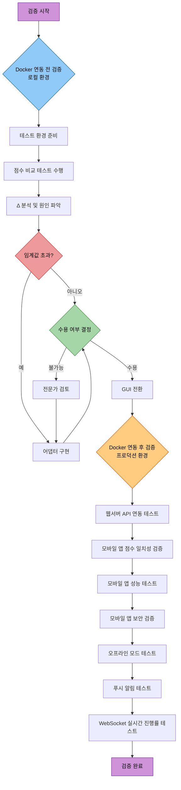

# 모바일 앱 연동 검증 가이드 (Mobile Integration Validation Guide)

> **문서 버전:** 1.6.0  
> **대상 프로젝트 버전:** 1.0.0  
> **마지막 업데이트:** 2026-06-08  
> **상태:** 활성

---

## 1. 개요

이 문서는 모바일 앱 연동을 위한 검증 절차를 설명합니다. 실 서비스는 모바일 앱을 통해 주로 이루어질 예정이며, GUI 데스크톱 앱 전환은 내부 테스트 목적으로 수행됩니다. 모바일 앱 연동을 위한 검증 게이트를 통과하기 위한 준비사항과 절차를 중점적으로 설명합니다.

**서비스 방향:**
- **실 서비스:** 모바일 앱 (iOS/Android) 중심
- **내부 테스트:** GUI 데스크톱 앱 전환 검증

**검증 단계:**
- **Docker 연동 전 검증 (로컬 환경):** 점수 일치성, 분석 함수 검증
- **Docker 연동 후 검증 (프로덕션 환경):** API 연동, 성능, 보안, 실시간 기능

**관련 문서:**
- `SkinLens_v1_GUI통합_AnalysisService_설계.md` - 전체 설계 문서
- `src/pipeline/analysis_service.py` - AnalysisService 구현
- `MOBILE_APP_INTEGRATION_GUIDE.md` - 모바일 앱 연동 가이드
- `LINUX_DOCKER_DEPLOYMENT.md` - Docker 배포 가이드

---

## 2. 검증 단계 개요

### 2.1 검증 단계 플로우차트



### 2.2 Docker 연동 전 검증 (로컬 환경)

**목표:** Docker 컨테이너화 전 로컬 환경에서 핵심 기능 검증

**검증 항목:**
- 점수 일치성 검증 (GUI vs CLI vs AnalysisService)
- 분석 함수 차이 분석 (`multi_v3` vs `compare_triple`)
- 점수 후처리 영향 분석
- 테스트 환경 준비 (모델, 이미지)

**선행 조건:**
- 로컬 개발 환경 구축 완료
- CV/LLM/복원 모델 설치 완료
- 테스트 이미지 준비 완료

### 2.3 Docker 연동 후 검증 (프로덕션 환경)

**목표:** Docker 컨테이너화 후 프로덕션 환경에서 전체 기능 검증

**검증 항목:**
- 웹서버 API 연동 테스트
- 모바일 앱 점수 일치성 검증
- 모바일 앱 성능 테스트
- 모바일 앱 보안 검증
- 오프라인 모드 테스트
- 푸시 알림 테스트
- WebSocket 실시간 진행률 테스트

**선행 조건:**
- Docker 컨테이너화 완료
- 웹서버 배포 완료
- 모바일 앱 개발 완료

---

## 3. 배경

### 3.1 현재 상태

| 단계 | CLI `run_analysis_pipeline` | GUI `skin_analysis_pipeline._cli_body` |
|---|---|---|
| 복원 | `run_enhancement_pipeline` | `run_enhancement_pipeline` (동일) |
| **주 분석** | **`analyze_all_multi_v3`** (정식 다중뷰, lateral 포함) | **`analyze_compare_triple`** (front/restored 비교) |
| 안전장치 | `apply_score_safety_net` | `apply_score_safety_net` (동일) |
| **점수 후처리** | **없음** (raw 점수 사용) | **`apply_score_offset_v2`(max 90) + `filter_measurements`** (GUI 전용) |
| LLM 입력 점수 | raw `overall_score`/`measurements_report` | **offset 보정·필터된** 점수 |
| 제품/피부타입 | 파이프라인 내부 처리 | `_cli_body` 인라인 추론 |

### 3.2 분기 지점

**분기 지점 3곳:**
1. **주 분석 함수**: `multi_v3` vs `compare_triple`
2. **점수 후처리**: 없음 vs `apply_score_offset_v2` + `filter_measurements`
3. **LLM 입력 점수**: raw 점수 vs offset 보정·필터된 점수

단순히 GUI를 `AnalysisService.run()`으로 바꾸면 GUI 전용 로직이 사라져 **점수·소견이 달라집니다.**

---

## 4. Docker 연동 전 검증 (로컬 환경)

### 4.1 테스트 환경 준비

**CV 모델:**
- `skin_scoring` 관련 모델 파일 존재 확인
- LBP, Gabor, blob_log 등 알고리즘 의존성 확인

**LLM 모델:**
- Gemini API 키 확인 (`config/config.json` 또는 환경 변수)
- API 연결 테스트

**복원 모델:**
- RestoreFormer++: `external/RestoreFormerPlusPlus/inference.py` 확인
- CodeFormer: `external/CodeFormer/inference_codeformer.py` 확인
- RealESRGAN 가중치 파일 (CodeFormer 배경 업스케일용)

### 4.2 테스트 이미지 준비

**이미지 선정 기준:**
- 다양한 피부 타입 (건성, 지성, 복합성)
- 다양한 문제 유형 (기미, 주근깨, 홍조, 모공, 주름, 트러블)
- 다양한 나이대 (20대, 30대, 40대, 50대)
- 다양한 조명 조건

**권장 이미지 수:**
- 최소 5-10장
- 각 문제 유형별 1-2장씩

**이미지 저장 위치:**
```
test_images/
├── melasma_01.jpg
├── lentigo_01.jpg
├── redness_01.jpg
├── pore_01.jpg
├── wrinkle_01.jpg
├── acne_01.jpg
└── ...
```

---

## 5. 점수 비교 테스트 수행

### 5.1 테스트 스크립트 작성

**파일:** `tests/validation/test_score_delta.py`

```python
"""
GUI vs AnalysisService 점수 Δ 측정 테스트
"""
import json
from pathlib import Path
from typing import Dict, Any
import logging

from src.pipeline.analysis_service import AnalysisService
from src.gui.skin_analysis_pipeline import _cli_body  # 현재 GUI 경로

logging.basicConfig(level=logging.INFO)
log = logging.getLogger(__name__)

def calculate_delta(gui_result: Dict[str, Any], service_result: Dict[str, Any]) -> Dict[str, float]:
    """GUI와 Service 점수 차이 계산"""
    delta = {}
    
    # 종합 점수
    gui_overall = gui_result.get("overall_score", 0)
    service_overall = service_result.get("overall_score", 0)
    delta["overall_score"] = abs(gui_overall - service_overall)
    
    # 측정 항목별 점수
    gui_measurements = gui_result.get("measurements_report", {})
    service_measurements = service_result.get("measurements_report", {})
    
    for key in gui_measurements:
        if key in service_measurements:
            delta[key] = abs(gui_measurements[key] - service_measurements[key])
    
    return delta

def run_gui_path(image_path: Path, out_dir: Path) -> Dict[str, Any]:
    """현재 GUI 경로 실행 (skin_analysis_pipeline._cli_body)"""
    # 실제 구현에 따라 조정 필요
    # 여기서는 개념적 예시
    log.info(f"GUI 경로 실행: {image_path}")
    # result = _cli_body(image_path, out_dir, ...)
    # return result
    return {"overall_score": 0, "measurements_report": {}}  # 플레이스홀더

def run_service_path(image_path: Path, out_dir: Path, llm_api_key: str) -> Dict[str, Any]:
    """AnalysisService 경로 실행"""
    log.info(f"Service 경로 실행: {image_path}")
    svc = AnalysisService(llm_api_key=llm_api_key)
    result = svc.run(
        image_path, out_dir,
        do_restore=True,
        score_safety_net=True,
        llm_report=False,  # 점수 비교만 하므로 LLM 제외
        use_multi_view_analysis=False,
    )
    return result["analysis_result"]

def compare_scores(image_paths: list[Path], out_dir: Path, llm_api_key: str):
    """점수 비교 테스트 실행"""
    results = []
    
    for img_path in image_paths:
        log.info(f"테스트 이미지: {img_path}")
        
        # GUI 경로
        gui_result = run_gui_path(img_path, out_dir)
        
        # Service 경로
        service_result = run_service_path(img_path, out_dir, llm_api_key)
        
        # Δ 계산
        delta = calculate_delta(gui_result, service_result)
        results.append({
            "image": str(img_path),
            "gui_overall": gui_result.get("overall_score", 0),
            "service_overall": service_result.get("overall_score", 0),
            "delta": delta
        })
    
    return results

def generate_report(results: list[Dict[str, Any]], output_path: Path):
    """비교 결과 리포트 생성"""
    report = {
        "test_date": "2026-06-08",
        "total_images": len(results),
        "results": results
    }
    
    with open(output_path, 'w', encoding='utf-8') as f:
        json.dump(report, f, indent=2, ensure_ascii=False)
    
    log.info(f"리포트 저장: {output_path}")

if __name__ == "__main__":
    # 설정
    test_images_dir = Path("test_images")
    output_dir = Path("test_output")
    llm_api_key = "your_api_key_here"
    report_path = Path("test_output/score_delta_report.json")
    
    # 테스트 이미지 목록
    image_paths = list(test_images_dir.glob("*.jpg"))
    
    # 테스트 실행
    results = compare_scores(image_paths, output_dir, llm_api_key)
    
    # 리포트 생성
    generate_report(results, report_path)
```

### 5.2 테스트 실행

```bash
# 테스트 디렉토리 생성
mkdir test_images
mkdir test_output

# 테스트 이미지 배치
# (수동으로 test_images/에 이미지 배치)

# 테스트 실행
python tests/validation/test_score_delta.py
```

---

## 6. 허용 임계 확인

### 6.1 임계값 설정

**권장 임계값:**
- 항목별 허용 임계: ±2
- 종합 점수 허용 임계: ±5
- LLM 소견 변화 허용: 동일한 카테고리 분류

**임계값 조정 기준:**
- 항목별 중요도에 따라 가중치 부여 가능
- 임상적 의미가 있는 차이인지 전문가 검토 필요

### 6.2 초과 항목 식별

**분석 템플릿:**

| 항목 | GUI 점수 | Service 점수 | Δ | 허용 임계 | 초과 여부 | 비고 |
|------|----------|--------------|---|----------|----------|------|
| overall_score | 75.2 | 73.8 | 1.4 | ±5 | 아니오 | |
| melasma_score | 68.5 | 72.1 | 3.6 | ±2 | **예** | 분석 필요 |
| pore_score | 82.3 | 81.0 | 1.3 | ±2 | 아니오 | |
| ... | ... | ... | ... | ... | ... | ... |

---

## 7. 차이 원인 분석 (Δ 분석 및 원인 파악)

### 7.1 Δ 분석 개요

**GUI 점수란?**
- **경로:** `skin_analysis_pipeline._cli_body` (현재 GUI 데스크톱 앱 경로)
- **분석 함수:** `analyze_compare_triple` (front vs restored 비교)
- **점수 후처리:** `apply_score_offset_v2` (max 90) + `filter_measurements` 적용
- **LLM 입력 점수:** offset 보정·필터된 점수
- **특징:** GUI 전용 후처리 로직으로 인해 점수가 보정됨

**Service 점수란?**
- **경로:** `AnalysisService.run()` (표준 서비스 경로)
- **분석 함수:** `analyze_all_multi_v3` (다중뷰, lateral 포함)
- **점수 후처리:** 없음 (raw 점수 사용)
- **LLM 입력 점수:** raw `overall_score`/`measurements_report`
- **특징:** 정식 다중뷰 분석으로 더 정확할 수 있으나 후처리 없음

**Δ(델타)란?**
- Δ = |GUI 점수 - Service 점수|
- 두 경로 간의 점수 차이를 나타내는 지표
- 점수 일치성 검증의 핵심 메트릭

**Δ 분석 목적:**
- 두 경로 간의 점수 차이가 허용 가능한 범위 내에 있는지 확인
- 차이가 발생하는 원인을 식별
- 수용 여부 결정을 위한 데이터 제공

**Δ 분석 절차:**
1. 항목별 Δ 계산
2. 허용 임계와 비교
3. 초과 항목 식별
4. 원인 분석 (분석 함수, 후처리)
5. 영향량 측정

**Δ 계산 예시:**
```python
# 종합 점수 Δ
gui_overall = 75.2
service_overall = 73.8
delta_overall = abs(gui_overall - service_overall)  # 1.4

# 항목별 Δ
gui_melasma = 68.5
service_melasma = 72.1
delta_melasma = abs(gui_melasma - service_melasma)  # 3.6
```

**Δ 해석 기준:**
- Δ ≤ 1: 거의 차이 없음 (무시 가능)
- 1 < Δ ≤ 2: 작은 차이 (허용 가능)
- 2 < Δ ≤ 5: 중간 차이 (분석 필요)
- Δ > 5: 큰 차이 (수용 불가능 가능성 높음)

**Δ 분석 리포트 예시:**
```
테스트 이미지: test_images/melasma_01.jpg
종합 점수 Δ: 1.4 (허용 임계 ±5 내) → 수용 가능

항목별 Δ:
- melasma_score: 3.6 (허용 임계 ±2 초과) → 분석 필요
- pore_score: 1.3 (허용 임계 ±2 내) → 수용 가능
- wrinkle_score: 0.8 (허용 임계 ±2 내) → 수용 가능

결론: melasma_score Δ 초과로 원인 분석 필요
```

### 7.2 분석 함수 차이 확인

**`multi_v3` vs `compare_triple` 차이:**
- `multi_v3`: 다중뷰 분석 (front, left45, right45), lateral 포함
- `compare_triple`: 단일 이미지 비교 (front vs restored)

**영향 분석:**
- 다중뷰 데이터가 단일 뷰보다 더 정확할 수 있음
- lateral 각도가 특정 항목(주름, 처짐 등)에 큰 영향

**분석 함수 차이로 인한 Δ 패턴:**
- 주름, 처짐 항목: lateral 각도 영향으로 Δ 큼
- 기미, 주근깨 항목: 다중뷰 vs 단일 뷰 차이로 Δ 중간
- 모공, 트러블 항목: 분석 함수 차이 영향 적음

**분석 함수 선택 가이드:**
- 정확도 우선: `multi_v3` 사용 (다중뷰)
- 속도 우선: `compare_triple` 사용 (단일 뷰)
- 특정 항목 Δ 초과 시: 해당 항목에 적합한 분석 함수 선택

### 7.3 점수 후처리 영향 분석

**`apply_score_offset_v2` 영향:**
- 최대 점수 제한 (max 90)
- 특정 항목에 offset 적용
- **v2의 의미:** `apply_score_offset`와 동일한 기능, 호환성 유지를 위한 별칭(alias)
- **v2 필요성:** 기존 코드와의 호환성을 유지하면서 함수명 통일

**`filter_measurements` 영향:**
- 특정 항목 필터링
- 노이즈 제거
- `_raw`로 끝나는 키 제외

**영향량 측정:**
```python
# offset/filter 미적용 점수 vs 적용 점수 비교
raw_score = service_result["overall_score"]
filtered_score = apply_score_offset_v2(...)
offset_impact = abs(raw_score - filtered_score)
```

---

## 8. 결정 및 조치

### 8.1 차이 수용 가능한 경우

**조건:**
- 모든 항목 Δ가 허용 임계 내
- 종합 점수 Δ가 허용 임계 내
- LLM 소견 카테고리가 동일

**조치:**
1. GUI를 옵션 B로 전환
2. `src/gui/score_postprocess.py`로 후처리 로직 추출
3. GUI 전환 후 회귀 테스트 수행

### 8.2 차이 수용 불가능한 경우

**조건:**
- 하나 이상 항목 Δ가 허용 임계 초과
- 종합 점수 Δ가 허용 임계 초과
- LLM 소견 카테고리가 다름

**조치:**
1. `AnalysisService`에 분석함수 선택 파라미터 추가
2. `compare_triple` 모드 지원 추가
3. 또는 임계값 재조정 및 정책 수정
4. 전문가 검토 후 결정

---

## 9. 구체적 실행 스크립트

### 9.1 점수 Δ 측정 스크립트

**파일:** `scripts/measure_score_delta.py`

```python
"""
점수 Δ 측정 스크립트
사용법: python scripts/measure_score_delta.py --image-dir test_images --output test_output
"""
import argparse
import json
from pathlib import Path
from typing import Dict, Any
import logging

from src.pipeline.analysis_service import AnalysisService

logging.basicConfig(level=logging.INFO)
log = logging.getLogger(__name__)

def main():
    parser = argparse.ArgumentParser(description="점수 Δ 측정")
    parser.add_argument("--image-dir", type=Path, required=True, help="테스트 이미지 디렉토리")
    parser.add_argument("--output", type=Path, required=True, help="출력 디렉토리")
    parser.add_argument("--llm-api-key", type=str, help="LLM API 키")
    args = parser.parse_args()
    
    # 테스트 실행 로직
    # (위 테스트 스크립트 참조)
    
if __name__ == "__main__":
    main()
```

### 9.2 결과 리포트 생성

**파일:** `scripts/generate_delta_report.py`

```python
"""
점수 Δ 리포트 생성
사용법: python scripts/generate_delta_report.py --input test_output/score_delta_report.json --output test_output/delta_report.html
"""
import argparse
import json
from pathlib import Path
from typing import Dict, Any

def generate_html_report(data: Dict[str, Any], output_path: Path):
    """HTML 리포트 생성"""
    html = """
    <html>
    <head>
        <title>점수 Δ 리포트</title>
        <style>
            table { border-collapse: collapse; width: 100%; }
            th, td { border: 1px solid #ddd; padding: 8px; text-align: left; }
            th { background-color: #f2f2f2; }
            .exceed { background-color: #ffcccc; }
        </style>
    </head>
    <body>
        <h1>점수 Δ 리포트</h1>
        <p>테스트 날짜: {date}</p>
        <p>총 이미지 수: {count}</p>
        <table>
            <tr>
                <th>이미지</th>
                <th>GUI 점수</th>
                <th>Service 점수</th>
                <th>Δ</th>
                <th>허용 임계</th>
                <th>초과 여부</th>
            </tr>
    """.format(date=data["test_date"], count=data["total_images"])
    
    for result in data["results"]:
        delta = result["delta"]
        overall_delta = delta.get("overall_score", 0)
        exceed_class = "exceed" if overall_delta > 5 else ""
        
        html += f"""
            <tr class="{exceed_class}">
                <td>{result["image"]}</td>
                <td>{result["gui_overall"]:.2f}</td>
                <td>{result["service_overall"]:.2f}</td>
                <td>{overall_delta:.2f}</td>
                <td>±5</td>
                <td>{"예" if overall_delta > 5 else "아니오"}</td>
            </tr>
        """
    
    html += """
        </table>
    </body>
    </html>
    """
    
    with open(output_path, 'w', encoding='utf-8') as f:
        f.write(html)

def main():
    parser = argparse.ArgumentParser(description="점수 Δ 리포트 생성")
    parser.add_argument("--input", type=Path, required=True, help="입력 JSON 파일")
    parser.add_argument("--output", type=Path, required=True, help="출력 HTML 파일")
    args = parser.parse_args()
    
    with open(args.input, 'r', encoding='utf-8') as f:
        data = json.load(f)
    
    generate_html_report(data, args.output)
    print(f"리포트 생성: {args.output}")

if __name__ == "__main__":
    main()
```

---

## 10. Docker 연동 후 검증 (프로덕션 환경)

### 10.1 웹서버 API 연동 테스트

**테스트 목표:**
- 모바일 앱에서 웹서버 API로 정상적으로 요청 전송
- 인증 토큰 기반 API 접근 확인
- 이미지 업로드 및 분석 요청 전송 확인

**테스트 항목:**
- [ ] 로그인 API 테스트 (`POST /v1/auth/login`)
- [ ] 토큰 갱신 API 테스트 (`POST /v1/auth/refresh`)
- [ ] 분석 요청 API 테스트 (`POST /v1/analysis/jobs`)
- [ ] 분석 결과 조회 API 테스트 (`GET /v1/analysis/jobs/{job_id}`)
- [ ] WebSocket 연결 테스트 (`WS /v1/analysis/jobs/{job_id}/progress`)

**참고 문서:** `MOBILE_APP_INTEGRATION_GUIDE.md`

### 10.2 모바일 앱 점수 일치성 검증

**테스트 목표:**
- 모바일 앱에서 받은 점수가 데스크톱 GUI와 일치하는지 확인
- AnalysisService 경로를 통한 점수 일치성 확인

**테스트 절차:**
1. 동일 이미지로 데스크톱 GUI와 모바일 앱에서 각각 분석 요청
2. 두 결과의 점수 Δ 계산
3. 허용 임계 내에 있는지 확인

**테스트 스크립트:**
```python
# tests/validation/test_mobile_score_consistency.py
def test_mobile_vs_desktop_consistency(image_path):
    # 데스크톱 GUI 경로
    desktop_result = run_desktop_analysis(image_path)
    
    # 모바일 앱 경로 (웹서버 API)
    mobile_result = run_mobile_analysis_via_api(image_path)
    
    # 점수 Δ 계산
    delta = calculate_delta(desktop_result, mobile_result)
    
    # 허용 임계 확인
    assert delta["overall_score"] <= 5, "종합 점수 차이 초과"
    for key, value in delta.items():
        if key != "overall_score":
            assert value <= 2, f"{key} 점수 차이 초과"
```

### 10.3 모바일 앱 성능 테스트

**테스트 목표:**
- 모바일 앱에서의 분석 요청 응답 시간 확인
- 대용량 이미지 업로드 성능 확인
- 배터리 소모 확인

**테스트 항목:**
- [ ] 이미지 업로드 시간 (1MB, 5MB, 10MB)
- [ ] 분석 요청 응답 시간
- [ ] WebSocket 진행률 업데이트 지연
- [ ] 배터리 소모량 측정
- [ ] 메모리 사용량 측정

**성능 기준:**
- 이미지 업로드: 5MB 이하 10초 내
- 분석 요청 응답: 2초 내
- WebSocket 지연: 500ms 이하

### 10.4 모바일 앱 보안 검증

**테스트 목표:**
- API 인증 토큰 보안 확인
- HTTPS 통신 확인
- 민감 데이터 암호화 확인

**테스트 항목:**
- [ ] JWT 토큰 저장 방식 확인 (Keychain/Keystore)
- [ ] HTTPS 통신 확인 (MITM 공격 방지)
- [ ] 이미지 데이터 암호화 확인
- [ ] 고객 정보 암호화 확인
- [ ] 토큰 만료 처리 확인

### 10.5 오프라인 모드 테스트

**테스트 목표:**
- 네트워크 연결 없이도 기본 기능 동작 확인
- 오프라인 데이터 저장 확인
- 온라인 복구 시 데이터 동기화 확인

**테스트 항목:**
- [ ] 오프라인 상태에서 분석 요청 시 에러 처리
- [ ] 오프라인 상태에서 이전 결과 조회 확인
- [ ] 온라인 복구 시 데이터 동기화 확인
- [ ] 로컬 DB 데이터 무결성 확인

### 10.6 푸시 알림 테스트

**테스트 목표:**
- 분석 완료 시 푸시 알림 수신 확인
- 푸시 알림 터치 시 앱 이동 확인

**테스트 항목:**
- [ ] FCM/APNS 토큰 등록 확인
- [ ] 분석 완료 푸시 알림 수신 확인
- [ ] 푸시 알림 터치 시 결과 화면 이동 확인
- [ ] 푸시 알림 배지 카운트 확인

### 10.7 WebSocket 실시간 진행률 테스트

**테스트 목표:**
- 분석 진행률 실시간 업데이트 확인
- WebSocket 연결 안정성 확인

**테스트 항목:**
- [ ] WebSocket 연결 성공 확인
- [ ] 진행률 메시지 수신 확인
- [ ] 진행률 표시 정확성 확인
- [ ] 연결 끊김 시 재연동 확인
- [ ] 백그라운드 상태에서 메시지 수신 확인

---

## 11. 우선 순위

### 11.1 높음 (즉시 수행 - Docker 연동 전)
1. **테스트 환경 준비**
   - CV/LLM/복원 모델 파일 확인
   - 테스트 이미지 준비
   - API 키 확인

2. **점수 비교 테스트 수행**
   - 테스트 스크립트 작성
   - 테스트 실행
   - 결과 수집

3. **Δ 분석 및 원인 파악**
   - 항목별 Δ 분석
   - 분석 함수 차이 확인
   - 후처리 영향 분석

4. **임계값 설정 및 수용 여부 결정**
   - 임계값 설정
   - 초과 항목 식별
   - 수용 여부 결정

### 11.2 중간 (Docker 연동 후)
5. **웹서버 API 연동 테스트**
   - 로그인, 토큰 갱신, 분석 요청, 결과 조회, WebSocket 연결

6. **모바일 앱 점수 일치성 검증**
   - 데스크톱 GUI와 모바일 앱 점수 Δ 측정

7. **모바일 앱 성능 테스트**
   - 업로드 시간, 응답 시간, 배터리 소모, 메모리 사용량

8. **모바일 앱 보안 검증**
   - JWT 토큰, HTTPS, 데이터 암호화

### 11.3 낮음 (프로덕션 안정화)
9. **오프라인 모드 테스트**
   - 네트워크 없이 기본 기능, 데이터 동기화

10. **푸시 알림 테스트**
    - FCM/APNS, 알림 수신, 터치 이동

11. **WebSocket 실시간 진행률 테스트**
    - 연결, 진행률 업데이트, 재연동

### 11.4 최우선순위 (내부 테스트 목적 - GUI 전환)
12. **GUI 전환 검증**
    - 필요 시 어댑터 구현
    - 분석함수 선택 파라미터 추가
    - 임계값 재조정

---

## 12. 체크리스트

### 12.1 Docker 연동 전 검증 (로컬 환경)
- [ ] CV 모델 파일 확인
- [ ] LLM API 키 확인
- [ ] 복원 모델 파일 확인
- [ ] 테스트 이미지 준비 (최소 5-10장)
- [ ] 테스트 디렉토리 생성

### 12.2 Docker 연동 전 테스트 실행
- [ ] 테스트 스크립트 작성
- [ ] GUI 경로 테스트 실행
- [ ] Service 경로 테스트 실행
- [ ] 점수 Δ 계산
- [ ] 결과 JSON 저장

### 12.3 Docker 연동 전 분석 및 결정
- [ ] 항목별 Δ 분석
- [ ] 임계값 초과 항목 식별
- [ ] 원인 분석 (분석 함수, 후처리)
- [ ] 수용 여부 결정
- [ ] 리포트 생성

### 12.4 Docker 연동 전 전환 (수용 시)
- [ ] `src/gui/score_postprocess.py` 생성
- [ ] 후처리 로직 추출
- [ ] GUI 전환
- [ ] 회귀 테스트

### 12.5 Docker 연동 후 검증 (프로덕션 환경)
- [ ] 웹서버 API 연동 테스트
- [ ] 모바일 앱 점수 일치성 검증
- [ ] 모바일 앱 성능 테스트
- [ ] 모바일 앱 보안 검증
- [ ] 오프라인 모드 테스트
- [ ] 푸시 알림 테스트
- [ ] WebSocket 실시간 진행률 테스트

---

## 13. 부록

### 13.1 관련 파일

**테스트 관련:**
- `tests/validation/test_score_delta.py` - 점수 Δ 측정 테스트
- `scripts/measure_score_delta.py` - 점수 Δ 측정 스크립트
- `scripts/generate_delta_report.py` - 리포트 생성 스크립트

**구현 관련:**
- `src/pipeline/analysis_service.py` - AnalysisService 구현
- `src/gui/skin_analysis_pipeline.py` - 현재 GUI 구현
- `src/gui/score_postprocess.py` - 후처리 로직 (생성 예정)

**모바일 연동 관련:**
- `MOBILE_APP_INTEGRATION_GUIDE.md` - 모바일 앱 연동 가이드
- `tests/validation/test_mobile_score_consistency.py` - 모바일 점수 일치성 테스트

### 13.2 참고 문서

- `SkinLens_v1_GUI통합_AnalysisService_설계.md` - 전체 설계 문서
- `SKIN_ANALYSIS_PIPELINE_GUIDE.md` - 파이프라인 가이드
- `docs/guides/CODEFORMER_PIPELINE_ALGORITHM.md` - 알고리즘 가이드

---

## 14. 변경 이력

| 버전 | 날짜 | 변경 내용 | 작성자 |
|------|------|----------|--------|
| 1.0.0 | 2026-06-08 | 초기 버전 | Cascade |
| 1.1.0 | 2026-06-08 | 모바일 앱 연동 검증 섹션 추가 | Cascade |
| 1.2.0 | 2026-06-08 | 모바일 우선 서비스 방향으로 개요 및 우선 순위 재정렬 | Cascade |
| 1.3.0 | 2026-06-08 | Docker 연동 전/후 검증 단계로 분리 | Cascade |
| 1.4.0 | 2026-06-08 | Δ 분석 및 원인 파악 섹션 상세 설명 추가 | Cascade |
| 1.5.0 | 2026-06-08 | GUI 점수 및 Service 점수 상세 설명 추가 | Cascade |
| 1.6.0 | 2026-06-08 | apply_score_offset_v2 의미 설명 추가 | Cascade |
