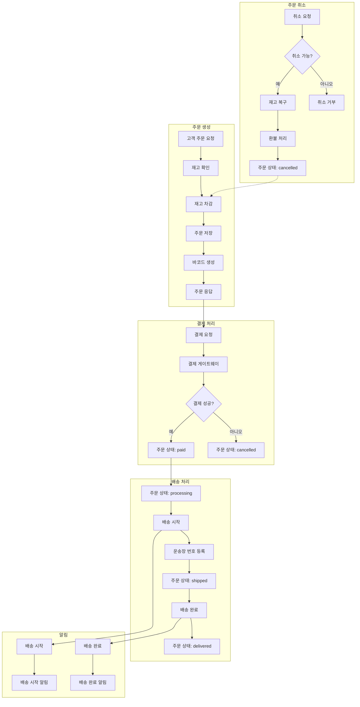
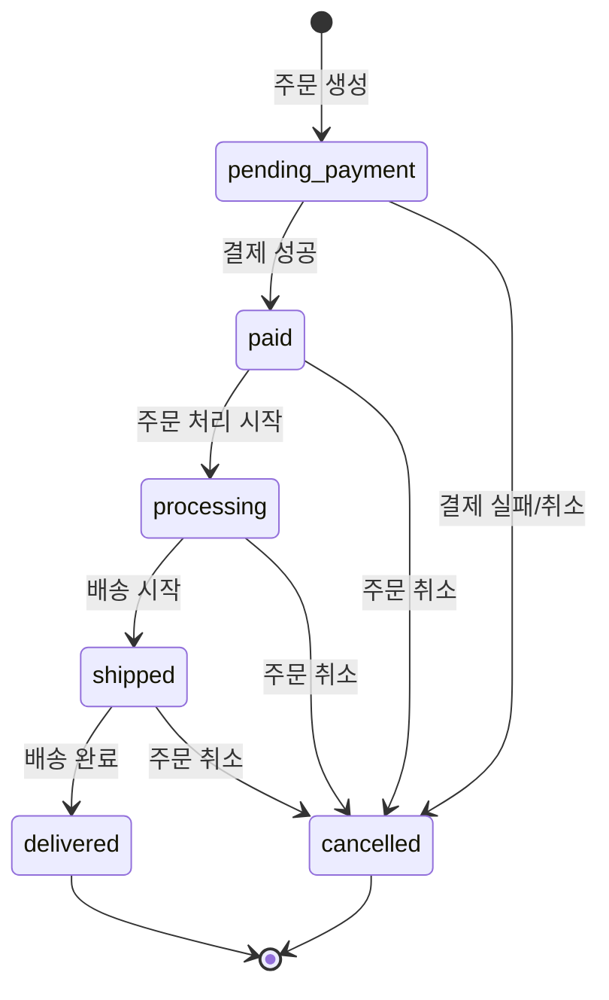

# 주문 관리 기능 가이드

## 개요

SkinLens 시스템의 주문 관리 기능은 맞춤형 화장품 추천 후 구매 프로세스를 지원하는 종합적인 주문 관리 시스템입니다. 본 가이드는 주문 생성부터 배송 완료까지의 전체 프로세스와 관련 API, DB 메서드를 설명합니다.

## 주문 유형

SkinLens 시스템은 총 3종류의 주문을 지원합니다:

### 1. 맞춤형화장품 주문
- **설명**: 피부 분석 결과를 기반으로 추천된 맞춤형 화장품 주문
- **주문 생성**: 고객이 피부 분석 후 추천 제품을 선택하여 주문
- **결제 수단**: 신용카드, 네이버페이, 쿠팡페이, 카카오페이, 무통장 입금
- **추천 출처**: `skin_analysis`
- **API 엔드포인트**: `POST /v1/orders`

### 2. PCR 검사요청 주문
- **설명**: PCR 검사 요청 시 자동으로 생성되는 PCR 검사 키트 주문
- **주문 생성**: PCR 검사 요청 API 호출 시 배송지 정보 제공 시 자동 생성
- **결제 수단**: 무통장 입금 (`bank_transfer`)
- **추천 출처**: `pcr_test_request`
- **API 엔드포인트**: `POST /v1/app/pcr/request`

### 3. 기성품 주문
- **설명**: 미리 준비된 5종의 기성품 주문
- **주문 생성**: 고객이 기성품 목록에서 제품을 선택하여 주문
- **결제 수단**: 신용카드, 네이버페이, 쿠팡페이, 카카오페이, 무통장 입금
- **추천 출처**: `ready_made_product`
- **API 엔드포인트**: `POST /v1/orders`

### 주문 유형 비교

| 항목 | 맞춤형화장품 주문 | PCR 검사요청 주문 | 기성품 주문 |
|------|------------------|------------------|------------|
| 주문 생성 방식 | 고객 직접 주문 | PCR 검사 요청 시 자동 생성 | 고객 직접 주문 |
| 결제 수단 | 신용카드, 간편결제, 무통장 입금 | 무통장 입금 | 신용카드, 간편결제, 무통장 입금 |
| 추천 출처 | `skin_analysis` | `pcr_test_request` | `ready_made_product` |
| 제품 | 맞춤형화장품 | PCR 검사 키트 | 기성품 (5종) |
| 주문 API | `POST /v1/orders` | `POST /v1/app/pcr/request` | `POST /v1/orders` |
| 분석 Job ID 연동 | 피부 분석 Job ID | PCR 검사 요청 ID | 없음 |

## 주문 프로세스 흐름



## 주문 상태 전이 다이어그램



## 기능 목록

### 1. 주문 상태 업데이트
### 2. 고객 주문 내역 조회
### 3. 결제 콜백 처리
### 4. 배송 상태 업데이트
### 5. 주문 취소 기능
### 6. 배송 추적 기능
### 7. 재고 관리 연동
### 8. 주문 통계/분석
### 9. 알림 기능
### 10. 보안 강화
### 11. 바코드 생성
### 12. 라벨 프린터
### 13. PCR 검사 키트 주문
### 14. 기성품 주문

---

## 1. 주문 상태 업데이트

### 개요
주문의 상태를 변경하는 기능입니다. 주문 상태는 결제 대기, 결제 완료, 처리 중, 배송 중, 배송 완료, 취소 등으로 관리됩니다.

### API 엔드포인트
```
PATCH /v1/orders/{order_id}/status
```

### 요청 파라미터
- `order_id`: 주문 ID
- `status`: 새로운 상태
  - `pending_payment`: 결제 대기
  - `paid`: 결제 완료
  - `processing`: 처리 중
  - `shipped`: 배송 중
  - `delivered`: 배송 완료
  - `cancelled`: 취소

### DB 메서드
```python
db.update_order_status(order_id: str, status: str) -> bool
```

### 사용 예시
```bash
curl -X PATCH "http://localhost:8000/v1/orders/ORD-20260601-1234/status?status=paid"
```

---

## 2. 고객 주문 내역 조회

### 개요
특정 고객의 주문 내역을 조회하는 기능입니다. 총 주문 수와 총 지출 금액을 계산하여 제공합니다.

### API 엔드포인트
```
GET /v1/orders/customer/{customer_id}
```

### 요청 파라미터
- `customer_id`: 고객 ID
- `limit`: 조회할 주문 수 (기본값: 50)

### DB 메서드
```python
db.get_customer_orders(customer_id: str, limit: int = 50) -> List[Dict[str, Any]]
```

### 응답 예시
```json
{
  "customer_id": "customer123",
  "total_orders": 5,
  "total_spent": 75000.0,
  "orders": [
    {
      "order_id": "ORD-20260601-1234",
      "status": "delivered",
      "total_amount": 15000.0,
      "created_at": "2026-06-01T10:00:00Z"
    }
  ]
}
```

---

## 3. 결제 콜백 처리

### 개요
결제 게이트웨이에서 결제 결과를 통보받아 주문 상태를 업데이트하는 기능입니다. 결제 성공 시 주문 상태를 'paid'로 변경하고, 실패 시 'cancelled'로 변경합니다.

### API 엔드포인트
```
POST /v1/orders/payment/callback
```

### 요청 파라미터
```json
{
  "order_id": "ORD-20260601-1234",
  "payment_status": "success",
  "payment_id": "PAY-123456",
  "paid_amount": 15000.0,
  "paid_at": "2026-06-01T10:30:00Z"
}
```

### DB 메서드
```python
db.update_order_status(order_id: str, status: str) -> bool
```

### 처리 로직
- 결제 성공: 주문 상태 → `paid`, 결제 상태 → `paid`
- 결제 실패: 주문 상태 → `cancelled`, 결제 상태 → `failed`

---

## 4. 배송 상태 업데이트

### 개요
배송 시스템에서 배송 상태를 업데이트하는 기능입니다. 운송장 번호 등록, 배송 시작/완료 시간 기록 등을 지원합니다.

### API 엔드포인트
```
POST /v1/orders/shipping/status
```

### 요청 파라미터
```json
{
  "order_id": "ORD-20260601-1234",
  "shipping_status": "shipped",
  "tracking_number": "KR-123456789",
  "shipped_at": "2026-06-01T11:00:00Z",
  "delivered_at": null
}
```

### DB 메서드
```python
db.update_order_status(order_id: str, status: str) -> bool
```

### 처리 로직
- 배송 시작: 주문 상태 → `shipped`, 배송 상태 → `shipped`
- 배송 완료: 주문 상태 → `delivered`, 배송 상태 → `delivered`
- 자동 알림 전송 (배송 시작/완료 시)

---

## 5. 주문 취소 기능

### 개요
고객이 주문을 취소하는 기능입니다. 결제 대기 상태인 경우 즉시 취소되며, 결제 완료 상태인 경우 환불 처리가 시작됩니다.

### API 엔드포인트
```
POST /v1/orders/{order_id}/cancel
```

### 요청 파라미터
```json
{
  "reason": "단순 변심"
}
```

### DB 메서드
```python
db.update_order_status(order_id: str, status: str) -> bool
db.add_stock(product_id: str, quantity: int) -> bool
```

### 처리 로직
- 취소 가능 상태 검증 (배송 중/완료 불가)
- 결제 완료 상태: 환불 처리 시작, 재고 복구
- 결제 대기 상태: 즉시 취소

### 응답 예시
```json
{
  "order_id": "ORD-20260601-1234",
  "status": "cancelled",
  "cancelled_at": "2026-06-01T12:00:00Z",
  "refund_amount": 15000.0,
  "refund_status": "processing"
}
```

---

## 6. 배송 추적 기능

### 개요
주문의 배송 추적 정보를 조회하는 기능입니다. 운송장 번호, 배송 상태, 배송 추적 이력을 제공합니다.

### API 엔드포인트
```
GET /v1/orders/{order_id}/tracking
```

### 응답 예시
```json
{
  "order_id": "ORD-20260601-1234",
  "shipping_status": "shipped",
  "tracking_number": "KR-123456789",
  "shipped_at": "2026-06-01T11:00:00Z",
  "delivered_at": null,
  "estimated_delivery": "2026-06-03",
  "tracking_history": [
    {
      "status": "pending",
      "location": "창고",
      "timestamp": "2026-06-01T10:00:00Z",
      "description": "주문 접수"
    },
    {
      "status": "shipped",
      "location": "배송 센터",
      "timestamp": "2026-06-01T11:00:00Z",
      "description": "배송 시작"
    }
  ]
}
```

---

## 7. 재고 관리 연동

### 개요
주문 생성 시 재고를 확인하고 차감하며, 주문 취소 시 재고를 복구하는 기능입니다.

### DB 메서드
```python
db.check_stock(product_id: str, quantity: int) -> bool
db.deduct_stock(product_id: str, quantity: int) -> bool
db.add_stock(product_id: str, quantity: int) -> bool
db.get_product_stock(product_id: str) -> Optional[Dict[str, Any]]
```

### API 엔드포인트
```
GET /v1/orders/products/{product_id}/stock
POST /v1/orders/products/{product_id}/stock
```

### 처리 로직
- 주문 생성: 재고 확인 → 재고 차감 → 주문 저장
- 재고 부족: 주문 생성 차단
- 주문 취소: 재고 복구 (결제 완료 상태인 경우만)

### 재고 조회 응답 예시
```json
{
  "product_id": "prod001",
  "product_name": "Product prod001",
  "stock_quantity": 100,
  "price": 15000.0,
  "is_active": true
}
```

---

## 8. 주문 통계/분석

### 개요
판매 통계, 인기 제품, 일별 판매 추이, 고객별 구매 패턴 등 비즈니스 인텔리전스 기능을 제공합니다.

### DB 메서드
```python
db.get_sales_statistics(start_date: str, end_date: str) -> Dict[str, Any]
db.get_popular_products(limit: int = 10) -> List[Dict[str, Any]]
db.get_daily_sales(days: int = 30) -> List[Dict[str, Any]]
db.get_customer_purchase_pattern(customer_id: str) -> Dict[str, Any]
```

### API 엔드포인트
```
GET /v1/orders/statistics/sales?start_date=2026-06-01&end_date=2026-06-30
GET /v1/orders/statistics/popular-products?limit=10
GET /v1/orders/statistics/daily-sales?days=30
GET /v1/orders/statistics/customer/{customer_id}
```

### 판매 통계 응답 예시
```json
{
  "total_orders": 100,
  "total_revenue": 1500000.0,
  "average_order_value": 15000.0
}
```

### 인기 제품 응답 예시
```json
{
  "popular_products": [
    {
      "product_id": "prod001",
      "product_name": "Product prod001",
      "total_quantity": 50,
      "total_revenue": 750000.0
    }
  ],
  "limit": 10
}
```

---

## 9. 알림 기능

### 개요
주문 상태 변경 시 고객에게 알림을 전송하는 기능입니다. 배송 시작, 배송 완료 등의 이벤트에 대해 자동 알림을 발송합니다.

### DB 메서드
```python
db.send_notification(customer_id: str, notification_type: str, title: str, message: str, data: Optional[Dict[str, Any]] = None) -> bool
db.get_notification_settings(customer_id: str) -> Optional[Dict[str, Any]]
db.update_notification_settings(customer_id: str, analysis_complete_enabled: bool, device_token: Optional[str] = None, platform: Optional[str] = None) -> bool
```

### API 엔드포인트
```
GET /v1/orders/notifications/{customer_id}/settings
PUT /v1/orders/notifications/{customer_id}/settings
POST /v1/orders/notifications/send
```

### 알림 설정 응답 예시
```json
{
  "customer_id": "customer123",
  "analysis_complete_enabled": true,
  "device_token": "device_token_123",
  "platform": "ios"
}
```

### 자동 알림
- 배송 시작: "주문 {order_id}의 배송이 시작되었습니다."
- 배송 완료: "주문 {order_id}이 배송 완료되었습니다."

---

## 10. 보안 강화

### 개요
주문 데이터의 민감 정보를 암호화하여 저장하는 기능입니다. 배송 주소 등 개인정보를 SHA-256 해싱하여 보안을 강화합니다.

### 보안 기능
```python
db._encrypt_data(data: str) -> str
db._encrypt_address(address: Dict[str, str]) -> str
```

### 암호화 대상
- 배송 주소 (이름, 연락처, 주소)
- 결제 정보 (실제 구현 시)

### 보안 특징
- SHA-256 해싱 알고리즘 사용
- 민감 정보 암호화 저장
- 개인정보 보호 강화
- 보안 규정 준수

---

## 11. 바코드 생성

### 개요
주문 ID를 기반으로 바코드 번호와 바코드 이미지를 생성하는 기능입니다. Code128 바코드 표준을 사용하며, 라벨 프린터에서 직접 사용할 수 있는 형식으로 제공합니다.

### 바코드 생성 함수
```python
def generate_barcode(order_id: str) -> tuple[str, str]
```

### 바코드 형식
- **바코드 표준**: Code128
- **바코드 번호**: 주문 ID에서 숫자만 추출 (12자리)
- **이미지 형식**: PNG (Base64 인코딩)
- **이미지 옵션**:
  - 모듈 너비: 2
  - 모듈 높이: 50
  - 폰트 크기: 10
  - 텍스트 거리: 5
  - 여백: 6.5

### 바코드 번호 생성 규칙
1. 주문 ID에서 숫자만 추출
2. 12자리로 패딩 (부족한 경우 0으로 채움)
3. 예: `ORD-20260601-1234` → `202606011234`

### 사용 예시
```python
barcode_image, barcode_number = generate_barcode("ORD-20260601-1234")
# barcode_image: "data:image/png;base64,iVBORw0KGgoAAAANSUhEUgAA..."
# barcode_number: "202606011234"
```

---

## 12. 라벨 프린터

### 개요
라벨 프린터용 데이터를 생성하는 기능입니다. 바코드, 주문 정보, 제품 정보, 배송 정보를 포함한 라벨 데이터를 제공합니다.

### API 엔드포인트
```
GET /v1/orders/{order_id}/label
```

### 라벨 데이터 생성 함수
```python
def generate_label_data(order_id: str, order: dict, items: list) -> dict
```

### 라벨 포맷
- **크기**: 100mm x 150mm
- **DPI**: 300
- **형식**: JSON

### 라벨 데이터 구조
```json
{
  "order_id": "ORD-20260601-1234",
  "barcode_number": "202606011234",
  "barcode_image": "data:image/png;base64,iVBORw0KGgoAAAANSUhEUgAA...",
  "customer_id": "customer123",
  "shipping_address": {
    "recipient": "홍길동",
    "phone": "010-1234-5678",
    "address": "서울시 강남구",
    "zip_code": "12345"
  },
  "items": [
    {
      "product_id": "prod001",
      "product_name": "Product prod001",
      "quantity": 2,
      "price": 15000.0
    }
  ],
  "total_amount": 30000.0,
  "created_at": "2026-06-01T10:00:00Z",
  "label_format": {
    "width": 100,
    "height": 150,
    "dpi": 300
  },
  "label_content": {
    "header": "CÔTELLEAF",
    "title": "배송 라벨",
    "order_info": "주문번호: ORD-20260601-1234",
    "barcode": "202606011234",
    "footer": "고객센터: 1588-0000"
  }
}
```

### 라벨 콘텐츠
- **헤더**: 브랜드명 (CÔTELLEAF)
- **제목**: 라벨 유형 (배송 라벨)
- **주문 정보**: 주문번호
- **바코드**: 바코드 번호
- **푸터**: 고객센터 연락처

### 라벨 프린터 연동
- Zebra, Dymo 등 표준 라벨 프린터 지원
- JSON 데이터를 기반으로 라벨 생성
- 바코드 이미지 직접 인쇄 가능
- 배송 라벨 자동 생성

### 사용 예시
```bash
curl -X GET "http://localhost:8000/v1/orders/ORD-20260601-1234/label"
```

---

## 13. PCR 검사 키트 주문

### 개요
PCR 검사 요청 시 자동으로 PCR 검사 키트를 고객에게 발송하는 기능입니다. 고객이 PCR 검사를 요청하면 배송지 정보를 함께 제공하면 자동으로 PCR 검사 키트 주문이 생성되고 배송됩니다.

### 주문 생성 조건
- PCR 검사 요청 API 호출 시 `shipping_address` 필드 제공
- 배송지 정보: recipient, phone, address, zip_code

### PCR 검사 키트 정보
- **제품 ID**: `PCR-KIT-001`
- **제품명**: PCR 검사 키트
- **가격**: 15,000원
- **결제 수단**: `bank_transfer` (무통장 입금)
- **추천 출처**: `pcr_test_request`

### API 엔드포인트
```
POST /v1/app/pcr/request
```

### 요청 파라미터
```json
{
  "customer_id": "customer123",
  "test_type": "skin_analysis",
  "shipping_address": {
    "recipient": "홍길동",
    "phone": "010-1234-5678",
    "address": "서울시 강남구",
    "zip_code": "12345"
  }
}
```

### 응답 예시
```json
{
  "request_id": "PCR-abc12345",
  "customer_id": "customer123",
  "test_type": "skin_analysis",
  "requested_at": "2026-06-01T10:00:00Z",
  "status": "pending",
  "order_id": "ORD-xyz67890",
  "message": "PCR 검사 요청이 생성되었습니다. PCR 검사 키트 주문이 생성되었습니다."
}
```

### 주문 생성 로직
1. PCR 검사 요청 생성 (`pcr_test_requests` 테이블)
2. 배송지 정보 제공 시 자동 주문 생성 (`orders` 테이블)
3. 주문 항목: PCR 검사 키트 1개
4. 주문 상태: `pending_payment`
5. 결제 수단: `bank_transfer`
6. 추천 출처: `pcr_test_request`
7. 분석 Job ID: PCR 검사 요청 ID 연결

### 에러 처리
- 주문 생성 실패 시에도 PCR 검사 요청은 성공으로 처리
- 로그에 에러 기록
- 고객에게는 PCR 검사 요청 성공 메시지 전송

### 사용 예시
```bash
curl -X POST "http://localhost:8000/v1/app/pcr/request" \
  -H "Content-Type: application/json" \
  -d '{
    "customer_id": "customer123",
    "test_type": "skin_analysis",
    "shipping_address": {
      "recipient": "홍길동",
      "phone": "010-1234-5678",
      "address": "서울시 강남구",
      "zip_code": "12345"
    }
  }'
```

### 주문 조회
PCR 검사 키트 주문은 일반 주문 조회 API를 통해 확인 가능:
```
GET /v1/orders/customer/{customer_id}
```

### 배송 추적
PCR 검사 키트 배송 추적은 일반 배송 추적 API를 통해 확인 가능:
```
GET /v1/orders/{order_id}/tracking
```

### 주문 취소
PCR 검사 키트 주문 취소는 일반 주문 취소 API를 통해 가능:
```
POST /v1/orders/{order_id}/cancel
```

### 특징
- 자동 주문 생성: PCR 검사 요청 시 자동으로 주문 생성
- 무통장 입금: PCR 검사 키트는 무통장 입금으로 결제
- 추천 출처 연동: PCR 검사 요청 ID와 주문 연결
- 에러 허용: 주문 생성 실패 시에도 PCR 검사 요청 성공

---

## 14. 기성품 주문

### 개요
미리 준비된 5종의 기성품을 고객이 선택하여 주문하는 기능입니다. 기성품은 맞춤형화장품과 달리 미리 제조되어 재고로 관리되며, 고객이 바로 주문할 수 있습니다.

### 기성품 정보
- **제품 수량**: 5종
- **제품 카테고리**: 기초 화장품, 스킨케어, 마스크팩 등
- **재고 관리**: products 테이블에서 재고 수량 관리
- **결제 수단**: 신용카드, 네이버페이, 쿠팡페이, 카카오페이, 무통장 입금
- **추천 출처**: `ready_made_product`

### API 엔드포인트
```
POST /v1/orders
```

### 요청 파라미터
```json
{
  "customer_id": "customer123",
  "items": [
    {
      "product_id": "READY-001",
      "quantity": 2,
      "price": 25000.0
    }
  ],
  "shipping_address": {
    "recipient": "홍길동",
    "phone": "010-1234-5678",
    "address": "서울시 강남구",
    "zip_code": "12345"
  },
  "payment_method": "credit_card",
  "recommendation_source": "ready_made_product"
}
```

### 응답 예시
```json
{
  "order_id": "ORD-20260601-5678",
  "status": "pending_payment",
  "total_amount": 50000.0,
  "created_at": "2026-06-01T10:00:00Z",
  "payment_url": "https://payment-gateway.com/pay/ORD-20260601-5678",
  "barcode": "data:image/png;base64,iVBORw0KGgoAAAANSUhEUgAA...",
  "barcode_number": "202606015678"
}
```

### 주문 생성 로직
1. 기성품 재고 확인
2. 재고 차감
3. 주문 생성 (`orders` 테이블)
4. 주문 항목 생성 (`order_items` 테이블)
5. 바코드 생성
6. 결제 URL 생성

### 기성품 목록 조회
```
GET /v1/orders/products/ready-made
```

### 기성품 목록 응답 예시
```json
{
  "ready_made_products": [
    {
      "product_id": "READY-001",
      "product_name": "기성품 1",
      "category": "기초 화장품",
      "price": 25000.0,
      "stock_quantity": 50,
      "description": "모든 피부 타입에 적합한 기초 화장품"
    },
    {
      "product_id": "READY-002",
      "product_name": "기성품 2",
      "category": "스킨케어",
      "price": 35000.0,
      "stock_quantity": 30,
      "description": "피부 보습 및 영양 공급 스킨케어"
    }
  ],
  "total_products": 2
}
```

### DB 메서드
```python
db.get_ready_made_products() -> List[Dict[str, Any]]
```

### 특징
- 즉시 배송 가능: 재고가 있는 경우 즉시 배송
- 다양한 결제 수단: 신용카드, 간편결제, 무통장 입금 지원
- 재고 관리: 실시간 재고 확인 및 차감
- 추천 출처 구분: `ready_made_product`로 주문 유형 식별

---

## 데이터베이스 스키마

### orders 테이블
```sql
CREATE TABLE orders (
    id TEXT PRIMARY KEY,
    customer_id TEXT NOT NULL,
    status TEXT DEFAULT 'pending_payment',
    total_amount REAL NOT NULL,
    payment_method TEXT,
    payment_status TEXT DEFAULT 'pending',
    shipping_status TEXT DEFAULT 'pending',
    shipping_address TEXT,  -- 암호화된 배송 주소
    barcode_number TEXT,
    recommendation_source TEXT,
    analysis_job_id TEXT,
    created_at TIMESTAMP DEFAULT CURRENT_TIMESTAMP,
    updated_at TIMESTAMP DEFAULT CURRENT_TIMESTAMP
)
```

### order_items 테이블
```sql
CREATE TABLE order_items (
    id INTEGER PRIMARY KEY AUTOINCREMENT,
    order_id TEXT NOT NULL,
    product_id TEXT NOT NULL,
    product_name TEXT,
    quantity INTEGER NOT NULL,
    price REAL NOT NULL,
    subtotal REAL NOT NULL,
    created_at TIMESTAMP DEFAULT CURRENT_TIMESTAMP
)
```

### products 테이블 (재고 관리)
```sql
CREATE TABLE products (
    id INTEGER PRIMARY KEY AUTOINCREMENT,
    product_id TEXT UNIQUE NOT NULL,
    product_name TEXT NOT NULL,
    category TEXT NOT NULL,
    key_ingredients TEXT NOT NULL,
    efficacy TEXT NOT NULL,
    target_skin_types TEXT,
    target_concerns TEXT,
    stock_quantity INTEGER DEFAULT 0,  -- 재고 수량
    price REAL DEFAULT 0.0,  -- 제품 가격
    is_active INTEGER DEFAULT 1,  -- 활성 상태
    is_ready_made INTEGER DEFAULT 0,  -- 기성품 여부 (0: 맞춤형, 1: 기성품)
    created_at TIMESTAMP DEFAULT CURRENT_TIMESTAMP,
    updated_at TIMESTAMP DEFAULT CURRENT_TIMESTAMP
)
```

### pcr_test_requests 테이블 (PCR 검사 요청)
```sql
CREATE TABLE pcr_test_requests (
    id INTEGER PRIMARY KEY AUTOINCREMENT,
    request_id TEXT UNIQUE NOT NULL,
    customer_id TEXT NOT NULL,
    test_type TEXT NOT NULL,
    requested_at TIMESTAMP NOT NULL,
    status TEXT DEFAULT 'pending',
    updated_at TIMESTAMP DEFAULT CURRENT_TIMESTAMP,
    FOREIGN KEY (customer_id) REFERENCES users(customer_id)
)
```

### pcr_test_results 테이블 (PCR 검사 결과)
```sql
CREATE TABLE pcr_test_results (
    id INTEGER PRIMARY KEY AUTOINCREMENT,
    result_id TEXT UNIQUE NOT NULL,
    request_id TEXT NOT NULL,
    customer_id TEXT NOT NULL,
    test_data TEXT,
    interpretation TEXT,
    completed_at TIMESTAMP NOT NULL,
    FOREIGN KEY (request_id) REFERENCES pcr_test_requests(request_id),
    FOREIGN KEY (customer_id) REFERENCES users(customer_id)
)
```

### pcr_consultations 테이블 (PCR 검사 상담 예약)
```sql
CREATE TABLE pcr_consultations (
    id INTEGER PRIMARY KEY AUTOINCREMENT,
    consultation_id TEXT UNIQUE NOT NULL,
    customer_id TEXT NOT NULL,
    request_id TEXT NOT NULL,
    scheduled_at TIMESTAMP NOT NULL,
    notes TEXT,
    status TEXT DEFAULT 'scheduled',
    created_at TIMESTAMP DEFAULT CURRENT_TIMESTAMP,
    FOREIGN KEY (customer_id) REFERENCES users(customer_id),
    FOREIGN KEY (request_id) REFERENCES pcr_test_requests(request_id)
)
```

---

## 주문 상태 흐름

```
pending_payment → paid → processing → shipped → delivered
                    ↓
                 cancelled
```

### 상태 설명
- `pending_payment`: 결제 대기
- `paid`: 결제 완료
- `processing`: 처리 중 (제품 준비)
- `shipped`: 배송 중
- `delivered`: 배송 완료
- `cancelled`: 취소

---

## 에러 처리

### 일반 에러
- `404 Not Found`: 주문을 찾을 수 없음
- `400 Bad Request`: 유효하지 않은 요청
- `500 Internal Server Error`: 서버 에러

### 비즈니스 에러
- 재고 부족: 주문 생성 차단
- 취소 불가: 배송 중/완료 상태
- 이미 취소됨: 이미 취소된 주문

---

## 사용 예시

### 주문 생성
```bash
curl -X POST "http://localhost:8000/v1/orders" \
  -H "Content-Type: application/json" \
  -d '{
    "customer_id": "customer123",
    "items": [
      {
        "product_id": "prod001",
        "quantity": 2,
        "price": 15000.0
      }
    ],
    "shipping_address": {
      "recipient": "홍길동",
      "phone": "010-1234-5678",
      "address": "서울시 강남구",
      "zip_code": "12345"
    },
    "payment_method": "credit_card",
    "recommendation_source": "skin_analysis",
    "analysis_job_id": "job123"
  }'
```

### 주문 상태 업데이트
```bash
curl -X PATCH "http://localhost:8000/v1/orders/ORD-20260601-1234/status?status=paid"
```

### 주문 취소
```bash
curl -X POST "http://localhost:8000/v1/orders/ORD-20260601-1234/cancel" \
  -H "Content-Type: application/json" \
  -d '{"reason": "단순 변심"}'
```

### 배송 상태 업데이트
```bash
curl -X POST "http://localhost:8000/v1/orders/shipping/status" \
  -H "Content-Type: application/json" \
  -d '{
    "order_id": "ORD-20260601-1234",
    "shipping_status": "shipped",
    "tracking_number": "KR-123456789",
    "shipped_at": "2026-06-01T11:00:00Z"
  }'
```

---

## 참고 사항

### DB와 메모리 저장소 호환성
- 모든 API는 DB 메서드가 없는 경우 메모리 저장소를 사용하도록 구현
- 테스트 환경에서 메모리 저장소 사용 가능
- 운영 환경에서 DB 사용 권장

### 보안
- 모든 민감 정보는 암호화되어 저장
- SHA-256 해싱 알고리즘 사용
- 개인정보 보호 규정 준수

### 알림
- 실제 푸시 알림 서비스 연동 필요
- 현재는 로그 기록만 수행
- FCM, APNS 등 연동 가능

### 재고 관리
- 재고 부족 시 주문 생성 차단
- 주문 취소 시 재고 자동 복구
- 재고 관리자 API 제공

### 바코드 및 라벨
- Code128 바코드 표준 사용
- PNG 형식 바코드 이미지 생성
- 라벨 프린터 직접 연동 가능
- Base64 인코딩 이미지 제공

---

## 버전 정보

- **버전**: 1.5
- **최종 업데이트**: 2026-06-01
- **DB 스키마 버전**: 40
- **추가 기능**: 바코드 생성, 라벨 프린터, PCR 검사 키트 주문, 주문 유형 구분, 기성품 주문
