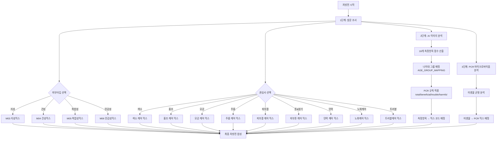

# 처방전 가이드 (Prescription Guide)

> **문서 버전:** 2.0.0  
> **대상 프로젝트 버전:** 1.0.0  
> **마지막 업데이트:** 2026-06-09  
> **상태:** 활성

---

## 개요

SkinLens v1.0 처방전은 다음 세 가지 데이터 소스를 기반으로 개인맞춤형 화장품 처방을 생성합니다:

1. **설문 조사** - 피부 타입, 관심사
2. **AI 이미지 분석** - 피부 평가 점수 (18개 측정항목)
3. **PCR 마이크로바이옴 분석** - 미생물 균형

### 세럼(Serum)이란?

세럼은 고농축 기능성 에센스를 뜻하며, 피부에 빠르게 흡수되는 저분자 활성 성분을 고농도로 함유한 스킨케어 제품입니다. 일반적인 로션이나 크림보다 분자가 작아 피부 깊숙이 침투하여 효과적으로 작용합니다.

---

## 처방전 구성

### 베이스 (Base)

세럼의 기본 용매 (100 - 총믹스합)
- 모든 활성 성분을 녹이고 피부에 전달하는 역할
- 정제수, 글리세린, 부틸렌글리콜 등으로 구성

### 활성 믹스 14종 (M01-M14)

피부 타입 및 관심사 기반 처방

**카테고리 매핑 (LLM_PROMPT_TEMPLATE.md 측정항목 메타데이터 기반):**

| 믹스 코드 | 이름 | 카테고리 | 설명 |
|----------|------|----------|------|
| M01 | 베이스믹스 | 베이스 | 기본 베이스 |
| M02 | UV케어믹스 | UV케어 | 자외선 차단 |
| M03 | 지성믹스 | 피부 타입 | 지성 피부 타입 (유분 조절) |
| M04 | 건성믹스 | 피부 타입 | 건성 피부 타입 (수분 공급) |
| M05 | 복합성믹스 | 피부 타입 | 복합성 피부 타입 (유분/수분 밸런스) |
| M06 | 민감성믹스 | 피부 타입 | 민감성 피부 타입 (진정) |
| M07 | 보습케어믹스 | 보습 | 보습 케어 |
| M08 | 미백케어믹스 | 색소 | 미백 케어 (톤·밝기, 색소) |
| M09 | 탄력케어믹스 | 탄력 | 탄력 케어 (탄력&처짐) |
| M10 | 주름케어믹스 | 주름 | 주름 케어 |
| M11 | 트러블케어믹스 | 트러블·흔적 | 트러블 케어 (여드름 & 흔적) |
| M12 | 모공케어믹스 | 모공 | 모공 케어 |
| M13 | 피부결케어믹스 | 텍스처 | 피부결 케어 |
| M14 | 홍조케어믹스 | 홍조, 홍반 | 홍조 케어 (홍조·혈관) |

**측정항목 메타데이터 9개 카테고리:**
- 색소 (Pigmentation)
- 홍조, 홍반 (Redness)
- 트러블·흔적 (Acne & Marks)
- 모공 (Pore)
- 주름 (Wrinkle)
- 텍스처 (Texture)
- 톤·밝기 (Tone)
- 탄력 (Elasticity)
- 피부 타입 (Skin Type)

### PCR 믹스 3종

마이크로바이옴 분석 기반 처방

**카테고리 (3종):**
- **프로바이오틱 믹스**: 유익균 증식 촉진
- **프리바이오틱 믹스**: 총량/트러블 관리
- **리밸런스케어 믹스**: 유해균 억제

**PM 코드별 카테고리 및 심각도:**

| 카테고리 | 믹스 코드 | 심각도 (rV 범위) | 비율 |
|----------|-----------|------------------|------|
| 프리바이오틱 | PM04 | -30 ~ -999 | 2.5~3.0% |
| 프리바이오틱 | PM02 | 0 ~ 10 | 1.5% |
| 프리바이오틱 | PM06 | 20 ~ 30 | 2.5~3.0% |
| 프로바이오틱 | PM01 | -10 ~ 0 | 1.5~2.0% |
| 프로바이오틱 | PM05 | -20 ~ -999 | 2.5~3.0% |
| 리밸런스케어 | PM03 | 0 ~ 20 | 1.5~2.0% |
| 리밸런스케어 | PM07 | 20 ~ 999 | 2.5~3.0% |

> **참고**: 총량이 평균 이하일 때는 활성 믹스 **M11**도 함께 처방됩니다.

---

## 처방전 생성 로직

### 전체 흐름



---

## 피부 평가 점수 기반 처방

### 측정항목 → 믹스 코드 매핑

| 카테고리 | 측정항목 | 믹스 코드 | 설명 |
|----------|----------|----------|------|
| 톤·밝기 | dullness_score | M08 | 미백케어믹스 |
| 주름 | eye_wrinkle_score, nasolabial_wrinkle_score, fine_deep_wrinkle_score | M10 | 주름케어믹스 |
| 탄력&처짐 | jawline_blur_score, cheek_sagging_score | M09 | 탄력케어믹스 |
| 색소침착 | melasma_score, freckle_score, post_acne_pigment_score | M08 | 미백케어믹스 |
| 홍조 | redness_score, post_inflammatory_erythema_score | M14 | 홍조케어믹스 |
| 모공 | pore_size_score, pore_sagging_score | M12 | 모공케어믹스 |
| 텍스처 | roughness_score | M13 | 피부결케어믹스 |
| 트러블 | acne_score | M11 | 트러블케어믹스 |

### 처방 비율 계산

```mermaid
flowchart TD
    subgraph 입력["입력"]
        A[18개 측정항목 점수<br/>0-100]
    end
    
    subgraph 매핑1["매핑 단계 1"]
        B[18개 측정항목<br/>→ 8개 카테고리]
    end
    
    subgraph 집계["집계 단계"]
        C[카테고리별<br/>최소 점수 선택]
    end
    
    subgraph 변환["변환 단계"]
        D[점수 → 처방 비율<br/>0% ~ 3.0%]
    end
    
    subgraph 매핑2["매핑 단계 2"]
        E[카테고리<br/>→ 믹스 코드]
    end
    
    subgraph 출력["출력"]
        F[최종 처방전<br/>{mix_code: percentage}]
    end
    
    A --> B
    B --> C
    C --> D
    D --> E
    E --> F
```

### 점수 → 비율 변환 로직

| 점수 범위 | 처방 비율 | 설명 |
|----------|-----------|------|
| 0 ~ 10 | 3.0% | 개선이 매우 필요함 |
| 10 ~ 20 | 2.5% | 개선이 필요함 |
| 20 ~ 30 | 2.0% | 집중 케어 필요 |
| 30 ~ 40 | 1.5% | 케어 필요 |
| 40 ~ 60 | 1.0% | 일반 케어 |
| 60 ~ 76 | 0.5% | 경미한 케어 |
| 76 ~ 100 | 0% | 케어 불필요 |

---

## PCR 마이크로바이옴 기반 처방

### 함수 시그니처

```javascript
async function calculatePrescription(pcrResultData, pcrResult, bacteriaList)
```

### 파라미터

| 파라미터 | 타입 | 설명 |
|---------|------|------|
| `pcrResultData` | `Object` | PCR 결과 메타데이터 (나이, 성별 포함) |
| `pcrResult` | `Object` | PCR 결과 JSONB (미생물별 함량, 단위: ng/sample) |
| `bacteriaList` | `Array` | 미생물 마스터 데이터 (카테고리 정보 포함) |

### 반환값

```typescript
{
  pcrRecipe: {
    base: {},
    skin: {},
    care: {},
    pcr: {
      [mixCode]: percentage,  // 예: { "M10": 1.5, "PM01": 2.0 }
    },
    assessment: {}
  },
  error: Error | null,
  calculationBasis: {
    total: { cV, aV, rV, prescription },
    beneficial: { cV, aV, rV, prescription },
    trouble: { cV, aV, rV, prescription },
    harmful: { cV, aV, rV, prescription }
  }
}
```

### 미생물 카테고리

| 카테고리 | 설명 | 처방 믹스 |
|----------|------|----------|
| 유익균 (Beneficial) | 피부 건강에 도움 | 프로바이오틱 믹스 |
| 중성균 (Trouble) | 과다 증식 시 문제 | 프리바이오틱 믹스 |
| 유해균 (Harmful) | 피부 문제 유발 | 리밸런스케어 믹스 |

---

## CLI/GUI에서의 처방전 활용

### CLI (Command Line Interface)

CLI에서는 처방전 기반 제품 매칭을 수행합니다:

1. **처방전 계산**: `prescription_calculator.create_prescription()`로 피부 평가 점수 기반 처방전 생성
2. **설문 응답 추출**: `input_json`에서 `skin_concerns`, `skin_types` 추출
3. **제품 매칭**: `ProductRepository.match_products_by_prescription()`로 처방전 + 설문 응답 기반 제품 매칭
4. **매칭 가중치**:
   - 처방 항목 매칭: 0.5
   - 고민사항 매칭: 0.3
   - 피부 타입 매칭: 0.2

**관련 파일**:
- `src/gui/skin_analysis_pipeline.py` - CLI 진입점, LLM Reporter 호출
- `src/llm/llm_reporter.py` - 처방전 계산 및 제품 매칭
- `src/db/product_repository.py` - 제품 매칭 로직

### GUI (Graphical User Interface)

GUI에서도 CLI와 동일하게 처방전 기반 제품 매칭을 수행합니다:

1. **처방전 계산**: LLM Reporter 내부에서 `prescription_calculator.create_prescription()` 호출
2. **제품 매칭**: `ProductRepository.match_products_by_prescription()`로 처방전 기반 제품 매칭
3. **결과 표시**: 비교창의 LLM 소견 섹션에 맞춤형 제품 추천 표시

**관련 파일**:
- `src/gui/compare_dialog.py` - GUI 비교창, LLM 소견 표시
- `src/llm/llm_reporter.py` - 처방전 계산 및 제품 매칭
- `src/db/product_repository.py` - 제품 매칭 로직

### 제품 매칭 로직

```python
# product_repository.py
def match_products_by_prescription(
    prescription_recipe: Dict[str, float],  # 처방전 (예: {"M01": 2.5, "M06": 3.0})
    max_products: int = 5,
    concerns: Optional[List[str]] = None,  # 설문 응답: 고민사항
    skin_type: Optional[str] = None,  # 설문 응답: 피부 타입
) -> List[Dict[str, Any]]:
    # config.json에서 가중치 로드
    # 고민사항이 있는 경우: 처방 항목 0.5 + 고민사항 0.3 + 피부타입 0.2 = 최대 1.0
    # 고민사항이 없는 경우: 처방 항목 0.7 + 피부타입 0.3 = 최대 1.0
```

**config.json 설정**:
```json
"product_recommendation": {
  "matching_weights": {
    "with_concerns": {
      "prescription": 0.5,
      "concerns": 0.3,
      "skin_type": 0.2
    },
    "without_concerns": {
      "prescription": 0.7,
      "skin_type": 0.3
    }
  }
}
```

---

## 참고 문서

- `config.json` - 처방 매핑 설정 (`measurement_to_mix_code_mapping`, `age_group_mapping`, `mix_codes`)
- `src/prescription/prescription_calculator.py` - 처방 계산 로직 (PrescriptionCalculator)
- `src/config/config_manager.py` - 설정 관리자 (ConfigManager)
- `SKIN_SCORING_GUIDE.md` - 피부 평가 점수 가이드
- `RESTORATION_ENGINE_GUIDE.md` - 복원 엔진 가이드

---

## 믹스 코드 이름 매핑

### 처방전 객체에 이름 포함 (SSOT 원칙)

처방전 계산 시점에 `config.json`의 `measurement_settings.mix_codes`를 참조하여 믹스 코드 이름을 처방전 객체에 직접 포함시킵니다. 이렇게 하면 GUI/보고서 표시 시 config 조회가 불필요합니다.

### config.json 구조

`config.json`의 `measurement_settings.mix_codes` 섹션에 믹스 코드별 한국어 이름과 설명이 정의되어 있습니다:

```json
"measurement_settings": {
  "mix_codes": {
    "M01": {
      "name": "톤&밝기",
      "category": "radiance",
      "description": "톤 & 밝기 관리",
      "ingredients": [...]
    },
    "M02": {
      "name": "주름",
      "category": "wrinkle",
      "description": "주름 관리",
      "ingredients": [...]
    },
    ...
  }
}
```

### 처방전 생성 시 이름 추가

처방전 계산 시 `measurement_settings.mix_codes`를 참조하여 이름을 포함:

```python
from src.config.config_manager import get_config_manager

# config 로드
config = get_config_manager().get_config()
mix_codes_info = config.get("measurement_settings", {}).get("mix_codes", {})

# 처방전에 이름 추가
prescription_with_names = {
    "base": {"percentage": base_percentage},
    "assessment": {}
}

for mix_code, percentage in assessment_recipe.items():
    mix_name = mix_codes_info.get(mix_code, {}).get("name", mix_code)
    prescription_with_names["assessment"][mix_code] = {
        "percentage": percentage,
        "name": mix_name
    }
```

### 처방전 표시 시 이름 사용

GUI 및 보고서에서 처방전을 표시할 때 처방전 객체에 포함된 이름을 사용합니다:

```python
# 처방전 텍스트 생성
for mix_code, mix_data in assessment.items():
    if isinstance(mix_data, dict):
        percentage = mix_data.get("percentage", 0)
        mix_name = mix_data.get("name", mix_code)  # 처방전 객체의 이름 사용
    else:
        percentage = mix_data
        mix_name = mix_code
    
    prescription_text += f"- {mix_code} ({mix_name}): {percentage}%\n"
```

**올바른 표시:**
```
【활성 믹스 (M01-M14)】
- M08 (미백케어믹스): 1.6%
- M14 (홍조케어믹스): 1.5%
```

**잘못된 표시:**
```
【활성 믹스 (M01-M14)】
- M08 (M08): 1.6%
- M14 (M14): 1.5%
```

### 관련 파일

- `src/prescription/prescription_calculator.py` - 처방 계산 로직 (이름 추가 포함)
- `src/gui/skin_analysis_pipeline.py` - JSON 출력 처방전 이름 추가
- `src/cli/skin_analysis_cli.py` - CLI JSON 출력 처방전 이름 추가
- `src/gui/compare_dialog.py` - GUI 처방전 표시 (이름 사용)
- `src/utils/html_utils.py` - HTML 보고서 처방전 표시 (이름 사용)

---

## 변경 이력

| 문서 버전 | 날짜 | 변경 내용 | 작성자 |
|-----------|------|----------|--------|
| 2.0.0 | 2026-06-09 | 활성 믹스 10종 → 14종으로 확장 및 이름 변경 (M01-M14) | Cascade |
| 1.2.0 | 2026-06-08 | PCR 믹스(PM01-PM07) 이름 추가 및 카테고리 설명 수정 | Cascade |
| 1.1.0 | 2026-06-08 | 믹스 코드 이름 매핑 섹션 추가 (SSOT 원칙) | Cascade |
| 1.0.0 | 2026-05-31 | 초기 버전 (표준화 적용) | Cascade |
| 0.1.0 | 2026-05-24 | 처방전 가이드 초기 작성 | Cascade |
