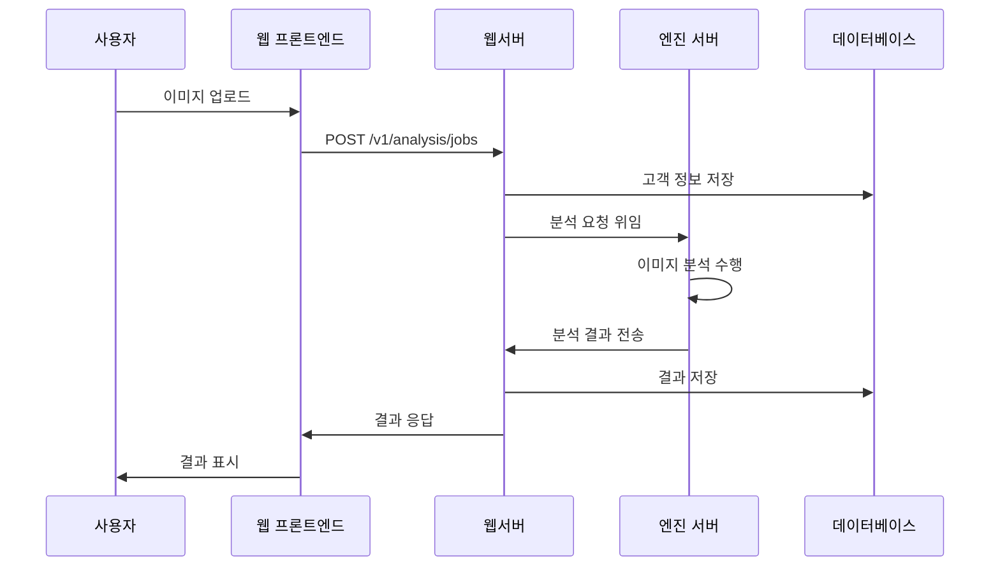
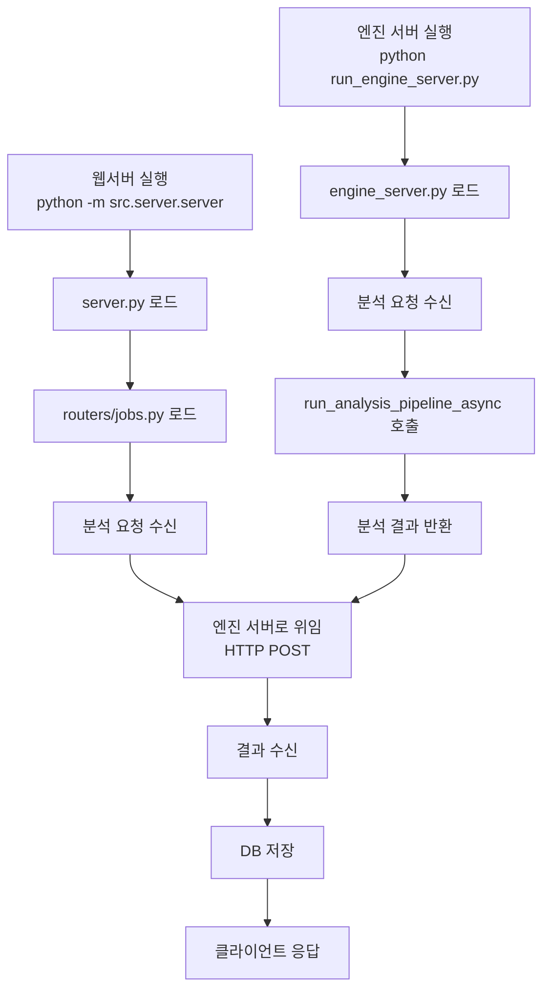
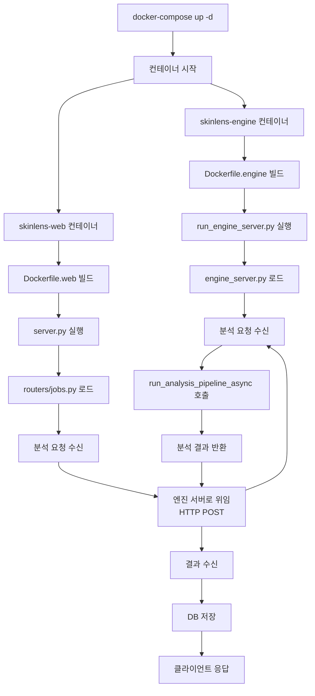
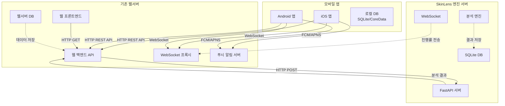
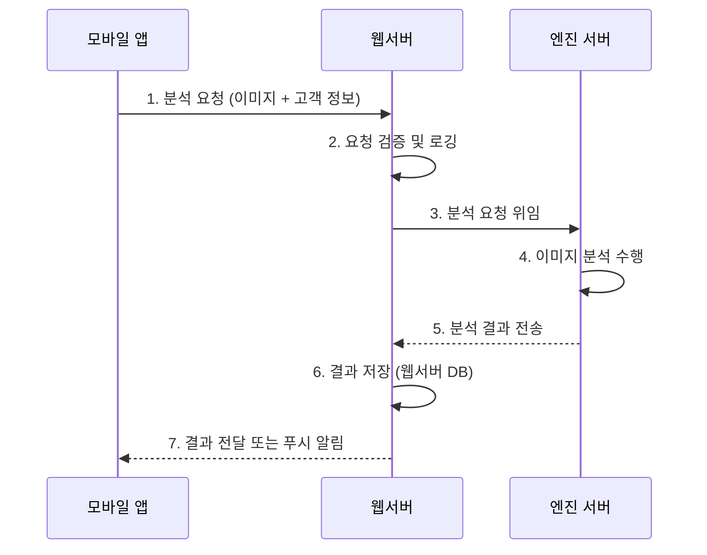
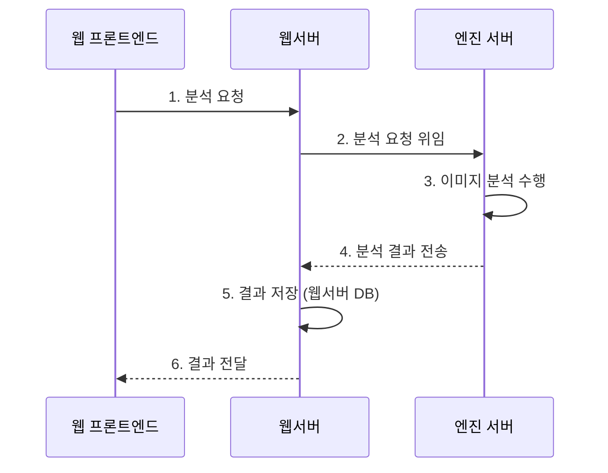

# 웹서버-엔진서버 연동 가이드 (Web Server - Engine Server Integration Guide)

> **문서 버전:** 2.9.0  
> **대상 프로젝트 버전:** 1.0.0  
> **마지막 업데이트:** 2026-06-04  
> **상태:** 활성  
> **대상 독자**: 웹서버 엔지니어

---

## 개요

이 문서는 기존 웹서버와 SkinLens 엔진 서버를 연동하기 위한 절차, API 참조, 데이터 포맷, 오류 처리 방법을 설명합니다. 엔진 서버를 Docker로 구축부터 시작하여 단계별 연동 절차를 자세히 안내합니다.

**연동 목표:**
- 엔진 서버를 Docker로 구축 및 실행
- 웹서버에서 엔진 서버로 분석 요청 위임
- 엔진 서버에서 분석 결과를 웹서버로 전송
- 웹서버에서 모바일 앱으로 결과 전달 또는 푸시 알림
- 웹 프론트엔드에서 웹서버를 통해 분석 요청 및 결과 조회
- 실시간 진행률 추적 (WebSocket)
- 에러 처리 및 재시도 로직

---

## 1. 시스템 구성 요소

### 1.1 구성 요소 정의

SkinLens 시스템은 세 가지 주요 구성 요소로 구성됩니다:

| 구성 요소 | 역할 | 기술 스택 | 포트 | 예시 |
|----------|------|----------|------|------|
| **웹 프론트엔드** | 사용자 인터페이스 제공, 사용자 입력 수집, 결과 표시 | React, Vue, Angular, HTML/CSS/JS | 3000/8080 | skinlens-web.com |
| **웹서버 (외부)** | API 요청 처리, 인증/인가, 비즈니스 로직 | Node.js (Express, NestJS) | 80/443 | api.skinlens.com |
| **웹서버 (중계)** | 엔진 서버 연동, 분석 위임, 결과 전달 | Python FastAPI (임시) | 8000 | localhost:8000 |
| **엔진 서버** | 피부 분석 수행, 이미지 처리, 결과 생성 | Python FastAPI, ML 라이브러리 | 8001 | engine.skinlens.com |

### 1.2 웹서버 구성

**외부 웹서버 (Node.js)**:
- **역할**: 사용자 인증, API 게이트웨이, 비즈니스 로직
- **기술 스택**: Node.js (Express, NestJS)
- **위치**: 외부 시스템 (프로젝트 외부)
- **포트**: 80/443

**중계 서버 (Python FastAPI)**:
- **역할**: 외부 웹서버와 엔진 서버 사이의 중계
- **기술 스택**: Python FastAPI
- **위치**: 현재 프로젝트 (src/server/server.py)
- **포트**: 8000
- **용도**: 시뮬레이션 및 개발 환경

**엔진 서버 (Python FastAPI)**:
- **역할**: 피부 분석 전용
- **기술 스택**: Python FastAPI, ML 라이브러리
- **위치**: 현재 프로젝트 (src/engine/engine_server.py)
- **포트**: 8001

### 1.3 웹 프론트엔드 vs 웹서버 차이

| 항목 | 웹 프론트엔드 | 웹서버 |
|------|-------------|--------|
| **주요 역할** | 사용자 인터페이스 제공 | API 요청 처리 및 비즈니스 로직 |
| **실행 위치** | 브라우저 (클라이언트) | 서버 |
| **사용자 접근** | 직접 접근 (URL 입력) | API 호출로만 접근 |
| **데이터 처리** | 표시용 데이터만 처리 | 비즈니스 로직 및 데이터 저장 |
| **인증** | 토큰 저장 및 전송 | 토큰 검증 및 발급 |
| **보안** | XSS, CSRF 방지 | 인증/인가, 데이터 암호화 |
| **통신 대상** | 웹서버 | 웹 프론트엔드, 엔진 서버, DB |
| **상태 관리** | 클라이언트 상태 (Redux, Vuex 등) | 서버 상태 (DB, 세션 등) |

### 1.4 통신 흐름



### 1.5 파일 간 실행 흐름

#### 1.5.1 로컬 실행 (개발 환경)



#### 1.5.2 Docker 실행 (프로덕션 환경)



#### 1.5.3 파일 구조

```
SkinLens v1/
├── src/
│   ├── server/
│   │   ├── server.py              # 웹서버 메인 (FastAPI)
│   │   ├── routers/
│   │   │   ├── auth.py            # 인증 엔드포인트
│   │   │   └── jobs.py            # 분석 요청 엔드포인트 (엔진 서버 위임)
│   │   └── deps.py                # 의존성 주입
│   └── engine/
│       └── engine_server.py       # 엔진 서버 메인 (FastAPI)
├── run_engine_server.py           # 엔진 서버 실행 스크립트
├── Dockerfile.engine              # 엔진 서버 Dockerfile
├── Dockerfile.web                 # 웹서버 Dockerfile
├── docker-compose.yml              # 전체 시스템 구성
└── docker-compose.engine.yml      # 엔진 서버만 구성
```

#### 1.5.4 실행 순서

**로컬 실행 (개발 환경)**:
1. 엔진 서버 실행: `python run_engine_server.py`
2. 웹서버 실행: `python -m src.server.server`
3. 웹서버가 엔진 서버로 분석 위임

**Docker 실행 (프로덕션 환경)**:
1. 전체 시스템 실행: `docker-compose up -d`
2. Docker Compose가 엔진 서버와 웹서버 컨테이너 시작
3. 웹서버 컨테이너가 엔진 서버 컨테이너로 분석 위임

#### 1.5.5 실행 환경 비교

| 환경 | 웹서버 (외부) | 웹서버 (중계) | 엔진 서버 | 권장 대상 |
|------|-------------|-------------|----------|----------|
| **프로덕션** | Node.js (외부) | 없음 | Docker 컨테이너 | 프로덕션 |
| **개발 (시뮬레이션)** | 없음 | Python FastAPI | Docker 컨테이너 | 개발 (현재 구성) |
| **개발 (전체 로컬)** | 없음 | Python FastAPI | Python FastAPI | 개발/테스트 |

**현재 구성 (시뮬레이션)**:
- 웹서버 (중계): Python FastAPI 실행 (`python -m src.server.server`)
- 엔진 서버: Docker 컨테이너 실행 (`docker-compose -f docker-compose.engine.yml up -d`)
- 용도: 외부 Node.js 웹서버 시뮬레이션, 개발 환경

**프로덕션 구성**:
- 웹서버 (외부): Node.js (Express, NestJS)
- 웹서버 (중계): 없음 (외부 웹서버가 직접 엔진 서버 호출)
- 엔진 서버: Docker 컨테이너 실행
- 용도: 프로덕션 환경

### 1.6 웹 프론트엔드의 역할

- **사용자 인터페이스**: 이미지 업로드 폼, 결과 표시 화면
- **입력 수집**: 고객 정보, 이미지 파일, 옵션 선택
- **결과 표시**: 분석 결과, 차트, 보고서
- **상태 관리**: 로딩 상태, 진행률, 에러 메시지
- **토큰 관리**: JWT 토큰 저장 및 API 요청 헤더에 포함

### 1.7 웹서버의 역할

- **API 요청 처리**: REST API 엔드포인트 제공
- **인증/인가**: JWT 토큰 검증, 권한 확인
- **엔진 서버 연동**: 분석 요청 위임, 결과 수신
- **데이터 저장**: 고객 정보, 분석 결과 DB 저장
- **WebSocket 프록시**: 실시간 진행률 전달
- **푸시 알림**: 분석 완료 알림 전송

---

## 2. Docker 설치

이 섹션에서는 Docker 및 Docker Compose를 설치하는 절차를 설명합니다.

### 2.1 Windows 설치

> **상세 설치 가이드**: [WINDOWS_DOCKER_SETUP_GUIDE.md](WINDOWS_DOCKER_SETUP_GUIDE.md) - Windows Docker 설치 절차, BIOS 가상화 설정, 문제 해결 포함

#### 2.1.1 Docker Desktop for Windows 설치

1. **Docker Desktop 다운로드**
   - https://www.docker.com/products/docker-desktop/ 접속
   - Windows용 Docker Desktop 다운로드

2. **설치**
   ```bash
   # 다운로드한 설치 파일 실행 (Docker Desktop Installer.exe)
   # 설치 마법사 안내에 따라 설치 진행
   # 설치 완료 후 시스템 재부팅
   ```

3. **WSL 2 활성화** (Windows 10/11)
   ```bash
   # PowerShell을 관리자 권한으로 실행
   wsl --install
   # 재부팅 후 WSL 2 설치 완료
   ```

4. **Docker Desktop 시작**
   - 시작 메뉴에서 Docker Desktop 실행
   - 트레이 아이콘이 녹색으로 변경되면 정상 작동

#### 1.1.2 설치 확인

```bash
# PowerShell 또는 CMD에서 실행
docker --version
docker-compose --version
docker run hello-world
```

**예상 출력:**
```
Docker version 24.0.0, build xxx
Docker Compose version v2.20.0
Hello from Docker!
...
```

### 2.2 Linux (Ubuntu/Debian) 설치

#### 2.2.1 Docker 설치

```bash
# 패키지 인덱스 업데이트
sudo apt-get update

# 필요한 패키지 설치
sudo apt-get install -y \
    ca-certificates \
    curl \
    gnupg \
    lsb-release

# Docker 공식 GPG 키 추가
sudo mkdir -p /etc/apt/keyrings
curl -fsSL https://download.docker.com/linux/ubuntu/gpg | sudo gpg --dearmor -o /etc/apt/keyrings/docker.gpg

# Docker 리포지토리 설정
echo \
  "deb [arch=$(dpkg --print-architecture) signed-by=/etc/apt/keyrings/docker.gpg] https://download.docker.com/linux/ubuntu \
  $(lsb_release -cs) stable" | sudo tee /etc/apt/sources.list.d/docker.list > /dev/null

# Docker Engine 설치
sudo apt-get update
sudo apt-get install -y docker-ce docker-ce-cli containerd.io docker-compose-plugin

# Docker 서비스 시작
sudo systemctl start docker
sudo systemctl enable docker

# 사용자를 docker 그룹에 추가 (sudo 없이 사용)
sudo usermod -aG docker $USER
# 로그아웃 후 재로그인 필요
```

#### 2.2.2 설치 확인

```bash
docker --version
docker compose version
docker run hello-world
```

### 2.3 macOS 설치

#### 2.3.1 Docker Desktop for Mac 설치

1. **Docker Desktop 다운로드**
   - https://www.docker.com/products/docker-desktop/ 접속
   - Mac용 Docker Desktop 다운로드 (Intel Chip 또는 Apple Chip)

2. **설치**
   ```bash
   # 다운로드한 .dmg 파일 열기
   # Docker.app을 Applications 폴더로 드래그
   # Applications 폴더에서 Docker.app 실행
   ```

3. **설치 확인**
   ```bash
   docker --version
   docker compose version
   docker run hello-world
   ```

### 2.4 Docker 설치 트러블슈팅

#### 일반적인 문제 및 해결 방법

| 문제 | 원인 | 해결 방법 | 트러블슈팅 가이드 참조 |
|------|------|----------|----------------------|
| Docker 명령어를 찾을 수 없음 | PATH 설정 오류 | 시스템 재부팅 또는 PATH 수동 설정 | [1.6.1 CPU 사용량 과다](TROUBLESHOOTING_GUIDE.md#161-cpu-사용량-과다) |
| 권한 거류 (permission denied) | docker 그룹 미가입 | 사용자를 docker 그룹에 추가 | [1.4.1 웹서버 DB 연결 실패](TROUBLESHOOTING_GUIDE.md#141-웹서버-db-연결-실패) |
| WSL 2 설치 실패 | Windows 버전 호환성 문제 | Windows Update 실행 | [1.6.1 CPU 사용량 과다](TROUBLESHOOTING_GUIDE.md#161-cpu-사용량-과다) |
| Docker Desktop 시작 실패 | Hyper-V/WSL 2 미활성화 | Windows 기능에서 Hyper-V/WSL 2 활성화 | [1.6.1 CPU 사용량 과다](TROUBLESHOOTING_GUIDE.md#161-cpu-사용량-과다) |
| hello-world 실행 실패 | 네트워크 문제 | 방화벽 확인 및 프록시 설정 | [1.2.1 엔진 서버 연결 실패](TROUBLESHOOTING_GUIDE.md#121-엔진-서버-연결-실패) |

#### 참조 문서

| 문서 | 경로 | 설명 |
|------|------|------|
| Docker 공식 문서 | https://docs.docker.com/engine/install/ | Docker 설치 가이드 |
| Docker Desktop 문서 | https://docs.docker.com/desktop/ | Docker Desktop 사용법 |
| 트러블슈팅 가이드 | `docs/guides/TROUBLESHOOTING_GUIDE.md` | 웹서버 트러블슈팅 |

---

## 3. 엔진 서버 Docker 구축

### 3.1 Docker 이미지 빌드

#### 3.1.1 Dockerfile 작성

엔진 서버를 위한 Dockerfile을 작성합니다.

```dockerfile
# Dockerfile
FROM python:3.11-slim

# 작업 디렉토리 설정
WORKDIR /app

# 시스템 패키지 설치
RUN apt-get update && apt-get install -y \
    gcc \
    g++ \
    libgomp1 \
    libgl1-mesa-glx \
    libglib2.0-0 \
    && rm -rf /var/lib/apt/lists/*

# Python 패키지 설치
COPY requirements.txt .
RUN pip install --no-cache-dir -r requirements.txt

# 애플리케이션 파일 복사
COPY . .

# 데이터 디렉토리 생성
RUN mkdir -p data runtime/results/api_jobs

# 포트 노출
EXPOSE 8000

# 환경 변수 설정
ENV PYTHONUNBUFFERED=1
ENV HOST=0.0.0.0
ENV PORT=8000

# 서버 실행
CMD ["python", "main.py"]
```

#### 2.1.2 requirements.txt 작성

```txt
# requirements.txt
fastapi==0.104.1
uvicorn[standard]==0.24.0
python-multipart==0.0.6
python-jose[cryptography]==3.3.0
passlib[bcrypt]==1.7.4
pydantic==2.5.0
pydantic-settings==2.1.0
Pillow==10.1.0
numpy==1.26.2
torch==2.1.0
torchvision==0.16.0
opencv-python==4.8.1.78
aiofiles==23.2.1
websockets==12.0
httpx==0.25.2
```

#### 2.1.3 Docker 이미지 빌드

```bash
# Docker 이미지 빌드
docker build -t skinlens-engine:1.0.0 .

# 이미지 확인
docker images | grep skinlens-engine
```

### 3.2 Docker Compose 설정

#### 3.2.1 docker-compose.yml 작성

```yaml
# docker-compose.yml
version: '3.8'

services:
  skinlens-engine:
    build: .
    image: skinlens-engine:1.0.0
    container_name: skinlens-engine
    ports:
      - "8000:8000"
    volumes:
      - ./data:/app/data
      - ./runtime:/app/runtime
      - ./models:/app/models
    environment:
      - HOST=0.0.0.0
      - PORT=8000
      - ENVIRONMENT=production
      - JWT_SECRET_KEY=your-secret-key-here
      - DB_PATH=/app/data/skin_analysis.db
    restart: unless-stopped
    healthcheck:
      test: ["CMD", "curl", "-f", "http://localhost:8000/health"]
      interval: 30s
      timeout: 10s
      retries: 3
      start_period: 40s
    networks:
      - skinlens-network

networks:
  skinlens-network:
    driver: bridge
```

#### 2.2.2 Docker Compose 실행

```bash
# Docker Compose로 서비스 시작
docker-compose up -d

# 컨테이너 상태 확인
docker-compose ps

# 로그 확인
docker-compose logs -f skinlens-engine

# 서비스 중지
docker-compose down
```

### 3.4 엔진 서버 실행 확인

#### 3.4.1 헬스 체크

```bash
# 엔진 서버 헬스 체크
curl http://localhost:8001/v1/engine/health

# 예상 응답
{
  "status": "healthy",
  "version": "1.0.0",
  "timestamp": "2026-06-03T12:00:00Z"
}
```

#### 3.4.2 엔진 서버 직접 실행 (개발 환경)

Docker 없이 엔진 서버를 직접 실행할 수 있습니다.

```bash
# 엔진 서버 실행
python run_engine_server.py

# 또는 uvicorn 직접 실행
uvicorn src.engine.engine_server:app --host 0.0.0.0 --port 8001
```

#### 3.4.3 엔진 서버 로그 확인

```bash
# Docker 컨테이너 로그
docker logs -f skinlens-engine

# 또는 직접 실행 시 터미널 출력 확인
```

### 3.5 3단계 문제 해결 (엔진 서버 구축)

#### 일반적인 문제 및 해결 방법

| 문제 | 원인 | 해결 방법 | 트러블슈팅 가이드 참조 |
|------|------|----------|----------------------|
| Docker 이미지 빌드 실패 | 패키지 의존성 오류 | requirements.txt 확인 및 패키지 버전 수정 | [1.3.2 5xx 서버 오류](TROUBLESHOOTING_GUIDE.md#132-5xx-서버-오류) |
| Docker Compose 시작 실패 | 포트 충돌 (8000) | 다른 서비스 중지 또는 포트 변경 | [1.6.1 CPU 사용량 과다](TROUBLESHOOTING_GUIDE.md#161-cpu-사용량-과다) |
| 컨테이너 즉시 종료 | 애플리케이션 시작 실패 | 컨테이너 로그 확인 (`docker logs skinlens-engine`) | [1.3.2 5xx 서버 오류](TROUBLESHOOTING_GUIDE.md#132-5xx-서버-오류) |
| 헬스 체크 실패 | 서버 시작 지연 | healthcheck start_period 증가 | [1.2.2 엔진 서버 타임아웃](TROUBLESHOOTING_GUIDE.md#122-엔진-서버-타임아웃) |
| 볼륨 마운트 실패 | 디렉토리 권한 문제 | 디렉토리 권한 확인 및 수정 | [1.4.1 웹서버 DB 연결 실패](TROUBLESHOOTING_GUIDE.md#141-웹서버-db-연결-실패) |
| 네트워크 연결 실패 | 방화벽 차단 | 포트 8000 개방 | [1.2.1 엔진 서버 연결 실패](TROUBLESHOOTING_GUIDE.md#121-엔진-서버-연결-실패) |
| 메모리 부족 | 컨테이너 메모리 제한 | Docker 메모리 제한 증가 | [1.6.1 CPU 사용량 과다](TROUBLESHOOTING_GUIDE.md#161-cpu-사용량-과다) |

#### Docker 관련 명령어

```bash
# 컨테이너 로그 확인
docker logs skinlens-engine

# 컨테이너 실시간 로그 확인
docker logs -f skinlens-engine

# 컨테이너 상태 확인
docker ps -a

# 컨테이너 재시작
docker restart skinlens-engine

# 컨테이너 중지 및 삭제
docker stop skinlens-engine
docker rm skinlens-engine

# 이미지 삭제
docker rmi skinlens-engine:1.0.0

# 네트워크 확인
docker network ls
docker network inspect skinlens-network

# 디스크 사용량 확인
docker system df

# 불필요한 리소스 정리
docker system prune -a
```

#### 참조 문서

| 문서 | 경로 | 설명 |
|------|------|------|
| Docker 공식 문서 | https://docs.docker.com/ | Docker 사용법 |
| Docker Compose 문서 | https://docs.docker.com/compose/ | Docker Compose 사용법 |
| 트러블슈팅 가이드 | `docs/guides/TROUBLESHOOTING_GUIDE.md` | 웹서버 트러블슈팅 |

---

## 4. 시스템 아키텍처

### 4.1 전체 연동 아키텍처



### 4.2 정보 흐름

#### 3.2.1 모바일 앱 → 웹서버 → 엔진 서버 흐름



#### 3.2.2 웹 프론트엔드 → 웹서버 → 엔진 서버 흐름



### 4.3 통신 프로토콜

| 통신 유형 | 출발지 | 목적지 | 프로토콜 | 포트 | 용도 |
|----------|--------|--------|----------|------|------|
| REST API | 모바일 앱 | 웹서버 | HTTP/HTTPS | 80/443 | 분석 요청/조회 |
| REST API | 웹 프론트엔드 | 웹서버 | HTTP/HTTPS | 80/443 | 분석 요청/조회 |
| REST API | 웹서버 | 엔진 서버 | HTTP/HTTPS | 8000 | 분석 위임 |
| WebSocket | 모바일 앱 | 웹서버 | WS/WSS | 80/443 | 실시간 진행률 |
| WebSocket | 웹서버 | 엔진 서버 | WS/WSS | 8000 | 진행률 프록시 |
| 푸시 알림 | 웹서버 | 모바일 앱 | FCM/APNS | - | 분석 완료 알림 |
| 인증 | 모든 클라이언트 | 웹서버/엔진 | JWT Bearer Token | - | API 인증 |

---

## 5. 사전 요구사항

### 5.1 엔진 서버 정보

**기본 정보:**
- **Base URL**: `http://localhost:8000` (개발), `https://api.skinlens.com` (프로덕션)
- **API 버전**: v1
- **인증 방식**: JWT Bearer Token
- **Content-Type**: `application/json`, `multipart/form-data`

**엔진 서버 상태 확인:**
```bash
# 헬스 체크
curl http://localhost:8000/health

# 예상 응답
{
  "status": "healthy",
  "version": "1.0.0",
  "timestamp": "2026-06-01T12:00:00Z"
}
```

### 5.2 웹서버 요구사항

**기술 스택:**
- HTTP 클라이언트 라이브러리 (requests, httpx, axios 등)
- WebSocket 클라이언트 라이브러리
- JWT 토큰 관리
- 비동기 처리 지원 (async/await)

**필요한 정보:**
- 엔진 서버 API 키 또는 인증 정보
- 웹서버 사용자 ID 매핑
- 이미지 저장 경로

### 5.3 네트워크 요구사항

- **방화벽**: 엔진 서버 포트 (8000) 개방
- **DNS**: 엔진 서버 도메인 해결
- **SSL**: 프로덕션 환경 HTTPS 사용
- **타임아웃**: 요청 타임아웃 30초 이상 설정

---

## 6. 연동 절차

### 6.1 1단계: 인증 설정

#### 6.1.1 관리자 계정 생성

엔진 서버에 관리자 계정을 생성하여 웹서버에서 사용할 API 토큰을 발급받습니다.

```bash
# 엔진 서버 DB 접속
docker exec -it skinlens-engine sqlite3 data/skin_analysis.db

# 관리자 계정 생성 (이미 존재하는 경우 확인)
INSERT INTO users (username, password_hash, role, is_active, created_at)
VALUES ('webserver_admin', '<hashed_password>', 'admin', 1, datetime('now'));

# 계정 확인
SELECT username, role, is_active FROM users WHERE username = 'webserver_admin';
```

#### 6.1.2 JWT 토큰 발급

```bash
# 로그인하여 JWT 토큰 발급
curl -X POST http://localhost:8000/v1/auth/login \
  -H "Content-Type: application/json" \
  -d '{
    "username": "webserver_admin",
    "password": "your_password"
  }'

# 응답
{
  "access_token": "eyJhbGciOiJIUzI1NiIsInR5cCI6IkpXVCJ9...",
  "refresh_token": "eyJhbGciOiJIUzI1NiIsInR5cCI6IkpXVCJ9...",
  "token_type": "bearer",
  "expires_in": 3600
}
```

**토큰 저장:**
- Access Token: 웹서버 환경 변수 또는 설정 파일에 저장
- Refresh Token: 토큰 갱신용으로 저장

#### 6.1.3 토큰 갱신 로직

```python
import requests

def refresh_access_token(refresh_token):
    """Access Token 갱신"""
    response = requests.post(
        "http://localhost:8000/v1/auth/refresh",
        headers={"Authorization": f"Bearer {refresh_token}"}
    )
    
    if response.status_code == 200:
        data = response.json()
        return data["access_token"]
    else:
        # 재로그인 필요
        return login_and_get_token()
```

### 6.1.4 1단계 문제 해결

#### 일반적인 문제 및 해결 방법

| 문제 | 원인 | 해결 방법 | 트러블슈팅 가이드 참조 |
|------|------|----------|----------------------|
| 로그인 실패 (401) | 비밀번호 불일치 | 비밀번호 확인 및 재설정 | [1.3.1 4xx 클라이언트 오류](TROUBLESHOOTING_GUIDE.md#131-4xx-클라이언트-오류) |
| 토큰 만료 (401) | 토큰 유효기간 초과 | 토큰 갱신 로직 구현 | [1.3.1 4xx 클라이언트 오류](TROUBLESHOOTING_GUIDE.md#131-4xx-클라이언트-오류) |
| 권한 부족 (403) | 관리자 권한 없음 | DB에서 role을 'admin'으로 변경 | [1.3.1 4xx 클라이언트 오류](TROUBLESHOOTING_GUIDE.md#131-4xx-클라이언트-오류) |
| 계정 잠금 | 로그인 실패 횟수 초과 | DB에서 is_locked를 0으로 변경 | [1.3.1 4xx 클라이언트 오류](TROUBLESHOOTING_GUIDE.md#131-4xx-클라이언트-오류) |

#### 참조 소스 파일

| 파일 | 경로 | 설명 |
|------|------|------|
| 인증 의존성 | `src/server/deps/auth.py` | JWT 토큰 생성 및 검증 로직 |
| 인증 라우터 | `src/server/routers/auth.py` | 로그인, 토큰 갱신 API 구현 |
| 설정 파일 | `config/config.json` | JWT 만료 시간, 비밀키 설정 |

#### 참조 테스트 파일

| 파일 | 경로 | 설명 |
|------|------|------|
| 인증 API 테스트 | `tests/test_auth_api.py` | 로그인, 토큰 갱신 테스트 |
| 인증 의존성 테스트 | `tests/test_server.py` | JWT 토큰 검증 테스트 |

#### 참조 문서

| 문서 | 경로 | 설명 |
|------|------|------|
| API 레퍼런스 | `docs/api/API_REFERENCE.md` | 인증 API 상세 스펙 |
| 보안 가이드 | `docs/ops/SECURITY_GUIDE.md` | 인증 보안 정책 |
| 트러블슈팅 가이드 | `docs/guides/TROUBLESHOOTING_GUIDE.md` | 인증 문제 해결 |

### 6.2 2단계: 분석 요청 API 연동

#### 6.2.1 분석 작업 생성

웹서버에서 엔진 서버로 분석 요청을 보냅니다.

**API 엔드포인트:** `POST /v1/analysis/jobs`

**요청 파라미터:**
```json
{
  "customer_id": "CUST001",
  "customer_name": "홍길동",
  "customer_contact": "010-1234-5678",
  "customer_address": "서울시 강남구",
  "gender": "female",
  "age": 30,
  "do_restore": true,
  "llm_report": false
}
```

**이미지 업로드:** `multipart/form-data`

```python
import requests

def create_analysis_job(image_path, customer_data, access_token):
    """분석 작업 생성"""
    url = "http://localhost:8000/v1/analysis/jobs"
    
    files = {
        "image": open(image_path, "rb")
    }
    
    data = {
        "customer_id": customer_data["customer_id"],
        "customer_name": customer_data["customer_name"],
        "customer_contact": customer_data["customer_contact"],
        "customer_address": customer_data["customer_address"],
        "gender": customer_data["gender"],
        "age": customer_data["age"],
        "do_restore": str(customer_data.get("do_restore", True)).lower(),
        "llm_report": str(customer_data.get("llm_report", False)).lower()
    }
    
    headers = {
        "Authorization": f"Bearer {access_token}"
    }
    
    response = requests.post(url, files=files, data=data, headers=headers)
    
    if response.status_code == 202:
        return response.json()  # {"job_id": "job_uuid", "status": "pending"}
    else:
        raise Exception(f"Job creation failed: {response.status_code}")
```

**응답:**
```json
{
  "job_id": "550e8400-e29b-41d4-a716-446655440000",
  "status": "pending",
  "estimated_duration": 10
}
```

#### 6.2.2 작업 상태 조회

```python
def get_job_status(job_id, access_token):
    """작업 상태 조회"""
    url = f"http://localhost:8000/v1/analysis/jobs/{job_id}"
    
    headers = {
        "Authorization": f"Bearer {access_token}"
    }
    
    response = requests.get(url, headers=headers)
    
    if response.status_code == 200:
        return response.json()
    else:
        raise Exception(f"Status check failed: {response.status_code}")
```

**응답 (진행 중):**
```json
{
  "job_id": "550e8400-e29b-41d4-a716-446655440000",
  "status": "processing",
  "progress": 50,
  "current_step": "analyzing",
  "created_at": "2026-06-01T12:00:00Z"
}
```

**응답 (완료):**
```json
{
  "job_id": "550e8400-e29b-41d4-a716-446655440000",
  "status": "completed",
  "progress": 100,
  "result": {
    "overall_score": 75.5,
    "measurements": {
      "pigmentation": 70,
      "redness": 65,
      "pores": 80
    },
    "restored_image_url": "/runtime/results/.../restored.jpg"
  },
  "created_at": "2026-06-01T12:00:00Z",
  "completed_at": "2026-06-01T12:00:10Z"
}
```

#### 5.2.3 폴링 방식 구현

```python
import time

def wait_for_job_completion(job_id, access_token, max_wait=60, poll_interval=2):
    """작업 완료 대기 (폴링)"""
    elapsed = 0
    
    while elapsed < max_wait:
        status_data = get_job_status(job_id, access_token)
        status = status_data["status"]
        
        if status == "completed":
            return status_data["result"]
        elif status == "failed":
            raise Exception(f"Job failed: {status_data.get('error', 'Unknown error')}")
        
        time.sleep(poll_interval)
        elapsed += poll_interval
    
    raise TimeoutError(f"Job timeout after {max_wait} seconds")
```

### 6.2.4 2단계 문제 해결

#### 일반적인 문제 및 해결 방법

| 문제 | 원인 | 해결 방법 | 트러블슈팅 가이드 참조 |
|------|------|----------|----------------------|
| 400 Bad Request | 요청 파라미터 오류 | 필수 필드 확인 (customer_name, customer_contact, customer_address) | [1.3.1 4xx 클라이언트 오류](TROUBLESHOOTING_GUIDE.md#131-4xx-클라이언트-오류) |
| 422 Unprocessable Entity | 데이터 유효성 검증 실패 | 데이터 형식 확인 (gender: male/female, age: 정수) | [1.3.1 4xx 클라이언트 오류](TROUBLESHOOTING_GUIDE.md#131-4xx-클라이언트-오류) |
| 413 Payload Too Large | 파일 크기 초과 | 파일 크기 10MB 이하로 줄이기 | [1.3.1 4xx 클라이언트 오류](TROUBLESHOOTING_GUIDE.md#131-4xx-클라이언트-오류) |
| 415 Unsupported Media Type | 지원하지 않는 이미지 형식 | JPG, PNG, WEBP로 변환 | [1.3.1 4xx 클라이언트 오류](TROUBLESHOOTING_GUIDE.md#131-4xx-클라이언트-오류) |
| 404 Not Found | Job ID 없음 | Job ID 확인 및 재생성 | [1.3.1 4xx 클라이언트 오류](TROUBLESHOOTING_GUIDE.md#131-4xx-클라이언트-오류) |
| 타임아웃 | 분석 시간 초과 | max_wait 시간 증가 또는 WebSocket 사용 | [1.3.2 5xx 서버 오류](TROUBLESHOOTING_GUIDE.md#132-5xx-서버-오류) |

#### 참조 소스 파일

| 파일 | 경로 | 설명 |
|------|------|------|
| 분석 라우터 | `src/server/routers/jobs.py` | 분석 작업 생성, 상태 조회 API 구현 |
| 작업 큐 | `src/pipeline/job_queue.py` | 비동기 작업 큐 관리 |
| 파이프라인 코어 | `src/pipeline/pipeline_core.py` | 분석 파이프라인 실행 로직 |

#### 참조 테스트 파일

| 파일 | 경로 | 설명 |
|------|------|------|
| 분석 API 테스트 | `tests/test_server.py` | 작업 생성, 상태 조회 테스트 |
| 파이프라인 테스트 | `tests/test_pipeline_core.py` | 파이프라인 실행 테스트 |
| 통합 테스트 | `tests/test_full_integration.py` | 전체 분석 워크플로우 테스트 |

#### 참조 문서

| 문서 | 경로 | 설명 |
|------|------|------|
| API 레퍼런스 | `docs/api/API_REFERENCE.md` | 분석 API 상세 스펙 |
| 트러블슈팅 가이드 | `docs/guides/TROUBLESHOOTING_GUIDE.md` | API, 파일 업로드 문제 해결 |
| 아키텍처 | `docs/guides/ARCHITECTURE.md` | 파이프라인 아키텍처 |

### 6.3 3단계: WebSocket 연동 (실시간 진행률)

#### 6.3.1 WebSocket 연결

```python
import websockets
import asyncio
import json

async def connect_websocket(job_id, access_token):
    """WebSocket 연결"""
    uri = f"ws://localhost:8000/v1/ws/analysis/{job_id}"
    headers = {
        "Authorization": f"Bearer {access_token}"
    }
    
    async with websockets.connect(uri, extra_headers=headers) as websocket:
        while True:
            message = await websocket.recv()
            data = json.loads(message)
            
            # 진행률 처리
            if data["type"] == "progress":
                print(f"Progress: {data['progress']}%")
                print(f"Step: {data['current_step']}")
            
            # 완료 처리
            elif data["type"] == "completed":
                return data["result"]
            
            # 에러 처리
            elif data["type"] == "error":
                raise Exception(data["error"])
```

#### 5.3.2 웹서버에서 WebSocket 프록시

웹서버에서 WebSocket 프록시를 설정하여 프론트엔드가 직접 엔진 서버 WebSocket에 연결할 수 있도록 합니다.

**Nginx 설정 예시:**
```nginx
location /ws/ {
    proxy_pass http://localhost:8000/v1/ws/;
    proxy_http_version 1.1;
    proxy_set_header Upgrade $http_upgrade;
    proxy_set_header Connection "upgrade";
    proxy_set_header Authorization $http_authorization;
}
```

### 6.3.3 3단계 문제 해결

#### 일반적인 문제 및 해결 방법

| 문제 | 원인 | 해결 방법 | 트러블슈팅 가이드 참조 |
|------|------|----------|----------------------|
| WebSocket 연결 실패 | 인증 토큰 만료 | 토큰 갱신 후 재연결 | [1.3.1 4xx 클라이언트 오류](TROUBLESHOOTING_GUIDE.md#131-4xx-클라이언트-오류) |
| 연결 끊김 | 네트워크 불안정 | 재연결 로직 구현 | [1.2.3 WebSocket 프록시 실패](TROUBLESHOOTING_GUIDE.md#123-websocket-프록시-실패) |
| 메시지 수신 안 됨 | Job ID 오류 | Job ID 확인 | [1.2.3 WebSocket 프록시 실패](TROUBLESHOOTING_GUIDE.md#123-websocket-프록시-실패) |
| 프록시 설정 오류 | Nginx 설정 오류 | proxy_set_header 확인 | [1.2.3 WebSocket 프록시 실패](TROUBLESHOOTING_GUIDE.md#123-websocket-프록시-실패) |

#### 참조 소스 파일

| 파일 | 경로 | 설명 |
|------|------|------|
| WebSocket 관리자 | `src/server/websocket_manager.py` | WebSocket 연결 관리 |
| WebSocket 라우터 | `src/server/routers/websocket.py` | WebSocket 엔드포인트 구현 |
| 미들웨어 | `src/server/middleware/websocket.py` | WebSocket 인증 미들웨어 |

#### 참조 테스트 파일

| 파일 | 경로 | 설명 |
|------|------|------|
| WebSocket 테스트 | `tests/test_websocket_management.py` | WebSocket 연결 테스트 |
| 서버 테스트 | `tests/test_server.py` | WebSocket 엔드포인트 테스트 |

#### 참조 문서

| 문서 | 경로 | 설명 |
|------|------|------|
| API 레퍼런스 | `docs/api/API_REFERENCE.md` | WebSocket API 상세 스펙 |
| 아키텍처 | `docs/guides/ARCHITECTURE.md` | WebSocket 아키텍처 |
| 트러블슈팅 가이드 | `docs/guides/TROUBLESHOOTING_GUIDE.md` | 네트워크 문제 해결 |

### 6.4 4단계: 결과 데이터 처리

#### 6.4.1 결과 데이터 구조

```json
{
  "job_id": "550e8400-e29b-41d4-a716-446655440000",
  "status": "completed",
  "result": {
    "overall_score": 75.5,
    "overall_score_report": 80.0,
    "measurements": {
      "pigmentation": 70,
      "redness": 65,
      "pores": 80,
      "wrinkles": 60,
      "elasticity": 75,
      "hydration": 70,
      "oiliness": 65,
      "sensitivity": 70,
      "texture": 75,
      "tone_evenness": 70,
      "dark_circles": 65,
      "puffiness": 60,
      "acne": 70,
      "blackheads": 75,
      "whiteheads": 70,
      "enlarged_pores": 80,
      "fine_lines": 60,
      "deep_wrinkles": 55
    },
    "restored_image_url": "/runtime/results/.../restored.jpg",
    "original_image_url": "/runtime/results/.../original.jpg",
    "analysis_metadata": {
      "model_version": "v3.0",
      "analysis_time": 8.5,
      "device_info": "GPU"
    }
  },
  "created_at": "2026-06-01T12:00:00Z",
  "completed_at": "2026-06-01T12:00:10Z"
}
```

#### 5.4.2 웹서버 DB 저장

```python
def save_analysis_result_to_webserver_db(result, customer_id):
    """웹서버 DB에 분석 결과 저장"""
    # 웹서버 DB 연결 (예시)
    db_connection = get_webserver_db_connection()
    
    cursor = db_connection.cursor()
    
    # 분석 결과 저장
    cursor.execute("""
        INSERT INTO skin_analyses (
            customer_id,
            job_id,
            overall_score,
            overall_score_report,
            measurements,
            restored_image_url,
            original_image_url,
            created_at,
            completed_at
        ) VALUES (?, ?, ?, ?, ?, ?, ?, ?, ?)
    """, (
        customer_id,
        result["job_id"],
        result["result"]["overall_score"],
        result["result"]["overall_score_report"],
        json.dumps(result["result"]["measurements"]),
        result["result"]["restored_image_url"],
        result["result"]["original_image_url"],
        result["created_at"],
        result["completed_at"]
    ))
    
    db_connection.commit()
    db_connection.close()
```

### 6.4.3 4단계 문제 해결

#### 일반적인 문제 및 해결 방법

| 문제 | 원인 | 해결 방법 | 트러블슈팅 가이드 참조 |
|------|------|----------|----------------------|
| 결과 데이터 파싱 오류 | JSON 형식 오류 | 응답 구조 확인 | [1.3.1 4xx 클라이언트 오류](TROUBLESHOOTING_GUIDE.md#131-4xx-클라이언트-오류) |
| 점수 범위 오류 | SafetyNet 트리거 | 점수 범위 0-100 확인 | [1.3.1 4xx 클라이언트 오류](TROUBLESHOOTING_GUIDE.md#131-4xx-클라이언트-오류) |
| 이미지 URL 없음 | 복원 실패 | do_restore=true 확인 | [1.3.1 4xx 클라이언트 오류](TROUBLESHOOTING_GUIDE.md#131-4xx-클라이언트-오류) |
| DB 저장 실패 | 스키마 불일치 | 웹서버 DB 스키마 확인 | [1.4.2 웹서버 DB 잠금 (Lock)](TROUBLESHOOTING_GUIDE.md#142-웹서버-db-잠금-lock) |

#### 참조 소스 파일

| 파일 | 경로 | 설명 |
|------|------|------|
| 결과 파서 | `src/db/result_parser.py` | 분석 결과 파싱 로직 |
| SafetyNet | `src/skin/scoring/safety_net.py` | 점수 안전성 검증 |
| DB 모듈 | `src/db/skin_analysis_db.py` | 엔진 서버 DB 저장 로직 |

#### 참조 테스트 파일

| 파일 | 경로 | 설명 |
|------|------|------|
| 결과 파서 테스트 | `tests/test_result_parser.py` | 결과 파싱 테스트 |
| SafetyNet 테스트 | `tests/test_scoring_report.py` | 점수 검증 테스트 |
| DB 테스트 | `tests/test_repositories.py` | DB 저장 테스트 |

#### 참조 문서

| 문서 | 경로 | 설명 |
|------|------|------|
| API 레퍼런스 | `docs/api/API_REFERENCE.md` | 결과 데이터 상세 스펙 |
| 데이터 모델 | `docs/db/DATA_MODEL.md` | DB 스키마 및 데이터 모델 |
| SafetyNet 문서 | `docs/scoring/SAFETY_NET.md` | 점수 안전성 검증 |

### 6.5 5단계: 에러 처리 및 재시도

#### 6.5.1 에러 코드 처리

| HTTP 상태코드 | 의미 | 처리 방법 |
|---------------|------|----------|
| 400 | 요청 파라미터 오류 | 파라미터 검증 후 재요청 |
| 401 | 인증 실패 | 토큰 갱신 후 재요청 |
| 403 | 권한 부족 | 관리자 권한 확인 |
| 404 | 리소스 없음 | Job ID 확인 |
| 422 | 데이터 유효성 검증 실패 | 데이터 형식 확인 |
| 500 | 서버 내부 오류 | 재시도 또는 지원팀 연락 |
| 503 | 서비스 불가 | 잠시 대기 후 재시도 |

#### 6.5.2 재시도 로직

```python
import time
from functools import wraps

def retry_on_failure(max_retries=3, delay=2):
    """재시도 데코레이터"""
    def decorator(func):
        @wraps(func)
        def wrapper(*args, **kwargs):
            last_exception = None
            
            for attempt in range(max_retries):
                try:
                    return func(*args, **kwargs)
                except requests.exceptions.RequestException as e:
                    last_exception = e
                    print(f"Attempt {attempt + 1} failed: {e}")
                    
                    if attempt < max_retries - 1:
                        time.sleep(delay)
            
            raise last_exception
        return wrapper
    return decorator

@retry_on_failure(max_retries=3, delay=2)
def create_analysis_job_with_retry(image_path, customer_data, access_token):
    """재시도 포함 분석 작업 생성"""
    return create_analysis_job(image_path, customer_data, access_token)
```

### 6.5.3 5단계 문제 해결

#### 일반적인 문제 및 해결 방법

| 문제 | 원인 | 해결 방법 | 트러블슈팅 가이드 참조 |
|------|------|----------|----------------------|
| 지속적인 500 오류 | 서버 내부 오류 | 로그 확인 및 지원팀 연락 | [1.3.2 5xx 서버 오류](TROUBLESHOOTING_GUIDE.md#132-5xx-서버-오류) |
| 503 Service Unavailable | 서버 과부하 | 요청 속도 제한 및 재시도 | [1.3.2 5xx 서버 오류](TROUBLESHOOTING_GUIDE.md#132-5xx-서버-오류) |
| 재시도 횟수 초과 | 일시적 네트워크 문제 | max_retries 증가 | [1.2.2 엔진 서버 타임아웃](TROUBLESHOOTING_GUIDE.md#122-엔진-서버-타임아웃) |
| 타임아웃 | 응답 시간 초과 | 타임아웃 시간 증가 | [1.2.2 엔진 서버 타임아웃](TROUBLESHOOTING_GUIDE.md#122-엔진-서버-타임아웃) |

#### 참조 소스 파일

| 파일 | 경로 | 설명 |
|------|------|------|
| 에러 처리 | `src/server/error_handling.py` | 에러 처리 미들웨어 |
| 자동 복구 | `src/recovery/auto_recovery.py` | 자동 복구 로직 |
| 미들웨어 | `src/server/middleware/error_handler.py` | 에러 핸들러 |

#### 참조 테스트 파일

| 파일 | 경로 | 설명 |
|------|------|------|
| 에러 처리 테스트 | `tests/test_error_handling.py` | 에러 처리 테스트 |
| 자동 복구 테스트 | `tests/test_auto_recovery.py` | 복구 로직 테스트 |

#### 참조 문서

| 문서 | 경로 | 설명 |
|------|------|------|
| 트러블슈팅 가이드 | `docs/guides/TROUBLESHOOTING_GUIDE.md` | 전체 문제 해결 가이드 |
| 아키텍처 | `docs/guides/ARCHITECTURE.md` | 에러 처리 아키텍처 |

---

### 6.6 6단계: PCR 검사 요청 연동

이 단계에서는 웹서버에서 엔진 서버로 PCR 검사 요청을 위임하는 절차를 설명합니다.

#### 6.6.1 PCR 검사 요청 API

웹서버에서 엔진 서버로 PCR 검사 요청을 전송합니다.

**API 엔드포인트:** `POST /v1/app/pcr/request`

**요청:**
```json
{
  "customer_id": "CUST001",
  "test_type": "skin_analysis",
  "shipping_address": {
    "recipient": "홍길동",
    "phone": "010-1234-5678",
    "address": "서울시 강남구",
    "zip_code": "12345"
  }
}
```

**응답:**
```json
{
  "request_id": "PCR-abc12345",
  "customer_id": "CUST001",
  "test_type": "skin_analysis",
  "requested_at": "2026-06-01T10:00:00Z",
  "status": "pending",
  "order_id": "ORD-xyz67890",
  "message": "PCR 검사 요청이 생성되었습니다. PCR 검사 키트 주문이 생성되었습니다."
}
```

**Python 구현 예시:**
```python
import requests
from typing import Dict, Any

def request_pcr_test(customer_id: str, test_type: str, shipping_address: Dict[str, str], access_token: str) -> Dict[str, Any]:
    """PCR 검사 요청"""
    url = "http://localhost:8000/v1/app/pcr/request"
    headers = {
        "Authorization": f"Bearer {access_token}",
        "Content-Type": "application/json"
    }
    
    payload = {
        "customer_id": customer_id,
        "test_type": test_type,
        "shipping_address": shipping_address
    }
    
    response = requests.post(url, json=payload, headers=headers)
    response.raise_for_status()
    
    return response.json()
```

#### 6.6.2 PCR 검사 결과 조회

PCR 검사 결과를 조회합니다.

**API 엔드포인트:** `GET /v1/app/pcr/results/{customer_id}`

**응답:**
```json
{
  "customer_id": "CUST001",
  "total_results": 1,
  "results": [
    {
      "result_id": "PCR-RES-abc12345",
      "request_id": "PCR-abc12345",
      "customer_id": "CUST001",
      "test_data": "{\"microbiome\": {...}, \"inflammation\": {...}}",
      "interpretation": "피부 미생물 불균형 감지됨",
      "completed_at": "2026-06-05T10:00:00Z"
    }
  ]
}
```

**Python 구현 예시:**
```python
def get_pcr_results(customer_id: str, access_token: str) -> Dict[str, Any]:
    """PCR 검사 결과 조회"""
    url = f"http://localhost:8000/v1/app/pcr/results/{customer_id}"
    headers = {
        "Authorization": f"Bearer {access_token}"
    }
    
    response = requests.get(url, headers=headers)
    response.raise_for_status()
    
    return response.json()
```

#### 6.6.3 6단계 문제 해결

| 문제 | 원인 | 해결 방법 | 트러블슈팅 가이드 참조 |
|------|------|----------|----------------------|
| PCR 검사 요청 실패 | 배송지 정보 누락 | shipping_address 필수 확인 | [2.7 PCR 검사 관련 문제](TROUBLESHOOTING_GUIDE.md#27-pcr-검사-관련-문제) |
| 키트 발송 안 됨 | 주문 생성 실패 | order_id 확인 | [2.7 PCR 검사 관련 문제](TROUBLESHOOTING_GUIDE.md#27-pcr-검사-관련-문제) |
| 결과 조회 실패 | request_id 불일치 | 올바른 request_id 사용 | [2.7 PCR 검사 관련 문제](TROUBLESHOOTING_GUIDE.md#27-pcr-검사-관련-문제) |

#### 참조 소스 파일

| 파일 | 경로 | 설명 |
|------|------|------|
| PCR 검사 API | `src/server/routers/app_features.py` | PCR 검사 요청/결과 API |
| PCR 검사 DB | `src/db/skin_analysis_db.py` | PCR 검사 DB 메서드 |

#### 참조 테스트 파일

| 파일 | 경로 | 설명 |
|------|------|------|
| PCR 검사 테스트 | `tests/test_app_features.py` | PCR 검사 API 테스트 |

#### 참조 문서

| 문서 | 경로 | 설명 |
|------|------|------|
| API 레퍼런스 | `docs/api/API_REFERENCE.md` | PCR 검사 API 상세 스펙 |
| 주문 관리 가이드 | `docs/guides/ORDER_MANAGEMENT_GUIDE.md` | PCR 검사 키트 주문 절차 |

---

### 6.7 7단계: 기성품 주문 연동

이 단계에서는 웹서버에서 엔진 서버로 기성품 주문을 위임하는 절차를 설명합니다.

#### 6.7.1 기성품 목록 조회

기성품 목록을 조회합니다.

**API 엔드포인트:** `GET /v1/orders/products/ready-made`

**응답:**
```json
{
  "ready_made_products": [
    {
      "product_id": "READY-001",
      "product_name": "기성품 1",
      "category": "기초 화장품",
      "price": 25000.0,
      "stock_quantity": 50,
      "description": "모든 피부 타입에 적합한 기초 화장품"
    }
  ],
  "total_products": 2
}
```

**Python 구현 예시:**
```python
def get_ready_made_products(access_token: str) -> Dict[str, Any]:
    """기성품 목록 조회"""
    url = "http://localhost:8000/v1/orders/products/ready-made"
    headers = {
        "Authorization": f"Bearer {access_token}"
    }
    
    response = requests.get(url, headers=headers)
    response.raise_for_status()
    
    return response.json()
```

#### 6.7.2 기성품 주문 생성

기성품 주문을 생성합니다.

**API 엔드포인트:** `POST /v1/orders`

**요청:**
```json
{
  "customer_id": "CUST001",
  "items": [
    {
      "product_id": "READY-001",
      "quantity": 2,
      "price": 25000
    }
  ],
  "shipping_address": {
    "recipient": "홍길동",
    "phone": "010-1234-5678",
    "address": "서울시 강남구",
    "zip_code": "06000"
  },
  "payment_method": "credit_card",
  "recommendation_source": "ready_made_product"
}
```

**응답:**
```json
{
  "order_id": "ORD-20260531-1234",
  "status": "pending_payment",
  "total_amount": 50000,
  "created_at": "2026-05-31T10:00:00Z",
  "payment_url": "https://payment.example.com/pay/ORD-20260531-1234"
}
```

**Python 구현 예시:**
```python
def create_ready_made_order(customer_id: str, items: list, shipping_address: Dict[str, str], payment_method: str, access_token: str) -> Dict[str, Any]:
    """기성품 주문 생성"""
    url = "http://localhost:8000/v1/orders"
    headers = {
        "Authorization": f"Bearer {access_token}",
        "Content-Type": "application/json"
    }
    
    payload = {
        "customer_id": customer_id,
        "items": items,
        "shipping_address": shipping_address,
        "payment_method": payment_method,
        "recommendation_source": "ready_made_product"
    }
    
    response = requests.post(url, json=payload, headers=headers)
    response.raise_for_status()
    
    return response.json()
```

#### 6.7.3 7단계 문제 해결

| 문제 | 원인 | 해결 방법 | 트러블슈팅 가이드 참조 |
|------|------|----------|----------------------|
| 기성품 목록 조회 실패 | 인증 토큰 만료 | 토큰 갱신 | [2.1 인증 관련 문제](TROUBLESHOOTING_GUIDE.md#21-인증-관련-문제) |
| 재고 부족 | stock_quantity = 0 | 다른 제품 선택 | [2.8 주문 관련 문제](TROUBLESHOOTING_GUIDE.md#28-주문-관련-문제) |
| 주문 생성 실패 | 배송지 정보 누락 | shipping_address 필수 확인 | [2.8 주문 관련 문제](TROUBLESHOOTING_GUIDE.md#28-주문-관련-문제) |

#### 참조 소스 파일

| 파일 | 경로 | 설명 |
|------|------|------|
| 기성품 API | `src/server/routers/orders.py` | 기성품 목록 조회 API |
| 기성품 DB | `src/db/skin_analysis_db.py` | 기성품 DB 메서드 |

#### 참조 테스트 파일

| 파일 | 경로 | 설명 |
|------|------|------|
| 기성품 테스트 | `tests/test_orders.py` | 기성품 API 테스트 |

#### 참조 문서

| 문서 | 경로 | 설명 |
|------|------|------|
| API 레퍼런스 | `docs/api/API_REFERENCE.md` | 기성품 API 상세 스펙 |
| 주문 관리 가이드 | `docs/guides/ORDER_MANAGEMENT_GUIDE.md` | 기성품 주문 절차 |

---

## 6. API 레퍼런스

### 6.1 주요 API 엔드포인트

| 엔드포인트 | 메서드 | 설명 | 인증 |
|-----------|--------|------|------|
| `/v1/auth/login` | POST | 로그인 및 토큰 발급 | 불필요 |
| `/v1/auth/refresh` | POST | 토큰 갱신 | 필수 |
| `/v1/analysis/jobs` | POST | 분석 작업 생성 | 필수 |
| `/v1/analysis/jobs/{job_id}` | GET | 작업 상태 조회 | 필수 |
| `/v1/analysis/jobs/{job_id}` | DELETE | 작업 취소 | 필수 |
| `/v1/ws/analysis/{job_id}` | WebSocket | 실시간 진행률 | 필수 |
| `/v1/customer/my/analyses` | GET | 고객 분석 목록 | 필수 |
| `/v1/health` | GET | 헬스 체크 | 불필요 |

### 6.2 상세 API 문서

상세 API 문서는 다음을 참조하세요:
- **API 레퍼런스**: `docs/api/API_REFERENCE.md`
- **Swagger UI**: `http://localhost:8000/docs` (개발 환경)
- **OpenAPI 스펙**: `http://localhost:8000/openapi.json`

---

## 7. 데이터 포맷

### 7.1 요청 데이터 포맷

#### 분석 작업 생성 요청

**Content-Type:** `multipart/form-data`

| 필드 | 타입 | 필수 | 설명 |
|------|------|------|------|
| image | File | 필수 | 이미지 파일 (JPG, PNG, WEBP) |
| customer_id | String | 필수 | 고객 ID |
| customer_name | String | 필수 | 고객 이름 |
| customer_contact | String | 필수 | 고객 연락처 |
| customer_address | String | 필수 | 고객 주소 |
| gender | String | 필수 | 성별 (male, female) |
| age | Integer | 필수 | 나이 |
| do_restore | Boolean | 선택 | 복원 수행 여부 (기본값: true) |
| llm_report | Boolean | 선택 | LLM 보고서 생성 여부 (기본값: false) |

### 7.2 응답 데이터 포맷

#### 작업 생성 응답

```json
{
  "job_id": "550e8400-e29b-41d4-a716-446655440000",
  "status": "pending",
  "estimated_duration": 10
}
```

#### 작업 상태 응답

```json
{
  "job_id": "550e8400-e29b-41d4-a716-446655440000",
  "status": "processing",
  "progress": 50,
  "current_step": "analyzing",
  "created_at": "2026-06-01T12:00:00Z"
}
```

#### 분석 결과 응답

```json
{
  "job_id": "550e8400-e29b-41d4-a716-446655440000",
  "status": "completed",
  "result": {
    "overall_score": 75.5,
    "overall_score_report": 80.0,
    "measurements": {
      "pigmentation": 70,
      "redness": 65,
      "pores": 80
    },
    "restored_image_url": "/runtime/results/.../restored.jpg",
    "original_image_url": "/runtime/results/.../original.jpg"
  },
  "created_at": "2026-06-01T12:00:00Z",
  "completed_at": "2026-06-01T12:00:10Z"
}
```

---

## 8. 보안 고려사항

### 8.1 인증

- **JWT 토큰**: 항상 HTTPS를 통해 전송
- **토큰 저장**: 웹서버 환경 변수 또는 암호화된 설정 파일에 저장
- **토큰 갱신**: 만료 전 갱신 로직 구현

### 8.2 데이터 전송

- **이미지 전송**: HTTPS 사용 (프로덕션)
- **민감 정보**: 고객 개인정보 암호화
- **로그**: 민감 정보 로그에 포함하지 않음

### 8.3 접근 제어

- **IP 필터링**: 엔진 서버 IP 허용 목록에 웹서버 IP 추가
- **속도 제한**: 웹서버에서 요청 속도 제한 구현
- **권한 관리**: 관리자 권한만 사용

---

## 9. 테스트

### 9.1 연동 테스트

#### 9.1.1 단위 테스트

```python
import pytest
import requests

def test_create_analysis_job():
    """분석 작업 생성 테스트"""
    access_token = get_test_token()
    
    response = create_analysis_job(
        image_path="test/fixtures/test.jpg",
        customer_data={
            "customer_id": "TEST001",
            "customer_name": "테스트",
            "customer_contact": "010-0000-0000",
            "customer_address": "테스트 주소",
            "gender": "female",
            "age": 30
        },
        access_token=access_token
    )
    
    assert "job_id" in response
    assert response["status"] == "pending"

def test_get_job_status():
    """작업 상태 조회 테스트"""
    job_id = create_test_job()
    access_token = get_test_token()
    
    status = get_job_status(job_id, access_token)
    
    assert "status" in status
    assert status["job_id"] == job_id
```

#### 9.1.2 통합 테스트

```python
def test_full_analysis_workflow():
    """전체 분석 워크플로우 테스트"""
    # 1. 작업 생성
    job_response = create_analysis_job(...)
    job_id = job_response["job_id"]
    
    # 2. 상태 폴링
    result = wait_for_job_completion(job_id, access_token)
    
    # 3. 결과 검증
    assert "overall_score" in result
    assert 0 <= result["overall_score"] <= 100
    
    # 4. 웹서버 DB 저장
    save_analysis_result_to_webserver_db(result, "TEST001")
```

### 7.2 부하 테스트

```python
import concurrent.futures

def test_concurrent_requests():
    """동시 요청 테스트"""
    access_token = get_test_token()
    
    with concurrent.futures.ThreadPoolExecutor(max_workers=5) as executor:
        futures = []
        
        for i in range(10):
            future = executor.submit(
                create_analysis_job,
                f"test_{i}.jpg",
                {"customer_id": f"CUST{i}", ...},
                access_token
            )
            futures.append(future)
        
        results = [future.result() for future in futures]
    
    assert len(results) == 10
    assert all("job_id" in result for result in results)
```

---

## 10. 모니터링 및 로깅

### 10.1 로깅

웹서버에서 엔진 서버 API 호출 로그를 기록합니다.

```python
import logging

logger = logging.getLogger(__name__)

def log_api_call(endpoint, method, status_code, duration):
    """API 호출 로그"""
    logger.info(
        f"Engine Server API Call: {method} {endpoint} - "
        f"Status: {status_code}, Duration: {duration}s"
    )
```

### 10.2 모니터링 지표

| 지표 | 설명 | 정상 범위 |
|------|------|----------|
| API 응답 시간 | 엔진 서버 API 응답 시간 | < 5초 |
| 분석 완료 시간 | 전체 분석 시간 | < 30초 |
| 에러율 | API 호출 실패율 | < 5% |
| 동시 요청 수 | 동시 처리 중인 요청 수 | < 10 |

---

## 11. 참조 문서

### 11.1 필수 참조 문서

| 문서 | 경로 | 설명 |
|------|------|------|
| API 레퍼런스 | `docs/api/API_REFERENCE.md` | 전체 API 엔드포인트 상세 |
| 아키텍처 | `docs/guides/ARCHITECTURE.md` | 시스템 아키텍처 |
| 데이터 모델 | `docs/db/DATA_MODEL.md` | DB 스키마 및 데이터 모델 |
| 보안 가이드 | `docs/ops/SECURITY_GUIDE.md` | 보안 정책 및 가이드라인 |
| 트러블슈팅 | `docs/guides/TROUBLESHOOTING_GUIDE.md` | 문제 해결 가이드 |

### 11.2 추가 참조 문서

| 문서 | 경로 | 설명 |
|------|------|------|
| 통신 프로토콜 | `docs/guides/PROTOCOL.md` | 통신 프로토콜 상세 |
| 배포 가이드 | `docs/ops/DEPLOYMENT_GUIDE.md` | 배포 절차 |
| 테스트 가이드 | `docs/guides/TESTING_GUIDE.md` | 테스트 방법 |

---

## 12. 연락처

### 12.1 기술 지원

| 역할 | 이름 | 연락처 |
|------|------|--------|
| 엔진 서버 개발팀 리드 | - | - |
| API 담당자 | - | - |
| DevOps 엔지니어 | - | - |

### 12.2 긴급 연락처

- **긴급 상황**: [긴급 연락처]
- **일반 문의**: [일반 문의 이메일]
- **버그 리포트**: [버그 리포트 이슈 트래커]

---

## 13. 부록

### 13.1 전체 연동 예제 코드

```python
import requests
import time
import json
import logging

logger = logging.getLogger(__name__)

class SkinLensEngineClient:
    """SkinLens 엔진 서버 클라이언트"""
    
    def __init__(self, base_url, access_token):
        self.base_url = base_url
        self.access_token = access_token
        self.headers = {"Authorization": f"Bearer {access_token}"}
    
    def create_analysis_job(self, image_path, customer_data):
        """분석 작업 생성"""
        url = f"{self.base_url}/v1/analysis/jobs"
        
        files = {"image": open(image_path, "rb")}
        data = {
            "customer_id": customer_data["customer_id"],
            "customer_name": customer_data["customer_name"],
            "customer_contact": customer_data["customer_contact"],
            "customer_address": customer_data["customer_address"],
            "gender": customer_data["gender"],
            "age": customer_data["age"],
            "do_restore": str(customer_data.get("do_restore", True)).lower(),
            "llm_report": str(customer_data.get("llm_report", False)).lower()
        }
        
        try:
            response = requests.post(url, files=files, data=data, headers=self.headers)
            response.raise_for_status()
            
            logger.info(f"Job created: {response.json()}")
            return response.json()
            
        except requests.exceptions.RequestException as e:
            logger.error(f"Job creation failed: {e}")
            raise
    
    def get_job_status(self, job_id):
        """작업 상태 조회"""
        url = f"{self.base_url}/v1/analysis/jobs/{job_id}"
        
        try:
            response = requests.get(url, headers=self.headers)
            response.raise_for_status()
            
            return response.json()
            
        except requests.exceptions.RequestException as e:
            logger.error(f"Status check failed: {e}")
            raise
    
    def wait_for_completion(self, job_id, max_wait=60, poll_interval=2):
        """작업 완료 대기"""
        elapsed = 0
        
        while elapsed < max_wait:
            status_data = self.get_job_status(job_id)
            status = status_data["status"]
            
            logger.info(f"Job {job_id} status: {status}, progress: {status_data.get('progress', 0)}%")
            
            if status == "completed":
                return status_data["result"]
            elif status == "failed":
                raise Exception(f"Job failed: {status_data.get('error', 'Unknown error')}")
            
            time.sleep(poll_interval)
            elapsed += poll_interval
        
        raise TimeoutError(f"Job timeout after {max_wait} seconds")
    
    def analyze_image(self, image_path, customer_data):
        """이미지 분석 전체 워크플로우"""
        # 1. 작업 생성
        job_response = self.create_analysis_job(image_path, customer_data)
        job_id = job_response["job_id"]
        
        # 2. 완료 대기
        result = self.wait_for_completion(job_id)
        
        # 3. 결과 반환
        return result


# 사용 예시
if __name__ == "__main__":
    # 클라이언트 초기화
    client = SkinLensEngineClient(
        base_url="http://localhost:8000",
        access_token="your_access_token"
    )
    
    # 분석 요청
    customer_data = {
        "customer_id": "CUST001",
        "customer_name": "홍길동",
        "customer_contact": "010-1234-5678",
        "customer_address": "서울시 강남구",
        "gender": "female",
        "age": 30,
        "do_restore": True,
        "llm_report": False
    }
    
    result = client.analyze_image("test.jpg", customer_data)
    
    print(f"Overall Score: {result['overall_score']}")
    print(f"Measurements: {result['measurements']}")
```

### 13.2 WebSocket 연결 예제

```python
import asyncio
import websockets
import json

async def monitor_analysis_progress(job_id, access_token):
    """WebSocket을 통한 진행률 모니터링"""
    uri = f"ws://localhost:8000/v1/ws/analysis/{job_id}"
    headers = {"Authorization": f"Bearer {access_token}"}
    
    async with websockets.connect(uri, extra_headers=headers) as websocket:
        while True:
            message = await websocket.recv()
            data = json.loads(message)
            
            if data["type"] == "progress":
                print(f"Progress: {data['progress']}% - {data['current_step']}")
            
            elif data["type"] == "completed":
                print("Analysis completed!")
                return data["result"]
            
            elif data["type"] == "error":
                print(f"Error: {data['error']}")
                raise Exception(data["error"])


# 사용 예시
async def main():
    job_id = "550e8400-e29b-41d4-a716-446655440000"
    access_token = "your_access_token"
    
    result = await monitor_analysis_progress(job_id, access_token)
    print(f"Final result: {result}")

if __name__ == "__main__":
    asyncio.run(main())
```

---

**문서 생성일**: 2026-06-01  
**작성자**: Cascade AI Assistant  
**프로젝트**: SkinLens v1
