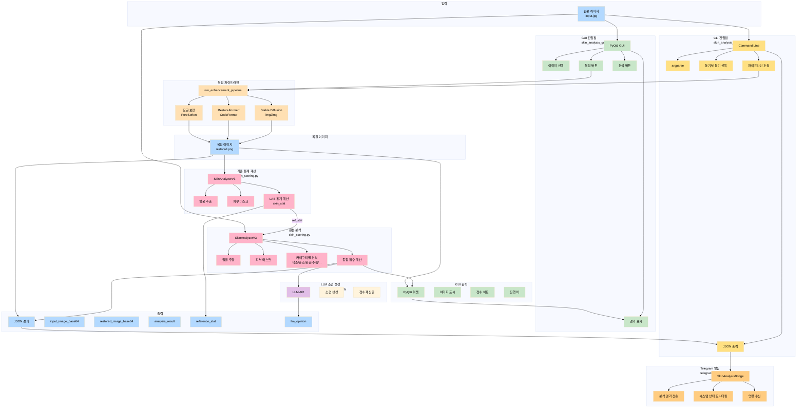
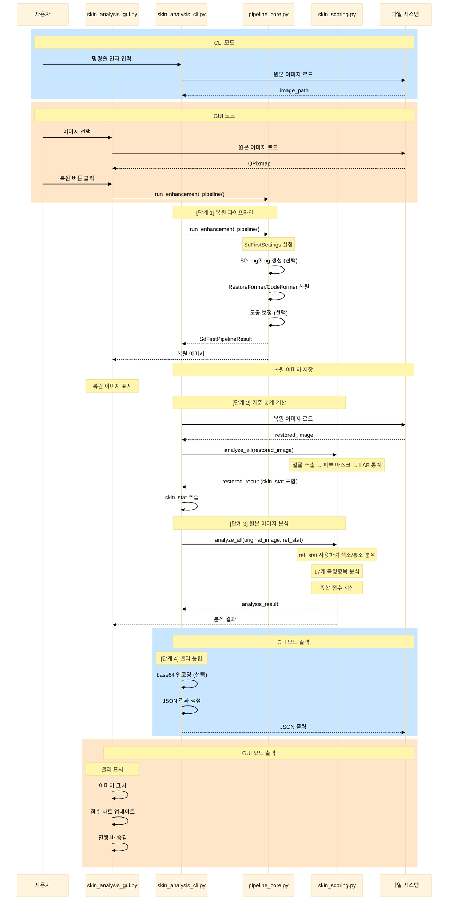
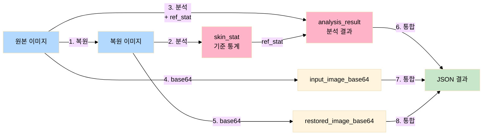
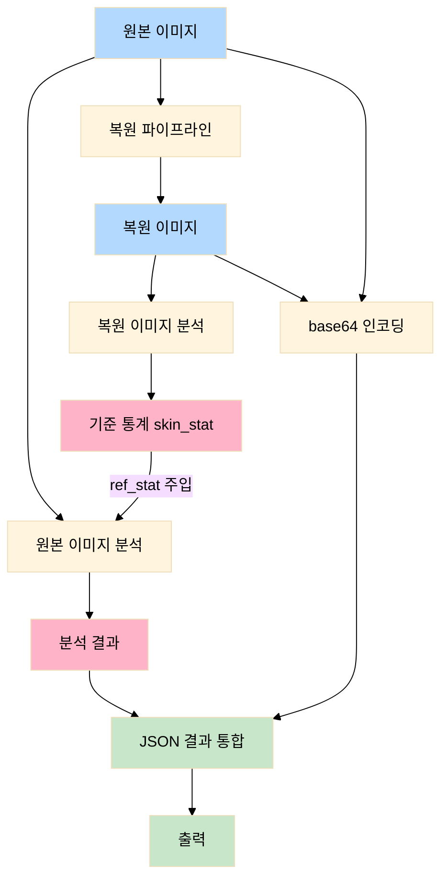
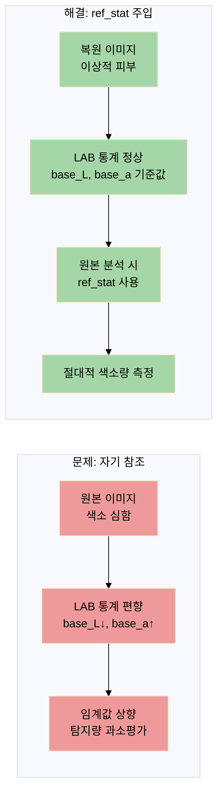
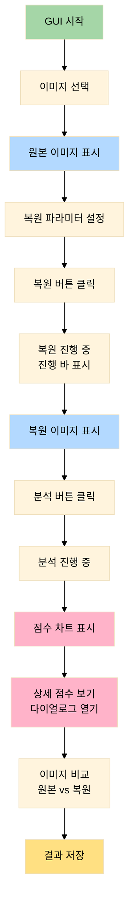
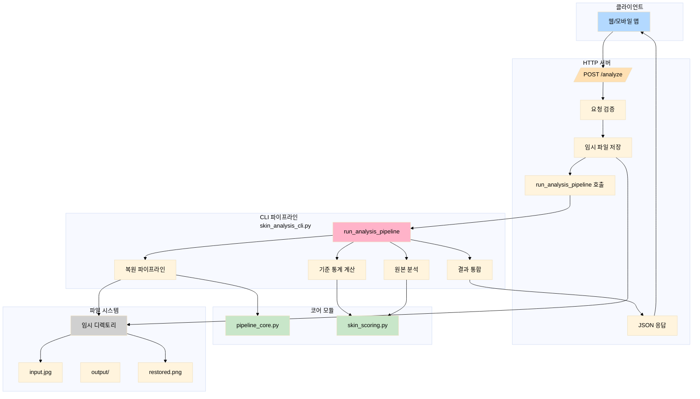

# SkinLens v1.0 - Skin Analysis Pipeline

> **프로젝트:** SkinLens v1.0

서버 환경과 GUI 환경 모두에서 동작하는 피부 분석 파이프라인입니다.

## 목적

이 도구는 `skin_scoring.py`를 서버와 GUI 환경에서 구동하는 전용 파이프라인입니다:

**메인 진입점** (`main.py`):
- GUI와 CLI 모드를 통합한 단일 진입점
- `--cli` 플래그로 CLI 모드 전환
- 기본값은 GUI 모드

**서버 환경** (`skin_analysis_cli.py`):
- GUI 없이 CLI 기반으로 동작
- JSON 출력으로 API 통합 용이
- 자동화 및 배치 처리에 적합
- **비동기 모드 지원** (`--async` 플래그)
- **Telegram 알림 통합** (서버 모니터링용)

**GUI 환경** (`skin_analysis_gui.py`):
- PyQt6 기반 시각화 인터페이스
- 파라미터 조절 및 실시간 피드백
- 실험 및 수동 작업에 적합

**공통 파이프라인**:
1. **원본 이미지 입력** (정면 + 좌45° + 우45° 다중 이미지 지원)
2. **복원 이미지 생성** (pipeline_core.py 사용, 다중 이미지 병렬 복원)
3. **복원 이미지를 기준으로 원본 이미지 분석** (skin_scoring.py 사용, ref_stat 활용)
4. **다중 뷰 분석 통합** (정면 + 좌45° + 우45°, 각도별 가중치 적용)
5. **결과 출력** (JSON 또는 시각화, 각도별 개별 결과 포함)
6. **LLM 소견 생성** (선택, llm_skin_report.py 사용)

## 아키텍처

### 전체 시스템 아키텍처



### 상세 동작 흐름



### 컴포넌트 상세

#### 1. skin_analysis_cli.py (CLI 진입점)

- **역할**: CLI 기반 파이프라인 오케스트레이션
- **주요 기능**:
  - 명령줄 인자 파싱 (argparse)
  - 동기/비동기 모드 선택 (`--async` 플래그)
  - 복원 파이프라인 호출
  - 기준 통계 추출
  - 원본 이미지 분석
  - 결과 통합 및 JSON 출력
- **주요 함수**:
  - `run_analysis_pipeline()`: 통합 파이프라인 메인 함수 (동기)
  - `run_analysis_pipeline_async()`: 비동기 파이프라인 래퍼
  - `main_async()`: 비동기 메인 함수
  - `_calculate_ref_stat()`: 복원 이미지 통계 계산
  - `_image_to_base64()`: 이미지 base64 인코딩
- **비동기 모드**:
  - `--async` 플래그로 비동기 실행 모드 활성화
  - `ThreadPoolExecutor`를 사용하여 동기 파이프라인을 비동기로 실행
  - 서버 환경에서 메인 루프 차단 방지

#### 1-1. main.py (메인 진입점 - GUI/CLI 통합)

- **역할**: GUI와 CLI 모드를 통합한 단일 진입점
- **주요 기능**:
  - `--cli` 플래그로 CLI 모드 전환
  - 기본값은 GUI 모드 (image_enhancer.py 사용)
  - CLI 모드에서는 skin_analysis_cli.py 사용
  - 모든 CLI 인자를 지원
- **사용법**:
  ```bash
  # GUI 모드 (기본)
  python main.py
  
  # CLI 모드
  python main.py --cli -i input.jpg -o output_dir
  
  # CLI 비동기 모드
  python main.py --cli -i input.jpg -o output_dir --async
  ```

#### 2. skin_analysis_gui.py (GUI 진입점 - 분석 전용)

- **역할**: PyQt6 기반 피부 분석 전용 사용자 인터페이스
- **주요 기능**:
  - 이미지 선택 및 표시
  - 복원 파라미터 설정 UI
  - 진행 바 및 로그 표시
  - 결과 시각화 (이미지 비교, 점수 차트)
  - skin_measurement_chart_dialog로 상세 점수 표시
- **주요 클래스**:
  - `MainWindow`: 메인 윈도우
  - `SkinMeasurementCompareDialog`: 점수 비교 다이얼로그
- **통합 방식**:
  - `pipeline_core.run_enhancement_pipeline()` 직접 호출
  - `skin_scoring.SkinAnalyzerV3.analyze_all()` 직접 호출
  - 복원 이미지의 skin_stat을 추출하여 원본 분석에 ref_stat으로 사용

#### 3. image_enhancer.py (GUI 진입점 - 복원 + 분석 통합)

- **역할**: 이미지 복원 및 분석 통합 GUI/CLI 진입점
- **주요 기능**:
  - GUI/CLI 모드 모두 지원
  - 복원 파라미터 세밀 조절 (SD 강도, 복원기 선택 등)
  - 복원 전후 점수 비교 기능
  - 색소 부담이 큰 입력에 대한 자동 튜닝
  - `--analyzer-score-tune`: 복원 후 17항목 점수가 입력보다 오르기 쉽도록 튜닝 (기본 켬)
  - `--score-safety-net`: 복원 점수가 원본보다 낮을 때 개별 항목 조정 및 종합 점수 1점 상승 보장 (기본 켬)
  - `--restore-score-popup`: 복원 전후 점수 팝업 표시 (기본 켬)
- **주요 함수**:
  - `_input_has_stressed_pigmentation()`: 색소 부담 큰 입력 감지
  - `_apply_restore_analyzer_score_tuning()`: 복원 후 점수 튜닝 적용
- **특징**:
  - PySide6 import를 GUI 경로에서만 수행 (CLI 환경 호환)
  - 파이프라인 로직은 pipeline_core.py 위임
  - GUI 코드는 skin_analysis_gui.py 위임
  - utils.py의 점수 안전장치 함수 사용

#### 4. pipeline_core.py (복원 파이프라인)

- **역할**: 이미지 복원 처리
- **주요 클래스/함수**:
  - `BaseRestorer`: 복원 백엔드 추상 기반 클래스 (src/restoration/base.py)
  - `RestorerRegistry`: 복원 백엔드 레지스트리 (src/restoration/registry.py)
  - `CodeFormerRestorer`: CodeFormer 복원 엔진 구현체
  - `RestoreFormerRestorer`: RestoreFormer++ 복원 엔진 구현체
  - `run_enhancement_pipeline()`: 메인 파이프라인 진입점
  - `run_restorer()`: 복원 엔진 실행 (Strategy Pattern 적용)
- **복원 모드**:
  - **RESTORE_FIRST**: RestoreFormer → CodeFormer (기본)
  - **RESTORE_ONLY**: RestoreFormer만
- **특징**:
  - Strategy Pattern 기반 복원 백엔드 교체 가능
  - RestorerRegistry를 통한 동적 엔진 선택
  - 전처리/후처리 훅 지원 (preprocess/postprocess)
  - in-process 실행 지원 (cold-start 방지)

#### 5. skin_scoring.py (피부 분석)

- **역할**: 피부 상태 분석 및 점수 산출
- **주요 클래스**:
  - `SkinAnalyzerV3`: v3 분석기 (18개 항목, measurements_v18)
  - `AnalyzerRegistry`: 분석기 레지스트리 (6개 분석기)
- **분석기 (6개)**:
  - `PigmentationAnalyzerV1`: 색소 분석 (기미, 주근깨)
  - `RednessAnalyzerV1`: 홍조 분석 (홍조, 염증후 홍반)
  - `PoreAnalyzerV1`: 모공 분석 (크기, 늘어짐)
  - `WrinkleAnalyzerV1`: 주름/결 분석 (눈가, 인중, 미세/깊은 주름)
  - `ToneElasticityAnalyzerV1`: 톤/탄력 분석 (피부톤, 칙칙함, 불균형, 턱선, 볼 처짐)
  - `AcneAnalyzerV1`: 여드름 분석 (여드름, 여드름 후 색소)
- **분석 카테고리**:
  - 색소 (Pigmentation): 기미, 주근깨
  - 홍조, 홍반 (Redness): 홍조, 염증후 홍반
  - 트러블·흔적 (Acne & Marks): 여드름, 여드름 후 색소
  - 모공 (Pore): 크기, 늘어짐
  - 주름 (Wrinkle): 눈가, 미간, 팔자, 잔주름
  - 텍스처 (Texture): 피부결 거칠기
  - 톤·밝기 (Tone): 피부 톤, 칙칙함, 얼룩톤
  - 탄력 (Elasticity): 턱선 탄력
  - 피부 타입 (Skin Type): 피부 타입
- **특징**:
  - Strategy Pattern 기반 분석기 교체 가능
  - 직교 신호 분해 (10개 내부 신호)
  - 가중치 체계 삼원화 (레이어A/레이어B/레거시)
- **주요 함수**:
  - `analyze_all()`: 전체 분석 실행
  - `ref_stat` 파라미터: 외부 기준 통계 주입

#### 6. utils.py (공통 유틸리티)

- **역할**: GUI와 CLI에서 공통으로 사용하는 유틸리티 함수
- **주요 함수**:
  - `apply_score_safety_net()`: 점수 안전장치 적용
    - 복원 점수가 원본보다 낮을 때:
      - 개별 항목 점수를 원본 점수로 조정
      - 종합 점수가 원본보다 1점 높도록 acne_score 강제 조정
    - 복원 점수가 원본보다 높을 때:
      - 종합 점수 차이를 14~16점 범위 내 랜덤값으로 조정
      - 가중치가 높은 순서대로 여러 항목 순차 조정
    - measurements_v17 (17개 측정항목) 사용
    - 설정은 `config/config.json`에서 로드
  - `reload_scoring_config()`: 점수 설정 강제 재로드 (서버 환경용)

#### 7. telegram/ (Telegram 알림 시스템)

- **역할**: 서버 모니터링을 위한 Telegram 알림 및 명령 처리
- **주요 모듈**:
  - `notifier.py`: TelegramNotifier 클래스
    - 텔레그램 API 통신
    - 메시지 전송 (텍스트, 이미지)
    - 폴링 및 명령 수신
  - `bridge.py`: SkinAnalysisBridge 클래스
    - TelegramNotifier, StatisticsCollector, FaultReporter 통합
    - 분석 결과 전송
    - 모니터링 스레드 관리
  - `commands.py`: CommandsMixin
    - 텔레그램 명령 처리 (/status, /pause, /resume, /daily_stats 등)
  - `monitors.py`: MonitorsMixin
    - 하트비트 모니터링
    - 통계 보고 루프
    - 세션 모니터링
  - `formatters.py`: 메시지 포매터
    - MarkdownV2 형식 메시지 포맷팅
    - 세션 이벤트, 장애, 통계 포맷팅
  - `StatisticsCollector`: 통계 수집기
    - 분석 결과, 세션, 장애 수집
    - 일/주/월간 통계 집계
  - `FaultReporter`: 장애 보고자
    - 장애 기록 및 알림
- **주요 기능**:
  - 분석 결과 자동 전송
  - 시스템 상태 모니터링 (하트비트)
  - 통계 자동 보고 (일/주/월간)
  - 텔레그램 명령 수신 (/status, /pause, /resume 등)
  - 장애 알림
- **설정**:
  - 환경변수: `TELEGRAM_BOT_TOKEN`, `TELEGRAM_CHAT_ID`
  - 또는 `config.secrets.json`에서 설정

#### 8. llm_skin_report.py (LLM 소견 생성)

- **역할**: LLM API를 사용한 피부 분석 소견 생성
- **주요 기능**:
  - 분석 결과를 기반으로 자연어 소견 생성
  - 17개 측정항목별 개별 소견 생성
  - 종합 점수 재산출 (LLM가 제안한 점수 사용)
  - 원본 vs 복원 비교 소견 생성
- **주요 함수**:
  - `generate_skin_report()`: 단일 이미지 소견 생성
  - `generate_compare_report()`: 원본/복원 비교 소견 생성
- **설정**:
  - `config.secrets.json`에서 LLM API 키 설정
  - `docs/llm_prompt_template.md`에서 프롬프트 템플릿 관리

### 데이터 흐름



### 워크플로우



### 복원 모드별 동작

```mermaid
%%{init: {'theme': 'base', 'themeVariables': { 'primaryTextColor': '#000000', 'secondaryTextColor': '#000000', 'tertiaryTextColor': '#000000', 'textColor': '#000000', 'lineColor': '#000000', 'fontFamily': 'arial' }} }%%
graph TB
    subgraph "기본 모드<br/>--skip-sd 없음"
        A1[SD img2img] --> A2[RestoreFormer]
        A2 --> A3[모공 보정]
    end

    subgraph "--skip-sd<br/>SD 생략"
        B1[RestoreFormer] --> B2[모공 보정]
    end

    subgraph "--sd-only<br/>SD 전용"
        C1[SD img2img]
    end

    subgraph "--no-restore<br/>복원 생략"
        D1[복원 없음]
    end

    style A1 fill:#ffe0b3,color:#000000
    style A2 fill:#ffe0b3,color:#000000
    style A3 fill:#ffe0b3,color:#000000
    style B1 fill:#ffb3c9,color:#000000
    style B2 fill:#ffb3c9,color:#000000
    style C1 fill:#b3d9ff,color:#000000
    style D1 fill:#999999,color:#000000
```



### 기준 통계 (ref_stat) 사용 기술 배경



## 설치

이 도구는 프로젝트 내 다음 모듈에 의존합니다:

- `pipeline_core.py` - 복원 파이프라인
- `skin_scoring.py` - 피부 분석
- `skin_analysis_gui.py` (GUI 모드) - PyQt6 기반 GUI (분석 전용)
- `image_enhancer.py` (GUI/CLI 모드) - PySide6 기반 GUI/CLI (복원 + 분석 통합)
- `skin_measurement_chart_dialog.py` (GUI 모드) - 점수 비교 다이얼로그
- `utils.py` - 공통 유틸리티 (점수 안전장치 등)

**CLI 모드 의존성**:
```bash
pip install opencv-python numpy scikit-image torch diffusers transformers
pip install psutil  # 리소스 모니터링 (선택적)
```

**GUI 모드 의존성**:
```bash
pip install PyQt6          # skin_analysis_gui.py용
pip install PySide6         # image_enhancer.py용
```

별도의 설치 과정은 없습니다. 프로젝트 루트에서 실행하세요.

## 사용법

### 기본 사용법

```bash
python skin_analysis_cli.py -i input.jpg -o output_dir
```

이 명령은:
1. `input.jpg`를 복원 파이프라인에 입력
2. 복원 이미지를 생성
3. 복원 이미지의 통계를 기준으로 원본 이미지 분석
4. 결과를 JSON으로 출력

### 오류 처리

오류 발생 시 JSON 형식으로 오류 정보가 출력되어 외부 모니터링이 가능합니다:

```json
{
  "error": true,
  "error_type": "FileNotFoundError",
  "error_message": "입력 파일을 찾을 수 없습니다: input.jpg",
  "timestamp": "2026-04-29T12:34:56.789012",
  "input_image": "input.jpg",
  "output_dir": "output_dir"
}
```

**오류 JSON 필드**:
- `error`: 항상 `true`
- `error_type`: 오류 타입 (예: `FileNotFoundError`, `ValueError`)
- `error_message`: 오류 메시지
- `timestamp`: 오류 발생 시간 (ISO 8601)
- `input_image`: 입력 이미지 경로
- `output_dir`: 출력 디렉토리 경로
- `error_traceback`: 스택 트레이스 (`--debug` 모드일 때만 포함)

오류 JSON은 `--output-json` 옵션으로 파일로 저장할 수 있습니다.

### 옵션

| 옵션 | 설명 |
|------|------|
| `-i, --input` | 입력 이미지 경로 (필수) |
| `-o, --output` | 출력 디렉토리 경로 (필수) |
| `--async` | 비동기 모드 실행 (서버 환경용) |
| `--skip-sd` | Stable Diffusion 생략 (RestoreFormer만 사용) |
| `--sd-only` | SD 전용 모드 (복원기 없이 SD만 사용) |
| `--no-restore` | 복원 생략 (원본 이미지만 분석) |
| `--no-base64` | base64 인코딩 생략 (JSON 크기 감소) |
| `--sd-strength` | SD 강도 (기본값: 0.12) |
| `--debug` | 디버그 모드 |
| `--output-json` | 결과 JSON 출력 파일 경로 (지정하지 않으면 stdout) |

### 예시

#### 기본 파이프라인 (동기 모드)

```bash
python skin_analysis_cli.py -i images/origin.png -o results
```

#### 비동기 모드 (서버 환경용)

```bash
python skin_analysis_cli.py -i images/origin.png -o results --async
```

비동기 모드에서는 `run_analysis_pipeline_async()` 함수를 사용하여 파이프라인을 비동기로 실행합니다. 서버 환경에서 메인 루프 차단을 방지합니다.

**Python 코드에서 직접 호출:**
```python
import asyncio
from skin_analysis_cli import run_analysis_pipeline_async

async def main():
    result = await run_analysis_pipeline_async(
        input_path="images/origin.png",
        output_dir="results"
    )
    print(result)

asyncio.run(main())
```

#### SD 생략 (RestoreFormer만 사용)

```bash
python skin_analysis_cli.py -i images/origin.png -o results --skip-sd
```

#### SD 전용 모드

```bash
python skin_analysis_cli.py -i images/origin.png -o results --sd-only
```

#### 복원 생략 (원본만 분석)

```bash
python skin_analysis_cli.py -i images/origin.png -o results --no-restore
```

#### 결과를 파일로 저장

```bash
python skin_analysis_cli.py -i images/origin.png -o results --output-json result.json
```

#### base64 인코딩 생략 (JSON 크기 감소)

```bash
python skin_analysis_cli.py -i images/origin.png -o results --no-base64
```

## GUI 사용법

### GUI 실행

GUI 모드는 두 가지 진입점이 있습니다:

**1. skin_analysis_gui.py (분석 전용 GUI)**
```bash
python skin_analysis_gui.py
```
- 피부 분석 전용 GUI
- 복원 이미지와 원본 이미지 비교
- 점수 차트 및 상세 분석 결과 표시

**2. image_enhancer.py (복원 + 분석 GUI)**
```bash
python image_enhancer.py
```
- 이미지 복원 및 분석 통합 GUI
- 복원 파라미터 세밀 조절
- 복원 전후 점수 비교 기능
- 색소 부담이 큰 입력에 대한 자동 튜닝

### image_enhancer.py GUI 옵션

```bash
python image_enhancer.py --help
```

**주요 옵션**:
- `--cli`: CLI 모드로 실행
- `--restorer {restoreformer,codeformer}`: 복원기 선택 (기본 restoreformer)
- `--sd-strength`: SD 강도 (기본 0.12)
- `--skip-sd`: SD 생략
- `--sd-only`: SD 전용 모드
- `--no-restore`: 복원 생략
- `--analyzer-score-tune`: 복원 후 점수 튜닝 (기본 켬)
- `--score-safety-net`: 점수 안전장치 (기본 켬)
- `--restore-score-popup`: 복원 전후 점수 팝업 (기본 켬)

### GUI 워크플로우



### GUI 주요 기능

1. **이미지 로드**: 파일 선택 다이얼로그로 원본 이미지 선택
2. **복원 파라미터 설정**:
   - SD 강도 슬라이더
   - 복원기 선택 (RestoreFormer/CodeFormer)
   - 복원 실행 체크박스
   - 점수 팝업 체크박스 (기본 켬)
   - 복원 후 17항목 점수 자동 튜닝 체크박스 (기본 켬)
   - 점수 안전장치 체크박스 (기본 켬)
3. **복원 실행**: "복원" 버튼 클릭
4. **진행 표시**: 진행 바와 로그 텍스트
5. **결과 표시**:
   - 원본/복원 이미지 나란히 표시
   - 점수 차트 (바 그래프)
   - 종합 점수 텍스트
6. **상세 점수**: "상세 점수 보기" 버튼으로 다이얼로그 열기
7. **결과 저장**: 이미지 및 점수 JSON 저장

### GUI vs CLI 비교

| 특징 | CLI | GUI (skin_analysis_gui.py) | GUI (image_enhancer.py) |
|------|-----|-----|-----|
| 진입점 | `skin_analysis_cli.py` | `skin_analysis_gui.py` | `image_enhancer.py` |
| 인터페이스 | 명령줄 | PyQt6 윈도우 | PySide6 윈도우 |
| 파라미터 설정 | CLI 인자 | UI 컨트롤 | UI 컨트롤 + CLI 옵션 |
| 진행 표시 | 로그 텍스트 | 진행 바 + 로그 | 진행 바 + 로그 |
| 결과 출력 | JSON | 시각화 차트 | 시각화 차트 + 점수 비교 |
| 이미지 표시 | base64 문자열 | QPixmap | QPixmap |
| 복원 파라미터 | CLI 인자 | UI 슬라이더 | UI 슬라이더 + 세밀 조절 |
| 점수 튜닝 | 없음 | 없음 | 자동 튜닝 (색소 부담 감지) |
| 비동기 모드 | ✓ (`--async`) | ✗ | ✗ |
| Telegram 알림 | ✓ (통합 가능) | ✗ | ✗ |
| LLM 소견 | ✓ (선택적) | ✓ (선택적) | ✓ (선택적) |
| 용도 | 서버/자동화 | 실험/수동 작업 (분석) | 실험/수동 작업 (복원+분석) |
| ref_stat 사용 | ✓ 자동 | ✓ 자동 | ✓ 자동 |

### GUI에서 ref_stat 사용

GUI에서도 CLI와 동일하게 복원 이미지의 skin_stat을 추출하여 원본 분석에 ref_stat으로 사용합니다:

```python
# skin_analysis_gui.py 내부 예시
from skin_scoring import SkinAnalyzerV3

# 1. 복원 이미지 분석
analyzer = SkinAnalyzerV3()
restored_result = analyzer.analyze_all(restored_path)
ref_stat = restored_result["skin_stat"]

# 2. 원본 이미지 분석 (ref_stat 사용)
original_result = analyzer.analyze_all(
    original_path,
    ref_stat=ref_stat
)
```

## 출력 형식

결과는 JSON 형식으로 출력됩니다:

```json
{
  "input_image": "path/to/input.jpg",
  "input_image_base64": "base64_encoded_string...",
  "restored_image": "path/to/restored.png",
  "restored_image_base64": "base64_encoded_string...",
  "output_dir": "path/to/output",
  "pipeline_mode": {
    "do_restore": true
  },
  "restoration_stats": {
    "wall_restore_sec": 12.34,
    "notes": [...]
  },
  "reference_stat": {
    "base_L": 128.5,
    "std_L": 15.2,
    "base_a": 130.1,
    "std_a": 8.3,
    "base_b": 129.8
  },
  "analysis_result": {
    "overall_score": 75.0,
    "perceived_age": 28,
    "measurements_v17": {
      "melasma_score": 70.0,
      "freckle_score": 80.0,
      ...
    },
    "skin_stat": {...}
  },
  "llm_opinion": {
    "overall_opinion": "전반적으로 피부 상태가 양호합니다...",
    "metric_opinions": {
      "melasma_score": "기미는 경미한 수준입니다...",
      "freckle_score": "주근깨가 거의 없습니다...",
      ...
    }
  }
}
```

**참고:**
- `input_image_base64`: 원본 이미지의 base64 인코딩 문자열
- `restored_image_base64`: 복원 이미지의 base64 인코딩 문자열
- 이미지는 PNG/JPG 형식 그대로 base64로 인코딩됨
- 클라이언트에서 base64를 디코딩하여 이미지로 표시 가능
- `llm_opinion`: LLM API로 생성된 소견 (선택적, `llm_skin_report.py` 사용 시 포함)
  - `overall_opinion`: 전체 피부 상태에 대한 소견
  - `metric_opinions`: 17개 측정항목별 개별 소견

## 기준 통계 (Reference Stat)란?

복원 이미지는 "이상적인 피부" 상태에 가깝습니다. 이 복원 이미지의 피부 통계 (LAB 채널의 기준값)를 계산하여, 원본 이미지를 분석할 때 기준값으로 사용합니다.

이를 통해:
- **자기 참조 문제 해결**: 색소가 심한 원본 이미지의 통계가 편향되어 임계값이 올라가는 문제를 방지
- **절대적 측정**: 복원 이미지 (이상적 피부)를 기준으로 원본의 색소량을 절대적으로 측정

## 점수 안전장치 (Score Safety Net)

점수 안전장치는 복원 이미지의 점수가 원본보다 낮거나 점수 차이가 부족할 때 자동으로 점수를 조정하여 사용자 경험을 개선하는 기능입니다.

### 작동 원리 (2026-05-25 수정)

1. **종합 점수 확인**: 복원 이미지의 종합 점수와 원본 점수 비교
2. **패스스루 조건**:
   - 복원 점수 >= 원본 점수 - 5.0: 안전장치 적용하지 않음 (분석기 점수 그대로 사용)
   - 복원 점수 < 원본 점수 - 5.0: 안전장치 적용
3. **안전장치 적용 시**:
   - 개별 항목 클램프 비활성화 (과도한 점수 하락 방지)
   - 종합 점수 기반 클램프만 유지
4. **설정 로드**: 점수 안전장치 설정은 `config/config.json`에서 로드

### 수정 이력

**2026-05-25**: 패스스루 로직 추가
- **문제**: 개별 항목 클램프와 재계산 로직으로 인해 점수가 75.7 → 17.2로 급락
- **해결**: 복원 점수가 원본과 비슷하거나 높으면 안전장치 적용하지 않음
- **결과**: 합리적인 점수 범위 내에서는 분석기 점수 그대로 유지

### 설정 파일 (config/config.json)

점수 안전장치 관련 설정:

```json
{
  "score_safety_net": {
    "enabled": true,
    "acne_weight": 0.095,
    "target_score_increase_min": 14.0,
    "target_score_increase_max": 16.0,
    "max_score_limit": 90.0
  },
  "restoration": {
    "codeformer_fidelity": 1.0,
    "codeformer_fidelity_min": 0.0,
    "codeformer_fidelity_max": 1.0,
    "codeformer_upscale": 2,
    "codeformer_additional": true
  }
}
```

**복원 파라미터 설정:**

| 파라미터 | 기본값 | 설명 |
|----------|--------|------|
| `codeformer_fidelity` | 1.0 | CodeFormer fidelity_weight (0=최대보정, 1=원본충실) |
| `codeformer_fidelity_min` | 0.0 | GUI 최소값 |
| `codeformer_fidelity_max` | 1.0 | GUI 최대값 |
| `codeformer_upscale` | 2 | CodeFormer 업스케일 배수 |
| `codeformer_additional` | true | RF++ 복원 후 CodeFormer 추가 복원 여부 |

- `enabled`: 점수 안전장치 활성화 여부
- `acne_weight`: acne_score 가중치
- `target_score_increase_min`: 복원 점수가 원본보다 높을 때 최소 점수 차이
- `target_score_increase_max`: 복원 점수가 원본보다 높을 때 최대 점수 차이
- `max_score_limit`: 개별 항목 최대 점수 제한

### 동적 설정 로드 (서버 환경)

서버 환경에서는 서버를 재시작하지 않고 설정 파일 변경을 동적으로 적용할 수 있습니다:

1. **자동 감지**: 파일 수정 시간(mtime)을 확인하여 변경되었으면 자동으로 다시 로드
2. **수동 재로드**: `reload_scoring_config()` 함수 호출로 강제 재로드

```python
from utils import reload_scoring_config

# 설정 파일 변경 후 재로드
reload_scoring_config()
```

### 사용 방법

**CLI 모드**:
```bash
# 점수 안전장치 켜기 (기본)
python image_enhancer.py --input images/origin.png

# 점수 안전장치 끄기
python image_enhancer.py --input images/origin.png --no-score-safety-net
```

**GUI 모드**:
- "점수 안전장치 (복원 점수가 낮으면 자동 조정)" 체크박스 (기본 켬)

### 로그 출력 예시

**복원 점수 < 원본 점수**:
```
[안전장치] 원본 점수: 76.3, 복원 점수(실측): 69.5, 차이: -6.8
[안전장치] 복원이미지 점수가 원본보다 낮습니다. 개별 항목 점수를 조정합니다.
[안전장치] acne_score: 50.0 → 76.3
[안전장치] pore_score: 60.0 → 65.0
[안전장치] 총 2개 항목 조정됨
[안전장치] 원본 점수로 조정 후 복원 점수: 75.0
[안전장치] acne_score 강제 조정: 76.3 → 90.0 (+14.2)
[안전장치] 최종 조정된 복원 점수: 77.3
[안전장치] 실측 복원 점수: 69.5 → 조정된 복원 점수: 77.3
```

**복원 점수 > 원본 점수**:
```
[안전장치] 원본 점수: 70.0, 복원 점수(실측): 75.5, 차이: +5.5
[안전장치] 복원이미지 점수가 원본보다 높지만 차이가 부족합니다. 점수차를 15.3점으로 조정합니다.
[안전장치] acne_score 강제 조정: 65.0 → 85.0 (점수증가: 1.9)
[안전장치] melasma_score 강제 조정: 70.0 → 82.0 (점수증가: 1.1)
[안전장치] freckle_score 강제 조정: 68.0 → 75.0 (점수증가: 0.6)
[안전장치] 최종 조정된 복원 점수: 85.3
[안전장치] 실측 복원 점수: 75.5 → 조정된 복원 점수: 85.3
```

### 특징

- **자동화**: 사용자 개입 없이 자동으로 점수 조정
- **투명성**: 로그를 통해 조정 내용 확인 가능
- **공유**: GUI와 CLI 모두에서 동일한 로직 사용 (utils.py)
- **선택적**: 필요 시 기능 끄기 가능

## 서버 통합

이 CLI 도구를 서버에 통합하는 방법:

1. **HTTP API 래퍼**: Flask/FastAPI 등으로 HTTP 요청을 CLI 호출로 변환
2. **직접 임포트**: `run_analysis_pipeline` 함수를 직접 임포트하여 사용

### HTTP API 아키텍처



### HTTP API 예시 (Flask)

```python
from flask import Flask, request, jsonify
from pathlib import Path
import tempfile
import shutil

from skin_analysis_cli import run_analysis_pipeline

app = Flask(__name__)

@app.route('/analyze', methods=['POST'])
def analyze():
    file = request.files['image']
    
    with tempfile.TemporaryDirectory() as tmpdir:
        input_path = Path(tmpdir) / 'input.jpg'
        file.save(input_path)
        
        output_dir = Path(tmpdir) / 'output'
        
        result = run_analysis_pipeline(
            input_image=input_path,
            output_dir=output_dir,
        )
        
        return jsonify(result)

if __name__ == '__main__':
    app.run(host='0.0.0.0', port=5000)
```

## 참고

- `pipeline_core.py`의 `run_enhancement_pipeline` 함수 사용
- `skin_scoring.py`의 `SkinAnalyzerV3.analyze_all` 사용
- `ref_stat` 파라미터를 통해 복원 이미지의 통계를 기준으로 사용

## Telegram 알림 통합

Telegram 알림 시스템을 사용하여 서버 모니터링을 구현할 수 있습니다.

### 설정

환경변수 또는 `config.secrets.json`에 설정:

```json
{
  "telegram": {
    "bot_token": "YOUR_BOT_TOKEN",
    "chat_id": "YOUR_CHAT_ID"
  }
}
```

또는 환경변수:
```bash
export TELEGRAM_BOT_TOKEN="YOUR_BOT_TOKEN"
export TELEGRAM_CHAT_ID="YOUR_CHAT_ID"
```

### 사용 예시

```python
from telegram import SkinAnalysisBridge, create_bridge_from_config
from skin_analysis_cli import run_analysis_pipeline_async
import asyncio

async def main():
    # 브리지 생성
    bridge = create_bridge_from_config()

    # 브리지 시작 (모니터링 스레드, 폴링 시작)
    bridge.start()
    bridge.start_polling()

    # 분석 실행
    result = await run_analysis_pipeline_async(
        input_path="input.jpg",
        output_dir="output"
    )

    # 결과 전송
    bridge.send_analysis_result(result)

    # 브리지 정지
    bridge.stop()

asyncio.run(main())
```

### 주요 기능

- **분석 결과 전송**: `bridge.send_analysis_result(result)`로 결과 자동 전송
- **시스템 모니터링**: 1시간마다 하트비트 메시지 전송
- **통계 보고**: 일/주/월간 통계 자동 보고
- **명령 수신**: `/status`, `/pause`, `/resume`, `/daily_stats`, `/weekly_stats`, `/monthly_stats`, `/resource` 등의 명령 처리
- **장애 알림**: 시스템 장애 발생 시 자동 알림
- **리소스 모니터링**: `/resource` 명령으로 메모리, CPU 사용량 조회

### 텔레그램 명령어

| 명령어 | 설명 |
|--------|------|
| `/status` | 시스템 상태 조회 |
| `/pause` | 알림 일시정지 |
| `/resume` | 알림 재개 |
| `/daily_stats` | 오늘 일간 통계 |
| `/weekly_stats` | 이번 주 주간 통계 |
| `/monthly_stats` | 이번 달 월간 통계 |
| `/resource` | 리소스 사용량 조회 (메모리, CPU) |
| `/help` | 도움말 |

## 실행 이력 추적

서버 환경에서 실행 이력을 추적하기 위해 SQLite 데이터베이스를 사용합니다.

### 설정

환경변수로 데이터베이스 경로 설정:

```bash
export EXECUTION_HISTORY_DB="execution_history.db"
```

### 자동 기록

`skin_analysis_cli.py`에서 자동으로 실행 이력이 기록됩니다:

- 타임스탬프
- 입력/출력 경로
- 분석 결과 (종합 점수, 인지 나이)
- 실행 시간
- 파이프라인 모드
- 성공/실패 여부
- **리소스 사용량** (메모리, CPU) - psutil 설치 필요

### 수동 조회

```python
from execution_history import ExecutionHistoryDB, get_db_path_from_env

db = ExecutionHistoryDB(get_db_path_from_env())

# 최근 실행 이력 조회
recent = db.get_recent_executions(limit=10)
for row in recent:
    print(row)

# 기간별 통계 조회
stats = db.get_statistics(days=7)
print(f"전체 실행 수: {stats['total_executions']}")
print(f"성공률: {stats['success_rate']:.1f}%")
print(f"평균 점수: {stats['avg_score']}")
print(f"평균 메모리 피크: {stats['avg_memory_peak_mb']}MB")
print(f"평균 CPU 사용률: {stats['avg_cpu_percent']}%")

# 에러 이력 조회
errors = db.get_error_summary(limit=20)
```

### 로그 DB 저장

실행 이력 DB에 애플리케이션 로그도 함께 저장됩니다.

#### 설정

`config/config.json`에서 로그 DB 저장 설정:

```json
{
  "logging": {
    "db_logging": {
      "enabled": true,
      "retention_days": 7
    }
  }
}
```

- `enabled`: DB 로깅 활성화/비활성화
- `retention_days`: 보관 기간 (일). 로그 저장 시 자동으로 오래된 로그 삭제 (롤링 방식)

#### 로그 조회

```python
from execution_history import ExecutionHistoryDB, get_db_path_from_env

db = ExecutionHistoryDB(get_db_path_from_env())

# 최근 로그 조회
logs = db.get_logs(limit=100)
for log in logs:
    print(f"[{log['level']}] {log['logger_name']}: {log['message']}")

# ERROR 레벨만 조회
errors = db.get_logs(level="ERROR", limit=50)

# 최근 24시간 로그 조회
recent = db.get_logs(hours=24, limit=200)
```

#### 로그 내보내기

```python
# CSV로 내보내기
count = db.export_logs_to_csv("logs.csv")
print(f"{count}개 로그 내보내기 완료")

# JSON으로 내보내기
count = db.export_logs_to_json("logs.json")
print(f"{count}개 로그 내보내기 완료")

# 필터링하여 내보내기
count = db.export_logs_to_csv("errors.csv", level="ERROR", hours=24)
```

#### API 엔드포인트 (서버 모드)

서버 실행 시 로그 다운로드 API가 제공됩니다:

- `GET /v3/logs`: 로그 JSON 조회
- `GET /v3/logs/download`: 로그 파일 다운로드 (CSV/JSON)

자세한 내용은 `docs/API_GUIDE.md`의 "12) 로그 다운로드 API" 섹션을 참조하세요.

### 리소스 모니터링

CLI 실행 시 메모리, CPU 사용량을 자동으로 측정합니다.

**설치:**
```bash
pip install psutil
```

**수동 사용:**
```python
from execution_history import ResourceMonitor

# 모니터 시작
monitor = ResourceMonitor()
monitor.start()

# 작업 실행
# ... (CPU/메모리 집약 작업)

# 주기적 샘플링 (선택적)
monitor.sample()

# 모니터 종료 및 통계 획득
stats = monitor.stop()
print(f"메모리 피크: {stats['memory_peak_mb']}MB")
print(f"CPU 평균: {stats['cpu_percent_avg']}%")
print(f"CPU 시간 (user): {stats['cpu_time_user_sec']}초")
print(f"CPU 시간 (system): {stats['cpu_time_system_sec']}초")
print(f"스레드 수: {stats['thread_count']}")
```

### 서버 통합 예제

`server_integration_example.py`를 참고하세요:

```python
import asyncio
from skin_analysis_cli import run_analysis_pipeline_async
from telegram import SkinAnalysisBridge, create_bridge_from_config
from execution_history import ExecutionHistoryDB, get_db_path_from_env

async def main():
    # Telegram 브리지 초기화
    bridge = create_bridge_from_config()
    bridge.start()
    bridge.start_polling()
    
    # 분석 실행 (자동으로 이력 기록됨)
    result = await run_analysis_pipeline_async(
        input_path="input.jpg",
        output_dir="output"
    )
    
    # 결과 전송
    bridge.send_analysis_result(result)
    
    # 통계 조회
    db = ExecutionHistoryDB(get_db_path_from_env())
    stats = db.get_statistics(days=7)
    
    bridge.stop()

asyncio.run(main())
```

### 데이터베이스 스키마

```sql
CREATE TABLE executions (
    id INTEGER PRIMARY KEY AUTOINCREMENT,
    timestamp TEXT NOT NULL,
    input_path TEXT NOT NULL,
    output_dir TEXT NOT NULL,
    overall_score REAL,
    perceived_age REAL,
    execution_time_sec REAL,
    pipeline_mode TEXT,
    success BOOLEAN,
    error_message TEXT,
    input_image_base64_size INTEGER,
    restored_image_base64_size INTEGER,
    -- 리소스 사용량
    memory_peak_mb REAL,
    memory_avg_mb REAL,
    cpu_percent_avg REAL,
    cpu_time_user_sec REAL,
    cpu_time_system_sec REAL,
    thread_count INTEGER
);
```

## 요약

### 핵심 특징

1. **이중 진입점**: CLI와 GUI 두 가지 모드 지원
2. **서버 친화적 CLI**: GUI 없이 CLI 기반으로 동작, 서버 환경에 최적화
3. **비동기 모드**: `--async` 플래그로 비동기 실행 지원, 서버 메인 루프 차단 방지
4. **GUI 실험 환경**: PyQt6 기반 시각화, 파라미터 조절 용이
5. **통합 파이프라인**: 복원 → 분석을 하나의 파이프라인으로 통합
6. **기준 통계 기반 분석**: 복원 이미지의 통계를 기준으로 원본 분석
7. **JSON 출력**: 결과를 JSON으로 출력하여 API 통합 용이
8. **Base64 이미지 포함**: 원본/복원 이미지를 base64로 인코딩하여 JSON에 포함
9. **점수 안전장치**: 복원 점수가 원본보다 낮을 때 개별 항목 조정 및 종합 점수 1점 상승 보장
10. **동적 설정 로드**: 서버 환경에서 설정 파일 변경 시 자동 감지 및 재로드
11. **Telegram 알림 통합**: 서버 모니터링을 위한 Telegram 알림 및 명령 처리
12. **LLM 소견 생성**: LLM API를 사용한 자연어 소견 생성
13. **실행 이력 추적**: SQLite 기반 실행 이력 자동 기록
14. **리소스 모니터링**: psutil을 사용한 메모리, CPU 사용량 측정

### 파일 구조

```
AI Skin v3/
├── main.py                       # 메인 진입점 (GUI/CLI 통합)
├── skin_analysis_cli.py          # CLI 진입점
├── skin_analysis_README.md        # 본 문서
├── skin_analysis_gui.py                 # GUI 진입점 (분석 전용, PyQt6)
├── image_enhancer.py          # GUI/CLI 진입점 (복원 + 분석 통합)
├── skin_measurement_chart_dialog.py  # 점수 비교 다이얼로그
├── utils.py                      # 공통 유틸리티 (점수 안전장치 등)
├── pipeline_core.py               # 복원 파이프라인
├── skin_scoring.py             # 피부 분석
├── gemini_skin_report.py         # Gemini 소견 생성
├── execution_history.py           # 실행 이력 데이터베이스 (SQLite)
├── server_integration_example.py  # 서버 통합 예제
├── telegram/                      # Telegram 알림 시스템
│   ├── __init__.py               # 패키지 초기화
│   ├── bridge.py                 # SkinAnalysisBridge
│   ├── notifier.py               # TelegramNotifier
│   ├── commands.py               # 명령 핸들러
│   ├── monitors.py               # 모니터링 루프
│   └── formatters.py             # 메시지 포매터
├── config/                       # 설정 파일 디렉토리
│   └── config.json               # 메인 설정 (로깅, 런타임 파라미터)
├── docs/                         # 문서 디렉토리
│   └── llm_prompt_template.md     # Gemini 프롬프트 템플릿
└── images/                        # 입력 이미지 디렉토리
```

### 빠른 시작

```bash
# 메인 진입점 (main.py)
# 1. GUI 모드 (기본)
python main.py

# 2. CLI 모드
python main.py --cli -i images/origin.png -o results

# 3. CLI 모드 (비동기)
python main.py --cli -i images/origin.png -o results --async

# 개별 진입점 사용
# GUI 모드 (분석 전용)
python skin_analysis_gui.py

# GUI/CLI 모드 (복원 + 분석 통합)
python image_enhancer.py

# CLI 모드 (분석 전용)
python skin_analysis_cli.py -i images/origin.png -o results

# CLI 모드 (비동기)
python skin_analysis_cli.py -i images/origin.png -o results --async

# 결과 확인
cat results/result.json  # 또는 브라우저에서 JSON 열기

# base64 디코딩 (Python 예시)
import base64
with open('result.json') as f:
    data = json.load(f)
img_data = base64.b64decode(data['restored_image_base64'])
with open('restored.png', 'wb') as f:
    f.write(img_data)
```

### 성능 고려사항

- **복원 시간**: SD 모델 로드 첫 실행 시 수 분 소요 (캐시됨)
- **메모리**: SD 모델 VRAM 요구 (~8GB), RestoreFormer (~4GB)
- **JSON 크기**: base64 포함 시 이미지 크기에 비례 (예: 1024x1024 PNG ~ 1-3MB)
- **권장 옵션**: 서버 환경에서는 `--no-base64` 사용 권장 (파일 경로만 제공)

### 문제 해결

| 문제 | 해결 |
|------|------|
| CLI: 모델 로드 시간이 길다 | 첫 실행 후 캐시됨, 이후 빠름 |
| CLI: VRAM 부족 | `--skip-sd`로 SD 생략, 또는 `--sd-only`로 복원기 생략 |
| CLI: JSON 크기가 너무 크다 | `--no-base64` 옵션 사용 |
| CLI: 복원 이미지가 생성되지 않음 | 입력 이미지 확인, `--debug` 모드로 로그 확인 |
| CLI: 분석 점수가 이상함 | `ref_stat` 확인, 복원 이미지 품질 확인 |
| GUI: 윈도우가 뜨지 않음 | PyQt6 설치 확인, `python skin_analysis_gui.py` 재실행 |
| GUI: 복원이 멈춤 | GPU 메모리 확인, SD 모델 경로 확인 |
| GUI: 점수 차트가 표시되지 않음 | 분석 완료 확인, 로그 확인 |
| 공통: ref_stat이 적용되지 않음 | 복원 이미지 분석 후 skin_stat 확인 |
