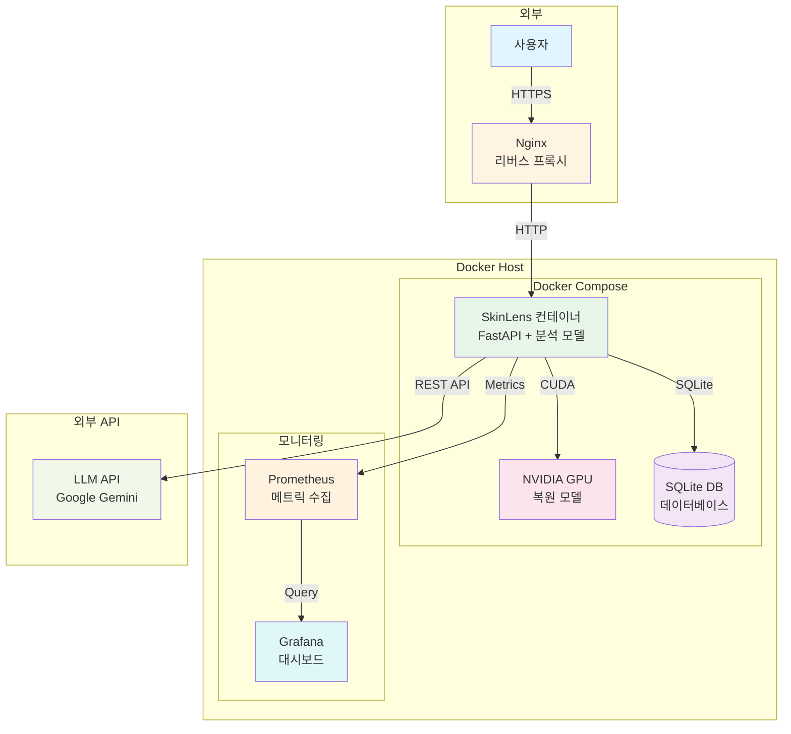
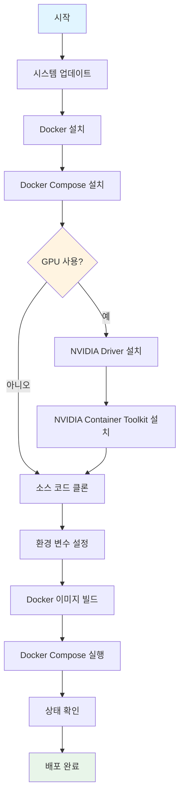
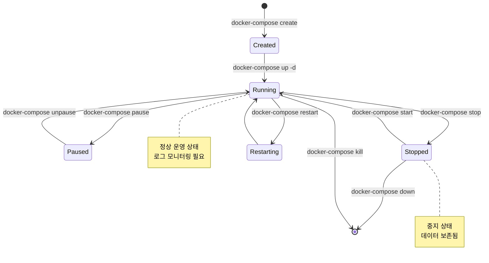
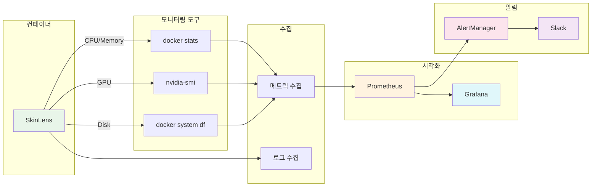
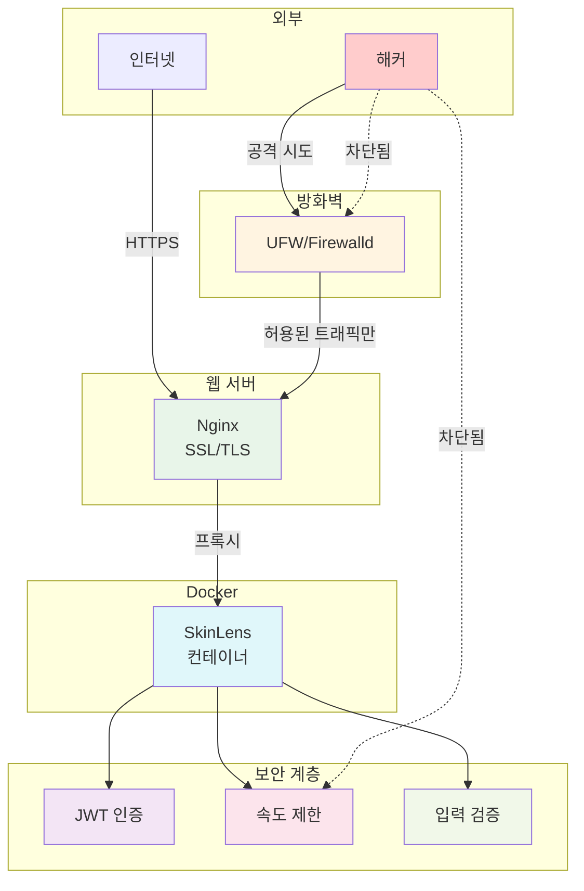

# 리눅스 Docker 배포 가이드 (Linux Docker Deployment Guide)

> **프로젝트:** SkinLens v1.0  
> **버전:** v3.6  
*작성일:* 2026-05-30  
*상태:* 초안

---

## 개요

이 가이드는 리눅스 환경에서 Docker를 사용하여 SkinLens 서버를 배포하고 운용하는 방법을 설명합니다.

---

## 아키텍처 개요



---

## 시스템 요구사항

### 하드웨어

- **CPU:** 4코어 이상 권장
- **RAM:** 16GB 이상 권장
- **GPU:** NVIDIA GPU (CUDA 지원) - 복원 모델 실행용
- **스토리지:** 100GB 이상 SSD

### 소프트웨어

- **OS:** Ubuntu 20.04 LTS 이상 / CentOS 8 이상
- **Docker:** 20.10 이상
- **Docker Compose:** 2.0 이상
- **NVIDIA Driver:** 470.x 이상 (GPU 사용 시)
- **NVIDIA Container Toolkit:** 최신 버전 (GPU 사용 시)

---

## 1. 리눅스 환경 설정

### 1.1 시스템 업데이트

```bash
# Ubuntu/Debian
sudo apt update && sudo apt upgrade -y

# CentOS/RHEL
sudo yum update -y
```

### 1.2 필수 패키지 설치

```bash
# Ubuntu/Debian
sudo apt install -y curl git vim htop net-tools

# CentOS/RHEL
sudo yum install -y curl git vim htop net-tools
```

### 1.3 사용자 생성 (선택)

```bash
# skinlens 사용자 생성
sudo useradd -m -s /bin/bash skinlens
sudo usermod -aG docker skinlens

# sudo 권한 부여
sudo usermod -aG sudo skinlens

# 사용자 전환
su - skinlens
```

---

## 2. Docker 설치

### 2.1 Docker 설치 (Ubuntu)

```bash
# Docker 저장소 추가
curl -fsSL https://download.docker.com/linux/ubuntu/gpg | sudo gpg --dearmor -o /usr/share/keyrings/docker-archive-keyring.gpg
echo "deb [arch=$(dpkg --print-architecture) signed-by=/usr/share/keyrings/docker-archive-keyring.gpg] https://download.docker.com/linux/ubuntu $(lsb_release -cs) stable" | sudo tee /etc/apt/sources.list.d/docker.list > /dev/null

# Docker 설치
sudo apt update
sudo apt install -y docker-ce docker-ce-cli containerd.io

# Docker 서비스 시작
sudo systemctl start docker
sudo systemctl enable docker

# 버전 확인
docker --version
```

### 2.2 Docker 설치 (CentOS)

```bash
# Docker 저장소 추가
sudo yum install -y yum-utils
sudo yum-config-manager --add-repo https://download.docker.com/linux/centos/docker-ce.repo

# Docker 설치
sudo yum install -y docker-ce docker-ce-cli containerd.io

# Docker 서비스 시작
sudo systemctl start docker
sudo systemctl enable docker

# 버전 확인
docker --version
```

### 2.3 Docker Compose 설치

```bash
# Docker Compose 바이너리 다운로드
sudo curl -L "https://github.com/docker/compose/releases/latest/download/docker-compose-$(uname -s)-$(uname -m)" -o /usr/local/bin/docker-compose

# 실행 권한 부여
sudo chmod +x /usr/local/bin/docker-compose

# 버전 확인
docker-compose --version
```

---

## 3. NVIDIA GPU 지원 (선택)

### 3.1 NVIDIA Driver 설치

```bash
# Ubuntu
sudo apt install -y nvidia-driver-535

# CentOS
sudo yum install -y kmod-nvidia

# 재부팅
sudo reboot

# 설치 확인
nvidia-smi
```

### 3.2 NVIDIA Container Toolkit 설치

```bash
# 저장소 추가
curl -fsSL https://nvidia.github.io/libnvidia-container/gpgkey | sudo gpg --dearmor -o /usr/share/keyrings/nvidia-container-toolkit-keyring.gpg
curl -s -L https://nvidia.github.io/libnvidia-container/stable/deb/nvidia-container-toolkit.list | sed 's#deb https://#deb [signed-by=/usr/share/keyrings/nvidia-container-toolkit-keyring.gpg] https://#g' | sudo tee /etc/apt/sources.list.d/nvidia-container-toolkit.list

# 설치
sudo apt update
sudo apt install -y nvidia-container-toolkit

# Docker 설정
sudo nvidia-ctk runtime configure --runtime=docker
sudo systemctl restart docker

# 테스트
docker run --rm --gpus all nvidia/cuda:11.0.3-base-ubuntu20.04 nvidia-smi
```

---

## 4. SkinLens 배포

### 4.0 배포 절차



### 4.1 소스 코드 클론

```bash
# GitHub에서 클론
git clone https://github.com/coteleafdev/SkinLens.git
cd SkinLens

# 브랜치 확인
git branch -a
git checkout main
```

### 4.2 환경 변수 설정

```bash
# .env 파일 생성
cp .env.example .env

# .env 파일 편집
vim .env
```

**.env 파일 예시:**
```env
# 서버 설정
SERVER_HOST=0.0.0.0
SERVER_PORT=8000
MAX_UPLOAD_BYTES=20971520
MAX_CONCURRENT_JOBS=4

# 데이터베이스
DB_PATH=/data/skinlens.db

# LLM API
LLM_API_KEY=your_api_key_here
LLM_PROVIDER=gemini

# 인증
ADMIN_PASSWORD=$2b$12$...  # bcrypt 해시
ANALYST_PASSWORD=$2b$12$...
CUSTOMER_PASSWORD=$2b$12$...

# 로깅
LOG_LEVEL=INFO

# GPU 설정
GPU_ENABLED=true
GPU_MEMORY_FRACTION=0.9
```

### 4.3 Docker 이미지 빌드

```bash
# Docker 이미지 빌드
docker-compose build

# 빌드 확인
docker images | grep skinlens
```

### 4.4 Docker Compose 실행

```bash
# 백그라운드 실행
docker-compose up -d

# 로그 확인
docker-compose logs -f

# 상태 확인
docker-compose ps
```

---

## 5. 컨테이너 운영

### 5.0 컨테이너 라이프사이클



### 5.1 컨테이너 관리

```bash
# 컨테이너 시작
docker-compose start

# 컨테이너 중지
docker-compose stop

# 컨테이너 재시작
docker-compose restart

# 컨테이너 삭제
docker-compose down

# 컨테이너 삭제 및 볼륨 삭제
docker-compose down -v
```

### 5.2 로그 관리

```bash
# 실시간 로그 확인
docker-compose logs -f skinlens

# 최근 100줄 로그 확인
docker-compose logs --tail=100 skinlens

# 특정 시간대 로그 확인
docker-compose logs --since="2026-05-30T14:00:00" skinlens

# 로그 파일로 저장
docker-compose logs skinlens > /var/log/skinlens/app.log
```

### 5.3 컨테이너 접속

```bash
# 컨테이너 내부 접속
docker-compose exec skinlens bash

# 컨테이너 내부에서 명령 실행
docker-compose exec skinlens python -c "import torch; print(torch.cuda.is_available())"
```

---

## 6. 리소스 모니터링

### 6.0 모니터링 아키텍처



### 6.1 컨테이너 리소스 확인

```bash
# 컨테이너 리소스 사용량
docker stats

# 특정 컨테이너 리소스
docker stats skinlens

# 상세 정보
docker inspect skinlens
```

### 6.2 디스크 사용량

```bash
# Docker 볼륨 사용량
docker system df

# 불필요한 리소스 정리
docker system prune -a

# 볼륨 정리
docker volume prune
```

### 6.3 GPU 모니터링

```bash
# GPU 상태 확인
nvidia-smi

# 실시간 GPU 모니터링
watch -n 1 nvidia-smi

# 컨테이너 GPU 사용량
docker exec skinlens nvidia-smi
```

---

## 7. 업데이트 및 롤백

### 7.1 업데이트 절차

```bash
# 1. 소스 코드 업데이트
git pull origin main

# 2. 백업
docker-compose down
cp .env .env.backup

# 3. 이미지 재빌드
docker-compose build

# 4. 컨테이너 시작
docker-compose up -d

# 5. 상태 확인
docker-compose ps
docker-compose logs -f
```

### 7.2 롤백 절차

```bash
# 1. 컨테이너 중지
docker-compose down

# 2. 이전 커밋으로 롤백
git log --oneline
git checkout <previous_commit_hash>

# 3. 이미지 재빌드
docker-compose build

# 4. 컨테이너 시작
docker-compose up -d

# 5. 환경 변수 복원 (필요 시)
cp .env.backup .env
docker-compose restart
```

---

## 8. 보안 설정

### 8.0 보안 아키텍처



### 8.1 방화벽 설정

```bash
# UFW (Ubuntu)
sudo ufw allow 22/tcp    # SSH
sudo ufw allow 80/tcp    # HTTP
sudo ufw allow 443/tcp   # HTTPS
sudo ufw enable

# firewalld (CentOS)
sudo firewall-cmd --permanent --add-service=ssh
sudo firewall-cmd --permanent --add-service=http
sudo firewall-cmd --permanent --add-service=https
sudo firewall-cmd --reload
```

### 8.2 SSL/TLS 설정

```bash
# Let's Encrypt 설치
sudo apt install -y certbot python3-certbot-nginx

# 인증서 발급
sudo certbot --nginx -d your-domain.com

# 자동 갱신 설정
sudo certbot renew --dry-run
```

### 8.3 Docker 보안

```bash
# Docker daemon 보안 설정
sudo vim /etc/docker/daemon.json
```

**daemon.json 예시:**
```json
{
  "log-driver": "json-file",
  "log-opts": {
    "max-size": "10m",
    "max-file": "3"
  },
  "live-restore": true,
  "userland-proxy": false,
  "no-new-privileges": true
}
```

```bash
# Docker 재시작
sudo systemctl restart docker
```

---

## 9. 백업

### 9.1 데이터베이스 백업

```bash
# 백업 스크립트 생성
vim /usr/local/bin/backup-skinlens.sh
```

**backup-skinlens.sh:**
```bash
#!/bin/bash
BACKUP_DIR="/backup/skinlens"
DATE=$(date +%Y%m%d_%H%M%S)
mkdir -p $BACKUP_DIR

# 데이터베이스 백업
docker-compose exec -T skinlens cp /data/skinlens.db - > $BACKUP_DIR/skinlens_$DATE.db

# 7일 이상 된 백업 삭제
find $BACKUP_DIR -name "skinlens_*.db" -mtime +7 -delete

echo "Backup completed: skinlens_$DATE.db"
```

```bash
# 실행 권한 부여
chmod +x /usr/local/bin/backup-skinlens.sh

# 크론 등록 (매일 새벽 2시)
crontab -e
```

**crontab:**
```
0 2 * * * /usr/local/bin/backup-skinlens.sh >> /var/log/backup.log 2>&1
```

### 9.2 볼륨 백업

```bash
# Docker 볼륨 백업
docker run --rm -v skinlens_data:/data -v $(pwd):/backup ubuntu tar czf /backup/skinlens_data_$(date +%Y%m%d).tar.gz /data
```

---

## 10. 트러블슈팅

### 10.1 컨테이너 시작 실패

**문제:** 컨테이너가 시작되지 않습니다.

**해결:**
```bash
# 로그 확인
docker-compose logs skinlens

# 컨테이너 상태 확인
docker-compose ps

# 이미지 재빌드
docker-compose build --no-cache
docker-compose up -d
```

### 10.2 GPU 인식 실패

**문제:** GPU가 인식되지 않습니다.

**해결:**
```bash
# NVIDIA 드라이버 확인
nvidia-smi

# NVIDIA Container Toolkit 확인
docker run --rm --gpus all nvidia/cuda:11.0.3-base-ubuntu20.04 nvidia-smi

# Docker runtime 확인
docker info | grep -i runtime

# docker-compose.yml에 GPU 설정 추가
deploy:
  resources:
    reservations:
      devices:
        - driver: nvidia
          count: 1
          capabilities: [gpu]
```

### 10.3 메모리 부족

**문제:** OOM 에러 발생.

**해결:**
```bash
# 스왑 메모리 추가
sudo fallocate -l 4G /swapfile
sudo chmod 600 /swapfile
sudo mkswap /swapfile
sudo swapon /swapfile

# 영구 설정
echo '/swapfile none swap sw 0 0' | sudo tee -a /etc/fstab

# Docker 메모리 제한 설정
# docker-compose.yml
services:
  skinlens:
    deploy:
      resources:
        limits:
          memory: 8G
```

### 10.4 디스크 부족

**문제:** 디스크 공간 부족.

**해결:**
```bash
# 디스크 사용량 확인
df -h

# Docker 정리
docker system prune -a --volumes

# 오래된 로그 삭제
find /var/log -name "*.log" -mtime +30 -delete

# 오래된 백업 삭제
find /backup -name "*.db" -mtime +30 -delete
```

---

## 11. 성능 최적화

### 11.1 리소스 제한

**docker-compose.yml:**
```yaml
services:
  skinlens:
    deploy:
      resources:
        limits:
          cpus: '4'
          memory: 8G
        reservations:
          cpus: '2'
          memory: 4G
```

### 11.2 로그 관리

**docker-compose.yml:**
```yaml
services:
  skinlens:
    logging:
      driver: "json-file"
      options:
        max-size: "10m"
        max-file: "3"
```

### 11.3 네트워크 최적화

```bash
# Docker 네트워크 생성
docker network create --driver bridge --opt com.docker.network.bridge.name=skinlens-br skinlens-net

# docker-compose.yml에 네트워크 설정
networks:
  skinlens-net:
    external: true
```

---

## 12. 모니터링 통합

### 12.1 Prometheus 통합

```yaml
# docker-compose.yml
services:
  prometheus:
    image: prom/prometheus:latest
    ports:
      - "9090:9090"
    volumes:
      - ./prometheus.yml:/etc/prometheus/prometheus.yml
      - prometheus_data:/prometheus
    command:
      - '--config.file=/etc/prometheus/prometheus.yml'
      - '--storage.tsdb.path=/prometheus'
```

### 12.2 Grafana 통합

```yaml
# docker-compose.yml
services:
  grafana:
    image: grafana/grafana:latest
    ports:
      - "3000:3000"
    volumes:
      - grafana_data:/var/lib/grafana
    environment:
      - GF_SECURITY_ADMIN_PASSWORD=admin
```

---

*작성일: 2026-05-30*  
*버전: v1.0*  
*마지막 수정: 2026-05-30*
