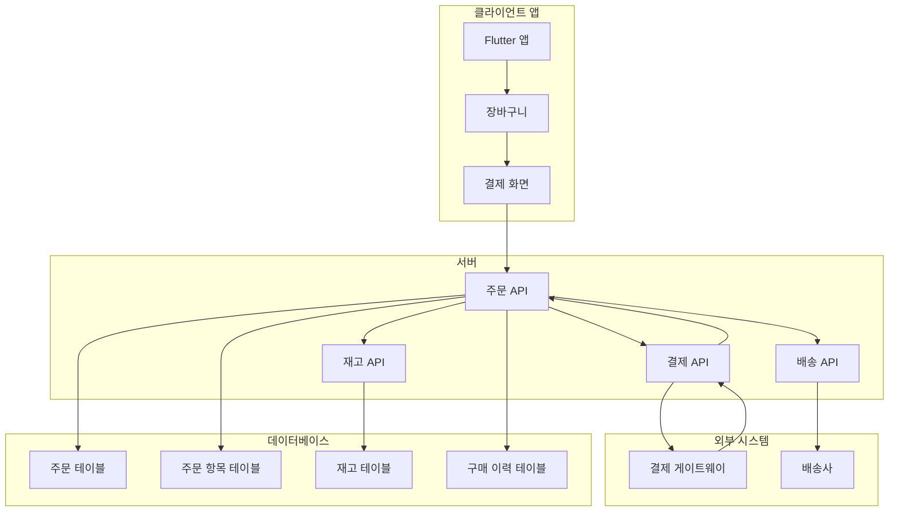
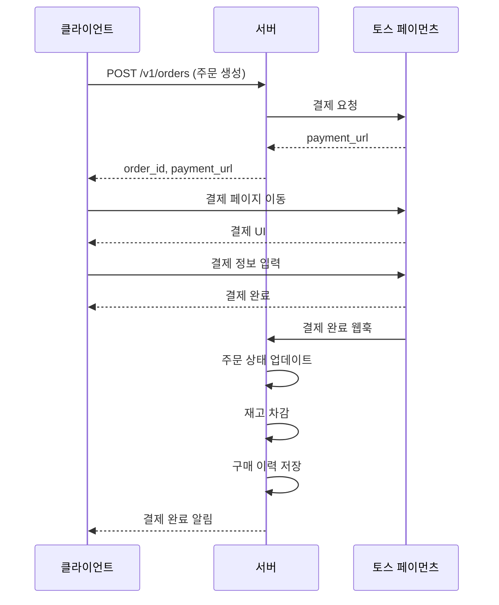
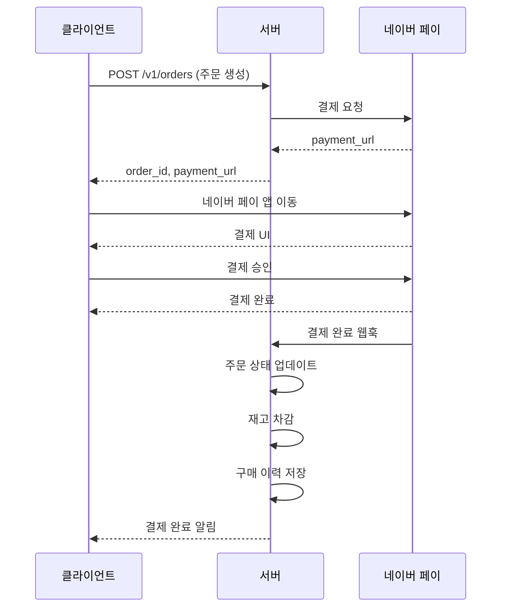
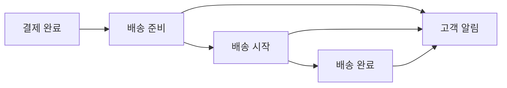

# 맞춤형 화장품 구매 처리 가이드

> **프로젝트:** SkinLens v1.0
> **마지막 수정:** 2026-05-28

## 개요

본 문서는 SkinLens 앱에서 추천된 맞춤형 화장품을 고객이 구매할 때의 처리 절차를 설명합니다. API 설계, 데이터베이스 구조, 결제 처리, 재고 관리, 배송 처리, 고객 구매 이력 관리를 포함합니다.

---

## 1. 시스템 아키텍처

### 1.1 구매 처리 흐름



---

## 2. API 설계

### 2.1 주문 생성

`POST /v1/orders`

**Request**
```json
{
  "customer_id": "user123",
  "items": [
    {
      "product_id": "P001",
      "quantity": 1,
      "price": 45000
    },
    {
      "product_id": "P002",
      "quantity": 2,
      "price": 35000
    }
  ],
  "shipping_address": {
    "recipient": "홍길동",
    "phone": "010-1234-5678",
    "address": "서울시 강남구...",
    "zip_code": "12345"
  },
  "payment_method": "credit_card",
  "recommendation_source": "skin_analysis",
  "analysis_job_id": "job_abc123"
}
```

**Response 201**
```json
{
  "order_id": "ORD-20260528-001",
  "status": "pending_payment",
  "total_amount": 115000,
  "created_at": "2026-05-28T10:00:00Z",
  "payment_url": "https://pg.example.com/pay/..."
}
```

### 2.2 주문 상태 조회

`GET /v1/orders/{order_id}`

**Response 200**
```json
{
  "order_id": "ORD-20260528-001",
  "status": "paid",
  "total_amount": 115000,
  "items": [
    {
      "product_id": "P001",
      "product_name": "CÔTELEAF 트러블 케어 세럼",
      "quantity": 1,
      "price": 45000
    }
  ],
  "shipping_address": {
    "recipient": "홍길동",
    "phone": "010-1234-5678",
    "address": "서울시 강남구...",
    "zip_code": "12345"
  },
  "payment_status": "paid",
  "shipping_status": "preparing",
  "created_at": "2026-05-28T10:00:00Z",
  "updated_at": "2026-05-28T10:05:00Z"
}
```

**status 값**
- `pending_payment`: 결제 대기
- `paid`: 결제 완료
- `preparing`: 배송 준비 중
- `shipped`: 배송 중
- `delivered`: 배송 완료
- `cancelled`: 주문 취소
- `refunded`: 환불 완료

### 2.3 주문 취소

`POST /v1/orders/{order_id}/cancel`

**Request**
```json
{
  "reason": "상품 변경"
}
```

**Response 200**
```json
{
  "order_id": "ORD-20260528-001",
  "status": "cancelled",
  "cancelled_at": "2026-05-28T11:00:00Z",
  "refund_amount": 115000,
  "refund_status": "processing"
}
```

### 2.4 고객 구매 이력 조회

`GET /v1/customers/{customer_id}/purchase-history`

**Query Parameters**
- `limit`: 조회할 건수 (기본: 20)
- `offset`: 오프셋 (기본: 0)
- `status`: 상태 필터 (paid, shipped, delivered)

**Response 200**
```json
{
  "customer_id": "user123",
  "total_orders": 5,
  "total_spent": 575000,
  "orders": [
    {
      "order_id": "ORD-20260528-001",
      "status": "delivered",
      "total_amount": 115000,
      "items": [
        {
          "product_id": "P001",
          "product_name": "CÔTELEAF 트러블 케어 세럼",
          "quantity": 1
        }
      ],
      "purchased_at": "2026-05-28T10:00:00Z",
      "recommendation_source": "skin_analysis",
      "analysis_job_id": "job_abc123"
    }
  ]
}
```

### 2.5 재고 확인

`GET /v1/products/{product_id}/inventory`

**Response 200**
```json
{
  "product_id": "P001",
  "product_name": "CÔTELEAF 트러블 케어 세럼",
  "stock_quantity": 150,
  "reserved_quantity": 10,
  "available_quantity": 140,
  "last_updated": "2026-05-28T10:00:00Z"
}
```

---

## 3. 데이터베이스 구조

### 3.1 주문 테이블 (orders)

```sql
CREATE TABLE orders (
    id INTEGER PRIMARY KEY AUTOINCREMENT,
    order_id TEXT UNIQUE NOT NULL,
    customer_id TEXT NOT NULL,
    status TEXT NOT NULL DEFAULT 'pending_payment',
    total_amount REAL NOT NULL,
    payment_method TEXT,
    payment_status TEXT DEFAULT 'pending',
    payment_id TEXT,
    shipping_status TEXT DEFAULT 'pending',
    shipping_tracking_number TEXT,
    created_at TIMESTAMP DEFAULT CURRENT_TIMESTAMP,
    updated_at TIMESTAMP DEFAULT CURRENT_TIMESTAMP,
    cancelled_at TIMESTAMP,
    cancelled_reason TEXT,
    recommendation_source TEXT,
    analysis_job_id TEXT,
    FOREIGN KEY (customer_id) REFERENCES customers(customer_id)
);
```

### 3.2 주문 항목 테이블 (order_items)

```sql
CREATE TABLE order_items (
    id INTEGER PRIMARY KEY AUTOINCREMENT,
    order_id TEXT NOT NULL,
    product_id TEXT NOT NULL,
    product_name TEXT NOT NULL,
    quantity INTEGER NOT NULL,
    price REAL NOT NULL,
    subtotal REAL NOT NULL,
    FOREIGN KEY (order_id) REFERENCES orders(order_id),
    FOREIGN KEY (product_id) REFERENCES products(product_id)
);
```

### 3.3 재고 테이블 (inventory)

```sql
CREATE TABLE inventory (
    id INTEGER PRIMARY KEY AUTOINCREMENT,
    product_id TEXT UNIQUE NOT NULL,
    stock_quantity INTEGER NOT NULL DEFAULT 0,
    reserved_quantity INTEGER NOT NULL DEFAULT 0,
    available_quantity INTEGER NOT NULL DEFAULT 0,
    last_updated TIMESTAMP DEFAULT CURRENT_TIMESTAMP,
    FOREIGN KEY (product_id) REFERENCES products(product_id)
);
```

### 3.4 구매 이력 테이블 (purchase_history)

```sql
CREATE TABLE purchase_history (
    id INTEGER PRIMARY KEY AUTOINCREMENT,
    customer_id TEXT NOT NULL,
    order_id TEXT NOT NULL,
    product_id TEXT NOT NULL,
    product_name TEXT NOT NULL,
    quantity INTEGER NOT NULL,
    price REAL NOT NULL,
    purchased_at TIMESTAMP DEFAULT CURRENT_TIMESTAMP,
    recommendation_source TEXT,
    analysis_job_id TEXT,
    FOREIGN KEY (customer_id) REFERENCES customers(customer_id),
    FOREIGN KEY (order_id) REFERENCES orders(order_id),
    FOREIGN KEY (product_id) REFERENCES products(product_id)
);
```

---

## 4. 결제 처리

### 4.1 지원 결제 게이트웨이

| 결제 수단 | 게이트웨이 | 설명 |
|----------|-----------|------|
| 신용카드 | 토스 페이먼츠 | 카드 결제 |
| 네이버 페이 | 네이버 페이 | 네이버 간편결제 |
| 쿠팡 페이 | 쿠팡 페이 | 쿠팡 간편결제 |
| 카카오페이 | 카카오페이 | 카카오 간편결제 |
| 계좌이체 | 토스 페이먼츠 | 실시간 계좌이체 |

### 4.2 토스 페이먼츠 연동



**설정**:
```json
{
  "payment": {
    "toss": {
      "enabled": true,
      "api_key_env": "TOSS_API_KEY",
      "secret_key_env": "TOSS_SECRET_KEY",
      "client_id": "your_client_id"
    }
  }
}
```

### 4.3 네이버 페이 연동



**설정**:
```json
{
  "payment": {
    "naver": {
      "enabled": true,
      "client_id": "your_client_id",
      "client_secret": "your_client_secret",
      "callback_url": "https://your-domain.com/callback/naver"
    }
  }
}
```

**환경 변수**:
- `NAVER_PAY_CLIENT_ID`: 네이버 페이 클라이언트 ID
- `NAVER_PAY_CLIENT_SECRET`: 네이버 페이 클라이언트 시크릿

### 4.4 쿠팡 페이 연동


**설정**:
```json
{
  "payment": {
    "coupang": {
      "enabled": true,
      "client_id": "your_client_id",
      "client_secret": "your_client_secret",
      "merchant_id": "your_merchant_id",
      "callback_url": "https://your-domain.com/callback/coupang"
    }
  }
}
```

**환경 변수**:
- `COUPANG_PAY_CLIENT_ID`: 쿠팡 페이 클라이언트 ID
- `COUPANG_PAY_CLIENT_SECRET`: 쿠팡 페이 클라이언트 시크릿
- `COUPANG_PAY_MERCHANT_ID`: 쿠팡 페이 상점 ID

### 4.5 결제 수단 선택 로직

클라이언트에서 결제 수단을 선택할 때, 선택한 결제 수단에 따라 해당 결제 게이트웨이로 라우팅합니다:

```python
def get_payment_gateway(payment_method: str) -> str:
    gateway_map = {
        "credit_card": "toss",
        "naver_pay": "naver",
        "coupang_pay": "coupang",
        "kakao_pay": "kakao",
        "bank_transfer": "toss"
    }
    return gateway_map.get(payment_method, "toss")
```

### 4.6 결제 상태 처리

**결제 성공 시**:
1. 주문 상태를 `paid`로 변경
2. 결제 상태를 `paid`로 변경
3. 재고에서 주문 수량만큼 차감
4. 구매 이력 테이블에 기록
5. 배송 준비 시작

**결제 실패 시**:
1. 주문 상태를 `payment_failed`로 변경
2. 결제 상태를 `failed`로 변경
3. 예약된 재고 해제
4. 고객에게 실패 알림

---

## 5. 재고 관리

### 5.1 재고 예약

주문 생성 시 재고를 예약합니다:

```python
def reserve_inventory(product_id: str, quantity: int) -> bool:
    # 재고 예약 로직
    if available_quantity >= quantity:
        reserved_quantity += quantity
        available_quantity -= quantity
        return True
    return False
```

### 5.2 재고 차감

결제 완료 시 재고를 차감합니다:

```python
def deduct_inventory(product_id: str, quantity: int) -> bool:
    # 재고 차감 로직
    stock_quantity -= quantity
    reserved_quantity -= quantity
    return True
```

### 5.3 재고 해제

주문 취소 시 예약된 재고를 해제합니다:

```python
def release_inventory(product_id: str, quantity: int) -> bool:
    # 재고 해제 로직
    reserved_quantity -= quantity
    available_quantity += quantity
    return True
```

---

## 6. 배송 처리

### 6.1 배송 준비



### 6.2 배송 상태 업데이트

**배송 시작 시**:
1. 주문 상태를 `shipped`로 변경
2. 배송 추적 번호 발급
3. 고객에게 배송 시작 알림

**배송 완료 시**:
1. 주문 상태를 `delivered`로 변경
2. 고객에게 배송 완료 알림
3. 구매 이력 업데이트

---

## 7. Flutter 앱 연동

### 7.1 주문 생성

```dart
import 'package:http/http.dart' as http;
import 'dart:convert';

class OrderService {
  final String baseUrl = 'http://localhost:8000/v3';

  Future<String> createOrder({
    required String customerId,
    required List<OrderItem> items,
    required ShippingAddress shippingAddress,
    required String paymentMethod,
    String? recommendationSource,
    String? analysisJobId,
  }) async {
    final response = await http.post(
      Uri.parse('$baseUrl/orders'),
      headers: {'Content-Type': 'application/json'},
      body: jsonEncode({
        'customer_id': customerId,
        'items': items.map((item) => item.toJson()).toList(),
        'shipping_address': shippingAddress.toJson(),
        'payment_method': paymentMethod,
        'recommendation_source': recommendationSource,
        'analysis_job_id': analysisJobId,
      }),
    );

    if (response.statusCode == 201) {
      final data = jsonDecode(response.body);
      return data['order_id'];
    } else {
      throw Exception('주문 생성 실패');
    }
  }
}

class OrderItem {
  final String productId;
  final int quantity;
  final double price;

  OrderItem({
    required this.productId,
    required this.quantity,
    required this.price,
  });

  Map<String, dynamic> toJson() {
    return {
      'product_id': productId,
      'quantity': quantity,
      'price': price,
    };
  }
}

class ShippingAddress {
  final String recipient;
  final String phone;
  final String address;
  final String zipCode;

  ShippingAddress({
    required this.recipient,
    required this.phone,
    required this.address,
    required this.zipCode,
  });

  Map<String, dynamic> toJson() {
    return {
      'recipient': recipient,
      'phone': phone,
      'address': address,
      'zip_code': zipCode,
    };
  }
}
```

### 7.2 주문 상태 조회

```dart
Future<Order> getOrderStatus(String orderId) async {
  final response = await http.get(
    Uri.parse('$baseUrl/orders/$orderId'),
  );

  if (response.statusCode == 200) {
    final data = jsonDecode(response.body);
    return Order.fromJson(data);
  } else {
    throw Exception('주문 상태 조회 실패');
  }
}

class Order {
  final String orderId;
  final String status;
  final double totalAmount;
  final List<OrderItem> items;
  final ShippingAddress shippingAddress;
  final String paymentStatus;
  final String shippingStatus;
  final DateTime createdAt;

  Order({
    required this.orderId,
    required this.status,
    required this.totalAmount,
    required this.items,
    required this.shippingAddress,
    required this.paymentStatus,
    required this.shippingStatus,
    required this.createdAt,
  });

  factory Order.fromJson(Map<String, dynamic> json) {
    return Order(
      orderId: json['order_id'],
      status: json['status'],
      totalAmount: json['total_amount'].toDouble(),
      items: (json['items'] as List)
          .map((item) => OrderItem.fromJson(item))
          .toList(),
      shippingAddress: ShippingAddress.fromJson(json['shipping_address']),
      paymentStatus: json['payment_status'],
      shippingStatus: json['shipping_status'],
      createdAt: DateTime.parse(json['created_at']),
    );
  }
}
```

### 7.3 구매 이력 조회

```dart
Future<PurchaseHistory> getPurchaseHistory({
  required String customerId,
  int limit = 20,
  int offset = 0,
  String? status,
}) async {
  final queryParams = {
    'limit': limit.toString(),
    'offset': offset.toString(),
    if (status != null) 'status': status,
  };

  final response = await http.get(
    Uri.parse('$baseUrl/customers/$customerId/purchase-history')
        .replace(queryParameters: queryParams),
  );

  if (response.statusCode == 200) {
    final data = jsonDecode(response.body);
    return PurchaseHistory.fromJson(data);
  } else {
    throw Exception('구매 이력 조회 실패');
  }
}

class PurchaseHistory {
  final String customerId;
  final int totalOrders;
  final double totalSpent;
  final List<Order> orders;

  PurchaseHistory({
    required this.customerId,
    required this.totalOrders,
    required this.totalSpent,
    required this.orders,
  });

  factory PurchaseHistory.fromJson(Map<String, dynamic> json) {
    return PurchaseHistory(
      customerId: json['customer_id'],
      totalOrders: json['total_orders'],
      totalSpent: json['total_spent'].toDouble(),
      orders: (json['orders'] as List)
          .map((order) => Order.fromJson(order))
          .toList(),
    );
  }
}
```

---

## 8. 추천 기반 구매 분석

### 8.1 추천 전환율 추적

```sql
-- 추천 기반 구매 전환율
SELECT 
    recommendation_source,
    COUNT(*) as total_orders,
    SUM(total_amount) as total_revenue,
    AVG(total_amount) as avg_order_value
FROM orders
WHERE recommendation_source IS NOT NULL
GROUP BY recommendation_source;
```

### 8.2 피부 분석 기반 구매 분석

```sql
-- 피부 분석 기반 구매 분석
SELECT 
    p.product_name,
    COUNT(*) as purchase_count,
    SUM(ph.quantity) as total_quantity,
    AVG(ph.price) as avg_price
FROM purchase_history ph
JOIN products p ON ph.product_id = p.product_id
WHERE ph.recommendation_source = 'skin_analysis'
GROUP BY p.product_id, p.product_name
ORDER BY purchase_count DESC;
```

---

## 9. 환경 설정

### 9.1 config.json 설정

```json
{
  "payment": {
    "default_gateway": "toss",
    "toss": {
      "enabled": true,
      "api_key_env": "TOSS_API_KEY",
      "secret_key_env": "TOSS_SECRET_KEY",
      "client_id": "your_client_id"
    },
    "naver": {
      "enabled": true,
      "client_id": "your_client_id",
      "client_secret": "your_client_secret",
      "callback_url": "https://your-domain.com/callback/naver"
    },
    "coupang": {
      "enabled": true,
      "client_id": "your_client_id",
      "client_secret": "your_client_secret",
      "merchant_id": "your_merchant_id",
      "callback_url": "https://your-domain.com/callback/coupang"
    },
    "kakao": {
      "enabled": false,
      "client_id": "your_client_id",
      "client_secret": "your_client_secret",
      "callback_url": "https://your-domain.com/callback/kakao"
    }
  },
  "shipping": {
    "provider": "cj_logistics",
    "api_key_env": "CJ_API_KEY"
  },
  "inventory": {
    "auto_restock": true,
    "low_stock_threshold": 10
  }
}
```

### 9.2 환경 변수

| 변수 | 설명 | 기본값 |
|------|------|--------|
| `TOSS_API_KEY` | 토스 페이먼츠 API 키 | - |
| `TOSS_SECRET_KEY` | 토스 페이먼츠 시크릿 키 | - |
| `NAVER_PAY_CLIENT_ID` | 네이버 페이 클라이언트 ID | - |
| `NAVER_PAY_CLIENT_SECRET` | 네이버 페이 클라이언트 시크릿 | - |
| `COUPANG_PAY_CLIENT_ID` | 쿠팡 페이 클라이언트 ID | - |
| `COUPANG_PAY_CLIENT_SECRET` | 쿠팡 페이 클라이언트 시크릿 | - |
| `COUPANG_PAY_MERCHANT_ID` | 쿠팡 페이 상점 ID | - |
| `KAKAO_PAY_CLIENT_ID` | 카카오페이 클라이언트 ID | - |
| `KAKAO_PAY_CLIENT_SECRET` | 카카오페이 클라이언트 시크릿 | - |
| `CJ_API_KEY` | CJ 로지스틱스 API 키 | - |

---

## 10. 참고 문서

- `docs/API_GUIDE.md` - API 상세 가이드
- `docs/SYSTEM_ARCHITECTURE.md` - 시스템 아키텍처
- `config/config.json` - 설정 파일
