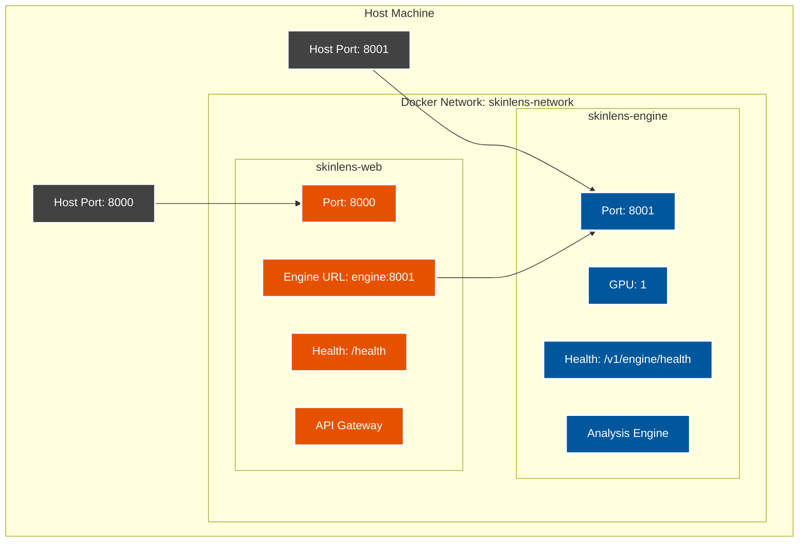
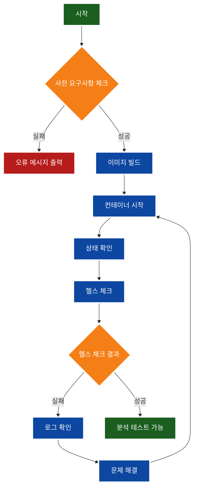
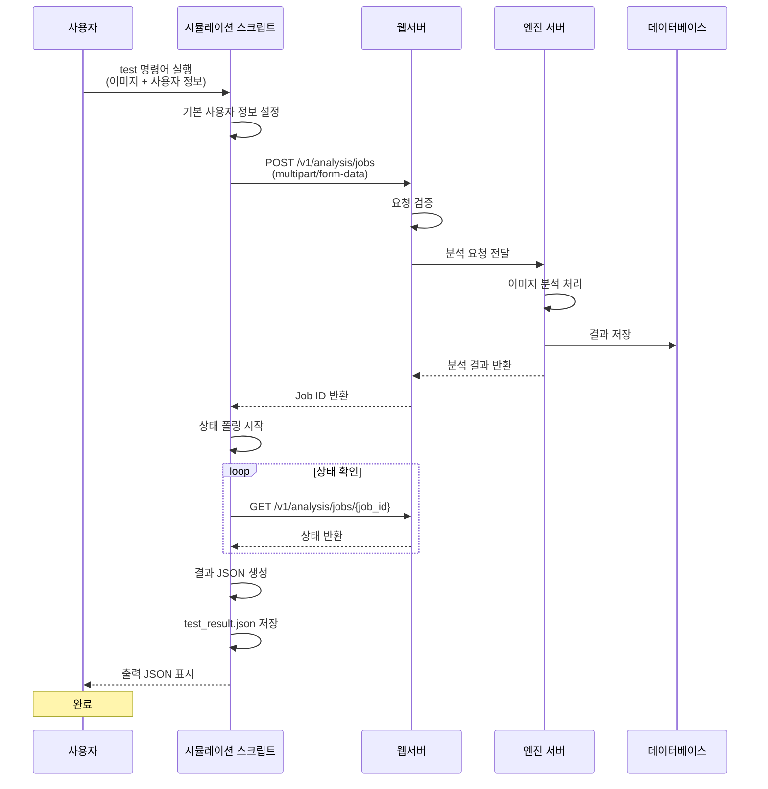

# Docker 시뮬레이션 가이드

## 개요

SkinLens Docker 시뮬레이션 스크립트(`scripts/docker_simulation.py`)는 Docker 컨테이너를 관리하고 테스트하는 단일 시뮬레이션 도구입니다. 이 스크립트를 사용하여 SkinLens 엔진 서버와 웹서버를 쉽게 배포, 테스트, 관리할 수 있습니다.

## 사전 요구사항

### 필수 요구사항
- **Docker**: 20.10+
- **Docker Compose**: 2.0+

### 선택적 요구사항
- **NVIDIA GPU**: GPU 가속을 위한 NVIDIA GPU 및 드라이버
- **NVIDIA Container Toolkit**: GPU 컨테이너 지원

### 사전 요구사항 체크

```bash
python simulation/docker_simulation.py check
```

이 명령어는 다음을 확인합니다:
- Docker 설치 여부
- Docker Compose 설치 여부
- NVIDIA GPU 가용성 (선택사항)
- 환경변수 파일 존재 여부

## 설치

### 1. 환경변수 파일 설정

```bash
# 예제 파일 복사
cp config/docker.env.example .env

# .env 파일 편집 (필요한 값 입력)
# JWT_SECRET_KEY, GEMINI_API_KEY 등
```

### 2. GPU 설정 (선택사항)

GPU가 있는 환경에서는 `ENABLE_GPU=true`로 설정합니다. GPU가 없는 환경에서는 `ENABLE_GPU=false`로 설정합니다.

```bash
# .env 파일
ENABLE_GPU=true
```

## 사용법

### 명령어 목록

| 명령어 | 설명 |
|--------|------|
| `check` | 사전 요구사항 체크 |
| `build` | Docker 이미지 빌드 |
| `start` | 컨테이너 시작 |
| `stop` | 컨테이너 중지 |
| `restart` | 컨테이너 재시작 |
| `status` | 컨테이너 상태 확인 |
| `logs` | 로그 확인 |
| `health` | 헬스 체크 |
| `test` | 분석 테스트 (이미지 + 사용자 정보) |
| `cleanup` | 정리 |
| `simulate` | 전체 시뮬레이션 자동화 |

### 상세 사용법

#### 1. 사전 요구사항 체크

```bash
python simulation/docker_simulation.py check
```

출력 예시:
```
============================================================
사전 요구사항 체크
============================================================
✓ Docker: Docker version 24.0.7
✓ Docker Compose: Docker Compose version v2.21.0
✓ NVIDIA GPU 감지됨
✓ .env 파일 존재
```

#### 2. 이미지 빌드

```bash
python simulation/docker_simulation.py build
```

#### 3. 컨테이너 시작

**전체 스택 시작:**
```bash
python simulation/docker_simulation.py start
```

**엔진 서버만 시작:**
```bash
python simulation/docker_simulation.py start --engine-only
```

#### 4. 컨테이너 상태 확인

```bash
python simulation/docker_simulation.py status
```

출력 예시:
```
NAME                COMMAND                  SERVICE             STATUS              PORTS
skinlens-engine     "python run_engine_s…"   skinlens-engine     running             0.0.0.0:8001->8001/tcp
skinlens-web        "python -m src.ser…"     skinlens-web        running             0.0.0.0:8000->8000/tcp
```

#### 5. 로그 확인

**전체 로그 확인:**
```bash
python simulation/docker_simulation.py logs
```

**특정 서비스 로그 확인:**
```bash
python simulation/docker_simulation.py logs --service skinlens-engine
```

**로그 팔로우 (실시간):**
```bash
python simulation/docker_simulation.py logs --follow
```

#### 6. 헬스 체크

```bash
python simulation/docker_simulation.py health
```

출력 예시:
```
============================================================
헬스 체크
============================================================
✓ 엔진 서버: Healthy
✓ 웹서버: Healthy
```

#### 7. 컨테이너 중지

```bash
python simulation/docker_simulation.py stop
```

#### 8. 컨테이너 재시작

```bash
python simulation/docker_simulation.py restart
```

#### 9. 분석 테스트

**기본 테스트 (기본 사용자 정보):**
```bash
python simulation/docker_simulation.py test --image /path/to/image.jpg
```

**사용자 정보 지정:**
```bash
python simulation/docker_simulation.py test \
  --image /path/to/image.jpg \
  --customer-id "cust_001" \
  --customer-name "홍길동" \
  --customer-contact "010-1234-5678" \
  --customer-address "서울시 강남구" \
  --gender "male" \
  --age 35
```

**출력 JSON 표시 안함:**
```bash
python simulation/docker_simulation.py test \
  --image /path/to/image.jpg \
  --no-output-json
```

출력 예시:
```
============================================================
분석 테스트
============================================================
테스트 이미지: /path/to/image.jpg
고객 ID: cust_001
고객명: 홍길동
성별: male
나이: 35

분석 요청 전송 중...
✓ 분석 요청 성공: Job ID = 550e8400-e29b-41d4-a716-446655440000

분석 진행 중...
  상태: queued (5s)
  상태: running (10s)
  상태: running (15s)
  상태: succeeded (120s)

✓ 분석 완료

============================================================
출력 JSON
============================================================
{
  "job_id": "550e8400-e29b-41d4-a716-446655440000",
  "status": "succeeded",
  "result": {
    "internal_analysis": {
      "original": {
        "overall_score": 72,
        "measurements": {
          "melasma_score": 75,
          "freckle_score": 80,
          ...
        }
      },
      "restored": {
        "overall_score": 78,
        ...
      }
    },
    "llm_analysis": {
      "original": {
        "overall_score": 74,
        ...
      }
    }
  }
}

✓ 결과 저장: /path/to/SkinLens v1/test_result.json
```

결과는 `test_result.json` 파일에도 저장됩니다.

#### 10. 정리

```bash
python simulation/docker_simulation.py cleanup
```

이 명령어는 다음을 수행합니다:
- 컨테이너 중지
- 볼륨 삭제
- 고아 컨테이너 삭제

#### 11. 전체 시뮬레이션

```bash
python simulation/docker_simulation.py simulate
```

이 명령어는 다음을 자동으로 수행합니다:
1. 사전 요구사항 체크
2. 이미지 빌드
3. 컨테이너 시작
4. 상태 확인
5. 헬스 체크

## 아키텍처

### 서비스 구성도



### 시뮬레이션 워크플로우



### 분석 테스트 데이터 흐름



### 볼륨 마운트 구조

```mermaid
graph LR
    subgraph "Host Filesystem"
        H1[jobs/]
        H2[models/]
        H3[config/]
        H4[logs/]
        H5[results/]
        H6[data/]
    end
    
    subgraph "skinlens-engine Container"
        E1[/app/jobs]
        E2[/app/models]
        E3[/app/config]
        E4[/app/logs]
    end
    
    subgraph "skinlens-web Container"
        W1[/app/jobs]
        W2[/app/results]
        W3[/app/data]
        W4[/app/config]
        W5[/app/logs]
    end
    
    H1 -.-> E1
    H1 -.-> W1
    H2 -.-> E2
    H3 -.-> E3
    H3 -.-> W4
    H4 -.-> E4
    H4 -.-> W5
    H5 -.-> W2
    H6 -.-> W3
    
    classDef host fill:#424242,stroke:#ffffff,stroke-width:2px,color:#ffffff
    classDef engine fill:#01579b,stroke:#ffffff,stroke-width:3px,color:#ffffff
    classDef web fill:#e65100,stroke:#ffffff,stroke-width:3px,color:#ffffff
    
    class H1,H2,H3,H4,H5,H6 host
    class E1,E2,E3,E4 engine
    class W1,W2,W3,W4,W5 web
```

### 서비스 구성

```
┌─────────────────────────────────────────────────────────┐
│                    Docker Network                       │
│                  skinlens-network                       │
├─────────────────────────────────────────────────────────┤
│                                                           │
│  ┌──────────────────────┐      ┌──────────────────────┐ │
│  │   skinlens-engine    │      │    skinlens-web      │ │
│  │                      │      │                      │ │
│  │  - Port: 8001        │◄────►│  - Port: 8000        │ │
│  │  - GPU: 1            │      │  - Engine URL:       │ │
│  │  - Health: /v1/...   │      │    engine:8001       │ │
│  │                      │      │  - Health: /health   │ │
│  └──────────────────────┘      └──────────────────────┘ │
│           ▲                              ▲              │
│           │                              │              │
│           └──────────────────────────────┘              │
│                      Host                                 │
│                  8000, 8001                             │
└─────────────────────────────────────────────────────────┘
```

### 볼륨 마운트

| 컨테이너 | 호스트 경로 | 컨테이너 경로 | 용도 |
|----------|-------------|---------------|------|
| skinlens-engine | ./jobs | /app/jobs | 작업 디렉토리 |
| skinlens-engine | ./models | /app/models | 모델 파일 |
| skinlens-engine | ./config | /app/config | 설정 파일 |
| skinlens-engine | ./logs | /app/logs | 로그 파일 |
| skinlens-web | ./jobs | /app/jobs | 작업 디렉토리 |
| skinlens-web | ./results | /app/results | 결과 파일 |
| skinlens-web | ./data | /app/data | 데이터베이스 |
| skinlens-web | ./config | /app/config | 설정 파일 |
| skinlens-web | ./logs | /app/logs | 로그 파일 |

## 환경변수

### 필수 환경변수

| 변수명 | 설명 | 기본값 | 비고 |
|--------|------|--------|------|
| `JWT_SECRET_KEY` | JWT 토큰 시크릿 키 | (없음) | 프로덕션에서 반드시 변경 |
| `GEMINI_API_KEY` | Gemini API 키 | (없음) | LLM 소견 생성에 필요 |

### 선택적 환경변수

| 변수명 | 설명 | 기본값 | 비고 |
|--------|------|--------|------|
| `ENABLE_GPU` | GPU 사용 여부 | `true` | GPU가 없는 환경에서는 `false` |
| `CORS_ORIGINS` | CORS 허용 오리진 | `http://localhost:3000,http://localhost:8000` | 콤마로 구분 |
| `SKIN_ANALYSIS_DB` | 데이터베이스 경로 | `/app/data/skin_analysis.db` | |
| `ENGINE_SERVER_HOST` | 엔진 서버 호스트 | `0.0.0.0` | |
| `ENGINE_SERVER_PORT` | 엔진 서버 포트 | `8001` | |
| `SERVER_HOST` | 웹서버 호스트 | `0.0.0.0` | |
| `SERVER_PORT` | 웹서버 포트 | `8000` | |
| `ENGINE_SERVER_URL` | 엔진 서버 URL | `http://skinlens-engine:8001` | 웹서버에서 사용 |

## 헬스 체크

### 엔진 서버 헬스 체크

```bash
curl http://localhost:8001/v1/engine/health
```

응답 예시:
```json
{
  "status": "healthy",
  "version": "1.0.0",
  "timestamp": "2026-06-03T05:48:00.000Z"
}
```

### 웹서버 헬스 체크

```bash
curl http://localhost:8000/health
```

응답 예시:
```json
{
  "status": "healthy",
  "version": "1.0.0",
  "timestamp": "2026-06-03T05:48:00.000Z"
}
```

## 문제 해결

### 1. GPU 관련 문제

**증상:** 컨테이너가 GPU를 인식하지 못함

**해결:**
```bash
# NVIDIA Container Toolkit 설치
distribution=$(. /etc/os-release;echo $ID$VERSION_ID)
curl -s -L https://nvidia.github.io/nvidia-docker/gpgkey | sudo apt-key add -
curl -s -L https://nvidia.github.io/nvidia-docker/$distribution/nvidia-docker.list | sudo tee /etc/apt/sources.list.d/nvidia-docker.list

sudo apt-get update
sudo apt-get install -y nvidia-container-toolkit

# Docker 재시작
sudo systemctl restart docker
```

### 2. 포트 충돌

**증상:** 컨테이너 시작 실패 (포트 이미 사용 중)

**해결:**
```bash
# 사용 중인 포트 확인
netstat -tulpn | grep -E ':(8000|8001)'

# 포트를 사용하는 프로세스 종료
sudo kill -9 <PID>

# 또는 docker-compose.yml에서 포트 변경
```

### 3. 메모리 부족

**증상:** 컨테이너가 OOM Killed로 종료됨

**해결:**
```bash
# Docker 메모리 제한 확인
docker system df

# 불필요한 컨테이너/이미지 정리
docker system prune -a

# 또는 docker-compose.yml에서 메모리 제한 설정
```

### 4. 권한 문제

**증상:** 볼륨 마운트 실패

**해결:**
```bash
# 디렉토리 권한 확인
ls -la jobs models config

# 권한 변경
chmod -R 755 jobs models config
```

## 로그

### 로그 위치

- **컨테이너 로그**: Docker json-file 드라이버
- **애플리케이션 로그**: `./logs` 디렉토리

### 로그 수집 설정

```yaml
logging:
  driver: "json-file"
  options:
    max-size: "10m"
    max-file: "3"
```

이 설정은 각 로그 파일을 최대 10MB로 제한하고, 최대 3개의 로그 파일을 보관합니다.

## 성능 최적화

### 1. GPU 활용

GPU가 있는 환경에서는 다음 설정을 확인하세요:

```bash
# .env 파일
ENABLE_GPU=true
```

### 2. 동시 작업 수

`config.json`에서 동시 작업 수를 조정할 수 있습니다:

```json
{
  "server": {
    "max_concurrent_jobs": 4
  },
  "engine_server": {
    "max_concurrent_jobs": 2
  }
}
```

### 3. 메모리 최적화

Docker Desktop에서 다음 설정을 확인하세요:
- Docker Desktop > Settings > Resources > Memory: 8GB+ 권장

## 보안

### 1. CORS 설정

프로덕션 환경에서는 CORS를 특정 도메인으로 제한하세요:

```bash
# .env 파일
CORS_ORIGINS=https://yourdomain.com
```

### 2. 시크릿 키

프로덕션 환경에서는 반드시 시크릿 키를 변경하세요:

```bash
# .env 파일
JWT_SECRET_KEY=your-strong-secret-key-here
```

### 3. 네트워크 격리

프로덕션 환경에서는 네트워크를 격리하는 것을 권장합니다:

```yaml
networks:
  skinlens-network:
    driver: bridge
    internal: false  # 외부 접근 필요 시 false
```

## 모니터링

### 컨테이너 리소스 모니터링

```bash
# 컨테이너 리소스 사용량 확인
docker stats

# 특정 컨테이너 리소스 확인
docker stats skinlens-engine skinlens-web
```

### 로그 모니터링

```bash
# 실시간 로그 모니터링
python simulation/docker_simulation.py logs --follow
```

## 백업 및 복구

### 데이터 백업

```bash
# 데이터 디렉토리 백업
tar -czf backup-$(date +%Y%m%d).tar.gz data results jobs

# 컨테이너 백업
docker commit skinlens-engine skinlens-engine:backup
docker commit skinlens-web skinlens-web:backup
```

### 데이터 복구

```bash
# 데이터 디렉토리 복구
tar -xzf backup-20260603.tar.gz
```

## 참고 문서

- [Docker 공식 문서](https://docs.docker.com/)
- [Docker Compose 공식 문서](https://docs.docker.com/compose/)
- [NVIDIA Container Toolkit](https://docs.nvidia.com/datacenter/cloud-native/container-toolkit/)
- [SkinLens 아키텍처 가이드](ARCHITECTURE.md)
- [SkinLens 배포 가이드](../ops/DEPLOYMENT_GUIDE.md)

## 변경 이력

| 버전 | 날짜 | 변경 내용 |
|------|------|----------|
| 1.0.0 | 2026-06-03 | 초기 버전 |
