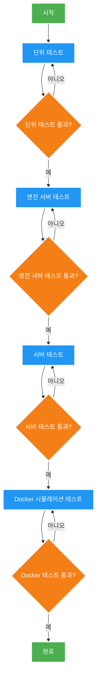
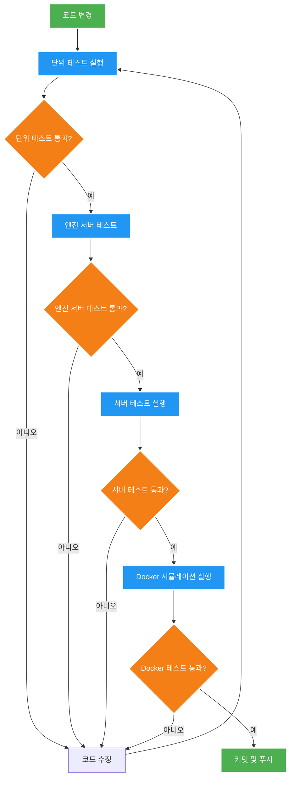
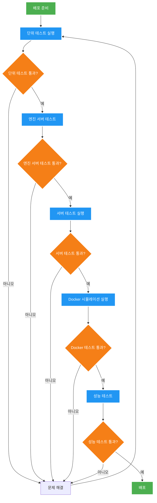
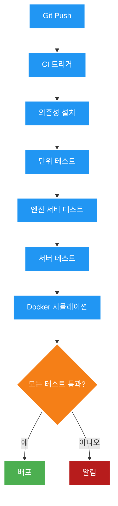

# 전체 테스트 및 시뮬레이션 종합 가이드

## 개요

이 가이드는 SkinLens 프로젝트의 전체 테스트 및 시뮬레이션 절차를 통합적으로 설명합니다. Docker 시뮬레이션, 서버 테스트, 단위 테스트 등 모든 테스트 유형을 포괄적으로 다룹니다.

## 목차

1. [테스트 및 시뮬레이션 유형](#테스트-및-시뮬레이션-유형)
2. [사전 요구사항](#사전-요구사항)
3. [빠른 시작](#빠른-시작)
4. [상세 절차](#상세-절차)
5. [통합 워크플로우](#통합-워크플로우)
6. [트러블슈팅](#트러블슈팅)
7. [CI/CD 통합](#cicd-통합)

---

## 테스트 및 시뮬레이션 유형

### 1. Docker 시뮬레이션

Docker 컨테이너를 사용하여 전체 시스템을 배포하고 테스트합니다.

**목적**:
- 컨테이너화된 환경에서 시스템 테스트
- 엔진 서버와 웹서버 통합 테스트
- 실제 배포 환경 시뮬레이션

**주요 기능**:
- Docker 컨테이너 관리 (빌드, 시작, 중지, 재시작)
- 헬스 체크
- 로그 확인
- 분석 테스트 (사용자 정보 + 이미지 입력)

**가이드**: [DOCKER_SIMULATION_GUIDE.md](DOCKER_SIMULATION_GUIDE.md)

### 2. 서버 테스트 시뮬레이션

서버 API 테스트를 자동화하여 실행합니다.

**목적**:
- FastAPI 서버 기능 테스트
- API 엔드포인트 테스트
- 인증 및 권한 테스트
- 통합 테스트

**주요 기능**:
- 환경 변수 자동 설정
- 의존성 확인
- 서버 테스트 실행 (test_server.py, test_auth_api.py, test_admin_api.py, test_health_api.py, test_orders_api.py)
- 커버리지 보고서 생성

**가이드**: [SERVER_TEST_GUIDE.md](SERVER_TEST_GUIDE.md)

### 3. 단위 테스트

개별 모듈 및 함수 테스트입니다.

**목적**:
- 개별 함수 테스트
- 데이터베이스 API 테스트
- CLI 테스트
- 복원 엔진 테스트

**주요 테스트 파일**:
- test_unit.py
- test_db_api.py
- test_db_cli.py
- test_recovery_engine.py
- test_pipeline_core.py

**가이드**: [tests/README.md](../tests/README.md)

---

## 사전 요구사항

### 필수 요구사항

**Python**:
- Python 3.10+
- pip

**Docker 시뮬레이션**:
- Docker 20.10+
- Docker Compose 2.0+

**선택적 요구사항**:
- NVIDIA GPU (GPU 가속을 위한 경우)
- NVIDIA Container Toolkit

### 의존성 설치

```bash
# 기본 의존성
pip install -r requirements-core.txt

# 테스트 의존성
pip install pytest pytest-asyncio pytest-cov httpx
```

### 환경 변수 설정

```bash
# Docker 시뮬레이션
cp config/docker.env.example .env
# .env 파일 편집 (JWT_SECRET_KEY, GEMINI_API_KEY 등)

# 서버 테스트
set JWT_SECRET_KEY=test-secret-for-ci
set SKIN_API_MAX_UPLOAD_BYTES=10485760
set ADMIN_PASSWORD=admin123
set ANALYST_PASSWORD=analyst123
```

---

## 빠른 시작

### 1. Docker 시뮬레이션 빠른 시작

```bash
# 사전 요구사항 체크
python simulation/docker_simulation.py check

# 전체 시뮬레이션 (빌드 + 시작 + 헬스 체크)
python simulation/docker_simulation.py simulate

# 분석 테스트
python simulation/docker_simulation.py test --image /path/to/image.jpg

# 정리
python simulation/docker_simulation.py cleanup
```

### 2. 서버 테스트 빠른 시작

```bash
# 서버 테스트 실행
simulation\run_server_tests.bat

# 또는 직접 실행
python -m pytest tests/test_server.py tests/test_auth_api.py tests/test_admin_api.py tests/test_health_api.py tests/test_orders_api.py -v
```

### 3. 전체 테스트 빠른 시작

```bash
# 전체 테스트 실행
scripts\run_all_tests.bat

# 또는 직접 실행
python -m pytest tests/ -v
```

---

## 전체 테스트 절차 다이어그램



---

## 상세 절차

### 절차 1: 단위 테스트

개별 모듈 및 함수 테스트를 먼저 수행합니다.

#### 1.1 전체 단위 테스트 실행

```bash
python -m pytest tests/test_unit.py tests/test_db_api.py tests/test_db_cli.py tests/test_recovery_engine.py tests/test_pipeline_core.py -v
```

#### 1.2 개별 테스트 실행

```bash
# 단위 테스트
python -m pytest tests/test_unit.py -v

# DB API 테스트
python -m pytest tests/test_db_api.py -v

# DB CLI 테스트
python -m pytest tests/test_db_cli.py -v

# 복원 엔진 테스트
python -m pytest tests/test_recovery_engine.py -v

# 파이프라인 코어 테스트
python -m pytest tests/test_pipeline_core.py -v
```

### 절차 2: 엔진 서버 테스트

엔진 서버의 기능을 테스트합니다.

#### 2.1 엔진 서버 시작

```bash
# 엔진 서버만 시작
python simulation/docker_simulation.py start --engine-only
```

#### 2.2 엔진 서버 헬스 체크

```bash
python simulation/docker_simulation.py health
```

#### 2.3 엔진 서버 테스트

```bash
# 엔진 서버 API 테스트
curl http://localhost:8001/v1/engine/health
```

### 절차 3: 서버 테스트

웹서버 API 테스트를 수행합니다.

#### 3.1 환경 설정

```bash
# 환경 변수 설정
set JWT_SECRET_KEY=test-secret-for-ci
set SKIN_API_MAX_UPLOAD_BYTES=10485760
set ADMIN_PASSWORD=admin123
set ANALYST_PASSWORD=analyst123
```

#### 3.2 의존성 확인

```bash
python -c "import pytest; import pytest_asyncio; import httpx"
```

#### 3.3 서버 테스트 실행

```bash
# 배치 파일 사용
simulation\run_server_tests.bat

# 또는 직접 실행
python -m pytest tests/test_server.py tests/test_auth_api.py tests/test_admin_api.py tests/test_health_api.py tests/test_orders_api.py -v
```

#### 3.4 개별 테스트 실행

```bash
# Core 서버 테스트
python -m pytest tests/test_server.py -v

# 인증 API 테스트
python -m pytest tests/test_auth_api.py -v

# 관리자 API 테스트
python -m pytest tests/test_admin_api.py -v

# 헬스 체크 API 테스트
python -m pytest tests/test_health_api.py -v

# 주문 API 테스트
python -m pytest tests/test_orders_api.py -v
```

#### 3.5 커버리지 확인

```bash
python -m pytest tests/test_server.py tests/test_auth_api.py tests/test_admin_api.py tests/test_health_api.py tests/test_orders_api.py --cov=src/server --cov-report=html
```

### 절차 4: Docker 시뮬레이션 테스트

웹서버와 엔진 서버의 연동을 Docker 컨테이너 환경에서 테스트합니다.

#### 4.1 사전 요구사항 체크

```bash
python simulation/docker_simulation.py check
```

**확인 항목**:
- Docker 설치 여부
- Docker Compose 설치 여부
- NVIDIA GPU 가용성 (선택사항)
- 환경변수 파일 존재 여부

#### 4.2 환경 설정

```bash
# 환경변수 파일 복사
cp config/docker.env.example .env

# .env 파일 편집
# JWT_SECRET_KEY=your-secret-key
# GEMINI_API_KEY=your-api-key
# ENABLE_GPU=true
```

#### 4.3 이미지 빌드

```bash
python simulation/docker_simulation.py build
```

#### 4.4 컨테이너 시작

```bash
# 전체 스택 시작 (엔진 서버 + 웹서버)
python simulation/docker_simulation.py start
```

#### 4.5 상태 확인

```bash
python simulation/docker_simulation.py status
```

#### 4.6 헬스 체크

```bash
python simulation/docker_simulation.py health
```

#### 4.7 분석 테스트

```bash
# 기본 테스트
python simulation/docker_simulation.py test --image /path/to/image.jpg

# 사용자 정보 지정
python simulation/docker_simulation.py test \
  --image /path/to/image.jpg \
  --customer-id "cust_001" \
  --customer-name "홍길동" \
  --gender "male" \
  --age 35
```

#### 4.8 로그 확인

```bash
# 전체 로그
python simulation/docker_simulation.py logs

# 특정 서비스 로그
python simulation/docker_simulation.py logs --service skinlens-engine

# 실시간 로그
python simulation/docker_simulation.py logs --follow
```

#### 4.9 정리

```bash
python simulation/docker_simulation.py cleanup
```

---

## 통합 워크플로우

### 워크플로우 1: 개발 환경 테스트



**실행 명령어**:
```bash
# 1. 단위 테스트
python -m pytest tests/test_unit.py tests/test_db_api.py tests/test_db_cli.py tests/test_recovery_engine.py tests/test_pipeline_core.py -v

# 2. 엔진 서버 테스트
python simulation/docker_simulation.py start --engine-only
python simulation/docker_simulation.py health
curl http://localhost:8001/v1/engine/health
python simulation/docker_simulation.py stop

# 3. 서버 테스트
simulation\run_server_tests.bat

# 4. Docker 시뮬레이션
python simulation/docker_simulation.py simulate
python simulation/docker_simulation.py test --image /path/to/test/image.jpg
python simulation/docker_simulation.py cleanup
```

### 워크플로우 2: 배포 전 테스트



**실행 명령어**:
```bash
# 1. 단위 테스트
python -m pytest tests/test_unit.py tests/test_db_api.py tests/test_db_cli.py tests/test_recovery_engine.py tests/test_pipeline_core.py -v

# 2. 엔진 서버 테스트
python simulation/docker_simulation.py start --engine-only
python simulation/docker_simulation.py health
curl http://localhost:8001/v1/engine/health
python simulation/docker_simulation.py stop

# 3. 서버 테스트
simulation\run_server_tests.bat

# 4. Docker 시뮬레이션
python simulation/docker_simulation.py simulate
python simulation/docker_simulation.py test --image /path/to/test/image.jpg
python simulation/docker_simulation.py cleanup

# 5. 성능 테스트 (선택사항)
# 성능 테스트 스크립트 실행
```

### 워크플로우 3: CI/CD 파이프라인



---

## 트러블슈팅

### Docker 시뮬레이션 문제

#### 1. GPU 관련 문제

**증상**: 컨테이너가 GPU를 인식하지 못함

**해결**:
```bash
# NVIDIA Container Toolkit 설치
distribution=$(. /etc/os-release;echo $ID$VERSION_ID)
curl -s -L https://nvidia.github.io/nvidia-docker/gpgkey | sudo apt-key add -
curl -s -L https://nvidia.github.io/nvidia-docker/$distribution/nvidia-docker.list | sudo tee /etc/apt/sources.list.d/nvidia-docker.list

sudo apt-get update
sudo apt-get install -y nvidia-container-toolkit

# Docker 재시작
sudo systemctl restart docker
```

#### 2. 포트 충돌

**증상**: 컨테이너 시작 실패 (포트 이미 사용 중)

**해결**:
```bash
# 사용 중인 포트 확인
netstat -tulpn | grep -E ':(8000|8001)'

# 포트를 사용하는 프로세스 종료
sudo kill -9 <PID>

# 또는 docker-compose.yml에서 포트 변경
```

#### 3. 메모리 부족

**증상**: 컨테이너가 OOM Killed로 종료됨

**해결**:
```bash
# Docker 메모리 제한 확인
docker system df

# 불필요한 컨테이너/이미지 정리
docker system prune -a
```

### 서버 테스트 문제

#### 1. 환경 변수 누락

**증상**: 환경 변수가 설정되지 않음

**해결**:
```bash
set JWT_SECRET_KEY=test-secret-for-ci
set SKIN_API_MAX_UPLOAD_BYTES=10485760
set ADMIN_PASSWORD=admin123
set ANALYST_PASSWORD=analyst123
```

#### 2. 의존성 누락

**증상**: 모듈을 찾을 수 없음

**해결**:
```bash
pip install pytest pytest-asyncio pytest-cov httpx
```

#### 3. 비동기 테스트 실패

**증상**: 비동기 테스트가 실패

**해결**: `@pytest.mark.asyncio` 데코레이터 추가

### 단위 테스트 문제

#### 1. 테스트 데이터 누락

**증상**: 테스트용 이미지 파일이 없음

**해결**: 테스트용 이미지를 `tests/fixtures/` 디렉토리에 배치

#### 2. 데이터베이스 잠금

**증상**: 데이터베이스가 잠겨 있어 테스트 실패

**해결**: 다른 프로세스에서 데이터베이스 사용 중인지 확인 후 종료

---

## CI/CD 통합

### GitHub Actions 예시

```yaml
name: Comprehensive Tests

on: [push, pull_request]

jobs:
  test:
    runs-on: ubuntu-latest
    
    steps:
      - uses: actions/checkout@v2
      
      - name: Set up Python
        uses: actions/setup-python@v2
        with:
          python-version: '3.10'
      
      - name: Install dependencies
        run: |
          pip install -r requirements-core.txt
          pip install pytest pytest-asyncio pytest-cov httpx
      
      - name: Set environment variables
        run: |
          export JWT_SECRET_KEY=test-secret-for-ci
          export SKIN_API_MAX_UPLOAD_BYTES=10485760
          export ADMIN_PASSWORD=admin123
          export ANALYST_PASSWORD=analyst123
      
      - name: Run unit tests
        run: |
          python -m pytest tests/test_unit.py tests/test_db_api.py tests/test_db_cli.py tests/test_recovery_engine.py tests/test_pipeline_core.py -v --cov=src
      
      - name: Run engine server tests
        run: |
          python simulation/docker_simulation.py start --engine-only
          python simulation/docker_simulation.py health
          curl http://localhost:8001/v1/engine/health
          python simulation/docker_simulation.py stop
      
      - name: Run server tests
        run: |
          python -m pytest tests/test_server.py tests/test_auth_api.py tests/test_admin_api.py tests/test_health_api.py tests/test_orders_api.py -v --cov=src/server
      
      - name: Set up Docker
        uses: docker/setup-buildx-action@v2
      
      - name: Build Docker images
        run: |
          docker-compose build
      
      - name: Run Docker simulation
        run: |
          docker-compose up -d
          docker-compose ps
          docker-compose logs
          docker-compose down -v
      
      - name: Upload coverage
        uses: codecov/codecov-action@v2
```

---

## 참고 문서

- [DOCKER_SIMULATION_GUIDE.md](DOCKER_SIMULATION_GUIDE.md): Docker 시뮬레이션 상세 가이드
- [SERVER_TEST_GUIDE.md](SERVER_TEST_GUIDE.md): 서버 테스트 상세 가이드
- [tests/README.md](../tests/README.md): 전체 테스트 가이드
- [PROJECT_OVERVIEW.md](../docs/PROJECT_OVERVIEW.md): 프로젝트 개요
- [DEVELOPMENT_GUIDE.md](../docs/guides/DEVELOPMENT_GUIDE.md): 개발 가이드

---

## 변경 이력

| 버전 | 날짜 | 변경 내용 |
|------|------|----------|
| 1.0.0 | 2026-06-03 | 초기 버전 |
